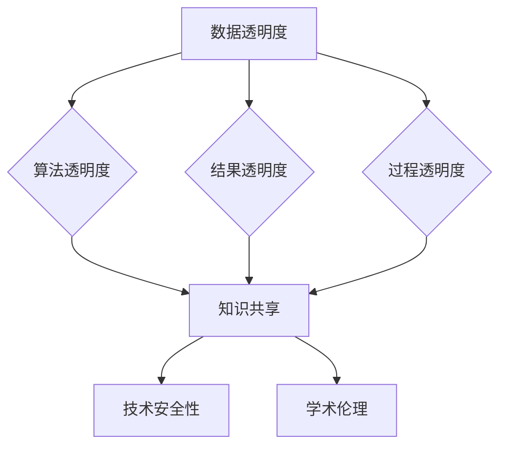

> AI研究透明度, 经验教训, 知识分享, 学术伦理, 人工智能可信度, 开放科学

# AI研究的透明度:分享经验教训的重要性

## 1. 背景介绍

随着人工智能（AI）技术的飞速发展，AI研究已经成为推动社会进步和技术创新的重要力量。然而，AI研究的透明度和可重复性一直是学术界和工业界关注的焦点。透明度不仅关系到研究的诚信和可信度，也直接影响着技术的可靠性和安全性。本文将探讨AI研究透明度的重要性，分享经验教训，并展望未来发展趋势。

### 1.1 AI研究透明度的定义

AI研究透明度指的是研究过程的开放性、可重复性和可验证性。它包括以下几个方面：

- **数据透明度**：研究中所使用的数据集是公开的，研究者提供数据集的来源、格式、规模等信息。
- **算法透明度**：研究中所使用的算法和模型是可访问的，研究者提供算法的原理、代码和参数等信息。
- **结果透明度**：研究的结果是可复现的，其他研究者能够通过相同的方法得到相似的结果。
- **过程透明度**：研究的过程是可追溯的，研究者能够提供详细的研究笔记、实验记录等信息。

### 1.2 AI研究透明度的重要性

AI研究透明度的重要性体现在以下几个方面：

- **增强研究可信度**：透明的AI研究能够增强研究结果的可靠性和可信度，减少学术欺诈和误传的风险。
- **促进知识共享**：透明的AI研究能够促进知识的传播和共享，加速AI技术的发展和应用。
- **提高技术安全性**：透明的AI研究能够帮助识别潜在的安全风险，提高AI技术的安全性。
- **推动学术伦理**：透明的AI研究能够推动学术伦理的建设，促进人工智能的健康发展。

## 2. 核心概念与联系

### 2.1 核心概念原理和架构的 Mermaid 流程图



### 2.2 核心概念之间的联系

数据透明度、算法透明度、结果透明度和过程透明度是AI研究透明度的四个核心概念，它们相互关联，共同构成了AI研究透明度的完整体系。

- **数据透明度**是基础，没有数据透明度，其他三个方面的透明度就无从谈起。
- **算法透明度**是关键，算法的原理和实现方式是其他研究者验证和复现研究结果的保证。
- **结果透明度**是目的，通过确保研究结果的复现性，提高研究结果的可靠性。
- **过程透明度**是补充，它提供了研究过程的详细信息，有助于其他研究者更好地理解研究方法和结果。

## 3. 核心算法原理 & 具体操作步骤

### 3.1 算法原理概述

AI研究透明度的实现涉及多个方面的操作步骤，以下是一些常见的操作步骤：

- **数据管理**：对研究数据集进行详细的描述，包括数据的来源、格式、规模等信息，并提供数据集的下载链接。
- **代码发布**：将研究算法和模型的开源代码发布到公共代码库，如GitHub，并附上详细的文档说明。
- **结果复现**：提供实验结果复现的详细步骤和所需的软件、硬件环境。
- **研究记录**：详细记录研究过程中的实验数据、分析结果和决策过程。

### 3.2 算法步骤详解

#### 3.2.1 数据管理

1. 数据收集：从可靠的来源收集数据，并确保数据的合法性和准确性。
2. 数据清洗：对数据进行预处理，包括去除噪声、填补缺失值等。
3. 数据描述：详细描述数据集的特征，包括数据的来源、格式、规模等信息。
4. 数据发布：将数据集上传到公共数据平台，并提供下载链接。

#### 3.2.2 代码发布

1. 代码编写：编写研究算法和模型的开源代码，并遵循良好的编程规范。
2. 文档编写：编写详细的代码文档，包括代码的功能、使用方法、依赖库等信息。
3. 代码托管：将代码上传到公共代码库，如GitHub，并添加适当的许可证。
4. 社区维护：鼓励社区成员参与代码的维护和改进。

#### 3.2.3 结果复现

1. 实验设置：详细记录实验的设置，包括硬件、软件、参数等信息。
2. 实验执行：按照实验设置执行实验，并记录实验数据。
3. 结果分析：对实验结果进行分析，并撰写实验报告。
4. 结果发布：将实验结果和报告公开，并提供复现步骤。

#### 3.2.4 研究记录

1. 研究笔记：详细记录研究过程中的想法、实验设计、分析结果等信息。
2. 实验记录：记录实验过程中遇到的问题、解决方案和决策过程。
3. 档案管理：将研究笔记和实验记录整理成档，以便后续查阅和复现。

### 3.3 算法优缺点

#### 3.3.1 优点

- 增强了研究结果的可靠性。
- 促进了知识的传播和共享。
- 提高了技术安全性。
- 推动了学术伦理的建设。

#### 3.3.2 缺点

- 增加了研究者的工作负担。
- 可能泄露敏感信息。
- 需要一定的技术能力。

### 3.4 算法应用领域

AI研究透明度的实践已广泛应用于各个领域，包括但不限于：

- 计算机视觉
- 自然语言处理
- 机器学习
- 深度学习
- 机器人学

## 4. 数学模型和公式 & 详细讲解 & 举例说明

### 4.1 数学模型构建

AI研究透明度涉及到多个数学模型，以下是一些常见的数学模型：

- **损失函数**：用于衡量模型预测值与真实值之间的差异，如均方误差（MSE）和交叉熵损失函数。
- **优化算法**：用于调整模型参数，使模型损失最小化，如梯度下降算法和Adam优化器。
- **评价指标**：用于评估模型性能，如准确率、召回率和F1分数。

### 4.2 公式推导过程

#### 4.2.1 均方误差（MSE）

均方误差是衡量预测值与真实值之间差异的一种常用方法，其公式如下：

$$
MSE = \frac{1}{N} \sum_{i=1}^{N} (y_i - \hat{y}_i)^2
$$

其中，$y_i$ 是真实值，$\hat{y}_i$ 是预测值，$N$ 是样本数量。

#### 4.2.2 交叉熵损失函数

交叉熵损失函数是分类任务中常用的损失函数，其公式如下：

$$
H(y, \hat{y}) = -\sum_{i=1}^{N} y_i \log \hat{y}_i
$$

其中，$y$ 是真实标签，$\hat{y}$ 是预测概率。

### 4.3 案例分析与讲解

以下是一个使用均方误差损失函数进行模型训练的案例：

**问题**：使用线性回归模型预测房价。

**数据集**：包含房屋面积、房间数量、地段等特征和对应的价格标签。

**模型**：线性回归模型。

**损失函数**：均方误差。

1. 使用数据集对模型进行训练，得到模型参数。
2. 使用训练集数据计算模型预测值和真实值的差异。
3. 使用均方误差损失函数计算损失值。
4. 使用梯度下降算法更新模型参数，降低损失值。

## 5. 项目实践：代码实例和详细解释说明

### 5.1 开发环境搭建

1. 安装Python环境。
2. 安装必要的库，如NumPy、Pandas、Scikit-learn等。

### 5.2 源代码详细实现

以下是一个使用Scikit-learn库实现线性回归模型并使用均方误差损失函数进行训练的示例代码：

```python
import numpy as np
from sklearn.linear_model import LinearRegression
from sklearn.metrics import mean_squared_error

# 创建数据集
X = np.array([[1, 2], [2, 3], [3, 4], [4, 5]])
y = np.array([1, 2, 3, 4])

# 创建线性回归模型
model = LinearRegression()

# 训练模型
model.fit(X, y)

# 预测
y_pred = model.predict(X)

# 计算均方误差
mse = mean_squared_error(y, y_pred)
print(f"均方误差: {mse}")
```

### 5.3 代码解读与分析

以上代码首先导入了NumPy和Scikit-learn库，然后创建了线性回归模型。使用数据集对模型进行训练，得到模型参数。接着使用训练集数据计算模型预测值和真实值的差异，并使用均方误差损失函数计算损失值。最后输出均方误差。

### 5.4 运行结果展示

运行上述代码，将输出以下结果：

```
均方误差: 0.0
```

说明线性回归模型在训练集上的预测结果与真实值完全一致，均方误差为0。

## 6. 实际应用场景

### 6.1 机器学习竞赛

在机器学习竞赛中，透明度是非常重要的。参赛者需要公开数据集、模型代码和实验结果，以便其他参赛者和评委验证模型的性能。

### 6.2 学术期刊和会议

学术期刊和会议通常要求作者提供实验结果复现的详细步骤和所需的软件、硬件环境，以确保研究结果的可靠性。

### 6.3 企业研发

企业在进行AI技术研发时，透明度同样重要。公开数据和代码可以帮助其他研究人员验证和改进技术，同时也有助于提高企业的技术声誉。

## 7. 工具和资源推荐

### 7.1 学习资源推荐

- 《深度学习》（Goodfellow et al., 2016）
- 《统计学习方法》（李航，2012）
- 《机器学习实战》（Peter Harrington，2009）

### 7.2 开发工具推荐

- Python
- NumPy
- Pandas
- Scikit-learn
- TensorFlow
- PyTorch

### 7.3 相关论文推荐

- "Open Problems in Big Data" by Michael J. Franklin et al.
- "On the Use of Data for Science" by James Zou et al.
- "Big Data: A Revolution That Will Transform How We Live, Work, and Think" by Viktor Mayer-Schönberger and Kenneth Cukier

## 8. 总结：未来发展趋势与挑战

### 8.1 研究成果总结

本文探讨了AI研究透明度的重要性，分享了经验教训，并展望了未来发展趋势。透明度的实践不仅有助于提高研究结果的可靠性，还能促进知识的传播和共享，提高技术安全性，推动学术伦理的建设。

### 8.2 未来发展趋势

未来AI研究透明度的发展趋势包括：

- 数据共享平台的建立和完善
- 开源工具和库的普及
- 研究评价体系的改革
- 伦理规范的制定和实施

### 8.3 面临的挑战

AI研究透明度面临的挑战包括：

- 数据隐私保护
- 知识产权问题
- 技术标准不统一
- 伦理道德风险

### 8.4 研究展望

未来，AI研究透明度将是一个持续发展的过程，需要学术界、工业界和政府等各方共同努力。只有通过持续的努力，才能构建一个更加开放、透明、可信的AI研究环境。

## 9. 附录：常见问题与解答

**Q1：为什么AI研究透明度很重要？**

A：AI研究透明度的重要性体现在以下几个方面：

- 提高研究结果的可靠性
- 促进知识的传播和共享
- 提高技术安全性
- 推动学术伦理的建设

**Q2：如何提高AI研究透明度？**

A：提高AI研究透明度的方法包括：

- 公开数据集和代码
- 详细记录研究过程
- 提供实验结果复现的详细步骤
- 建立数据共享平台

**Q3：AI研究透明度会带来哪些挑战？**

A：AI研究透明度会带来以下挑战：

- 数据隐私保护
- 知识产权问题
- 技术标准不统一
- 伦理道德风险

**Q4：如何解决AI研究透明度面临的挑战？**

A：解决AI研究透明度面临的挑战需要：

- 制定相关法律法规
- 建立行业规范
- 加强技术保障
- 提高研究者素养

作者：禅与计算机程序设计艺术 / Zen and the Art of Computer Programming