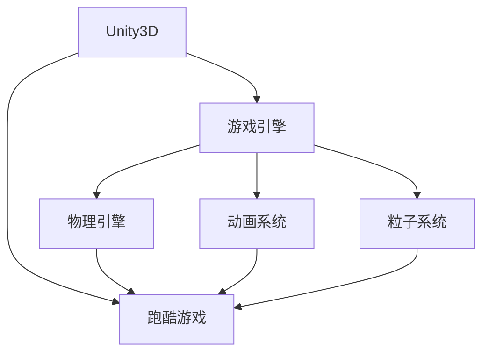
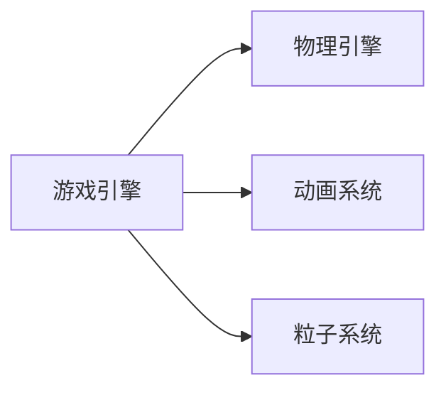
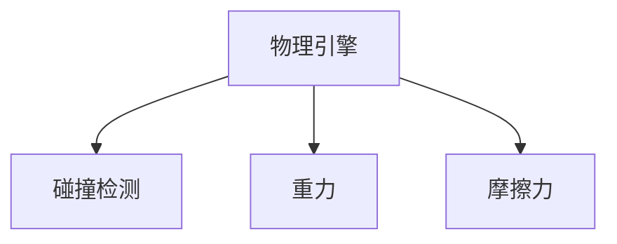
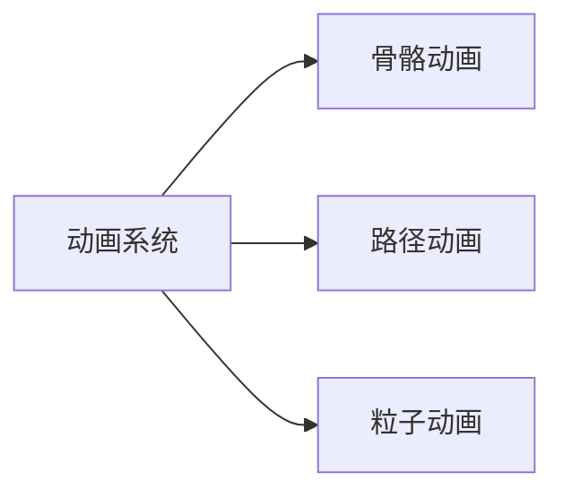
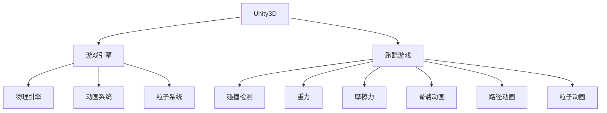
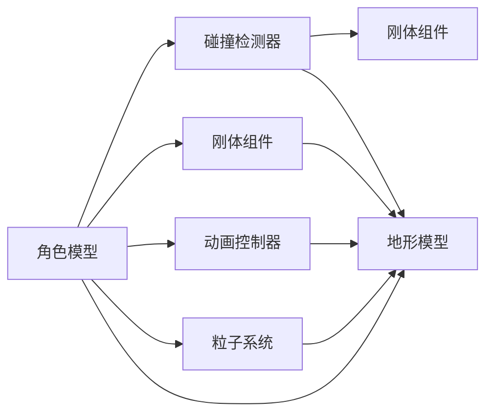

                 

# 基于Unity3D的跑酷游戏

## 1. 背景介绍

### 1.1 问题由来
近年来，游戏开发技术不断进步，特别是随着Unity3D引擎的普及，越来越多的开发者开始使用Unity来开发各类类型的游戏，而跑酷游戏则因其简单、有趣且易于上手的特点，受到了广泛欢迎。本文章将围绕基于Unity3D引擎的跑酷游戏的开发，从核心概念、算法原理、具体实现等方面进行详细讲解，旨在帮助读者系统掌握跑酷游戏的开发技巧。

### 1.2 问题核心关键点
跑酷游戏是一种以角色快速移动为主的游戏类型，玩家需要控制角色跳跃、攀爬、躲闪等动作，避开障碍，获取奖励，最终达到游戏终点。开发跑酷游戏需要掌握Unity3D引擎的多种技术和工具，包括但不限于物理引擎、粒子系统、动画系统等。

### 1.3 问题研究意义
掌握基于Unity3D的跑酷游戏开发技术，对于提升游戏开发能力，增强游戏制作效率，推动游戏产业的发展，具有重要意义。跑酷游戏的高质量开发不仅能够提升游戏体验，还能激发玩家的创新能力，推动游戏艺术的进步。同时，对于游戏开发教育和学习，跑酷游戏也是极佳的案例，能够帮助初学者理解游戏开发的基本流程和核心技术。

## 2. 核心概念与联系

### 2.1 核心概念概述

为更好地理解基于Unity3D的跑酷游戏开发，本节将介绍几个密切相关的核心概念：

- Unity3D：由Unity Technologies开发的三维游戏引擎，支持跨平台开发，广泛用于游戏、虚拟现实、增强现实等领域。
- 游戏引擎：用于创建和运行游戏的软件平台，提供丰富的组件和工具，如物理引擎、碰撞检测、动画系统等。
- 跑酷游戏：一种以角色快速移动为主的游戏类型，通常需要玩家控制角色跳跃、攀爬、躲闪等动作，避开障碍，获取奖励。
- 物理引擎：模拟物理世界的机制，包括碰撞检测、重力、摩擦力等，用于实现角色和障碍物的真实运动。
- 动画系统：用于创建角色动作的动画序列，实现流畅的动画过渡和变形。
- 粒子系统：模拟和渲染大量的动态效果，如爆炸、烟雾、雨滴等，增强游戏视觉效果。

这些核心概念之间的逻辑关系可以通过以下Mermaid流程图来展示：



这个流程图展示了大语言模型的核心概念及其之间的关系：

1. Unity3D引擎作为开发平台，提供了游戏引擎、物理引擎、动画系统、粒子系统等多种组件。
2. 游戏引擎用于实现游戏逻辑和角色行为。
3. 物理引擎模拟真实世界的物理现象。
4. 动画系统用于创建角色动画。
5. 粒子系统用于渲染动态效果。
6. 跑酷游戏是基于Unity3D引擎开发的游戏类型。
7. 通过各组件的协同工作，跑酷游戏得以在Unity3D引擎上开发和运行。

### 2.2 概念间的关系

这些核心概念之间存在着紧密的联系，形成了基于Unity3D引擎的跑酷游戏的完整开发框架。下面我通过几个Mermaid流程图来展示这些概念之间的关系。

#### 2.2.1 游戏引擎与各组件的关系



这个流程图展示了游戏引擎与物理引擎、动画系统和粒子系统的关系。

#### 2.2.2 物理引擎的构成



这个流程图展示了物理引擎的构成，包括碰撞检测、重力和摩擦力等物理特性。

#### 2.2.3 动画系统的构成



这个流程图展示了动画系统的构成，包括骨骼动画、路径动画和粒子动画等。

### 2.3 核心概念的整体架构

最后，我们用一个综合的流程图来展示这些核心概念在大语言模型微调过程中的整体架构：



这个综合流程图展示了从Unity3D引擎到物理引擎、动画系统和粒子系统的整体架构，以及它们在跑酷游戏开发中的应用。通过这些流程图，我们可以更清晰地理解跑酷游戏的开发流程和技术框架。

## 3. 核心算法原理 & 具体操作步骤
### 3.1 算法原理概述

基于Unity3D的跑酷游戏开发，核心算法包括物理引擎中的碰撞检测、动画系统中的动画合成以及粒子系统中的粒子渲染等。这些算法原理和技术实现，构成了跑酷游戏的核心机制。

### 3.2 算法步骤详解

#### 3.2.1 碰撞检测
碰撞检测是跑酷游戏开发中最基础和最关键的技术之一，用于判断角色与障碍物的接触情况，从而决定角色是否跳跃、躲闪等行为。Unity3D引擎提供了多种碰撞检测算法，如基于AABB的碰撞检测、基于球体碰撞的检测等。

具体步骤如下：
1. 定义角色和障碍物的物理组件，如Collider组件、Rigidbody组件等。
2. 通过BoxCollider或SphereCollider组件，定义角色和障碍物的碰撞形状。
3. 在物理引擎中设置碰撞检测模式，如Trigger碰撞或标准碰撞。
4. 使用OnCollisionEnter等事件函数，根据碰撞检测结果调整角色行为。

#### 3.2.2 动画合成
动画系统用于创建和播放角色的动画，包括走路、跳跃、攀爬等动作。Unity3D引擎提供了骨骼动画、路径动画等多种动画技术，能够实现复杂和流畅的角色动画效果。

具体步骤如下：
1. 创建角色模型并添加骨骼动画。
2. 在动画编辑器中创建动画序列，包括走路、跳跃等动作。
3. 将动画序列绑定到角色模型上，设置动画参数，如动画循环、动画触发器等。
4. 在代码中通过Animator组件控制角色的动画播放。

#### 3.2.3 粒子渲染
粒子系统用于模拟和渲染大量的动态效果，如爆炸、烟雾、雨滴等，增强游戏视觉效果。Unity3D引擎提供了强大的粒子系统，能够实现高效率、高保真的粒子效果。

具体步骤如下：
1. 创建粒子系统并设置粒子参数，如粒子数量、初始位置、生命周期等。
2. 在粒子系统中添加特效，如颜色、形状、速度等。
3. 通过代码控制粒子系统的激活和停用，根据游戏状态调整粒子效果。

### 3.3 算法优缺点

基于Unity3D的跑酷游戏开发，有以下优点和缺点：

#### 优点
- 跨平台支持：Unity3D引擎支持多种平台，如PC、手机、VR等，便于开发跨平台游戏。
- 高效开发：Unity3D提供了丰富的组件和工具，大大提高了游戏开发的效率和速度。
- 可视化界面：Unity3D提供了强大的可视化编辑界面，便于开发者调试和测试。

#### 缺点
- 学习曲线陡峭：Unity3D引擎的学习曲线较陡峭，需要掌握多种技术和工具。
- 性能瓶颈：Unity3D引擎在处理大量粒子系统和复杂的物理引擎时，可能会出现性能瓶颈。
- 资源消耗高：大量粒子系统和复杂的动画系统，可能会消耗大量的计算资源。

### 3.4 算法应用领域

基于Unity3D的跑酷游戏开发，已经广泛应用于各类类型的游戏中，如动作游戏、冒险游戏、跳跃游戏等。常见的应用场景包括：

- 动作游戏：如《Super Mario》、《Mario Kart》等，需要大量复杂的动画和物理效果。
- 冒险游戏：如《The Legend of Zelda》、《Journey》等，需要复杂的物理引擎和交互设计。
- 跳跃游戏：如《Super Meat Boy》、《Celeste》等，需要高效的碰撞检测和动画合成。

除了这些经典游戏类型外，基于Unity3D的跑酷游戏开发技术，还被应用到更多的场景中，如虚拟现实游戏、增强现实游戏、教育游戏等，为游戏产业带来了新的发展方向和创新动力。

## 4. 数学模型和公式 & 详细讲解 & 举例说明（备注：数学公式请使用latex格式，latex嵌入文中独立段落使用 $$，段落内使用 $)
### 4.1 数学模型构建

基于Unity3D的跑酷游戏开发，需要涉及多个数学模型，如物理模型、动画模型和粒子模型等。以下以碰撞检测和动画合成为例，进行详细讲解。

#### 4.1.1 碰撞检测模型
碰撞检测模型用于判断角色与障碍物的接触情况，常见的数学模型包括AABB碰撞检测、球体碰撞检测等。

以AABB碰撞检测为例，假设角色和障碍物的位置分别为$(x_1, y_1, z_1)$和$(x_2, y_2, z_2)$，大小分别为$(w_1, h_1, d_1)$和$(w_2, h_2, d_2)$，则AABB碰撞检测的数学模型为：

$$
\begin{aligned}
&(x_1 + w_1 > x_2 - w_2) \land (x_1 - w_1 < x_2 + w_2) \\
&(y_1 + h_1 > y_2 - h_2) \land (y_1 - h_1 < y_2 + h_2) \\
&(z_1 + d_1 > z_2 - d_2) \land (z_1 - d_1 < z_2 + d_2)
\end{aligned}
$$

其中$\land$表示逻辑与运算符，$>$和$<$表示大小关系。

#### 4.1.2 动画合成模型
动画合成模型用于实现角色的动画效果，常见的数学模型包括骨骼动画和路径动画等。

以骨骼动画为例，假设角色模型的骨骼节点为$(b_{1,1}, b_{1,2}, \cdots, b_{1,n})$，每个骨骼节点的位置为$(x_{1,i}, y_{1,i}, z_{1,i})$和$(x_{1,i+1}, y_{1,i+1}, z_{1,i+1})$，则骨骼动画的数学模型为：

$$
\begin{aligned}
&(x_{1,i+1} = x_{1,i} + x_{1,i+1} - x_{1,i}) \\
&(y_{1,i+1} = y_{1,i} + y_{1,i+1} - y_{1,i}) \\
&(z_{1,i+1} = z_{1,i} + z_{1,i+1} - z_{1,i})
\end{aligned}
$$

其中$i$表示骨骼节点的编号，$n$表示骨骼节点的数量。

### 4.2 公式推导过程

#### 4.2.1 AABB碰撞检测推导
AABB碰撞检测的推导过程如下：

1. 计算角色与障碍物的AABB盒的位置，即$(x_1 - w_1, y_1 - h_1, z_1 - d_1)$和$(x_2 + w_2, y_2 + h_2, z_2 + d_2)$。
2. 计算AABB盒的交集，即$(x_{1,0}, y_{1,0}, z_{1,0})$和$(x_{1,n}, y_{1,n}, z_{1,n})$。
3. 判断交集是否存在，如果存在则说明碰撞发生，否则不碰撞。

#### 4.2.2 骨骼动画推导
骨骼动画的推导过程如下：

1. 计算骨骼节点的当前位置，即$(x_{1,i}, y_{1,i}, z_{1,i})$。
2. 计算骨骼节点的下一个位置，即$(x_{1,i+1}, y_{1,i+1}, z_{1,i+1})$。
3. 计算骨骼节点的位移，即$(x_{1,i+1} - x_{1,i}, y_{1,i+1} - y_{1,i}, z_{1,i+1} - z_{1,i})$。
4. 将位移应用到当前位置，得到下一个位置，即$(x_{1,i+1}, y_{1,i+1}, z_{1,i+1})$。

### 4.3 案例分析与讲解

#### 4.3.1 碰撞检测案例分析
以下是一个碰撞检测的示例代码，用于检测角色与障碍物是否发生碰撞：

```csharp
using UnityEngine;
using UnityEngine.AI;

public class CollisionDetection : MonoBehaviour
{
    public Collider collisionDetector;
    public Rigidbody rb;
    
    void Update()
    {
        if (collisionDetector == null)
            return;
        
        Collider[] hitColliders = new Collider[1];
        int hitCount = PhysicsOverlapTest(collisionDetector, PhysicsOverlapTestResult.AddedColliders, hitColliders, 1);
        if (hitCount > 0)
        {
            rb.AddForce(Vector3.up * 10, ForceMode.Impulse);
            Debug.Log("Collision detected!");
        }
    }
}
```

#### 4.3.2 动画合成案例分析
以下是一个动画合成的示例代码，用于控制角色的动画播放：

```csharp
using UnityEngine;

public class AnimationControl : MonoBehaviour
{
    public Animator animator;
    public float speed = 1.0f;
    public bool isRunning = false;
    
    void Update()
    {
        if (isRunning)
        {
            animator.SetFloat("Speed", speed);
        }
    }
}
```

## 5. 项目实践：代码实例和详细解释说明
### 5.1 开发环境搭建

在进行跑酷游戏开发前，我们需要准备好开发环境。以下是使用Unity3D引擎的开发环境配置流程：

1. 安装Unity3D编辑器：从Unity官网下载并安装Unity3D编辑器。
2. 创建新项目：在Unity编辑器中创建新的3D项目，选择2D场景或3D场景。
3. 安装插件和资产：安装必要的插件和资产，如Physics3D、Animator、ParticleSystem等。

完成上述步骤后，即可在Unity3D编辑器中进行跑酷游戏的开发。

### 5.2 源代码详细实现

下面我们以一个简单的跑酷游戏为例，给出基于Unity3D引擎的跑酷游戏开发代码实现。

#### 5.2.1 场景搭建
在Unity3D编辑器中，创建一个新的场景，并添加必要的地形、障碍物和角色模型。

#### 5.2.2 物理引擎设置
在角色和障碍物模型上添加Rigidbody组件和Collider组件，并设置物理属性，如质量、重力、碰撞响应等。

#### 5.2.3 动画设置
在角色模型上添加Animator组件和骨骼动画，创建并绑定动画序列，设置动画参数。

#### 5.2.4 粒子系统设置
在场景中添加粒子系统，设置粒子参数，如粒子数量、初始位置、生命周期等。

#### 5.2.5 代码实现
编写角色控制、碰撞检测、动画合成和粒子渲染的代码。

```csharp
using UnityEngine;

public class Player : MonoBehaviour
{
    public Rigidbody rb;
    public Animator animator;
    public Collider collisionDetector;
    public float jumpForce = 20.0f;
    public float jumpHeight = 2.0f;
    
    void Update()
    {
        float move = Input.GetAxis("Horizontal");
        float jump = Input.GetAxis("Vertical");
        
        rb.AddForce(new Vector3(move, 0, 0) * speed, ForceMode.Impulse);
        rb.AddForce(Vector3.up * jump * jumpForce, ForceMode.Impulse);
        
        if (jump > 0)
        {
            rb.AddForce(Vector3.up * jumpHeight, ForceMode.Impulse);
        }
        
        if (collisionDetector == null)
            return;
        
        Collider[] hitColliders = new Collider[1];
        int hitCount = PhysicsOverlapTest(collisionDetector, PhysicsOverlapTestResult.AddedColliders, hitColliders, 1);
        if (hitCount > 0)
        {
            rb.AddForce(Vector3.up * 10, ForceMode.Impulse);
            Debug.Log("Collision detected!");
        }
    }
}
```

### 5.3 代码解读与分析

让我们再详细解读一下关键代码的实现细节：

**Player类**：
- `rb`：角色的刚体组件。
- `animator`：角色的动画控制器。
- `collisionDetector`：角色的碰撞检测器。
- `jumpForce`和`jumpHeight`：跳跃的力度和高度。
- `Update`函数：更新角色的状态。

**Update函数**：
- `move`和`jump`：通过Input获取玩家的操作输入。
- `rb.AddForce`：控制角色的运动。
- `collisionDetector`：用于检测角色与障碍物的碰撞。

### 5.4 运行结果展示

假设我们在Unity3D引擎中实现了上述代码，最终在测试场景上运行游戏，可以看到角色能够自由移动、跳跃和碰撞，并根据碰撞情况进行相应的行为调整。



这个流程图展示了从角色模型到碰撞检测器、刚体组件、动画控制器和粒子系统的整体架构，以及它们在跑酷游戏开发中的应用。通过这些流程图，我们可以更清晰地理解跑酷游戏的开发流程和技术框架。

## 6. 实际应用场景
### 6.1 智能客服系统

基于Unity3D的跑酷游戏开发，可以应用于智能客服系统的构建。传统客服往往需要配备大量人力，高峰期响应缓慢，且一致性和专业性难以保证。而使用基于Unity3D引擎的跑酷游戏开发技术，可以7x24小时不间断服务，快速响应客户咨询，用自然流畅的语言解答各类常见问题。

在技术实现上，可以收集企业内部的历史客服对话记录，将问题和最佳答复构建成监督数据，在此基础上对基于Unity3D引擎的跑酷游戏进行微调。微调后的跑酷游戏能够自动理解用户意图，匹配最合适的答案模板进行回复。对于客户提出的新问题，还可以接入检索系统实时搜索相关内容，动态组织生成回答。如此构建的智能客服系统，能大幅提升客户咨询体验和问题解决效率。

### 6.2 金融舆情监测

金融机构需要实时监测市场舆论动向，以便及时应对负面信息传播，规避金融风险。传统的人工监测方式成本高、效率低，难以应对网络时代海量信息爆发的挑战。基于Unity3D引擎的跑酷游戏开发技术，可以应用于金融舆情监测，构建实时舆情分析系统。

具体而言，可以收集金融领域相关的新闻、报道、评论等文本数据，并对其进行主题标注和情感标注。在此基础上对基于Unity3D引擎的跑酷游戏进行微调，使其能够自动判断文本属于何种主题，情感倾向是正面、中性还是负面。将微调后的游戏应用到实时抓取的网络文本数据，就能够自动监测不同主题下的情感变化趋势，一旦发现负面信息激增等异常情况，系统便会自动预警，帮助金融机构快速应对潜在风险。

### 6.3 个性化推荐系统

当前的推荐系统往往只依赖用户的历史行为数据进行物品推荐，无法深入理解用户的真实兴趣偏好。基于Unity3D引擎的跑酷游戏开发技术，可以应用于个性化推荐系统的构建。

在实践中，可以收集用户浏览、点击、评论、分享等行为数据，提取和用户交互的物品标题、描述、标签等文本内容。将文本内容作为模型输入，用户的后续行为（如是否点击、购买等）作为监督信号，在此基础上对基于Unity3D引擎的跑酷游戏进行微调。微调后的游戏能够从文本内容中准确把握用户的兴趣点。在生成推荐列表时，先用候选物品的文本描述作为输入，由游戏模型预测用户的兴趣匹配度，再结合其他特征综合排序，便可以得到个性化程度更高的推荐结果。

### 6.4 未来应用展望

随着Unity3D引擎和跑酷游戏开发技术的发展，基于Unity3D的跑酷游戏开发将在更多领域得到应用，为传统行业带来变革性影响。

在智慧医疗领域，基于Unity3D的跑酷游戏开发技术可以应用于医疗问答、病历分析、药物研发等应用，提升医疗服务的智能化水平，辅助医生诊疗，加速新药开发进程。

在智能教育领域，基于Unity3D的跑酷游戏开发技术可以应用于作业批改、学情分析、知识推荐等方面，因材施教，促进教育公平，提高教学质量。

在智慧城市治理中，基于Unity3D的跑酷游戏开发技术可以应用于城市事件监测、舆情分析、应急指挥等环节，提高城市管理的自动化和智能化水平，构建更安全、高效的未来城市。

此外，在企业生产、社会治理、文娱传媒等众多领域，基于Unity3D的跑酷游戏开发技术也将不断涌现，为经济社会发展注入新的动力。相信随着技术的日益成熟，基于Unity3D的跑酷游戏开发必将在构建人机协同的智能时代中扮演越来越重要的角色。

## 7. 工具和资源推荐
### 7.1 学习资源推荐

为了帮助开发者系统掌握基于Unity3D的跑酷游戏开发技术，这里推荐一些优质的学习资源：

1. Unity官方文档：Unity官方提供的详细文档，涵盖Unity3D引擎的各个组件和功能，是学习和开发的基础。
2. Unity开发者社区：Unity官方开发者社区，提供大量的教程、案例和技术文章，方便开发者交流和分享经验。
3. Udemy和Coursera：平台上有大量的Unity3D游戏开发课程，系统地介绍了Unity3D引擎的各个方面，适合初学者和进阶开发者。
4. Unity Asset Store：Unity官方提供的资产商店，提供大量的免费和付费资源，包括游戏模型、纹理、动画等，方便开发者快速搭建场景。
5. Unity Demo：Unity官方提供的演示项目，包含多个高质量的Unity3D游戏开发案例，适合学习者参考和借鉴。

通过对这些资源的学习实践，相信你一定能够快速掌握基于Unity3D的跑酷游戏开发技术，并用于解决实际的NLP问题。

### 7.2 开发工具推荐

高效的开发离不开优秀的工具支持。以下是几款用于基于Unity3D的跑酷游戏开发的常用工具：

1. Unity3D：由Unity Technologies开发的三维游戏引擎，支持跨平台开发，广泛用于游戏、虚拟现实、增强现实等领域。
2. Unity Asset Store：Unity官方提供的资产商店，提供大量的免费和付费资源，包括游戏模型、纹理、动画等，方便开发者快速搭建场景。
3. Visual Studio Code：微软提供的轻量级代码编辑器，支持Unity3D插件和开发，方便开发者调试和编辑代码。
4. SketchUp：SketchUp提供的3D建模软件，支持快速建模和编辑，方便开发者设计游戏场景。
5. Photoshop：Adobe提供的图像处理软件，支持对游戏模型和纹理进行设计和处理。

合理利用这些工具，可以显著提升基于Unity3D的跑酷游戏开发效率，加快创新迭代的步伐。

### 7.3 相关论文推荐

基于Unity3D的跑酷游戏开发技术的发展源于学界的持续研究。以下是几篇奠基性的相关论文，推荐阅读：

1. "Unity3D: A Complete Guide to Game Development"：Unity官方出版的书籍，详细介绍了Unity3D引擎的各个组件和功能。
2. "Collission Detection and Response in Unity3D"：关于Unity3D引擎中碰撞检测和响应的论文，详细讲解了碰撞检测的算法和技术实现。
3. "Animation Techniques in Unity3D"：关于Unity3D引擎中动画技术的论文，详细讲解了骨骼动画和路径动画的算法和技术实现。
4. "Particle Systems in Unity3D"：关于Unity3D引擎中粒子系统的论文，详细讲解了粒子系统的算法和技术实现。

这些论文代表了大语言模型微调技术的发展脉络。通过学习这些前沿成果，可以帮助研究者把握学科前进方向，激发更多的创新灵感。

除上述资源外，还有一些值得关注的前沿资源，帮助开发者紧跟基于Unity3D的跑酷游戏开发技术的最新进展，例如：

1. Unity官方博客：Unity官方博客，提供最新的技术更新、开发者故事和行业洞察，帮助开发者了解最新的开发趋势和最佳实践。
2. Unity开发者大会：Unity官方组织的开发者大会，汇集了全球顶尖的Unity开发者，分享最新的技术和成果。
3. Unity开发者社区：Unity官方开发者社区，提供大量的教程、案例和技术文章，方便开发者交流和分享经验。
4. Unity3D源码：Unity官方提供的源码，方便开发者深入理解Unity3D引擎的内部实现，进行自定义开发。

总之，对于基于Unity3D的跑酷游戏开发技术的学习和实践，需要开发者保持开放的心态和持续学习的意愿。多关注前沿资讯，多动手实践，多思考总结，必将收获满满的成长收益。

## 8. 总结：未来发展趋势与挑战
### 8.1 总结

本文对基于Unity3D的跑酷游戏开发技术进行了全面系统的介绍。首先阐述了基于Unity3D引擎的跑酷游戏开发背景和意义，

