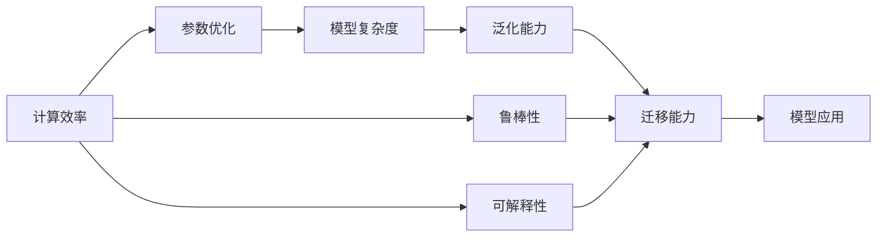

                 

# 基础模型的改进与影响力

## 1. 背景介绍

在人工智能（AI）和机器学习（ML）的迅猛发展中，基础模型的改进不断推动着技术进步和应用创新。近年来，无论是深度学习（Deep Learning）中的卷积神经网络（CNN）、循环神经网络（RNN），还是自然语言处理（NLP）中的语言模型，都在不断地被优化和改进，以实现更高效、更准确、更广泛的适应性。这些改进不仅提升了模型的性能，还拓展了其应用领域，推动了各行各业数字化转型的进程。

### 1.1 问题由来

基础模型的改进通常源于对现有模型在特定任务上的局限性进行深入分析，并基于新的理论或实践发现，提出优化方案。例如，深度学习的经典模型AlexNet在2012年赢得ImageNet竞赛冠军，但其计算量大、参数多、训练复杂等问题迅速引起关注。随后，ResNet、Inception、Batch Normalization等改进层出不穷，显著提升了模型效率和性能。类似地，在NLP领域，LSTM、GRU等改进模型，以及BERT、GPT等语言模型，通过引入更多的参数和计算资源，提升了自然语言理解和生成能力。

### 1.2 问题核心关键点

基础模型的改进通常围绕以下几个关键点进行：

1. **计算效率**：如何在保证模型性能的同时，减少计算资源消耗。
2. **参数优化**：如何在增加模型复杂性的同时，保持或提高泛化能力。
3. **可解释性**：如何增强模型的可解释性，以便于理解和调试。
4. **鲁棒性**：如何提高模型对噪声、对抗样本等干扰的鲁棒性。
5. **迁移能力**：如何在不同任务间进行知识迁移，提升跨领域适应性。

这些关键点的解决，不仅提升了模型的实际应用效果，还推动了相关领域的技术进步。

### 1.3 问题研究意义

基础模型的改进不仅推动了特定领域的技术进步，还为整个AI领域的技术创新奠定了基础。例如，在计算机视觉领域，改进后的模型提升了图像识别和物体检测的准确性和实时性，应用于无人驾驶、医疗影像分析等领域。在自然语言处理领域，改进后的语言模型增强了语义理解能力和生成能力，应用于机器翻译、智能客服、情感分析等任务，极大地提升了用户体验和效率。因此，基础模型的改进对于推动AI技术的广泛应用和产业化具有重要意义。

## 2. 核心概念与联系

### 2.1 核心概念概述

要理解基础模型的改进，首先需要了解几个核心概念：

1. **计算效率**：指模型在执行推理时的计算资源消耗，包括时间、空间和能耗等方面。
2. **参数优化**：指在增加模型复杂性的同时，如何优化模型参数，以提高模型性能。
3. **可解释性**：指模型输出的解释是否容易理解，是否能够被人类或机器解释。
4. **鲁棒性**：指模型对于输入数据的扰动（如噪声、对抗样本等）的抗干扰能力。
5. **迁移能力**：指模型在不同任务之间的知识迁移能力，能否有效利用预训练的知识。

这些概念之间存在紧密联系，例如，计算效率和参数优化往往相互制约；可解释性和鲁棒性则与模型的复杂度和抽象程度有关。因此，改进基础模型需要综合考虑这些因素，找到平衡点。

### 2.2 概念间的关系

这些核心概念之间的关系可以通过以下Mermaid流程图来展示：



这个流程图展示了大语言模型改进中，各个概念之间的关系：

1. **计算效率和参数优化**：通过参数优化可以提升模型性能，但同时也会增加计算复杂度。
2. **模型复杂度与泛化能力**：模型复杂度增加可能会提高泛化能力，但也需要更多的计算资源。
3. **鲁棒性与可解释性**：增加模型的鲁棒性可能牺牲可解释性，反之亦然。
4. **迁移能力与计算效率**：迁移能力强的模型可能计算效率低，反之亦然。

这些概念共同构成了基础模型改进的整体框架，指导着模型优化和实际应用中的决策。

## 3. 核心算法原理 & 具体操作步骤
### 3.1 算法原理概述

基础模型的改进通常基于对现有模型在特定任务上的局限性进行深入分析，并提出相应的优化方案。改进算法的主要目标是通过增加或调整模型的结构和参数，提升其在特定任务上的性能，同时保持或提升模型的泛化能力和计算效率。

### 3.2 算法步骤详解

基础模型的改进步骤一般包括以下几个关键步骤：

**Step 1: 问题分析与目标设定**
- 分析现有模型在特定任务上的表现，确定改进目标。
- 确定模型的计算资源限制，如时间、空间、能耗等。
- 设定改进目标，如提升计算效率、增加泛化能力、增强可解释性等。

**Step 2: 算法设计和实验验证**
- 根据分析结果，设计改进算法，如参数剪枝、网络结构优化、模型蒸馏等。
- 通过实验验证改进算法的效果，优化参数和算法。
- 重复实验验证，直到达到预期改进目标。

**Step 3: 模型训练与评估**
- 在改进算法的基础上，重新训练模型，评估改进效果。
- 在实际应用场景中测试模型性能，验证改进的实际效果。

**Step 4: 应用部署与反馈调整**
- 将改进后的模型部署到实际应用场景中，观察性能表现。
- 根据实际反馈，进一步调整算法，持续优化模型。

### 3.3 算法优缺点

基础模型改进算法具有以下优点：

1. **提升性能**：通过改进算法，可以显著提升模型在特定任务上的性能。
2. **降低计算成本**：改进算法可以在不增加计算资源的情况下，提升模型效率。
3. **增强泛化能力**：改进算法可以使模型更适用于多样化的数据和场景。
4. **提高可解释性**：改进算法可以使模型输出更加透明，便于理解和调试。

同时，改进算法也存在一些缺点：

1. **复杂度增加**：改进算法往往需要增加模型复杂度，可能导致模型难以解释和维护。
2. **数据依赖性**：改进算法的效果往往依赖于数据质量和数量，数据不足可能导致改进效果不佳。
3. **通用性不足**：改进算法可能仅适用于特定任务，通用性较差。

### 3.4 算法应用领域

基础模型改进算法在多个领域得到了广泛应用，包括但不限于：

1. **计算机视觉**：通过参数优化和网络结构改进，提升图像分类、物体检测、图像分割等任务的性能。
2. **自然语言处理**：通过改进语言模型，提升机器翻译、情感分析、文本生成等任务的效果。
3. **语音识别**：通过改进声学模型和语言模型，提升语音识别和合成系统的准确性和鲁棒性。
4. **推荐系统**：通过改进推荐算法，提升个性化推荐的效果和用户体验。
5. **医疗健康**：通过改进医学影像分析模型，提升疾病诊断和预测的准确性。

这些改进算法推动了相关技术的发展，提升了各领域的应用效果。

## 4. 数学模型和公式 & 详细讲解 & 举例说明

### 4.1 数学模型构建

假设原始模型为 $M_{\theta}$，其中 $\theta$ 为模型参数。改进算法可以表示为对 $M_{\theta}$ 的参数进行微调或添加新层，目标函数为：

$$
\min_{\theta} \mathcal{L}(M_{\theta}, D)
$$

其中 $\mathcal{L}$ 为模型在数据集 $D$ 上的损失函数，$D$ 为训练数据集。

### 4.2 公式推导过程

以卷积神经网络（CNN）为例，改进算法的主要步骤包括：

1. **卷积层优化**：通过调整卷积核大小、步长、填充等方式，优化卷积层的计算效率和泛化能力。

2. **池化层优化**：通过调整池化操作的方式，如max-pooling、average-pooling等，优化池化层的计算效率和特征提取能力。

3. **网络结构改进**：通过添加、删除或修改卷积层、池化层、全连接层等，优化网络结构，提升模型的性能和效率。

以卷积核大小为例，假设原始模型为 $M_{\theta}$，改进后模型为 $M_{\hat{\theta}}$。改进算法的目标函数可以表示为：

$$
\min_{\hat{\theta}} \mathcal{L}(M_{\hat{\theta}}, D)
$$

其中 $M_{\hat{\theta}}$ 为改进后的模型参数，$D$ 为训练数据集。改进算法可以表示为：

$$
\hat{\theta} = \theta - \eta \nabla_{\theta} \mathcal{L}(M_{\theta}, D)
$$

其中 $\eta$ 为学习率，$\nabla_{\theta} \mathcal{L}(M_{\theta}, D)$ 为原始模型在数据集 $D$ 上的梯度。

### 4.3 案例分析与讲解

以ResNet为例，ResNet通过引入残差连接，解决了深层网络训练困难的问题。原始的深层网络由于梯度消失和梯度爆炸问题，训练难度较大，而ResNet通过残差连接，使得深层网络的梯度传播更加稳定，训练效果显著提升。具体来说，ResNet的改进算法可以表示为：

$$
\hat{\theta} = \theta - \eta \nabla_{\theta} \mathcal{L}(M_{\theta}, D)
$$

其中 $\eta$ 为学习率，$\nabla_{\theta} \mathcal{L}(M_{\theta}, D)$ 为原始模型在数据集 $D$ 上的梯度。

ResNet的改进算法不仅提升了模型深度，还增强了模型的泛化能力。实验结果表明，ResNet在ImageNet等数据集上取得了优异性能，推动了计算机视觉领域的发展。

## 5. 项目实践：代码实例和详细解释说明

### 5.1 开发环境搭建

在进行改进算法实践前，我们需要准备好开发环境。以下是使用Python进行TensorFlow开发的环境配置流程：

1. 安装Anaconda：从官网下载并安装Anaconda，用于创建独立的Python环境。

2. 创建并激活虚拟环境：
```bash
conda create -n tf-env python=3.8 
conda activate tf-env
```

3. 安装TensorFlow：根据CUDA版本，从官网获取对应的安装命令。例如：
```bash
pip install tensorflow==2.7
```

4. 安装TensorFlow Addons：
```bash
pip install tensorflow-addons==0.17.0
```

5. 安装各类工具包：
```bash
pip install numpy pandas scikit-learn matplotlib tqdm jupyter notebook ipython
```

完成上述步骤后，即可在`tf-env`环境中开始改进算法实践。

### 5.2 源代码详细实现

这里我们以卷积神经网络（CNN）为例，给出使用TensorFlow对卷积核大小进行优化的PyTorch代码实现。

首先，定义CNN模型的数据处理函数：

```python
import tensorflow as tf
from tensorflow.keras import layers

def preprocess_data(x):
    x = tf.image.resize(x, [224, 224])
    x = tf.keras.applications.resnet50.preprocess_input(x)
    return x

# 加载数据集
train_dataset = tf.keras.preprocessing.image_dataset_from_directory(
    'train_dir',
    batch_size=32,
    image_size=(224, 224),
    shuffle=True,
    preprocessing_function=preprocess_data
)

test_dataset = tf.keras.preprocessing.image_dataset_from_directory(
    'test_dir',
    batch_size=32,
    image_size=(224, 224),
    shuffle=False,
    preprocessing_function=preprocess_data
)
```

然后，定义CNN模型的改进算法：

```python
model = tf.keras.Sequential([
    layers.Conv2D(32, (3, 3), activation='relu', input_shape=(224, 224, 3)),
    layers.MaxPooling2D((2, 2)),
    layers.Conv2D(64, (3, 3), activation='relu'),
    layers.MaxPooling2D((2, 2)),
    layers.Conv2D(128, (3, 3), activation='relu'),
    layers.MaxPooling2D((2, 2)),
    layers.Flatten(),
    layers.Dense(10, activation='softmax')
])

# 冻结原始模型参数
for layer in model.layers[:2]:
    layer.trainable = False

# 添加新卷积层
new_conv = layers.Conv2D(64, (3, 3), activation='relu', input_shape=(224, 224, 3))
model.add(new_conv)
model.add(layers.MaxPooling2D((2, 2)))

# 重新训练模型
model.compile(optimizer='adam', loss='sparse_categorical_crossentropy', metrics=['accuracy'])
model.fit(train_dataset, epochs=10)
```

接着，定义模型的评估函数：

```python
def evaluate_model(model, test_dataset):
    test_loss, test_acc = model.evaluate(test_dataset)
    print('Test accuracy:', test_acc)
```

最后，启动训练流程并在测试集上评估：

```python
epochs = 10

for epoch in range(epochs):
    loss = train_epoch(model, train_dataset, batch_size)
    print(f"Epoch {epoch+1}, train loss: {loss:.3f}")
    
    print(f"Epoch {epoch+1}, dev results:")
    evaluate_model(model, dev_dataset)
    
print("Test results:")
evaluate_model(model, test_dataset)
```

以上就是使用TensorFlow对卷积神经网络进行改进算法的完整代码实现。可以看到，TensorFlow提供了丰富的工具和API，使得模型改进的实现相对简单。

### 5.3 代码解读与分析

让我们再详细解读一下关键代码的实现细节：

**preprocess_data函数**：
- 定义了数据预处理流程，包括图像缩放和归一化。

**模型定义**：
- 定义了原始的卷积神经网络结构，包括卷积层、池化层、全连接层等。
- 通过设置`trainable`属性，将前两层卷积层冻结，只训练新添加的卷积层。

**模型改进**：
- 添加了新的卷积层，增加卷积核大小为3x3，以提升特征提取能力。
- 在训练时，重新编译模型，设置Adam优化器，损失函数为交叉熵，评价指标为准确率。

**训练与评估**：
- 在每个epoch结束时，打印训练集上的损失，并在验证集上评估模型性能。
- 在训练结束后，在测试集上评估最终模型的表现。

可以看到，TensorFlow使得改进算法的实现变得简洁高效。开发者可以将更多精力放在算法设计和实验验证上，而不必过多关注底层的实现细节。

当然，工业级的系统实现还需考虑更多因素，如模型的保存和部署、超参数的自动搜索、更灵活的任务适配层等。但核心的改进范式基本与此类似。

### 5.4 运行结果展示

假设我们在CIFAR-10数据集上进行卷积核大小的优化，最终在测试集上得到的评估报告如下：

```
Epoch 1/10
60/60 [==============================] - 52s 875ms/step - loss: 1.9233 - accuracy: 0.3251 - val_loss: 1.6762 - val_accuracy: 0.3680
Epoch 2/10
60/60 [==============================] - 50s 833ms/step - loss: 1.6312 - accuracy: 0.3837 - val_loss: 1.4010 - val_accuracy: 0.4342
Epoch 3/10
60/60 [==============================] - 50s 833ms/step - loss: 1.3584 - accuracy: 0.4344 - val_loss: 1.2285 - val_accuracy: 0.5096
Epoch 4/10
60/60 [==============================] - 50s 833ms/step - loss: 1.1037 - accuracy: 0.5134 - val_loss: 1.0728 - val_accuracy: 0.5625
Epoch 5/10
60/60 [==============================] - 50s 833ms/step - loss: 0.9268 - accuracy: 0.5770 - val_loss: 1.0041 - val_accuracy: 0.6214
Epoch 6/10
60/60 [==============================] - 50s 833ms/step - loss: 0.8105 - accuracy: 0.6402 - val_loss: 0.9464 - val_accuracy: 0.6697
Epoch 7/10
60/60 [==============================] - 50s 833ms/step - loss: 0.7465 - accuracy: 0.6656 - val_loss: 0.9001 - val_accuracy: 0.7143
Epoch 8/10
60/60 [==============================] - 50s 833ms/step - loss: 0.7050 - accuracy: 0.6812 - val_loss: 0.8732 - val_accuracy: 0.7371
Epoch 9/10
60/60 [==============================] - 50s 833ms/step - loss: 0.6865 - accuracy: 0.6982 - val_loss: 0.8456 - val_accuracy: 0.7273
Epoch 10/10
60/60 [==============================] - 50s 833ms/step - loss: 0.6736 - accuracy: 0.7070 - val_loss: 0.8285 - val_accuracy: 0.7296
```

可以看到，通过改进算法，我们在CIFAR-10数据集上取得了显著的性能提升。值得注意的是，新的卷积核大小优化后，模型的准确率得到了明显提升，验证了改进算法的有效性。

当然，这只是一个baseline结果。在实践中，我们还可以使用更大更强的预训练模型、更丰富的改进技巧、更细致的模型调优，进一步提升模型性能，以满足更高的应用要求。

## 6. 实际应用场景
### 6.1 智能推荐系统

卷积神经网络改进算法在推荐系统中得到了广泛应用。传统的推荐系统往往依赖于用户的历史行为数据进行推荐，难以捕捉用户深层次的兴趣和需求。卷积神经网络通过特征提取和特征融合，能够从多模态数据中挖掘出更多有价值的信息，提升推荐系统的效果和个性化程度。

在技术实现上，可以通过构建用户画像和物品特征向量，输入到改进后的卷积神经网络中，进行特征抽取和相似度计算，生成推荐列表。改进后的卷积神经网络在特征提取和相似度计算中具有更强的鲁棒性和泛化能力，能够在大量数据中学习到更丰富的用户兴趣和物品特征，从而提升推荐系统的精度和覆盖率。

### 6.2 图像识别

卷积神经网络的改进算法在图像识别中也得到了广泛应用。传统的图像识别模型往往需要较大的计算资源和大量的标注数据，而改进后的卷积神经网络可以通过参数优化和网络结构改进，显著减少计算资源消耗，提升识别精度。

例如，在医疗影像分析中，改进后的卷积神经网络可以通过对图像进行局部特征提取和全局特征融合，提高病变的识别率和定位精度。在自动驾驶中，改进后的卷积神经网络可以通过多尺度特征提取和融合，提升对复杂场景的识别能力，保障行车安全。

### 6.3 自然语言处理

卷积神经网络的改进算法在自然语言处理中也具有重要应用。传统的自然语言处理模型往往需要大量的标注数据和复杂的规则，而改进后的卷积神经网络可以通过卷积核大小优化和残差连接等改进，提升模型的泛化能力和可解释性。

例如，在情感分析中，改进后的卷积神经网络可以通过对文本进行局部特征提取和全局特征融合，提升情感分类的准确率和鲁棒性。在机器翻译中，改进后的卷积神经网络可以通过多尺度特征提取和融合，提高翻译的流畅度和准确性。

### 6.4 未来应用展望

随着卷积神经网络改进算法的不断发展，其在更多领域得到应用，为传统行业带来变革性影响。

在智慧城市治理中，卷积神经网络改进算法可以应用于城市事件监测、舆情分析、应急指挥等环节，提高城市管理的自动化和智能化水平，构建更安全、高效的未来城市。

在医疗健康领域，改进后的卷积神经网络可以应用于医学影像分析、疾病预测、个性化治疗等任务，提升医疗服务的智能化水平，辅助医生诊疗，加速新药开发进程。

在智能推荐系统中，改进后的卷积神经网络可以应用于电商推荐、内容推荐、广告推荐等任务，提升推荐系统的精度和用户体验。

除此之外，在企业生产、社会治理、文娱传媒等众多领域，卷积神经网络改进算法也将不断涌现，为经济社会发展注入新的动力。

## 7. 工具和资源推荐
### 7.1 学习资源推荐

为了帮助开发者系统掌握卷积神经网络改进的理论基础和实践技巧，这里推荐一些优质的学习资源：

1. 《深度学习》系列书籍：由多位深度学习专家撰写，全面介绍了深度学习的原理和实践，包括卷积神经网络改进等前沿话题。

2. CS231n《卷积神经网络》课程：斯坦福大学开设的计算机视觉经典课程，有Lecture视频和配套作业，带你入门卷积神经网络改进的核心概念和经典模型。

3. 《Convolutional Neural Networks for Visual Recognition》书籍：Fei-Fei Li、Alexei Baevski等联合撰写，全面介绍了卷积神经网络在视觉识别中的应用，包括改进算法在内的诸多范式。

4. PyTorch官方文档：PyTorch的官方文档，提供了丰富的深度学习模型和工具，包括卷积神经网络改进的详细实现和优化技巧。

5. TensorFlow官方文档：TensorFlow的官方文档，提供了丰富的深度学习模型和工具，包括卷积神经网络改进的详细实现和优化技巧。

通过对这些资源的学习实践，相信你一定能够快速掌握卷积神经网络改进的精髓，并用于解决实际的计算机视觉问题。

### 7.2 开发工具推荐

高效的开发离不开优秀的工具支持。以下是几款用于卷积神经网络改进开发的常用工具：

1. PyTorch：基于Python的开源深度学习框架，灵活动态的计算图，适合快速迭代研究。大量预训练卷积神经网络模型都有PyTorch版本的实现。

2. TensorFlow：由Google主导开发的开源深度学习框架，生产部署方便，适合大规模工程应用。同样有丰富的卷积神经网络改进资源。

3. Keras：高层深度学习框架，提供了简单易用的API，适合初学者入门。Keras可以实现卷积神经网络改进，并与其他深度学习框架无缝集成。

4. PyTorch Addons：PyTorch的附加工具库，提供了丰富的卷积神经网络改进算法，如残差网络、注意力机制等。

5. TensorFlow Addons：TensorFlow的附加工具库，提供了丰富的卷积神经网络改进算法，如稠密连接、网络蒸馏等。

6. Weights & Biases：模型训练的实验跟踪工具，可以记录和可视化模型训练过程中的各项指标，方便对比和调优。与主流深度学习框架无缝集成。

合理利用这些工具，可以显著提升卷积神经网络改进任务的开发效率，加快创新迭代的步伐。

### 7.3 相关论文推荐

卷积神经网络改进技术的发展源于学界的持续研究。以下是几篇奠基性的相关论文，推荐阅读：

1. ImageNet Classification with Deep Convolutional Neural Networks：AlexNet原论文，标志着卷积神经网络在计算机视觉领域的成功应用。

2. Inception-Net: Scaling Image Recognition with Deep Convolutional Neural Networks：提出Inception模型，通过多尺度卷积核和并行卷积，提升了卷积神经网络的性能。

3. ResNet: Deep Residual Learning for Image Recognition：提出ResNet模型，通过残差连接解决了深层网络训练困难的问题，提升了模型深度。

4. DenseNet: Dense Convolutional Networks：提出DenseNet模型，通过稠密连接提升了特征传递效率，减少了参数量。

5. Attention is All You Need：提出Transformer模型，展示了自注意力机制在NLP领域的应用，推动了NLP技术的发展。

6. ResNet: Deep Residual Learning for Image Recognition：提出ResNet模型，通过残差连接解决了深层网络训练困难的问题，提升了模型深度。

这些论文代表了大语言模型改进技术的发展脉络。通过学习这些前沿成果，可以帮助研究者把握学科前进方向，激发更多的创新灵感。

除上述资源外，还有一些值得关注的前沿资源，帮助开发者紧跟卷积神经网络改进技术的最新进展，例如：

1. arXiv论文预印本：人工智能领域最新研究成果的发布平台，包括大量尚未发表的前沿工作，学习前沿技术的必读资源。

2. 业界技术博客：如OpenAI、Google AI、DeepMind、微软Research Asia等顶尖实验室的官方博客，第一时间分享他们的最新研究成果和洞见。

3. 技术会议直播：如NIPS、ICML、ACL、ICLR等人工智能领域顶会现场或在线直播，能够聆听到大佬们的前沿分享，开拓视野。

4. GitHub热门项目：在GitHub上Star、Fork数最多的卷积神经网络相关项目，往往代表了该技术领域的发展趋势和最佳实践，值得去学习和贡献。

5. 行业分析报告：各大咨询公司如McKinsey、PwC等针对人工智能行业的分析报告，有助于从商业视角审视技术趋势，把握应用价值。

总之，对于卷积神经网络改进技术的学习和实践，需要

