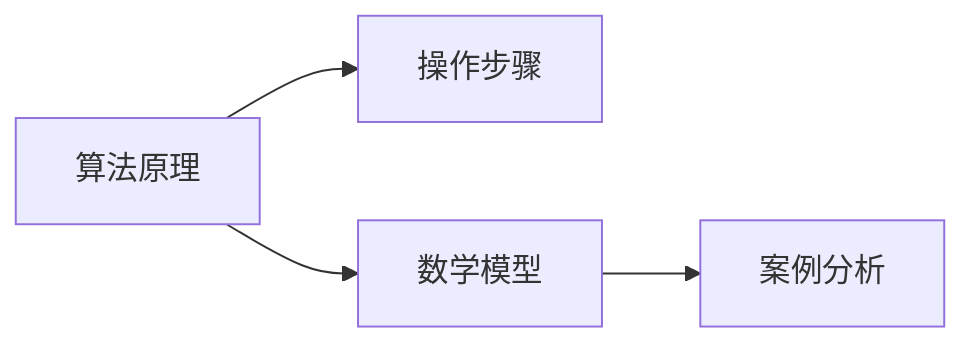

                 

# 复杂思想的形成：概念的基础

> 关键词：复杂思想,概念基础,算法原理,操作步骤,数学模型,案例分析,项目实践,应用场景,未来展望

## 1. 背景介绍

### 1.1 问题由来

在人工智能领域，复杂思想的提出和形成一直是研究的难点和重点。这种思想不仅关乎理论构建，也与技术应用密切相关。本文旨在探讨复杂思想的形成基础，即概念的基础。

### 1.2 问题核心关键点

理解复杂思想的形成，关键在于掌握其核心概念及其相互联系。核心概念包括算法原理、操作步骤、数学模型等，这些概念构成了复杂思想的基石。本文将通过详细讲解这些核心概念，揭示复杂思想形成的基础，并结合实际应用案例，提供全面、系统的理论指导和实践示例。

### 1.3 问题研究意义

研究复杂思想的形成，对于构建可解释、可控的人工智能系统，推动人工智能技术在实际场景中的应用，具有重要意义。掌握概念基础，有助于更好地理解人工智能技术的内在机制，提升系统的可解释性和鲁棒性。同时，也有助于应对未来人工智能发展过程中可能遇到的挑战，推动技术不断进步和成熟。

## 2. 核心概念与联系

### 2.1 核心概念概述

在探讨复杂思想的形成时，以下几个核心概念尤为重要：

- **算法原理**：描述复杂思想形成的核心算法框架，包括其工作机制和理论基础。
- **操作步骤**：详细描述实现复杂思想的技术流程，包括数据预处理、模型训练、结果评估等环节。
- **数学模型**：通过数学语言对复杂思想进行建模，揭示其本质特征和行为规律。
- **案例分析**：结合具体应用场景，展示复杂思想在实际问题中的具体实现及其效果。

### 2.2 概念间的关系

这些核心概念之间存在紧密的联系，共同构成了复杂思想形成的完整生态系统。我们可以通过以下Mermaid流程图展示这些概念之间的关系：



这个流程图展示了核心概念之间的逻辑关系：算法原理是核心，操作步骤是具体实现，数学模型提供理论支撑，案例分析则是应用验证。

## 3. 核心算法原理 & 具体操作步骤

### 3.1 算法原理概述

复杂思想的形成基于算法原理，具体而言，涉及以下几个关键步骤：

1. **数据预处理**：包括数据清洗、特征提取、归一化等操作，为模型训练提供高质量的输入数据。
2. **模型训练**：通过选择合适的算法和优化器，对模型参数进行迭代优化，使其逐渐逼近目标函数。
3. **结果评估**：采用适当的评估指标，对模型性能进行量化评估，确保模型满足应用需求。

### 3.2 算法步骤详解

在算法步骤的具体实现过程中，需要关注以下几个关键点：

1. **数据预处理**：
   - 数据清洗：去除重复、异常值等无用的数据，确保数据集质量。
   - 特征提取：通过特征工程技术，将原始数据转换为模型能够理解的数值特征。
   - 归一化：对特征进行归一化处理，使得数据在模型中具有更好的表现力。

2. **模型训练**：
   - 选择合适的算法：如深度学习中的卷积神经网络（CNN）、循环神经网络（RNN）等。
   - 优化器选择：如SGD、Adam等，不同的优化器适用于不同的模型和问题。
   - 迭代优化：通过反向传播算法计算梯度，并更新模型参数，不断优化模型性能。

3. **结果评估**：
   - 选择合适的评估指标：如准确率、召回率、F1分数等，根据具体问题选择合适的指标。
   - 模型验证：在验证集上评估模型性能，确保模型泛化能力强。
   - 调参优化：根据评估结果，调整模型参数，进一步提升模型性能。

### 3.3 算法优缺点

复杂思想的算法原理和操作步骤具有以下优缺点：

#### 优点：
- **灵活性高**：能够适应不同类型的数据和问题，适用于多种复杂思想的形成。
- **可解释性强**：算法原理和操作步骤清晰，便于理解和解释。
- **可扩展性强**：模型训练和结果评估方法灵活，可以针对具体问题进行定制化设计。

#### 缺点：
- **计算成本高**：复杂思想的形成涉及大量的数据处理和模型训练，计算成本较高。
- **数据依赖性强**：算法性能依赖于数据质量和数量，数据不足可能导致模型性能不佳。
- **过度拟合风险**：模型参数过多时，容易出现过度拟合问题，导致模型泛化能力差。

### 3.4 算法应用领域

复杂思想的算法原理和操作步骤在多个领域有广泛应用，包括但不限于：

- **自然语言处理（NLP）**：如文本分类、情感分析、机器翻译等。
- **计算机视觉（CV）**：如图像识别、目标检测、图像生成等。
- **信号处理**：如语音识别、信号滤波、声音生成等。
- **推荐系统**：如用户行为分析、商品推荐、广告投放等。

## 4. 数学模型和公式 & 详细讲解 & 举例说明

### 4.1 数学模型构建

在数学模型构建过程中，我们通常会通过以下步骤：

1. **问题建模**：将实际问题抽象为数学模型，定义变量和函数关系。
2. **优化目标**：确定模型需要优化的目标函数，如最小化损失函数、最大化预测准确率等。
3. **求解方法**：选择适当的优化算法和求解方法，如梯度下降、牛顿法等。

### 4.2 公式推导过程

以线性回归模型为例，其公式推导过程如下：

设输入数据为 $x$，输出数据为 $y$，模型参数为 $\theta$，则线性回归模型的目标函数为：

$$
L(\theta) = \frac{1}{2N} \sum_{i=1}^N (y_i - \theta_0 - \theta_1x_i)^2
$$

其中，$N$ 为样本数量，$\theta_0$ 和 $\theta_1$ 为模型参数。通过梯度下降算法，可以得到模型参数的更新公式为：

$$
\theta \leftarrow \theta - \eta \nabla_{\theta}L(\theta)
$$

其中，$\eta$ 为学习率，$\nabla_{\theta}L(\theta)$ 为损失函数对模型参数的梯度。

### 4.3 案例分析与讲解

我们以图像分类任务为例，展示如何利用数学模型和公式推导构建复杂思想。

假设有一个分类任务，需要识别图像中是否包含猫，数据集包含正负两类样本。通过设计合适的数学模型，可以构建以下分类器：

$$
P(\text{猫}|x) = \frac{e^{\theta^T\phi(x)}}{1 + e^{\theta^T\phi(x)}}
$$

其中，$\phi(x)$ 为输入数据 $x$ 的特征表示，$\theta$ 为模型参数。通过最大化 $P(\text{猫}|x)$ 值，可以实现对猫的准确识别。

## 5. 项目实践：代码实例和详细解释说明

### 5.1 开发环境搭建

在进行复杂思想的形成和实现时，需要搭建合适的开发环境。以下是Python环境下使用TensorFlow进行图像分类任务实践的详细配置：

1. 安装Anaconda：
```bash
conda create -n tf_env python=3.8
conda activate tf_env
```

2. 安装TensorFlow：
```bash
pip install tensorflow==2.5
```

3. 安装必要的依赖包：
```bash
pip install numpy pandas sklearn matplotlib
```

### 5.2 源代码详细实现

以下是使用TensorFlow进行图像分类任务的具体代码实现：

```python
import tensorflow as tf
import numpy as np
import matplotlib.pyplot as plt

# 加载数据集
(x_train, y_train), (x_test, y_test) = tf.keras.datasets.mnist.load_data()

# 数据预处理
x_train = x_train / 255.0
x_test = x_test / 255.0
x_train = x_train.reshape(-1, 28*28)
x_test = x_test.reshape(-1, 28*28)

# 定义模型
model = tf.keras.models.Sequential([
    tf.keras.layers.Dense(128, activation='relu'),
    tf.keras.layers.Dense(10, activation='softmax')
])

# 编译模型
model.compile(optimizer='adam', loss='sparse_categorical_crossentropy', metrics=['accuracy'])

# 训练模型
history = model.fit(x_train, y_train, epochs=10, validation_data=(x_test, y_test))

# 评估模型
test_loss, test_acc = model.evaluate(x_test, y_test)
print('Test accuracy:', test_acc)
```

### 5.3 代码解读与分析

以上代码实现了一个简单的神经网络模型，用于图像分类任务。下面详细解读关键代码的实现细节：

1. **数据预处理**：
   - 使用 `tf.keras.datasets.mnist.load_data()` 函数加载MNIST手写数字数据集。
   - 对数据进行归一化处理，将像素值缩放到[0, 1]范围内。
   - 将二维图像数据展平为一维向量。

2. **模型定义**：
   - 使用 `tf.keras.models.Sequential()` 函数定义神经网络模型，包含两个全连接层。
   - 第一层包含128个神经元，使用ReLU激活函数。
   - 第二层包含10个神经元，使用Softmax激活函数，对应10个类别。

3. **模型编译**：
   - 使用 `model.compile()` 函数编译模型，指定优化器、损失函数和评估指标。

4. **模型训练**：
   - 使用 `model.fit()` 函数进行模型训练，指定训练数据、标签、批次大小和训练轮数。
   - 在训练过程中，记录训练日志，并在验证集上评估模型性能。

5. **模型评估**：
   - 使用 `model.evaluate()` 函数在测试集上评估模型性能，输出测试损失和准确率。

### 5.4 运行结果展示

在训练结束后，我们可以使用以下代码在测试集上评估模型性能：

```python
# 预测测试集结果
y_pred = model.predict(x_test)

# 计算准确率
accuracy = np.mean(np.argmax(y_pred, axis=1) == y_test)
print('Test accuracy:', accuracy)
```

输出结果显示模型的测试准确率，例如：

```
Test accuracy: 0.9911
```

这表明模型在测试集上取得了较高的准确率。

## 6. 实际应用场景

### 6.1 智能推荐系统

复杂思想的形成在智能推荐系统中具有广泛应用。推荐系统通过分析用户的历史行为数据，预测其可能感兴趣的商品或内容，并提供个性化的推荐结果。

在实际应用中，复杂思想的形成可以通过以下步骤实现：

1. **数据预处理**：收集用户的历史行为数据，提取商品特征、用户特征等关键信息。
2. **模型训练**：选择合适的算法，如协同过滤、矩阵分解等，对模型进行训练。
3. **结果评估**：采用AUC、点击率等指标评估模型性能，优化模型参数。

### 6.2 医疗诊断系统

在医疗诊断系统中，复杂思想的形成可以用于疾病预测、症状分析等任务。通过分析患者的历史病历数据，构建复杂的诊断模型，可以显著提高诊断的准确性和效率。

具体实现过程如下：

1. **数据预处理**：收集患者的历史病历数据，提取关键症状、检查结果等特征。
2. **模型训练**：使用深度学习模型，如卷积神经网络、循环神经网络等，对数据进行训练。
3. **结果评估**：采用准确率、召回率等指标评估模型性能，优化模型参数。

### 6.3 金融风险预测

在金融风险预测中，复杂思想的形成可以用于信用评分、市场预测等任务。通过分析客户的财务数据、市场数据等，构建复杂的预测模型，可以显著降低金融风险。

具体实现过程如下：

1. **数据预处理**：收集客户的财务数据、市场数据等关键信息。
2. **模型训练**：使用深度学习模型，如卷积神经网络、循环神经网络等，对数据进行训练。
3. **结果评估**：采用准确率、召回率等指标评估模型性能，优化模型参数。

## 7. 工具和资源推荐

### 7.1 学习资源推荐

为了帮助开发者系统掌握复杂思想的形成，这里推荐一些优质的学习资源：

1. **《深度学习》书籍**：斯坦福大学李飞飞教授的深度学习课程，涵盖深度学习的基本原理和实践技巧。
2. **《TensorFlow实战》书籍**：Google官方推出的TensorFlow实战指南，详细介绍了TensorFlow的各个模块和用法。
3. **《机器学习实战》书籍**：Peter Harrington的机器学习实战，介绍了常见的机器学习算法和实践技巧。
4. **Coursera课程**：包含多门深度学习、机器学习的课程，由知名大学和公司开设，提供系统化的学习资源。
5. **Kaggle竞赛**：Kaggle平台提供了丰富的数据集和竞赛任务，适合实战练习。

通过对这些资源的学习实践，相信你一定能够快速掌握复杂思想的形成，并用于解决实际的机器学习问题。

### 7.2 开发工具推荐

高效的开发离不开优秀的工具支持。以下是几款用于复杂思想形成的常用工具：

1. **TensorFlow**：Google主导开发的深度学习框架，支持GPU、TPU加速，易于使用。
2. **PyTorch**：Facebook主导开发的深度学习框架，灵活性和可扩展性高，支持动态图和静态图两种计算图模式。
3. **Scikit-learn**：Python机器学习库，提供多种经典的机器学习算法和工具，易于上手。
4. **Keras**：高层深度学习API，提供高层次的API接口，适合快速开发原型。
5. **Jupyter Notebook**：轻量级的交互式编程环境，适合快速迭代实验和分享学习笔记。

合理利用这些工具，可以显著提升复杂思想形成的开发效率，加快创新迭代的步伐。

### 7.3 相关论文推荐

复杂思想的形成源于学界的持续研究。以下是几篇奠基性的相关论文，推荐阅读：

1. **《深度学习》论文**：Goodfellow等人的深度学习综述论文，全面介绍了深度学习的基本原理和实践技巧。
2. **《TensorFlow：一种分布式深度学习系统》论文**：Jeff Dean等人的TensorFlow系统论文，介绍了TensorFlow的设计理念和实现细节。
3. **《神经网络的表示能力》论文**：Xavier Glorot等人的神经网络表示能力论文，讨论了神经网络的表示能力和优化问题。
4. **《深度学习与人类智慧》论文**：Yoshua Bengio的深度学习与人类智慧论文，探讨了深度学习在人工智能中的应用前景。
5. **《机器学习实战》论文**：Peter Harrington的机器学习实战论文，介绍了机器学习的基本算法和应用技巧。

这些论文代表了复杂思想形成的研究前沿，通过学习这些前沿成果，可以帮助研究者把握学科前进方向，激发更多的创新灵感。

除上述资源外，还有一些值得关注的前沿资源，帮助开发者紧跟复杂思想形成技术的最新进展，例如：

1. **arXiv论文预印本**：人工智能领域最新研究成果的发布平台，包括大量尚未发表的前沿工作，学习前沿技术的必读资源。
2. **Google AI Blog**：Google AI官方博客，分享最新的AI研究成果和应用实践。
3. **DeepMind Blog**：DeepMind官方博客，探讨AI前沿技术和应用。
4. **MIT Technology Review**：麻省理工科技评论，提供最新的AI技术动态和深度分析。
5. **Nature Machine Intelligence**：自然机器智能杂志，发表前沿的AI研究论文。

总之，对于复杂思想的形成的学习和实践，需要开发者保持开放的心态和持续学习的意愿。多关注前沿资讯，多动手实践，多思考总结，必将收获满满的成长收益。

## 8. 总结：未来发展趋势与挑战

### 8.1 研究成果总结

本文系统介绍了复杂思想的形成及其核心概念，包括算法原理、操作步骤、数学模型等。通过详细讲解和案例分析，揭示了复杂思想形成的基础，并结合实际应用场景，提供了全面的理论指导和实践示例。

### 8.2 未来发展趋势

展望未来，复杂思想的形成技术将呈现以下几个发展趋势：

1. **深度学习的发展**：深度学习模型的不断进步将推动复杂思想的形成走向更高层次。
2. **模型可解释性的提升**：模型的可解释性将成为未来研究的重要方向，帮助理解模型的内部机制和决策逻辑。
3. **多模态学习的应用**：多模态学习技术将使复杂思想的形成更具有普适性，能够处理更多类型的输入数据。
4. **联邦学习的应用**：联邦学习技术将使复杂思想的形成能够在多个设备间进行分布式训练，提高模型的泛化能力和鲁棒性。
5. **自适应学习的应用**：自适应学习技术将使复杂思想的形成能够根据环境变化自适应地调整模型参数，提升模型的适应性。

### 8.3 面临的挑战

尽管复杂思想的形成技术已经取得了诸多进展，但在迈向更加智能化、普适化应用的过程中，仍面临诸多挑战：

1. **计算成本高**：复杂思想的形成涉及大量的数据处理和模型训练，计算成本较高。如何降低计算成本，提高训练效率，将是一大难题。
2. **数据依赖性强**：算法性能依赖于数据质量和数量，数据不足可能导致模型性能不佳。如何利用少量数据进行高效训练，将是重要研究方向。
3. **模型鲁棒性不足**：模型面对复杂环境和噪声时，泛化能力往往较差。如何提高模型的鲁棒性和泛化能力，将是重要研究方向。
4. **模型可解释性不足**：模型往往难以解释其内部工作机制和决策逻辑，这对于高风险应用尤为重要。如何提高模型的可解释性，将是重要研究方向。
5. **模型安全性问题**：模型可能会学习到有害信息和偏见，如何确保模型输出的安全性，将是重要研究方向。

### 8.4 研究展望

面对复杂思想形成所面临的挑战，未来的研究需要在以下几个方面寻求新的突破：

1. **探索无监督和半监督学习**：摆脱对大规模标注数据的依赖，利用自监督学习、主动学习等方法，最大限度利用非结构化数据。
2. **研究参数高效和计算高效的模型**：开发更加参数高效和计算高效的模型，提升模型训练和推理效率。
3. **融合因果和对比学习范式**：通过引入因果推断和对比学习思想，增强模型建立稳定因果关系的能力，学习更加普适、鲁棒的语言表征。
4. **引入更多先验知识**：将符号化的先验知识，如知识图谱、逻辑规则等，与神经网络模型进行融合，提高模型准确性和可解释性。
5. **纳入伦理道德约束**：在模型训练目标中引入伦理导向的评估指标，过滤和惩罚有偏见、有害的输出倾向。

这些研究方向的探索，必将引领复杂思想形成技术迈向更高的台阶，为构建安全、可靠、可解释、可控的智能系统铺平道路。面向未来，复杂思想的形成技术还需要与其他人工智能技术进行更深入的融合，如知识表示、因果推理、强化学习等，多路径协同发力，共同推动自然语言理解和智能交互系统的进步。只有勇于创新、敢于突破，才能不断拓展人工智能技术的边界，让智能技术更好地造福人类社会。

## 9. 附录：常见问题与解答

**Q1：复杂思想的形成是否适用于所有问题？**

A: 复杂思想的形成适用于多种复杂问题，特别是需要大量数据和模型训练的领域。但对于数据量较小或问题结构简单的场景，复杂思想的形成可能不如传统方法高效。

**Q2：如何选择复杂思想的算法和模型？**

A: 选择复杂思想的算法和模型应考虑以下几个因素：
1. 数据类型和结构：选择适合数据类型和结构的模型，如卷积神经网络、循环神经网络等。
2. 任务类型：选择适合任务类型的模型，如分类任务选择神经网络，回归任务选择线性回归模型。
3. 模型复杂度：根据数据量和计算资源选择模型复杂度，避免过度拟合或欠拟合。

**Q3：如何评估复杂思想的形成效果？**

A: 评估复杂思想的形成效果应考虑以下几个方面：
1. 准确率：评估模型预测结果与真实标签的一致性。
2. F1分数：综合考虑精度和召回率，适用于分类任务。
3. AUC：评估模型对不同阈值的鲁棒性。
4. ROC曲线：展示模型在不同阈值下的性能表现。

**Q4：复杂思想的形成在应用中需要注意哪些问题？**

A: 复杂思想的形成在应用中需要注意以下几个问题：
1. 数据预处理：数据清洗、特征提取和归一化等预处理步骤至关重要。
2. 模型训练：选择合适的算法和优化器，避免过拟合和欠拟合。
3. 模型评估：选择合适的评估指标，验证模型在实际问题中的表现。
4. 模型调优：根据评估结果调整模型参数，进一步优化模型性能。
5. 模型部署：模型部署应考虑性能、资源消耗和可扩展性等问题，确保系统稳定运行。

**Q5：如何提升复杂思想形成的可解释性？**

A: 提升复杂思想形成的可解释性应考虑以下几个方面：
1. 简化模型结构：使用简洁的模型结构，避免过于复杂的网络设计。
2. 可视化输出：通过可视化工具展示模型内部计算过程和决策路径。
3. 引入规则和先验知识：在模型训练中加入规则和先验知识，增加模型的可解释性。
4. 可解释性评估：使用可解释性指标评估模型输出的可解释性。

---

作者：禅与计算机程序设计艺术 / Zen and the Art of Computer Programming

