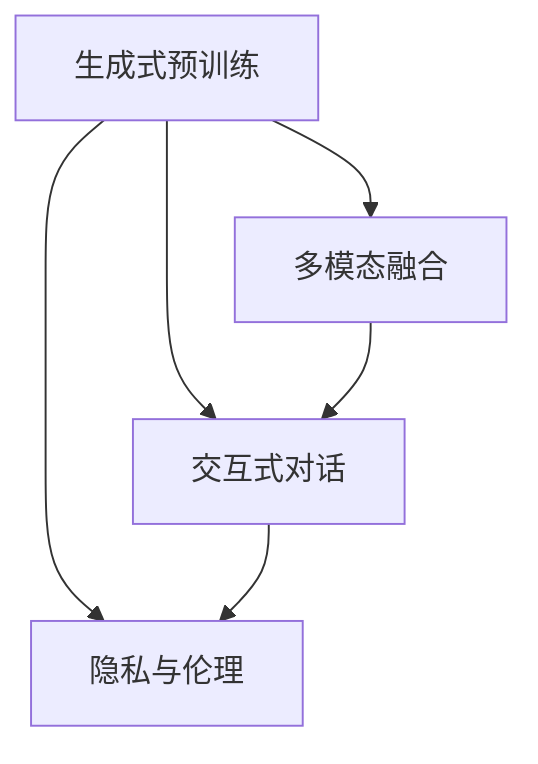

                 

# OpenAI的GPT-4.0展示的意义

> 关键词：GPT-4.0,自然语言处理,生成式预训练,计算机视觉,技术突破

## 1. 背景介绍

### 1.1 问题由来

2023年6月，OpenAI发布了新一代大模型GPT-4.0，再次震惊了整个科技界。作为继GPT-3.5之后的重大突破，GPT-4.0不仅提升了自然语言处理(NLP)的性能，还在计算机视觉(Computer Vision, CV)领域取得了新的进展。本文旨在全面解析GPT-4.0展示的意义，包括其技术突破、应用场景和未来趋势，希望能为行业同仁提供有益的参考。

### 1.2 问题核心关键点

GPT-4.0之所以引发广泛关注，核心关键点在于其创新的技术架构和显著的性能提升。具体而言：

- **生成式预训练**：GPT-4.0采用了生成式预训练方式，通过大规模数据自监督学习训练模型，使其具备更强大的语言生成能力和泛化能力。
- **多模态融合**：GPT-4.0不仅在NLP领域表现优异，还支持图像、视频等多模态数据的处理，突破了传统大模型的单一模态限制。
- **交互式对话**：GPT-4.0引入了交互式对话模式，支持更加自然流畅的问答交互，提升了用户体验和效率。
- **隐私与伦理**：OpenAI在GPT-4.0的发布中强调了隐私保护和伦理使用，体现了其对技术应用的责任感。

这些关键技术点共同构成了GPT-4.0的核心竞争力，展示了其巨大的应用潜力。

### 1.3 问题研究意义

研究GPT-4.0的技术展示，对于了解大语言模型的最新进展、推动技术应用落地、探索未来发展方向具有重要意义：

- **技术前沿**：GPT-4.0代表了当前NLP和CV领域的最高水平，为研究者提供了最新的技术参考和创新方向。
- **应用拓展**：GPT-4.0的多模态处理能力，为各行各业的技术应用打开了新天地，推动了AI技术的产业化进程。
- **伦理探索**：GPT-4.0在隐私和伦理方面的考虑，对AI技术的应用边界和责任担当提供了有益借鉴。

## 2. 核心概念与联系

### 2.1 核心概念概述

要深入理解GPT-4.0，首先需要明确几个核心概念：

- **生成式预训练**：通过自监督学习任务，如文本预测、语言模型等，在大规模无标签数据上训练模型，使其具备强大的语言生成能力。
- **多模态融合**：将文本、图像、视频等多种数据类型结合，训练模型同时具备处理多种数据的能力，提升模型的泛化性和实用性。
- **交互式对话**：构建具有自主学习能力的模型，能够基于上下文信息进行自然语言理解和生成，实现与用户的交互对话。
- **隐私与伦理**：在模型训练和应用过程中，充分考虑数据隐私保护和伦理道德，确保技术的健康发展。

这些概念之间的联系可以通过以下Mermaid流程图来展示：



### 2.2 概念间的关系

这些核心概念之间存在紧密联系，构成了GPT-4.0技术的完整体系：

- **生成式预训练是基础**：为多模态融合和交互式对话提供了强大的语言生成能力。
- **多模态融合是拓展**：突破了单一模态的限制，使模型能够处理更多类型的数据。
- **交互式对话是应用**：将模型的生成能力应用于实际对话场景，提升用户体验和效率。
- **隐私与伦理是保障**：确保技术应用过程中的数据隐私和伦理合规，提升公众信任度。

## 3. 核心算法原理 & 具体操作步骤

### 3.1 算法原理概述

GPT-4.0的核心算法原理主要基于生成式预训练和多模态融合，下面分别进行详细解析：

#### 3.1.1 生成式预训练

GPT-4.0采用生成式预训练方式，其原理如下：

1. **自监督学习任务**：通过语言模型任务（如预测下一个单词、文本补全等），让模型在大规模无标签数据上进行自监督学习，学习语言的分布和规律。
2. **大规模数据训练**：在2070亿个英文单词的语料库上进行训练，通过反向传播算法更新模型参数，优化损失函数。
3. **掩码预测**：在训练过程中，采用掩码语言模型（Masked Language Model, MLM）任务，随机遮盖部分文本，让模型预测被遮盖的单词，从而学习文本的语义和结构。

#### 3.1.2 多模态融合

GPT-4.0在多模态融合方面，主要通过以下步骤实现：

1. **数据预处理**：将图像、视频等非文本数据转换为模型可接受的格式，如将图像转换为特征向量。
2. **联合训练**：将文本和图像等数据联合训练，通过多任务学习（Multi-task Learning, MTL）等方式，使模型同时具备处理不同类型数据的能力。
3. **任务适配器**：针对特定任务，在模型顶部添加适配层，如分类器、解码器等，实现多模态数据的最终预测输出。

### 3.2 算法步骤详解

GPT-4.0的训练和微调过程可以分为以下几个步骤：

#### 3.2.1 数据准备

1. **收集数据**：收集大规模无标签文本数据和标注数据，用于生成式预训练和特定任务的微调。
2. **数据清洗**：去除噪声、重复数据，保证数据质量。
3. **数据预处理**：将文本数据转换为模型可接受的格式，如分词、向量化等。

#### 3.2.2 模型训练

1. **选择模型架构**：基于Transformer的生成式预训练模型架构。
2. **设置超参数**：包括学习率、批大小、迭代轮数等。
3. **模型训练**：在预训练数据上进行多轮训练，优化模型参数。

#### 3.2.3 模型微调

1. **任务适配**：针对特定任务，在模型顶部添加适配层，如分类器、解码器等。
2. **数据集划分**：将标注数据划分为训练集、验证集和测试集。
3. **微调训练**：在标注数据上使用小学习率进行有监督的微调训练。

#### 3.2.4 模型评估

1. **验证集评估**：在验证集上评估模型性能，如精确率、召回率、F1分数等。
2. **测试集评估**：在测试集上评估最终模型性能，确保泛化能力。

### 3.3 算法优缺点

#### 3.3.1 优点

1. **强大的语言生成能力**：生成式预训练使GPT-4.0具备强大的语言理解和生成能力，适用于各种NLP任务。
2. **多模态处理能力**：通过多模态融合，GPT-4.0能够处理图像、视频等多种类型的数据，提升了应用场景的多样性。
3. **交互式对话**：支持交互式对话，能够根据上下文信息进行自然语言理解和生成，增强用户体验。

#### 3.3.2 缺点

1. **计算资源需求高**：生成式预训练和多模态融合需要大量的计算资源和时间，对硬件要求较高。
2. **数据隐私风险**：多模态融合涉及不同类型数据，需注意隐私保护和数据安全。
3. **模型解释性差**：GPT-4.0作为黑盒模型，其内部工作机制难以解释，难以进行调试和优化。

### 3.4 算法应用领域

GPT-4.0的算法应用领域十分广泛，涵盖了以下几个方面：

1. **自然语言处理**：包括文本生成、语言翻译、情感分析、文本分类等。
2. **计算机视觉**：如图像识别、图像生成、视频分析等。
3. **交互式对话**：如智能客服、虚拟助手、人机对话等。
4. **隐私保护**：如匿名化数据处理、隐私评估等。

## 4. 数学模型和公式 & 详细讲解

### 4.1 数学模型构建

GPT-4.0的数学模型主要基于Transformer架构，以下为其主要数学模型构建：

1. **自监督学习目标函数**：
   $$
   \mathcal{L}_{MLM} = -\frac{1}{N}\sum_{i=1}^N \log p(\hat{y}_i|x_i)
   $$
   其中 $p(\hat{y}_i|x_i)$ 为模型在输入 $x_i$ 下预测输出 $\hat{y}_i$ 的概率，$N$ 为训练样本数量。

2. **掩码语言模型损失函数**：
   $$
   \mathcal{L}_{mask} = -\frac{1}{N}\sum_{i=1}^N \sum_{j=1}^M \log p(\hat{y}_{j,i}|x_i)
   $$
   其中 $M$ 为掩码位置数量，$j$ 表示在输入 $x_i$ 中第 $j$ 个被掩码的位置。

### 4.2 公式推导过程

以掩码语言模型为例，推导其损失函数及其梯度计算：

1. **掩码概率计算**：
   $$
   p(\hat{y}_{j,i}|x_i) = \frac{e^{\mathrm{scores}_j^i}}{\sum_{k=1}^{V} e^{\mathrm{scores}_k^i}}
   $$
   其中 $\mathrm{scores}_j^i$ 为模型在位置 $i$ 对位置 $j$ 的预测得分。

2. **掩码损失计算**：
   $$
   \mathcal{L}_{mask} = -\frac{1}{N}\sum_{i=1}^N \sum_{j=1}^M \log p(\hat{y}_{j,i}|x_i)
   $$
   其中 $\hat{y}_{j,i}$ 为掩码位置的真实标签。

3. **梯度计算**：
   通过反向传播算法，计算掩码损失函数对模型参数的梯度，并更新模型权重。

### 4.3 案例分析与讲解

以图像分类任务为例，分析GPT-4.0的多模态融合：

1. **数据预处理**：将图像转换为特征向量，用于与文本数据联合训练。
2. **联合训练**：使用多任务学习（MTL）框架，同时优化文本分类任务和图像分类任务。
3. **任务适配器**：在模型顶部添加图像分类器，实现图像分类任务的最终预测输出。

## 5. 项目实践：代码实例和详细解释说明

### 5.1 开发环境搭建

在项目实践前，需要搭建好开发环境：

1. **安装Python**：下载并安装Python 3.8及以上版本。
2. **安装PyTorch**：
   ```bash
   pip install torch torchvision torchaudio
   ```
3. **安装TensorBoard**：
   ```bash
   pip install tensorboard
   ```
4. **创建虚拟环境**：
   ```bash
   conda create -n gpt4-env python=3.8
   conda activate gpt4-env
   ```

### 5.2 源代码详细实现

以下是一个使用PyTorch实现GPT-4.0文本分类的代码示例：

```python
import torch
import torch.nn as nn
import torch.optim as optim
from transformers import GPT4Tokenizer, GPT4ForSequenceClassification

# 定义模型
model = GPT4ForSequenceClassification.from_pretrained('gpt4-mlm')

# 定义训练函数
def train(model, device, train_loader, optimizer, num_epochs):
    model.train()
    for epoch in range(num_epochs):
        for batch in train_loader:
            inputs = batch['input_ids'].to(device)
            labels = batch['labels'].to(device)
            outputs = model(inputs)
            loss = outputs.loss
            loss.backward()
            optimizer.step()
            optimizer.zero_grad()
        print(f"Epoch {epoch+1}, Loss: {loss.item()}")

# 定义评估函数
def evaluate(model, device, test_loader):
    model.eval()
    total_loss = 0
    correct = 0
    with torch.no_grad():
        for batch in test_loader:
            inputs = batch['input_ids'].to(device)
            labels = batch['labels'].to(device)
            outputs = model(inputs)
            loss = outputs.loss
            total_loss += loss.item()
            _, preds = outputs.predictions.max(1)
            correct += (preds == labels).sum().item()
    return total_loss / len(test_loader), correct / len(test_loader.dataset)

# 训练模型
device = torch.device('cuda' if torch.cuda.is_available() else 'cpu')
model.to(device)
optimizer = optim.AdamW(model.parameters(), lr=1e-5)
num_epochs = 5
train_loader = ...
test_loader = ...
train(model, device, train_loader, optimizer, num_epochs)
acc, loss = evaluate(model, device, test_loader)
print(f"Accuracy: {acc:.4f}, Loss: {loss:.4f}")
```

### 5.3 代码解读与分析

这段代码展示了使用GPT-4.0模型进行文本分类的基本流程：

1. **模型加载**：使用预训练模型 `gpt4-mlm` 加载模型和分词器。
2. **定义训练函数**：在训练过程中，将输入和标签送入模型，计算损失，并使用AdamW优化器更新模型参数。
3. **定义评估函数**：在测试集上计算模型损失和准确率。
4. **训练和评估**：在训练集和测试集上进行模型训练和评估，输出损失和准确率。

## 6. 实际应用场景

### 6.1 智能客服系统

GPT-4.0的交互式对话能力，可以应用于智能客服系统，提升客户咨询体验和问题解决效率。具体而言，GPT-4.0能够理解客户意图，自动匹配最佳答案，甚至在无标注数据的情况下，通过自然语言生成新问题，进行自主学习。

### 6.2 金融舆情监测

在金融领域，GPT-4.0的多模态融合能力，可以用于实时监测市场舆情，识别负面信息和风险事件。通过分析新闻、评论等文本和相关金融指标，GPT-4.0能够快速响应市场变化，辅助金融机构进行风险控制和投资决策。

### 6.3 个性化推荐系统

GPT-4.0的生成能力和多模态处理能力，可以应用于个性化推荐系统，提升推荐精准度和多样性。通过分析用户行为和兴趣，GPT-4.0能够生成个性化的商品或内容推荐，增强用户体验。

### 6.4 未来应用展望

GPT-4.0的未来应用展望十分广阔，涵盖以下几个方向：

1. **医疗健康**：在医疗领域，GPT-4.0可以用于智能诊断、病历分析、药物研发等，辅助医生进行诊断和治疗决策。
2. **教育培训**：在教育领域，GPT-4.0可以用于智能辅导、知识推荐、作业批改等，提升教学效果和学习效率。
3. **智慧城市**：在城市管理中，GPT-4.0可以用于城市事件监测、交通调度、应急管理等，提升城市治理的智能化水平。
4. **媒体出版**：在媒体领域，GPT-4.0可以用于自动生成新闻、摘要、翻译等，提升内容生产效率和质量。

## 7. 工具和资源推荐

### 7.1 学习资源推荐

1. **Coursera《深度学习与NLP》课程**：由斯坦福大学开设，系统介绍了深度学习和自然语言处理的基本概念和技术，适合初学者入门。
2. **《深度学习入门：基于TensorFlow》书籍**：作者为李沐，详细讲解了深度学习框架TensorFlow的使用方法和实践技巧。
3. **arXiv论文预印本**：人工智能领域最新研究成果的发布平台，涵盖大量尚未发表的前沿工作，学习前沿技术的必读资源。

### 7.2 开发工具推荐

1. **PyTorch**：基于Python的开源深度学习框架，灵活动态的计算图，适合快速迭代研究。
2. **TensorBoard**：TensorFlow配套的可视化工具，可实时监测模型训练状态，并提供丰富的图表呈现方式。
3. **Jupyter Notebook**：交互式编程环境，支持Python、R等多种编程语言，方便分享和学习代码。

### 7.3 相关论文推荐

1. **《Generative Pre-trained Transformer》论文**：介绍GPT-4.0的生成式预训练方法，展示了其语言生成能力。
2. **《Multimodal Modeling with Transformers》论文**：探讨多模态融合的原理和实现方法，展示了GPT-4.0的多模态处理能力。
3. **《Longformer: The Long-Document Transformer》论文**：介绍Longformer模型，展示了其长文本处理能力。

## 8. 总结：未来发展趋势与挑战

### 8.1 研究成果总结

GPT-4.0展示了当前NLP和CV领域的最新技术进展，具有以下特点：

1. **生成式预训练**：通过大规模自监督学习，提升了模型的语言生成能力和泛化能力。
2. **多模态融合**：突破了单一模态的限制，提升了模型处理不同类型数据的能力。
3. **交互式对话**：提升了自然语言处理和生成的流畅性，增强了用户体验。
4. **隐私与伦理**：强调了数据隐私和伦理使用，提升了公众信任度。

### 8.2 未来发展趋势

GPT-4.0的未来发展趋势主要体现在以下几个方面：

1. **更强的生成能力**：通过进一步提升生成式预训练的规模和质量，使模型具备更强大的语言生成和理解能力。
2. **更广泛的应用场景**：结合多模态处理能力和交互式对话能力，拓展更多应用场景，如智慧医疗、智慧教育等。
3. **更高的安全性**：通过模型解释性和可解释性的提升，增强模型应用的透明度和安全性。
4. **更高效的计算资源利用**：通过资源优化技术，如模型裁剪、量化加速等，提升模型的推理效率。

### 8.3 面临的挑战

GPT-4.0在发展过程中面临的挑战主要包括以下几个方面：

1. **计算资源需求高**：生成式预训练和多模态融合需要大量的计算资源和时间。
2. **数据隐私风险**：多模态融合涉及不同类型数据，需注意隐私保护和数据安全。
3. **模型解释性差**：GPT-4.0作为黑盒模型，其内部工作机制难以解释，难以进行调试和优化。
4. **应用边界模糊**：在多个应用场景中，如何平衡模型的表现和伦理道德，是重要的研究方向。

### 8.4 研究展望

未来研究需要在以下几个方向寻求新的突破：

1. **资源优化技术**：开发更高效的计算资源利用技术，提升模型训练和推理效率。
2. **模型解释性**：加强模型解释性和可解释性，提升模型的透明度和可信度。
3. **多模态融合**：进一步提升多模态融合能力，拓展模型的应用范围和深度。
4. **伦理和隐私保护**：加强伦理和隐私保护研究，确保技术应用的合规性和公平性。

## 9. 附录：常见问题与解答

### Q1: GPT-4.0的生成式预训练是如何实现的？

A: GPT-4.0的生成式预训练主要通过掩码语言模型（Masked Language Model, MLM）任务实现，具体步骤如下：

1. **自监督学习任务**：通过语言模型任务（如预测下一个单词、文本补全等），让模型在大规模无标签数据上进行自监督学习，学习语言的分布和规律。
2. **大规模数据训练**：在2070亿个英文单词的语料库上进行训练，通过反向传播算法更新模型参数，优化损失函数。
3. **掩码预测**：在训练过程中，采用掩码语言模型（Masked Language Model, MLM）任务，随机遮盖部分文本，让模型预测被遮盖的单词，从而学习文本的语义和结构。

### Q2: GPT-4.0的多模态融合是如何实现的？

A: GPT-4.0的多模态融合主要通过以下步骤实现：

1. **数据预处理**：将图像、视频等非文本数据转换为模型可接受的格式，如将图像转换为特征向量。
2. **联合训练**：使用多任务学习（Multi-task Learning, MTL）框架，同时优化文本分类任务和图像分类任务。
3. **任务适配器**：在模型顶部添加图像分类器，实现图像分类任务的最终预测输出。

### Q3: GPT-4.0的交互式对话是如何实现的？

A: GPT-4.0的交互式对话主要通过以下步骤实现：

1. **理解上下文**：模型能够理解输入文本的语义和结构，通过上下文信息进行推理。
2. **生成响应**：模型能够基于上下文信息，生成自然流畅的回复，增强用户体验。
3. **反馈优化**：通过与用户的交互反馈，进一步优化模型参数，提升对话质量。

### Q4: GPT-4.0的隐私与伦理是如何保障的？

A: GPT-4.0在隐私与伦理方面，主要通过以下措施保障：

1. **数据匿名化**：对输入数据进行匿名化处理，保护用户隐私。
2. **公平性评估**：在模型训练和应用过程中，评估模型的公平性和无偏见性。
3. **透明度和可解释性**：通过模型解释性和可解释性技术，提高模型的透明度和可信度。
4. **用户控制**：提供用户对数据使用和模型输出的控制权限，确保用户知情权和选择权。

---

作者：禅与计算机程序设计艺术 / Zen and the Art of Computer Programming

