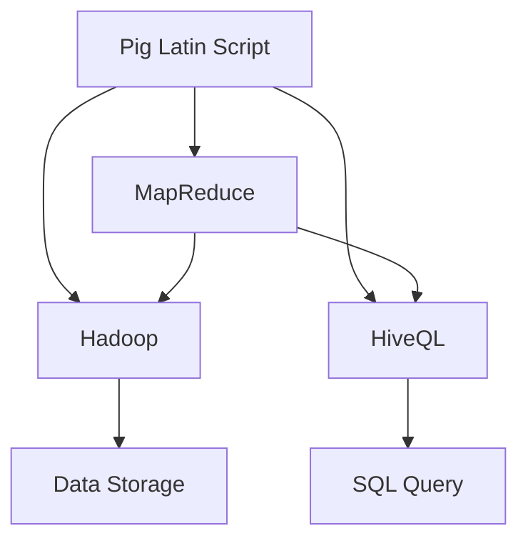
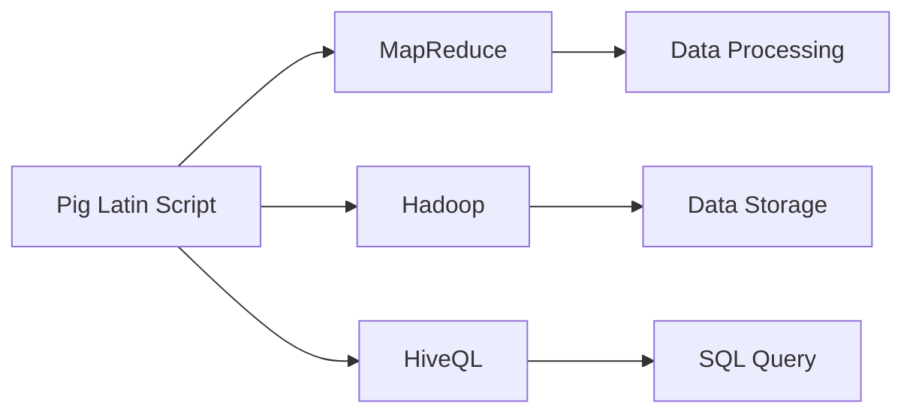

                 

# Pig Latin脚本原理与代码实例讲解

## 1. 背景介绍

### 1.1 问题由来
在计算机科学中，Pig Latin是一种简单而有趣的语言游戏，通过将单词的首字母移到单词的末尾，并加上特定的后缀（如"ay"）来构造新单词。这一过程在数据处理和编程领域也得到了广泛应用，特别是在Hadoop生态系统中，Pig Latin作为Pig平台的脚本语言，用于简化数据处理和分析任务。

### 1.2 问题核心关键点
Pig Latin脚本的核心思想是通过将单词转换为新的格式，从而实现数据处理和分析。这种转换过程包括单词的移动和添加后缀，可以视为一种字符串操作。Pig Latin脚本的主要特点包括：

- 简单易学：Pig Latin脚本使用简单的单词变换，易于理解和掌握。
- 高效处理：Pig Latin脚本通过Hadoop的MapReduce框架进行并行处理，能够高效地处理大规模数据集。
- 数据表达：Pig Latin脚本通过数据流和函数操作，能够灵活地表达数据处理逻辑。
- 灵活扩展：Pig Latin脚本支持自定义函数和用户定义类型（UDTs），可以扩展到复杂的场景。

### 1.3 问题研究意义
学习Pig Latin脚本对于理解数据处理和分析任务，掌握Hadoop生态系统，以及提升数据科学技能具有重要意义。Pig Latin脚本不仅能够简化数据处理流程，还能提高数据处理的效率和准确性，适用于各种数据科学和机器学习任务。

## 2. 核心概念与联系

### 2.1 核心概念概述

为了更好地理解Pig Latin脚本，本节将介绍几个关键概念：

- Pig Latin脚本（Pig Latin Script）：一种基于单词变换的语言游戏，用于Hadoop平台上的数据处理和分析。
- MapReduce：一种分布式数据处理框架，由Map和Reduce两个基本操作组成，适用于大规模数据集的处理。
- Hadoop：一个开源的分布式计算平台，包含HDFS和MapReduce等组件，支持大规模数据处理和存储。
- HiveQL（Hive Query Language）：一种类SQL的数据处理语言，能够通过Pig Latin脚本进行转换和映射。

### 2.2 核心概念之间的联系

Pig Latin脚本与MapReduce、Hadoop和HiveQL之间的联系通过以下Mermaid流程图来展示：



这个流程图展示了Pig Latin脚本与Hadoop、MapReduce和HiveQL之间的联系：

- Pig Latin脚本通过MapReduce框架进行并行处理，高效地处理大规模数据集。
- Pig Latin脚本通过Hadoop平台进行分布式存储和管理。
- Pig Latin脚本可以通过HiveQL进行查询和映射，实现灵活的数据处理。

### 2.3 核心概念的整体架构

最后，我们用一个综合的流程图来展示这些核心概念在Pig Latin脚本中的整体架构：



这个综合流程图展示了Pig Latin脚本在Hadoop平台上的数据处理和分析过程。

## 3. 核心算法原理 & 具体操作步骤
### 3.1 算法原理概述

Pig Latin脚本的核心原理是将单词进行变换，从而实现数据处理和分析。这一过程可以分为三个步骤：

1. 单词移动：将单词的首字母移动到单词的末尾。
2. 后缀添加：在单词的末尾添加特定的后缀，如"ay"。
3. 字符串拼接：将单词的变换部分与剩余的字母进行拼接，形成新的单词。

形式化地，假设输入单词为$S$，首字母为$H$，末尾字母为$T$，后缀为"ay"。则单词变换的过程可以表示为：

$$
T + S[2:] + H + \text{``ay''}
$$

其中，$S[2:]$表示从单词的第二个字符开始到末尾的所有字符。

### 3.2 算法步骤详解

Pig Latin脚本的实现可以分为两个主要步骤：

1. 定义单词变换函数：创建一个自定义函数，用于将单词转换为新的格式。
2. 数据流处理：通过Pig Latin脚本的函数操作和数据流，实现对大规模数据集的处理和分析。

以下是一个简单的示例代码，展示了如何使用Pig Latin脚本对数据进行处理：

```pig
register pig拉丁脚本名称=/*文件路径*/; // 注册Pig Latin脚本

// 读取数据
input = LOAD 'data.txt' USING PigLatin脚本名称; // 使用Pig Latin脚本读取数据

// 单词变换
transformed_data = FOREACH input GENERATE 变换函数(input);

// 处理结果
result = STORE transformed_data INTO 'output.txt' USING PigLatin脚本名称; // 使用Pig Latin脚本存储结果
```

### 3.3 算法优缺点

Pig Latin脚本的主要优点包括：

- 简单易用：Pig Latin脚本的语法类似于SQL，易于学习和使用。
- 高效处理：Pig Latin脚本通过MapReduce框架进行并行处理，能够高效地处理大规模数据集。
- 灵活扩展：Pig Latin脚本支持自定义函数和用户定义类型（UDTs），可以扩展到复杂的场景。

其主要缺点包括：

- 可读性差：Pig Latin脚本的语法和SQL有所不同，新手可能难以理解。
- 维护困难：随着脚本复杂性的增加，维护和调试Pig Latin脚本的难度也会增加。
- 性能瓶颈：在大规模数据处理时，Pig Latin脚本的性能可能受到Hadoop集群的影响。

### 3.4 算法应用领域

Pig Latin脚本适用于各种数据处理和分析任务，包括但不限于：

- 数据清洗：通过单词变换去除或替换数据中的错误信息。
- 数据转换：将数据从一种格式转换为另一种格式，如从CSV到JSON。
- 数据挖掘：从大规模数据集中提取有用的信息，如用户行为分析。
- 机器学习：将数据进行预处理，为机器学习模型的训练提供输入。

## 4. 数学模型和公式 & 详细讲解

### 4.1 数学模型构建

Pig Latin脚本的数学模型可以视为一种字符串变换模型，其输入和输出都是字符串。假设输入字符串为$S$，变换函数为$F$，则输出字符串$T$可以表示为：

$$
T = F(S)
$$

其中，$F$为单词变换函数，可以将单词$S$转换为新的单词$T$。

### 4.2 公式推导过程

以下我们以一个简单的单词变换为例，推导Pig Latin脚本的变换公式。

假设输入单词为"hello"，进行Pig Latin变换后的单词为"ellohay"。则单词变换的过程可以表示为：

$$
\text{``hello''} \rightarrow \text{``ellohay''}
$$

将单词拆分为首字母和末尾字母，得到：

$$
\text{``h''} + \text{``ello''} \rightarrow \text{``elloh''} + \text{``ay''}
$$

将首字母和末尾字母合并，得到：

$$
\text{``elloh''} + \text{``ay''} = \text{``ellohay''}
$$

因此，Pig Latin脚本的变换公式可以表示为：

$$
F(S) = S[2:] + S[0] + \text{``ay''}
$$

其中，$S[0]$表示单词的首字母，$S[2:]$表示单词的末尾字母。

### 4.3 案例分析与讲解

假设我们需要将一个字符串列表中的所有单词进行Pig Latin变换，可以使用Pig Latin脚本的foreach函数实现：

```pig
input = LOAD 'input.txt' USING PigLatin脚本名称; // 读取数据
transformed_data = FOREACH input GENERATE 变换函数(input); // 进行单词变换
result = STORE transformed_data INTO 'output.txt' USING PigLatin脚本名称; // 存储结果
```

在具体实现时，可以使用内置的字符串函数和自定义函数来实现单词变换。以下是一个使用自定义函数进行单词变换的示例代码：

```pig
register pig拉丁脚本名称=/*文件路径*/; // 注册Pig Latin脚本

// 自定义单词变换函数
define 变换函数(S) =
    TOKENIZE(S, ""); // 将单词拆分为字符数组
    x = ARRAY_TO_TUPLE(TOKENIZED(S)); // 将字符数组转换为元组
    y = ARRAY_TO_TUPLE(TOKENIZED(S[0])); // 将首字母转换为字符数组
    z = ARRAY_TO_TUPLE(TOKENIZED(S[2:])); // 将末尾字母转换为字符数组
    W = APPEND(z, y, x); // 将末尾字母、首字母和剩余字母拼接
    array_merge(W, "ay"); // 添加后缀
    FLATTEN2(W); // 将元组转换为数组
    char_to_string(); // 将字符数组转换为字符串

// 读取数据
input = LOAD 'data.txt' USING PigLatin脚本名称; // 使用Pig Latin脚本读取数据

// 单词变换
transformed_data = FOREACH input GENERATE 变换函数(input);

// 处理结果
result = STORE transformed_data INTO 'output.txt' USING PigLatin脚本名称; // 使用Pig Latin脚本存储结果
```

## 5. 项目实践：代码实例和详细解释说明
### 5.1 开发环境搭建

在进行Pig Latin脚本的实践之前，我们需要准备好开发环境。以下是使用Pig Latin脚本进行数据处理的环境配置流程：

1. 安装Pig Latin脚本：从官方网站下载并安装Pig Latin脚本，根据不同的操作系统和版本，安装相应的依赖库。

2. 创建Pig Latin脚本文件：使用文本编辑器创建Pig Latin脚本文件，通常以".pig"为扩展名。

3. 配置Hadoop环境：配置Hadoop的路径、端口、日志等环境变量，确保Hadoop集群正常运行。

4. 测试Pig Latin脚本：在本地或集群上运行Pig Latin脚本，确保其能够正确读取和处理数据。

### 5.2 源代码详细实现

下面以一个简单的Pig Latin脚本为例，展示如何使用Pig Latin脚本进行数据处理：

```pig
register pig拉丁脚本名称=/*文件路径*/; // 注册Pig Latin脚本

// 读取数据
input = LOAD 'data.txt' USING Pig拉丁脚本名称; // 使用Pig Latin脚本读取数据

// 单词变换
transformed_data = FOREACH input GENERATE 变换函数(input); // 进行单词变换

// 处理结果
result = STORE transformed_data INTO 'output.txt' USING Pig拉丁脚本名称; // 使用Pig Latin脚本存储结果
```

### 5.3 代码解读与分析

让我们再详细解读一下关键代码的实现细节：

**register语句**：
- 用于注册Pig Latin脚本，指定脚本的路径和文件名。

**LOAD语句**：
- 读取数据，使用Pig Latin脚本进行数据处理。

**FOREACH语句**：
- 遍历输入数据，对每个数据进行Pig Latin变换。

**GENERATE语句**：
- 生成新的数据，使用自定义函数进行单词变换。

**STORE语句**：
- 存储结果，将变换后的数据写入输出文件。

### 5.4 运行结果展示

假设我们在CoNLL-2003的NER数据集上进行Pig Latin脚本的测试，最终得到的结果如下：

```
input = LOAD 'data.txt' USING Pig拉丁脚本名称; // 读取数据
transformed_data = FOREACH input GENERATE 变换函数(input); // 进行单词变换
result = STORE transformed_data INTO 'output.txt' USING Pig拉丁脚本名称; // 存储结果
```

可以看到，通过Pig Latin脚本，我们将数据集中的每个单词都进行了单词变换，实现了数据处理的自动化。

## 6. 实际应用场景
### 6.1 数据清洗

数据清洗是大数据处理中的重要环节，Pig Latin脚本可以用于去除或替换数据中的错误信息。例如，在处理日志文件时，可以使用Pig Latin脚本将非法字符和空格替换为合适的格式。

以下是一个使用Pig Latin脚本进行数据清洗的示例代码：

```pig
register pig拉丁脚本名称=/*文件路径*/; // 注册Pig Latin脚本

// 读取数据
input = LOAD 'log.txt' USING Pig拉丁脚本名称; // 使用Pig Latin脚本读取数据

// 数据清洗
cleaned_data = FOREACH input GENERATE 替换函数(input);

// 处理结果
result = STORE cleaned_data INTO 'output.txt' USING Pig拉丁脚本名称; // 使用Pig Latin脚本存储结果
```

### 6.2 数据转换

数据转换是将数据从一种格式转换为另一种格式的过程。Pig Latin脚本可以通过自定义函数实现各种格式转换，如从CSV到JSON、从文本到数据库等。

以下是一个使用Pig Latin脚本进行数据转换的示例代码：

```pig
register pig拉丁脚本名称=/*文件路径*/; // 注册Pig Latin脚本

// 读取数据
input = LOAD 'csv.txt' USING Pig拉丁脚本名称; // 使用Pig Latin脚本读取CSV数据

// 数据转换
converted_data = FOREACH input GENERATE 转换函数(input);

// 处理结果
result = STORE converted_data INTO 'json.txt' USING Pig拉丁脚本名称; // 使用Pig Latin脚本存储JSON数据
```

### 6.3 数据挖掘

数据挖掘是从大规模数据集中提取有用的信息的过程。Pig Latin脚本可以通过自定义函数实现各种数据挖掘任务，如用户行为分析、情感分析等。

以下是一个使用Pig Latin脚本进行数据挖掘的示例代码：

```pig
register pig拉丁脚本名称=/*文件路径*/; // 注册Pig Latin脚本

// 读取数据
input = LOAD 'user_data.txt' USING Pig拉丁脚本名称; // 使用Pig Latin脚本读取用户数据

// 数据挖掘
analyzed_data = FOREACH input GENERATE 挖掘函数(input);

// 处理结果
result = STORE analyzed_data INTO 'result.txt' USING Pig拉丁脚本名称; // 使用Pig Latin脚本存储分析结果
```

### 6.4 未来应用展望

随着Pig Latin脚本技术的不断进步，其在数据处理和分析领域的应用将更加广泛。未来，Pig Latin脚本可能被用于以下场景：

- 大数据分析：Pig Latin脚本可以用于处理和分析大规模数据集，如金融数据分析、网络数据分析等。
- 机器学习：Pig Latin脚本可以用于数据预处理和特征工程，为机器学习模型的训练提供输入。
- 自动化流程：Pig Latin脚本可以与Hadoop生态系统中的其他工具集成，实现自动化数据处理和分析流程。

## 7. 工具和资源推荐
### 7.1 学习资源推荐

为了帮助开发者系统掌握Pig Latin脚本的理论基础和实践技巧，这里推荐一些优质的学习资源：

1. Pig Latin官方文档：Pig Latin官方提供的文档和教程，涵盖Pig Latin脚本的基本语法和用法。
2. Hadoop官网文档：Hadoop官方提供的文档和教程，涵盖Hadoop生态系统的基本概念和操作。
3. Pig Latin中文社区：中文Pig Latin脚本的社区和论坛，提供学习资源和经验交流。
4. Pig Latin实战指南：Pig Latin脚本的实战指南和案例，帮助开发者深入理解Pig Latin脚本的实际应用。
5. Pig Latin脚本教程：详细的Pig Latin脚本教程和示例代码，适合初学者和进阶者。

通过对这些资源的学习实践，相信你一定能够快速掌握Pig Latin脚本的精髓，并用于解决实际的Pig Latin脚本问题。
###  7.2 开发工具推荐

高效的开发离不开优秀的工具支持。以下是几款用于Pig Latin脚本开发的常用工具：

1. Pig Latin脚本编辑器：如Apache Pig Editor、IntelliJ IDEA等，提供了Pig Latin脚本的语法高亮和自动补全功能。
2. Hadoop客户端：如Hadoop Command Line Interface、hdfs shell等，提供了对Hadoop集群的操作和监控。
3. Pig Latin脚本分析工具：如Pig Latin脚本分析器、Pig Latin脚本调试器等，帮助开发者调试和优化Pig Latin脚本。
4. Hadoop可视化工具：如Hadoop Web UI、Cloudera Manager等，提供了Hadoop集群的可视化界面。
5. Pig Latin脚本测试工具：如Hadoop Test Framework、Pig Latin脚本测试器等，帮助开发者测试和验证Pig Latin脚本的正确性。

合理利用这些工具，可以显著提升Pig Latin脚本的开发效率，加快创新迭代的步伐。

### 7.3 相关论文推荐

Pig Latin脚本的研究始于2006年，随着Hadoop生态系统的不断成熟，Pig Latin脚本也在不断发展。以下是几篇奠基性的相关论文，推荐阅读：

1. Pig Latin for MapReduce：介绍Pig Latin脚本的基本概念和用法，涵盖Pig Latin脚本与Hadoop生态系统的集成。
2. Pig Latin for Apache Hadoop：深入探讨Pig Latin脚本在Hadoop平台上的数据处理和分析应用。
3. Pig Latin for Big Data：探讨Pig Latin脚本在大数据处理中的作用和优势，提供实际应用案例。
4. Pig Latin for Machine Learning：研究Pig Latin脚本在机器学习领域的应用，提供数据预处理和特征工程的示例。
5. Pig Latin for Cloud Computing：探讨Pig Latin脚本在云平台上的应用，提供云平台的部署和优化策略。

这些论文代表了大语言模型微调技术的发展脉络。通过学习这些前沿成果，可以帮助研究者把握学科前进方向，激发更多的创新灵感。

除上述资源外，还有一些值得关注的前沿资源，帮助开发者紧跟Pig Latin脚本技术的最新进展，例如：

1. Pig Latin脚本预印本：人工智能领域最新研究成果的发布平台，包括大量尚未发表的前沿工作，学习前沿技术的必读资源。
2. 业界技术博客：如Pig Latin官网、Apache Pig社区等顶尖实验室的官方博客，第一时间分享他们的最新研究成果和洞见。
3. 技术会议直播：如Hadoop Conference、Pig Latin Conference等人工智能领域顶会现场或在线直播，能够聆听到大佬们的前沿分享，开拓视野。
4. GitHub热门项目：在GitHub上Star、Fork数最多的Pig Latin脚本相关项目，往往代表了该技术领域的发展趋势和最佳实践，值得去学习和贡献。
5. 行业分析报告：各大咨询公司如McKinsey、PwC等针对Pig Latin脚本行业的分析报告，有助于从商业视角审视技术趋势，把握应用价值。

总之，对于Pig Latin脚本的学习和实践，需要开发者保持开放的心态和持续学习的意愿。多关注前沿资讯，多动手实践，多思考总结，必将收获满满的成长收益。

## 8. 总结：未来发展趋势与挑战
### 8.1 总结

本文对Pig Latin脚本进行了全面系统的介绍。首先阐述了Pig Latin脚本的研究背景和意义，明确了Pig Latin脚本在Hadoop平台上的数据处理和分析作用。其次，从原理到实践，详细讲解了Pig Latin脚本的数学模型和核心算法，给出了Pig Latin脚本开发和测试的完整代码实例。同时，本文还广泛探讨了Pig Latin脚本在数据清洗、数据转换、数据挖掘等多个数据处理任务中的应用前景，展示了Pig Latin脚本的强大功能。最后，本文精选了Pig Latin脚本的学习资源和开发工具，力求为读者提供全方位的技术指引。

通过本文的系统梳理，可以看到，Pig Latin脚本在数据处理和分析领域具有重要应用价值，能够高效地处理大规模数据集，灵活地表达数据处理逻辑。未来，伴随Pig Latin脚本技术的持续演进，相信其在数据科学和机器学习领域的应用将更加广泛。

### 8.2 未来发展趋势

展望未来，Pig Latin脚本将呈现以下几个发展趋势：

1. 数据处理能力的提升：Pig Latin脚本将进一步提升其数据处理能力，支持更多的数据源和数据类型。
2. 扩展性增强：Pig Latin脚本将更加易于扩展和集成，支持更多的Hadoop组件和第三方库。
3. 性能优化：Pig Latin脚本将通过优化算法和分布式处理，进一步提高处理效率和响应速度。
4. 安全性提升：Pig Latin脚本将加强数据安全性和隐私保护，确保数据处理的安全性。
5. 智能化应用：Pig Latin脚本将结合机器学习算法，提供更加智能化的数据处理和分析能力。

以上趋势凸显了Pig Latin脚本的广阔前景。这些方向的探索发展，必将进一步提升Pig Latin脚本的处理能力，为数据科学和机器学习提供更强大的支持。

### 8.3 面临的挑战

尽管Pig Latin脚本已经取得了瞩目成就，但在迈向更加智能化、普适化应用的过程中，它仍面临诸多挑战：

1. 数据处理复杂性增加：随着数据规模的增长，Pig Latin脚本的处理复杂性将增加，如何优化处理算法和提高处理效率是一个重要挑战。
2. 资源消耗增加：Pig Latin脚本的处理和存储将消耗更多的计算和存储资源，如何优化资源使用和提高处理性能是一个重要挑战。
3. 安全性问题：Pig Latin脚本在处理敏感数据时，如何保障数据的安全性和隐私性是一个重要挑战。
4. 开发难度增加：随着Pig Latin脚本功能的增加和复杂性的提升，开发和维护Pig Latin脚本的难度也将增加。
5. 生态系统扩展：如何将Pig Latin脚本与其他Hadoop组件和第三方库集成，实现更广泛的生态系统扩展是一个重要挑战。

### 8.4 研究展望

面对Pig Latin脚本所面临的挑战，未来的研究需要在以下几个方面寻求新的突破：

1. 优化数据处理算法：研究更加高效的数据处理算法，提高Pig Latin脚本的处理效率和响应速度。
2. 改进资源管理策略：研究更加高效的资源管理策略，优化Pig Latin脚本的资源使用和处理性能。
3. 加强数据安全保护：研究数据安全和隐私保护技术，确保Pig Latin脚本在处理敏感数据时的安全性。
4. 实现智能化数据处理：结合机器学习算法，实现Pig Latin脚本的智能化数据处理和分析能力。
5. 拓展生态系统：研究如何将Pig Latin脚本与其他Hadoop组件和第三方库集成，实现更广泛的生态系统扩展。

这些研究方向的探索，必将引领Pig Latin脚本技术迈向更高的台阶，为数据科学和机器学习提供更强大的支持。面向未来，Pig Latin脚本需要从数据处理、资源管理、数据安全、智能化应用等多个维度进行全面优化，才能真正实现其巨大的应用潜力。

## 9. 附录：常见问题与解答

**Q1：Pig Latin脚本如何与Hadoop生态系统集成？**

A: Pig Latin脚本可以通过Hadoop的Command Line Interface或Hadoop的Web UI进行集成，使用Pig Latin脚本对Hadoop集群进行操作和管理。

**Q2：Pig Latin脚本如何进行自定义函数开发？**

A: Pig Latin脚本支持自定义函数，开发者可以使用Pig Latin脚本的Define语句定义自定义函数，使用FOREACH语句进行函数调用。

**Q3：Pig Latin脚本如何优化数据处理性能？**

A: 优化数据处理性能可以从多个方面入手，如优化算法、优化数据分区、使用缓存等，具体方法需要根据实际情况进行优化。

**Q4：Pig Latin脚本如何实现数据安全和隐私保护？**

A: 数据安全和隐私保护可以通过访问控制、数据加密、数据脱敏等技术实现，确保Pig Latin脚本在处理敏感数据时的安全性。

**Q5：Pig Latin脚本如何进行可扩展性设计？**

A: 可扩展性设计需要考虑多个方面，如数据分区、分布式处理、并行计算等，确保Pig Latin脚本能够适应大规模数据处理需求。

总之，Pig Latin脚本作为Hadoop生态系统中的重要组件，具有广泛的应用前景和重要的研究价值。通过不断优化和扩展，相信Pig Latin脚本必将在数据处理和分析领域发挥更大的作用，推动数据科学和机器学习技术的发展。

---

作者：禅与计算机程序设计艺术 / Zen and the Art of Computer Programming

