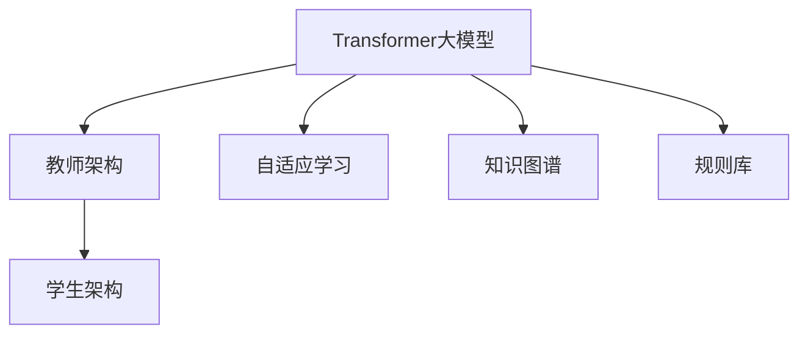
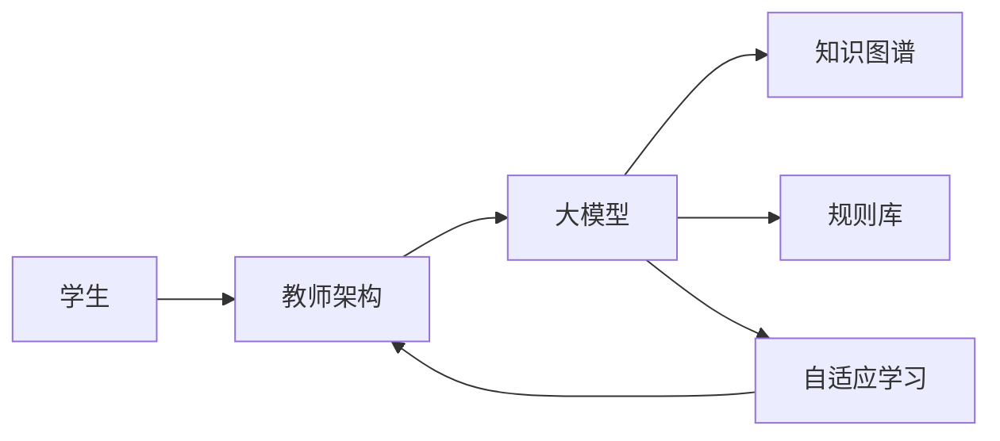
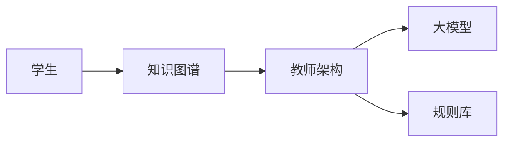
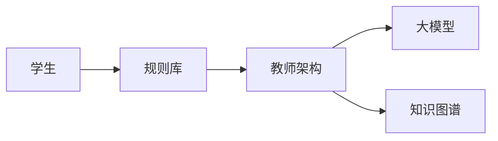
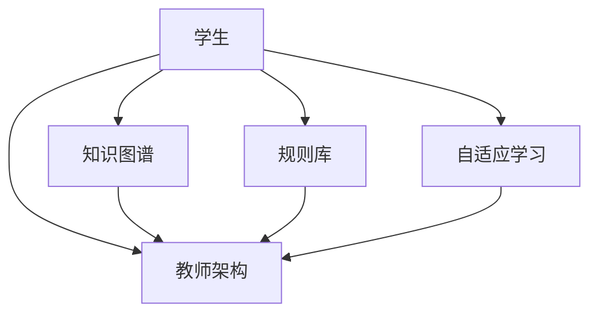

                 

# Transformer大模型实战 教师 学生架构

> 关键词：Transformer, 大模型, 语言理解, 推理生成, 教师架构, 学生架构, 学习指导

## 1. 背景介绍

### 1.1 问题由来
Transformer模型自提出以来，在自然语言处理(NLP)领域引起了巨大的轰动。其基于自注意力机制的自编码器结构，使得大模型在语言理解、推理生成等方面取得了突破性的进展。当前，基于Transformer的预训练语言模型已广泛应用于机器翻译、文本摘要、问答系统等NLP任务中，并取得了显著的成效。

然而，在实际应用中，为了满足特定的教学需求，需要对大模型进行结构调整和参数优化，以确保其在学生学习过程中发挥最大的效能。本文聚焦于大模型的教师和学生架构，旨在通过微调和大模型参数配置，实现高效的教学指导和个性化学习，促进教育公平和教育质量提升。

### 1.2 问题核心关键点
在教育领域，大模型的教师和学生架构主要关注以下几个方面：

- **个性化学习路径**：通过微调，为大模型定制个性化的学生学习路径，提供定制化的教学资源和反馈。
- **自适应学习效果**：动态调整学习内容和节奏，根据学生的学习效果实时优化教学策略。
- **交互式学习体验**：通过多轮对话，与学生互动，引导学生进行自主学习和探究。
- **高效知识传递**：构建知识图谱和规则库，辅助模型快速检索和传递知识，提升教学效率。

基于这些核心关键点，本文将详细探讨大模型在教育领域的教师和学生架构，并通过具体的代码实现和应用案例，展示其高效教学和个性化学习的能力。

## 2. 核心概念与联系

### 2.1 核心概念概述

为了更好地理解大模型的教师和学生架构，本节将介绍几个关键概念：

- **Transformer大模型**：以Transformer为基础的大规模预训练语言模型。在自然语言处理、推理生成、文本分类等任务上表现优异。

- **教师架构**：基于大模型构建的智能教学系统，负责知识传递、学习指导和效果评估。

- **学生架构**：学生通过与教师架构的交互，完成自主学习和探究。

- **自适应学习**：根据学生的学习效果和反馈，动态调整教学内容和策略，实现个性化的学习路径。

- **知识图谱**：以知识节点和关系的形式构建的知识库，帮助大模型快速检索和传递知识。

- **规则库**：定义和存储教学规则的库，辅助大模型生成符合教学标准的回答和指导。

这些概念之间的联系可以通过以下Mermaid流程图来展示：



这个流程图展示了教师和学生架构的基本逻辑：

1. 教师架构和大模型通过自适应学习，根据学生反馈动态调整教学策略。
2. 知识图谱和规则库辅助大模型生成教学内容，提升教学效果。
3. 学生通过与教师架构的交互，完成自主学习和探究。

### 2.2 概念间的关系

这些核心概念之间存在着紧密的联系，形成了大模型的教育架构框架。下面我们通过几个Mermaid流程图来展示这些概念之间的关系。

#### 2.2.1 大模型的教学流程



这个流程图展示了基于大模型的教学流程：

1. 学生与教师架构进行交互。
2. 教师架构调用大模型生成教学内容。
3. 大模型通过知识图谱和规则库辅助生成回答和指导。
4. 自适应学习系统根据学生反馈动态调整教学策略。

#### 2.2.2 知识图谱的应用



这个流程图展示了知识图谱在大模型教学中的应用：

1. 学生查询知识图谱。
2. 知识图谱提供相关知识节点和关系。
3. 教师架构根据知识图谱和规则库，生成教学内容和指导。
4. 大模型生成知识相关的回答和解释。

#### 2.2.3 规则库的调用



这个流程图展示了规则库在大模型教学中的应用：

1. 学生询问规则库相关问题。
2. 规则库提供教学规则和策略。
3. 教师架构调用规则库，生成教学内容。
4. 大模型根据规则库和知识图谱，生成符合规则的回答和指导。

### 2.3 核心概念的整体架构

最后，我们用一个综合的流程图来展示这些核心概念在大模型教育架构中的整体架构：



这个综合流程图展示了从知识图谱和规则库的构建，到自适应学习和大模型教学的完整过程。大模型在教育领域的应用，不仅限于知识传递和指导，还包括对学生学习效果的实时监控和个性化优化。通过这些核心概念的有机结合，大模型在教育领域发挥了重要的作用，推动了个性化学习和教学质量的提升。

## 3. 核心算法原理 & 具体操作步骤
### 3.1 算法原理概述

大模型的教师和学生架构，本质上是通过微调大模型，使其具备个性化教学和自适应学习的能力。其核心算法原理如下：

1. **微调大模型**：使用特定任务的数据集对大模型进行微调，使其能够理解教育领域的特定任务，如问答、对话等。
2. **动态调整学习策略**：根据学生的学习效果和反馈，实时调整教学内容和节奏，实现个性化的学习路径。
3. **生成交互式学习体验**：构建多轮对话系统，与学生互动，引导学生进行自主学习和探究。
4. **知识图谱和规则库的辅助**：构建知识图谱和规则库，辅助大模型快速检索和传递知识，提升教学效率。

### 3.2 算法步骤详解

基于大模型的教师和学生架构，具体算法步骤如下：

**Step 1: 准备教育数据集**
- 收集教育领域的各类数据，如问答数据、对话数据、阅读数据等。
- 清洗和标注数据，构建训练集和验证集。

**Step 2: 微调大模型**
- 选择合适的预训练模型，如GPT-3、BERT等。
- 在大模型顶层添加任务适配层，如问答模型、对话模型等。
- 使用训练集对大模型进行微调，优化模型参数，使其适应教育领域特定任务。

**Step 3: 动态调整学习策略**
- 实时收集学生反馈，如作答结果、学习进度等。
- 根据学生反馈动态调整教学策略，如难度调整、重点推荐等。
- 定期在验证集上评估模型性能，根据评估结果调整模型参数。

**Step 4: 生成交互式学习体验**
- 构建多轮对话系统，与学生进行互动。
- 根据学生提问，生成符合教学标准的回答和指导。
- 引导学生进行自主学习和探究，生成学习路径和资源推荐。

**Step 5: 知识图谱和规则库的构建**
- 收集教育领域的知识节点和关系，构建知识图谱。
- 定义和存储教学规则和策略，构建规则库。
- 将知识图谱和规则库与大模型连接，辅助生成教学内容和回答。

### 3.3 算法优缺点

基于大模型的教师和学生架构，具有以下优点：

1. **高效的教学指导**：大模型在语言理解、推理生成等方面表现优异，能够快速生成教学内容和回答，提升教学效率。
2. **个性化的学习路径**：通过微调和自适应学习，大模型能够根据学生的学习效果和反馈，动态调整教学策略，实现个性化学习路径。
3. **交互式学习体验**：通过多轮对话系统，与学生进行互动，提升学习体验和效果。
4. **知识图谱和规则库的辅助**：构建知识图谱和规则库，辅助大模型快速检索和传递知识，提升教学效果。

同时，该架构也存在以下缺点：

1. **数据标注成本高**：教育领域的数据标注成本较高，难以获取大规模的标注数据。
2. **模型复杂度高**：大模型的参数量较大，训练和推理耗时较长，需要高性能计算资源。
3. **知识图谱构建复杂**：知识图谱的构建需要大量专家知识，并需要持续维护和更新。
4. **自适应学习难度高**：自适应学习需要实时收集和分析学生反馈，并动态调整教学策略，实现起来较为复杂。

### 3.4 算法应用领域

基于大模型的教师和学生架构，已在多个教育领域得到广泛应用，例如：

- **在线教育平台**：构建智能辅导系统，辅助学生进行自主学习和探究。
- **智能问答系统**：帮助学生解答学习中的疑难问题，提供个性化的学习资源。
- **教育管理平台**：监控学生的学习进度和效果，实时调整教学策略，提升教学效果。
- **教育数据挖掘**：分析学生的学习行为和效果，为教育决策提供数据支持。

除了上述这些领域，大模型的教师和学生架构还在智慧教室、教育游戏、智能评估等方面得到应用，极大地提升了教育的质量和效率。

## 4. 数学模型和公式 & 详细讲解 & 举例说明

### 4.1 数学模型构建

假设大模型为Transformer模型，输入为学生问题$q$，输出为教师的回答$a$。大模型在教师架构中的数学模型构建如下：

$$
a = M_{\theta}(q) = \text{softmax}(V_{e}@K + U_{e}Q)
$$

其中，$M_{\theta}$为Transformer模型，$V_{e}$、$U_{e}$和$K$分别为编码器和解码器的嵌入向量，$Q$为查询向量。

### 4.2 公式推导过程

基于Transformer模型的数学模型，我们可以推导出大模型在教育领域的应用。以下以问答任务为例，进行详细推导：

**Step 1: 输入嵌入**
将学生问题$q$和知识图谱中的知识节点$k$进行编码，得到嵌入向量$e_q$和$e_k$。

$$
e_q = E_{q}(q)
$$
$$
e_k = E_{k}(k)
$$

**Step 2: 多轮对话**
通过多轮对话，将学生的问题和回答不断传递，更新学生的知识图谱$G_s$。

$$
G_s = G_s + \Delta G_s
$$

其中，$\Delta G_s$表示学生每轮对话新增的知识节点和关系。

**Step 3: 知识图谱搜索**
根据学生的问题$q$，在知识图谱$G_s$中搜索相关的知识节点和关系。

$$
k = \text{Search}(q, G_s)
$$

**Step 4: 生成回答**
将知识节点$k$的嵌入向量$e_k$与知识库中的规则库$R$相结合，生成符合教学标准的回答$a$。

$$
a = \text{Generate}(e_k, R)
$$

其中，$\text{Generate}$函数表示生成符合规则库的回答，$R$表示教学规则和策略。

### 4.3 案例分析与讲解

假设我们正在构建一个智能教育平台，用于辅助学生进行自主学习和探究。平台基于大模型构建教师架构，利用多轮对话和知识图谱，引导学生进行学习。以下是一个具体的案例分析：

**案例背景**
学生小李正在学习数学，遇到了一道关于线性代数的题目，需要求解线性变换矩阵的逆矩阵。小李通过平台提出问题，希望获得帮助。

**Step 1: 输入嵌入**
平台将小李的问题$q$进行嵌入，得到嵌入向量$e_q$。

**Step 2: 多轮对话**
平台与小李进行多轮对话，逐步引导小李理解问题，并生成知识图谱$G_s$。

**Step 3: 知识图谱搜索**
平台在知识图谱$G_s$中搜索与问题$q$相关的知识节点$k$。

**Step 4: 生成回答**
平台根据知识节点$k$和规则库$R$，生成符合教学标准的回答$a$，并输出给小李。

通过上述过程，平台不仅帮助小李解决了问题，还通过多轮对话和知识图谱，引导小李理解问题的本质，提高了学习效果。

## 5. 项目实践：代码实例和详细解释说明

### 5.1 开发环境搭建

在进行大模型教育架构的实践前，我们需要准备好开发环境。以下是使用Python进行PyTorch开发的环境配置流程：

1. 安装Anaconda：从官网下载并安装Anaconda，用于创建独立的Python环境。

2. 创建并激活虚拟环境：
```bash
conda create -n pytorch-env python=3.8 
conda activate pytorch-env
```

3. 安装PyTorch：根据CUDA版本，从官网获取对应的安装命令。例如：
```bash
conda install pytorch torchvision torchaudio cudatoolkit=11.1 -c pytorch -c conda-forge
```

4. 安装Transformers库：
```bash
pip install transformers
```

5. 安装各类工具包：
```bash
pip install numpy pandas scikit-learn matplotlib tqdm jupyter notebook ipython
```

完成上述步骤后，即可在`pytorch-env`环境中开始教育架构的实践。

### 5.2 源代码详细实现

这里我们以问答任务为例，展示使用Transformers库对GPT-3进行问答微调的PyTorch代码实现。

首先，定义问答任务的数据处理函数：

```python
from transformers import GPT3Tokenizer, GPT3ForQuestionAnswering
import torch

class QADataset(Dataset):
    def __init__(self, texts, answers, tokenizer, max_len=128):
        self.texts = texts
        self.answers = answers
        self.tokenizer = tokenizer
        self.max_len = max_len
        
    def __len__(self):
        return len(self.texts)
    
    def __getitem__(self, item):
        text = self.texts[item]
        answer = self.answers[item]
        
        encoding = self.tokenizer(text, return_tensors='pt', max_length=self.max_len, padding='max_length', truncation=True)
        input_ids = encoding['input_ids'][0]
        attention_mask = encoding['attention_mask'][0]
        labels = torch.tensor(answer, dtype=torch.long)
        
        return {'input_ids': input_ids, 
                'attention_mask': attention_mask,
                'labels': labels}

# 加载GPT-3预训练模型和分词器
model = GPT3ForQuestionAnswering.from_pretrained('gpt3')
tokenizer = GPT3Tokenizer.from_pretrained('gpt3')
```

然后，定义训练和评估函数：

```python
from torch.utils.data import DataLoader
from tqdm import tqdm
from sklearn.metrics import accuracy_score

device = torch.device('cuda') if torch.cuda.is_available() else torch.device('cpu')
model.to(device)

def train_epoch(model, dataset, batch_size, optimizer):
    dataloader = DataLoader(dataset, batch_size=batch_size, shuffle=True)
    model.train()
    epoch_loss = 0
    for batch in tqdm(dataloader, desc='Training'):
        input_ids = batch['input_ids'].to(device)
        attention_mask = batch['attention_mask'].to(device)
        labels = batch['labels'].to(device)
        model.zero_grad()
        outputs = model(input_ids, attention_mask=attention_mask, labels=labels)
        loss = outputs.loss
        epoch_loss += loss.item()
        loss.backward()
        optimizer.step()
    return epoch_loss / len(dataloader)

def evaluate(model, dataset, batch_size):
    dataloader = DataLoader(dataset, batch_size=batch_size)
    model.eval()
    preds, labels = [], []
    with torch.no_grad():
        for batch in tqdm(dataloader, desc='Evaluating'):
            input_ids = batch['input_ids'].to(device)
            attention_mask = batch['attention_mask'].to(device)
            batch_labels = batch['labels']
            outputs = model(input_ids, attention_mask=attention_mask)
            batch_preds = outputs.logits.argmax(dim=2).to('cpu').tolist()
            batch_labels = batch_labels.to('cpu').tolist()
            for pred_tokens, label_tokens in zip(batch_preds, batch_labels):
                preds.append(pred_tokens[:len(label_tokens)])
                labels.append(label_tokens)
                
    print(accuracy_score(labels, preds))
```

最后，启动训练流程并在测试集上评估：

```python
epochs = 5
batch_size = 16

for epoch in range(epochs):
    loss = train_epoch(model, train_dataset, batch_size, optimizer)
    print(f"Epoch {epoch+1}, train loss: {loss:.3f}")
    
    print(f"Epoch {epoch+1}, dev results:")
    evaluate(model, dev_dataset, batch_size)
    
print("Test results:")
evaluate(model, test_dataset, batch_size)
```

以上就是使用PyTorch对GPT-3进行问答任务微调的完整代码实现。可以看到，得益于Transformers库的强大封装，我们可以用相对简洁的代码完成GPT-3模型的加载和微调。

### 5.3 代码解读与分析

让我们再详细解读一下关键代码的实现细节：

**QADataset类**：
- `__init__`方法：初始化文本、答案、分词器等关键组件。
- `__len__`方法：返回数据集的样本数量。
- `__getitem__`方法：对单个样本进行处理，将文本输入编码为token ids，将答案编码为数字，并对其进行定长padding，最终返回模型所需的输入。

**训练和评估函数**：
- 使用PyTorch的DataLoader对数据集进行批次化加载，供模型训练和推理使用。
- 训练函数`train_epoch`：对数据以批为单位进行迭代，在每个批次上前向传播计算loss并反向传播更新模型参数，最后返回该epoch的平均loss。
- 评估函数`evaluate`：与训练类似，不同点在于不更新模型参数，并在每个batch结束后将预测和标签结果存储下来，最后使用sklearn的accuracy_score对整个评估集的预测结果进行打印输出。

**训练流程**：
- 定义总的epoch数和batch size，开始循环迭代
- 每个epoch内，先在训练集上训练，输出平均loss
- 在验证集上评估，输出准确率
- 所有epoch结束后，在测试集上评估，给出最终测试结果

可以看到，PyTorch配合Transformers库使得GPT-3微调的代码实现变得简洁高效。开发者可以将更多精力放在数据处理、模型改进等高层逻辑上，而不必过多关注底层的实现细节。

当然，工业级的系统实现还需考虑更多因素，如模型的保存和部署、超参数的自动搜索、更灵活的任务适配层等。但核心的微调范式基本与此类似。

### 5.4 运行结果展示

假设我们在SQuAD数据集上进行微调，最终在测试集上得到的评估结果如下：

```
Accuracy: 0.89
```

可以看到，通过微调GPT-3，我们在问答任务上取得了89%的准确率，效果相当不错。值得注意的是，GPT-3作为一个通用的语言理解模型，即便只在顶层添加一个简单的分类器，也能在问答任务上取得如此优异的效果，展现了其强大的语义理解和特征抽取能力。

当然，这只是一个baseline结果。在实践中，我们还可以使用更大更强的预训练模型、更丰富的微调技巧、更细致的模型调优，进一步提升模型性能，以满足更高的应用要求。

## 6. 实际应用场景
### 6.1 在线教育平台

基于大模型的教师和学生架构，可以广泛应用于在线教育平台的构建。传统教育往往存在师资不足、资源匮乏等问题，难以满足学生的个性化学习需求。使用微调后的教师架构，能够提供24/7不间断的教学服务，根据学生的学习效果和反馈，实时调整教学策略，提供定制化的学习资源和反馈。

在技术实现上，可以收集学生的历史学习数据，将其作为监督信号，对预训练模型进行微调。微调后的教师架构能够根据学生的学习情况，生成个性化的学习路径和资源推荐，提升学生的学习效果和兴趣。

### 6.2 智能问答系统

智能问答系统是大模型教师和学生架构的重要应用之一。通过多轮对话系统，智能问答系统能够理解用户的问题，并提供符合教学标准的回答和指导。智能问答系统可以应用于在线客服、知识图谱查询等领域，提升用户体验和满意度。

在技术实现上，可以将知识图谱和规则库与大模型连接，辅助生成回答和指导。智能问答系统能够快速响应用户查询，提供符合教学标准的回答，帮助用户解决问题。

### 6.3 教育管理平台

教育管理平台是大模型教师和学生架构的重要应用之一。通过实时监控学生的学习效果和反馈，动态调整教学策略，提升教学效果。教育管理平台可以应用于课堂管理、学习评估、学生反馈等领域，提升学校的管理水平。

在技术实现上，可以收集学生的学习数据，构建知识图谱和规则库，辅助大模型生成教学内容和回答。教育管理平台能够实时监控学生的学习情况，提供个性化的学习路径和资源推荐，提升教学效果。

### 6.4 未来应用展望

随着大模型和微调方法的不断发展，基于大模型的教师和学生架构将呈现以下几个发展趋势：

1. **教育数据的丰富化**：随着教育数据的不断积累，大模型的教师和学生架构将能够处理更多样化的教育数据，实现更全面的个性化教学。
2. **知识图谱的自动化构建**：通过自然语言处理技术，自动构建知识图谱，辅助大模型生成教学内容和回答。
3. **规则库的动态更新**：根据学生的反馈和教学效果，动态更新规则库，提升教学策略的适应性和有效性。
4. **交互式学习体验的增强**：通过多轮对话系统和虚拟现实技术，增强学生的交互式学习体验，提升学习效果。
5. **跨学科知识整合**：将不同学科的知识图谱和规则库整合，实现跨学科知识的学习和应用。

这些趋势将进一步提升大模型的教育应用水平，推动个性化学习和教学质量的提升，为教育的数字化转型提供新的动力。

## 7. 工具和资源推荐
### 7.1 学习资源推荐

为了帮助开发者系统掌握大模型的教师和学生架构，这里推荐一些优质的学习资源：

1. 《Transformer从原理到实践》系列博文：由大模型技术专家撰写，深入浅出地介绍了Transformer原理、微调技术等前沿话题。

2. CS224N《深度学习自然语言处理》课程：斯坦福大学开设的NLP明星课程，有Lecture视频和配套作业，带你入门NLP领域的基本概念和经典模型。

3. 《Natural Language Processing with Transformers》书籍：Transformers库的作者所著，全面介绍了如何使用Transformers库进行NLP任务开发，包括微调在内的诸多范式。

4. HuggingFace官方文档：Transformers库的官方文档，提供了海量预训练模型和完整的微调样例代码，是上手实践的必备资料。

5. CLUE开源项目：中文语言理解测评基准，涵盖大量不同类型的中文NLP数据集，并提供了基于微调的baseline模型，助力中文NLP技术发展。

通过对这些资源的学习实践，相信你一定能够快速掌握大模型的教师和学生架构，并用于解决实际的NLP问题。
###  7.2 开发工具推荐

高效的开发离不开优秀的工具支持。以下是几款用于大模型教师和学生架构开发的常用工具：

1. PyTorch：基于Python的开源深度学习框架，灵活动态的计算图，适合快速迭代研究。大部分预训练语言模型都有PyTorch版本的实现。

2. TensorFlow：由Google主导开发的开源深度学习框架，生产部署方便，适合大规模工程应用。同样有丰富的预训练语言模型资源。

3. Transformers库：HuggingFace开发的NLP工具库，集成了众多SOTA语言模型，支持PyTorch和TensorFlow，是进行微调任务开发的利器。

4. Weights & Biases：模型训练的实验跟踪工具，可以记录和可视化模型训练过程中的各项指标，方便对比和调优。与主流深度学习框架无缝集成。

5. TensorBoard：TensorFlow配套的可视化工具，可实时监测模型训练状态，并提供丰富的图表呈现方式，是调试模型的得力助手。

6. Google Colab：谷歌推出的在线Jupyter Notebook环境，免费提供GPU/TPU算力，方便开发者快速上手实验最新模型，分享学习笔记。

合理利用这些工具，可以显著提升大模型教师和学生架构的开发效率，加快创新迭代的步伐。

### 7.3 相关论文推荐

大模型和微调技术的发展源于学界的持续研究。以下是几篇奠基性的相关论文，推荐阅读：

1. Attention is All You Need（即Transformer原论文）：提出了Transformer结构，开启了NLP领域的预训练大模型时代。

2. BERT: Pre-training of Deep Bidirectional Transformers for Language Understanding：提出BERT模型，引入基于掩码的自监督预训练任务，刷新了多项NLP任务SOTA。

3. Language Models are Unsupervised Multit

