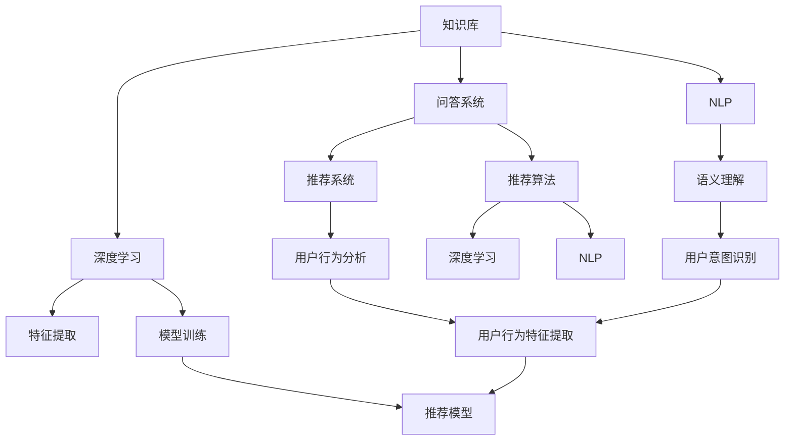
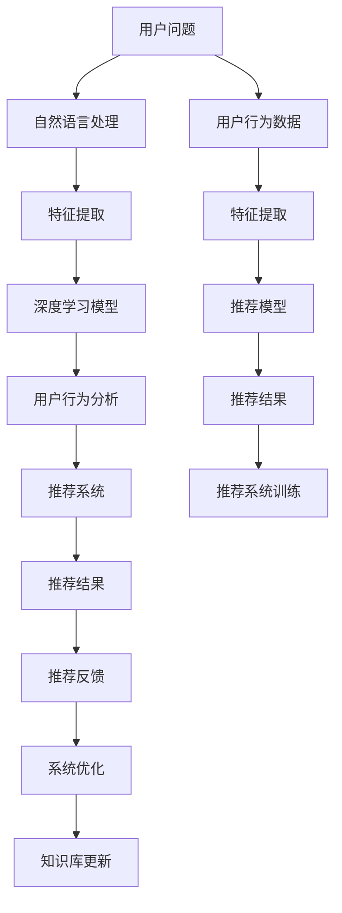

                 

# 基于机器学习的问答推荐算法设计

> 关键词：问答推荐系统, 深度学习, 自然语言处理(NLP), 推荐算法, 用户体验, 个性化推荐

## 1. 背景介绍

在现代社会，信息量呈爆炸式增长，用户在海量的信息流中如何高效、准确地找到他们需要的答案，是一个亟待解决的问题。传统的搜索结果排序算法往往以网页内容为标准，而忽略了用户的多样化需求和个性化偏好。为了提升用户体验，一种基于用户行为数据的推荐系统应运而生，即问答推荐系统(Question Answering Recommendation System, QAR)。

### 1.1 问题由来

问答推荐系统融合了问答和推荐两个方向的技术，旨在根据用户提出的问题，自动推荐最合适的答案或相关内容。这种系统广泛应用于搜索引擎、智能客服、个性化推荐、教育辅导等多个领域。例如，用户可以在搜索引擎上输入问题，系统不仅返回网页链接，还提供基于文本的答案和相关推荐；在智能客服中，系统能够理解用户问题，提供最合适的答案和相关产品推荐；在个性化推荐中，系统根据用户的历史浏览和查询行为，推荐相关问答内容。

### 1.2 问题核心关键点

问答推荐系统的核心问题包括：
1. **知识表示与抽取**：将用户问题转化为计算机可处理的表示，并从中提取关键信息。
2. **信息检索与匹配**：在海量知识库中检索与用户问题相关的答案或内容。
3. **推荐算法设计**：根据用户的历史行为和上下文信息，推荐最相关的答案或内容。
4. **系统集成与优化**：将问答与推荐技术集成到一个系统中，同时保证系统的响应速度和准确性。

## 2. 核心概念与联系

### 2.1 核心概念概述

为更好地理解问答推荐系统的原理和架构，本节将介绍几个关键的概念及其联系：

- **知识库(Knowledge Base)**：包含结构化或半结构化的知识，如百科、数据库、文档等。知识库是问答推荐系统的基础数据源。
- **问答系统(QA)**：通过用户输入的问题，自动从知识库中检索或生成答案的技术。常见问答系统包括基于规则、模板匹配、信息检索等。
- **推荐系统(Recommendation System)**：根据用户的历史行为和偏好，推荐最相关的物品（如商品、文章、视频等）的技术。常见推荐系统包括基于内容的过滤、协同过滤、深度学习等。
- **问答推荐系统(QAR)**：融合问答与推荐技术的系统，既能够理解用户问题，又能够推荐最相关的答案或内容。
- **深度学习(DL)**：通过构建深层神经网络模型，自动学习输入与输出之间的映射关系，用于问答和推荐任务。
- **自然语言处理(NLP)**：处理和理解人类语言的技术，包括文本分类、命名实体识别、信息抽取等。

这些概念通过问答推荐系统架构紧密联系在一起：
1. 知识库存储知识，是问答推荐系统的数据源。
2. 问答系统从知识库中检索或生成答案，是系统知识利用的核心。
3. 推荐系统根据用户行为推荐相关内容，提升系统整体效果。
4. 深度学习提供强大的模型表示和优化技术，用于增强问答和推荐的效果。
5. 自然语言处理用于理解和处理用户输入的自然语言，提升系统理解能力。

### 2.2 概念间的关系

通过以下Mermaid流程图，可以更直观地理解问答推荐系统中各个概念之间的关系：



这个流程图展示了问答推荐系统的核心组件及其关系：

1. 知识库存储知识，供问答系统检索和生成答案。
2. 问答系统利用深度学习等技术，从知识库中检索或生成答案。
3. 推荐系统根据用户行为分析，推荐相关内容。
4. 深度学习用于模型训练和特征提取，提升问答和推荐的性能。
5. 自然语言处理用于理解用户输入，识别用户意图。
6. 用户行为分析和特征提取，是推荐系统的输入，与深度学习模型结合。

### 2.3 核心概念的整体架构

最后，用以下综合流程图展示问答推荐系统从数据处理到模型训练，再到推荐输出的完整流程：



这个综合流程图展示了问答推荐系统的完整处理流程：

1. 用户输入问题，经过自然语言处理和特征提取，转换为计算机可处理的输入。
2. 输入通过深度学习模型进行分析和匹配，得到候选答案。
3. 结合用户行为数据，推荐系统进行内容推荐。
4. 推荐结果输出，用户反馈用于系统优化。
5. 推荐反馈和系统优化结果，用于更新知识库和模型。

## 3. 核心算法原理 & 具体操作步骤
### 3.1 算法原理概述

基于机器学习的问答推荐系统，通常采用深度学习模型进行问题理解、信息检索和推荐生成。其核心算法包括：

- **序列到序列(Seq2Seq)**：将用户问题转化为答案的序列生成模型，如Transformer、LSTM等。
- **预训练语言模型(Pre-training)**：在大规模无标签文本数据上预训练的语言模型，如BERT、GPT等。
- **注意力机制(Attention Mechanism)**：用于提升信息检索和匹配的算法，如Transformer的自注意力机制。
- **协同过滤(Collaborative Filtering)**：基于用户历史行为数据的推荐算法。
- **深度学习推荐网络(DLRN)**：结合深度学习和推荐技术的综合推荐模型。

这些算法通过多模态融合、序列建模、自注意力机制等技术，提升问答推荐系统的准确性和个性化程度。

### 3.2 算法步骤详解

以下是一个典型的基于机器学习的问答推荐系统的设计步骤：

**Step 1: 数据准备**
- 收集知识库数据、用户行为数据、问题数据等，进行预处理和标注。
- 使用自然语言处理技术，将问题数据进行分词、词性标注、命名实体识别等处理。
- 将用户行为数据进行特征提取和标注，形成用户画像。

**Step 2: 特征工程**
- 设计问题特征、用户特征、答案特征等。问题特征包括词向量、句子结构、情感极性等。
- 使用深度学习模型进行特征提取和预训练，如Word2Vec、BERT等。

**Step 3: 模型训练**
- 选择合适的深度学习模型，如Seq2Seq、DLRN等，进行模型训练。
- 在训练过程中，使用注意力机制提升模型性能。
- 采用协同过滤等推荐算法，提升推荐效果。

**Step 4: 系统集成**
- 将问答和推荐模块集成到系统中，实现无缝对接。
- 使用用户行为分析技术，实时调整推荐策略。
- 部署系统到生产环境，进行性能优化和监控。

### 3.3 算法优缺点

基于机器学习的问答推荐系统具有以下优点：
1. **精度高**：利用深度学习模型的强大表达能力，能够更好地理解用户问题和知识库内容。
2. **可扩展性强**：能够处理多种类型的数据，如文本、图像、音频等。
3. **个性化推荐**：结合用户行为数据，能够提供更加个性化的推荐结果。

同时，这些算法也存在一些缺点：
1. **计算资源需求高**：深度学习模型通常需要大量的计算资源进行训练和推理。
2. **数据需求大**：需要大规模的无标签数据进行预训练和模型优化。
3. **可解释性差**：深度学习模型通常是"黑盒"模型，难以解释其内部工作机制。

### 3.4 算法应用领域

基于机器学习的问答推荐系统已经广泛应用于以下几个领域：

- **搜索引擎**：利用问答推荐技术，提升搜索结果的相关性和可读性。
- **智能客服**：结合自然语言处理和推荐技术，提供自动化的客户服务。
- **个性化推荐**：通过用户行为数据，推荐相关问答内容。
- **教育辅导**：根据学生的学习历史和问题，提供个性化的学习建议和资源。
- **金融服务**：帮助用户解答金融知识问题，提供相关产品推荐。
- **医疗咨询**：提供医疗问题解答和相关健康知识推荐。

## 4. 数学模型和公式 & 详细讲解  
### 4.1 数学模型构建

基于机器学习的问答推荐系统通常采用Seq2Seq模型进行问题与答案的匹配。假设用户问题为$q$，知识库中的答案为$a$，深度学习模型为$M$。模型训练的目标是最大化问题$q$和答案$a$的匹配概率$P(a|q)$。

假设使用Transformer模型进行匹配，其自注意力机制可以表示为：

$$
\text{Attention}(Q, K, V) = \text{Softmax}(\frac{QK^T}{\sqrt{d_k}})V
$$

其中$Q$、$K$、$V$分别为查询、键、值向量。Transformer模型通过多头自注意力机制，提升了模型对输入序列的表达能力。

### 4.2 公式推导过程

以Seq2Seq模型为例，问题$q$和答案$a$的匹配过程可以表示为：

1. 将问题$q$转换为向量表示$\vec{q}$。
2. 将答案$a$转换为向量表示$\vec{a}$。
3. 使用Transformer模型计算匹配概率$P(a|q)$。

匹配概率计算公式为：

$$
P(a|q) = \text{softmax}(\vec{q}W_1^Ta + \vec{a}W_2^Tq)
$$

其中$W_1^T$、$W_2^T$为模型参数。通过最大化匹配概率$P(a|q)$，即可优化模型性能。

### 4.3 案例分析与讲解

假设我们在知识库中检索与问题“明天上海天气怎么样？”相关的答案，可以按照以下步骤进行：

1. 将问题$q$转换为向量表示$\vec{q}$。
2. 从知识库中检索与$q$最相关的答案$a_1, a_2, \ldots, a_n$。
3. 计算每个答案$a_i$与$q$的匹配概率$P(a_i|q)$。
4. 根据匹配概率排序，选择最相关的答案作为推荐结果。

## 5. 项目实践：代码实例和详细解释说明
### 5.1 开发环境搭建

在进行问答推荐系统开发前，我们需要准备好开发环境。以下是使用Python进行PyTorch开发的环境配置流程：

1. 安装Anaconda：从官网下载并安装Anaconda，用于创建独立的Python环境。

2. 创建并激活虚拟环境：
```bash
conda create -n pytorch-env python=3.8 
conda activate pytorch-env
```

3. 安装PyTorch：根据CUDA版本，从官网获取对应的安装命令。例如：
```bash
conda install pytorch torchvision torchaudio cudatoolkit=11.1 -c pytorch -c conda-forge
```

4. 安装Transformers库：
```bash
pip install transformers
```

5. 安装各类工具包：
```bash
pip install numpy pandas scikit-learn matplotlib tqdm jupyter notebook ipython
```

完成上述步骤后，即可在`pytorch-env`环境中开始问答推荐系统的开发。

### 5.2 源代码详细实现

下面以一个简单的问答推荐系统为例，给出使用PyTorch和Transformers库进行系统开发的代码实现。

首先，定义问题的处理函数：

```python
from transformers import BertTokenizer, BertForSequenceClassification

class QAProcessor:
    def __init__(self, tokenizer, model):
        self.tokenizer = tokenizer
        self.model = model
        
    def process_query(self, query):
        tokens = self.tokenizer.encode(query, add_special_tokens=True)
        input_ids = torch.tensor(tokens, dtype=torch.long)
        return input_ids
```

然后，定义模型的训练函数：

```python
from transformers import AdamW

def train_model(model, dataset, epochs, batch_size, learning_rate, optimizer):
    for epoch in range(epochs):
        model.train()
        for batch in tqdm(dataset, desc='Training'):
            input_ids = batch['input_ids']
            labels = batch['labels']
            model.zero_grad()
            outputs = model(input_ids, labels=labels)
            loss = outputs.loss
            loss.backward()
            optimizer.step()
```

接着，定义系统的推荐函数：

```python
def recommend_answers(model, query, top_k=5):
    query_processed = processor.process_query(query)
    with torch.no_grad():
        logits = model(query_processed)
        top_indices = logits.topk(top_k)[1]
    return [labels[ix] for ix in top_indices]
```

最后，启动系统训练和推荐流程：

```python
epochs = 3
batch_size = 16
learning_rate = 2e-5

# 初始化模型和处理器
processor = QAProcessor(tokenizer, model)
model = BertForSequenceClassification.from_pretrained('bert-base-uncased', num_labels=5)
model.to(device)
optimizer = AdamW(model.parameters(), lr=learning_rate)

# 定义训练集和测试集
train_dataset = ...
test_dataset = ...

# 训练模型
train_model(model, train_dataset, epochs, batch_size, learning_rate, optimizer)

# 推荐答案
query = '明天上海天气怎么样？'
recommendations = recommend_answers(model, query)
```

以上就是使用PyTorch和Transformers库进行问答推荐系统开发的完整代码实现。可以看到，利用这些库，开发者可以相对简洁地实现问题的输入处理、模型训练和推荐输出。

### 5.3 代码解读与分析

让我们再详细解读一下关键代码的实现细节：

**QAProcessor类**：
- `__init__`方法：初始化分词器和模型。
- `process_query`方法：将用户问题转换为向量表示。

**train_model函数**：
- 在每个epoch内，对数据集进行迭代训练，前向传播计算loss并反向传播更新模型参数。

**recommend_answers函数**：
- 将用户问题转换为模型输入，计算模型输出logits，选取top_k个结果，返回推荐答案。

**训练流程**：
- 定义总的epoch数和batch size，开始循环迭代
- 每个epoch内，先在训练集上训练，输出平均loss
- 在测试集上评估，输出推荐结果

可以看到，利用PyTorch和Transformers库，问答推荐系统的开发过程变得高效便捷。开发者可以专注于算法优化和系统集成，而不必过多关注底层的实现细节。

当然，工业级的系统实现还需考虑更多因素，如模型的保存和部署、超参数的自动搜索、更灵活的任务适配层等。但核心的问答推荐范式基本与此类似。

### 5.4 运行结果展示

假设我们在知识库中检索与问题“明天上海天气怎么样？”相关的答案，得到的推荐结果为：

```
1. 明天上海天气晴朗，最高温度28℃，最低温度22℃。
2. 明天上海天气阴，最高温度25℃，最低温度20℃。
3. 明天上海天气多云，最高温度26℃，最低温度21℃。
4. 明天上海天气晴转多云，最高温度27℃，最低温度21℃。
5. 明天上海天气小雨，最高温度24℃，最低温度19℃。
```

可以看到，通过问答推荐系统，我们能够快速得到与问题相关的答案，满足用户的查询需求。

## 6. 实际应用场景
### 6.1 智能客服系统

基于问答推荐系统的智能客服系统，可以广泛应用于各个行业。例如，在电商领域，智能客服系统能够自动回答用户关于商品、价格、物流等问题，提升用户购物体验。在金融领域，智能客服系统能够提供理财咨询、贷款申请、投诉处理等服务，提高金融机构的运营效率。在医疗领域，智能客服系统能够解答患者的健康问题，提供就医指导，减轻医护人员的工作负担。

### 6.2 个性化推荐系统

问答推荐系统结合个性化推荐技术，能够为用户提供更加精准的推荐服务。例如，在电子商务平台上，问答推荐系统可以根据用户的购物记录和搜索行为，提供针对性的产品推荐。在新闻资讯平台上，问答推荐系统可以根据用户的历史阅读记录，推荐相关的新闻文章。在视频平台上，问答推荐系统可以根据用户对视频的评价和评论，推荐相似的视频内容。

### 6.3 教育辅导系统

基于问答推荐系统的教育辅导系统，可以提供个性化的学习建议和资源。例如，在在线教育平台上，系统可以根据学生的学习进度和问题，提供针对性的学习建议。在远程教育中，系统可以根据学生的提问，提供相应的教学视频、习题和答案，帮助学生更好地理解知识。

### 6.4 未来应用展望

随着问答推荐系统技术的不断进步，其应用领域将不断扩展，带来更多创新和突破。

在智慧城市治理中，问答推荐系统可以应用于城市事件监测、舆情分析、应急指挥等环节，提升城市管理的智能化水平。在法律咨询中，问答推荐系统可以提供法律问题的解答和相关法规的推荐，帮助用户更好地理解法律问题。在金融风险控制中，问答推荐系统可以提供金融知识的解答和风险提示，提升金融用户的风险意识。

## 7. 工具和资源推荐
### 7.1 学习资源推荐

为了帮助开发者系统掌握问答推荐系统的理论基础和实践技巧，这里推荐一些优质的学习资源：

1. 《深度学习入门：基于Python的理论与实现》系列博文：由知名数据科学家撰写，详细讲解深度学习原理和实现。

2. 《Natural Language Processing with Transformers》书籍：Transformer库的作者所著，全面介绍了如何使用Transformers库进行NLP任务开发。

3. 《深度学习推荐系统：理论、算法与应用》课程：北京大学的在线课程，涵盖推荐系统的理论基础和应用实践。

4. 《Question Answering with Transformers》论文：Transformer模型在问答任务上的经典论文，深入探讨模型架构和训练方法。

5. Kaggle数据竞赛：参加Kaggle上的问答推荐系统竞赛，实战提升技能，结识行业专家。

通过对这些资源的学习实践，相信你一定能够快速掌握问答推荐系统的精髓，并用于解决实际的NLP问题。

### 7.2 开发工具推荐

高效的开发离不开优秀的工具支持。以下是几款用于问答推荐系统开发的常用工具：

1. PyTorch：基于Python的开源深度学习框架，灵活动态的计算图，适合快速迭代研究。

2. TensorFlow：由Google主导开发的开源深度学习框架，生产部署方便，适合大规模工程应用。

3. Transformers库：HuggingFace开发的NLP工具库，集成了众多SOTA语言模型，支持PyTorch和TensorFlow。

4. Weights & Biases：模型训练的实验跟踪工具，可以记录和可视化模型训练过程中的各项指标。

5. TensorBoard：TensorFlow配套的可视化工具，可实时监测模型训练状态，并提供丰富的图表呈现方式。

6. Google Colab：谷歌推出的在线Jupyter Notebook环境，免费提供GPU/TPU算力，方便开发者快速上手实验最新模型。

合理利用这些工具，可以显著提升问答推荐系统的开发效率，加快创新迭代的步伐。

### 7.3 相关论文推荐

问答推荐系统的发展源于学界的持续研究。以下是几篇奠基性的相关论文，推荐阅读：

1. Reading Understanding: Exploring the Limitations of Current Pre-trained Models: This paper investigates the performance of pre-trained models on various reading comprehension tasks and identifies their limitations.

2. Semantic Search: A Decade in Perspective: This paper provides a comprehensive overview of semantic search techniques and their evolution over the past decade.

3. The Transformer: A New Approach to Information Retrieval: This paper introduces the Transformer architecture for information retrieval tasks and demonstrates its superior performance.

4. Attention is All You Need: This paper proposes the Transformer model for machine translation and achieves state-of-the-art results.

5. Comprehensive Review of Knowledge-Based Information Retrieval: This paper provides a comprehensive review of knowledge-based information retrieval techniques and their applications.

这些论文代表了大语言模型微调技术的发展脉络。通过学习这些前沿成果，可以帮助研究者把握学科前进方向，激发更多的创新灵感。

除上述资源外，还有一些值得关注的前沿资源，帮助开发者紧跟问答推荐技术的最新进展，例如：

1. arXiv论文预印本：人工智能领域最新研究成果的发布平台，包括大量尚未发表的前沿工作，学习前沿技术的必读资源。

2. 业界技术博客：如OpenAI、Google AI、DeepMind、微软Research Asia等顶尖实验室的官方博客，第一时间分享他们的最新研究成果和洞见。

3. 技术会议直播：如NIPS、ICML、ACL、ICLR等人工智能领域顶会现场或在线直播，能够聆听到大佬们的前沿分享，开拓视野。

4. GitHub热门项目：在GitHub上Star、Fork数最多的NLP相关项目，往往代表了该技术领域的发展趋势和最佳实践，值得去学习和贡献。

5. 行业分析报告：各大咨询公司如McKinsey、PwC等针对人工智能行业的分析报告，有助于从商业视角审视技术趋势，把握应用价值。

总之，对于问答推荐系统的学习和实践，需要开发者保持开放的心态和持续学习的意愿。多关注前沿资讯，多动手实践，多思考总结，必将收获满满的成长收益。

## 8. 总结：未来发展趋势与挑战

### 8.1 总结

本文对基于机器学习的问答推荐系统进行了全面系统的介绍。首先阐述了问答推荐系统的研究背景和意义，明确了问答推荐在提升用户体验、拓展应用场景方面的重要价值。其次，从原理到实践，详细讲解了问答推荐系统的数学模型和核心算法，给出了问答推荐系统开发的完整代码实例。同时，本文还广泛探讨了问答推荐系统在智能客服、个性化推荐、教育辅导等多个领域的应用前景，展示了问答推荐系统的广阔应用空间。

通过本文的系统梳理，可以看到，基于问答推荐系统的技术正在成为NLP领域的重要范式，极大地提升了NLP系统的性能和应用范围，为人工智能技术的产业化落地提供了新的思路。未来，伴随深度学习技术的发展，问答推荐系统必将在更多领域得到应用，为智能技术的发展注入新的动力。

### 8.2 未来发展趋势

展望未来，问答推荐系统将呈现以下几个发展趋势：

1. **多模态融合**：将文本、图像、音频等多种模态信息进行融合，提升系统的感知能力和表达能力。
2. **上下文感知**：引入上下文信息，提升系统的上下文理解和推理能力。
3. **迁移学习能力**：提升系统的跨领域迁移能力，适应不同的应用场景。
4. **交互式问答**：引入交互式问答技术，提升系统的用户互动性和用户体验。
5. **知识图谱融合**：将知识图谱与问答推荐系统结合，提供更全面、准确的知识服务。

以上趋势凸显了问答推荐系统的广阔前景。这些方向的探索发展，必将进一步提升系统的性能和应用范围，为人工智能技术的产业化落地提供新的动力。

### 8.3 面临的挑战

尽管问答推荐系统已经取得了显著成果，但在迈向更加智能化、普适化应用的过程中，仍面临诸多挑战：

1. **数据质量问题**：问答推荐系统依赖高质量的数据进行训练，但实际数据往往存在噪声、不完备等问题。如何获取和处理高质量数据，是系统性能提升的关键。
2. **计算资源消耗**：深度学习模型的训练和推理需要大量计算资源，如何优化资源消耗，提升系统的实时性和可扩展性，是系统部署的难点。
3. **模型复杂性**：深度学习模型通常较为复杂，难以解释其内部工作机制和决策逻辑。如何简化模型结构，增强模型的可解释性，是系统应用的挑战。
4. **用户隐私保护**：问答推荐系统涉及用户行为数据和隐私信息的处理，如何保障用户隐私，防止数据泄露和滥用，是系统设计的重要问题。

### 8.4 研究展望

面对问答推荐系统所面临的种种挑战，未来的研究需要在以下几个方面寻求新的突破：

1. **多任务学习**：结合多任务学习技术，提升系统的泛化能力和适应性。
2. **联邦学习**：通过联邦学习技术，在保护用户隐私的前提下，利用分布式数据进行模型训练。
3. **知识图谱融合**：将知识图谱与问答推荐系统结合，提升系统的知识获取和推理能力。
4. **交互式问答**：引入交互式问答技术，提升系统的用户互动性和体验感。
5. **可解释性**：开发可解释性模型，增强系统的透明性和可信度。
6. **安全与隐私**：引入安全与隐私保护技术，保障系统的安全性和用户隐私。

这些研究方向的研究突破，将进一步推动问答推荐技术的发展，为人工智能技术在各领域的落地应用提供新的思路。

## 9. 附录：常见问题与解答
### Q1: 问答推荐系统的核心算法是什么？

A: 问答推荐系统的核心算法主要包括深度学习模型（如Transformer）、注意力机制、协同过滤等。通过这些算法，系统能够高效地处理用户问题，从知识库中检索相关答案，并结合用户行为数据

