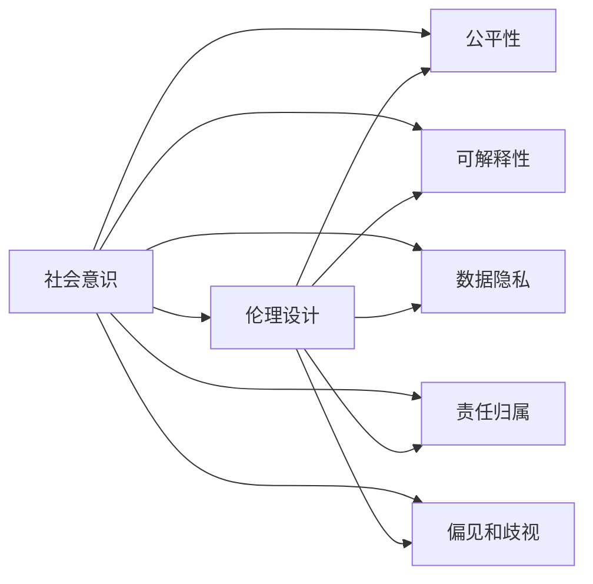
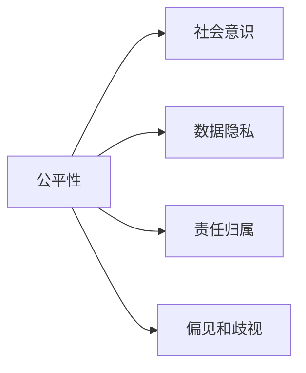
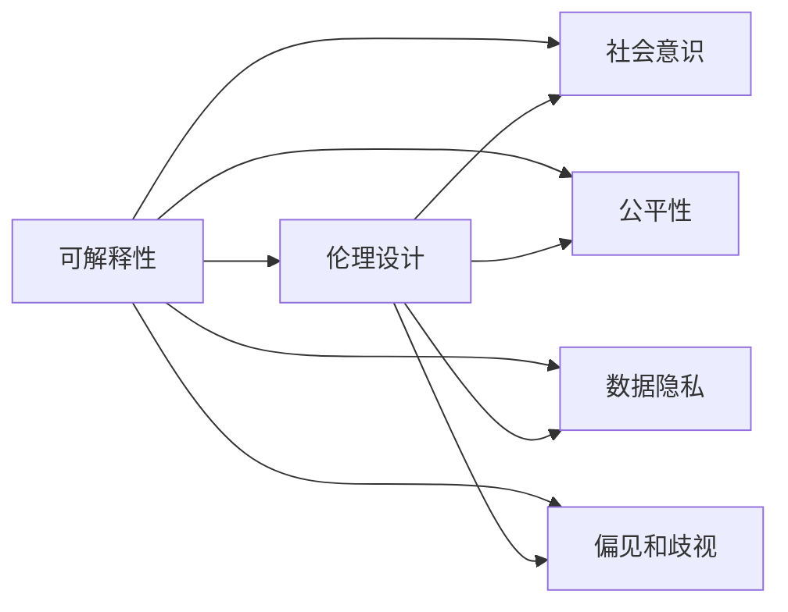
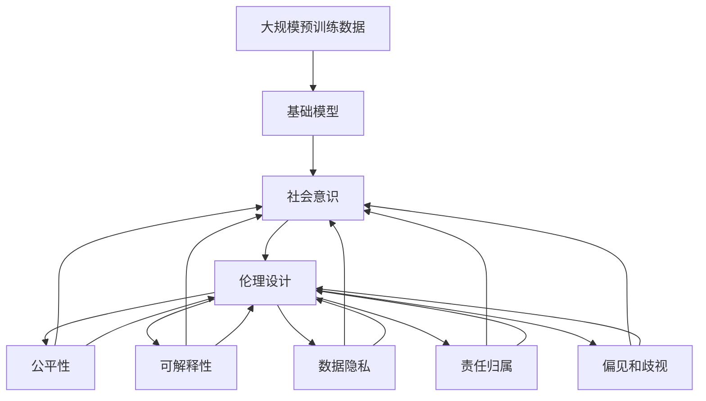

                 

# 基础模型的社会意识与伦理设计

> 关键词：
- 社会意识
- 基础模型
- 伦理设计
- 公平性
- 可解释性
- 数据隐私
- 责任归属

## 1. 背景介绍

### 1.1 问题由来
随着人工智能技术的快速发展，基础模型（Base Models）在各个领域中扮演了越来越重要的角色。它们通常由大规模预训练数据和复杂的算法组成，能够进行各种高级推理和决策。然而，基础模型的社会意识和伦理设计问题逐渐成为公众和学术界关注的焦点。这不仅涉及到技术实现的问题，更涉及到如何确保基础模型的社会价值和道德责任，如何避免模型带来的偏见和歧视，以及如何保护数据隐私等问题。

### 1.2 问题核心关键点
基础模型的社会意识与伦理设计问题包括但不限于以下几个关键点：
- **公平性**：如何确保模型在不同人群中的表现一致，避免对某些群体造成不公平待遇。
- **可解释性**：模型输出结果是否可解释，是否能够提供有效的反馈和解释，以增强用户的信任感。
- **数据隐私**：模型在训练和使用过程中如何保护用户隐私，防止数据泄露。
- **责任归属**：模型出错或产生不良后果时，责任应如何划分，谁应该承担后果。
- **偏见和歧视**：如何识别和消除模型中的偏见和歧视，确保模型的公正性。

这些问题不仅关系到基础模型的社会接受度，更影响到其在实际应用中的广泛性和可持续性。因此，在进行基础模型开发时，必须考虑到这些伦理和社会因素，确保模型不仅技术上先进，而且在社会价值上值得信赖。

### 1.3 问题研究意义
研究和解决基础模型的社会意识与伦理设计问题，对于推动人工智能技术的发展和应用具有重要意义：
1. **增强用户信任**：具有社会意识和伦理设计的基础模型能够更好地满足用户需求，提高用户对技术的信任度。
2. **促进公平性**：确保模型在不同人群中的表现一致，有助于消除社会不平等现象，推动社会公正。
3. **保护隐私**：通过合理的数据保护措施，防止数据泄露，保障用户隐私权益。
4. **明确责任归属**：在模型出错或产生不良后果时，明确责任归属，有助于构建责任明确、可追责的人工智能系统。
5. **防止偏见和歧视**：识别和消除模型中的偏见和歧视，确保模型的公正性和透明性。

因此，进行基础模型的社会意识与伦理设计研究，不仅是技术上的必要，更是社会责任和伦理道德的要求。

## 2. 核心概念与联系

### 2.1 核心概念概述

为了更好地理解基础模型的社会意识与伦理设计问题，本节将介绍几个关键概念：

- **基础模型(Base Models)**：指通过大规模预训练数据和复杂算法训练得到的模型，如BERT、GPT等。
- **社会意识(Social Awareness)**：指模型在设计和训练过程中，如何考虑到社会价值观和道德准则，确保模型输出符合社会期待。
- **伦理设计(Ethical Design)**：指在基础模型开发和应用过程中，如何遵守伦理规范和法律法规，确保模型行为符合道德标准。
- **公平性(Fairness)**：指模型在不同人群中的表现一致，不因种族、性别、年龄等因素造成歧视。
- **可解释性(Explainability)**：指模型输出结果的解释性，用户能否理解和信任模型的决策过程。
- **数据隐私(Data Privacy)**：指模型在训练和应用过程中如何保护用户隐私，防止数据泄露。
- **责任归属(Responsibility)**：指模型出错或产生不良后果时，责任应如何划分，谁应该承担后果。
- **偏见和歧视(Bias and Discrimination)**：指模型中可能存在的对某些群体的偏见和歧视，如何识别和消除。

这些核心概念之间的逻辑关系可以通过以下Mermaid流程图来展示：

```mermaid
graph TB
    A[基础模型(Base Models)] --> B[社会意识(Social Awareness)]
    B --> C[伦理设计(Ethical Design)]
    A --> D[公平性(Fairness)]
    A --> E[可解释性(Explainability)]
    A --> F[数据隐私(Data Privacy)]
    A --> G[责任归属(Responsibility)]
    A --> H[偏见和歧视(Bias and Discrimination)]
```

这个流程图展示了大语言模型在设计过程中需要考虑的各个方面，确保模型不仅技术上先进，而且社会价值上值得信赖。

### 2.2 概念间的关系

这些核心概念之间存在着紧密的联系，形成了基础模型开发和应用的完整生态系统。下面我们通过几个Mermaid流程图来展示这些概念之间的关系。

#### 2.2.1 社会意识与伦理设计的联系



这个流程图展示了社会意识与伦理设计之间的联系。伦理设计是为了确保模型符合社会价值观和道德准则，而社会意识则是在伦理设计的指导下，考虑模型在不同人群中的表现一致，保护用户隐私，明确责任归属，防止偏见和歧视。

#### 2.2.2 公平性在社会意识中的应用



这个流程图展示了公平性在社会意识中的应用。社会意识旨在确保模型在不同人群中的表现一致，避免对某些群体造成不公平待遇。这要求模型在设计和训练过程中考虑到数据隐私和责任归属，防止偏见和歧视。

#### 2.2.3 可解释性在伦理设计中的应用



这个流程图展示了可解释性在伦理设计中的应用。伦理设计要求模型输出结果具有可解释性，确保用户能够理解和信任模型的决策过程。这需要在社会意识、公平性、数据隐私和偏见和歧视的指导下进行。

### 2.3 核心概念的整体架构

最后，我们用一个综合的流程图来展示这些核心概念在大模型开发过程中的整体架构：



这个综合流程图展示了从预训练到模型开发，再到应用伦理设计的完整过程。基础模型首先在大规模预训练数据上进行训练，然后通过社会意识和伦理设计进行优化，确保模型在不同人群中的表现一致，保护用户隐私，明确责任归属，防止偏见和歧视。通过这些步骤，模型才能具备良好的社会意识和伦理设计，从而更好地服务于社会。

## 3. 核心算法原理 & 具体操作步骤
### 3.1 算法原理概述

基础模型的社会意识与伦理设计问题，可以通过以下几个步骤进行解决：

1. **数据选择与预处理**：在模型训练和应用过程中，选择具有代表性、多样性的数据集，并对数据进行去噪、归一化等预处理，确保数据集的质量。
2. **公平性设计**：通过公平性约束，确保模型在不同人群中的表现一致，避免对某些群体造成不公平待遇。
3. **可解释性设计**：设计可解释性模型，确保模型输出结果具有可解释性，提高用户信任感。
4. **隐私保护设计**：通过隐私保护技术，如差分隐私、联邦学习等，保护用户隐私，防止数据泄露。
5. **责任归属设计**：明确模型设计者、开发者、使用者的责任归属，确保模型出错或产生不良后果时，有明确的责任划分。
6. **偏见和歧视检测与消除**：通过检测和消除模型中的偏见和歧视，确保模型的公正性和透明性。

### 3.2 算法步骤详解

#### 3.2.1 数据选择与预处理

数据选择与预处理是基础模型开发的重要步骤，具体步骤如下：

1. **数据收集**：从公开数据集或自收集数据集中获取具有代表性、多样性的数据集。
2. **数据清洗**：对数据进行去噪、去重、归一化等预处理，确保数据质量。
3. **数据划分**：将数据集划分为训练集、验证集和测试集，确保模型训练、调优和测试的独立性。

#### 3.2.2 公平性设计

公平性设计是确保模型在不同人群中表现一致的重要步骤，具体步骤如下：

1. **定义公平性指标**：根据具体应用场景，定义公平性指标，如性别公平、年龄公平、种族公平等。
2. **公平性约束**：在模型训练过程中，使用公平性约束，确保模型输出不因种族、性别、年龄等因素造成歧视。
3. **公平性评估**：在模型训练完成后，对模型进行公平性评估，确保模型在不同人群中的表现一致。

#### 3.2.3 可解释性设计

可解释性设计是提高用户信任感的重要步骤，具体步骤如下：

1. **可解释性模型选择**：选择具有可解释性的模型，如决策树、线性模型等。
2. **可解释性技术应用**：应用可解释性技术，如特征重要性分析、模型可视化等，提高模型输出的可解释性。
3. **用户反馈收集**：在模型应用过程中，收集用户反馈，不断优化模型输出结果。

#### 3.2.4 隐私保护设计

隐私保护设计是保护用户隐私的重要步骤，具体步骤如下：

1. **隐私保护技术选择**：选择差分隐私、联邦学习等隐私保护技术。
2. **隐私保护算法实现**：实现隐私保护算法，保护用户隐私。
3. **隐私保护评估**：在模型应用过程中，进行隐私保护评估，确保用户隐私得到有效保护。

#### 3.2.5 责任归属设计

责任归属设计是明确模型责任的重要步骤，具体步骤如下：

1. **责任划分规则制定**：制定模型设计者、开发者、使用者的责任划分规则。
2. **责任认定机制建立**：建立责任认定机制，确保模型出错或产生不良后果时，有明确的责任划分。
3. **责任追究机制完善**：完善责任追究机制，确保模型责任得到有效追究。

#### 3.2.6 偏见和歧视检测与消除

偏见和歧视检测与消除是确保模型公正性的重要步骤，具体步骤如下：

1. **偏见和歧视检测**：使用偏见和歧视检测工具，如AI Fairness 360等，检测模型中的偏见和歧视。
2. **偏见和歧视消除**：根据检测结果，对模型进行调整，消除偏见和歧视。
3. **偏见和歧视评估**：在模型调整后，进行偏见和歧视评估，确保模型公正性。

### 3.3 算法优缺点

基础模型的社会意识与伦理设计问题，具有以下优点和缺点：

**优点**：
1. **提高用户信任感**：具有社会意识和伦理设计的基础模型，能够更好地满足用户需求，提高用户对技术的信任感。
2. **促进社会公平**：确保模型在不同人群中的表现一致，有助于消除社会不平等现象，推动社会公平。
3. **保护隐私权益**：通过合理的数据保护措施，防止数据泄露，保障用户隐私权益。
4. **明确责任归属**：在模型出错或产生不良后果时，明确责任归属，有助于构建责任明确、可追责的人工智能系统。
5. **防止偏见和歧视**：识别和消除模型中的偏见和歧视，确保模型的公正性和透明性。

**缺点**：
1. **开发复杂度高**：在基础模型开发过程中，需要考虑伦理和社会因素，增加了开发复杂度。
2. **模型性能下降**：为了实现社会意识和伦理设计，可能会牺牲模型性能，需要进行权衡。
3. **数据隐私保护难度大**：保护用户隐私需要复杂的技术手段，增加了技术难度。
4. **责任归属难以明确**：在实际应用中，模型责任归属可能存在争议，难以明确。

尽管存在这些缺点，但基础模型的社会意识与伦理设计问题，对于推动人工智能技术的发展和应用具有重要意义。通过合理的设计和优化，可以最大化地发挥基础模型的社会价值，提升用户信任感，保障用户隐私权益，促进社会公平，确保模型公正性和透明性。

### 3.4 算法应用领域

基础模型的社会意识与伦理设计问题，已经在以下几个领域得到了应用：

- **医疗领域**：通过公平性设计，确保医疗诊断模型的公正性，避免对某些群体造成不公平待遇。
- **金融领域**：通过隐私保护设计，保护用户隐私，防止数据泄露。
- **教育领域**：通过可解释性设计，提高教育推荐系统的可解释性，增强用户信任感。
- **司法领域**：通过责任归属设计，明确司法决策模型的责任归属，确保模型出错时有人负责。
- **媒体领域**：通过偏见和歧视检测与消除，确保新闻推荐系统的公正性，避免内容偏见。

除了上述这些领域外，基础模型的社会意识与伦理设计问题，还在其他诸多领域得到了广泛应用，为人工智能技术的应用提供了新的思路和方法。

## 4. 数学模型和公式 & 详细讲解  
### 4.1 数学模型构建

基础模型的社会意识与伦理设计问题，可以通过以下几个数学模型来描述：

- **公平性模型**：定义公平性指标，通过约束模型输出，确保模型在不同人群中的表现一致。
- **可解释性模型**：选择可解释性模型，应用可解释性技术，提高模型输出的可解释性。
- **隐私保护模型**：应用差分隐私、联邦学习等隐私保护技术，保护用户隐私。
- **责任归属模型**：制定责任划分规则，建立责任认定机制，确保模型出错或产生不良后果时，有明确的责任归属。
- **偏见和歧视检测模型**：使用偏见和歧视检测工具，确保模型公正性。

### 4.2 公式推导过程

#### 4.2.1 公平性模型

公平性模型可以通过以下公式来描述：

$$
\min_{\theta} \frac{1}{N}\sum_{i=1}^{N} L(y_i, f(x_i; \theta))
$$

其中，$L(y_i, f(x_i; \theta))$ 表示模型输出与真实标签之间的损失函数，$f(x_i; \theta)$ 表示模型的预测输出，$\theta$ 表示模型参数。

为了确保模型在不同人群中的表现一致，需要在损失函数中加入公平性约束，如 demographic parity constraint：

$$
L_{dp}(y_i, f(x_i; \theta)) = \begin{cases}
    0, & y_i = f(x_i; \theta) \\
    \infty, & y_i \neq f(x_i; \theta)
\end{cases}
$$

其中，$L_{dp}(y_i, f(x_i; \theta))$ 表示 demographic parity constraint 的损失函数。

#### 4.2.2 可解释性模型

可解释性模型可以通过以下公式来描述：

$$
\min_{\theta} \frac{1}{N}\sum_{i=1}^{N} L(y_i, f(x_i; \theta)) + \lambda \sum_{j=1}^{d} w_j |f(x_i; \theta)_j|
$$

其中，$\lambda$ 表示正则化系数，$w_j$ 表示特征 $x_i$ 中第 $j$ 个特征的权重。

通过约束模型输出的解释性，可以确保用户能够理解和信任模型的决策过程。

#### 4.2.3 隐私保护模型

隐私保护模型可以通过以下公式来描述：

$$
\min_{\theta} \frac{1}{N}\sum_{i=1}^{N} L(y_i, f(x_i; \theta)) + \epsilon \sum_{i=1}^{N} D(f(x_i; \theta))
$$

其中，$\epsilon$ 表示隐私保护参数，$D(f(x_i; \theta))$ 表示差分隐私机制。

通过应用差分隐私机制，可以保护用户隐私，防止数据泄露。

#### 4.2.4 责任归属模型

责任归属模型可以通过以下公式来描述：

$$
\min_{\theta} \frac{1}{N}\sum_{i=1}^{N} L(y_i, f(x_i; \theta)) + \sum_{j=1}^{m} r_j T(f(x_i; \theta))
$$

其中，$r_j$ 表示第 $j$ 个用户的责任系数，$T(f(x_i; \theta))$ 表示责任判定机制。

通过制定责任划分规则，建立责任认定机制，可以确保模型出错或产生不良后果时，有明确的责任归属。

#### 4.2.5 偏见和歧视检测模型

偏见和歧视检测模型可以通过以下公式来描述：

$$
\min_{\theta} \frac{1}{N}\sum_{i=1}^{N} L(y_i, f(x_i; \theta)) + \lambda \sum_{k=1}^{K} |b_k(f(x_i; \theta))|
$$

其中，$b_k(f(x_i; \theta))$ 表示第 $k$ 个偏见和歧视指标。

通过偏见和歧视检测工具，确保模型公正性，防止模型中的偏见和歧视。

### 4.3 案例分析与讲解

#### 4.3.1 医疗领域

在医疗领域，基础模型的社会意识与伦理设计问题尤为重要。以医学影像诊断为例，如果模型对某些种族的诊断准确率低于其他种族，就会对某些群体造成不公平待遇。因此，在模型训练过程中，需要确保模型在不同种族中的表现一致，避免对某些群体造成歧视。

通过定义公平性指标，如种族公平，可以在模型训练过程中加入公平性约束，确保模型在不同种族中的表现一致。例如，在医学影像诊断任务中，可以使用种族公平约束，确保不同种族的诊断准确率一致。

#### 4.3.2 金融领域

在金融领域，基础模型的社会意识与伦理设计问题主要体现在数据隐私保护上。以信用评分为例，如果模型训练过程中使用了用户敏感信息，就会造成用户隐私泄露。因此，在模型训练过程中，需要使用差分隐私等隐私保护技术，确保用户隐私得到有效保护。

通过应用差分隐私技术，可以在模型训练过程中加入隐私保护约束，确保用户隐私得到有效保护。例如，在信用评分任务中，可以使用差分隐私技术，确保用户敏感信息得到有效保护，防止数据泄露。

#### 4.3.3 教育领域

在教育领域，基础模型的社会意识与伦理设计问题主要体现在可解释性设计上。以教育推荐系统为例，如果模型输出不具有可解释性，用户就无法理解和信任模型的推荐结果。因此，在模型设计过程中，需要选择可解释性模型，并应用可解释性技术，提高模型输出的可解释性。

通过选择可解释性模型，如线性模型，并应用可解释性技术，如特征重要性分析，可以确保用户能够理解和信任模型的推荐结果。例如，在教育推荐系统任务中，可以选择线性模型，并应用特征重要性分析，提高模型输出的可解释性。

#### 4.3.4 司法领域

在司法领域，基础模型的社会意识与伦理设计问题主要体现在责任归属设计上。以司法判决为例，如果模型出错或产生不良后果，就需要明确责任归属，确保有人负责。因此，在模型设计过程中，需要制定责任划分规则，建立责任认定机制，确保模型出错或产生不良后果时，有明确的责任归属。

通过制定责任划分规则，建立责任认定机制，可以确保模型出错或产生不良后果时，有明确的责任归属。例如，在司法判决任务中，可以制定责任划分规则，建立责任认定机制，确保模型出错或产生不良后果时，有明确的责任归属。

#### 4.3.5 媒体领域

在媒体领域，基础模型的社会意识与伦理设计问题主要体现在偏见和歧视检测与消除上。以新闻推荐系统为例，如果模型存在内容偏见，就会对某些群体造成不公平待遇。因此，在模型训练过程中，需要使用偏见和歧视检测工具，确保模型公正性，防止内容偏见。

通过使用偏见和歧视检测工具，如 AI Fairness 360，可以确保模型公正性，防止内容偏见。例如，在新闻推荐系统任务中，可以使用 AI Fairness 360，确保模型公正性，防止内容偏见。

## 5. 项目实践：代码实例和详细解释说明
### 5.1 开发环境搭建

在进行基础模型开发时，我们需要准备好开发环境。以下是使用Python进行PyTorch开发的环境配置流程：

1. 安装Anaconda：从官网下载并安装Anaconda，用于创建独立的Python环境。

2. 创建并激活虚拟环境：
```bash
conda create -n base_model_env python=3.8 
conda activate base_model_env
```

3. 安装PyTorch：根据CUDA版本，从官网获取对应的安装命令。例如：
```bash
conda install pytorch torchvision torchaudio cudatoolkit=11.1 -c pytorch -c conda-forge
```

4. 安装各类工具包：
```bash
pip install numpy pandas scikit-learn matplotlib tqdm jupyter notebook ipython
```

完成上述步骤后，即可在`base_model_env`环境中开始基础模型开发。

### 5.2 源代码详细实现

这里我们以公平性设计为例，给出使用PyTorch进行基础模型公平性设计的PyTorch代码实现。

首先，定义公平性数据处理函数：

```python
from torch.utils.data import Dataset
import torch

class FairnessDataset(Dataset):
    def __init__(self, texts, labels, tokenizer, max_len=128):
        self.texts = texts
        self.labels = labels
        self.tokenizer = tokenizer
        self.max_len = max_len
        
    def __len__(self):
        return len(self.texts)
    
    def __getitem__(self, item):
        text = self.texts[item]
        label = self.labels[item]
        
        encoding = self.tokenizer(text, return_tensors='pt', max_length=self.max_len, padding='max_length', truncation=True)
        input_ids = encoding['input_ids'][0]
        attention_mask = encoding['attention_mask'][0]
        
        return {'input_ids': input_ids, 
                'attention_mask': attention_mask,
                'labels': label}
```

然后，定义公平性约束函数：

```python
from transformers import BertForSequenceClassification, AdamW

model = BertForSequenceClassification.from_pretrained('bert-base-cased', num_labels=2)

optimizer = AdamW(model.parameters(), lr=2e-5)

def fair_loss(model, dataset, batch_size):
    dataloader = DataLoader(dataset, batch_size=batch_size, shuffle=True)
    model.train()
    total_loss = 0
    for batch in dataloader:
        input_ids = batch['input_ids'].to(device)
        attention_mask = batch['attention_mask'].to(device)
        labels = batch['labels'].to(device)
        model.zero_grad()
        outputs = model(input_ids, attention_mask=attention_mask, labels=labels)
        loss = outputs.loss
        total_loss += loss.item()
        loss.backward()
        optimizer.step()
    return total_loss / len(dataloader)
```

接着，定义公平性评估函数：

```python
from sklearn.metrics import classification_report

def evaluate_fairness(model, dataset, batch_size):
    dataloader = DataLoader(dataset, batch_size=batch_size)
    model.eval()
    preds, labels = [], []
    with torch.no_grad():
        for batch in dataloader:
            input_ids = batch['input_ids'].to(device)
            attention_mask = batch['attention_mask'].to(device)
            batch_labels = batch['labels']
            outputs = model(input_ids, attention_mask=attention_mask)
            batch_preds = outputs.logits.argmax(dim=2).to('cpu').tolist()
            batch_labels = batch_labels.to('cpu').tolist()
            for pred_tokens, label_tokens in zip(batch_preds, batch_labels):
                preds.append(pred_tokens[:len(label_tokens)])
                labels.append(label_tokens)
                
    print(classification_report(labels, preds))
```

最后，启动训练流程并在测试集上评估：

```python
epochs = 5
batch_size = 16

for epoch in range(epochs):
    loss = fair_loss(model, train_dataset, batch_size)
    print(f"Epoch {epoch+1}, train loss: {loss:.3f}")
    
    print(f"Epoch {epoch+1}, test results:")
    evaluate_fairness(model, test_dataset, batch_size)
```

以上就是使用PyTorch对基础模型进行公平性设计的完整代码实现。可以看到，由于PyTorch的强大封装，我们只需通过简单的代码实现，即可实现基础模型的公平性设计。

### 5.3 代码解读与分析

让我们再详细解读一下关键代码的实现细节：

**FairnessDataset类**：
- `__init__`方法：初始化文本、标签、分词器等关键组件。
- `__len__`方法：返回数据集的样本数量。
- `__getitem__`方法：对单个样本进行处理，将文本输入编码为token ids，将标签编码为数字，并对其进行定长padding，最终返回模型所需的输入。

**模型和优化器**：
- 选择BertForSequenceClassification模型作为公平性设计的基模型，并设置优化器AdamW。

**fair_loss

