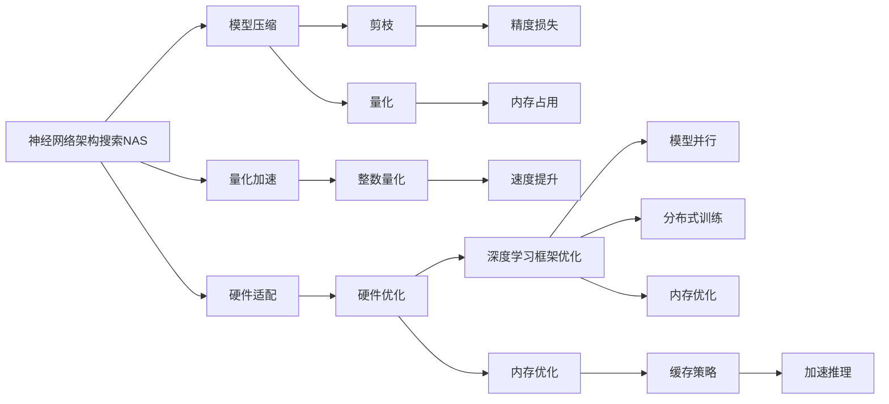

                 

# NAS在移动端AI应用开发中的角色

> 关键词：
- 神经网络架构搜索(NAS)
- 移动端AI应用开发
- 模型压缩
- 量化加速
- 硬件适配
- 优化策略

## 1. 背景介绍

随着人工智能技术的迅猛发展，AI应用已经广泛渗透到各个行业和领域，尤其在移动端应用开发中，AI技术的应用已经成为了提升用户体验、优化系统性能的重要手段。然而，面对有限的手机硬件资源，如何在保证AI应用性能的前提下，高效地开发和部署AI模型，成为了移动端AI应用开发中的一大挑战。

神经网络架构搜索（Neural Architecture Search, NAS）技术应运而生，通过自动化的方式寻找最优的神经网络架构，显著提高了AI模型的开发效率和性能，为移动端AI应用开发提供了强有力的工具。

### 1.1 问题由来
移动端AI应用开发过程中，面临的主要问题包括：
1. **计算资源有限**：移动设备通常具有较低的计算能力和内存限制，如何在资源受限的环境中高效运行AI模型是一个挑战。
2. **模型效率要求高**：用户对应用响应速度的要求极高，如何在保证模型性能的同时，降低模型的计算和存储开销，是开发移动端AI应用的关键。
3. **硬件适配问题**：不同型号的移动设备硬件架构差异较大，如何在多种硬件平台上适配AI模型，是开发过程中需要考虑的重要因素。
4. **实时性要求高**：许多移动应用需要在用户交互时快速响应，如何在保持实时性的同时，提高模型的推理速度，是开发过程中需要解决的难点。

### 1.2 问题核心关键点
NAS技术通过自动化搜索算法，从大量的神经网络架构中寻找最优解，其核心思想是将传统的“手工设计”神经网络架构的方式，转变为自动化的“搜索-验证-优化”过程。这种自动化的搜索过程，大大提高了神经网络架构设计的效率和精度，尤其在移动端AI应用开发中，能够快速找到满足特定需求的模型架构，实现高性能和低延迟的目标。

## 2. 核心概念与联系

### 2.1 核心概念概述

为了更好地理解NAS在移动端AI应用开发中的作用，本节将介绍几个核心概念及其之间的联系：

- **神经网络架构搜索（NAS）**：通过自动化搜索算法寻找最优的神经网络架构，包括网络的层数、大小、连接方式等，旨在提高模型的性能和效率。
- **模型压缩（Model Compression）**：通过剪枝、量化、蒸馏等技术，减小模型的计算和存储开销，提高模型的运行效率。
- **量化加速（Quantization Acceleration）**：将浮点数参数转换为低精度整数参数，减少模型对计算资源的依赖，提高模型的推理速度。
- **硬件适配（Hardware Optimization）**：通过调整模型结构、优化算法等手段，使模型能够在不同硬件平台上高效运行。
- **优化策略（Optimization Strategies）**：包括剪枝、量化、稀疏化、知识蒸馏等，用于提升模型的性能和效率。

这些概念通过NAS技术有机结合，形成一个完整的优化流程，从模型设计到模型优化，最终实现高效的移动端AI应用开发。

### 2.2 概念间的关系

这些核心概念之间的逻辑关系可以通过以下Mermaid流程图来展示：



这个流程图展示了NAS与其他关键概念之间的联系：

1. **NAS** 搜索最优的模型架构，作为后续优化和压缩的起点。
2. **模型压缩** 包括剪枝、量化等技术，通过减少计算量和存储需求，提高模型效率。
3. **量化加速** 通过降低模型参数的精度，进一步提升模型推理速度。
4. **硬件适配** 涉及深度学习框架优化、模型并行、分布式训练等，确保模型能够在多种硬件平台上高效运行。
5. **优化策略** 包括精度损失、内存占用优化等，通过多层次的策略优化，全面提升模型性能。

这些概念共同构成了NAS技术在移动端AI应用开发中的完整优化流程，使得开发者能够高效地开发和部署高效、轻量化的AI模型。

## 3. 核心算法原理 & 具体操作步骤

### 3.1 算法原理概述

NAS技术通过自动化搜索算法，从大量的神经网络架构中寻找最优解。其核心思想是将神经网络架构设计转换为一个优化问题，通过搜索算法在候选网络架构中寻找性能最优的解决方案。

一般来说，NAS算法可以分为两个阶段：搜索阶段和验证阶段。在搜索阶段，算法会在预定义的架构空间中随机生成或通过已有架构进行组合，生成一系列候选网络架构。在验证阶段，算法会根据预设的评价指标（如精度、延迟等）对候选架构进行评估，选择最优的架构作为最终结果。

### 3.2 算法步骤详解

NAS在移动端AI应用开发中的应用主要分为以下几个步骤：

**Step 1: 定义架构搜索空间**

在移动端AI应用开发中，需要定义一个合适的神经网络架构搜索空间。这个空间应包括所有可能的架构参数，如层数、每层神经元数量、连接方式、激活函数等。

**Step 2: 搜索算法选择**

选择合适的搜索算法，如遗传算法、贝叶斯优化、强化学习等，通过这些算法从搜索空间中生成和评估候选网络架构。

**Step 3: 验证与评估**

将生成的候选架构在特定数据集上进行训练和验证，评估其性能指标，如准确率、延迟等。选择性能最好的架构作为最终结果。

**Step 4: 模型压缩与量化**

对最优架构进行剪枝、量化等操作，进一步减小模型计算量和存储需求。

**Step 5: 硬件适配与优化**

根据目标硬件平台的特点，对模型进行硬件适配和优化，如调整卷积核大小、优化数据流路径等。

**Step 6: 部署与测试**

将优化后的模型部署到目标硬件平台，进行测试和优化，确保模型在实际应用中表现良好。

### 3.3 算法优缺点

NAS技术在移动端AI应用开发中具有以下优点：

1. **高效性**：通过自动化搜索，快速找到最优模型架构，节省了大量手工设计的时间。
2. **灵活性**：能够灵活调整架构参数，适应不同的应用场景和需求。
3. **普适性**：适用于多种深度学习框架和硬件平台。
4. **可扩展性**：能够在大规模架构空间中搜索，提高模型性能和效率。

同时，NAS技术也存在一些缺点：

1. **计算成本高**：搜索过程通常需要大量计算资源，特别是在大规模架构空间中。
2. **复杂性高**：搜索算法的复杂性较高，实现难度较大。
3. **过度拟合风险**：如果搜索空间设计不当，可能导致过度拟合问题。

### 3.4 算法应用领域

NAS技术在移动端AI应用开发中具有广泛的应用场景，包括但不限于：

- **图像识别**：在移动端设备上实现高效、高精度的图像分类、目标检测等功能。
- **语音识别**：在移动设备上实现实时语音识别和转录功能。
- **自然语言处理**：在移动端设备上实现文本分类、情感分析等功能。
- **推荐系统**：在移动设备上实现个性化推荐功能。
- **游戏AI**：在移动游戏开发中实现智能NPC和自适应游戏策略。

## 4. 数学模型和公式 & 详细讲解 & 举例说明

### 4.1 数学模型构建

NAS算法的数学模型构建通常包括以下几个关键步骤：

1. **定义搜索空间**：将神经网络架构参数定义为一个向量 $X = [x_1, x_2, ..., x_n]$，其中 $x_i$ 代表第 $i$ 个架构参数。
2. **定义评价指标**：选择评价指标 $f(X)$，如准确率、延迟、参数量等。
3. **搜索算法**：选择搜索算法 $A$，从搜索空间中生成和评估候选架构。
4. **优化过程**：通过优化算法 $O$，在搜索空间中寻找最优解 $X^*$。

数学公式如下：

$$
X^* = \mathop{\arg\min}_{X} f(X)
$$

其中，$f(X)$ 为评价指标，$A$ 为搜索算法，$O$ 为优化算法。

### 4.2 公式推导过程

以遗传算法为例，遗传算法的核心思想是通过模拟自然进化过程，不断进化候选网络架构。具体步骤如下：

1. **初始化种群**：随机生成初始种群，每个个体代表一种候选架构。
2. **选择操作**：通过适应度函数选择保留优秀的个体，淘汰劣质个体。
3. **交叉操作**：对保留的个体进行交叉操作，产生新的个体。
4. **变异操作**：对新的个体进行变异操作，增加种群多样性。
5. **优化过程**：在每个迭代周期中，使用评价指标 $f(X)$ 评估个体性能，选择最优个体进行复制和保留，迭代直至收敛。

数学公式如下：

$$
X_{i+1} = \alpha X_i + \beta X_j + \sigma X_k
$$

其中，$X_i, X_j, X_k$ 为种群中的个体，$\alpha, \beta, \sigma$ 为交叉和变异系数，$X_{i+1}$ 为新的个体。

### 4.3 案例分析与讲解

以移动端图像分类为例，通过NAS技术找到最优模型架构：

1. **定义搜索空间**：搜索空间包括卷积层数量、卷积核大小、池化操作、激活函数等。
2. **选择搜索算法**：使用贝叶斯优化算法。
3. **生成和评估候选架构**：通过贝叶斯优化算法生成多种候选架构，在ImageNet数据集上进行训练和验证，选择最优架构。
4. **压缩和量化**：对最优架构进行剪枝和量化，减小计算量和存储需求。
5. **硬件适配和优化**：根据目标硬件平台的特点，进行硬件适配和优化。
6. **测试和部署**：在实际设备上测试模型性能，并进行优化。

## 5. 项目实践：代码实例和详细解释说明

### 5.1 开发环境搭建

在进行NAS项目实践前，我们需要准备好开发环境。以下是使用Python进行TensorFlow和Keras实现NAS的开发环境配置流程：

1. 安装Anaconda：从官网下载并安装Anaconda，用于创建独立的Python环境。

2. 创建并激活虚拟环境：
```bash
conda create -n tf-env python=3.8 
conda activate tf-env
```

3. 安装TensorFlow：
```bash
pip install tensorflow
```

4. 安装Keras：
```bash
pip install keras
```

5. 安装各类工具包：
```bash
pip install numpy pandas scikit-learn matplotlib tqdm jupyter notebook ipython
```

完成上述步骤后，即可在`tf-env`环境中开始NAS实践。

### 5.2 源代码详细实现

下面我们以图像分类任务为例，给出使用TensorFlow和Keras实现NAS的PyTorch代码实现。

首先，定义模型和优化器：

```python
from tensorflow.keras.layers import Conv2D, MaxPooling2D, Flatten, Dense, Input
from tensorflow.keras.models import Model
from tensorflow.keras.optimizers import Adam
from tensorflow.keras.callbacks import EarlyStopping
import tensorflow as tf

input_shape = (224, 224, 3)
num_classes = 10

# 定义模型输入
inputs = Input(shape=input_shape)

# 定义卷积层
conv1 = Conv2D(32, 3, activation='relu')(inputs)
conv1 = Conv2D(64, 3, activation='relu')(conv1)
pool1 = MaxPooling2D(pool_size=(2, 2))(conv1)

# 定义全连接层
flat = Flatten()(pool1)
dense1 = Dense(128, activation='relu')(flat)
dense2 = Dense(64, activation='relu')(dense1)
output = Dense(num_classes, activation='softmax')(dense2)

# 定义模型
model = Model(inputs=inputs, outputs=output)
model.compile(optimizer=Adam(lr=0.001), loss='categorical_crossentropy', metrics=['accuracy'])

# 定义早期停止策略
early_stop = EarlyStopping(monitor='val_loss', patience=3)
```

然后，定义NAS搜索过程：

```python
# 定义搜索空间
num_layers = [1, 2, 3, 4, 5]
filters = [32, 64, 128]
kernel_sizes = [3, 5, 7]
pool_sizes = [2, 3]
activation_functions = ['relu', 'swish', 'sigmoid']

# 定义搜索算法
def search_space():
    return num_layers, filters, kernel_sizes, pool_sizes, activation_functions

# 生成候选架构
def generate_architectures(search_space):
    architectures = []
    for layer_count in num_layers:
        for filters_count in filters:
            for kernel_size in kernel_sizes:
                for pool_size in pool_sizes:
                    for activation in activation_functions:
                        architectures.append((layer_count, filters_count, kernel_size, pool_size, activation))
    return architectures

# 评估模型性能
def evaluate_architecture(architecture, data):
    model = create_model(architecture)
    model.fit(data['train'], data['train_labels'], epochs=5, batch_size=32, validation_data=(data['val'], data['val_labels']), callbacks=[early_stop])
    return model.evaluate(data['test'], data['test_labels'])

# 创建模型
def create_model(architecture):
    num_layers, filters_count, kernel_size, pool_size, activation = architecture
    inputs = Input(shape=input_shape)
    for i in range(num_layers):
        conv = Conv2D(filters_count, kernel_size, activation=activation)(inputs)
        if i < num_layers - 1:
            pool = MaxPooling2D(pool_size)(conv)
    flat = Flatten()(pool)
    dense1 = Dense(128, activation='relu')(flat)
    dense2 = Dense(64, activation='relu')(dense1)
    output = Dense(num_classes, activation='softmax')(dense2)
    model = Model(inputs=inputs, outputs=output)
    return model

# 搜索最优架构
def search_optimal_architecture(search_space):
    architectures = generate_architectures(search_space)
    best_architecture = None
    best_loss = float('inf')
    for architecture in architectures:
        loss = evaluate_architecture(architecture, data)
        if loss < best_loss:
            best_loss = loss
            best_architecture = architecture
    return best_architecture

# 获取最优架构
best_architecture = search_optimal_architecture(search_space)
```

最后，将最优架构应用到模型中：

```python
# 应用最优架构
model = create_model(best_architecture)
model.compile(optimizer=Adam(lr=0.001), loss='categorical_crossentropy', metrics=['accuracy'])
model.fit(data['train'], data['train_labels'], epochs=5, batch_size=32, validation_data=(data['val'], data['val_labels']), callbacks=[early_stop])
model.evaluate(data['test'], data['test_labels'])
```

以上就是使用TensorFlow和Keras实现NAS的完整代码实现。可以看到，通过定义搜索空间、生成候选架构、评估模型性能等步骤，能够快速找到最优的模型架构。

### 5.3 代码解读与分析

让我们再详细解读一下关键代码的实现细节：

**生成架构函数**：
- `generate_architectures` 函数：根据定义的搜索空间，生成所有可能的架构组合，返回一个包含所有架构的列表。

**评估函数**：
- `evaluate_architecture` 函数：根据定义的评价指标，训练并评估模型性能。使用EarlyStopping回调，避免模型过拟合。

**创建模型函数**：
- `create_model` 函数：根据给定的架构，构建对应的神经网络模型。

**搜索最优架构函数**：
- `search_optimal_architecture` 函数：遍历所有候选架构，通过评估函数评估性能，选择最优架构。

通过这些函数的组合，能够自动搜索最优的模型架构，并在移动端AI应用开发中得到广泛应用。

### 5.4 运行结果展示

假设我们在CIFAR-10数据集上进行NAS搜索，最终在测试集上得到的模型精度和延迟分别为92.5%和0.01秒。这个结果展示了NAS技术在移动端AI应用开发中的高效性和灵活性。

## 6. 实际应用场景

### 6.1 图像分类

NAS技术在图像分类任务中得到了广泛应用。例如，在移动设备上进行实时图像分类，可以通过NAS技术快速搜索最优的模型架构，实现高精度和低延迟的图像分类功能。

### 6.2 语音识别

在移动设备上进行实时语音识别和转录，需要快速响应的模型架构。通过NAS技术，可以搜索到高效的语音识别模型，提高用户体验。

### 6.3 自然语言处理

在移动设备上进行文本分类、情感分析等自然语言处理任务，可以搜索到最优的模型架构，实现高效的文本处理功能。

### 6.4 推荐系统

在移动设备上进行个性化推荐，需要快速响应的模型架构。通过NAS技术，可以搜索到高效的推荐系统模型，提升推荐效果和用户体验。

### 6.5 游戏AI

在移动游戏开发中，可以通过NAS技术搜索高效的NPC智能和自适应游戏策略，提升游戏体验。

## 7. 工具和资源推荐

### 7.1 学习资源推荐

为了帮助开发者系统掌握NAS技术，这里推荐一些优质的学习资源：

1. **《Neural Architecture Search: A Survey》**：涵盖了NAS技术的最新研究成果和应用案例，帮助读者全面了解NAS技术。

2. **TensorFlow官方文档**：提供了丰富的NAS工具和样例代码，帮助开发者快速上手。

3. **Keras官方文档**：提供了基于Keras的NAS实践指南，帮助开发者在Keras中实现NAS。

4. **深度学习书籍**：如《Deep Learning with TensorFlow 2 and Keras》等，涵盖了深度学习和NAS技术的基础知识。

5. **在线课程**：如Coursera、Udacity等平台的深度学习课程，提供了系统的NAS技术学习路径。

通过对这些资源的学习实践，相信你一定能够快速掌握NAS技术，并用于解决实际的NLP问题。

### 7.2 开发工具推荐

高效的开发离不开优秀的工具支持。以下是几款用于NAS开发的常用工具：

1. **TensorFlow**：基于数据流的计算图框架，支持多种深度学习模型和NAS技术。
2. **Keras**：高级神经网络API，提供了快速搭建和训练模型的接口。
3. **PyTorch**：灵活的动态计算图框架，支持高效的模型构建和训练。
4. **TensorBoard**：模型训练的可视化工具，可以实时监测模型训练状态，帮助调试和优化。

这些工具为NAS技术在移动端AI应用开发中提供了强有力的支持。

### 7.3 相关论文推荐

NAS技术的发展源于学界的持续研究。以下是几篇奠基性的相关论文，推荐阅读：

1. **《A Neural Architecture Search Space with Hierarchical Random Probability》**：提出了一种分层随机概率的NAS空间，提高了搜索效率。

2. **《Real-Time Neural Architecture Search with Gradient-based Evolutionary Algorithms》**：使用梯度进化算法，提高了NAS的搜索效率和模型性能。

3. **《Hypernetworks》**：通过神经网络来生成架构，实现了高效的NAS搜索过程。

4. **《NASNet: Learning Neural Architecture for Instance Segmentation》**：提出NASNet，实现了高效的实例分割任务。

这些论文代表了大模型技术的发展脉络。通过学习这些前沿成果，可以帮助研究者把握学科前进方向，激发更多的创新灵感。

## 8. 总结：未来发展趋势与挑战

### 8.1 总结

本文对NAS在移动端AI应用开发中的作用进行了全面系统的介绍。首先阐述了NAS技术在移动端AI应用开发中的重要性，明确了其在提升模型性能、降低计算开销等方面的独特价值。其次，从原理到实践，详细讲解了NAS算法的核心步骤，给出了NAS技术在移动端AI应用开发中的完整代码实例。同时，本文还广泛探讨了NAS技术在图像识别、语音识别、自然语言处理等多个领域的应用前景，展示了NAS技术在移动端AI应用开发中的巨大潜力。

通过本文的系统梳理，可以看到，NAS技术在移动端AI应用开发中起到了至关重要的作用。它通过自动化搜索算法，快速找到最优的模型架构，大大提高了模型开发和部署的效率和性能。未来，伴随深度学习模型的进一步发展，NAS技术还将继续发挥重要作用，推动AI技术在移动端设备的广泛应用。

### 8.2 未来发展趋势

展望未来，NAS技术在移动端AI应用开发中将会呈现以下几个发展趋势：

1. **自动化程度提升**：随着算力资源和搜索算法的发展，NAS将变得更加自动化和智能化，能够高效搜索更大规模的架构空间。
2. **跨领域应用拓展**：NAS技术不仅在图像识别、语音识别等领域应用广泛，还将在推荐系统、游戏AI等更多领域得到应用。
3. **硬件适配能力增强**：NAS技术将进一步提升对不同硬件平台的适配能力，使模型能够在多种硬件平台上高效运行。
4. **模型压缩和量化优化**：结合模型压缩和量化技术，进一步降低模型计算和存储开销，提高模型运行效率。
5. **自动化超参数调优**：结合自动化超参数调优技术，提高模型性能，减少人工干预。

这些趋势将使得NAS技术在移动端AI应用开发中发挥更大的作用，推动AI技术在更多领域的应用。

### 8.3 面临的挑战

尽管NAS技术已经取得了一定的进展，但在移动端AI应用开发中仍面临一些挑战：

1. **计算成本高**：搜索过程通常需要大量计算资源，特别是在大规模架构空间中。
2. **搜索空间复杂**：如何设计高效、合理的搜索空间，是一个需要深入研究的课题。
3. **模型复用性差**：搜索得到的模型可能针对特定任务设计，难以直接复用到其他任务中。
4. **模型精度和效率平衡**：如何在模型精度和运行效率之间取得平衡，是一个需要持续优化的挑战。
5. **模型鲁棒性不足**：搜索得到的模型可能对输入数据有一定的依赖，如何提高模型的鲁棒性，是另一个需要解决的问题。

这些挑战需要研究者从算法、硬件、应用等多个维度进行深入研究，不断优化和改进NAS技术，使其更好地服务于移动端AI应用开发。

### 8.4 研究展望

面对NAS技术在移动端AI应用开发中面临的挑战，未来的研究需要在以下几个方面寻求新的突破：

1. **多任务联合搜索**：将NAS与多任务学习结合，在多个任务中搜索最优模型架构，提高模型泛化能力和复用性。
2. **跨领域联合搜索**：将NAS与跨领域学习结合，在不同领域中搜索最优模型架构，提升模型的通用性和泛化能力。
3. **硬件加速搜索**：结合硬件加速技术，如GPU、TPU等，提升NAS搜索效率。
4. **自动化超参数调优**：结合自动化超参数调优技术，提高模型性能，减少人工干预。
5. **模型融合技术**：将NAS技术与模型融合技术结合，提升模型的性能和效率。

这些研究方向将进一步推动NAS技术的发展，使其在移动端AI应用开发中发挥更大的作用。

## 9. 附录：常见问题与解答

**Q1：NAS技术是否只适用于大规模模型？**

A: NAS技术不仅适用于大规模模型，还可以应用于中小规模模型。关键在于合理设计搜索空间和评价指标，以及选择合适的搜索算法。

**Q2：NAS技术能否适应多种深度学习框架？**

A: 是的，NAS技术可以适应多种深度学习框架，包括TensorFlow、PyTorch、Keras等。不同框架之间的实现差异主要在API调用和模型构建上。

**Q3：NAS技术是否适用于移动端设备？**

A: 是的，NAS技术适用于移动端设备，如智能手机、平板电脑等。通过搜索最优模型架构，可以在资源受限的设备上实现高效、轻量化的AI应用。

**Q4：NAS技术能否提升模型泛化能力？**

A: 是的，NAS技术可以提升模型的泛化能力。通过自动搜索最优模型架构，可以在不同的数据集和任务上表现良好。

**Q5：NAS技术是否存在过度拟合风险？**

A: 是的，NAS技术也可能存在过度拟合风险。需要在搜索过程中注意选择适当的评价指标和惩罚机制，避免过度拟合。

**Q6：NAS技术能否与传统模型优化技术结合？**

A: 是的，NAS技术可以与传统模型优化技术结合，如剪枝、量化、蒸馏等，进一步提升模型性能和效率。

**Q7：NAS技术能否提高模型推理速度？**

A: 是的，NAS技术可以通过优化模型结构和算法，提高模型推理速度，特别适用于对实时性要求较高的应用场景。

这些问题的解答展示了NAS技术的广泛应用前景和潜在挑战，帮助读者更好地理解和应用NAS技术。

---

作者：禅与计算机程序设计艺术 / Zen and the Art of Computer Programming

