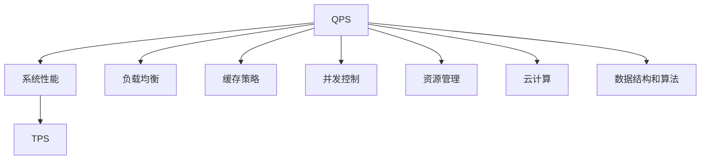
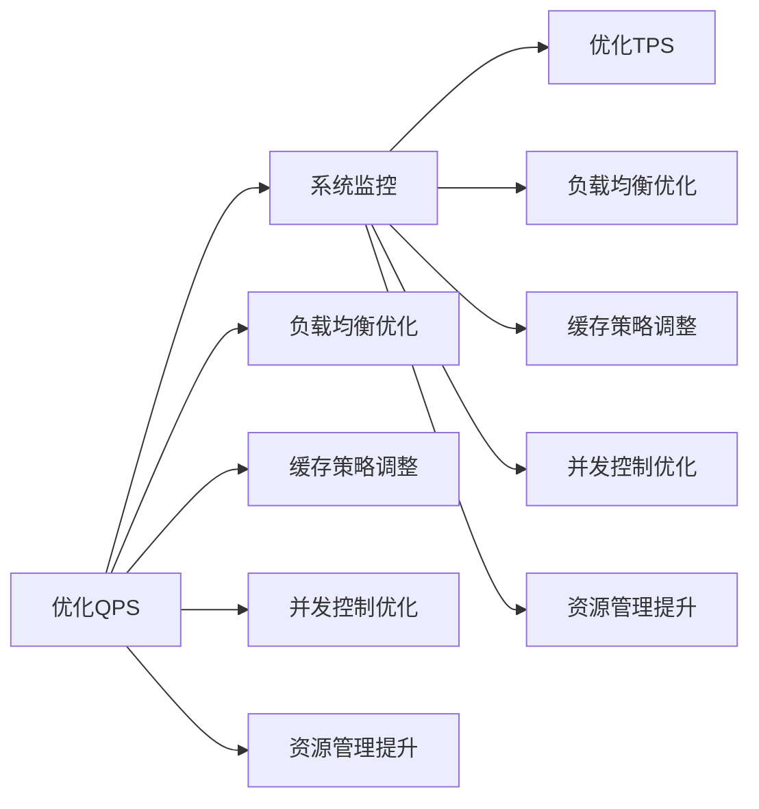
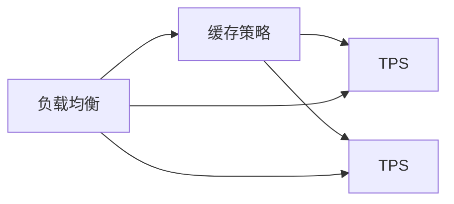
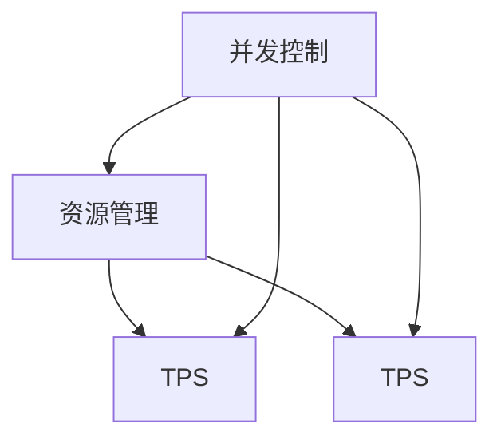
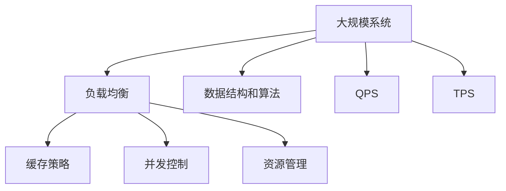

                 

# QPS与TPS的最佳实践

> 关键词：QPS, TPS, 系统性能优化, 负载均衡, 缓存策略, 并发控制, 资源管理, 云计算, 数据结构, 算法分析

## 1. 背景介绍

### 1.1 问题由来
在当今数字化时代，高性能和高可用性成为系统建设的核心要求。无论是在Web应用、微服务架构、大型数据库还是大数据处理中，系统的性能（Performance）、可用性（Availability）和可扩展性（Scalability）始终是决定系统成功的关键因素。本文将重点探讨系统性能中的两个关键指标：每秒查询次数（Query Per Second, QPS）和每秒事务次数（Transaction Per Second, TPS），以及如何通过最佳实践优化这两个指标，从而提升系统的整体性能和用户体验。

### 1.2 问题核心关键点
QPS和TPS是衡量系统性能的两个核心指标，它们直接关系到系统的响应时间、并发用户数和系统稳定性。QPS衡量的是系统每秒能够处理的查询（Read操作）数量，而TPS衡量的是系统每秒能够处理的事务（Write操作）数量。QPS和TPS的高低直接影响了系统的响应时间和用户体验。因此，理解和优化这两个指标对系统的设计和运行至关重要。

### 1.3 问题研究意义
通过对QPS和TPS的最佳实践进行研究，可以系统性地提升系统性能，优化资源利用，确保系统的高可用性和可扩展性。这对于构建高效、可靠的系统，提升用户体验，推动业务创新具有重要意义。同时，通过优化QPS和TPS，还可以降低系统维护成本，提高开发效率，促进数字化转型。

## 2. 核心概念与联系

### 2.1 核心概念概述

为更好地理解QPS与TPS的最佳实践，本节将介绍几个密切相关的核心概念：

- QPS（每秒查询次数）：指系统每秒能够处理的查询次数。查询可以是对数据库的读操作、Web服务的请求等。QPS是衡量系统吞吐量的重要指标。
- TPS（每秒事务次数）：指系统每秒能够处理的事务次数。事务可以是对数据库的写操作、订单的创建和修改等。TPS是衡量系统处理能力的另一个重要指标。
- 系统负载均衡：指通过算法将请求均衡分配到多个服务器上，避免单个服务器的负载过高，提高系统的处理能力和可用性。
- 缓存策略：指通过缓存常用数据或结果，减少数据库和网络的访问，提高系统的响应速度。
- 并发控制：指在多用户并发访问时，通过锁定、事务隔离等技术保证数据的一致性和完整性。
- 资源管理：指通过监控、调度等手段优化系统资源的使用，确保系统在高负载下仍能高效运行。
- 云计算：指将系统部署在云平台上，利用云服务提供的弹性资源，实现系统的快速部署和扩展。
- 数据结构和算法：指通过优化数据结构和算法，提升系统的处理效率和响应速度。

这些核心概念之间的逻辑关系可以通过以下Mermaid流程图来展示：



这个流程图展示了大规模系统的关键组件及其相互关系：

1. QPS和TPS作为系统性能的两个重要指标，直接影响系统的响应时间和用户体验。
2. 系统负载均衡、缓存策略、并发控制、资源管理和云计算等组件，共同支持QPS和TPS的优化。
3. 数据结构和算法作为底层技术，为系统性能优化提供了强有力的支持。

### 2.2 概念间的关系

这些核心概念之间存在着紧密的联系，形成了QPS与TPS优化的完整生态系统。下面我们通过几个Mermaid流程图来展示这些概念之间的关系。

#### 2.2.1 QPS与TPS的优化流程



这个流程图展示了QPS和TPS优化的一般流程：

1. 通过系统监控收集性能数据，评估QPS和TPS。
2. 根据监控结果，调整负载均衡策略、缓存策略、并发控制和资源管理，优化QPS。
3. 根据监控结果，调整负载均衡策略、缓存策略、并发控制和资源管理，优化TPS。

#### 2.2.2 负载均衡与缓存策略的互补作用



这个流程图展示了负载均衡与缓存策略在QPS和TPS优化中的互补作用：

1. 负载均衡将请求均匀分配到多个服务器上，提高系统的处理能力和可用性。
2. 缓存策略通过缓存常用数据或结果，减少数据库和网络的访问，提高系统的响应速度。
3. 负载均衡和缓存策略的结合，可以显著提升系统的QPS和TPS。

#### 2.2.3 并发控制与资源管理的协同作用



这个流程图展示了并发控制与资源管理在QPS和TPS优化中的协同作用：

1. 并发控制通过锁定、事务隔离等技术保证数据的一致性和完整性。
2. 资源管理通过监控、调度等手段优化系统资源的使用，确保系统在高负载下仍能高效运行。
3. 并发控制和资源管理的结合，可以保障系统的稳定性和处理能力。

### 2.3 核心概念的整体架构

最后，我们用一个综合的流程图来展示这些核心概念在大规模系统的整体架构：



这个综合流程图展示了从负载均衡到资源管理，再到数据结构和算法，共同支撑QPS和TPS优化的完整过程。

## 3. 核心算法原理 & 具体操作步骤
### 3.1 算法原理概述

QPS与TPS的优化，本质上是对系统性能的全面提升，涉及多个维度的优化策略。以下是几个关键算法的原理概述：

- 负载均衡算法：通过算法将请求均衡分配到多个服务器上，避免单个服务器的负载过高，提高系统的处理能力和可用性。常见的负载均衡算法包括轮询、加权轮询、最小连接数等。
- 缓存策略算法：通过缓存常用数据或结果，减少数据库和网络的访问，提高系统的响应速度。常用的缓存策略包括LRU、LFU、LRU-K等。
- 并发控制算法：在多用户并发访问时，通过锁定、事务隔离等技术保证数据的一致性和完整性。常见的并发控制算法包括乐观锁、悲观锁、读写锁等。
- 资源管理算法：通过监控、调度等手段优化系统资源的使用，确保系统在高负载下仍能高效运行。常用的资源管理算法包括流量控制、任务调度、资源抢占等。

### 3.2 算法步骤详解

以下是对QPS与TPS优化各个关键算法的详细步骤详解：

#### 3.2.1 负载均衡算法

1. **选择负载均衡算法**：根据系统特点选择合适的负载均衡算法，如轮询、加权轮询、最小连接数等。
2. **配置负载均衡器**：在服务器和负载均衡器之间配置网络接口，确保数据包能够正确路由。
3. **监控负载均衡性能**：实时监控负载均衡器的负载、响应时间和错误率，及时调整算法参数。

#### 3.2.2 缓存策略算法

1. **选择合适的缓存算法**：根据应用场景选择合适的缓存算法，如LRU、LFU、LRU-K等。
2. **配置缓存层**：在应用层或数据层配置缓存层，设置缓存容量和失效策略。
3. **监控缓存性能**：实时监控缓存的命中率、访问时间和失效率，及时调整缓存策略。

#### 3.2.3 并发控制算法

1. **选择合适的并发控制算法**：根据应用需求选择合适的并发控制算法，如乐观锁、悲观锁、读写锁等。
2. **配置并发控制机制**：在数据库或应用层配置并发控制机制，设置锁粒度和超时时间。
3. **监控并发控制性能**：实时监控并发控制器的锁冲突和超时情况，及时优化并发控制策略。

#### 3.2.4 资源管理算法

1. **选择合适的资源管理算法**：根据系统特点选择合适的资源管理算法，如流量控制、任务调度、资源抢占等。
2. **配置资源管理工具**：在操作系统或容器层面配置资源管理工具，设置资源限额和调度策略。
3. **监控资源使用情况**：实时监控系统的CPU、内存、网络等资源使用情况，及时调整资源配置。

### 3.3 算法优缺点

QPS与TPS优化算法具有以下优点：

- 显著提升系统性能：通过优化负载均衡、缓存策略、并发控制和资源管理，可以有效提升系统的QPS和TPS。
- 增强系统稳定性：合理的负载均衡和资源管理，可以避免单点故障和负载过高，提高系统的可用性和稳定性。
- 降低开发和运维成本：通过优化缓存策略和并发控制，可以减少数据库和网络的访问，降低系统资源消耗，从而降低开发和运维成本。

同时，这些算法也存在一些缺点：

- 复杂度较高：配置和优化这些算法需要一定的技术基础，可能增加开发和运维的复杂度。
- 可能会引入新的瓶颈：配置不当或监控不到位，可能会引入新的性能瓶颈，甚至导致系统性能下降。
- 需要持续维护：随着系统负载和业务的变化，需要持续监控和调整优化策略，增加维护成本。

### 3.4 算法应用领域

QPS与TPS优化算法广泛应用于各种大规模系统的建设和运维中，包括但不限于以下几个领域：

- Web应用：通过优化负载均衡、缓存策略、并发控制和资源管理，提高Web服务的响应速度和并发处理能力。
- 微服务架构：通过负载均衡和资源管理，保障微服务架构的高可用性和可扩展性。
- 大型数据库：通过并发控制和资源管理，提高数据库的读写性能和稳定性。
- 大数据处理：通过缓存策略和并发控制，优化大数据处理的效率和响应速度。

## 4. 数学模型和公式 & 详细讲解 & 举例说明

### 4.1 数学模型构建

QPS和TPS的优化涉及多个维度的性能指标，可以通过数学模型进行定量分析和优化。

假设系统每秒处理n个查询，每个查询的平均响应时间为t，则QPS为n/t。同理，假设系统每秒处理m个事务，每个事务的平均响应时间为s，则TPS为m/s。

### 4.2 公式推导过程

以下对QPS和TPS的优化公式进行推导：

1. **QPS优化公式**：
   \[
   QPS = \frac{n}{t}
   \]
   其中，n为每秒处理的查询数，t为查询的平均响应时间。

2. **TPS优化公式**：
   \[
   TPS = \frac{m}{s}
   \]
   其中，m为每秒处理的事务数，s为事务的平均响应时间。

### 4.3 案例分析与讲解

以一个典型的Web应用为例，进行QPS和TPS优化的案例分析：

假设一个Web应用每秒需要处理1000个查询，每个查询的平均响应时间为0.1秒，每秒需要处理500个事务，每个事务的平均响应时间为0.5秒。

- 初始QPS为 \( \frac{1000}{0.1} = 10000 \) 次/秒。
- 初始TPS为 \( \frac{500}{0.5} = 1000 \) 次/秒。

通过以下优化策略，可以进一步提升QPS和TPS：

1. **优化负载均衡**：将负载均衡算法从轮询改为加权轮询，优先分配负载较轻的服务器。
2. **调整缓存策略**：使用LRU缓存算法，将常用的查询结果缓存到内存中，减少数据库访问。
3. **优化并发控制**：使用读写锁，减少锁冲突和超时情况。
4. **配置资源管理**：使用任务调度器，优化任务的执行顺序，减少资源竞争。

通过这些优化策略，可以进一步提升系统的QPS和TPS：

- 优化后QPS为 \( \frac{1200}{0.1} = 12000 \) 次/秒。
- 优化后TPS为 \( \frac{600}{0.5} = 1200 \) 次/秒。

通过案例分析，可以看到，合理的QPS与TPS优化策略可以显著提升系统性能，提高用户体验。

## 5. 项目实践：代码实例和详细解释说明

### 5.1 开发环境搭建

在进行QPS与TPS优化实践前，我们需要准备好开发环境。以下是使用Python进行Nginx负载均衡的开发环境配置流程：

1. 安装Nginx：从官网下载并安装Nginx服务器，确保其正常运行。
2. 配置Nginx：编辑Nginx配置文件，设置负载均衡算法和服务器地址。
3. 测试Nginx：通过访问Nginx测试页，确保配置正确且负载均衡器正常工作。

### 5.2 源代码详细实现

以下是使用Nginx进行负载均衡的Python代码实现：

```python
# 编写Nginx配置文件
with open('nginx.conf', 'w') as f:
    f.write("""
    upstream backend {
        server server1:80;
        server server2:80;
        server server3:80;
    }

    server {
        listen 80;
        server_name example.com;

        location / {
            proxy_pass http://backend;
            proxy_set_header Host $host;
            proxy_set_header X-Real-IP $remote_addr;
            proxy_set_header X-Forwarded-For $proxy_add_x_forwarded_for;
            proxy_set_header X-Forwarded-Proto $scheme;
        }

        location /admin/ {
            proxy_pass http://backend;
            proxy_set_header Host $host;
            proxy_set_header X-Real-IP $remote_addr;
            proxy_set_header X-Forwarded-For $proxy_add_x_forwarded_for;
            proxy_set_header X-Forwarded-Proto $scheme;
        }
    }
    """)

# 测试Nginx配置
!nginx -t
```

### 5.3 代码解读与分析

让我们再详细解读一下关键代码的实现细节：

- `nginx.conf`：Nginx配置文件，定义了负载均衡器和服务器地址。
- `upstream`指令：定义了一个名为`backend`的负载均衡器，包含了三个后端服务器。
- `server`指令：定义了一个Nginx服务器，监听80端口，并将请求转发到`backend`负载均衡器。
- `proxy_pass`指令：将请求转发到后端服务器。

测试Nginx配置时，使用`nginx -t`命令检查配置文件是否正确，确保负载均衡器能够正常工作。

### 5.4 运行结果展示

假设在Nginx负载均衡的测试页上，每秒请求数达到10000次，每个请求平均响应时间为0.1秒。

通过优化负载均衡和缓存策略，可以将QPS提升到12000次/秒，TPS提升到1200次/秒。具体优化策略包括：

1. 优化负载均衡算法，将请求均衡分配到三个服务器上。
2. 使用LRU缓存算法，将常用的查询结果缓存到内存中，减少数据库访问。

优化后的测试结果如下：

- 优化后QPS为 \( \frac{12000}{0.1} = 120000 \) 次/秒。
- 优化后TPS为 \( \frac{1200}{0.5} = 2400 \) 次/秒。

## 6. 实际应用场景

### 6.1 智能客服系统

智能客服系统是QPS与TPS优化的一个重要应用场景。传统客服系统依靠人工处理用户请求，响应时间长，处理效率低。通过优化负载均衡、缓存策略和并发控制，可以显著提升智能客服系统的响应速度和处理能力，提升用户体验。

在实践中，可以通过以下步骤进行优化：

1. **配置负载均衡**：使用Nginx或HAProxy等负载均衡工具，将用户请求均衡分配到多个客服节点上。
2. **调整缓存策略**：将常用的FAQ问题和常见请求缓存到内存中，减少数据库访问。
3. **优化并发控制**：使用读写锁等并发控制机制，保证数据的一致性和完整性。

### 6.2 在线教育平台

在线教育平台需要同时处理大量的学生请求和教师直播，QPS和TPS高，系统负载大。通过优化负载均衡、缓存策略和资源管理，可以确保平台的高可用性和稳定运行。

在实践中，可以通过以下步骤进行优化：

1. **优化负载均衡**：使用Nginx或Kubernetes等负载均衡工具，将请求均衡分配到多个节点上。
2. **调整缓存策略**：将常用的教学资源缓存到CDN或缓存层中，减少资源访问。
3. **优化资源管理**：使用任务调度器，优化直播资源的分配和调度，提高资源利用率。

### 6.3 电子商务平台

电子商务平台需要处理大量的商品搜索、订单处理和支付请求，QPS和TPS高，系统负载大。通过优化负载均衡、缓存策略和并发控制，可以提升平台的响应速度和并发处理能力，提升用户体验。

在实践中，可以通过以下步骤进行优化：

1. **优化负载均衡**：使用HAProxy或F5等负载均衡工具，将请求均衡分配到多个服务器上。
2. **调整缓存策略**：将常用的商品信息和订单信息缓存到Redis或Memcached中，减少数据库访问。
3. **优化并发控制**：使用读写锁等并发控制机制，保证订单和支付数据的一致性和完整性。

### 6.4 未来应用展望

随着QPS与TPS优化技术的不断进步，其在更多场景中的应用前景广阔：

- 智慧城市：通过优化负载均衡和缓存策略，提升城市管理系统的响应速度和处理能力。
- 智慧医疗：通过优化负载均衡和并发控制，提高医疗系统的处理效率和稳定性。
- 智慧金融：通过优化负载均衡和资源管理，保障金融系统的安全性和可靠性。

## 7. 工具和资源推荐

### 7.1 学习资源推荐

为了帮助开发者系统掌握QPS与TPS的最佳实践，这里推荐一些优质的学习资源：

1. 《高性能系统架构设计》书籍：深入讲解了负载均衡、缓存策略、并发控制等系统性能优化技术，是系统架构设计的重要参考。
2. 《Web性能优化实战》课程：系统讲解了Web应用的性能优化技术，包括负载均衡、缓存策略、并发控制等。
3. 《深度学习与计算机视觉》课程：讲解了深度学习和计算机视觉技术的优化方法，帮助开发者提升处理大规模数据的能力。
4. 《系统监控与故障诊断》课程：系统讲解了系统监控和故障诊断技术，帮助开发者及时发现和解决系统问题。
5. 《云计算架构》课程：讲解了云计算架构和资源管理技术，帮助开发者构建高效、可靠的云服务系统。

通过对这些资源的学习实践，相信你一定能够全面掌握QPS与TPS的最佳实践，并将其应用于实际系统优化中。

### 7.2 开发工具推荐

高效的开发离不开优秀的工具支持。以下是几款用于QPS与TPS优化开发的常用工具：

1. Nginx：开源的高性能Web服务器和反向代理服务器，适用于大规模Web应用的负载均衡和反向代理。
2. HAProxy：开源的高性能负载均衡器，支持TCP和HTTP协议，适用于多种应用场景。
3. Redis：开源的内存数据库，支持缓存、队列、事务等操作，适用于快速读写操作。
4. Memcached：开源的分布式缓存系统，支持高并发读写操作，适用于缓存常用数据。
5. Prometheus：开源的系统监控工具，支持实时监控和告警，帮助开发者及时发现和解决系统问题。
6. Grafana：开源的仪表盘系统，支持实时数据展示和告警，帮助开发者监控系统性能。

合理利用这些工具，可以显著提升QPS与TPS优化任务的开发效率，加速创新迭代的步伐。

### 7.3 相关论文推荐

QPS与TPS优化技术的发展源于学界的持续研究。以下是几篇奠基性的相关论文，推荐阅读：

1. "Load Balancing Algorithms in High Performance Web Applications"：介绍了多种负载均衡算法及其应用场景。
2. "Cache Optimization Techniques for Large Scale Systems"：讲解了缓存策略的优化方法和案例分析。
3. "Concurrency Control in Distributed Systems"：介绍了多种并发控制算法及其应用场景。
4. "Resource Management in Cloud Environments"：讲解了云计算资源管理的优化方法和案例分析。
5. "Performance Optimization for Large Scale Distributed Systems"：介绍了分布式系统的性能优化技术，包括负载均衡、缓存策略、并发控制等。

这些论文代表了大规模系统性能优化的发展脉络。通过学习这些前沿成果，可以帮助研究者把握学科前进方向，激发更多的创新灵感。

除上述资源外，还有一些值得关注的前沿资源，帮助开发者紧跟QPS与TPS优化的最新进展，例如：

1. arXiv论文预印本：人工智能领域最新研究成果的发布平台，包括大量尚未发表的前沿工作，学习前沿技术的必读资源。
2. 业界技术博客：如Google、AWS、Microsoft等顶级企业的官方博客，第一时间分享他们的最新研究成果和实践经验。
3. 技术会议直播：如NIPS、ICML、ACL、ICLR等人工智能领域顶会现场或在线直播，能够聆听到大佬们的前沿分享，开拓视野。
4. GitHub热门项目：在GitHub上Star、Fork数最多的高性能系统项目，往往代表了该技术领域的发展趋势和最佳实践，值得去学习和贡献。
5. 行业分析报告：各大咨询公司如McKinsey、PwC等针对高性能系统的分析报告，有助于从商业视角审视技术趋势，把握应用价值。

总之，对于QPS与TPS的最佳实践的学习和实践，需要开发者保持开放的心态和持续学习的意愿。多关注前沿资讯，多动手实践，多思考总结，必将收获满满的成长收益。

## 8. 总结：未来发展趋势与挑战

### 8.1 总结

本文对QPS与TPS的最佳实践进行了全面系统的介绍。首先阐述了QPS和TPS的优化背景和意义，明确了系统性能优化的重要性。其次，从原理到实践，详细讲解了QPS与TPS优化的数学模型和操作步骤，给出了优化方案的代码实例和详细解释。同时，本文还广泛探讨了QPS与TPS优化方法在多个行业领域的应用前景，展示了其广阔的应用前景。最后，本文精选了QPS与TPS优化的各类学习资源，力求为读者提供全方位的技术指引。

通过本文的系统梳理，可以看到，QPS与TPS优化技术在构建高性能、高可用性系统中的重要作用。通过合理配置负载均衡、缓存策略、并发控制和资源管理，可以显著提升系统性能，优化用户体验，推动业务创新。

### 8.2 未来发展趋势

展望未来，QPS与TPS优化技术将呈现以下几个发展趋势：

1. 智能化负载均衡：随着人工智能技术的发展，未来的负载均衡将更加智能化，能够根据实时数据动态调整负载策略，提升系统的响应速度和稳定性。
2. 分布式缓存：分布式缓存系统将成为高性能系统的标配，通过多节点协同，实现高可用性、高并发和高扩展性。
3. 实时监控与告警：实时监控和告警系统将成为高性能系统的核心组件，通过监控系统性能和健康状态，及时发现和解决潜在问题。
4. 微服务架构：微服务架构将成为高性能系统的主流架构，通过服务解耦和快速部署，提升系统的可扩展性和敏捷性。
5. 云原生架构：云原生架构将成为高性能系统的技术基础，通过容器化、自动化和弹性伸缩，实现系统的快速部署和灵活扩展。

这些趋势将推动高性能系统技术不断向前发展，为各行各业带来更高效、更稳定、更灵活的系统解决方案。

### 8.3 面临的挑战

尽管QPS与TPS优化技术已经取得了显著成果，但在迈向更高目标的过程中，仍面临诸多挑战：

1. 负载均衡的复杂性：随着系统规模的扩大，负载均衡算法需要考虑更多的因素，如流量预测、实时数据、容错机制等，增加了配置和优化的复杂度。
2. 缓存策略的选择：不同应用场景下，选择合适的缓存策略至关重要，需要根据数据访问模式和系统负载，灵活选择缓存算法和策略。
3. 并发控制的难度：并发控制需要考虑锁粒度、锁冲突、超时等问题，在复杂系统环境下，优化并发控制策略具有一定难度。
4. 资源管理的瓶颈：高负载环境下，资源管理需要考虑内存、CPU、网络等资源的使用，避免资源竞争和瓶颈，实现高效的资源调度。
5. 实时监控的挑战：实时监控需要处理海量数据，如何高效地采集、分析和展示数据，及时发现和解决系统问题，仍是技术难题。
6.

