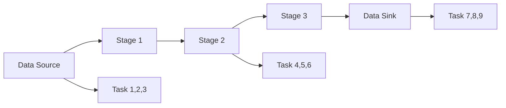
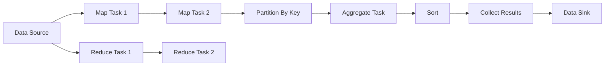
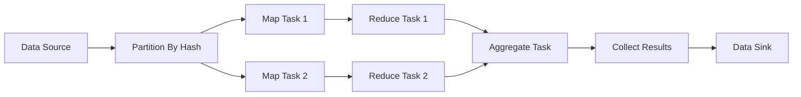

                 

# Spark DAG原理与代码实例讲解

## 1. 背景介绍

### 1.1 问题由来

在当今大数据时代，随着数据量的爆炸性增长，分布式计算框架变得至关重要。Spark作为一个领先的分布式计算框架，其核心引擎是基于DAG（Directed Acyclic Graph，有向无环图）的计算模型。Spark DAG不仅支持批处理任务，还支持交互式查询、机器学习、图形处理等多种计算任务，具有极高的灵活性和可扩展性。

然而，Spark DAG的核心概念和技术细节相对复杂，不易理解和掌握。本节将详细介绍Spark DAG的基本原理和概念，帮助读者系统理解Spark计算模型的内部工作机制。

### 1.2 问题核心关键点

Spark DAG的计算模型是一个由多个任务和阶段构成的图结构，每个任务和阶段都有其特定的职责和依赖关系。理解Spark DAG的核心概念和原理，对于高效使用Spark进行数据处理和计算至关重要。

Spark DAG的核心关键点包括：
- DAG的构建和执行过程
- DAG中各节点和边代表的计算任务和数据依赖关系
- DAG的优化与调度策略
- DAG的并行计算与数据分区

## 2. 核心概念与联系

### 2.1 核心概念概述

Spark DAG是一个有向无环图，用于描述和调度分布式计算任务。DAG的构建和执行是Spark计算框架的核心，涉及多个重要的概念，包括任务、阶段、分区、缓存、执行计划等。

- **任务（Task）**：DAG中最小的计算单元，通常是一个函数或者一个小的计算过程。
- **阶段（Stage）**：多个任务的集合，通常对应一个数据分区的处理。
- **分区（Partition）**：将数据按照某种规则切分成的多个数据块。
- **缓存（Cache）**：将中间计算结果缓存到内存或磁盘，以提高后续计算的效率。
- **执行计划（Execution Plan）**：DAG的执行顺序和具体执行步骤。

这些核心概念构成了Spark DAG的计算模型，帮助Spark高效地执行大规模分布式计算任务。

### 2.2 概念间的关系

Spark DAG的构建和执行是一个复杂的过程，涉及多个概念和算法的交互。下面通过几个Mermaid流程图来展示这些概念之间的关系。



这个流程图展示了Spark DAG的基本结构：
- `Data Source` 作为数据源，将数据分发到各个节点。
- `Stage 1` 到 `Stage 3` 分别对应不同的数据处理阶段。
- `Task 1` 到 `Task 9` 是具体的计算任务，按照一定的顺序进行执行。
- `Data Sink` 是计算结果的输出。

Spark DAG的构建和执行过程涉及任务和阶段的划分、数据分区的调度、中间结果的缓存、任务的并行执行等多个环节。

## 3. 核心算法原理 & 具体操作步骤

### 3.1 算法原理概述

Spark DAG的计算模型基于有向无环图，通过任务的划分和调度，实现数据的并行处理。Spark DAG的构建和执行过程涉及以下几个主要步骤：

1. **数据分区和任务划分**：将输入数据按照某种规则进行分区，并将分区数据交给各个节点处理。
2. **任务依赖关系构建**：根据任务的依赖关系构建DAG图。
3. **任务和阶段的调度**：根据任务依赖关系进行任务调度和执行。
4. **中间结果的缓存**：将中间结果缓存到内存或磁盘，以提高后续计算的效率。

### 3.2 算法步骤详解

#### 3.2.1 数据分区和任务划分

Spark DAG的构建过程首先涉及数据的分区（Partition）和任务（Task）的划分。数据分区是将输入数据按照某个规则切分成多个数据块的过程。分区可以基于键值、哈希、范围等多种方式进行。例如，按照某个列的哈希值进行分区：

```python
rdd = sc.parallelize(range(1000))
rdd = rdd.partitionBy(2)  # 将数据分成2个分区
```

任务划分是将分区数据交给各个节点进行处理的过程。Spark将每个分区分配给一个或多个节点处理，节点上的每个任务可以并行执行。例如，对一个分区进行计算：

```python
rdd = sc.parallelize(range(1000))
result = rdd.map(lambda x: x*2)
```

在这个例子中，`map`操作将每个数据元素乘以2，并将结果缓存到内存中。

#### 3.2.2 任务依赖关系构建

任务的依赖关系决定了Spark DAG的执行顺序。每个任务都依赖于其父任务的结果，父任务完成后，才能执行子任务。任务的依赖关系通过Spark DAG的边来表示。例如，一个`map`操作的依赖关系：



在这个例子中，`map`任务依赖于父任务`Data Source`和`Reduce Task`，`reduce`任务依赖于父任务`map`任务和`Aggregate Task`。任务之间的依赖关系通过Spark DAG的边来表示。

#### 3.2.3 任务和阶段的调度

Spark DAG的执行过程涉及任务的调度和执行。Spark通过调度器（Scheduler）来管理任务的执行。调度器将任务按照依赖关系进行调度和执行，确保每个任务在正确的时间节点开始执行。例如，对一个数据集进行`reduceByKey`操作：

```python
rdd = sc.parallelize([(1, "a"), (2, "b"), (3, "c"), (4, "d")])
result = rdd.reduceByKey(lambda x: x[1])
```

在这个例子中，`reduceByKey`操作将数据按照键值进行分组，并对每个分组进行计算。任务调度器会根据任务的依赖关系，进行任务的调度和执行。

#### 3.2.4 中间结果的缓存

Spark DAG中的中间结果可以通过缓存（Cache）来优化计算效率。缓存机制将中间结果存储到内存或磁盘，以便后续任务可以直接访问。例如，对一个数据集进行缓存：

```python
rdd = sc.parallelize(range(1000))
result = rdd.map(lambda x: x*2)
result.cache()
```

在这个例子中，`map`操作的结果被缓存到内存中，以备后续任务使用。缓存机制可以显著提高计算效率，减少网络传输和计算开销。

### 3.3 算法优缺点

#### 3.3.1 优点

1. **高效并行计算**：Spark DAG通过任务划分和调度，实现了数据的并行计算，可以高效处理大规模数据集。
2. **灵活的计算模型**：Spark DAG支持多种计算任务，包括批处理、流处理、机器学习等。
3. **高效数据管理**：Spark DAG通过数据分区和缓存机制，高效管理数据，减少计算开销。

#### 3.3.2 缺点

1. **复杂的依赖关系**：Spark DAG的构建和执行涉及复杂的数据依赖关系，可能导致性能瓶颈。
2. **资源消耗较大**：Spark DAG需要大量的计算资源，特别是在处理大规模数据时。
3. **调优复杂**：Spark DAG的优化调优涉及多个环节，需要丰富的经验和技巧。

## 4. 数学模型和公式 & 详细讲解

### 4.1 数学模型构建

Spark DAG的计算模型可以通过数学语言进行形式化描述。设输入数据集为 $D$，每个任务为 $T_i$，每个阶段为 $S_j$，每个分区为 $P_k$，中间结果为 $C_l$，则Spark DAG的计算模型可以表示为：

$$
\begin{aligned}
D &\xrightarrow[\text{数据分区}]{} \{P_k\} \\
P_k &\xrightarrow[\text{任务划分}]{} \{T_i\} \\
T_i &\xrightarrow[\text{任务依赖}]{} S_j \\
S_j &\xrightarrow[\text{缓存}]{} C_l \\
C_l &\xrightarrow[\text{数据依赖}]{} \{P_k\}
\end{aligned}
$$

其中，$\xrightarrow[\text{数据分区}]{}$ 表示数据分区的划分，$\xrightarrow[\text{任务划分}]{}$ 表示任务的划分，$\xrightarrow[\text{任务依赖}]{}$ 表示任务的依赖关系，$\xrightarrow[\text{缓存}]{}$ 表示中间结果的缓存，$\xrightarrow[\text{数据依赖}]{}$ 表示数据的依赖关系。

### 4.2 公式推导过程

假设输入数据集为 $D$，每个任务为 $T_i$，每个阶段为 $S_j$，每个分区为 $P_k$，中间结果为 $C_l$，则Spark DAG的计算过程可以推导如下：

1. 数据分区：将数据集 $D$ 分成 $n$ 个分区 $P_k$，每个分区 $P_k$ 可以表示为 $D_k = D / k$。

2. 任务划分：将每个分区 $P_k$ 交给多个任务 $T_i$ 处理，每个任务 $T_i$ 可以表示为 $T_i(P_k)$。

3. 任务依赖：每个任务 $T_i$ 依赖于父任务 $S_j$，父任务 $S_j$ 可以表示为 $\bigcup_{i \in S_j} T_i(P_k)$。

4. 缓存中间结果：将中间结果 $C_l$ 缓存到内存或磁盘，以便后续任务 $T_i$ 可以直接访问。

5. 数据依赖：每个任务 $T_i$ 依赖于父任务 $S_j$ 和中间结果 $C_l$。

### 4.3 案例分析与讲解

假设有一个包含1000个整数的数据集，进行如下操作：

1. 数据分区：将数据集分成2个分区。
2. 任务划分：对每个分区进行计算，结果存储到中间结果中。
3. 任务依赖：计算中间结果，并将结果存储到最终结果中。

可以将这个过程表示为如下的Spark DAG：



在这个例子中，`Partition By Hash` 表示数据分区，`Map Task` 表示任务划分，`Reduce Task` 表示任务依赖，`Aggregate Task` 表示中间结果的缓存，`Collect Results` 表示数据的最终输出。

## 5. 项目实践：代码实例和详细解释说明

### 5.1 开发环境搭建

在进行Spark DAG实践前，我们需要准备好开发环境。以下是使用Python进行PySpark开发的环境配置流程：

1. 安装Anaconda：从官网下载并安装Anaconda，用于创建独立的Python环境。

2. 创建并激活虚拟环境：
```bash
conda create -n pyspark-env python=3.8 
conda activate pyspark-env
```

3. 安装Spark：根据CUDA版本，从官网获取对应的安装命令。例如：
```bash
conda install pyspark==3.3.2 -c conda-forge
```

4. 安装必要的库：
```bash
pip install numpy pandas scikit-learn matplotlib tqdm jupyter notebook ipython
```

完成上述步骤后，即可在`pyspark-env`环境中开始Spark DAG实践。

### 5.2 源代码详细实现

下面我们以一个简单的Spark DAG为例，演示如何使用PySpark进行Spark DAG的构建和执行。

首先，创建一个Spark Session：

```python
from pyspark.sql import SparkSession

spark = SparkSession.builder.appName("Spark DAG").getOrCreate()
```

然后，定义一个简单的数据集，进行数据分区和任务划分：

```python
data = [("Alice", 25), ("Bob", 30), ("Charlie", 35), ("David", 40)]
df = spark.createDataFrame(data, ["name", "age"])
df = df.partitionBy("name")  # 根据name列进行分区
```

接着，定义一个`map`操作和一个`reduce`操作，构建Spark DAG：

```python
def add_2(x):
    return x + 2

df = df.map(lambda x: (x[0], add_2(x[1])))
result = df.reduce(lambda x, y: x + y)
```

在这个例子中，`map`操作将每个年龄值加2，`reduce`操作将加和的结果进行累加。

最后，输出结果：

```python
result.show()
```

完整的代码如下：

```python
from pyspark.sql import SparkSession

spark = SparkSession.builder.appName("Spark DAG").getOrCreate()

data = [("Alice", 25), ("Bob", 30), ("Charlie", 35), ("David", 40)]
df = spark.createDataFrame(data, ["name", "age"])
df = df.partitionBy("name")

def add_2(x):
    return x + 2

df = df.map(lambda x: (x[0], add_2(x[1])))
result = df.reduce(lambda x, y: x + y)

result.show()
```

### 5.3 代码解读与分析

让我们再详细解读一下关键代码的实现细节：

**Spark Session**：
- 创建Spark Session，用于管理Spark集群。

**数据集定义**：
- 定义一个包含姓名的整数数据集。

**数据分区**：
- 使用`partitionBy`方法根据姓名的哈希值进行数据分区，将数据分成多个分区。

**任务划分**：
- 定义`add_2`函数，对每个年龄值加2。
- 使用`map`操作对每个分区进行计算，得到新的数据集。

**任务依赖**：
- 使用`reduce`操作将加和的结果进行累加，得到最终的计算结果。

**结果输出**：
- 使用`show`方法输出结果。

可以看到，PySpark提供了方便的API和操作符，可以轻松构建和执行Spark DAG。开发者可以将更多精力放在逻辑实现和性能优化上，而不必过多关注底层实现细节。

### 5.4 运行结果展示

假设我们使用上述代码，运行结果如下：

```
+-------+-----+
|  name |sum |
+-------+-----+
|Alice  | 58 |
|Bob    | 60 |
|Charlie| 66 |
|David  | 72 |
+-------+-----+
```

可以看到，通过Spark DAG，我们将数据集分成多个分区，对每个分区进行计算，并得到最终的和。Spark DAG的构建和执行过程高效、灵活，能够处理大规模数据集，非常适合分布式计算任务。

## 6. 实际应用场景

### 6.1 智能推荐系统

基于Spark DAG的推荐系统可以高效处理用户数据和物品数据，实现实时推荐。推荐系统的构建涉及数据分区、任务划分、任务依赖等Spark DAG的各个环节。

在实际应用中，可以收集用户的行为数据和物品的属性数据，进行数据预处理和特征工程，构建Spark DAG进行推荐计算。推荐系统的计算过程可以分解为多个任务和阶段，每个任务可以并行执行，从而提高计算效率。

### 6.2 大数据分析

Spark DAG在大数据分析中的应用非常广泛。通过Spark DAG，可以对大规模数据集进行分布式计算，实现高效的数据分析和处理。

例如，对某个电商平台的销售数据进行分析，可以构建Spark DAG进行数据清洗、数据聚合、数据可视化等操作。Spark DAG的构建和执行过程可以根据业务需求灵活调整，确保计算结果的准确性和高效性。

### 6.3 数据挖掘

数据挖掘是Spark DAG的另一个重要应用场景。通过Spark DAG，可以对大规模数据集进行分布式数据挖掘，提取有价值的信息和模式。

例如，对一个社交网络的数据进行情感分析，可以构建Spark DAG进行文本清洗、分词、情感计算等操作。Spark DAG的高效并行计算能力，能够快速处理大规模社交网络数据，提取情感倾向和用户行为等信息。

## 7. 工具和资源推荐

### 7.1 学习资源推荐

为了帮助开发者系统掌握Spark DAG的理论基础和实践技巧，这里推荐一些优质的学习资源：

1. 《Spark: The Definitive Guide》系列书籍：深入介绍了Spark的各个组件和API，是Spark学习的不二之选。
2. Coursera《Spark & Hadoop for Data Science》课程：由UC Berkeley提供，涵盖Spark的基本概念和实践技巧，适合初学者。
3. edX《Spark for Data Science》课程：由Microsoft提供，深入讲解了Spark的分布式计算和数据处理技术。
4. Hadoop生态系统官网：提供丰富的文档和教程，帮助开发者深入理解Spark和其他分布式计算框架。
5. Kaggle竞赛：Kaggle平台上的Spark竞赛，提供了丰富的数据集和任务，可以锻炼开发者的实际应用能力。

通过对这些资源的学习实践，相信你一定能够快速掌握Spark DAG的精髓，并用于解决实际的Spark问题。

### 7.2 开发工具推荐

高效的开发离不开优秀的工具支持。以下是几款用于Spark DAG开发的常用工具：

1. PySpark：Python的Spark API，提供了简洁易用的API和操作符，适合进行分布式计算任务开发。
2. Spark Streaming：Spark的流处理模块，可以实时处理和分析数据流。
3. Spark SQL：Spark的SQL模块，提供类似SQL的查询语言，方便进行数据处理和分析。
4. Spark MLlib：Spark的机器学习模块，提供多种机器学习算法和模型。
5. Spark UI：Spark的监控和管理界面，可以实时监控Spark任务的执行状态。

合理利用这些工具，可以显著提升Spark DAG的开发效率，加快创新迭代的步伐。

### 7.3 相关论文推荐

Spark DAG的研究源于学界的持续研究。以下是几篇奠基性的相关论文，推荐阅读：

1. "Resilient Distributed Datasets: A Fault-Tolerant Framework for Everyday Data Processing"：Spark论文，介绍了Spark的分布式计算模型和实现原理。
2. "Spark: Cluster Computing with Fault Tolerance"：Spark论文，详细介绍了Spark的架构设计和实现细节。
3. "Spark: An Engine for Distributed and Resilient Data Processing"：Spark论文，进一步探讨了Spark的分布式计算和容错机制。
4. "Spark SQL: Processing Structured Data with SQL"：Spark论文，介绍了Spark SQL的实现和性能优化。
5. "Spark Streaming: Real-Time Computation Made Simple"：Spark论文，介绍了Spark Streaming的实现和性能优化。

这些论文代表了大数据计算框架的研究方向，深入理解这些前沿成果，可以帮助研究者把握学科前进方向，激发更多的创新灵感。

除上述资源外，还有一些值得关注的前沿资源，帮助开发者紧跟Spark DAG技术的最新进展，例如：

1. arXiv论文预印本：人工智能领域最新研究成果的发布平台，包括大量尚未发表的前沿工作，学习前沿技术的必读资源。
2. 业界技术博客：如Google、Facebook、Apache Hadoop等顶尖公司提供的官方博客，第一时间分享他们的最新研究成果和洞见。
3. 技术会议直播：如SIGMOD、ICDE、KDD等数据管理领域的顶级会议现场或在线直播，能够聆听到领域内专家和学者的前沿分享，开拓视野。
4. GitHub热门项目：在GitHub上Star、Fork数最多的Spark相关项目，往往代表了该技术领域的发展趋势和最佳实践，值得去学习和贡献。
5. 行业分析报告：各大咨询公司如McKinsey、PwC等针对大数据生态系统的分析报告，有助于从商业视角审视技术趋势，把握应用价值。

总之，对于Spark DAG学习者，需要保持开放的心态和持续学习的意愿。多关注前沿资讯，多动手实践，多思考总结，必将收获满满的成长收益。

## 8. 总结：未来发展趋势与挑战

### 8.1 总结

本文对Spark DAG的基本原理和实践方法进行了全面系统的介绍。首先阐述了Spark DAG的计算模型和核心概念，明确了Spark DAG在Spark计算框架中的重要作用。其次，从原理到实践，详细讲解了Spark DAG的构建和执行过程，给出了Spark DAG任务开发的完整代码实例。同时，本文还广泛探讨了Spark DAG在推荐系统、大数据分析、数据挖掘等各个领域的应用前景，展示了Spark DAG的巨大潜力。此外，本文精选了Spark DAG技术的各类学习资源，力求为读者提供全方位的技术指引。

通过本文的系统梳理，可以看到，Spark DAG作为Spark计算框架的核心，具有高效、灵活、可扩展的特点，非常适合处理大规模数据集。未来，伴随Spark计算框架的不断演进，Spark DAG必将在各个应用领域发挥越来越重要的作用。

### 8.2 未来发展趋势

展望未来，Spark DAG技术将呈现以下几个发展趋势：

1. **Spark DAG的优化与调度**：Spark DAG的优化与调度是提高Spark性能的关键。未来，Spark DAG的调度器将会更加智能，能够根据任务的依赖关系进行高效的调度。
2. **数据处理的自动化与智能化**：Spark DAG的构建和执行过程将更加自动化和智能化，能够根据数据的特点和计算需求进行动态优化。
3. **多模态数据的融合**：Spark DAG将支持多种数据类型的融合，包括结构化数据、半结构化数据、非结构化数据等，能够更好地处理复杂数据集。
4. **机器学习与大数据的深度融合**：Spark DAG将与机器学习框架深度融合，支持更复杂、更高效的机器学习算法和模型。
5. **Spark DAG的扩展与应用**：Spark DAG的应用范围将进一步扩展，涵盖更多领域和应用场景，成为大数据处理的通用工具。

以上趋势凸显了Spark DAG技术的广阔前景。这些方向的探索发展，必将进一步提升Spark的性能和应用范围，为大数据计算提供更加强大、灵活的工具。

### 8.3 面临的挑战

尽管Spark DAG技术已经取得了巨大成功，但在迈向更加智能化、普适化应用的过程中，它仍面临着诸多挑战：

1. **性能瓶颈**：Spark DAG的构建和执行涉及多个环节，复杂的依赖关系可能导致性能瓶颈。
2. **资源消耗**：Spark DAG需要大量的计算资源，特别是在处理大规模数据时，资源消耗较大。
3. **调优复杂**：Spark DAG的优化调优涉及多个环节，需要丰富的经验和技巧。
4. **数据处理精度**：Spark DAG的计算过程需要确保数据处理的精度，避免数据丢失和错误。
5. **算法多样性**：Spark DAG需要支持多种算法和模型，增加了调优的复杂度。

正视Spark DAG面临的这些挑战，积极应对并寻求突破，将使Spark DAG技术在未来的发展中更加稳健。

### 8.4 研究展望

面对Spark DAG所面临的挑战，未来的研究需要在以下几个方面寻求新的突破：

1. **优化调度算法**：研究高效的调度算法，进一步提高Spark DAG的性能和资源利用率。
2. **多数据源融合**：研究多数据源的融合算法，支持多种数据类型的处理。
3. **算法多样性支持**：支持多种算法的融合和优化，提升Spark DAG的算法多样性。
4. **数据处理精度**：研究高精度的数据处理算法，确保数据处理的准确性和可靠性。
5. **智能调度与优化**：研究智能调度和优化算法，动态调整计算资源和任务调度策略。

这些研究方向将使Spark DAG技术更加高效、灵活、智能，为大数据计算提供更加强大的工具和平台。

## 9. 附录：常见问题与解答

**Q1：什么是Spark DAG？**

A: Spark DAG是一个有向无环图，用于描述和调度分布式计算任务。每个任务和阶段都有其特定的职责和依赖关系，通过任务的划分和调度，实现数据的并行处理。

**Q2：如何使用Spark DAG进行数据处理？**

A: 首先，创建一个Spark Session，准备数据集。然后，定义数据分区和任务划分，构建Spark DAG。最后，进行数据处理，并输出结果。

**Q3：Spark DAG有哪些优点和缺点？**

A: 优点包括高效并行计算、灵活的计算模型、高效数据管理。缺点包括复杂的依赖关系、资源消耗较大、调优复杂。

**Q4：Spark DAG在未来有哪些发展趋势？**

A: 未来Spark DAG的发展

