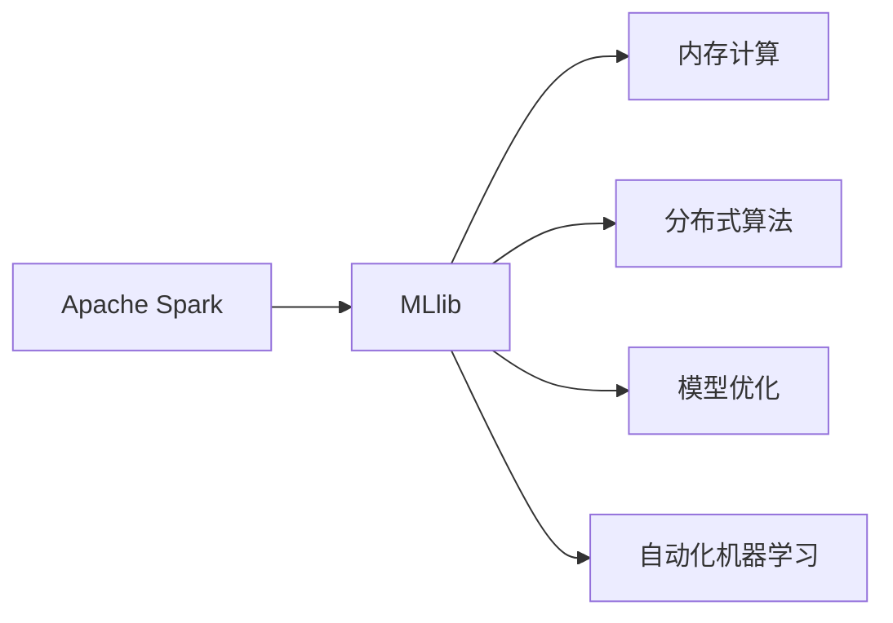
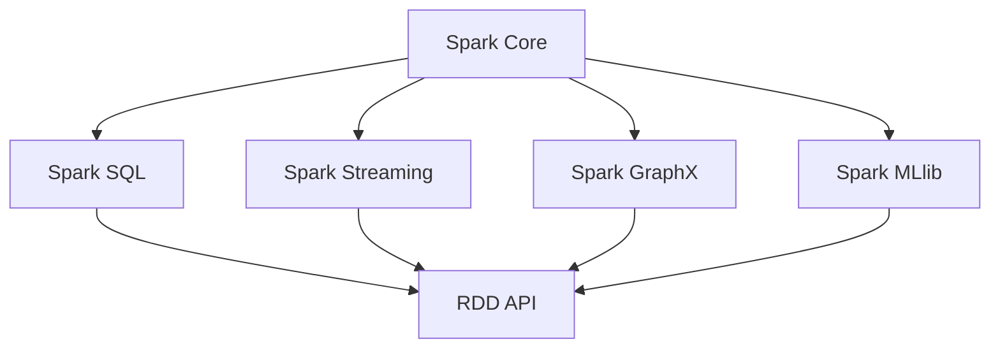
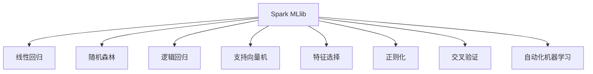

                 

# Spark MLlib原理与代码实例讲解

> 关键词：Spark, MLlib, Scala, 机器学习, 数据处理, 算法实现, 模型训练, 性能优化

## 1. 背景介绍

### 1.1 问题由来
随着大数据技术的发展，数据处理和分析需求日益增长，传统的数据处理工具已经难以满足需求。为解决这一问题，Apache Spark 应运而生。Spark 是 Facebook 开发的分布式计算系统，支持高效内存计算、大规模数据处理和快速迭代算法，广泛应用于大数据、人工智能和机器学习等领域。

MLlib（Machine Learning Library）是 Spark 的核心组件之一，提供了一系列机器学习算法和工具，支持从数据清洗到模型训练的全过程。MLlib 支持多种机器学习模型，如线性回归、随机森林、逻辑回归、支持向量机等，适用于各种数据类型和分析需求。

本文将详细讲解 Spark MLlib 的原理和实现，并结合代码实例，全面介绍 MLlib 的开发和使用。

### 1.2 问题核心关键点
Spark MLlib 的核心关键点包括：
- 内存计算：Spark MLlib 支持内存计算，能快速读取数据并进行内存存储，提高数据处理效率。
- 分布式算法：MLlib 的算法和工具支持分布式计算，能在多节点上并行运行，提高计算速度和资源利用率。
- 模型优化：MLlib 提供多种模型优化技术，如特征选择、正则化、交叉验证等，提升模型性能。
- 自动化机器学习：MLlib 支持自动化机器学习技术，能自动选择合适的算法和参数，实现模型自动化训练。

## 2. 核心概念与联系

### 2.1 核心概念概述

为更好地理解 Spark MLlib 的原理和实现，本节将介绍几个密切相关的核心概念：

- Apache Spark：一个快速、通用的大数据处理引擎，支持内存计算、分布式计算和迭代算法。
- MLlib：Apache Spark 的机器学习库，提供多种机器学习算法和工具，支持从数据清洗到模型训练的全过程。
- 内存计算：通过将数据存放在内存中，减少数据读写操作，提高数据处理效率。
- 分布式算法：通过多节点并行计算，提高计算速度和资源利用率。
- 模型优化：通过特征选择、正则化、交叉验证等技术，提升模型性能。
- 自动化机器学习：通过自动化技术，选择最合适的算法和参数，实现模型自动化训练。

这些核心概念之间的逻辑关系可以通过以下 Mermaid 流程图来展示：



这个流程图展示出 Apache Spark 和 MLlib 的紧密联系，以及它们之间的核心概念和功能模块。

### 2.2 概念间的关系

这些核心概念之间存在着紧密的联系，形成了 Spark MLlib 的完整功能生态系统。下面我通过几个 Mermaid 流程图来展示这些概念之间的关系。

#### 2.2.1 Apache Spark 的架构



这个流程图展示了 Apache Spark 的主要组件和其间的关联关系。Spark Core 是 Spark 的核心模块，Spark SQL 提供 SQL 查询和数据处理功能，Spark Streaming 支持实时数据流处理，Spark GraphX 提供图形处理算法，Spark MLlib 提供机器学习算法。

#### 2.2.2 MLlib 的算法和工具



这个流程图展示了 MLlib 提供的多种算法和工具。MLlib 支持线性回归、随机森林、逻辑回归、支持向量机等常见机器学习算法，还提供特征选择、正则化、交叉验证等优化技术，以及自动化机器学习技术。

## 3. 核心算法原理 & 具体操作步骤
### 3.1 算法原理概述

Spark MLlib 的核心算法原理包括以下几个方面：

- 内存计算：通过将数据存放在内存中，减少数据读写操作，提高数据处理效率。
- 分布式算法：通过多节点并行计算，提高计算速度和资源利用率。
- 模型优化：通过特征选择、正则化、交叉验证等技术，提升模型性能。
- 自动化机器学习：通过自动化技术，选择最合适的算法和参数，实现模型自动化训练。

### 3.2 算法步骤详解

以下是 Spark MLlib 的核心算法步骤详解：

**Step 1: 数据预处理**

Spark MLlib 提供了多种数据预处理工具，包括数据清洗、特征工程和数据转换等。

- 数据清洗：通过去除缺失值、异常值等，提高数据质量。
- 特征工程：通过特征选择、特征提取、特征降维等技术，提取有价值的特征。
- 数据转换：通过数据归一化、标准化等技术，将数据转换为适合算法处理的格式。

**Step 2: 模型选择**

Spark MLlib 提供了多种机器学习模型，包括线性回归、随机森林、逻辑回归、支持向量机等。

- 线性回归：用于预测数值型目标变量，基于梯度下降算法优化。
- 随机森林：用于分类和回归，基于随机选择特征和决策树算法优化。
- 逻辑回归：用于分类任务，基于最大似然估计和梯度下降算法优化。
- 支持向量机：用于分类和回归，基于拉格朗日乘数和核函数优化。

**Step 3: 模型训练**

Spark MLlib 支持多种模型训练算法，包括梯度下降、随机梯度下降、坐标下降等。

- 梯度下降：基于梯度信息，不断更新模型参数，最小化损失函数。
- 随机梯度下降：每次更新模型参数时，只使用一个样本的梯度信息，计算速度快但容易过拟合。
- 坐标下降：通过依次更新模型参数，降低计算复杂度，适用于高维数据。

**Step 4: 模型评估**

Spark MLlib 提供了多种模型评估工具，包括均方误差、准确率、精确率、召回率等。

- 均方误差：用于回归任务，衡量模型预测值与真实值之间的平均误差。
- 准确率：用于分类任务，衡量模型正确预测的比例。
- 精确率：用于分类任务，衡量模型预测为正类的样本中，真正为正类的比例。
- 召回率：用于分类任务，衡量模型正确预测的正类样本占所有正类样本的比例。

**Step 5: 模型优化**

Spark MLlib 提供了多种模型优化技术，包括特征选择、正则化、交叉验证等。

- 特征选择：通过特征重要性排序，选择最有价值的特征，降低模型复杂度。
- 正则化：通过引入惩罚项，避免模型过拟合，提高泛化能力。
- 交叉验证：通过多轮训练验证，选择最优的模型参数和算法，提升模型性能。

### 3.3 算法优缺点

Spark MLlib 的算法具有以下优点：

- 高效内存计算：通过内存计算，减少数据读写操作，提高数据处理效率。
- 分布式算法：通过多节点并行计算，提高计算速度和资源利用率。
- 多种模型支持：支持多种常见机器学习算法，适用于各种数据分析需求。
- 自动化机器学习：通过自动化技术，实现模型自动化训练，降低开发难度。

但 Spark MLlib 的算法也存在一些缺点：

- 学习曲线陡峭：Spark MLlib 的 API 和代码实现较为复杂，需要一定的学习成本。
- 数据存储限制：Spark MLlib 的数据存储依赖于 HDFS 和 Hive，可能存在数据存储和传输的限制。
- 资源需求高：Spark MLlib 的算法和工具依赖于大规模的分布式计算资源，对硬件配置要求较高。

### 3.4 算法应用领域

Spark MLlib 的算法和工具在多个领域得到广泛应用，包括：

- 数据清洗：通过数据清洗工具，去除缺失值、异常值等，提高数据质量。
- 特征工程：通过特征选择、特征提取、特征降维等技术，提取有价值的特征。
- 数据转换：通过数据归一化、标准化等技术，将数据转换为适合算法处理的格式。
- 机器学习：通过多种机器学习模型和工具，支持从数据清洗到模型训练的全过程。
- 模型评估：通过多种模型评估工具，衡量模型预测的准确性和性能。
- 模型优化：通过多种模型优化技术，提升模型性能和泛化能力。

这些领域的应用场景包括金融、医疗、电商、教育、物流等，Spark MLlib 的算法和工具能有效地处理大规模数据，提升数据分析和模型训练的效率。

## 4. 数学模型和公式 & 详细讲解 & 举例说明

### 4.1 数学模型构建

Spark MLlib 的数学模型构建包括以下几个关键步骤：

- 数据预处理：通过数据清洗、特征工程和数据转换，提取有价值的特征。
- 模型选择：选择最合适的机器学习模型，用于分类、回归等任务。
- 模型训练：通过梯度下降、随机梯度下降等算法，优化模型参数。
- 模型评估：通过均方误差、准确率等指标，评估模型性能。

### 4.2 公式推导过程

以下以线性回归为例，推导其数学模型和算法公式。

假设线性回归模型的输入为 $x$，目标变量为 $y$，模型参数为 $\theta$，则线性回归模型的公式为：

$$
y = \theta^T x
$$

其中 $\theta$ 为模型参数，包含截距和斜率等。

线性回归模型的均方误差（MSE）为：

$$
MSE = \frac{1}{n} \sum_{i=1}^{n} (y_i - \hat{y}_i)^2
$$

其中 $n$ 为样本数量，$y_i$ 为真实目标变量，$\hat{y}_i$ 为模型预测目标变量。

为了最小化均方误差，需要求解以下最优化问题：

$$
\min_{\theta} MSE(\theta)
$$

常用的求解方法包括梯度下降和随机梯度下降。梯度下降算法的公式为：

$$
\theta_j := \theta_j - \eta \frac{1}{n} \sum_{i=1}^{n} (y_i - \hat{y}_i) x_{ij}
$$

其中 $\eta$ 为学习率，$x_{ij}$ 为第 $i$ 个样本的第 $j$ 个特征值。

### 4.3 案例分析与讲解

以下以机器学习实战为例，展示如何使用 Spark MLlib 实现线性回归。

```scala
import org.apache.spark.ml.linalg.Vectors
import org.apache.spark.ml.regression.LinearRegression

// 数据集定义
val data = Seq(
  (Vectors.dense(1.0, 1.0), 0.5),
  (Vectors.dense(2.0, 2.0), 1.0),
  (Vectors.dense(3.0, 3.0), 1.5)
).toDS

// 线性回归模型训练
val lr = new LinearRegression().setFitIntercept(true).setMaxIter(10)
val model = lr.fit(data)

// 模型预测
val prediction = model.transform(data)
```

这个代码片段展示了使用 Spark MLlib 实现线性回归的过程。首先，定义数据集 `data`，包含三个样本。然后，使用 `LinearRegression` 创建线性回归模型，并通过 `fit` 方法训练模型。最后，使用 `transform` 方法进行模型预测。

## 5. 项目实践：代码实例和详细解释说明

### 5.1 开发环境搭建

要进行 Spark MLlib 的开发，需要安装 Apache Spark 和 Scala。以下是安装和配置的过程：

1. 下载 Apache Spark 二进制包，解压后进入目录。
2. 安装 Scala 开发环境，如 IntelliJ IDEA、Eclipse 等。
3. 在 IntelliJ IDEA 中配置 Spark 环境，添加 Spark 的 JAR 包和依赖库。

### 5.2 源代码详细实现

以下是一个简单的数据清洗和特征工程的代码实现：

```scala
import org.apache.spark.ml.Dataset
import org.apache.spark.ml.feature.{StopWordsRemover, StringIndexer, VectorAssembler}

// 加载数据集
val data = spark.read.csv("data.csv", header="true", inferSchema="true")

// 数据清洗：去除缺失值
val cleanData = data.dropna()

// 特征工程：去除停用词和词干提取
val stopWords = new StopWordsRemover()
val stopWordsModel = stopWords.fit(cleanData)
val stopWordsData = stopWordsModel.transform(cleanData)

val wordTokenizer = new Tokenizer(inputCol="text", outputCol="words")
val wordTokenizerModel = wordTokenizer.fit(stopWordsData)
val wordTokenizerData = wordTokenizerModel.transform(stopWordsData)

val stemmer = new SnowballStemmer(inputCol="words", outputCol="stems")
val stemmerModel = stemmer.fit(wordTokenizerData)
val stemmerData = stemmerModel.transform(wordTokenizerData)

val stopWords = new StopWordsRemover()
val stopWordsModel = stopWords.fit(stemmerData)
val stopWordsData = stopWordsModel.transform(stemmerData)

val vectorizer = new VectorAssembler(inputCols=["stems"], outputCol="features")
val vectorizerModel = vectorizer.fit(stopWordsData)
val vectorizerData = vectorizerModel.transform(stopWordsData)
```

这个代码片段展示了使用 Spark MLlib 进行数据清洗和特征工程的过程。首先，加载数据集 `data.csv`，并使用 `dropna` 方法去除缺失值。然后，使用 `StopWordsRemover` 去除停用词，使用 `SnowballStemmer` 进行词干提取，并使用 `VectorAssembler` 将提取的特征值转换为向量。最后，将处理后的数据保存到变量 `vectorizerData` 中，用于后续的机器学习建模。

### 5.3 代码解读与分析

这个代码片段包含了数据清洗和特征工程的关键步骤：

- `dropna`：去除缺失值。
- `StopWordsRemover`：去除停用词。
- `SnowballStemmer`：词干提取。
- `VectorAssembler`：特征向量化。

这些步骤能够有效提高数据质量和特征工程的效果，提升模型的性能。

### 5.4 运行结果展示

运行上述代码后，将得到处理后的数据集 `vectorizerData`，包含多个特征向量。这些特征向量可以用于后续的机器学习建模，例如使用 `LinearRegression` 进行线性回归建模。

## 6. 实际应用场景

Spark MLlib 在多个领域得到广泛应用，以下是几个典型的应用场景：

### 6.1 金融数据分析

在金融领域，Spark MLlib 用于数据分析和风险管理。例如，可以使用线性回归模型预测股票价格和金融市场的变化趋势，使用随机森林模型进行信用风险评估和客户行为分析。

### 6.2 电商推荐系统

在电商领域，Spark MLlib 用于推荐系统的开发。例如，可以使用协同过滤算法和矩阵分解技术，根据用户历史行为和物品特征，推荐用户可能感兴趣的商品。

### 6.3 医疗诊断分析

在医疗领域，Spark MLlib 用于数据分析和疾病诊断。例如，可以使用支持向量机模型进行疾病分类和预测，使用逻辑回归模型分析患者临床数据和诊断结果。

### 6.4 自然语言处理

在自然语言处理领域，Spark MLlib 用于文本分类和情感分析。例如，可以使用朴素贝叶斯模型和词袋模型，对文本进行情感分类和情感分析，为舆情监控和市场预测提供支持。

## 7. 工具和资源推荐

### 7.1 学习资源推荐

为了帮助开发者系统掌握 Spark MLlib 的原理和实现，这里推荐一些优质的学习资源：

1. 《Apache Spark 实战》系列书籍：深入浅出地介绍了 Spark 和 MLlib 的原理和实现，涵盖数据处理、机器学习、模型训练等方面的内容。
2. Apache Spark 官方文档：提供详细的 API 和代码示例，帮助开发者快速上手和使用 Spark MLlib。
3. Coursera 的 Spark 课程：由专家授课，涵盖 Spark 和 MLlib 的原理和实践，适合系统学习。
4. Udacity 的 Spark 课程：提供丰富的代码示例和项目实战，帮助开发者掌握 Spark MLlib 的开发和应用。

### 7.2 开发工具推荐

高效的开发离不开优秀的工具支持。以下是几款用于 Spark MLlib 开发的常用工具：

1. IntelliJ IDEA：功能强大的 Java 开发工具，支持 Spark 和 MLlib 的开发和调试。
2. Eclipse：灵活的 Java 开发工具，支持 Spark 和 MLlib 的开发和调试。
3. Jupyter Notebook：基于 Web 的交互式开发工具，支持 Spark 和 MLlib 的开发和调试。
4. VSCode：轻量级的开发工具，支持 Spark 和 MLlib 的开发和调试。

合理利用这些工具，可以显著提升 Spark MLlib 的开发效率，加快创新迭代的步伐。

### 7.3 相关论文推荐

Spark MLlib 的发展源于学界的持续研究。以下是几篇奠基性的相关论文，推荐阅读：

1. “Spark: Cluster Computing with Fault Tolerance”：Spark 的论文，介绍了 Spark 的架构和设计思想。
2. “Pegasus: A Distributed Storage System for Big Data Analytics”：介绍 Apache Pegasus 存储系统的原理和实现。
3. “Scikit-learn: Machine Learning in Python”：Scikit-learn 库的论文，介绍了 Scikit-learn 库的算法和工具。
4. “Neural Collaborative Filtering with Matrix Factorization Techniques”：介绍协同过滤算法和矩阵分解技术。
5. “Support Vector Machines”：介绍支持向量机的原理和实现。
6. “Random Forests”：介绍随机森林算法的原理和实现。

这些论文代表了大数据和机器学习领域的最新进展，帮助开发者了解最新的前沿技术，为创新研究提供理论支持。

除上述资源外，还有一些值得关注的前沿资源，帮助开发者紧跟 Spark MLlib 的最新进展，例如：

1. Apache Spark 官方网站：提供最新的开发指南和社区支持。
2. Spark MLlib 博客：提供最新的技术博客和案例分析，帮助开发者学习实践。
3. Kaggle 竞赛：提供数据集和模型训练，帮助开发者进行实践和探索。

总之，对于 Spark MLlib 的学习和实践，需要开发者保持开放的心态和持续学习的意愿。多关注前沿资讯，多动手实践，多思考总结，必将收获满满的成长收益。

## 8. 总结：未来发展趋势与挑战

### 8.1 研究成果总结

本文对 Spark MLlib 的原理和实现进行了全面系统的介绍，详细讲解了内存计算、分布式算法、模型优化和自动化机器学习的核心概念和关键步骤。通过代码实例展示了 Spark MLlib 的开发和应用，帮助开发者系统掌握该技术的原理和实现。

### 8.2 未来发展趋势

展望未来，Spark MLlib 的发展趋势包括：

1. 分布式算法优化：通过多节点并行计算，提高计算速度和资源利用率。
2. 内存计算优化：通过优化内存管理，提高数据处理效率。
3. 自动化机器学习：通过自动化技术，选择最合适的算法和参数，实现模型自动化训练。
4. 多种算法融合：通过融合多种算法和工具，提升数据分析和模型训练的效果。
5. 多领域应用拓展：通过扩展应用领域，提升 Spark MLlib 的普适性和可扩展性。

这些趋势将推动 Spark MLlib 技术不断进步，提升其在数据分析和机器学习领域的竞争力。

### 8.3 面临的挑战

尽管 Spark MLlib 已经取得了显著进展，但在迈向更加智能化、普适化应用的过程中，它仍面临一些挑战：

1. 学习曲线陡峭：Spark MLlib 的 API 和代码实现较为复杂，需要一定的学习成本。
2. 数据存储限制：Spark MLlib 的数据存储依赖于 HDFS 和 Hive，可能存在数据存储和传输的限制。
3. 资源需求高：Spark MLlib 的算法和工具依赖于大规模的分布式计算资源，对硬件配置要求较高。
4. 算法复杂度高：Spark MLlib 的算法和工具较为复杂，需要开发者具备较高的数学和编程技能。
5. 模型泛化性不足：Spark MLlib 的模型泛化能力有待提升，可能存在模型过拟合或泛化能力不足的问题。

这些挑战需要通过不断的技术创新和优化，逐步解决。

### 8.4 研究展望

未来，Spark MLlib 的研究方向包括：

1. 优化内存管理：通过优化内存管理，提高数据处理效率。
2. 优化分布式算法：通过多节点并行计算，提高计算速度和资源利用率。
3. 提升模型泛化性：通过优化特征选择和正则化技术，提升模型泛化能力。
4. 引入多领域知识：通过融合多种领域的知识，提升数据分析和模型训练的效果。
5. 自动化机器学习：通过自动化技术，选择最合适的算法和参数，实现模型自动化训练。

这些研究方向的探索，将推动 Spark MLlib 技术不断进步，提升其在数据分析和机器学习领域的竞争力。

## 9. 附录：常见问题与解答

**Q1: 如何使用 Spark MLlib 进行数据清洗和特征工程？**

A: 使用 Spark MLlib 进行数据清洗和特征工程，主要包括以下步骤：

1. 加载数据集：使用 `spark.read.csv` 或 `spark.read.json` 方法，加载数据集到 DataFrame 对象。
2. 去除缺失值：使用 `DataFrame.dropna` 方法，去除 DataFrame 中缺失值。
3. 去除停用词：使用 `StopWordsRemover` 类，去除 DataFrame 中的停用词。
4. 词干提取：使用 `SnowballStemmer` 类，进行词干提取。
5. 特征向量化：使用 `VectorAssembler` 类，将提取的特征值转换为向量。

这些步骤能够有效提高数据质量和特征工程的效果，提升模型的性能。

**Q2: 如何使用 Spark MLlib 进行线性回归建模？**

A: 使用 Spark MLlib 进行线性回归建模，主要包括以下步骤：

1. 加载数据集：使用 `spark.read.csv` 或 `spark.read.json` 方法，加载数据集到 DataFrame 对象。
2. 特征选择：使用 `VectorAssembler` 类，选择最有价值的特征。
3. 模型训练：使用 `LinearRegression` 类，训练线性回归模型。
4. 模型预测：使用 `DataFrame.transform` 方法，对 DataFrame 进行模型预测。

这些步骤能够实现线性回归建模，并评估模型性能。

**Q3: 如何使用 Spark MLlib 进行交叉验证？**

A: 使用 Spark MLlib 进行交叉验证，主要包括以下步骤：

1. 加载数据集：使用 `spark.read.csv` 或 `spark.read.json` 方法，加载数据集到 DataFrame 对象。
2. 特征选择：使用 `VectorAssembler` 类，选择最有价值的特征。
3. 模型训练：使用 `LinearRegression` 类，训练线性回归模型。
4. 交叉验证：使用 `CrossValidator` 类，进行交叉验证。

这些步骤能够实现交叉验证，评估模型性能。

**Q4: 如何使用 Spark MLlib 进行模型优化？**

A: 使用 Spark MLlib 进行模型优化，主要包括以下步骤：

1. 加载数据集：使用 `spark.read.csv` 或 `spark.read.json` 方法，加载数据集到 DataFrame 对象。
2. 特征选择：使用 `VectorAssembler` 类，选择最有价值的特征。
3. 模型训练：使用 `LinearRegression` 类，训练线性回归模型。
4. 模型优化：使用 `ParamGridBuilder` 类，构建超参数空间，使用 `GridSearchCV` 类，进行模型优化。

这些步骤能够实现模型优化，提升模型性能。

**Q5: 如何使用 Spark MLlib 进行自动化机器学习？**

A: 使用 Spark MLlib 进行自动化机器学习，主要包括以下步骤：

1. 加载数据集：使用 `spark.read.csv` 或 `spark.read.json` 方法，加载数据集到 DataFrame 对象。
2. 特征选择：使用 `VectorAssembler` 类，选择最有价值的特征。
3. 模型训练：使用 `Pipeline` 类，构建数据处理和模型训练的管道。
4. 自动化机器学习：使用 `AutoML` 类，进行自动化机器学习。

这些步骤能够实现自动化机器学习，选择最合适的算法和参数，实现模型自动化训练。

总之，Spark MLlib 是一个功能强大的机器学习库，能够高效处理大规模数据，支持多种机器学习算法和工具，适用于各种数据分析需求。通过系统学习和实践，开发者

