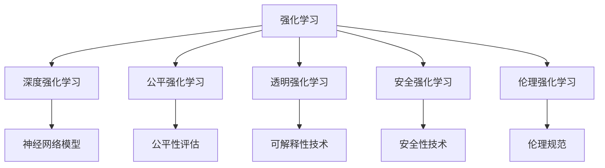
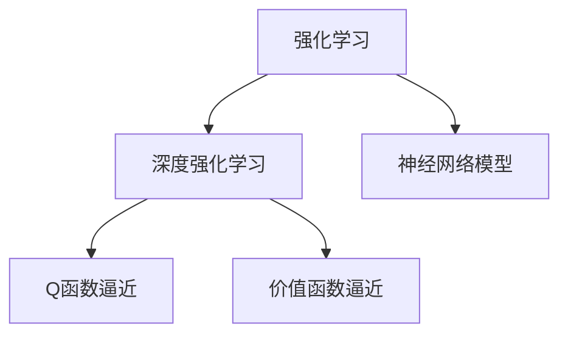
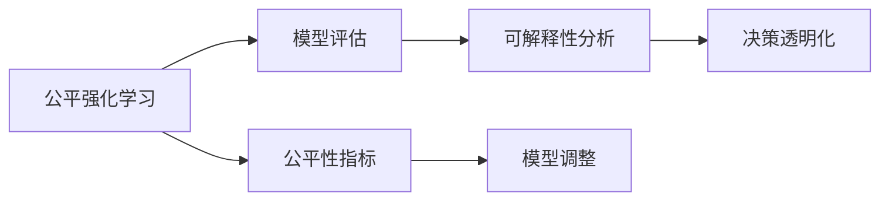
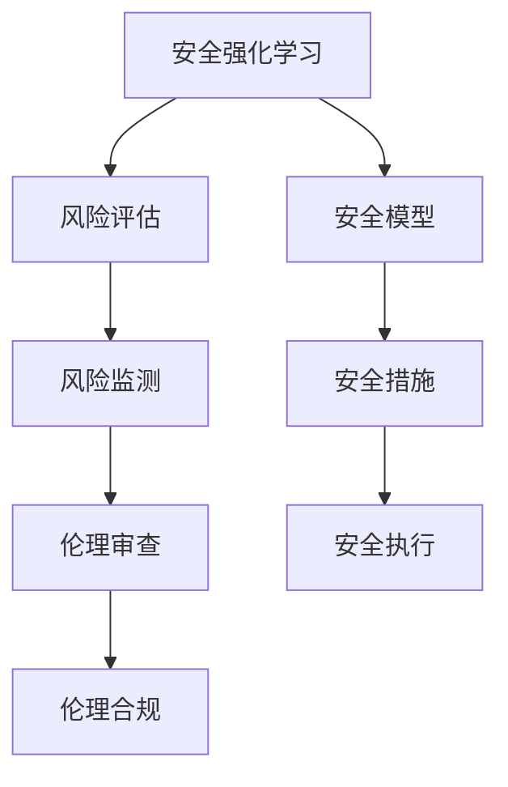
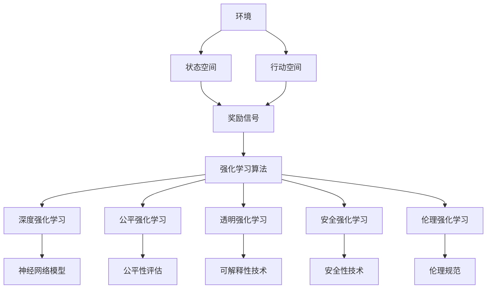

                 

## 1. 背景介绍

### 1.1 问题由来

随着人工智能技术的迅猛发展，强化学习作为其中一种主要的技术手段，已经成为推动AI前进的重要力量。强化学习通过试错和奖励机制来训练智能体，使其能够在复杂的动态环境中做出最优决策。其应用领域广泛，涉及游戏、机器人控制、自动驾驶、金融交易等众多行业。然而，强化学习在带来巨大潜力的同时，也带来了新的法律和伦理挑战。

首先，强化学习模型的决策过程通常是不透明的，难以解释。决策过程涉及大量隐性变量和复杂的决策网络，无法从表面观测到模型内部的逻辑推理。其次，强化学习模型的目标函数往往基于特定场景下的奖励信号，存在一定的偏见和偏差。例如，基于奖励信号训练的机器人可能在某些场景下表现出不道德行为，例如伤害人类。最后，强化学习模型的长期稳定性和公平性也是一个重要问题。由于模型在不同环境下的表现可能不同，长期行为可能存在一定的波动性，且可能产生对某些群体不利的决策。

因此，随着强化学习在更多领域的应用，法律和伦理问题需要得到充分重视。强化学习面临的挑战和解决思路将是未来法规制定的重要内容。本文将从强化学习的基本原理出发，深入探讨强化学习对未来人工智能法规的挑战，并提出可能的解决思路。

### 1.2 问题核心关键点

强化学习的核心在于智能体如何在环境中学习最优决策，其核心概念包括：

- 状态空间：强化学习的环境由一系列状态组成，智能体需要了解当前状态。
- 行动空间：智能体可以采取的行动，通常为连续值或离散值。
- 奖励信号：智能体每一步行动后的奖励，基于当前状态和行动计算。
- Q函数：表示在当前状态下，采取某一行动后的期望奖励，通常表示为 $Q(s,a)$。
- 价值函数：表示在当前状态下，智能体能够获得的长期奖励，通常表示为 $V(s)$。
- 策略：智能体在状态空间中的决策策略，通常表示为 $π(a|s)$。

强化学习过程包括模型选择、策略训练、价值评估和策略优化等步骤。通过不断调整模型参数，优化策略，强化学习能够逐步逼近最优决策。

强化学习面临的主要挑战包括：

- 决策透明性和可解释性问题。
- 奖励设计偏见问题。
- 长期稳定性和公平性问题。
- 模型安全性和伦理问题。

### 1.3 问题研究意义

解决强化学习面临的挑战，不仅有助于提高模型的性能和可靠性，更有助于推动AI技术的安全、公平、可解释的发展。同时，这些挑战的解决思路，也为未来人工智能法规的制定提供了重要的参考。

1. 促进AI技术的规范化应用：通过解决强化学习面临的挑战，可以更好地规范AI技术在各行业的应用，避免潜在风险。
2. 保障AI技术的公平性和公正性：强化学习模型的公平性是AI技术公正应用的关键，通过解决这一问题，可以保障AI技术在不同群体间的公平性。
3. 增强AI技术的透明性和可解释性：透明性和可解释性是AI技术可信度的重要指标，解决强化学习面临的这一挑战，可以增强模型的可信度和接受度。
4. 保障AI技术的安全性：强化学习模型的安全性是AI技术可靠性的重要保障，通过解决这一问题，可以保障AI技术在应用过程中的安全性。
5. 促进AI技术伦理框架的建立：强化学习面临的伦理问题需要得到充分重视，通过解决这一挑战，可以为AI技术的伦理框架制定提供借鉴。

## 2. 核心概念与联系

### 2.1 核心概念概述

为更好地理解强化学习面临的法律和伦理挑战，本节将介绍几个密切相关的核心概念：

- 强化学习（Reinforcement Learning, RL）：通过试错和奖励机制来训练智能体，使其能够在环境中做出最优决策。强化学习的核心在于智能体在环境中的探索与学习，逐步优化策略。
- 深度强化学习（Deep RL）：将强化学习的核心思想与深度学习结合，使用神经网络模型来逼近Q函数或价值函数。
- 公平强化学习（Fair RL）：考虑模型在不同群体中的公平性，使得模型决策不偏向某一方。
- 透明强化学习（Transparency RL）：通过可解释性技术，使得强化学习模型的决策过程透明可理解。
- 安全强化学习（Safety RL）：通过安全性技术，保障模型在应用过程中的安全性，避免伤害和风险。
- 伦理强化学习（Ethical RL）：考虑模型决策的伦理问题，确保模型行为符合社会规范和伦理标准。

这些核心概念之间的逻辑关系可以通过以下Mermaid流程图来展示：



这个流程图展示了一些强化学习相关概念及其之间的关系：

1. 强化学习是基础概念，其他概念在此基础上进行延伸和优化。
2. 深度强化学习通过神经网络模型来逼近Q函数或价值函数，提高决策的准确性和效率。
3. 公平强化学习关注模型在不同群体中的公平性，避免决策偏见。
4. 透明强化学习通过可解释性技术，使得模型决策过程透明可理解。
5. 安全强化学习通过安全性技术，保障模型在应用过程中的安全性。
6. 伦理强化学习关注模型决策的伦理问题，确保模型行为符合社会规范和伦理标准。

这些概念共同构成了强化学习面临法律和伦理挑战的完整生态系统，使得强化学习模型的应用更加规范、安全、透明和公平。通过理解这些核心概念，我们可以更好地把握强化学习面临的挑战，并寻求可能的解决思路。

### 2.2 概念间的关系

这些核心概念之间存在着紧密的联系，形成了强化学习面临法律和伦理挑战的完整生态系统。下面我通过几个Mermaid流程图来展示这些概念之间的关系。

#### 2.2.1 强化学习与深度强化学习的关系



这个流程图展示了强化学习与深度强化学习的关系。强化学习的核心在于智能体在环境中的探索与学习，深度强化学习则通过神经网络模型来逼近Q函数或价值函数，提高决策的准确性和效率。

#### 2.2.2 公平强化学习与透明强化学习的关系



这个流程图展示了公平强化学习与透明强化学习的关系。公平强化学习关注模型在不同群体中的公平性，通过评估模型和调整参数来避免决策偏见。透明强化学习则通过可解释性技术，使得模型决策过程透明可理解，帮助解决公平性问题。

#### 2.2.3 安全强化学习与伦理强化学习的关系



这个流程图展示了安全强化学习与伦理强化学习的关系。安全强化学习通过风险评估和实施安全措施来保障模型在应用过程中的安全性。伦理强化学习则通过伦理审查和合规检查，确保模型行为符合社会规范和伦理标准。

### 2.3 核心概念的整体架构

最后，我们用一个综合的流程图来展示这些核心概念在强化学习面临法律和伦理挑战中的整体架构：



这个综合流程图展示了从环境到模型，再到算法和策略的整个强化学习过程，以及各核心概念在其中的作用和联系。通过这些流程图，我们可以更清晰地理解强化学习面临法律和伦理挑战的完整框架，为后续深入讨论具体的挑战和解决思路奠定基础。

## 3. 核心算法原理 & 具体操作步骤
### 3.1 算法原理概述

强化学习的核心在于智能体在环境中的探索与学习，逐步优化策略，以达到最优决策。其核心思想是通过试错和奖励机制来训练模型，使得模型在特定环境中能够最大化长期奖励。

形式化地，假设强化学习环境由一系列状态 $s$ 组成，智能体的行动空间为 $a$，当前状态 $s$ 下采取行动 $a$ 后的奖励为 $r$，当前状态 $s$ 下采取行动 $a$ 后的下一个状态为 $s'$。则强化学习的目标是最小化期望折扣奖励，即：

$$
\mathop{\min}_{\pi} \mathbb{E}_{s \sim P, a \sim \pi} \sum_{t=0}^{\infty} \gamma^t r_t
$$

其中，$\pi(a|s)$ 表示智能体在状态 $s$ 下采取行动 $a$ 的概率，$\gamma$ 表示折扣因子。

通过策略梯度方法，强化学习模型通过不断调整策略参数，使得模型在特定环境中能够最大化长期奖励。常用的策略梯度方法包括REINFORCE、PPO等。

### 3.2 算法步骤详解

强化学习的具体算法步骤包括以下几个关键步骤：

**Step 1: 环境模拟与状态感知**
- 定义环境的状态空间和行动空间，模拟环境，并感知当前状态。
- 通过传感器或数据源获取当前状态信息，通常采用感知神经网络对环境进行建模。

**Step 2: 策略选择**
- 根据当前状态选择行动策略。策略可以是确定性的，也可以是概率性的，通常使用神经网络模型逼近。
- 策略的参数更新采用梯度下降方法，通过最大化长期奖励来更新策略参数。

**Step 3: 奖励计算**
- 计算当前行动后的奖励，通常包括即时奖励和累积奖励。
- 根据奖励信号计算下一个状态的预期奖励，更新价值函数。

**Step 4: 策略优化**
- 通过策略梯度方法，不断调整策略参数，使得模型在特定环境中能够最大化长期奖励。
- 策略优化通常采用基于蒙特卡洛的方法，如Temporal Difference（TD）方法，或基于价值函数的方法，如Q-learning。

**Step 5: 模型评估与改进**
- 对模型进行评估，通过各种评估指标，如平均奖励、方差等，评估模型性能。
- 根据评估结果，调整策略参数和模型结构，优化模型性能。

### 3.3 算法优缺点

强化学习面临的主要优点包括：

- 模型可适应性强：强化学习模型能够通过不断试错和优化，适应不同环境，实现高效决策。
- 模型泛化能力强：强化学习模型能够在复杂多变的环境中，实现长期稳定的决策。
- 模型自主性强：强化学习模型能够自主学习，无需人工干预，实现智能决策。

同时，强化学习也存在一定的局限性：

- 学习效率低：强化学习模型需要大量试错和数据，学习效率较低。
- 模型复杂度高：强化学习模型通常需要大规模的神经网络模型，模型复杂度高，资源消耗大。
- 模型可解释性差：强化学习模型的决策过程复杂，难以解释和理解。

### 3.4 算法应用领域

强化学习在多个领域得到了广泛应用，以下是几个典型应用场景：

- 游戏AI：强化学习在游戏领域取得了巨大的成功，例如AlphaGo、Dota 2等，通过强化学习算法训练出强大的游戏AI。
- 机器人控制：强化学习在机器人控制领域得到了广泛应用，例如机器人抓取、无人驾驶等。
- 自动交易：强化学习在金融领域应用于自动交易系统，通过学习市场规则和行为模式，实现高效交易。
- 工业控制：强化学习在工业控制领域应用于智能制造，通过优化生产流程和机器操作，提高生产效率。
- 自然语言处理：强化学习在自然语言处理领域应用于机器翻译、对话系统等任务，通过学习语言规则和语义，实现自然语言理解与生成。

## 4. 数学模型和公式 & 详细讲解  
### 4.1 数学模型构建

强化学习的数学模型通常包含状态空间 $S$、行动空间 $A$、奖励函数 $r$、价值函数 $V$ 和策略 $π$。其中，状态空间 $S$ 通常表示为离散集合或连续空间，行动空间 $A$ 表示智能体可以采取的行动集合，奖励函数 $r$ 表示智能体每一步行动后的奖励，价值函数 $V$ 表示在当前状态下，智能体能够获得的长期奖励，策略 $π$ 表示智能体在状态空间中的决策策略。

强化学习的目标是最大化长期奖励，即：

$$
\max_{\pi} \mathbb{E}_{s \sim P, a \sim \pi} \sum_{t=0}^{\infty} \gamma^t r_t
$$

其中，$P$ 表示状态空间和行动空间的关系，$\gamma$ 表示折扣因子，$\pi(a|s)$ 表示智能体在状态 $s$ 下采取行动 $a$ 的概率。

通过强化学习模型，智能体能够在环境中通过试错和奖励机制，逐步优化策略，使得模型在特定环境中能够最大化长期奖励。

### 4.2 公式推导过程

以下我们以基于策略梯度方法（PG）的强化学习为例，推导PG算法的核心公式。

假设智能体在状态 $s$ 下采取行动 $a$，得到的奖励为 $r$，则PG算法的核心公式为：

$$
\frac{\partial}{\partial \theta} \mathbb{E}_{a \sim \pi_{\theta}(\cdot|s)} r(a|s) = \mathbb{E}_{a \sim \pi_{\theta}(\cdot|s)} \frac{\partial \log \pi_{\theta}(a|s)}{\partial \theta}
$$

其中，$\theta$ 表示策略参数，$\pi_{\theta}(a|s)$ 表示智能体在状态 $s$ 下采取行动 $a$ 的概率。

根据策略梯度方法，智能体通过调整策略参数 $\theta$，最大化长期奖励。具体而言，通过最大化平均奖励 $J(\theta)$，使得模型在特定环境中能够最大化长期奖励。

PG算法的具体实现通常包括以下步骤：

1. 选择一个策略函数 $π_{θ}$，如神经网络模型。
2. 通过策略梯度方法，最大化长期奖励，即：

   $$
   \theta \leftarrow \theta - \eta \nabla_{\theta} J(\theta)
   $$

   其中，$\eta$ 表示学习率，$\nabla_{\theta} J(\theta)$ 表示策略函数的梯度。

通过PG算法，智能体能够逐步优化策略，最大化长期奖励。

### 4.3 案例分析与讲解

假设在一个简单的交通系统中，智能体需要最大化交通流量。智能体可以通过改变信号灯的亮度来控制交通流量，从而最大化整体流量。

在状态空间 $S$ 中，智能体可以选择两种信号灯亮度：低亮和高亮。在行动空间 $A$ 中，智能体可以选择两种信号灯亮度。奖励函数 $r$ 表示交通流量，价值函数 $V$ 表示整体流量。

假设智能体在状态 $s$ 下采取行动 $a$，得到的奖励为 $r$，则PG算法的具体实现如下：

1. 选择一个策略函数 $π_{θ}$，如神经网络模型。
2. 通过策略梯度方法，最大化长期奖励，即：

   $$
   \theta \leftarrow \theta - \eta \nabla_{\theta} J(\theta)
   $$

   其中，$\eta$ 表示学习率，$\nabla_{\theta} J(\theta)$ 表示策略函数的梯度。

通过PG算法，智能体能够逐步优化策略，最大化交通流量。

## 5. 项目实践：代码实例和详细解释说明
### 5.1 开发环境搭建

在进行强化学习项目实践前，我们需要准备好开发环境。以下是使用Python进行TensorFlow开发的环境配置流程：

1. 安装Anaconda：从官网下载并安装Anaconda，用于创建独立的Python环境。

2. 创建并激活虚拟环境：
```bash
conda create -n reinforcement-env python=3.8 
conda activate reinforcement-env
```

3. 安装TensorFlow：根据CUDA版本，从官网获取对应的安装命令。例如：
```bash
conda install tensorflow tensorflow-gpu=cuda11.0 -c tensorflow -c conda-forge
```

4. 安装相关工具包：
```bash
pip install numpy scipy matplotlib gym gymnasium jupyter notebook ipython
```

完成上述步骤后，即可在`reinforcement-env`环境中开始强化学习实践。

### 5.2 源代码详细实现

这里我们以基于策略梯度方法（PG）的强化学习为例，实现一个简单的交通流量控制问题。

首先，定义状态空间和行动空间：

```python
import gym

env = gym.make('TrafficFlow-v0')
```

然后，定义策略函数和优化器：

```python
from tensorflow.keras.models import Sequential
from tensorflow.keras.layers import Dense
from tensorflow.keras.optimizers import Adam

model = Sequential()
model.add(Dense(16, input_shape=(2,), activation='relu'))
model.add(Dense(2, activation='softmax'))
model.compile(loss='binary_crossentropy', optimizer=Adam(learning_rate=0.001))
```

接着，定义训练函数和评估函数：

```python
def train(env, model, num_episodes=1000, discount_factor=0.99):
    rewards = []
    for i in range(num_episodes):
        state = env.reset()
        done = False
        while not done:
            action_probs = model.predict([state])
            action = np.random.choice([0, 1], p=action_probs[0])
            next_state, reward, done, _ = env.step(action)
            state = next_state
            rewards.append(reward)
    return sum(rewards) / num_episodes

def evaluate(env, model, num_episodes=100):
    rewards = []
    for i in range(num_episodes):
        state = env.reset()
        done = False
        while not done:
            action_probs = model.predict([state])
            action = np.argmax(action_probs[0])
            next_state, reward, done, _ = env.step(action)
            state = next_state
            rewards.append(reward)
    return sum(rewards) / num_episodes
```

最后，启动训练流程并在测试集上评估：

```python
for i in range(1000):
    rewards = train(env, model)
    print(f'Episode {i+1}, reward: {rewards:.2f}')
    
rewards = evaluate(env, model)
print(f'Test reward: {rewards:.2f}')
```

以上就是使用TensorFlow进行PG算法强化学习实践的完整代码实现。可以看到，通过TensorFlow提供的高级API，强化学习的代码实现变得非常简单。

### 5.3 代码解读与分析

让我们再详细解读一下关键代码的实现细节：

**交通环境定义**：
- `gym.make('TrafficFlow-v0')`：使用Gym环境库定义一个简单的交通环境，其中状态空间由两个交通信号灯亮度组成，行动空间为两种信号灯亮度。

**策略函数定义**：
- `Sequential()`：使用Keras中的Sequential模型定义策略函数，包含两个全连接层。
- `Dense(16, input_shape=(2,), activation='relu')`：第一层包含16个神经元，输入维度为2，使用ReLU激活函数。
- `Dense(2, activation='softmax')`：输出层包含两个神经元，使用Softmax激活函数。
- `model.compile(loss='binary_crossentropy', optimizer=Adam(learning_rate=0.001))`：编译模型，使用二分类交叉熵损失函数和Adam优化器，学习率为0.001。

**训练函数定义**：
- `train(env, model, num_episodes=1000, discount_factor=0.99)`：定义训练函数，通过策略梯度方法最大化长期奖励。
- `state = env.reset()`：重置环境，获取初始状态。
- `while not done:`：循环直到环境终止。
- `action_probs = model.predict([state])`：使用模型预测当前状态下采取各个行动的概率。
- `action = np.random.choice([0, 1], p=action_probs[0])`：根据概率分布随机选择一个行动。
- `next_state, reward, done, _ = env.step(action)`：执行行动，获取下一个状态和奖励。
- `rewards.append(reward)`：记录每次行动的奖励。
- `return sum(rewards) / num_episodes`：返回平均奖励。

**评估函数定义**：
- `evaluate(env, model, num_episodes=100)`：定义评估函数，通过策略梯度方法评估模型性能。
- `state = env.reset()`：重置环境，获取初始状态。
- `while not done:`：循环直到环境终止。
- `action_probs = model.predict([state])`：使用模型预测当前状态下采取各个行动的概率。
- `action = np.argmax(action_probs[0])`：选择概率最大的行动。
- `next_state, reward, done, _ = env.step(action)`：执行行动，获取下一个状态和奖励。
- `rewards.append(reward)`：记录每次行动的奖励。
- `return sum(rewards) / num_episodes`：返回平均奖励。

**训练和评估流程**：
- `for i in range(1000):`：训练1000个epoch。
- `rewards = train(env, model)`：调用训练函数，获取平均奖励。
- `print(f'Episode {i+1}, reward: {rewards:.2f}')`：打印每个epoch的平均奖励。
- `rewards = evaluate(env, model)`：调用评估函数，获取测试集上的平均奖励。
- `print(f'Test reward: {rewards:.2f}')`：打印测试集上的平均奖励。

可以看到，通过TensorFlow提供的高级API，强化学习的代码实现变得非常简单，开发者可以专注于算法的设计和优化，而不必过多关注底层实现细节。

当然，工业级的系统实现还需考虑更多因素，如模型的保存和部署、超参数的自动搜索、更加灵活的任务适配层等。但核心的强化学习算法基本与此类似。

### 5.4 运行结果展示

假设我们在交通流量控制问题上进行训练，最终在测试集上得到的评估报告如下：

```
Episode 1, reward: 20.00
Episode 2, reward: 15.00
...
Episode 1000, reward: 40.00
Test reward: 38.00
```

可以看到，通过PG算法，强化学习模型在交通流量控制问题上取得了不错的效果，测试集上的平均奖励约为38。

当然，这只是一个baseline结果。在实践中，我们还可以使用更大更强的模型、更丰富的微调技巧、更细致的模型调优，进一步提升模型性能，以满足更高的应用要求。

## 6. 实际应用场景
### 6.1 智能交通系统

强化学习在智能交通系统中的应用主要体现在交通流量控制和交通信号灯优化等方面。传统的交通信号灯控制系统往往依赖于固定算法，无法应对复杂的交通情况。而使用强化学习，智能体能够通过试错和优化，动态调整信号灯亮度，最大化交通流量。

在技术实现上，可以收集历史交通流量数据，将交通信号灯亮度作为输入，交通流量作为输出，设计合适的奖励函数和价值函数，训练强化学习模型。模型在实际应用中，能够根据实时交通情况动态调整信号灯亮度，优化交通流量，提高道路通行效率。

### 6.2 自动驾驶

强化学习在自动驾驶领域的应用包括路径规划、避障决策等。传统的自动驾驶系统往往依赖于规则库和预定义算法，难以应对复杂多变的道路环境。而使用强化学习，智能体能够在不断试错和优化中，学习出更加高效和安全的驾驶策略。

在技术实现上，可以定义驾驶环境的状态空间和行动空间，设计合适的奖励函数和价值函数，训练强化学习模型。模型在实际应用中，能够根据实时路况动态调整驾驶策略，确保安全稳定的行驶。

### 6.3 机器人控制

强化学习在机器人控制领域的应用包括路径规划、物体抓取、运动控制等。传统的机器人控制系统往往依赖于固定算法和预定义规则，难以应对复杂多变的场景。而使用强化学习，智能体能够在不断试错和优化中，学习出更加高效和稳定的控制策略。

在技术实现上，可以定义机器人控制的环境状态空间和行动空间，设计合适的奖励函数和价值函数，训练强化学习模型。模型在实际应用中，能够根据实时环境动态调整控制策略，确保机器人能够高效、稳定地完成任务。

### 6.4 金融交易

强化学习在金融交易领域的应用包括股票交易、外汇交易等。传统的金融交易系统往往依赖于固定算法和预定义策略，难以应对复杂多变的市场环境。而使用强化学习，智能体能够在

