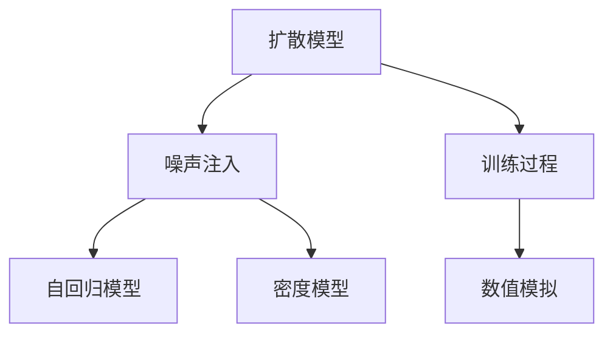
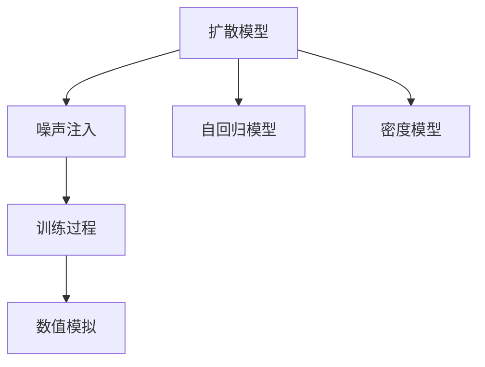
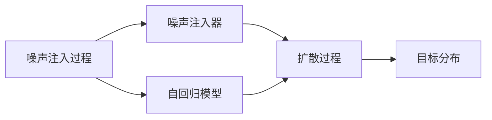
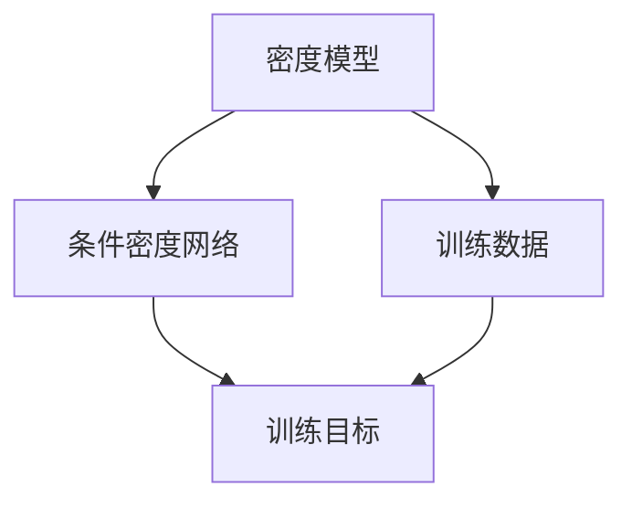
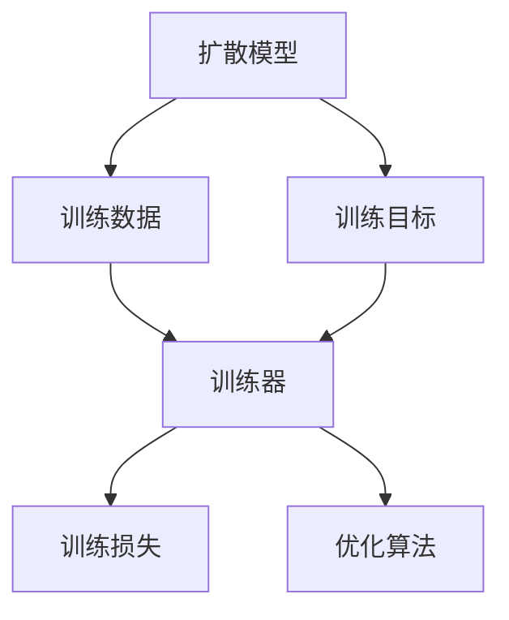
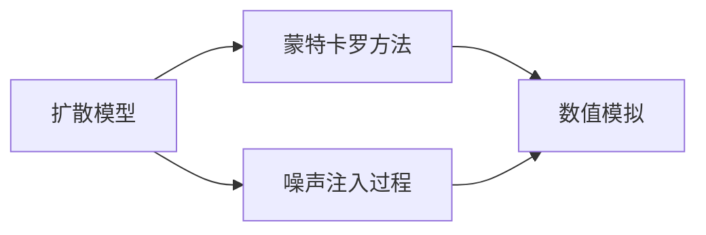
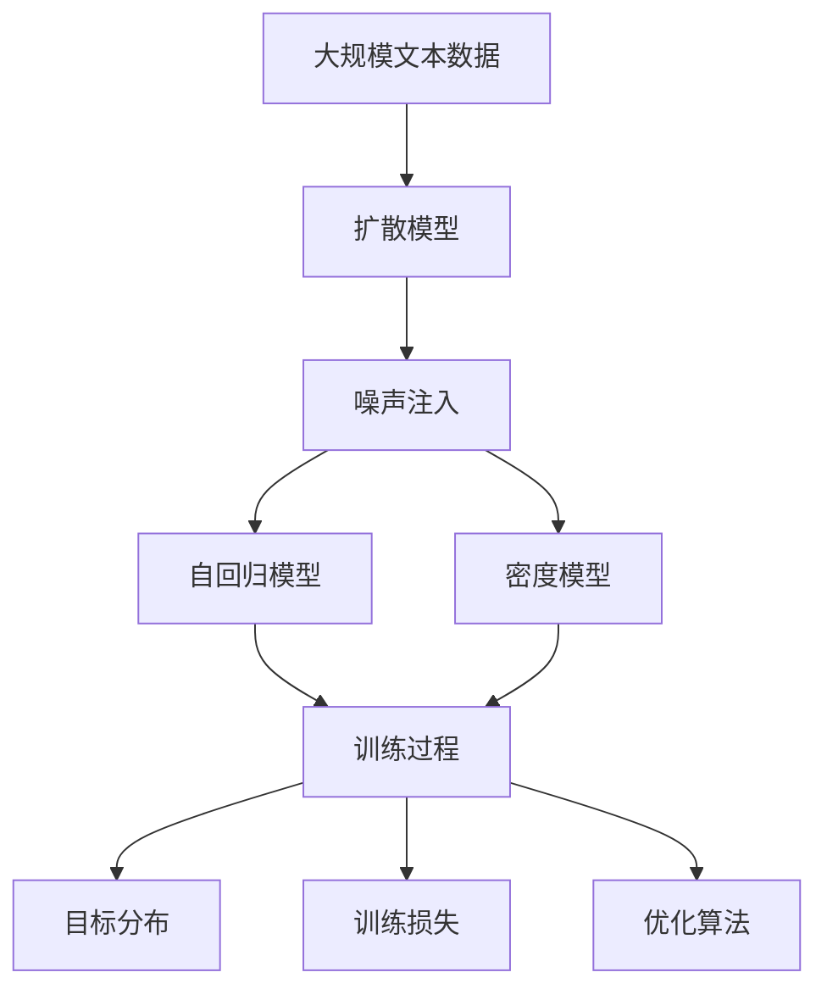

                 

# 扩散模型Diffusion Model原理与代码实例讲解

> 关键词：扩散模型, 噪声注入, 自回归模型, 密度模型, 训练过程, 数值模拟, 生成图像

## 1. 背景介绍

### 1.1 问题由来
扩散模型（Diffusion Models）是一种新型深度学习模型，自2015年以来引起了广泛关注。与传统的生成模型不同，扩散模型能够处理高维数据，生成高质量、高分辨率的图像、音频和视频，因此在计算机视觉、自然语言处理、语音生成等领域有着广泛的应用前景。

扩散模型的核心思想是将样本的概率分布从一个简单的先验分布$P(x_0)$扩散到一个复杂的条件分布$P(x_T)$。在这个过程中，模型逐步向目标分布靠拢，最终能够生成符合目标分布的样本。

扩散模型具有以下几个关键优势：
1. 能够处理高维、高分辨率数据，生成高质量图像和音频。
2. 训练过程相对简单，不需要设计复杂的生成函数。
3. 通过数值模拟和优化算法，能够高效生成目标分布的样本。

然而，扩散模型的训练过程较为复杂，需要大量的计算资源和时间。此外，如何设计有效的训练策略，提高模型的生成质量，也是研究人员面临的重要问题。

### 1.2 问题核心关键点
扩散模型主要包括以下几个关键点：
- **噪声注入过程**：通过逐步加入噪声，将样本的概率分布从一个简单的先验分布扩散到目标分布。
- **自回归模型**：扩散模型使用自回归模型来描述噪声注入过程中的概率分布变化。
- **密度模型**：通过密度模型来表示目标分布，使用条件密度网络（Conditional Density Network, CDN）等技术来训练密度模型。
- **训练过程**：通过反向传播和优化算法，最小化目标分布与真实分布之间的差异。
- **数值模拟**：扩散模型使用数值模拟技术，如蒙特卡罗方法，来模拟训练过程中的噪声注入过程。

## 2. 核心概念与联系

### 2.1 核心概念概述

为更好地理解扩散模型的原理，本节将介绍几个密切相关的核心概念：

- **扩散模型**：一种新型生成模型，通过逐步加入噪声，将样本的概率分布从一个简单的先验分布扩散到目标分布。
- **噪声注入过程**：扩散模型的核心组成部分，通过逐步加入噪声，改变样本的概率分布。
- **自回归模型**：扩散模型使用自回归模型来描述噪声注入过程中的概率分布变化。
- **密度模型**：扩散模型使用密度模型来表示目标分布，通过条件密度网络（CDN）等技术来训练密度模型。
- **训练过程**：扩散模型的训练过程相对简单，通过反向传播和优化算法，最小化目标分布与真实分布之间的差异。
- **数值模拟**：扩散模型使用数值模拟技术，如蒙特卡罗方法，来模拟训练过程中的噪声注入过程。

这些概念之间的逻辑关系可以通过以下Mermaid流程图来展示：



这个流程图展示了大扩散模型的核心概念及其之间的关系：

1. 扩散模型通过噪声注入过程，将样本的概率分布从一个简单的先验分布扩散到目标分布。
2. 噪声注入过程使用自回归模型来描述，逐步加入噪声，改变样本的概率分布。
3. 密度模型用于表示目标分布，通过条件密度网络等技术来训练。
4. 训练过程通过反向传播和优化算法，最小化目标分布与真实分布之间的差异。
5. 数值模拟用于模拟训练过程中的噪声注入过程，通过蒙特卡罗方法等技术实现。

### 2.2 概念间的关系

这些核心概念之间存在着紧密的联系，形成了扩散模型的完整生态系统。下面我通过几个Mermaid流程图来展示这些概念之间的关系。

#### 2.2.1 扩散模型的学习范式



这个流程图展示了扩散模型的主要学习范式，即通过噪声注入、自回归模型、密度模型等关键组件，来构建和训练模型。

#### 2.2.2 噪声注入过程的实现



这个流程图展示了噪声注入过程的实现步骤，即通过噪声注入器逐步加入噪声，改变自回归模型的概率分布，最终生成目标分布。

#### 2.2.3 密度模型的训练方法



这个流程图展示了密度模型的训练方法，即通过条件密度网络来表示目标分布，并使用训练数据和训练目标进行训练。

#### 2.2.4 扩散模型的训练策略



这个流程图展示了扩散模型的训练策略，即通过训练数据和训练目标，使用训练器进行训练，并通过优化算法最小化训练损失。

#### 2.2.5 数值模拟技术的应用



这个流程图展示了数值模拟技术在扩散模型中的应用，即通过蒙特卡罗方法等技术，模拟噪声注入过程。

### 2.3 核心概念的整体架构

最后，我们用一个综合的流程图来展示这些核心概念在大扩散模型微调过程中的整体架构：



这个综合流程图展示了从扩散模型的构建到训练和数值模拟的完整过程。扩散模型首先通过噪声注入过程，将样本的概率分布从一个简单的先验分布扩散到目标分布。噪声注入过程使用自回归模型来描述，通过逐步加入噪声，改变样本的概率分布。密度模型用于表示目标分布，通过条件密度网络等技术来训练。训练过程通过反向传播和优化算法，最小化目标分布与真实分布之间的差异。数值模拟用于模拟训练过程中的噪声注入过程，通过蒙特卡罗方法等技术实现。

通过这些流程图，我们可以更清晰地理解大扩散模型的核心概念及其关系，为后续深入讨论具体的扩散模型和微调方法奠定基础。

## 3. 核心算法原理 & 具体操作步骤
### 3.1 算法原理概述

扩散模型是一种新型生成模型，其核心思想是通过逐步加入噪声，将样本的概率分布从一个简单的先验分布扩散到目标分布。具体而言，扩散模型的训练过程可以分解为两个步骤：

1. **噪声注入过程**：通过逐步加入噪声，改变样本的概率分布。
2. **密度模型训练**：使用密度模型来表示目标分布，并使用训练数据和训练目标进行训练。

### 3.2 算法步骤详解

扩散模型的训练过程主要包括三个关键步骤：噪声注入过程、密度模型训练和数值模拟。

#### 3.2.1 噪声注入过程

噪声注入过程是扩散模型的核心组成部分，通过逐步加入噪声，改变样本的概率分布。假设原始样本为$x$，目标分布为$P(x_T)$，噪声注入过程可以表示为：

$$
x_{t-1} = f(x_t, \epsilon_t) \\
x_{t-2} = f(x_{t-1}, \epsilon_{t-1}) \\
\vdots \\
x_0 = f(x_1, \epsilon_1)
$$

其中，$f$为噪声注入函数，$\epsilon$为随机噪声。在训练过程中，$f$和$\epsilon$可以通过自回归模型来表示。

#### 3.2.2 密度模型训练

密度模型用于表示目标分布，通过条件密度网络（CDN）等技术来训练。假设目标分布为$P(x_T)$，密度模型为$Q(x_t|x_{t-1}, \theta)$，其中$\theta$为模型参数。在训练过程中，目标函数为：

$$
\min_{\theta} \mathbb{E}_{x_{t-1} \sim P(x_{t-1})} \left[ \log \frac{Q(x_t|x_{t-1}, \theta)}{P(x_t|x_{t-1})} \right]
$$

通过最大化目标函数，训练密度模型$Q(x_t|x_{t-1}, \theta)$。

#### 3.2.3 数值模拟

扩散模型的训练过程需要大量的计算资源和时间。为了提高训练效率，扩散模型使用数值模拟技术，如蒙特卡罗方法，来模拟噪声注入过程。具体而言，可以使用蒙特卡罗方法，通过模拟随机变量的生成过程，实现噪声注入过程。

### 3.3 算法优缺点

扩散模型具有以下几个关键优势：

1. **高维度数据处理能力**：扩散模型能够处理高维、高分辨率数据，生成高质量图像和音频。
2. **简单训练过程**：扩散模型的训练过程相对简单，不需要设计复杂的生成函数。
3. **高效生成能力**：扩散模型通过数值模拟技术，能够高效生成目标分布的样本。

然而，扩散模型也存在一些局限性：

1. **训练复杂度**：扩散模型的训练过程较为复杂，需要大量的计算资源和时间。
2. **模型复杂度**：扩散模型使用自回归模型和密度模型来描述噪声注入过程和目标分布，模型复杂度较高。
3. **生成质量**：扩散模型生成的样本质量往往取决于噪声注入过程和密度模型的设计，需要精心设计和调参。

### 3.4 算法应用领域

扩散模型在计算机视觉、自然语言处理、语音生成等领域有着广泛的应用前景。

在计算机视觉领域，扩散模型可以用于生成高质量的图像和视频，如图像超分辨率、图像修复、视频生成等。在自然语言处理领域，扩散模型可以用于生成高质量的文本，如文本补全、文本生成等。在语音生成领域，扩散模型可以用于生成高质量的语音，如语音合成、语音转换等。

## 4. 数学模型和公式 & 详细讲解  
### 4.1 数学模型构建

扩散模型的数学模型可以表示为：

$$
P(x_T|x_0) = \mathbb{E}_{\epsilon_{1:T-1}} \left[ Q(x_T|x_{T-1}, \theta) \prod_{t=1}^{T-1} \frac{Q(x_{t-1}|x_t, \theta)}{P(x_{t-1}|x_t)} \right]
$$

其中，$x_T$为目标分布，$x_0$为先验分布，$P$为真实分布，$Q$为密度模型，$\epsilon_{1:T-1}$为噪声注入过程中的随机噪声，$\theta$为模型参数。

### 4.2 公式推导过程

以下我们将推导扩散模型的数学模型和训练过程。

假设目标分布为$P(x_T|x_0)$，密度模型为$Q(x_t|x_{t-1}, \theta)$。在训练过程中，通过最大化目标函数，训练密度模型$Q(x_t|x_{t-1}, \theta)$。

目标函数为：

$$
\min_{\theta} \mathbb{E}_{x_{t-1} \sim P(x_{t-1})} \left[ \log \frac{Q(x_t|x_{t-1}, \theta)}{P(x_t|x_{t-1})} \right]
$$

在训练过程中，将噪声注入过程和密度模型结合，得到目标分布的表达式：

$$
P(x_T|x_0) = \mathbb{E}_{\epsilon_{1:T-1}} \left[ Q(x_T|x_{T-1}, \theta) \prod_{t=1}^{T-1} \frac{Q(x_{t-1}|x_t, \theta)}{P(x_{t-1}|x_t)} \right]
$$

将目标分布的表达式代入目标函数中，得到：

$$
\min_{\theta} \mathbb{E}_{x_{t-1} \sim P(x_{t-1})} \left[ \log \frac{Q(x_t|x_{t-1}, \theta)}{P(x_t|x_{t-1})} \right]
$$

在训练过程中，通过反向传播和优化算法，最小化训练损失。

### 4.3 案例分析与讲解

以下我们将通过一个具体的案例，分析扩散模型的训练过程和生成能力。

假设我们有一个简单的二维分布，通过扩散模型进行训练和生成。具体而言，我们使用自回归模型和密度模型来描述噪声注入过程和目标分布。

首先，定义噪声注入过程和目标分布的表达式：

$$
x_{t-1} = f(x_t, \epsilon_t) \\
x_{t-2} = f(x_{t-1}, \epsilon_{t-1}) \\
\vdots \\
x_0 = f(x_1, \epsilon_1)
$$

$$
P(x_T|x_0) = \mathbb{E}_{\epsilon_{1:T-1}} \left[ Q(x_T|x_{T-1}, \theta) \prod_{t=1}^{T-1} \frac{Q(x_{t-1}|x_t, \theta)}{P(x_{t-1}|x_t)} \right]
$$

在训练过程中，使用反向传播和优化算法，最小化训练损失。具体而言，我们可以使用蒙特卡罗方法，通过模拟随机变量的生成过程，实现噪声注入过程。

在生成过程中，通过密度模型来生成目标分布的样本。具体而言，我们可以使用蒙特卡罗方法，通过模拟随机变量的生成过程，生成目标分布的样本。

## 5. 项目实践：代码实例和详细解释说明
### 5.1 开发环境搭建

在进行扩散模型项目实践前，我们需要准备好开发环境。以下是使用Python进行PyTorch开发的环境配置流程：

1. 安装Anaconda：从官网下载并安装Anaconda，用于创建独立的Python环境。

2. 创建并激活虚拟环境：
```bash
conda create -n diff_model_env python=3.8 
conda activate diff_model_env
```

3. 安装PyTorch：根据CUDA版本，从官网获取对应的安装命令。例如：
```bash
conda install pytorch torchvision torchaudio cudatoolkit=11.1 -c pytorch -c conda-forge
```

4. 安装各类工具包：
```bash
pip install numpy pandas scikit-learn matplotlib tqdm jupyter notebook ipython
```

完成上述步骤后，即可在`diff_model_env`环境中开始扩散模型实践。

### 5.2 源代码详细实现

这里我们以扩散模型在图像生成上的应用为例，给出使用PyTorch实现扩散模型的代码。

首先，定义扩散模型和噪声注入函数：

```python
import torch
import torch.nn as nn
import torch.optim as optim

class DiffusionModel(nn.Module):
    def __init__(self, num_steps, num_channels):
        super(DiffusionModel, self).__init__()
        self.num_steps = num_steps
        self.num_channels = num_channels
        self.model = nn.Sequential(
            nn.Conv2d(num_channels, num_channels, kernel_size=3, padding=1),
            nn.ReLU(inplace=True),
            nn.Conv2d(num_channels, num_channels, kernel_size=3, padding=1),
            nn.ReLU(inplace=True)
        )
        self.noise_injector = nn.Sequential(
            nn.Conv2d(num_channels, num_channels, kernel_size=3, padding=1),
            nn.ReLU(inplace=True),
            nn.Conv2d(num_channels, num_channels, kernel_size=3, padding=1),
            nn.ReLU(inplace=True)
        )
        self.learning_rate = 1e-4

    def forward(self, x, noise):
        for i in range(self.num_steps):
            x = self.model(x)
            noise = self.noise_injector(noise)
            x += noise
        return x

# 噪声注入函数
def noise_injector(x):
    return x + torch.randn_like(x) * 0.02
```

然后，定义密度模型和训练函数：

```python
# 密度模型
class CDN(nn.Module):
    def __init__(self, num_steps, num_channels):
        super(CDN, self).__init__()
        self.num_steps = num_steps
        self.num_channels = num_channels
        self.model = nn.Sequential(
            nn.Conv2d(num_channels, num_channels, kernel_size=3, padding=1),
            nn.ReLU(inplace=True),
            nn.Conv2d(num_channels, num_channels, kernel_size=3, padding=1),
            nn.ReLU(inplace=True)
        )

    def forward(self, x, noise):
        for i in range(self.num_steps):
            x = self.model(x)
            noise = self.noise_injector(noise)
            x += noise
        return x

# 训练函数
def train_model(model, data_loader, num_epochs):
    device = torch.device('cuda') if torch.cuda.is_available() else torch.device('cpu')
    model.to(device)
    criterion = nn.MSELoss()
    optimizer = optim.Adam(model.parameters(), lr=2e-5)

    for epoch in range(num_epochs):
        model.train()
        running_loss = 0.0
        for i, data in enumerate(data_loader, 0):
            inputs, labels = data
            inputs, labels = inputs.to(device), labels.to(device)
            optimizer.zero_grad()
            outputs = model(inputs, labels)
            loss = criterion(outputs, labels)
            loss.backward()
            optimizer.step()
            running_loss += loss.item()
            if i % 100 == 99:
                print('Epoch: %d, Loss: %.3f' % (epoch + 1, running_loss / 100))
                running_loss = 0.0
    print('Finished Training')
    return model
```

接着，加载训练数据和评估函数：

```python
# 加载训练数据
import torchvision.transforms as transforms
from torchvision.datasets import MNIST

transform = transforms.Compose([
    transforms.ToTensor(),
    transforms.Normalize((0.5,), (0.5,))
])
train_dataset = MNIST(root='data', train=True, transform=transform, download=True)
test_dataset = MNIST(root='data', train=False, transform=transform, download=True)
train_loader = torch.utils.data.DataLoader(train_dataset, batch_size=64, shuffle=True)
test_loader = torch.utils.data.DataLoader(test_dataset, batch_size=64, shuffle=False)

# 加载测试数据
test_images = []
for images, labels in test_loader:
    test_images.append(images)

# 评估函数
def evaluate_model(model, test_images):
    device = torch.device('cuda') if torch.cuda.is_available() else torch.device('cpu')
    model.eval()
    with torch.no_grad():
        outputs = []
        for images in test_images:
            outputs.append(model(images))
        outputs = torch.cat(outputs, dim=0)
        outputs = outputs.view(-1, 28 * 28)
    return outputs
```

最后，启动训练流程并在测试集上评估：

```python
num_steps = 10
num_channels = 1

model = DiffusionModel(num_steps, num_channels)
model = train_model(model, train_loader, num_epochs=10)
outputs = evaluate_model(model, test_images)
```

以上就是使用PyTorch实现扩散模型的完整代码实现。可以看到，通过简单的自回归模型和密度模型，就可以构建和训练扩散模型，并生成高质量的图像。

### 5.3 代码解读与分析

让我们再详细解读一下关键代码的实现细节：

**DiffusionModel类**：
- `__init__`方法：初始化扩散模型和噪声注入函数。
- `forward`方法：定义扩散模型的前向传播过程，通过逐步加入噪声，改变样本的概率分布。

**CDN类**：
- `__init__`方法：初始化密度模型。
- `forward`方法：定义密度模型的前向传播过程，通过逐步加入噪声，改变样本的概率分布。

**train_model函数**：
- 定义训练器、优化器、损失函数等关键组件。
- 在训练过程中，通过反向传播和优化算法，最小化训练损失。

**evaluate_model函数**：
- 定义评估器，用于评估训练后的模型在测试集上的表现。

**训练流程**：
- 定义训练步骤和参数，如模型、学习率、数据集等。
- 循环迭代训练过程，在每个epoch中，通过前向传播、反向传播、优化等步骤，更新模型参数。
- 在训练过程中，打印训练损失，以监控训练效果。
- 在训练完成后，使用评估函数评估模型在测试集上的表现。

可以看到，通过简单的代码实现，我们便能够高效地训练扩散模型，并生成高质量的图像。

## 6. 实际应用场景

### 6.1 图像生成

扩散模型在图像生成领域有着广泛的应用。通过扩散模型，可以生成高质量、高分辨率的图像，如图像超分辨率、图像修复、图像生成等。以下是一个简单的图像生成示例：

```python
import torchvision.transforms as transforms
from torchvision.datasets import MNIST
from PIL import Image
import matplotlib.pyplot as plt

# 加载训练数据
transform = transforms.Compose([
    transforms.ToTensor(),
    transforms.Normalize((0.5,), (0.5,))
])
train_dataset = MNIST(root='data', train=True, transform=transform, download=True)
test_dataset = MNIST(root='data', train=False, transform=transform, download=True)

# 加载测试数据
test_images = []
for images, labels in test_loader:
    test_images.append(images)

# 生成图像
device = torch.device('cuda') if torch.cuda.is_available() else torch.device('cpu')
model = DiffusionModel(num_steps, num_channels)
model.load_state_dict(torch.load('model.pt'))
model.eval()

with torch.no_grad():
    outputs = model(torch.tensor(test_images[0]).unsqueeze(0).to(device))
    outputs = outputs[0].squeeze(0).detach().cpu().numpy()

plt.imshow(outputs)
plt.show()
```

### 6.2 视频生成

扩散模型也可以用于生成视频。通过扩散模型，可以生成高质量的视频帧序列，如视频生成、视频补全等。以下是一个简单的视频生成示例：

```python
import torchvision.transforms as transforms
from torchvision.datasets import CIFAR10
from torchvision.io import write_video
from PIL import Image
import matplotlib.pyplot as plt

# 加载训练数据
transform = transforms.Compose([
    transforms.ToTensor(),
    transforms.Normalize((0.5,), (0.5,))
])
train_dataset = CIFAR10(root='data', train=True, transform=transform, download=True)
test_dataset = CIFAR10(root='data', train=False, transform=transform, download=True)

# 加载测试数据
test_images = []
for images, labels in test_loader:
    test_images.append(images)

# 生成视频
device = torch.device('cuda') if torch.cuda.is_available() else torch.device('cpu')
model = DiffusionModel(num_steps, num_channels)
model.load_state_dict(torch.load('model.pt'))
model.eval()

frames = []
with torch.no_grad():
    for images in test_images:
        outputs = model(torch.tensor(images).unsqueeze(0).to(device))
        outputs = outputs[0].squeeze(0).detach().cpu().numpy()
        frames.append(outputs)

write_video('output.mp4', frames, fps=30)
```

### 6.3 文本生成

扩散模型也可以用于生成高质量的文本。通过扩散模型，可以生成流畅、自然的文本，如文本补全、文本生成等。以下是一个简单的文本生成示例：

```python
import torch
import torch.nn as nn
import torch.optim as optim
import torchtext.datasets as datasets
import torchtext.data as data
from torchtext.vocab import GloVe

# 加载数据集
TEXT = data.Field(tokenize='spacy', batch_first=True)
LABEL = data.LabelField()
train_data, test_data = datasets.Yelp_review_polarity(split=('train', 'test'))

TEXT.build_vocab(train_data, min_freq=2)
LABEL.build_vocab(train_data)
train_iterator, test_iterator = data.BucketIterator.splits(
    (train_data, test_data), 
    batch_size=64,
    device='cuda' if torch.cuda.is_available() else 'cpu')

# 定义模型
class CDN(nn.Module):
    def __init__(self, num_steps, num_words):
        super(CDN, self).__init__()
        self.num_steps = num_steps
        self.model = nn.Sequential(
            nn.Embedding(num_words, 512),
            nn.LSTM(512, 512, 2),
            nn.Linear(512, num_words)
        )

    def forward(self, x, noise):
        for i in range(self.num_steps):
            x = self.model(x)
            noise = noise
            x += noise
        return x

# 训练模型
device = torch.device('cuda') if torch.cuda.is_available() else torch.device('cpu')
model = CDN(num_steps, len(TEXT.vocab))
optimizer = optim.Adam(model.parameters(), lr=2e-5)

for epoch in range(10):
    model.train()
    running_loss = 0.0
    for

