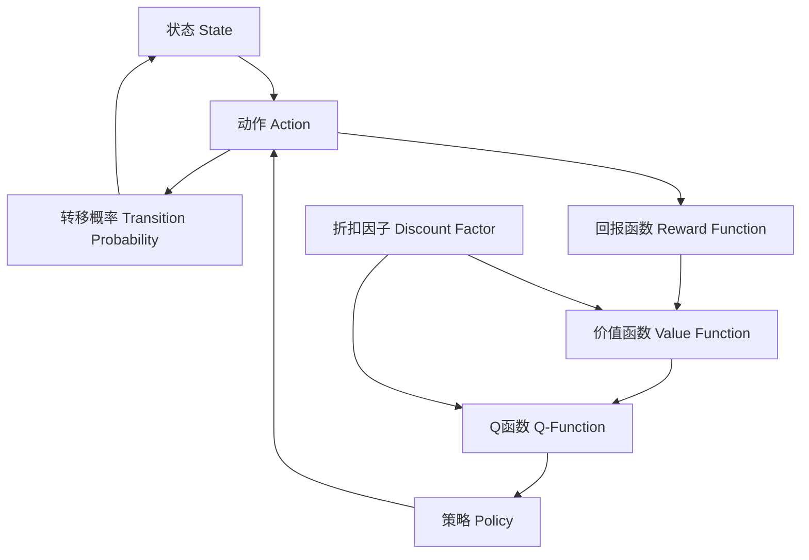

# 马尔可夫决策过程(Markov Decision Processes) - 原理与代码实例讲解

## 1. 背景介绍

### 1.1 问题的由来

在现实世界中,我们经常会遇到需要在不确定环境下做出决策的情况。例如,机器人需要根据感知到的环境信息选择合适的行动,自动驾驶汽车需要根据交通状况和路况做出相应的决策,投资者需要根据市场行情做出买入或卖出的决定等。这些决策问题都存在以下几个关键特征:

1. **序贯决策**:决策者需要在一系列时间步长内做出连续的决策,而不是一次性决策。
2. **部分可观测性**:决策者无法完全观测到环境的所有状态信息,只能根据有限的观测获取部分信息。
3. **随机过程**:环境的转移具有一定的随机性,无法完全确定下一个状态。
4. **长期回报**:决策的目标是最大化未来的长期累积回报,而不只是当前的即时回报。

针对这类序贯决策问题,马尔可夫决策过程(Markov Decision Processes, MDPs)提供了一种有效的建模和求解方法。

### 1.2 研究现状

马尔可夫决策过程理论源于20世纪50年代,最早应用于运筹学和操作研究领域。随着强化学习等机器学习技术的发展,MDPs在近年来受到了越来越多的关注和应用。目前,MDPs已经广泛应用于机器人控制、自动驾驶、对话系统、游戏AI、投资决策等诸多领域。

### 1.3 研究意义

研究和掌握马尔可夫决策过程理论及其求解算法,对于解决现实世界中的序贯决策问题具有重要意义:

1. **建模能力**:MDPs提供了一种通用的框架,可以将现实问题抽象建模为马尔可夫决策过程,从而利用已有的理论和算法进行求解。
2. **最优决策**:MDPs的目标是找到一个最优策略,使得在满足约束条件的情况下,获得最大的长期累积回报。
3. **可解释性**:与黑盒模型不同,MDPs的求解过程是可解释的,可以分析和理解决策的原因和依据。
4. **通用性**:MDPs具有很强的通用性,可以应用于多种领域的序贯决策问题。
5. **长期规划**:MDPs考虑了长期累积回报,能够进行长期规划和决策,而不只是短视的即时决策。

### 1.4 本文结构

本文将全面介绍马尔可夫决策过程的理论基础、核心算法、数学模型、代码实现和实际应用。文章主要包括以下几个部分:

1. **核心概念与联系**:介绍MDPs的基本概念,如状态、动作、转移概率、回报函数等,并阐述它们之间的关系。
2. **核心算法原理与具体操作步骤**:详细讲解MDPs的主要求解算法,如价值迭代、策略迭代、Q-Learning等,包括算法原理、伪代码和具体操作步骤。
3. **数学模型和公式详细讲解举例说明**:建立MDPs的数学模型,推导核心公式,并通过具体案例进行讲解和分析。
4. **项目实践:代码实例和详细解释说明**:提供MDPs算法的Python代码实现,包括开发环境搭建、源代码详细解读和运行结果展示。
5. **实际应用场景**:介绍MDPs在机器人控制、自动驾驶、投资决策等领域的实际应用案例。
6. **工具和资源推荐**:推荐学习MDPs的优秀资源、开发工具和相关论文等。
7. **总结:未来发展趋势与挑战**:总结MDPs的研究成果,展望未来发展趋势,并分析面临的主要挑战。
8. **附录:常见问题与解答**:解答MDPs学习和应用过程中的常见问题。

## 2. 核心概念与联系

马尔可夫决策过程(Markov Decision Processes, MDPs)是一种用于建模序贯决策问题的数学框架。它由以下几个核心概念组成:

1. **状态(State)**: 状态$s$描述了环境或系统在某个时刻的情况,包含了所有相关信息。状态空间$\mathcal{S}$是所有可能状态的集合。

2. **动作(Action)**: 动作$a$表示决策者在当前状态下可以采取的行为。动作空间$\mathcal{A}$是所有可能动作的集合。

3. **转移概率(Transition Probability)**: 转移概率$\mathcal{P}_{ss'}^a$描述了在当前状态$s$下采取动作$a$后,转移到下一状态$s'$的概率。它反映了环境的动态行为和不确定性。

4. **回报函数(Reward Function)**: 回报函数$\mathcal{R}_s^a$或$\mathcal{R}_{ss'}^a$定义了在状态$s$下采取动作$a$后获得的即时回报。回报可以是正值(收益)或负值(代价)。

5. **折扣因子(Discount Factor)**: 折扣因子$\gamma \in [0, 1)$用于权衡当前回报和未来回报的重要性。较大的$\gamma$值表示未来回报更加重要。

6. **策略(Policy)**: 策略$\pi$是一个映射函数,它定义了在每个状态下应该采取何种行动,即$\pi(s) = a$。策略可以是确定性的(每个状态只对应一个动作),也可以是随机的(每个状态对应一个动作概率分布)。

7. **价值函数(Value Function)**: 价值函数$V^\pi(s)$表示在状态$s$下遵循策略$\pi$所能获得的长期累积回报的期望值。它是评估一个策略好坏的关键指标。

8. **Q函数(Q-Function)**: Q函数$Q^\pi(s, a)$表示在状态$s$下采取动作$a$,之后遵循策略$\pi$所能获得的长期累积回报的期望值。

这些概念之间存在着紧密的联系,如下图所示:



马尔可夫决策过程的目标是找到一个最优策略$\pi^*$,使得在满足约束条件的情况下,价值函数$V^{\pi^*}(s)$或Q函数$Q^{\pi^*}(s, a)$最大化。也就是说,要最大化在该策略下的长期累积回报。

## 3. 核心算法原理与具体操作步骤

### 3.1 算法原理概述

求解马尔可夫决策过程的核心算法主要包括三类:价值迭代(Value Iteration)、策略迭代(Policy Iteration)和Q-Learning。这些算法的基本思路是通过不断更新价值函数或Q函数,逐步逼近最优解。

1. **价值迭代**:价值迭代直接对贝尔曼最优方程(Bellman Optimality Equation)进行迭代求解,逐步更新价值函数$V(s)$,直至收敛到最优价值函数$V^*(s)$。然后根据最优价值函数推导出最优策略$\pi^*(s)$。

2. **策略迭代**:策略迭代通过不断评估当前策略并优化策略来进行迭代。具体地,它先求解当前策略下的价值函数,然后根据价值函数对策略进行改进,重复这个过程直至收敛到最优策略。

3. **Q-Learning**:Q-Learning是一种基于时序差分(Temporal Difference)的强化学习算法,它直接学习Q函数而不需要先学习价值函数。Q-Learning在线更新Q值,无需提前知道环境的转移概率和回报函数,因此具有很强的通用性和实用性。

这些算法各有优缺点,适用于不同的场景。价值迭代和策略迭代需要提前知道环境的转移概率和回报函数,适用于已知模型的情况。而Q-Learning可以在线学习,适用于未知模型的情况,但收敛速度较慢。

### 3.2 算法步骤详解

#### 3.2.1 价值迭代算法

价值迭代算法的核心是贝尔曼最优方程:

$$V^*(s) = \max_a \mathbb{E}[R_s^a + \gamma \sum_{s' \in \mathcal{S}} \mathcal{P}_{ss'}^a V^*(s')]$$

其中,$V^*(s)$是状态$s$下的最优价值函数,即最大化长期累积回报的价值函数。$R_s^a$是在状态$s$下采取动作$a$获得的即时回报,$\mathcal{P}_{ss'}^a$是从状态$s$采取动作$a$转移到状态$s'$的概率,$\gamma$是折扣因子。

价值迭代算法的步骤如下:

1. 初始化价值函数$V(s)$,例如全部设为0或者随机初始化。
2. 对每个状态$s \in \mathcal{S}$,更新$V(s)$:
   $$V(s) \leftarrow \max_a \mathbb{E}[R_s^a + \gamma \sum_{s' \in \mathcal{S}} \mathcal{P}_{ss'}^a V(s')]$$
3. 重复步骤2,直至价值函数收敛或达到最大迭代次数。
4. 根据最终的价值函数$V^*(s)$计算最优策略$\pi^*(s)$:
   $$\pi^*(s) = \arg\max_a \mathbb{E}[R_s^a + \gamma \sum_{s' \in \mathcal{S}} \mathcal{P}_{ss'}^a V^*(s')]$$

算法的伪代码如下:

```python
def value_iteration(mdp, gamma, epsilon):
    V = defaultdict(float)  # 初始化价值函数
    delta = float('inf')
    while delta > epsilon:
        delta = 0
        for s in mdp.states:
            v = V[s]
            V[s] = max(mdp.reward(s, a) + gamma * sum(
                mdp.transition_prob(s, a, s_next) * V[s_next]
                for s_next in mdp.states)
                       for a in mdp.actions(s))
            delta = max(delta, abs(v - V[s]))
    policy = {}
    for s in mdp.states:
        policy[s] = max((mdp.reward(s, a) + gamma * sum(
            mdp.transition_prob(s, a, s_next) * V[s_next]
            for s_next in mdp.states), a) for a in mdp.actions(s))[1]
    return V, policy
```

其中,`mdp`是一个包含状态、动作、转移概率和回报函数的马尔可夫决策过程对象。`gamma`是折扣因子,`epsilon`是收敛阈值。

#### 3.2.2 策略迭代算法

策略迭代算法由两个核心步骤组成:策略评估(Policy Evaluation)和策略改进(Policy Improvement)。

**策略评估**:给定一个策略$\pi$,计算该策略下的价值函数$V^\pi(s)$,它满足贝尔曼方程:

$$V^\pi(s) = \mathbb{E}^\pi[R_s^{\pi(s)} + \gamma \sum_{s' \in \mathcal{S}} \mathcal{P}_{ss'}^{\pi(s)} V^\pi(s')]$$

可以通过简单的迭代法求解。

**策略改进**:基于当前策略的价值函数$V^\pi(s)$,对策略进行改进:

$$\pi'(s) = \arg\max_a \mathbb{E}[R_s^a + \gamma \sum_{s' \in \mathcal{S}} \mathcal{P}_{ss'}^a V^\pi(s')]$$

得到一个新的更优的策略$\pi'$。

算法的步骤如下:

1. 初始化一个随机策略$\pi_0$。
2. 对当前策略$\pi_i$进行策略评估,计算$V^{\pi_i}(s)$。
3. 基于$V^{\pi_i}(s)$进行策略改进,得到新策略$\pi_{i+1}$。
4. 如果$\pi_{i+1} = \pi_i$,则已收敛到最优策略,算法终止;否则令$i = i + 1$,返回步骤2。

算法的