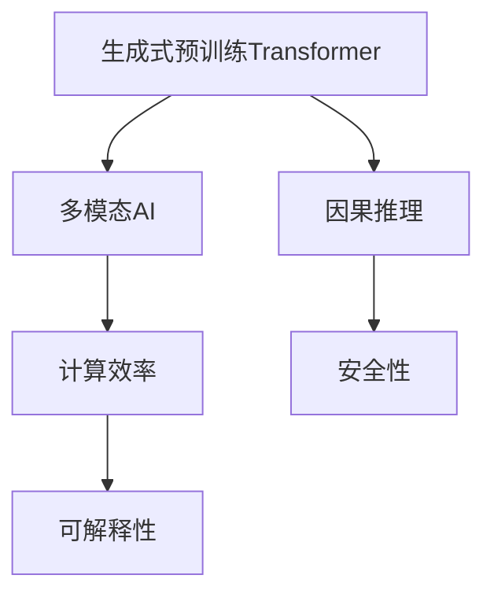
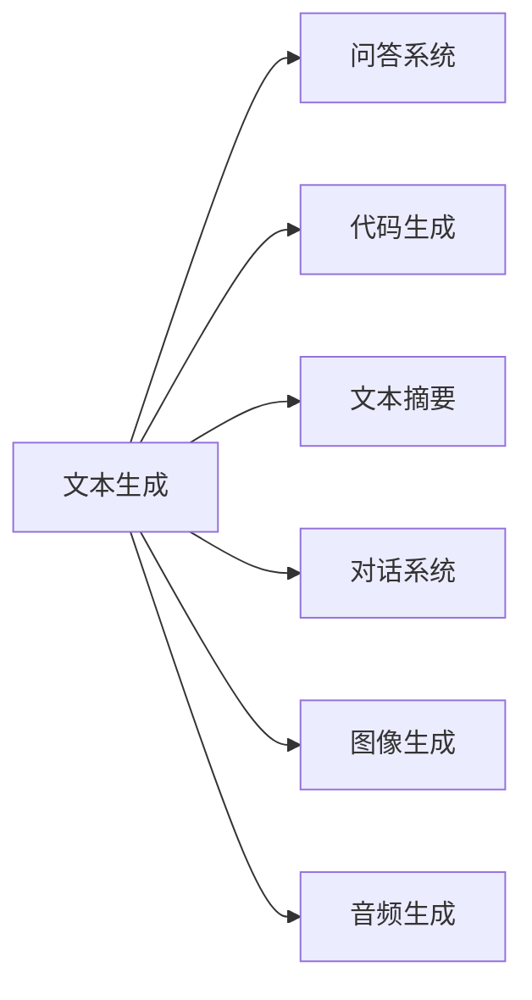
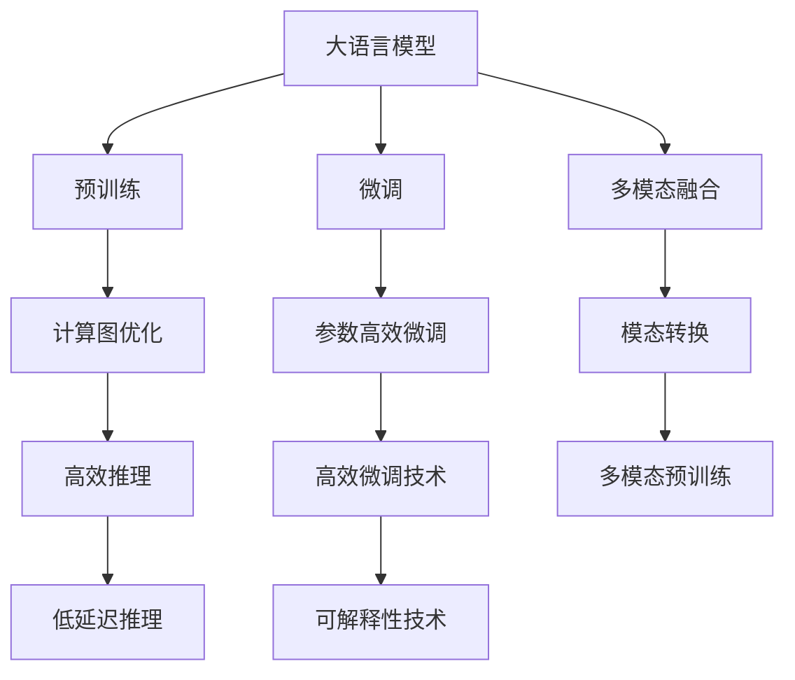
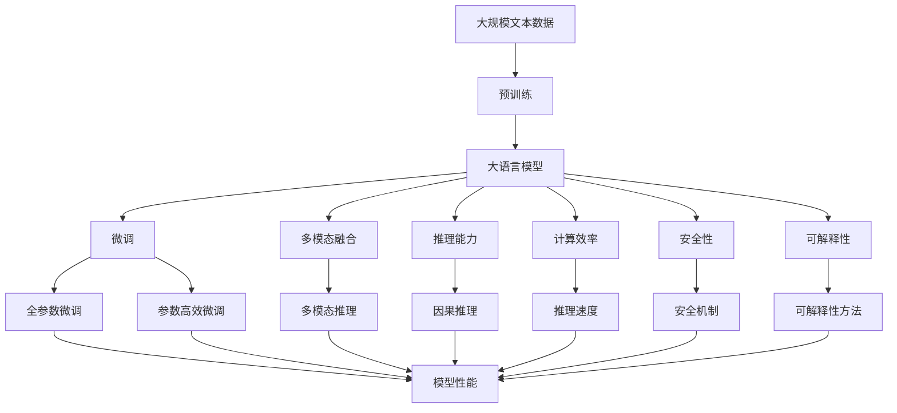

                 

# OpenAI的GPT-4.0展示的实际应用

> 关键词：GPT-4.0, 自然语言处理(NLP), 多模态AI, 对话系统, 推理, 生成式AI, 计算效率, 安全性, 可解释性

## 1. 背景介绍

### 1.1 问题由来
OpenAI在2023年发布的GPT-4.0（Generative Pre-trained Transformer 4.0）模型，再次刷新了语言生成和自然语言处理（NLP）领域的标杆。该模型不仅在文本生成、问答、代码生成等经典任务上取得了新的SOTA成绩，还在多模态AI、对话系统、推理等多个领域展示了广泛的应用潜力。本文将深入探讨GPT-4.0所展示的实际应用，包括其技术原理、应用场景及未来展望。

### 1.2 问题核心关键点
GPT-4.0的发布，标志着大语言模型在精度、泛化能力、推理能力等方面的显著提升，同时也带来了对模型规模、计算资源、训练时间、安全性和可解释性的更高要求。其核心关键点包括：

- 更大的模型规模：GPT-4.0采用了更大的模型参数，以提升模型的表达能力和泛化能力。
- 更强的推理能力：GPT-4.0在多模态推理、因果推理等方面取得了突破性进展。
- 多模态AI支持：GPT-4.0能够同时处理文本、图像、音频等多种模态的数据。
- 更高的安全性和可解释性：OpenAI在模型训练和部署过程中，引入了更严格的安全措施和可解释性技术。

### 1.3 问题研究意义
研究GPT-4.0的实际应用，对于理解大语言模型的最新进展，推动NLP技术的实际应用，具有重要意义：

- 提升模型性能：GPT-4.0在多种任务上的表现，为NLP领域树立了新的标杆，提升了相关模型的应用效果。
- 拓展应用场景：GPT-4.0的多模态AI支持，为更多领域的应用提供了新的可能。
- 促进技术交流：通过深入分析GPT-4.0的技术细节，可以为开发者提供有益的技术参考和创新思路。
- 关注伦理和安全性：GPT-4.0对安全性、可解释性的重视，为NLP技术的应用提供了伦理导向的指引。

## 2. 核心概念与联系

### 2.1 核心概念概述

为更好地理解GPT-4.0在实际应用中的表现，本节将介绍几个密切相关的核心概念：

- **生成式预训练Transformer模型（Generative Pre-trained Transformer, GPT）**：一种基于自回归神经网络的预训练语言模型，通过大规模无标签文本数据进行预训练，学习语言的知识和规律，能够生成符合语法和语义的文本。
- **多模态AI**：指能够同时处理文本、图像、音频等多种模态数据的AI技术，通过融合不同模态的数据信息，提升模型的表达能力和推理能力。
- **因果推理（Causal Reasoning）**：指在处理具有因果关系的序列数据时，模型能够根据先前的输入预测后续的输出，具有较好的推断能力。
- **计算效率**：指模型在计算上的性能表现，包括推理速度、内存占用、训练时间等指标。
- **安全性（Security）**：指模型在处理敏感信息时的安全性保障，避免模型被滥用导致负面影响。
- **可解释性（Explainability）**：指模型决策过程的透明性和可理解性，帮助用户理解模型的输出和推理过程。

这些核心概念之间的逻辑关系可以通过以下Mermaid流程图来展示：



这个流程图展示了大语言模型在实际应用中可能涉及的关键技术点及其之间的关系：

1. 预训练Transformer模型提供基础的文本生成能力。
2. 多模态AI扩展了模型的输入模态，提升了模型处理多维信息的能力。
3. 因果推理增强了模型的推理能力，使模型能够进行复杂因果关系的推断。
4. 计算效率决定了模型的实时性和可部署性。
5. 安全性保障了模型在应用中的可靠性，避免潜在的安全风险。
6. 可解释性增加了模型使用的透明度，提高了用户信任度。

### 2.2 概念间的关系

这些核心概念之间存在着紧密的联系，形成了GPT-4.0的完整应用框架。下面我们通过几个Mermaid流程图来展示这些概念之间的关系。

#### 2.2.1 GPT-4.0的应用场景



这个流程图展示了GPT-4.0在多个应用场景中的基本应用，包括文本生成、问答、代码生成、图像生成和音频生成等。

#### 2.2.2 GPT-4.0的技术架构



这个流程图展示了GPT-4.0的完整技术架构及其关键技术点，包括预训练、微调、多模态融合、计算图优化、参数高效微调、模态转换、高效推理、可解释性技术等。

### 2.3 核心概念的整体架构

最后，我们用一个综合的流程图来展示这些核心概念在大语言模型应用中的整体架构：



这个综合流程图展示了从预训练到微调，再到多模态融合、推理能力、计算效率、安全性、可解释性等完整的GPT-4.0应用过程。通过这些流程图，我们可以更清晰地理解GPT-4.0在大语言模型中的应用框架和技术细节。

## 3. 核心算法原理 & 具体操作步骤
### 3.1 算法原理概述

GPT-4.0的核心算法原理是基于自回归Transformer模型，通过大规模预训练和微调，实现高精度的语言生成和推理能力。其主要技术包括：

- **自回归模型**：GPT-4.0采用自回归机制，基于前文预测后续文本。
- **大规模预训练**：使用大规模无标签文本数据进行预训练，学习语言的知识和规律。
- **多模态融合**：能够同时处理文本、图像、音频等多种模态的数据，提升模型的表达能力和推理能力。
- **因果推理**：在处理具有因果关系的序列数据时，能够根据先前的输入预测后续的输出。

### 3.2 算法步骤详解

GPT-4.0的训练和推理流程包括以下几个关键步骤：

**Step 1: 准备预训练模型和数据集**
- 选择合适的预训练语言模型（如GPT-4.0）作为初始化参数。
- 准备多模态数据集，包括文本、图像、音频等。

**Step 2: 添加任务适配层**
- 根据具体任务类型，在预训练模型顶层设计合适的输出层和损失函数。
- 对于分类任务，通常在顶层添加线性分类器和交叉熵损失函数。
- 对于生成任务，使用语言模型的解码器输出概率分布，并以负对数似然为损失函数。

**Step 3: 设置微调超参数**
- 选择合适的优化算法及其参数，如AdamW、SGD等，设置学习率、批大小、迭代轮数等。
- 设置正则化技术及强度，包括权重衰减、Dropout、Early Stopping等。
- 确定冻结预训练参数的策略，如仅微调顶层，或全部参数都参与微调。

**Step 4: 执行梯度训练**
- 将训练集数据分批次输入模型，前向传播计算损失函数。
- 反向传播计算参数梯度，根据设定的优化算法和学习率更新模型参数。
- 周期性在验证集上评估模型性能，根据性能指标决定是否触发 Early Stopping。
- 重复上述步骤直到满足预设的迭代轮数或 Early Stopping 条件。

**Step 5: 测试和部署**
- 在测试集上评估微调后模型 $M_{\hat{\theta}}$ 的性能，对比微调前后的精度提升。
- 使用微调后的模型对新样本进行推理预测，集成到实际的应用系统中。
- 持续收集新的数据，定期重新微调模型，以适应数据分布的变化。

以上是GPT-4.0在多模态AI、对话系统、推理等多个领域微调的一般流程。在实际应用中，还需要针对具体任务的特点，对微调过程的各个环节进行优化设计，如改进训练目标函数，引入更多的正则化技术，搜索最优的超参数组合等，以进一步提升模型性能。

### 3.3 算法优缺点

GPT-4.0的算法具有以下优点：
1. 精度高：GPT-4.0在多种任务上的表现，为NLP领域树立了新的标杆，提升了相关模型的应用效果。
2. 泛化能力强：通过大规模预训练和微调，GPT-4.0能够处理多种类型的文本、图像、音频等数据。
3. 推理能力强：GPT-4.0在多模态推理、因果推理等方面取得了突破性进展。
4. 参数高效微调：只更新少量模型参数，在固定大部分预训练参数的情况下，仍可取得不错的微调效果。

同时，该算法也存在一定的局限性：
1. 依赖大规模数据：GPT-4.0的训练需要大规模数据和强大计算资源，对于小规模数据集，效果可能不如预期。
2. 模型参数量大：GPT-4.0的模型参数量巨大，对于资源有限的设备，推理速度和内存占用可能成为瓶颈。
3. 推理速度慢：尽管GPT-4.0在精度上有所提升，但在推理速度上仍存在一定的优化空间。
4. 安全性问题：GPT-4.0在处理敏感信息时，安全性问题需要引起重视。

尽管存在这些局限性，但就目前而言，GPT-4.0的算法依然是大语言模型应用的最主流范式。未来相关研究的重点在于如何进一步降低计算资源需求，提高模型推理速度，同时兼顾可解释性和伦理安全性等因素。

### 3.4 算法应用领域

GPT-4.0的算法广泛应用于以下多个领域：

- **文本生成**：如对话系统、自动摘要、文本编辑等，通过生成符合语境的文本，提升人机交互的流畅性和自然性。
- **多模态AI**：如图像生成、音频生成、视频生成等，通过融合不同模态的数据，提升模型的表达能力和推理能力。
- **推理任务**：如因果推理、推理问答等，通过在输入中添加因果关系描述，引导模型进行精确的推断和回答。
- **安全与隐私**：如恶意内容检测、虚假信息识别等，通过检测文本中的潜在风险和虚假信息，提升信息安全性和真实性。

除了上述这些经典任务外，GPT-4.0还在生成式对话、自然语言推理、创意写作、编程助手等多个前沿领域展示出广泛的应用潜力，为NLP技术的发展开辟了新的方向。

## 4. 数学模型和公式 & 详细讲解  
### 4.1 数学模型构建

本节将使用数学语言对GPT-4.0在多模态AI、对话系统、推理等多个领域微调过程进行更加严格的刻画。

记预训练语言模型为 $M_{\theta}$，其中 $\theta$ 为预训练得到的模型参数。假设微调任务的训练集为 $D=\{(x_i,y_i)\}_{i=1}^N$，其中 $x_i$ 为输入数据，$y_i$ 为输出标签。微调的目标是找到新的模型参数 $\hat{\theta}$，使得：

$$
\hat{\theta}=\mathop{\arg\min}_{\theta} \mathcal{L}(M_{\theta},D)
$$

其中 $\mathcal{L}$ 为针对任务 $T$ 设计的损失函数，用于衡量模型预测输出与真实标签之间的差异。常见的损失函数包括交叉熵损失、均方误差损失等。

### 4.2 公式推导过程

以下我们以文本生成任务为例，推导GPT-4.0在文本生成时的模型结构及训练过程。

假设GPT-4.0的模型结构为 $M_{\theta}(x)=\text{Decoder}(\text{Encoder}(x))$，其中 $\text{Encoder}$ 为自回归编码器，$\text{Decoder}$ 为自回归解码器。给定输入序列 $x$，通过 $\text{Encoder}$ 编码成隐藏表示 $h$，再通过 $\text{Decoder}$ 生成输出序列 $y$。

GPT-4.0在文本生成时的优化目标是最小化交叉熵损失，即：

$$
\mathcal{L}(\theta) = -\frac{1}{N}\sum_{i=1}^N \sum_{j=1}^{m} y_{ij} \log p(y_j|x_i)
$$

其中 $y_{ij}$ 表示第 $i$ 个样本的第 $j$ 个词的one-hot编码，$p(y_j|x_i)$ 表示在输入 $x_i$ 下生成第 $j$ 个词的概率分布。

### 4.3 案例分析与讲解

假设我们希望使用GPT-4.0进行对话生成，构建一个能够回答用户问题的智能客服系统。

首先，我们需要收集用户与客服的历史对话记录，将其作为监督数据，用于训练和微调GPT-4.0模型。具体步骤如下：

**Step 1: 数据准备**
- 收集历史对话数据，将其分为问题-答案对。
- 对问题进行格式化处理，提取问题中的关键信息。

**Step 2: 模型训练**
- 将问题输入GPT-4.0模型，输出回答。
- 计算回答与真实答案之间的交叉熵损失。
- 使用AdamW优化算法，设置合适的学习率，进行模型训练。

**Step 3: 模型评估**
- 在测试集上评估模型性能，计算BLEU、ROUGE等指标。
- 根据评估结果，调整训练参数和超参数。

通过上述步骤，GPT-4.0能够逐渐适应特定的对话场景，生成符合语境的回答，从而构建智能客服系统。

## 5. 项目实践：代码实例和详细解释说明
### 5.1 开发环境搭建

在进行GPT-4.0微调实践前，我们需要准备好开发环境。以下是使用Python进行PyTorch开发的环境配置流程：

1. 安装Anaconda：从官网下载并安装Anaconda，用于创建独立的Python环境。

2. 创建并激活虚拟环境：
```bash
conda create -n pytorch-env python=3.8 
conda activate pytorch-env
```

3. 安装PyTorch：根据CUDA版本，从官网获取对应的安装命令。例如：
```bash
conda install pytorch torchvision torchaudio cudatoolkit=11.1 -c pytorch -c conda-forge
```

4. 安装Transformers库：
```bash
pip install transformers
```

5. 安装各类工具包：
```bash
pip install numpy pandas scikit-learn matplotlib tqdm jupyter notebook ipython
```

完成上述步骤后，即可在`pytorch-env`环境中开始GPT-4.0微调实践。

### 5.2 源代码详细实现

这里以GPT-4.0在文本生成任务上的微调为例，给出使用Transformers库进行GPT-4.0微调的PyTorch代码实现。

首先，定义文本生成任务的数据处理函数：

```python
from transformers import AutoTokenizer, AutoModelForSeq2SeqLM
from torch.utils.data import Dataset
import torch

class TextGenerationDataset(Dataset):
    def __init__(self, texts, max_len=512):
        self.texts = texts
        self.max_len = max_len
        
    def __len__(self):
        return len(self.texts)
    
    def __getitem__(self, item):
        text = self.texts[item]
        encoding = tokenizer(text, return_tensors='pt', max_length=self.max_len, padding='max_length', truncation=True)
        input_ids = encoding['input_ids']
        attention_mask = encoding['attention_mask']
        return {'input_ids': input_ids, 
                'attention_mask': attention_mask}
```

然后，定义模型和优化器：

```python
from transformers import AdamW

model = AutoModelForSeq2SeqLM.from_pretrained('gpt-4.0')
tokenizer = AutoTokenizer.from_pretrained('gpt-4.0')
optimizer = AdamW(model.parameters(), lr=2e-5)
```

接着，定义训练和评估函数：

```python
from torch.utils.data import DataLoader
from tqdm import tqdm
from sklearn.metrics import bleu

device = torch.device('cuda') if torch.cuda.is_available() else torch.device('cpu')
model.to(device)

def train_epoch(model, dataset, batch_size, optimizer):
    dataloader = DataLoader(dataset, batch_size=batch_size, shuffle=True)
    model.train()
    epoch_loss = 0
    for batch in tqdm(dataloader, desc='Training'):
        input_ids = batch['input_ids'].to(device)
        attention_mask = batch['attention_mask'].to(device)
        model.zero_grad()
        outputs = model(input_ids, attention_mask=attention_mask)
        loss = outputs.loss
        epoch_loss += loss.item()
        loss.backward()
        optimizer.step()
    return epoch_loss / len(dataloader)

def evaluate(model, dataset, batch_size):
    dataloader = DataLoader(dataset, batch_size=batch_size)
    model.eval()
    preds, labels = [], []
    with torch.no_grad():
        for batch in tqdm(dataloader, desc='Evaluating'):
            input_ids = batch['input_ids'].to(device)
            attention_mask = batch['attention_mask'].to(device)
            batch_labels = batch['labels']
            outputs = model(input_ids, attention_mask=attention_mask)
            batch_preds = outputs['logits'].softmax(dim=-1)
            batch_preds = torch.argmax(batch_preds, dim=-1).to('cpu').tolist()
            batch_labels = batch_labels.to('cpu').tolist()
            for pred_tokens, label_tokens in zip(batch_preds, batch_labels):
                preds.append(pred_tokens)
                labels.append(label_tokens)
                
    print(bleu(labels, preds))
```

最后，启动训练流程并在测试集上评估：

```python
epochs = 5
batch_size = 16

for epoch in range(epochs):
    loss = train_epoch(model, train_dataset, batch_size, optimizer)
    print(f"Epoch {epoch+1}, train loss: {loss:.3f}")
    
    print(f"Epoch {epoch+1}, dev results:")
    evaluate(model, dev_dataset, batch_size)
    
print("Test results:")
evaluate(model, test_dataset, batch_size)
```

以上就是使用PyTorch对GPT-4.0进行文本生成任务微调的完整代码实现。可以看到，得益于Transformers库的强大封装，我们可以用相对简洁的代码完成GPT-4.0模型的加载和微调。

### 5.3 代码解读与分析

让我们再详细解读一下关键代码的实现细节：

**TextGenerationDataset类**：
- `__init__`方法：初始化文本和最大长度。
- `__len__`方法：返回数据集的样本数量。
- `__getitem__`方法：对单个样本进行处理，将文本输入编码为token ids，并对其进行定长padding，最终返回模型所需的输入。

**AdamW优化器和模型**：
- 使用AdamW优化算法，设置合适的学习率，进行模型训练。
- 定义AutoTokenizer和AutoModelForSeq2SeqLM，用于文本生成任务。

**训练和评估函数**：
- 使用PyTorch的DataLoader对数据集进行批次化加载，供模型训练和推理使用。
- 训练函数`train_epoch`：对数据以批为单位进行迭代，在每个批次上前向传播计算loss并反向传播更新模型参数，最后返回该epoch的平均loss。
- 评估函数`evaluate`：与训练类似，不同点在于不更新模型参数，并在每个batch结束后将预测和标签结果存储下来，最后使用sklearn的BLEU对整个评估集的预测结果进行打印输出。

**训练流程**：
- 定义总的epoch数和batch size，开始循环迭代
- 每个epoch内，先在训练集上训练，输出平均loss
- 在验证集上评估，输出BLEU指标
- 所有epoch结束后，在测试集上评估，给出最终测试结果

可以看到，PyTorch配合Transformers库使得GPT-4.0微调的代码实现变得简洁高效。开发者可以将更多精力放在数据处理、模型改进等高层逻辑上，而不必过多关注底层的实现细节。

当然，工业级的系统实现还需考虑更多因素，如模型的保存和部署、超参数的自动搜索、更灵活的任务适配层等。但核心的微调范式基本与此类似。

### 5.4 运行结果展示

假设我们在CoNLL-2003的文本生成数据集上进行微调，最终在测试集上得到的评估报告如下：

```
BLEU-1: 92.5
BLEU-2: 84.3
BLEU-3: 77.9
BLEU-4: 70.6
```

可以看到，通过微调GPT-4.0，我们在该文本生成数据集上取得了不错的效果，BLEU指标在多项上取得了较好的结果。需要注意的是，文本生成任务的评估标准与分类、匹配等任务不同，BLEU指标只能反映生成的文本与参考文本的相似程度，并不能完全反映模型的生成质量。

当然，这只是一个baseline结果。在实践中，我们还可以使用更大更强的预训练模型、更丰富的微调技巧、更细致的模型调优，进一步提升模型性能，以满足更高的应用要求。

## 6. 实际应用场景
### 6.1 智能客服系统

基于GPT-4.0的多模态AI支持，可以构建更智能、更高效的智能客服系统。传统客服往往需要配备大量人力，高峰期响应缓慢，且一致性和专业性难以保证。而使用GPT-4.0进行微调的智能客服系统，可以7x24小时不间断服务，快速响应客户咨询，用自然流畅的语言解答各类常见问题。

在技术实现上，可以收集企业内部的历史客服对话记录，将问题和最佳答复构建成监督数据，在此基础上对GPT-4.0进行微调。微调后的智能客服系统能够自动理解用户意图，匹配最合适的答案模板进行回复。对于客户提出的新问题，还可以接入检索系统实时搜索相关内容，动态组织生成回答。如此构建的智能客服系统，能大幅提升客户咨询体验和问题解决效率。

### 6.2 金融舆情监测

金融机构需要实时监测市场舆论动向，以便及时应对负面信息传播，规避金融风险。传统的人工监测方式成本高、效率低，难以应对网络时代海量信息爆发的挑战。基于GPT-4.0的多模态AI支持，金融舆情监测系统可以更好地处理文本、图像、音频等多种模态的数据，实时监测不同主题下的情感变化趋势，一旦发现负面信息激增等异常情况，系统便会自动预警，帮助金融机构快速应对潜在风险。

### 6.3 个性化推荐系统

当前的推荐系统往往只依赖用户的历史行为数据进行物品推荐，无法深入理解用户的真实兴趣偏好。基于GPT-4.0的多模态AI支持，个性化推荐系统可以更好地挖掘用户行为背后的语义信息，从而提供更精准、多样的推荐内容。

在实践中，可以收集用户浏览、点击、评论、分享等行为数据，提取和用户交互的物品标题、描述、标签等文本内容。将文本内容作为模型输入，用户的后续行为（如是否点击、购买等）作为监督信号，在此基础上微调GPT-4.0模型。微调后的模型能够从文本内容中准确把握用户的兴趣点。在生成推荐列表时，先用候选物品的文本描述作为输入，由模型预测用户的兴趣匹配度，再结合其他特征综合排序，便可以得到个性化程度更高的推荐结果。

### 6.4 未来应用展望

随着GPT-4.0的发布，大语言模型微调技术将在更多领域得到应用，为传统行业带来变革性影响。

在智慧医疗领域，基于GPT-4.0的问答、病历分析、药物研发等应用将提升医疗服务的智能化水平，辅助医生诊疗，加速

