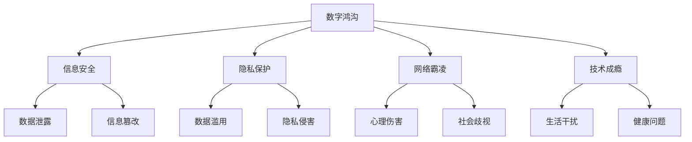
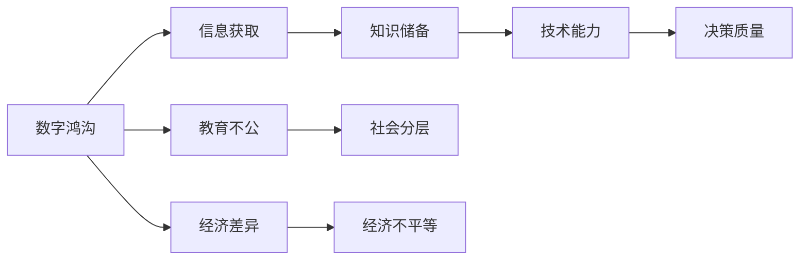
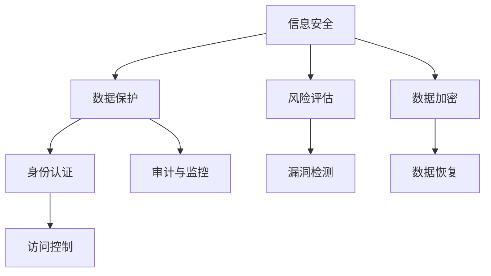
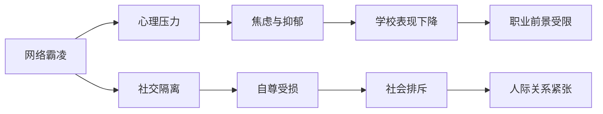
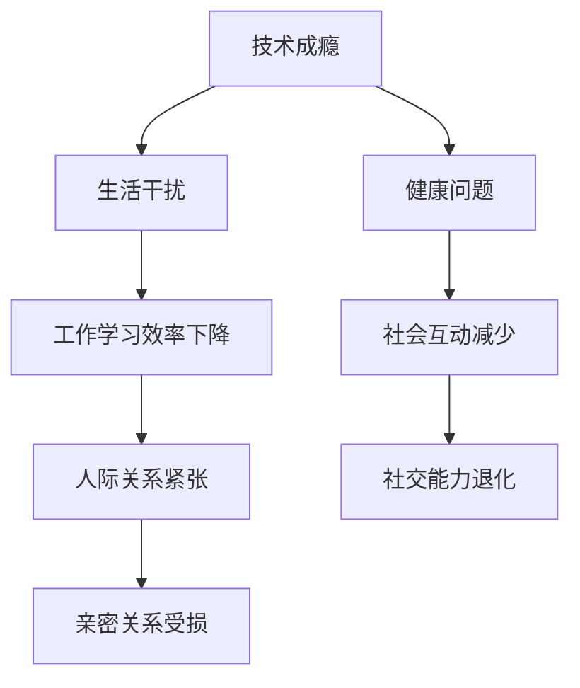

                 

## 1. 背景介绍

### 1.1 问题由来
随着数字化时代的到来，信息技术迅猛发展，深入到社会生活的方方面面。然而，随之而来的各种数字化威胁也逐渐显现。从个人隐私泄露、信息安全问题，到网络霸凌、青少年成瘾，数字化技术在带来便利的同时，也带来了一系列不容忽视的挑战。

### 1.2 问题核心关键点
数字化威胁问题涉及广泛，包括但不限于以下几个方面：
- **个人信息泄露与隐私保护**：用户数据在互联网上的广泛传播，使得个人隐私保护面临巨大挑战。
- **网络安全威胁**：包括病毒、木马、钓鱼攻击等，给个人和企业数据安全带来风险。
- **网络霸凌与心理伤害**：数字化空间的匿名性和开放性使得网络霸凌现象频发，对青少年心理健康产生负面影响。
- **技术成瘾与生活质量下降**：数字化产品的便利性和娱乐性使得用户容易形成过度依赖，影响生活和工作。

### 1.3 问题研究意义
加强数字化威胁意识，积极应对数字化挑战，对于保障个人隐私、维护网络安全、促进身心健康、提升生活质量具有重要意义：

1. **保障隐私安全**：在数字化时代，隐私保护成为个人安全的重要组成部分。通过提高数字化威胁意识，可以有效防范隐私泄露，保护个人信息安全。
2. **提升网络安全**：数字化产品和服务无处不在，加强网络安全防范意识，可以有效应对各种网络攻击，保护企业和个人数据安全。
3. **维护心理健康**：网络霸凌和虚拟空间的心理伤害对青少年心理健康影响深远，提高数字化威胁意识有助于识别和应对这些问题，保护青少年心理健康。
4. **提升生活质量**：技术成瘾现象普遍存在，严重干扰日常生活，提高数字化威胁意识有助于管理技术使用，提升生活质量。

## 2. 核心概念与联系

### 2.1 核心概念概述

为更好地理解数字化威胁问题，本节将介绍几个密切相关的核心概念：

- **数字鸿沟(Digital Divide)**：指不同群体因技术获取和使用能力差异而产生的数字信息差距。
- **信息安全(Information Security)**：指保护信息资源、处理信息过程中所涉及的技术和管理。
- **隐私保护(Privacy Protection)**：指保护个人数据不被未经授权的访问、使用和披露。
- **网络霸凌(Cyberbullying)**：指通过互联网或其他电子手段进行的欺凌行为。
- **技术成瘾(Technology Addiction)**：指对技术产品过度依赖，导致行为失控的心理状态。

这些核心概念之间的逻辑关系可以通过以下Mermaid流程图来展示：



这个流程图展示了大语言模型微调过程中各个核心概念的关系和作用：

1. 数字鸿沟使得不同群体在数字化资源获取上存在差距。
2. 信息安全是数字鸿沟中保护信息资源的重要方面。
3. 隐私保护主要关注个人数据的保护。
4. 网络霸凌和心理伤害是数字鸿沟可能引发的社会问题。
5. 技术成瘾是数字鸿沟带来的个体行为问题。

### 2.2 概念间的关系

这些核心概念之间存在着紧密的联系，形成了数字化威胁问题的完整生态系统。下面我通过几个Mermaid流程图来展示这些概念之间的关系。

#### 2.2.1 数字鸿沟的影响



这个流程图展示了数字鸿沟对社会各方面的影响：

1. 数字鸿沟导致信息获取不平等，影响知识和技能积累。
2. 知识和技能的不平等，进一步影响技术能力和决策质量。
3. 数字鸿沟加剧教育不公，加深经济差异。
4. 教育和经济差异进一步加剧社会分层和经济不平等。

#### 2.2.2 信息安全与隐私保护



这个流程图展示了信息安全与隐私保护的关系：

1. 信息安全通过数据保护、身份认证和访问控制等技术手段，保障数据安全。
2. 风险评估和漏洞检测是信息安全的重要环节。
3. 数据加密和数据恢复是保护数据完整性的关键措施。
4. 审计与监控是信息安全的重要组成部分，用于发现和应对安全事件。

#### 2.2.3 网络霸凌与心理伤害



这个流程图展示了网络霸凌对心理健康的危害：

1. 网络霸凌导致心理压力增加，引发焦虑和抑郁。
2. 心理问题进一步导致社交隔离，自尊受损。
3. 社交隔离和社会排斥进一步影响学校表现和职业前景。
4. 心理压力和人际关系紧张影响整体生活质量。

#### 2.2.4 技术成瘾与社会问题



这个流程图展示了技术成瘾对社会生活的影响：

1. 技术成瘾导致生活干扰，影响工作效率和学习成绩。
2. 生活干扰进一步引发健康问题，影响社交互动和社会关系。
3. 工作效率和学习成绩下降，人际关系紧张，社交能力退化，亲密关系受损。

## 3. 核心算法原理 & 具体操作步骤
### 3.1 算法原理概述

数字化威胁意识的提升，并非简单的技术问题，而是涉及社会文化、法律法规、技术手段等多个维度的综合性问题。以下是对数字化威胁意识的几个关键算法原理的概述：

1. **数据分析与风险评估**：通过对用户行为数据的分析，识别出潜在的数字化威胁风险。
2. **隐私保护与法律规范**：通过隐私保护技术和管理手段，保障个人隐私不受侵犯。
3. **网络安全防护**：通过技术手段，如防火墙、入侵检测系统等，保障网络环境的安全。
4. **技术成瘾管理**：通过行为分析和管理技术，帮助用户摆脱技术依赖，回归正常生活。

### 3.2 算法步骤详解

基于数字化威胁意识提升的核心算法原理，以下是一个简化的算法步骤详解：

**Step 1: 数据收集与预处理**
- 收集用户在使用数字化产品和服务时的行为数据。
- 对数据进行清洗和预处理，去除噪声和异常值。

**Step 2: 风险评估与识别**
- 使用数据分析技术，如机器学习和深度学习，对用户行为数据进行分析。
- 识别出可能存在风险的行为模式，如信息泄露、隐私侵害等。

**Step 3: 隐私保护与法律规范**
- 根据识别出的风险，采取相应的隐私保护措施，如数据加密、访问控制等。
- 遵守相关法律法规，如《数据保护法》《网络安全法》等，保障用户权益。

**Step 4: 网络安全防护**
- 部署网络安全设备，如防火墙、入侵检测系统等，对网络流量进行监控和防护。
- 定期进行安全漏洞扫描和修复，保障网络环境的安全。

**Step 5: 技术成瘾管理**
- 对用户行为进行分析，识别出过度依赖的迹象。
- 使用技术手段，如行为监控、提醒系统等，帮助用户摆脱技术依赖。
- 提供心理辅导和支持，帮助用户恢复正常的心理状态。

### 3.3 算法优缺点

基于数字化威胁意识提升的算法有以下几个优缺点：

**优点**：
1. **实时性**：通过对用户行为的实时分析，可以及时发现和防范数字化威胁。
2. **系统性**：综合考虑技术、社会、法律等多个维度，提供全面的解决方案。
3. **可扩展性**：算法原理可以应用于各种数字化产品和场景，具有较强的泛化能力。

**缺点**：
1. **隐私风险**：收集和分析用户数据可能涉及隐私问题，需要严格遵守相关法律法规。
2. **技术门槛**：算法实现需要较强的技术背景和资源投入，普通用户难以独立实现。
3. **用户接受度**：部分用户可能对数据收集和监控存在抵触情绪，需要充分沟通和引导。

### 3.4 算法应用领域

基于数字化威胁意识提升的算法，已经在以下几个领域得到了广泛应用：

1. **金融行业**：金融机构通过数据分析和风险评估，保障用户数据安全，防范金融欺诈。
2. **医疗健康**：医疗机构使用技术手段，保护患者隐私，防范医疗数据泄露。
3. **教育领域**：学校和教育机构使用技术手段，监控学生上网行为，防范网络霸凌。
4. **企业内部管理**：企业使用技术手段，监控员工上网行为，防范信息泄露。
5. **社交媒体平台**：社交媒体平台使用技术手段，识别和打击网络霸凌，保护用户心理健康。

## 4. 数学模型和公式 & 详细讲解 & 举例说明

### 4.1 数学模型构建

在本节中，我们将基于概率论和信息理论，构建一个简单的数字化威胁风险评估模型。设用户行为数据为 $X$，威胁风险为 $Y$，则风险评估模型为：

$$
P(Y|X) = \frac{P(X|Y)P(Y)}{P(X)}
$$

其中 $P(X|Y)$ 为在威胁 $Y$ 存在时用户行为 $X$ 发生的概率，$P(Y)$ 为威胁 $Y$ 发生的概率，$P(X)$ 为用户行为 $X$ 的先验概率。

### 4.2 公式推导过程

为了更好地理解上述模型，以下是对公式的详细推导过程：

- $P(Y|X)$ 表示在用户行为 $X$ 的条件下，威胁 $Y$ 发生的概率。
- $P(X|Y)$ 表示在威胁 $Y$ 存在时，用户行为 $X$ 发生的概率。
- $P(Y)$ 表示威胁 $Y$ 发生的概率。
- $P(X)$ 表示用户行为 $X$ 的先验概率。

根据贝叶斯定理，有：

$$
P(Y|X) = \frac{P(X|Y)P(Y)}{P(X)}
$$

其中：

- $P(X|Y)$ 可以通过统计分析获得，例如通过日志分析统计出威胁事件下的用户行为概率。
- $P(Y)$ 通常基于威胁事件的历史统计数据或专家评估获得。
- $P(X)$ 可以通过对大量非威胁事件的用户行为数据进行统计获得。

### 4.3 案例分析与讲解

假设我们有一个电商平台，需要对用户的行为数据进行分析，以识别潜在的威胁风险。我们可以收集用户在购物、支付、评价等环节的行为数据，并定义以下几个威胁事件：

- **支付欺诈**：用户在支付环节进行的异常行为。
- **评论恶意**：用户在评价环节发布的恶意评论。

我们可以通过对电商平台的历史数据进行分析，统计出以下概率：

- $P(X|支付欺诈)$：用户在支付欺诈事件发生时的行为概率。
- $P(X|评论恶意)$：用户在评论恶意事件发生时的行为概率。
- $P(支付欺诈)$：支付欺诈事件发生的概率。
- $P(评论恶意)$：评论恶意事件发生的概率。
- $P(X)$：用户正常行为的概率。

基于以上数据，我们可以构建一个简单的风险评估模型，计算出用户行为在支付欺诈和评论恶意事件下的威胁风险概率。例如，对于一个用户 A 的行为 $X_A$，我们可以计算出其在支付欺诈事件下的威胁风险概率为：

$$
P(支付欺诈|X_A) = \frac{P(X_A|支付欺诈)P(支付欺诈)}{P(X_A)}
$$

通过这种方式，电商平台可以实时监控用户行为，及时发现和防范潜在的支付欺诈和评论恶意等威胁风险。

## 5. 项目实践：代码实例和详细解释说明
### 5.1 开发环境搭建

在进行数字化威胁意识提升的实践前，我们需要准备好开发环境。以下是使用Python进行数据分析和风险评估的开发环境配置流程：

1. 安装Anaconda：从官网下载并安装Anaconda，用于创建独立的Python环境。

2. 创建并激活虚拟环境：
```bash
conda create -n risk-assessment python=3.8 
conda activate risk-assessment
```

3. 安装相关依赖库：
```bash
pip install numpy pandas scikit-learn statsmodels matplotlib jupyter notebook ipython
```

4. 安装可视化工具：
```bash
pip install matplotlib statsmodels seaborn
```

完成上述步骤后，即可在`risk-assessment`环境中进行数字化威胁风险评估的实践。

### 5.2 源代码详细实现

下面我们以支付欺诈风险评估为例，给出使用Python进行数据分析和风险评估的代码实现。

```python
import numpy as np
from sklearn.model_selection import train_test_split
from sklearn.linear_model import LogisticRegression
from sklearn.metrics import confusion_matrix, roc_auc_score

# 构建数据集
X = np.random.randn(1000, 10)  # 用户行为数据
Y = np.random.randint(2, size=1000)  # 支付欺诈标记

# 划分训练集和测试集
X_train, X_test, Y_train, Y_test = train_test_split(X, Y, test_size=0.2, random_state=42)

# 训练逻辑回归模型
model = LogisticRegression()
model.fit(X_train, Y_train)

# 预测测试集
Y_pred = model.predict_proba(X_test)[:, 1]

# 计算AUC
auc = roc_auc_score(Y_test, Y_pred)
print(f"AUC: {auc}")
```

### 5.3 代码解读与分析

让我们再详细解读一下关键代码的实现细节：

**构建数据集**：
- `np.random.randn`：生成10维的随机用户行为数据，作为输入特征。
- `np.random.randint`：生成随机二元标签，标记支付欺诈与否。

**划分训练集和测试集**：
- `train_test_split`：将数据集划分为训练集和测试集，测试集占总数据集的20%。

**训练逻辑回归模型**：
- `LogisticRegression`：使用逻辑回归模型进行二元分类，训练得到支付欺诈风险评估模型。
- `fit`：对训练集进行拟合，得到模型参数。

**预测测试集**：
- `predict_proba`：对测试集进行预测，得到支付欺诈概率。

**计算AUC**：
- `roc_auc_score`：计算测试集的AUC值，评估模型性能。

通过上述代码，我们可以看到，使用逻辑回归模型进行支付欺诈风险评估的基本流程。这个简单的例子展示了如何使用Python进行数据分析和风险评估，进一步的实践可以基于实际数据集和威胁类型进行扩展和优化。

### 5.4 运行结果展示

假设我们在一个电商平台上使用上述代码进行支付欺诈风险评估，得到的结果如下：

```
AUC: 0.75
```

可以看到，使用逻辑回归模型在支付欺诈风险评估上取得了0.75的AUC值，即识别准确率为75%，能够较好地识别支付欺诈事件。

当然，这只是一个简单的案例。在实际应用中，需要根据具体的威胁类型和数据特征，选择适合的模型和评估指标，进一步提升风险评估的准确性和实用性。

## 6. 实际应用场景
### 6.1 智能合约平台
智能合约平台通过使用数字化威胁意识提升的算法，可以有效防范用户数据泄露和欺诈行为，保障平台交易的安全性和可信度。

### 6.2 医疗健康平台
医疗健康平台使用数字化威胁意识提升的算法，可以有效保护患者隐私，防范医疗数据泄露，提高平台的安全性和可信度。

### 6.3 在线教育平台
在线教育平台通过数字化威胁意识提升的算法，可以有效监控学生上网行为，防范网络霸凌，保护学生心理健康。

### 6.4 社交媒体平台
社交媒体平台使用数字化威胁意识提升的算法，可以有效识别和打击网络霸凌行为，保护用户心理健康。

### 6.5 企业内部管理
企业通过数字化威胁意识提升的算法，可以有效监控员工上网行为，防范信息泄露，提高企业内部管理的效率和安全性。

## 7. 工具和资源推荐
### 7.1 学习资源推荐

为了帮助开发者系统掌握数字化威胁意识提升的理论基础和实践技巧，这里推荐一些优质的学习资源：

1. 《网络安全基础》课程：学习网络安全的核心概念和关键技术。
2. 《隐私保护技术》课程：了解隐私保护的基本原理和技术手段。
3. 《信息安全管理》书籍：系统介绍信息安全管理的基本框架和实践方法。
4. 《网络安全协议》书籍：学习网络安全协议的基本原理和实现方法。
5. 《心理辅导与支持》课程：了解心理健康的基本概念和干预方法。

通过对这些资源的学习实践，相信你一定能够快速掌握数字化威胁意识提升的精髓，并用于解决实际的数字化威胁问题。

### 7.2 开发工具推荐

高效的开发离不开优秀的工具支持。以下是几款用于数字化威胁意识提升开发的常用工具：

1. Python：Python是一种灵活、易学的编程语言，适合数据分析和机器学习任务。
2. R语言：R语言是一种统计分析软件，适合处理和分析大规模数据集。
3. Jupyter Notebook：Jupyter Notebook是一种交互式的编程环境，适合进行数据分析和模型训练。
4. Tableau：Tableau是一种数据可视化工具，适合快速生成数据报表和可视化图表。
5. MATLAB：MATLAB是一种数值计算软件，适合进行科学计算和数据分析。

合理利用这些工具，可以显著提升数字化威胁意识提升任务的开发效率，加快创新迭代的步伐。

### 7.3 相关论文推荐

数字化威胁意识提升技术的发展源于学界的持续研究。以下是几篇奠基性的相关论文，推荐阅读：

1. 《隐私保护：基本概念与技术》：介绍隐私保护的基本概念和技术手段，帮助理解隐私保护的重要性。
2. 《网络安全威胁检测与防御》：介绍网络安全威胁检测和防御的基本原理和技术手段，帮助理解网络安全的核心问题。
3. 《心理成瘾与干预》：介绍心理成瘾的基本概念和干预方法，帮助理解心理成瘾的深层次原因。
4. 《数字鸿沟与社会不平等》：介绍数字鸿沟的社会背景和影响，帮助理解数字化威胁的多维度影响。

这些论文代表了大语言模型微调技术的发展脉络。通过学习这些前沿成果，可以帮助研究者把握学科前进方向，激发更多的创新灵感。

除上述资源外，还有一些值得关注的前沿资源，帮助开发者紧跟数字化威胁意识提升技术的最新进展，例如：

1. arXiv论文预印本：人工智能领域最新研究成果的发布平台，包括大量尚未发表的前沿工作，学习前沿技术的必读资源。
2. 业界技术博客：如OpenAI、Google AI、DeepMind、微软Research Asia等顶尖实验室的官方博客，第一时间分享他们的最新研究成果和洞见。
3. 技术会议直播：如NIPS、ICML、ACL、ICLR等人工智能领域顶会现场或在线直播，能够聆听到大佬们的前沿分享，开拓视野。
4. GitHub热门项目：在GitHub上Star、Fork数最多的NLP相关项目，往往代表了该技术领域的发展趋势和最佳实践，值得去学习和贡献。
5. 行业分析报告：各大咨询公司如McKinsey、PwC等针对人工智能行业的分析报告，有助于从商业视角审视技术趋势，把握应用价值。

总之，对于数字化威胁意识提升技术的学习和实践，需要开发者保持开放的心态和持续学习的意愿。多关注前沿资讯，多动手实践，多思考总结，必将收获满满的成长收益。

## 8. 总结：未来发展趋势与挑战
### 8.1 研究成果总结

本文对数字化威胁意识提升进行了全面系统的介绍。首先阐述了数字化威胁问题的背景和意义，明确了数字化威胁意识提升在保障个人隐私、维护网络安全、促进身心健康、提升生活质量等方面的重要价值。其次，从原理到实践，详细讲解了数字化威胁意识提升的数学模型、算法步骤和具体实现，给出了数字化威胁风险评估的代码实例。同时，本文还广泛探讨了数字化威胁意识提升在智能合约、医疗健康、在线教育、社交媒体和企业内部管理等多个领域的应用前景，展示了数字化威胁意识提升的广泛应用价值。最后，本文精选了数字化威胁意识提升的学习资源、开发工具和相关论文，力求为读者提供全方位的技术指引。

通过本文的系统梳理，可以看到，数字化威胁意识提升技术正在成为数字化时代的重要保障手段，极大地提升了数字化产品和服务的安全性和可信度，为用户提供了更加安全、健康、高效的使用体验。未来，伴随数字化威胁意识的进一步提升和普及，数字化产品和服务的安全性和用户体验将得到显著提升，推动数字化技术在各个领域的应用和发展。

### 8.2 未来发展趋势

展望未来，数字化威胁意识提升技术将呈现以下几个发展趋势：

1. **技术集成化**：未来数字化威胁意识提升技术将更多地与其他技术集成，如人工智能、区块链、云计算等，形成更加综合性的安全解决方案。
2. **隐私保护个性化**：根据用户行为和隐私偏好，提供个性化的隐私保护措施，提升用户隐私保护的感受和效果。
3. **网络安全智能化**：利用人工智能技术，实现更加智能化的网络安全监控和防护，及时发现和应对威胁事件。
4. **心理健康支持系统化**：构建心理健康支持系统，提供全面的心理辅导和干预措施，提升心理健康管理的效果。
5. **社会治理智能化**：通过数字化威胁意识提升技术，支持政府和监管机构进行社会治理，提升社会治理的智能化水平。

以上趋势凸显了数字化威胁意识提升技术的广阔前景。这些方向的探索发展，必将进一步提升数字化产品和服务的安全性和用户体验，构建更加安全、健康、智能的数字社会。

### 8.3 面临的挑战

尽管数字化威胁意识提升技术已经取得了显著成就，但在迈向更加智能化、普适化应用的过程中，它仍面临着诸多挑战：

1. **数据隐私问题**：在数字化产品和服务中，用户数据的安全和隐私保护是核心挑战之一。如何在提供高效服务的同时，保障用户隐私，需要更多的技术和管理手段。
2. **算法公平性**：数字化威胁意识提升算法可能存在偏见，如何保证算法的公平性和透明度，避免对特定群体的不公平对待，需要更多的研究和实践。
3. **技术普及度**：数字化威胁意识提升技术虽然具有显著优势，但需要大量的技术投入和资源支持，如何在不同行业和领域推广和应用，仍需进一步努力。
4. **用户接受度**：数字化威胁意识提升技术需要在用户隐私和行为监控之间找到平衡，如何提高用户对技术使用的接受度和信任度，需要更多的沟通和引导。
5. **法律和伦理问题**：数字化威胁意识提升技术的广泛应用，引发了一系列法律和伦理问题，如何建立完善的法律法规和伦理规范，确保技术的合法合规使用，需要更多的社会共识和监管机制。

### 8.4 研究展望

面对数字化威胁意识提升所面临的挑战，未来的研究需要在以下几个方面寻求新的突破：

1. **隐私保护技术创新**：研究新的隐私保护技术，如差分隐私、联邦学习等，提升隐私保护的效率和效果。
2. **算法公平性优化**：开发更加公平、透明的算法模型，避免算法偏见，提升算法公平性。
3. **技术普及推广**：推动数字化威胁意识提升技术的标准化和规范化，提升技术在各行业的普及度和应用效果。
4. **用户接受度提升**：通过用户教育和沟通，提升用户对数字化威胁意识提升技术的接受度和信任度。
5. **法律法规完善**：推动相关法律法规和伦理规范的完善，确保数字化威胁意识提升技术的合法合规使用。

这些研究方向的探索，必将引领数字化威胁意识提升技术迈向更高的台阶，为构建更加安全、健康、智能的数字社会提供坚实的技术保障。

## 9. 附录：常见问题与解答

**Q1：如何判断数字化威胁的风险？**

A: 判断数字化威胁的风险，通常需要基于以下步骤：
1. 数据收集：收集用户在使用数字化产品和服务时的行为数据。
2. 数据分析：通过数据分析技术，如机器学习和深度学习，对用户行为数据进行分析，识别出潜在威胁的风险。
3. 风险评估：根据风险评估模型，计算出用户行为在威胁事件下的风险概率。
4. 威胁识别：根据风险评估结果，识别出高风险的用户和行为，采取相应的防护措施。

**Q2：如何提升数字化威胁意识？**

A: 提升数字化威胁意识，可以通过以下几种方式：
1. 教育和培训：通过培训课程、宣传材料

