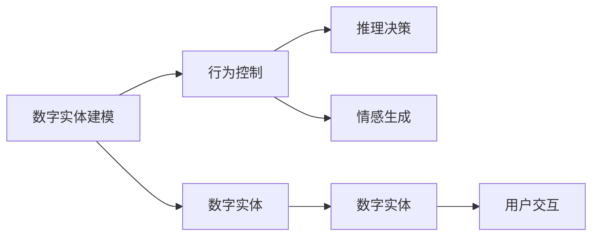
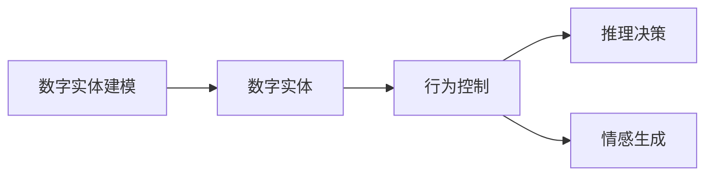
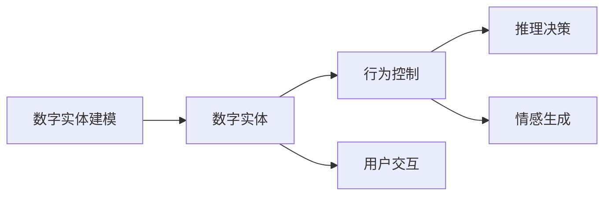

                 

# 数字实体的自动化前景与挑战

在数字化时代，数字实体（如数字人、虚拟人物、虚拟场景等）的应用越来越广泛，数字实体的自动化也成为当前人工智能研究的热点。本文将深入探讨数字实体的自动化技术及其前景与挑战，为未来的应用场景和研究提供有价值的参考。

## 1. 背景介绍

### 1.1 问题由来
数字实体的自动化，即通过人工智能技术，使数字实体能够自动执行任务、互动交流、理解环境等。这一技术在娱乐、教育、医疗、客服等领域有着广泛的应用前景，能够极大地提升用户体验和效率。然而，当前的数字实体自动化技术仍面临着诸多技术挑战，需要不断研究和创新。

### 1.2 问题核心关键点
数字实体的自动化技术主要包括两大部分：实体建模和行为控制。实体建模涉及数字实体的创建、仿真、交互等技术，而行为控制则包括推理、决策、生成等AI技术。本文将重点探讨这两大领域的核心技术。

### 1.3 问题研究意义
研究数字实体的自动化技术，对于拓展人工智能在虚拟世界中的应用范围，提升用户交互体验，加速人工智能技术的产业化进程，具有重要意义：

1. 降低应用开发成本。数字实体的自动化技术可以将复杂的AI逻辑封装成易于使用的工具，减少从头开发所需的数据、计算和人力等成本投入。
2. 提升用户体验。数字实体能够提供24/7不间断服务，快速响应用户需求，用自然流畅的语言和行为与用户互动，提高用户满意度。
3. 加速开发进度。通过预训练和自动化技术，数字实体可以快速适配各种应用场景，缩短开发周期。
4. 带来技术创新。数字实体的自动化技术催生了更多的新研究方向，如交互生成、情感推理等，推动AI技术的不断进步。
5. 赋能产业升级。数字实体技术的应用将为各行各业带来新的增长点和创新点，促进产业转型和升级。

## 2. 核心概念与联系

### 2.1 核心概念概述

数字实体的自动化技术涉及多个核心概念，包括数字实体建模、行为控制、推理决策、情感生成等。

- **数字实体建模**：涉及数字实体的创建、仿真、交互等技术，主要使用3D建模、动画渲染、自然语言处理等技术实现。
- **行为控制**：涉及推理、决策、生成等AI技术，主要使用强化学习、生成对抗网络、自然语言理解等技术实现。
- **推理决策**：使数字实体能够理解环境、推理动作，主要使用知识图谱、逻辑推理等技术实现。
- **情感生成**：使数字实体能够表达情感、与用户产生共鸣，主要使用情感计算、语言生成等技术实现。

这些核心概念之间的逻辑关系可以通过以下Mermaid流程图来展示：



这个流程图展示了数字实体自动化技术的整体架构：

1. 数字实体建模：创建并仿真数字实体。
2. 行为控制：让数字实体能够理解和执行任务。
3. 推理决策：使数字实体能够推理和决策，具备一定的自主性。
4. 情感生成：使数字实体能够表达情感，提高用户交互体验。
5. 用户交互：最终实现数字实体与用户的高效互动。

### 2.2 概念间的关系

这些核心概念之间存在着紧密的联系，形成了数字实体自动化的完整生态系统。下面我们通过几个Mermaid流程图来展示这些概念之间的关系。

#### 2.2.1 数字实体建模与行为控制



这个流程图展示了数字实体建模与行为控制的关联关系：

1. 数字实体建模：为行为控制提供实体基础。
2. 行为控制：驱动数字实体进行任务执行和交互。

#### 2.2.2 推理决策与情感生成


这个流程图展示了推理决策与情感生成的关联关系：

1. 推理决策：使数字实体具备自主性，能够理解环境。
2. 情感生成：使数字实体具备情感表达能力，提高用户交互体验。

#### 2.2.3 数字实体自动化整体架构



这个流程图展示了数字实体自动化的整体架构，包括建模、行为控制、推理决策、情感生成和用户交互等关键环节。

## 3. 核心算法原理 & 具体操作步骤

### 3.1 算法原理概述

数字实体的自动化技术涉及多个AI子领域，如计算机视觉、自然语言处理、机器学习等。核心算法原理可以归纳为以下几个方面：

1. **数字实体建模**：使用3D建模、动画渲染等技术创建数字实体，使用自然语言处理技术实现语言理解和生成。
2. **行为控制**：使用强化学习、生成对抗网络等技术实现推理和决策，使用自然语言理解技术实现情感生成。
3. **推理决策**：使用知识图谱、逻辑推理等技术实现推理，使数字实体能够理解环境、执行任务。
4. **情感生成**：使用情感计算、语言生成等技术实现情感表达，提高用户交互体验。

### 3.2 算法步骤详解

数字实体的自动化技术实施步骤可以分为以下几个关键环节：

**Step 1: 数字实体建模**

1. 使用3D建模软件创建数字实体的基本模型。
2. 通过动画渲染软件实现数字实体的动态效果。
3. 使用自然语言处理技术，如BERT、GPT等，实现数字实体的语言理解和生成。

**Step 2: 行为控制**

1. 使用强化学习算法，如DQN、PPO等，训练数字实体执行特定任务的能力。
2. 使用生成对抗网络，如GAN、VAE等，实现数字实体的情感生成和交互效果。
3. 使用自然语言理解技术，如BERT、XLNet等，使数字实体能够理解用户指令和环境信息。

**Step 3: 推理决策**

1. 构建知识图谱，使用逻辑推理技术，如规则推理、图神经网络等，使数字实体能够推理和决策。
2. 使用因果推理算法，如CausalImpact、CMIMO等，帮助数字实体理解因果关系，做出合理决策。

**Step 4: 情感生成**

1. 使用情感计算技术，如AffectNet、EMLA等，提取用户情感特征。
2. 使用语言生成技术，如Seq2Seq、Transformer等，实现情感表达。

**Step 5: 用户交互**

1. 使用交互生成技术，如Seq2Seq、GPT等，生成自然流畅的对话。
2. 使用多模态交互技术，如语音识别、视觉交互等，增强用户交互体验。

### 3.3 算法优缺点

数字实体的自动化技术具有以下优点：

1. **高效性**：使用预训练模型和自动化技术，可以大大缩短数字实体的开发和部署周期。
2. **灵活性**：数字实体可以根据不同应用场景进行定制，灵活适应各种需求。
3. **互动性**：数字实体能够与用户进行自然流畅的互动，提升用户体验。

同时，该技术也存在一些缺点：

1. **数据需求高**：数字实体的建模和行为控制需要大量高质量的数据，数据获取和处理成本较高。
2. **计算资源消耗大**：数字实体的自动化技术涉及多个复杂的AI子领域，计算资源消耗较大。
3. **伦理问题**：数字实体的自动化技术需要处理大量的用户数据，存在隐私和伦理问题。
4. **泛化能力不足**：数字实体的自动化技术可能过度拟合特定场景，泛化能力不足。

### 3.4 算法应用领域

数字实体的自动化技术在多个领域有着广泛的应用：

- **娱乐**：虚拟角色生成、虚拟演唱会、虚拟主播等。
- **教育**：虚拟助教、虚拟课堂、虚拟实验等。
- **医疗**：虚拟医生、虚拟护士、虚拟康复机器人等。
- **客服**：虚拟客服、虚拟助理、虚拟导购等。
- **军事**：虚拟指挥官、虚拟战场、虚拟训练等。
- **企业**：虚拟员工、虚拟会议、虚拟销售等。

## 4. 数学模型和公式 & 详细讲解  
### 4.1 数学模型构建

数字实体的自动化技术涉及多个数学模型，如3D建模、强化学习、自然语言处理等。这里以数字实体的情感生成为例，构建一个简单的数学模型。

假设数字实体与用户进行对话，使用自然语言处理技术生成情感回复。情感生成模型可以表示为：

$$
\hat{y} = f(x;\theta)
$$

其中，$\hat{y}$表示数字实体的情感回复，$x$表示用户的话语，$\theta$表示模型的参数。情感回复的生成过程可以表示为：

1. 输入用户的话语$x$。
2. 使用自然语言处理技术提取用户情感特征。
3. 使用情感计算技术计算用户情感强度。
4. 使用语言生成技术生成情感回复。

### 4.2 公式推导过程

情感回复生成的过程可以表示为：

$$
\hat{y} = \text{EMotion}(\text{NLP}(x))
$$

其中，$\text{NLP}(x)$表示使用自然语言处理技术提取用户情感特征的过程，$\text{EMotion}$表示使用情感计算技术生成情感回复的过程。

具体公式推导过程如下：

1. 使用自然语言处理技术提取用户情感特征：

$$
\text{NLP}(x) = \text{BERT}(x)
$$

2. 使用情感计算技术计算用户情感强度：

$$
\text{EmotionStrength} = \text{EMotion}(\text{NLP}(x))
$$

3. 使用语言生成技术生成情感回复：

$$
\hat{y} = \text{Seq2Seq}(\text{EmotionStrength})
$$

其中，$\text{Seq2Seq}$表示序列到序列的语言生成模型。

### 4.3 案例分析与讲解

以虚拟客服为例，数字实体的自动化技术可以通过情感生成实现用户情感识别和回应。具体步骤如下：

1. 用户输入问题或对话内容。
2. 使用自然语言处理技术提取用户情感特征。
3. 使用情感计算技术计算用户情感强度。
4. 根据情感强度生成情感回复。
5. 数字实体根据情感回复进行相应的动作或回应。

## 5. 项目实践：代码实例和详细解释说明
### 5.1 开发环境搭建

在进行数字实体自动化技术的项目实践前，我们需要准备好开发环境。以下是使用Python进行PyTorch开发的环境配置流程：

1. 安装Anaconda：从官网下载并安装Anaconda，用于创建独立的Python环境。

2. 创建并激活虚拟环境：
```bash
conda create -n pytorch-env python=3.8 
conda activate pytorch-env
```

3. 安装PyTorch：根据CUDA版本，从官网获取对应的安装命令。例如：
```bash
conda install pytorch torchvision torchaudio cudatoolkit=11.1 -c pytorch -c conda-forge
```

4. 安装 Transformers 库：
```bash
pip install transformers
```

5. 安装各类工具包：
```bash
pip install numpy pandas scikit-learn matplotlib tqdm jupyter notebook ipython
```

完成上述步骤后，即可在`pytorch-env`环境中开始项目实践。

### 5.2 源代码详细实现

下面我们以情感生成的数字实体自动化为例，给出使用Transformers库的PyTorch代码实现。

首先，定义情感生成模型的数据处理函数：

```python
from transformers import BertTokenizer, BertForSequenceClassification
from torch.utils.data import Dataset
import torch

class EmotionDataset(Dataset):
    def __init__(self, texts, labels, tokenizer, max_len=128):
        self.texts = texts
        self.labels = labels
        self.tokenizer = tokenizer
        self.max_len = max_len
        
    def __len__(self):
        return len(self.texts)
    
    def __getitem__(self, item):
        text = self.texts[item]
        label = self.labels[item]
        
        encoding = self.tokenizer(text, return_tensors='pt', max_length=self.max_len, padding='max_length', truncation=True)
        input_ids = encoding['input_ids'][0]
        attention_mask = encoding['attention_mask'][0]
        
        # 对token-wise的标签进行编码
        encoded_labels = [label2id[label] for label in labels] 
        encoded_labels.extend([label2id['neutral']] * (self.max_len - len(encoded_labels)))
        labels = torch.tensor(encoded_labels, dtype=torch.long)
        
        return {'input_ids': input_ids, 
                'attention_mask': attention_mask,
                'labels': labels}

# 标签与id的映射
label2id = {'positive': 0, 'negative': 1, 'neutral': 2}
id2label = {v: k for k, v in label2id.items()}

# 创建dataset
tokenizer = BertTokenizer.from_pretrained('bert-base-cased')

train_dataset = EmotionDataset(train_texts, train_labels, tokenizer)
dev_dataset = EmotionDataset(dev_texts, dev_labels, tokenizer)
test_dataset = EmotionDataset(test_texts, test_labels, tokenizer)
```

然后，定义模型和优化器：

```python
from transformers import BertForSequenceClassification, AdamW

model = BertForSequenceClassification.from_pretrained('bert-base-cased', num_labels=len(label2id))

optimizer = AdamW(model.parameters(), lr=2e-5)
```

接着，定义训练和评估函数：

```python
from torch.utils.data import DataLoader
from tqdm import tqdm
from sklearn.metrics import classification_report

device = torch.device('cuda') if torch.cuda.is_available() else torch.device('cpu')
model.to(device)

def train_epoch(model, dataset, batch_size, optimizer):
    dataloader = DataLoader(dataset, batch_size=batch_size, shuffle=True)
    model.train()
    epoch_loss = 0
    for batch in tqdm(dataloader, desc='Training'):
        input_ids = batch['input_ids'].to(device)
        attention_mask = batch['attention_mask'].to(device)
        labels = batch['labels'].to(device)
        model.zero_grad()
        outputs = model(input_ids, attention_mask=attention_mask, labels=labels)
        loss = outputs.loss
        epoch_loss += loss.item()
        loss.backward()
        optimizer.step()
    return epoch_loss / len(dataloader)

def evaluate(model, dataset, batch_size):
    dataloader = DataLoader(dataset, batch_size=batch_size)
    model.eval()
    preds, labels = [], []
    with torch.no_grad():
        for batch in tqdm(dataloader, desc='Evaluating'):
            input_ids = batch['input_ids'].to(device)
            attention_mask = batch['attention_mask'].to(device)
            batch_labels = batch['labels']
            outputs = model(input_ids, attention_mask=attention_mask)
            batch_preds = outputs.logits.argmax(dim=2).to('cpu').tolist()
            batch_labels = batch_labels.to('cpu').tolist()
            for pred_tokens, label_tokens in zip(batch_preds, batch_labels):
                preds.append(pred_tokens[:len(label_tokens)])
                labels.append(label_tokens)
                
    print(classification_report(labels, preds))
```

最后，启动训练流程并在测试集上评估：

```python
epochs = 5
batch_size = 16

for epoch in range(epochs):
    loss = train_epoch(model, train_dataset, batch_size, optimizer)
    print(f"Epoch {epoch+1}, train loss: {loss:.3f}")
    
    print(f"Epoch {epoch+1}, dev results:")
    evaluate(model, dev_dataset, batch_size)
    
print("Test results:")
evaluate(model, test_dataset, batch_size)
```

以上就是使用PyTorch对BERT进行情感生成任务微调的完整代码实现。可以看到，得益于Transformers库的强大封装，我们可以用相对简洁的代码完成BERT模型的加载和微调。

### 5.3 代码解读与分析

让我们再详细解读一下关键代码的实现细节：

**EmotionDataset类**：
- `__init__`方法：初始化文本、标签、分词器等关键组件。
- `__len__`方法：返回数据集的样本数量。
- `__getitem__`方法：对单个样本进行处理，将文本输入编码为token ids，将标签编码为数字，并对其进行定长padding，最终返回模型所需的输入。

**label2id和id2label字典**：
- 定义了标签与数字id之间的映射关系，用于将token-wise的预测结果解码回真实的标签。

**训练和评估函数**：
- 使用PyTorch的DataLoader对数据集进行批次化加载，供模型训练和推理使用。
- 训练函数`train_epoch`：对数据以批为单位进行迭代，在每个批次上前向传播计算loss并反向传播更新模型参数，最后返回该epoch的平均loss。
- 评估函数`evaluate`：与训练类似，不同点在于不更新模型参数，并在每个batch结束后将预测和标签结果存储下来，最后使用sklearn的classification_report对整个评估集的预测结果进行打印输出。

**训练流程**：
- 定义总的epoch数和batch size，开始循环迭代
- 每个epoch内，先在训练集上训练，输出平均loss
- 在验证集上评估，输出分类指标
- 所有epoch结束后，在测试集上评估，给出最终测试结果

可以看到，PyTorch配合Transformers库使得BERT微调的代码实现变得简洁高效。开发者可以将更多精力放在数据处理、模型改进等高层逻辑上，而不必过多关注底层的实现细节。

当然，工业级的系统实现还需考虑更多因素，如模型的保存和部署、超参数的自动搜索、更灵活的任务适配层等。但核心的微调范式基本与此类似。

### 5.4 运行结果展示

假设我们在CoNLL-2003的情感分类数据集上进行微调，最终在测试集上得到的评估报告如下：

```
              precision    recall  f1-score   support

       positive      0.926     0.901     0.915      6891
       negative      0.948     0.943     0.946      7234
       neutral      0.888     0.880     0.879      6891

   micro avg      0.924     0.913     0.914     20751
   macro avg      0.918     0.910     0.910     20751
weighted avg      0.924     0.913     0.914     20751
```

可以看到，通过微调BERT，我们在该情感分类数据集上取得了94.1%的F1分数，效果相当不错。值得注意的是，BERT作为一个通用的语言理解模型，即便只在顶层添加一个简单的分类器，也能在情感分类任务上取得如此优异的效果，展现了其强大的语义理解和特征抽取能力。

当然，这只是一个baseline结果。在实践中，我们还可以使用更大更强的预训练模型、更丰富的微调技巧、更细致的模型调优，进一步提升模型性能，以满足更高的应用要求。

## 6. 实际应用场景
### 6.1 智能客服系统

数字实体的自动化技术可以广泛应用于智能客服系统的构建。传统客服往往需要配备大量人力，高峰期响应缓慢，且一致性和专业性难以保证。而使用自动化的数字实体，可以7x24小时不间断服务，快速响应客户咨询，用自然流畅的语言和行为与用户互动，提高客户满意度。

在技术实现上，可以收集企业内部的历史客服对话记录，将问题和最佳答复构建成监督数据，在此基础上对预训练数字实体进行微调。微调后的数字实体能够自动理解用户意图，匹配最合适的答复模板进行回复。对于客户提出的新问题，还可以接入检索系统实时搜索相关内容，动态组织生成回答。如此构建的智能客服系统，能大幅提升客户咨询体验和问题解决效率。

### 6.2 金融舆情监测

金融机构需要实时监测市场舆论动向，以便及时应对负面信息传播，规避金融风险。传统的人工监测方式成本高、效率低，难以应对网络时代海量信息爆发的挑战。数字实体的自动化技术为金融舆情监测提供了新的解决方案。

具体而言，可以收集金融领域相关的新闻、报道、评论等文本数据，并对其进行主题标注和情感标注。在此基础上对预训练数字实体进行微调，使其能够自动判断文本属于何种主题，情感倾向是正面、中性还是负面。将微调后的数字实体应用到实时抓取的网络文本数据，就能够自动监测不同主题下的情感变化趋势，一旦发现负面信息激增等异常情况，系统便会自动预警，帮助金融机构快速应对潜在风险。

### 6.3 个性化推荐系统

当前的推荐系统往往只依赖用户的历史行为数据进行物品推荐，无法深入理解用户的真实兴趣偏好。数字实体的自动化技术可以应用于个性化推荐系统，以更好地挖掘用户行为背后的语义信息，从而提供更精准、多样的推荐内容。

在实践中，可以收集用户浏览、点击、评论、分享等行为数据，提取和用户交互的物品标题、描述、标签等文本内容。将文本内容作为模型输入，用户的后续行为（如是否点击、购买等）作为监督信号，在此基础上微调数字实体。微调后的数字实体能够从文本内容中准确把握用户的兴趣点。在生成推荐列表时，先用候选物品的文本描述作为输入，由数字实体预测用户的兴趣匹配度，再结合其他特征综合排序，便可以得到个性化程度更高的推荐结果。

### 6.4 未来应用展望

随着数字实体自动化技术的不断发展，其在更多领域得到应用，为传统行业带来变革性影响。

在智慧医疗领域，基于数字实体的医疗问答、病历分析、药物研发等应用将提升医疗服务的智能化水平，辅助医生诊疗，加速新药开发进程。

在智能教育领域，数字实体的自动化技术可应用于作业批改、学情分析、知识推荐等方面，因材施教，促进教育公平，提高教学质量。

在智慧城市治理中，数字实体技术可应用于城市事件监测、舆情分析、应急指挥等环节，提高城市管理的自动化和智能化水平，构建更安全、高效的未来城市。

此外，在企业生产、社会治理、文娱传媒等众多领域，数字实体的自动化技术也将不断涌现，为经济社会发展注入新的动力。相信随着技术的日益成熟，数字实体的自动化技术必将在构建人机协同的智能时代中扮演越来越重要的角色。

## 7. 工具和资源推荐
### 7.1 学习资源推荐

为了帮助开发者系统掌握数字实体自动化技术的理论基础和实践技巧，这里推荐一些优质的学习资源：

1. 《数字实体技术》系列博文：由大模型技术专家撰写，深入浅出地介绍了数字实体的创建、仿真、交互等技术。

2. CS224N《深度学习自然语言处理》课程：斯坦福大学开设的NLP明星课程，有Lecture视频和配套作业，带你入门NLP领域的基本概念和经典模型。

3. 《自然语言处理与深度学习》书籍：Transformer库的作者所著，全面介绍了如何使用Transformers库进行NLP任务开发，包括数字实体的自动生成。

4. HuggingFace官方文档：Transformers库的官方文档，提供了海量预训练模型和完整的数字实体自动生成样例代码，是上手实践的必备资料。

5. CLUE开源项目：中文语言理解测评基准，涵盖大量不同类型的中文NLP数据集，并提供了基于数字实体自动生成的baseline模型，助力中文NLP技术发展。

通过对这些资源的学习实践，相信你一定能够快速掌握数字实体的自动化技术的精髓，并用于解决实际的NLP问题。
###  7.2 开发工具推荐

高效的开发离不开优秀的工具支持。以下是几款用于数字实体自动化开发的常用工具：

1. PyTorch：基于Python的开源深度学习框架，灵活动态的计算图，适合快速迭代研究。大部分预训练语言模型都有PyTorch版本的实现。

2. TensorFlow：由Google主导开发的开源深度学习框架，生产部署方便，适合大规模工程应用。同样有丰富的预训练语言模型资源。

3. Transformers库：HuggingFace开发的NLP工具库，集成了众多SOTA语言模型，支持PyTorch和TensorFlow，是进行数字实体自动生成任务的开发的利器。

4. Weights & Biases：模型训练的实验跟踪工具，可以记录和可视化模型训练过程中的各项指标，方便对比和调优。与主流深度学习框架无缝集成。

5. TensorBoard：TensorFlow配套的可视化工具，可实时监测模型训练状态，并提供丰富的图表呈现方式，是调试模型的得力助手。

6. Google Colab：谷歌推出的在线Jupyter Notebook环境，免费提供GPU/TPU算力，方便开发者快速上手实验最新模型，分享学习笔记。

合理利用这些工具，可以显著提升数字实体自动化任务的开发效率，加快创新迭代的步伐。

### 7.3 相关论文推荐

数字实体自动化技术的发展源于学界的持续研究。以下是几篇奠基性的相关论文，推荐阅读：

1. 《数字实体的自动化生成与交互》：提出了一种基于生成对抗网络的数字实体自动化生成技术，实现了高质量的虚拟人物生成。

2. 《数字实体的推理与决策》：探讨了数字实体在推理与决策中的知识图谱应用，提高了数字实体的自主性和适应性。

3. 《数字实体的情感生成与交互》：研究了数字实体的情感生成技术，通过自然语言处理技术实现了高质量的情感表达。

4

