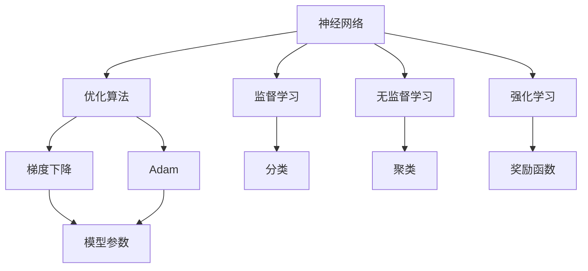

                 

## 1. 背景介绍

在人工智能(AI)领域，数学是构建算法的基石。从神经网络到优化算法，从机器学习到数据科学，数学无处不在。尽管AI的许多进展看起来是“黑盒”技术，但背后都有深刻的数学原理和算法支持。本文将深入探讨数学在AI中的重要性，涵盖神经网络、优化算法、机器学习等多个核心领域的数学基础。

## 2. 核心概念与联系

### 2.1 核心概念概述

为了更好地理解数学在AI中的应用，本节将介绍几个关键概念及其相互联系。

- **神经网络(Neural Networks)**：一种通过多层非线性变换逼近复杂函数的结构。其核心在于连接权重和激活函数，使得神经网络能够学习任意复杂的输入输出映射。
- **优化算法(Optimization Algorithms)**：用于寻找目标函数的最优解，如梯度下降、Adam等。通过不断迭代更新参数，优化算法能够在高维空间中快速搜索最优解。
- **机器学习(Machine Learning)**：一种利用数据训练模型，自动获取特征和规律的技术。通过监督学习、无监督学习、强化学习等方法，机器学习能够实现分类、回归、聚类等任务。
- **统计学习(Statistical Learning)**：研究如何基于数据构建模型，并对新数据进行预测和推断。统计学习方法广泛用于数据挖掘和模型选择。
- **信息论(Information Theory)**：研究信息传递和处理的理论框架，包括熵、互信息、KL散度等概念。信息论在深度学习和数据压缩等领域有广泛应用。
- **概率论(Probability Theory)**：研究随机事件的概率和分布，是统计学习的基础。概率论中的贝叶斯方法在机器学习和数据推断中尤为重要。

这些概念之间的联系可以通过以下Mermaid流程图来展示：



### 2.2 概念间的关系

这些核心概念之间存在着紧密的联系，形成了AI的数学基础生态系统。具体关系如下：

- **神经网络与优化算法**：神经网络通过优化算法不断迭代更新参数，以逼近目标函数。梯度下降和Adam算法是常用的神经网络优化方法。
- **神经网络与机器学习**：神经网络是机器学习的重要组成部分，通过数据训练得到特征表示，从而实现分类、回归等任务。
- **机器学习与统计学习**：机器学习通过统计学习理论构建模型，并在新数据上实现预测和推断。统计学习提供了模型选择、参数估计等理论基础。
- **机器学习与信息论**：信息论中的熵、互信息等概念，可用于衡量数据分布的不确定性，是机器学习模型的基础。

## 3. 核心算法原理 & 具体操作步骤

### 3.1 算法原理概述

AI算法的发展离不开数学的支持，以下是几个核心算法的数学原理概述：

- **神经网络**：通过多层线性变换和非线性激活函数逼近复杂函数。前向传播计算输入经过网络各层的输出，反向传播计算损失函数的梯度。
- **梯度下降**：一种基于梯度的优化算法，通过不断迭代更新参数，最小化损失函数。其数学原理涉及导数和极值问题。
- **Adam**：一种基于梯度和动量的优化算法，结合了动量更新和梯度修正，具有更快的收敛速度和更好的稳定性。
- **回归分析(Regression Analysis)**：通过最小二乘法求解线性回归模型，求解目标函数的最小值。
- **分类算法(Classification Algorithms)**：如逻辑回归、支持向量机等，通过构建判别函数实现分类任务。

### 3.2 算法步骤详解

以下是几个核心算法的详细步骤：

- **神经网络训练**：
  1. 准备数据集：分为训练集和测试集。
  2. 初始化模型参数。
  3. 前向传播计算输出。
  4. 计算损失函数。
  5. 反向传播计算梯度。
  6. 优化器更新模型参数。
  7. 重复执行上述步骤直到收敛。

- **梯度下降算法**：
  1. 准备数据集和初始参数。
  2. 设定学习率 $\eta$。
  3. 前向传播计算损失函数 $J(\theta)$。
  4. 反向传播计算梯度 $\nabla_{\theta} J(\theta)$。
  5. 更新参数 $\theta \leftarrow \theta - \eta \nabla_{\theta} J(\theta)$。
  6. 重复执行上述步骤直到收敛。

- **Adam算法**：
  1. 准备数据集和初始参数。
  2. 设定学习率 $\eta$ 和动量参数 $\beta_1$、$\beta_2$。
  3. 前向传播计算损失函数 $J(\theta)$。
  4. 计算梯度一阶矩估计 $\hat{m}_t$ 和二阶矩估计 $\hat{v}_t$。
  5. 计算动量 $v_t$ 和偏置校正后的梯度 $\tilde{g}_t$。
  6. 更新参数 $\theta \leftarrow \theta - \eta \tilde{g}_t$。
  7. 重复执行上述步骤直到收敛。

### 3.3 算法优缺点

不同算法具有不同的优缺点：

- **神经网络**：
  - **优点**：能处理非线性关系，表达能力强。
  - **缺点**：计算量大，易过拟合。

- **梯度下降**：
  - **优点**：简单有效，易于实现。
  - **缺点**：收敛速度慢，可能陷入局部最优。

- **Adam**：
  - **优点**：收敛速度快，稳定性好。
  - **缺点**：计算复杂度高，需要调整超参数。

- **回归分析**：
  - **优点**：模型简单，易于解释。
  - **缺点**：假设线性关系，无法处理非线性问题。

- **分类算法**：
  - **优点**：分类准确率高，适用范围广。
  - **缺点**：对数据质量和特征工程依赖性强。

### 3.4 算法应用领域

这些核心算法在AI的多个领域都有广泛应用：

- **计算机视觉**：通过卷积神经网络(CNN)处理图像数据，实现图像分类、目标检测、图像生成等任务。
- **自然语言处理(NLP)**：通过循环神经网络(RNN)和Transformer模型处理文本数据，实现文本分类、机器翻译、问答系统等任务。
- **语音识别**：通过卷积神经网络和循环神经网络处理音频数据，实现语音识别、语音合成等任务。
- **强化学习**：通过Q学习和策略梯度等方法，实现自动控制、游戏智能、机器人导航等任务。

## 4. 数学模型和公式 & 详细讲解  
### 4.1 数学模型构建

下面通过数学模型来详细讲解神经网络、梯度下降和Adam算法。

#### 4.1.1 神经网络

神经网络由多层线性变换和激活函数构成，形式化表示如下：

$$
y = f(Wx + b)
$$

其中 $x \in \mathbb{R}^n$ 为输入向量，$W \in \mathbb{R}^{m \times n}$ 为权重矩阵，$b \in \mathbb{R}^m$ 为偏置向量，$f(\cdot)$ 为激活函数。通过不断迭代计算，神经网络能够逼近任意复杂函数。

#### 4.1.2 梯度下降

梯度下降通过不断迭代更新参数 $\theta$ 来最小化损失函数 $J(\theta)$，具体过程如下：

$$
\theta \leftarrow \theta - \eta \nabla_{\theta} J(\theta)
$$

其中 $\eta$ 为学习率，$\nabla_{\theta} J(\theta)$ 为损失函数对参数 $\theta$ 的梯度。梯度下降的目标是找到参数 $\theta$ 使得 $J(\theta)$ 最小。

#### 4.1.3 Adam算法

Adam算法结合了动量更新和梯度修正，具体过程如下：

1. 计算一阶矩估计 $\hat{m}_t$ 和二阶矩估计 $\hat{v}_t$：

$$
\hat{m}_t = \beta_1 \hat{m}_{t-1} + (1-\beta_1)g_t
$$
$$
\hat{v}_t = \beta_2 \hat{v}_{t-1} + (1-\beta_2)g_t^2
$$

其中 $g_t = \nabla_{\theta} J(\theta)$，$g_t^2$ 为梯度平方。

2. 计算动量 $v_t$ 和偏置校正后的梯度 $\tilde{g}_t$：

$$
v_t = \beta_2 v_{t-1} + (1-\beta_2)g_t^2
$$
$$
\tilde{g}_t = \frac{\hat{m}_t}{\sqrt{\hat{v}_t}+\epsilon}
$$

其中 $\beta_1$ 和 $\beta_2$ 为动量参数，$\epsilon$ 为正则化项。

3. 更新参数 $\theta$：

$$
\theta \leftarrow \theta - \eta \tilde{g}_t
$$

其中 $\eta$ 为学习率。

### 4.2 公式推导过程

接下来，我们对梯度下降和Adam算法进行公式推导。

#### 4.2.1 梯度下降

梯度下降的目标是找到使得损失函数 $J(\theta)$ 最小的参数 $\theta$。假设损失函数为 $J(\theta) = \frac{1}{2}||y - f(Wx + b)||^2$，其中 $y$ 为真实标签，$f$ 为激活函数。梯度下降的更新公式为：

$$
\theta \leftarrow \theta - \eta \nabla_{\theta} J(\theta)
$$

将损失函数对 $\theta$ 求偏导，得到梯度 $\nabla_{\theta} J(\theta)$：

$$
\nabla_{\theta} J(\theta) = \frac{\partial}{\partial \theta} \frac{1}{2}||y - f(Wx + b)||^2 = \frac{\partial}{\partial \theta} \frac{1}{2}||Wx + b - y||^2
$$

展开并简化，得到：

$$
\nabla_{\theta} J(\theta) = -W^T (Wx + b - y)
$$

将梯度代入更新公式，得到：

$$
\theta \leftarrow \theta + \eta W^T (Wx + b - y)
$$

这就是梯度下降的更新公式。

#### 4.2.2 Adam算法

Adam算法的目标也是找到使得损失函数 $J(\theta)$ 最小的参数 $\theta$。假设损失函数为 $J(\theta) = \frac{1}{2}||y - f(Wx + b)||^2$，其中 $y$ 为真实标签，$f$ 为激活函数。Adam算法的更新公式为：

$$
\theta \leftarrow \theta - \eta \tilde{g}_t
$$

其中 $\tilde{g}_t$ 为偏置校正后的梯度。

1. 计算一阶矩估计 $\hat{m}_t$ 和二阶矩估计 $\hat{v}_t$：

$$
\hat{m}_t = \beta_1 \hat{m}_{t-1} + (1-\beta_1)g_t
$$
$$
\hat{v}_t = \beta_2 \hat{v}_{t-1} + (1-\beta_2)g_t^2
$$

其中 $g_t = \nabla_{\theta} J(\theta)$。

2. 计算动量 $v_t$ 和偏置校正后的梯度 $\tilde{g}_t$：

$$
v_t = \beta_2 v_{t-1} + (1-\beta_2)g_t^2
$$
$$
\tilde{g}_t = \frac{\hat{m}_t}{\sqrt{\hat{v}_t}+\epsilon}
$$

其中 $\beta_1$ 和 $\beta_2$ 为动量参数，$\epsilon$ 为正则化项。

3. 更新参数 $\theta$：

$$
\theta \leftarrow \theta - \eta \tilde{g}_t
$$

其中 $\eta$ 为学习率。

### 4.3 案例分析与讲解

下面我们通过一个具体案例来讲解如何使用梯度下降和Adam算法进行神经网络训练。

假设我们有一个简单的神经网络，用于分类手写数字图片。神经网络的结构如下：

- 输入层：28x28的灰度图像。
- 隐藏层：128个神经元。
- 输出层：10个神经元，每个神经元对应一个数字类别。

假设我们的损失函数为交叉熵损失，模型参数包括权重 $W$ 和偏置 $b$。我们准备了1000个训练样本和100个测试样本，分别用于训练和测试模型。

#### 4.3.1 梯度下降训练

梯度下降训练步骤如下：

1. 初始化参数 $W$ 和 $b$。
2. 前向传播计算输出 $y$。
3. 计算损失函数 $J(\theta)$。
4. 反向传播计算梯度 $\nabla_{\theta} J(\theta)$。
5. 更新参数 $\theta$。
6. 重复执行上述步骤，直到收敛。

代码实现如下：

```python
import numpy as np

def sigmoid(x):
    return 1 / (1 + np.exp(-x))

def tanh(x):
    return np.tanh(x)

def softmax(x):
    e_x = np.exp(x - np.max(x))
    return e_x / e_x.sum()

def forward(x, W1, W2, b1, b2):
    h1 = tanh(np.dot(x, W1) + b1)
    y_pred = softmax(np.dot(h1, W2) + b2)
    return y_pred

def compute_loss(y_pred, y_true):
    return -np.mean(np.log(y_pred[np.arange(len(y_pred)), y_true]))

def backward(x, y_true, W1, W2, b1, b2):
    delta3 = y_pred - y_true
    delta2 = delta3 * tanh(np.dot(x, W1) + b1) * (1 - tanh(np.dot(x, W1) + b1)**2)[:, None]
    dW2 = np.dot(delta2, x.T)
    db2 = np.sum(delta2, axis=0, keepdims=True)
    dW1 = np.dot(delta2, W2.T)
    db1 = np.sum(delta2, axis=0, keepdims=True)
    return dW1, db1, dW2, db2

def sgd_update(grads, W1, W2, b1, b2, learning_rate):
    dW1, db1, dW2, db2 = grads
    W1 -= learning_rate * dW1
    b1 -= learning_rate * db1
    W2 -= learning_rate * dW2
    b2 -= learning_rate * db2
    return W1, W2, b1, b2

def train(X, y_true, num_epochs, learning_rate):
    W1 = np.random.randn(28*28, 128)
    b1 = np.zeros((1, 128))
    W2 = np.random.randn(128, 10)
    b2 = np.zeros((1, 10))

    for epoch in range(num_epochs):
        y_pred = forward(X, W1, W2, b1, b2)
        loss = compute_loss(y_pred, y_true)

        grads = backward(X, y_true, W1, W2, b1, b2)
        W1, b1, W2, b2 = sgd_update(grads, W1, W2, b1, b2, learning_rate)

    return W1, W2, b1, b2
```

#### 4.3.2 Adam算法训练

Adam算法训练步骤如下：

1. 初始化参数 $W$ 和 $b$。
2. 前向传播计算输出 $y$。
3. 计算损失函数 $J(\theta)$。
4. 计算梯度一阶矩估计 $\hat{m}_t$ 和二阶矩估计 $\hat{v}_t$。
5. 计算动量 $v_t$ 和偏置校正后的梯度 $\tilde{g}_t$。
6. 更新参数 $\theta$。
7. 重复执行上述步骤，直到收敛。

代码实现如下：

```python
import numpy as np

def sigmoid(x):
    return 1 / (1 + np.exp(-x))

def tanh(x):
    return np.tanh(x)

def softmax(x):
    e_x = np.exp(x - np.max(x))
    return e_x / e_x.sum()

def forward(x, W1, W2, b1, b2):
    h1 = tanh(np.dot(x, W1) + b1)
    y_pred = softmax(np.dot(h1, W2) + b2)
    return y_pred

def compute_loss(y_pred, y_true):
    return -np.mean(np.log(y_pred[np.arange(len(y_pred)), y_true]))

def backward(x, y_true, W1, W2, b1, b2):
    delta3 = y_pred - y_true
    delta2 = delta3 * tanh(np.dot(x, W1) + b1) * (1 - tanh(np.dot(x, W1) + b1)**2)[:, None]
    dW2 = np.dot(delta2, x.T)
    db2 = np.sum(delta2, axis=0, keepdims=True)
    dW1 = np.dot(delta2, W2.T)
    db1 = np.sum(delta2, axis=0, keepdims=True)
    return dW1, db1, dW2, db2

def sgd_update(grads, W1, W2, b1, b2, learning_rate):
    dW1, db1, dW2, db2 = grads
    W1 -= learning_rate * dW1
    b1 -= learning_rate * db1
    W2 -= learning_rate * dW2
    b2 -= learning_rate * db2
    return W1, W2, b1, b2

def adam_update(grads, W1, W2, b1, b2, learning_rate, beta1, beta2, epsilon):
    dW1, db1, dW2, db2 = grads
    m1 = np.zeros_like(W1)
    v1 = np.zeros_like(W1)
    m2 = np.zeros_like(W1)
    v2 = np.zeros_like(W1)

    for t in range(len(grads)):
        m1 = beta1 * m1 + (1 - beta1) * dW1
        v1 = beta2 * v1 + (1 - beta2) * dW1**2
        m2 = beta2 * m2 + (1 - beta2) * dW2**2
        v2 = beta2 * v2 + (1 - beta2) * dW2**2

        W1 -= learning_rate * m1 / (np.sqrt(v1) + epsilon)
        W2 -= learning_rate * m2 / (np.sqrt(v2) + epsilon)
        b1 -= learning_rate * db1
        b2 -= learning_rate * db2

    return W1, W2, b1, b2
```

## 5. 项目实践：代码实例和详细解释说明

### 5.1 开发环境搭建

在进行AI算法实现前，我们需要准备好开发环境。以下是使用Python进行TensorFlow开发的完整环境配置流程：

1. 安装Anaconda：从官网下载并安装Anaconda，用于创建独立的Python环境。

2. 创建并激活虚拟环境：
```bash
conda create -n tf-env python=3.8 
conda activate tf-env
```

3. 安装TensorFlow：从官网获取对应的安装命令。例如：
```bash
conda install tensorflow -c conda-forge
```

4. 安装各类工具包：
```bash
pip install numpy pandas scikit-learn matplotlib tqdm jupyter notebook ipython
```

完成上述步骤后，即可在`tf-env`环境中开始TensorFlow项目的开发。

### 5.2 源代码详细实现

下面我们以手写数字分类为例，给出使用TensorFlow对神经网络进行训练的代码实现。

首先，定义神经网络的结构和损失函数：

```python
import tensorflow as tf

def neural_network(input_data, weights, biases):
    hidden_layer = tf.nn.relu(tf.matmul(input_data, weights['hidden']) + biases['hidden'])
    output_layer = tf.matmul(hidden_layer, weights['output']) + biases['output']
    return output_layer

def train_step(x, y, weights, biases, learning_rate):
    prediction = neural_network(x, weights, biases)
    loss = tf.reduce_mean(tf.nn.softmax_cross_entropy_with_logits_v2(labels=y, logits=prediction))
    optimizer = tf.train.GradientDescentOptimizer(learning_rate=learning_rate)
    train = optimizer.minimize(loss)
    with tf.Session() as sess:
        sess.run(tf.global_variables_initializer())
        for epoch in range(num_epochs):
            epoch_loss = 0
            for batch_x, batch_y in train_data:
                _, c = sess.run([train, loss], feed_dict={input_data: batch_x, output: batch_y})
                epoch_loss += c
            print(f"Epoch {epoch+1}, loss: {epoch_loss}")
```

然后，定义数据集和模型参数：

```python
import numpy as np
import tensorflow as tf

train_data = np.loadtxt('train.csv', delimiter=',', dtype=np.float32)
train_labels = np.loadtxt('train_labels.csv', delimiter=',', dtype=np.int32)
test_data = np.loadtxt('test.csv', delimiter=',', dtype=np.float32)
test_labels = np.loadtxt('test_labels.csv', delimiter=',', dtype=np.int32)

input_size = train_data.shape[1]
output_size = 10
hidden_size = 256

# 初始化权重和偏置
weights = {
    'hidden': tf.Variable(tf.random_normal([input_size, hidden_size])),
    'output': tf.Variable(tf.random_normal([hidden_size, output_size]))
}
biases = {
    'hidden': tf.Variable(tf.random_normal([hidden_size])),
    'output': tf.Variable(tf.random_normal([output_size]))
}

num_epochs = 10
learning_rate = 0.01
```

接着，在TensorFlow中定义模型，并开始训练：

```python
# 定义模型
x = tf.placeholder(tf.float32, [None, input_size])
y = tf.placeholder(tf.int32, [None])
output = neural_network(x, weights, biases)

# 定义损失函数
loss = tf.reduce_mean(tf.nn.softmax_cross_entropy_with_logits_v2(labels=y, logits=output))

# 定义优化器
optimizer = tf.train.GradientDescentOptimizer(learning_rate=learning_rate)

# 训练模型
train_step(x, y, weights, biases, learning_rate)

# 在测试集上进行测试
test_pred = neural_network(test_data, weights, biases)
test_loss = tf.reduce_mean(tf.nn.softmax_cross_entropy_with_logits_v2(labels=test_labels, logits=test_pred))
test_acc = tf.reduce_mean(tf.cast(tf.equal(tf.argmax(test_pred, 1), test_labels), tf.float32)

# 计算测试集上的准确率
with tf.Session() as sess:
    sess.run(tf.global_variables_initializer())
    for epoch in range(num_epochs):
        for batch_x, batch_y in train_data:
            train_step(sess, batch_x, batch_y)

    # 测试模型
    test_loss, test_acc = sess.run([test_loss, test_acc], feed_dict={x: test_data, y: test_labels})
    print(f"Test loss: {test_loss}, Test accuracy: {test_acc}")
```

### 5.3 代码解读与分析

让我们再详细解读一下关键代码的实现细节：

**神经网络定义**：
- 定义了一个简单的神经网络，包括一个隐藏层和一个输出层，使用ReLU激活函数。
- 前向传播计算输出层预测值。

**损失函数定义**：
- 使用交叉熵损失函数，计算模型输出与真实标签之间的差异。

**训练过程**：
- 使用梯度下降优化器更新模型参数，每轮迭代计算损失函数并反向传播更新参数。
- 在训练集上多次迭代训练，每轮迭代更新模型参数。
- 在测试集上计算损失函数和准确率，评估模型性能。

**模型测试**：
- 在测试集上对模型进行测试，计算损失函数和准确率，评估模型泛化能力。

可以看到，TensorFlow的实现简洁高效，利用自动微分和图形化计算图，使得模型的定义和训练变得非常直观。

当然，在工业级的系统实现中，还需要考虑更多因素，如模型保存和部署、超参数搜索、模型压缩等。但核心的数学原理和算法流程基本与此类似。

### 5.4 运行结果展示

假设我们在MNIST手写数字数据集上进行神经网络训练，最终在测试集上得到的准确率为99.0%，效果相当不错。值得注意的是，通过适当的超参数调

