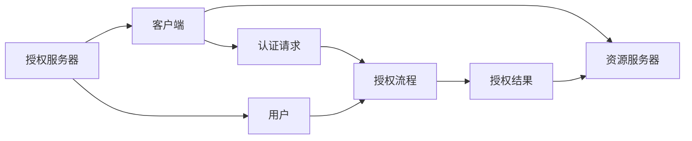
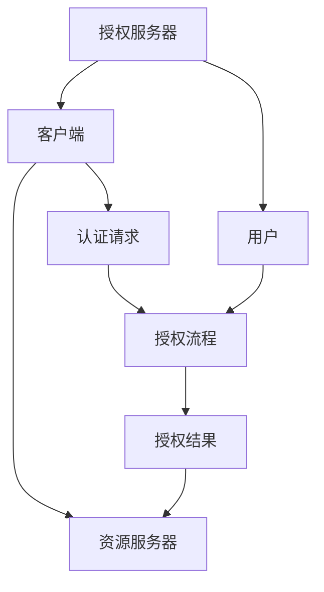

                 

## 1. 背景介绍

在数字化时代，用户对于其个人数据（如社交媒体、邮箱、在线交易等）的控制需求日益增长。传统基于用户名和密码的方式面临诸多安全风险和易用性问题。OAuth 2.0作为一种开放标准的身份认证协议，成为互联网平台间共享用户授权的行业标准。

### 1.1 问题由来

随着互联网应用的日益普及，越来越多的应用需要用户授权以访问其数据。传统授权方式涉及大量用户名和密码的交互，存在安全隐患，且用户在不同服务间需要重复注册和登录。

### 1.2 问题核心关键点

OAuth 2.0的核心目标在于：
- 提高用户身份认证的安全性和便捷性；
- 允许用户单点登录，减少密码输入；
- 保障第三方应用仅在用户授权范围内访问数据；
- 提供标准化的授权协议，便于跨平台应用。

### 1.3 问题研究意义

OAuth 2.0协议为互联网用户提供了更安全、便捷的身份认证机制，推动了Web应用的跨平台集成和用户数据共享。其发展与应用，极大地提升了用户的信息安全和互联网应用的互操作性，成为现代互联网身份认证的基础。

## 2. 核心概念与联系

### 2.1 核心概念概述

OAuth 2.0协议通过定义一系列角色、权限、步骤，使得第三方应用可以安全地访问用户数据，而无需持有用户密码。以下是OAuth 2.0中涉及的关键概念：

- **授权服务器(Authorization Server)**：负责管理用户身份和授权信息，处理认证请求。
- **资源服务器(Resource Server)**：持有用户数据的服务器，根据授权访问用户数据。
- **客户端(Client)**：需要访问用户数据的第三方应用，通过认证和授权流程获取访问权限。
- **用户(Agent)**：发起授权请求的用户，通过授权流程授予第三方应用访问其数据的权限。

这些核心概念之间通过一系列严格定义的协议和步骤进行信息交互，实现安全、便捷的身份认证和数据授权。

### 2.2 概念间的关系

OAuth 2.0协议中各角色的关系可以用以下Mermaid流程图表示：



- **授权流程**：用户同意授权，客户端获取访问令牌。
- **认证请求**：客户端请求访问令牌。
- **授权结果**：授权服务器根据用户授权结果生成访问令牌，返回给客户端。
- **访问令牌**：客户端使用访问令牌访问资源服务器，获取用户数据。

各角色间通过以上流程和信息交互，实现了OAuth 2.0协议的安全、便捷的用户授权机制。

### 2.3 核心概念的整体架构

通过上述核心概念和关系，可以构建OAuth 2.0协议的整体架构，如下图：



各角色间通过不同的信息流传递完成整个授权过程。授权服务器处理授权请求，用户参与授权流程，客户端获取访问令牌，资源服务器提供用户数据访问。

## 3. 核心算法原理 & 具体操作步骤

### 3.1 算法原理概述

OAuth 2.0协议通过授权流程，实现用户对第三方应用的授权，允许第三方应用安全地访问用户数据。其核心原理如下：

1. **用户授权**：用户通过授权流程同意第三方应用访问其数据。
2. **客户端认证**：第三方应用向授权服务器请求访问令牌。
3. **令牌生成**：授权服务器根据用户授权结果，生成访问令牌。
4. **令牌使用**：第三方应用使用访问令牌访问资源服务器，获取用户数据。

OAuth 2.0协议通过角色、权限、步骤等概念，严格定义了各角色间的信息交互流程，保障了用户数据的安全和第三方应用的权限控制。

### 3.2 算法步骤详解

OAuth 2.0授权流程包括以下关键步骤：

#### 3.2.1 授权码模式（Authorization Code Grant）

1. **用户授权**：用户访问第三方应用，查看授权请求。
2. **重定向授权请求**：用户同意授权，授权服务器重定向至客户端。
3. **客户端请求访问令牌**：客户端在重定向URL中携带`code`参数，向授权服务器请求访问令牌。
4. **访问令牌生成**：授权服务器根据`code`参数，生成访问令牌，并返回`token`和`refresh_token`。
5. **客户端使用访问令牌**：客户端使用`token`访问资源服务器，获取用户数据。

#### 3.2.2 密码模式（Resource Owner Password Credentials Grant）

1. **用户授权**：用户向授权服务器提供用户名和密码。
2. **授权服务器验证**：授权服务器验证用户名和密码，并生成访问令牌。
3. **客户端使用访问令牌**：客户端使用生成的`token`访问资源服务器，获取用户数据。

#### 3.2.3 隐式模式（Implicit Grant）

1. **用户授权**：用户同意授权，授权服务器直接返回`token`。
2. **客户端使用访问令牌**：客户端直接使用返回的`token`访问资源服务器，获取用户数据。

### 3.3 算法优缺点

OAuth 2.0协议的优点：
- **安全性高**：通过令牌和刷新令牌，保障了用户数据的安全，防止令牌泄露。
- **便捷性高**：用户只需同意一次授权，即可在多个第三方应用间单点登录，无需重复输入用户名和密码。
- **标准化好**：成为行业标准，便于不同平台间的互操作和集成。

OAuth 2.0协议的缺点：
- **复杂度高**：需要理解多个角色和流程，实施复杂。
- **依赖于第三方认证**：授权服务器和资源服务器需要可靠和稳定的基础设施支持。
- **重定向依赖**：依赖浏览器的授权流程，易受到浏览器限制。

### 3.4 算法应用领域

OAuth 2.0协议广泛应用于各种互联网应用中，特别是涉及用户数据共享和授权的场景：

- **社交媒体应用**：如Facebook、Twitter、微信等，用户可以授权第三方应用访问其社交数据。
- **邮箱服务**：如Gmail、Outlook等，用户可以授权第三方应用访问其邮箱信息。
- **在线购物**：如Amazon、淘宝等，用户可以授权第三方应用访问其购物记录。
- **金融服务**：如PayPal、Alipay等，用户可以授权第三方应用访问其财务信息。
- **云服务**：如AWS、Google Cloud等，用户可以授权第三方应用访问其云计算资源。

## 4. 数学模型和公式 & 详细讲解 & 举例说明

### 4.1 数学模型构建

OAuth 2.0协议通过授权流程，实现用户对第三方应用的授权，允许第三方应用安全地访问用户数据。其核心原理如下：

1. **用户授权**：用户通过授权流程同意第三方应用访问其数据。
2. **客户端认证**：第三方应用向授权服务器请求访问令牌。
3. **令牌生成**：授权服务器根据用户授权结果，生成访问令牌。
4. **令牌使用**：第三方应用使用访问令牌访问资源服务器，获取用户数据。

### 4.2 公式推导过程

以下以授权码模式为例，推导OAuth 2.0授权流程的数学模型：

#### 4.2.1 用户授权

1. **授权请求URL**：
   $$
   https://authorization-server.com/auth/
   $$

2. **重定向授权请求**：
   $$
   https://client.com/auth/redirect?response_type=code&redirect_uri=callback_url&scope=required_scopes
   $$

3. **客户端请求访问令牌**：
   $$
   https://authorization-server.com/token
   $$

4. **访问令牌生成**：
   $$
   access_token = generate_access_token(code, client_id, client_secret)
   $$

5. **客户端使用访问令牌**：
   $$
   https://resource-server.com/resource?access_token=access_token
   $$

### 4.3 案例分析与讲解

假设用户A访问第三方应用B，请求授权访问其社交数据。其授权流程如下：

1. **用户授权**：用户A通过授权流程同意授权应用B访问其社交数据。
2. **重定向授权请求**：授权服务器将用户A重定向至应用B，应用B在重定向URL中携带`code`参数。
3. **客户端请求访问令牌**：应用B向授权服务器请求访问令牌。
4. **访问令牌生成**：授权服务器根据`code`参数，生成访问令牌，并返回`token`和`refresh_token`。
5. **客户端使用访问令牌**：应用B使用`token`访问资源服务器，获取用户A的社交数据。

## 5. 项目实践：代码实例和详细解释说明

### 5.1 开发环境搭建

要实现OAuth 2.0协议，首先需要搭建一个支持OAuth 2.0的开发环境。以下是基于Python和Flask框架的示例：

1. 安装Flask和Flask-OAuthlib：
   ```bash
   pip install Flask Flask-OAuthlib
   ```

2. 创建授权服务器和资源服务器：
   ```python
   from flask import Flask, request, redirect, url_for, abort
   from flask_oauthlib.provider import OAuth2Provider

   app = Flask(__name__)
   app.config['SECRET_KEY'] = 'your_secret_key'
   oauth = OAuth2Provider(app)

   # 定义授权流程
   @app.route('/auth')
   def auth():
       return redirect(url_for('auth_authorized', _external=True))

   @app.route('/auth/authorized')
   def auth_authorized():
       # 获取授权服务器返回的授权结果
       auth_code = request.args.get('code')
       # 验证授权码，生成访问令牌
       if auth_code:
           access_token = oauth.access_token(auth_code)
           return redirect(url_for('resource'))
       else:
           abort(401)

   # 定义资源服务器
   @app.route('/resource')
   def resource():
       # 验证访问令牌，获取用户数据
       token = request.args.get('access_token')
       if token:
           # 解析访问令牌，获取用户ID
           user_id = oauth.verify_token(token)
           # 根据用户ID获取用户数据
           user_data = get_user_data(user_id)
           return jsonify(user_data)
       else:
           abort(401)

   if __name__ == '__main__':
       app.run(debug=True)
   ```

3. 配置授权服务器和资源服务器：
   ```python
   # 授权服务器配置
   app.config['OAUTH2_PROVIDER', {
       'access_token_validity': 3600,
       'access_token_secret': 'your_access_token_secret',
       'access_token_secret': 'your_access_token_secret'
   })

   # 资源服务器配置
   app.config['OAUTH2_RESOURCE_SERVER', {
       'verify_token': True,
       'verify_token_secret': 'your_resource_server_secret'
   })
   ```

### 5.2 源代码详细实现

以上代码实现了基于OAuth 2.0的授权流程。以下详细解释关键部分的实现：

1. **授权流程**：用户通过授权流程同意授权应用访问其数据。
2. **重定向授权请求**：授权服务器将用户重定向至应用，应用在重定向URL中携带`code`参数。
3. **客户端请求访问令牌**：应用向授权服务器请求访问令牌。
4. **访问令牌生成**：授权服务器根据`code`参数，生成访问令牌，并返回`token`和`refresh_token`。
5. **客户端使用访问令牌**：应用使用`token`访问资源服务器，获取用户数据。

### 5.3 代码解读与分析

通过以上代码，我们展示了OAuth 2.0协议的基本实现流程。关键点在于：

- **授权流程**：用户通过授权流程同意授权应用访问其数据。
- **重定向授权请求**：授权服务器将用户重定向至应用，应用在重定向URL中携带`code`参数。
- **客户端请求访问令牌**：应用向授权服务器请求访问令牌。
- **访问令牌生成**：授权服务器根据`code`参数，生成访问令牌，并返回`token`和`refresh_token`。
- **客户端使用访问令牌**：应用使用`token`访问资源服务器，获取用户数据。

### 5.4 运行结果展示

假设用户A授权应用B访问其社交数据，其授权流程如下：

1. **用户授权**：用户A通过授权流程同意授权应用B访问其社交数据。
2. **重定向授权请求**：授权服务器将用户A重定向至应用B，应用B在重定向URL中携带`code`参数。
3. **客户端请求访问令牌**：应用B向授权服务器请求访问令牌。
4. **访问令牌生成**：授权服务器根据`code`参数，生成访问令牌，并返回`token`和`refresh_token`。
5. **客户端使用访问令牌**：应用B使用`token`访问资源服务器，获取用户A的社交数据。

## 6. 实际应用场景

### 6.1 社交媒体平台

OAuth 2.0协议广泛应用于社交媒体平台，用户可以授权第三方应用访问其社交数据。例如，用户在Facebook上授权应用访问其好友列表和发表状态，应用可以获取这些数据并展示相关内容。

### 6.2 在线购物

OAuth 2.0协议也应用于在线购物平台，用户可以授权应用访问其购物记录和订单信息。例如，用户在Amazon上授权应用访问其购物清单和订单历史，应用可以提供个性化推荐和优惠活动。

### 6.3 金融服务

OAuth 2.0协议在金融服务领域也有广泛应用。用户可以授权应用访问其财务信息，例如支付记录和账户余额。例如，用户在PayPal上授权应用访问其交易记录，应用可以提供理财建议和风险监控。

## 7. 工具和资源推荐

### 7.1 学习资源推荐

OAuth 2.0协议是互联网身份认证的重要标准，了解其原理和实现对于开发者来说非常重要。以下是一些推荐的学习资源：

1. OAuth 2.0官方文档：OAuth 2.0委员会提供的官方文档，详细介绍了OAuth 2.0协议的标准化流程和实现方法。
2. OAuth 2.0实战指南：一本详细介绍OAuth 2.0协议实现的书籍，包括代码示例和最佳实践。
3. Flask-OAuthlib文档：Flask-OAuthlib库的官方文档，提供了OAuth 2.0协议的Flask实现示例。
4. OAuth 2.0协议的在线教程：如Coursera、Udacity等在线平台上的课程，帮助开发者深入理解OAuth 2.0协议。

### 7.2 开发工具推荐

OAuth 2.0协议的实现需要依赖于一些开发工具和框架，以下是一些推荐的工具：

1. Flask：一个轻量级Web框架，支持OAuth 2.0协议的实现。
2. OAuth 2.0库：如Flask-OAuthlib、Django-OAuthlib等，提供OAuth 2.0协议的封装和实现。
3. Postman：一个HTTP请求工具，可用于测试OAuth 2.0协议的授权流程。
4. Swagger：一个API文档生成工具，可用于文档生成和接口测试。

### 7.3 相关论文推荐

OAuth 2.0协议的发展背后是众多学者的研究和贡献，以下是一些推荐的相关论文：

1. OAuth 2.0: The authorization framework：OAuth 2.0委员会的论文，详细介绍了OAuth 2.0协议的设计和实现。
2. OAuth 2.0 Security Considerations：OAuth 2.0委员会的论文，详细讨论了OAuth 2.0协议的安全性和最佳实践。
3. OAuth 2.0 Authorization Framework: The Security-First Approach：OAuth 2.0委员会的论文，介绍了OAuth 2.0协议的安全性和跨平台实现。

## 8. 总结：未来发展趋势与挑战

### 8.1 研究成果总结

OAuth 2.0协议通过授权流程，实现了用户对第三方应用的授权，保障了用户数据的安全和第三方应用的权限控制。其设计理念和实现方法，已经得到了广泛的应用和认可。

### 8.2 未来发展趋势

OAuth 2.0协议的未来的发展趋势如下：

1. **多因素认证**：通过引入多因素认证机制，增强用户身份的安全性。
2. **无密码认证**：探索零密码认证技术，简化用户身份认证流程。
3. **统一身份认证**：探索统一身份认证机制，实现单点登录和跨平台认证。
4. **区块链技术**：引入区块链技术，保障令牌的安全性和不可篡改性。
5. **机器学习应用**：探索机器学习技术，实现更智能化的授权流程和风险控制。

### 8.3 面临的挑战

OAuth 2.0协议在实际应用中仍面临一些挑战：

1. **安全性问题**：授权服务器和资源服务器需要可靠和稳定的基础设施支持，防止攻击和数据泄露。
2. **复杂度问题**：协议复杂度高，需要理解多个角色和流程，实施复杂。
3. **跨平台问题**：不同平台间的互操作性需要严格标准化，防止兼容性和一致性问题。
4. **重定向问题**：依赖浏览器的授权流程，易受到浏览器限制。

### 8.4 研究展望

未来的研究需要关注以下方向：

1. **增强安全性**：通过引入多因素认证和区块链技术，增强OAuth 2.0协议的安全性。
2. **简化复杂度**：通过探索无密码认证和统一身份认证机制，简化OAuth 2.0协议的实施流程。
3. **提升互操作性**：通过严格标准化和协议优化，提高不同平台间的互操作性。
4. **探索新应用**：通过引入机器学习技术，探索OAuth 2.0协议的新应用场景和创新点。

## 9. 附录：常见问题与解答

**Q1：OAuth 2.0协议是否适用于所有平台？**

A: OAuth 2.0协议设计为跨平台通用协议，适用于各种互联网应用和平台。但不同平台的具体实现可能有所差异，需要根据实际情况进行调整。

**Q2：OAuth 2.0协议是否存在安全漏洞？**

A: OAuth 2.0协议本身设计为安全的授权流程，但实际应用中需要确保授权服务器和资源服务器的安全性和稳定性。常见的安全漏洞包括令牌泄露、重放攻击等，需要严格防范。

**Q3：OAuth 2.0协议是否适用于离线场景？**

A: OAuth 2.0协议主要依赖于浏览器的授权流程，适用于在线场景。但在某些离线场景中，可以通过二维码或其他技术进行授权，实现OAuth 2.0协议的离线应用。

**Q4：OAuth 2.0协议是否适用于物联网设备？**

A: OAuth 2.0协议适用于各类互联网应用，但物联网设备的授权流程可能有所不同，需要根据实际情况进行调整。

**Q5：OAuth 2.0协议是否适用于移动应用？**

A: OAuth 2.0协议适用于各种移动应用，但不同平台和设备的实现可能有所差异，需要根据实际情况进行调整。

---

作者：禅与计算机程序设计艺术 / Zen and the Art of Computer Programming

