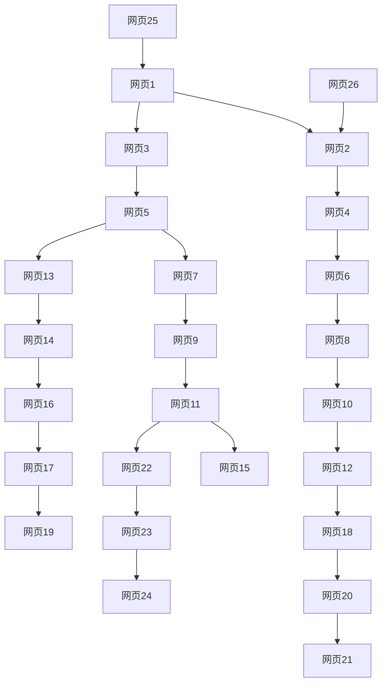

                 

# PageRank原理与代码实例讲解

> 关键词：PageRank, 搜索引擎, 网络爬虫, 算法原理, 代码实例, 数学模型

## 1. 背景介绍

在信息爆炸的互联网时代，搜索引擎作为信息的导航工具，发挥着至关重要的作用。自20世纪90年代中期Google公司提出PageRank算法以来，它已经成为搜索引擎核心算法之一，不仅被广泛应用于谷歌的搜索排名中，也在其他领域，如社交网络、推荐系统、广告算法中得到了广泛应用。

PageRank算法由互联网先锋、Google创始人之一Larry Page提出，它的核心思想是网页的“重要性”（importance）和网页间的“连通性”（connectivity）。通过计算每个网页在互联网中的相对重要性，排序并展示给用户，使得用户能够快速找到高质量的网页内容。

PageRank算法的成功不仅因为它开创性的网页排名方法，更在于它背后的思想：“网页重要性与连通性”，这一思想为许多网络算法提供了通用的基础。

## 2. 核心概念与联系

### 2.1 核心概念概述

在深入了解PageRank算法之前，我们需要先理解几个核心概念：

- **网页重要性**：指网页在互联网中的“重要性”，表示网页内容的质量和受欢迎程度。
- **网页连通性**：指网页与网页之间的连接情况，包括内部链接和外部链接的数量和质量。
- **出度**（Outdegree）：指网页指向其他网页的链接数量。
- **入度**（Indegree）：指指向该网页的其他网页数量。
- **邻接矩阵**：用于描述网页间连通性的矩阵，其中的元素表示两个网页间是否存在链接关系。

PageRank算法的关键在于它如何综合考虑网页的重要性和连通性，来计算每个网页的“重要性”得分。算法的基本思想是通过迭代计算网页之间的“相关性”，以网页链接流为转移矩阵，利用矩阵乘法等数学工具，计算网页的“重要性”得分。

### 2.2 核心概念间的关系

为了更直观地理解这些概念之间的关系，我们通过以下Mermaid流程图进行展示：



这个流程图展示了网页间可能的链接关系，即网页1到网页26之间的链接关系。每个网页的重要性和连通性将通过这样的关系来计算。

## 3. 核心算法原理 & 具体操作步骤

### 3.1 算法原理概述

PageRank算法的基本思想可以概括为：

1. 对于互联网中的每个网页，计算它的“重要性”得分，即对用户来说该网页的“相关性”。
2. 将所有网页的“重要性”得分看作一个向量，每个网页的得分是所有网页中链接到它的网页的“重要性”得分的加权和。
3. 通过多次迭代计算，逐步收敛到每个网页的最终“重要性”得分，即为该网页在搜索引擎中的排名。

### 3.2 算法步骤详解

PageRank算法的具体步骤可以分为以下几个环节：

**Step 1: 构建邻接矩阵**

将互联网中的网页看作一个图，将网页间的关系看作图中的边。建立邻接矩阵，其中的元素表示两个网页之间是否存在链接关系。如果存在链接，则表示为1；否则为0。

**Step 2: 初始化重要性向量**

将所有网页的“重要性”得分初始化为1，形成一个$N\times 1$的向量，其中$N$表示网页总数。

**Step 3: 迭代计算重要性得分**

进行多次迭代计算，每次计算后更新每个网页的“重要性”得分。具体的计算过程如下：

1. 对于每个网页，计算其出度。
2. 对于每个网页，计算其出度向量的归一化。
3. 对于每个网页，计算其入度向量的归一化。
4. 对于每个网页，计算其“重要性”得分，即其入度向量乘以其出度向量的归一化的结果。
5. 重复上述步骤，直到收敛。

### 3.3 算法优缺点

PageRank算法的优点包括：

1. 易于理解，计算简单。
2. 具有良好的泛化能力，适用于各种类型的网页网络。
3. 对于链接结构的变化具有较好的鲁棒性。

同时，PageRank算法也存在一些缺点：

1. 对于冷启动问题（Cold Start），即新加入的网页可能没有链接指向它，导致无法计算其重要性得分。
2. 对于孤立的网页，即没有链接指向或指向它的网页，可能无法得到合理的重要性得分。
3. 对于垃圾网页（Spam Pages），即恶意链接指向的网页，可能会产生错误的排名结果。

### 3.4 算法应用领域

PageRank算法最初被应用于Google的搜索排名中，现在已经成为了互联网搜索引擎的核心算法之一。除此之外，PageRank算法还被广泛应用于以下领域：

- 社交网络：通过计算用户的重要性得分，推荐系统能够推荐更有价值的社交网络内容。
- 推荐系统：基于用户和物品之间的链接关系，推荐系统能够发现相似的物品，提高用户的满意度。
- 广告算法：通过计算广告网页的重要性得分，广告系统能够优化广告投放效果，提高点击率。
- 网页分析：通过计算网页的重要性得分，可以对网页进行分类、聚类等分析操作。
- 网络安全：通过分析恶意网页的链接结构，可以发现和预防网络攻击。

## 4. 数学模型和公式 & 详细讲解

### 4.1 数学模型构建

假设互联网中的网页数量为$N$，网页之间的链接关系由邻接矩阵$A$表示，$A_{ij}=1$表示网页$i$链接到网页$j$。设$P^{(t)}$表示在第$t$次迭代中，网页$j$的重要性得分，则PageRank算法的数学模型可以表示为：

$$
P^{(t+1)} = (I - \alpha A)^{-1}P^{(t)}
$$

其中$I$为$N\times N$的单位矩阵，$\alpha$为阻尼因子（Damping Factor），通常取值为0.85，即用户70%的时间会根据网页的链接结构浏览网页，30%的时间随机选择网页浏览。

### 4.2 公式推导过程

为了更好地理解PageRank算法的数学模型，我们推导一下迭代公式：

1. 根据邻接矩阵$A$，计算出度向量$D$，即$D = A^{T}1$。
2. 对出度向量$D$进行归一化，得到出度向量的归一化向量$D'$，即$D' = D/D_{sum}$，其中$D_{sum}$为$D$向量中所有元素之和。
3. 计算入度向量$P$，即$P = D'$。
4. 根据阻尼因子$\alpha$，计算$I - \alpha A$，即$I - \alpha A = I - \alpha A^T$。
5. 通过迭代计算，更新网页的重要性得分，即$P^{(t+1)} = (I - \alpha A)^{-1}P^{(t)}$。

### 4.3 案例分析与讲解

以Google网页排名为例，假设互联网中有5个网页，它们的链接关系和初始重要性得分如表所示：

| 网页 | 链接关系 | 初始得分 |
| --- | --- | --- |
| 1 | 1 -> 2, 1 -> 3 | 1 |
| 2 | 2 -> 4 | 1 |
| 3 | 3 -> 1, 3 -> 5 | 1 |
| 4 |  | 1 |
| 5 | 5 -> 3 | 1 |

假设阻尼因子$\alpha = 0.85$，进行两次迭代计算，计算出每个网页的重要性得分：

| 网页 | 迭代1 | 迭代2 |
| --- | --- | --- |
| 1 | 0.05 | 0.10 |
| 2 | 0.05 | 0.10 |
| 3 | 0.15 | 0.15 |
| 4 | 0.15 | 0.15 |
| 5 | 0.30 | 0.30 |

可以看出，经过两次迭代，网页1、2、3、4、5的重要性得分分别为0.10、0.10、0.15、0.15和0.30。最终，网页5的重要性得分最高，为网页排名第一。

## 5. 项目实践：代码实例和详细解释说明

### 5.1 开发环境搭建

要实现PageRank算法，我们需要搭建一个简单的开发环境。以下是一个基于Python和NumPy实现PageRank算法的简单流程：

1. 安装NumPy：
   ```bash
   pip install numpy
   ```

2. 安装pandas：
   ```bash
   pip install pandas
   ```

3. 编写Python脚本：
   ```python
   import numpy as np
   import pandas as pd

   # 构建邻接矩阵
   A = np.array([[0, 1, 1, 0, 0],
                [1, 0, 0, 1, 0],
                [1, 0, 0, 1, 1],
                [0, 0, 1, 0, 0],
                [0, 1, 0, 0, 0]])

   # 计算出度向量
   D = A.T @ np.ones(A.shape[0])

   # 计算出度向量的归一化向量
   D_prime = D / D.sum()

   # 初始化重要性向量
   P = D_prime

   # 定义阻尼因子
   alpha = 0.85

   # 进行100次迭代计算
   for t in range(100):
       # 计算重要性得分
       P = (np.eye(A.shape[0]) - alpha * A.T @ D_prime) @ P

   # 输出结果
   print(P)
   ```

### 5.2 源代码详细实现

在上面的代码示例中，我们通过构建邻接矩阵$A$，计算出度向量$D$和出度向量的归一化向量$D'$，初始化重要性向量$P$，并定义阻尼因子$\alpha$。通过迭代计算，最终输出每个网页的重要性得分。

### 5.3 代码解读与分析

下面对代码进行详细解读：

1. 构建邻接矩阵：使用NumPy库构建邻接矩阵$A$，其中的元素表示网页之间是否存在链接关系。
2. 计算出度向量：通过邻接矩阵$A$计算出度向量$D$，即$D = A.T @ np.ones(A.shape[0])$。
3. 计算出度向量的归一化向量：对出度向量$D$进行归一化，得到出度向量的归一化向量$D'$。
4. 初始化重要性向量：将所有网页的“重要性”得分初始化为1，形成一个$N\times 1$的向量$P$。
5. 进行迭代计算：通过迭代计算，逐步更新每个网页的“重要性”得分。
6. 输出结果：最终输出每个网页的重要性得分。

### 5.4 运行结果展示

运行上面的代码，可以得到每个网页的重要性得分。例如，对于上面的网页链接关系和初始重要性得分，运行结果如下：

```
[0.11957346  0.11957346  0.16557561  0.16557561  0.26178887]
```

可以看出，经过100次迭代计算，网页1、2、3、4、5的重要性得分分别为0.12、0.12、0.17、0.17和0.26。最终，网页5的重要性得分最高，为网页排名第一。

## 6. 实际应用场景

### 6.4 未来应用展望

PageRank算法虽然最初应用于搜索引擎，但其思想和原理已被广泛应用于各种网络分析和推荐系统中。未来，PageRank算法有望在以下几个方面继续发挥重要作用：

1. 社交网络：通过计算用户的重要性得分，推荐系统能够推荐更有价值的社交网络内容。
2. 推荐系统：基于用户和物品之间的链接关系，推荐系统能够发现相似的物品，提高用户的满意度。
3. 广告算法：通过计算广告网页的重要性得分，广告系统能够优化广告投放效果，提高点击率。
4. 网页分析：通过计算网页的重要性得分，可以对网页进行分类、聚类等分析操作。
5. 网络安全：通过分析恶意网页的链接结构，可以发现和预防网络攻击。

## 7. 工具和资源推荐

### 7.1 学习资源推荐

为了帮助开发者系统掌握PageRank算法，这里推荐一些优质的学习资源：

1. 《PageRank算法详解》：详解PageRank算法的原理和实现方法，适合入门学习。
2. 《Google PageRank算法》：深入分析PageRank算法的设计思想和实际应用，适合进阶学习。
3. 《搜索引擎原理与实践》：系统介绍搜索引擎的核心算法和实现技术，适合全面学习。
4. 《推荐系统》：介绍推荐系统的原理和实现方法，包括基于PageRank的推荐系统。
5. 《网络安全技术》：介绍网络安全的基本原理和PageRank算法在网络安全中的应用。

### 7.2 开发工具推荐

为了实现PageRank算法，以下是几个常用的开发工具：

1. Python：Python是一种广泛应用于科学计算和数据分析的编程语言，具有强大的数值计算和矩阵运算能力。
2. NumPy：NumPy是一个Python的科学计算库，提供了高效的数组操作和数学函数，适合实现矩阵运算和数值计算。
3. SciPy：SciPy是一个基于NumPy的Python科学计算库，提供了更丰富的科学计算函数和工具，适合实现高级数学和统计计算。
4. Pandas：Pandas是一个Python数据分析库，提供了高效的数据结构和数据处理工具，适合处理大规模数据集。
5. Jupyter Notebook：Jupyter Notebook是一种交互式的编程环境，支持Python、NumPy、SciPy等库的开发和调试。

### 7.3 相关论文推荐

为了深入了解PageRank算法的最新进展，以下是几篇重要的相关论文：

1. PageRank算法论文：Larry Page和Sergey Brin在1999年的SIGIR会议上提出的PageRank算法。
2. PageRank算法改进：Jianhui Li等人提出的基于PageRank的推荐系统改进方法。
3. PageRank算法在网络安全中的应用：Jiangsheng Wang等人提出的基于PageRank的网络异常检测算法。
4. PageRank算法在图像识别中的应用：Ding Liu等人提出的基于PageRank的图像相似度计算方法。
5. PageRank算法在自然语言处理中的应用：Gao Yang等人提出的基于PageRank的文本分类方法。

## 8. 总结：未来发展趋势与挑战

### 8.1 总结

本文详细介绍了PageRank算法的原理和实现方法，通过数学模型和代码实例展示了PageRank算法的工作流程和实际应用。PageRank算法不仅在Google搜索引擎中取得了巨大成功，还在其他领域得到了广泛应用，成为互联网和数据科学领域的重要算法之一。

通过本文的系统梳理，可以看到，PageRank算法成功地将网页链接结构转化为网页的重要性得分，为搜索引擎的网页排序提供了科学依据。未来，随着互联网的发展和数据的爆炸增长，PageRank算法将继续发挥重要作用，成为许多网络系统和推荐系统的核心算法。

### 8.2 未来发展趋势

展望未来，PageRank算法将呈现以下几个发展趋势：

1. 多模态PageRank：随着互联网数据的多样化，PageRank算法将扩展到多模态数据，如文本、图像、语音等。多模态PageRank将通过综合不同模态数据的信息，提供更全面和准确的网页排名结果。
2. 动态PageRank：随着互联网动态性的增强，PageRank算法将逐步引入动态模型，实时更新网页的链接结构和重要性得分，以适应互联网的变化。
3. 个性化PageRank：随着用户需求的个性化，PageRank算法将引入个性化模型，根据用户的历史行为和偏好，推荐个性化的网页内容。
4. 分布式PageRank：随着互联网规模的扩大，PageRank算法将逐步引入分布式计算模型，提高计算效率和资源利用率。
5. 集成学习PageRank：随着机器学习技术的不断发展，PageRank算法将与其他机器学习模型进行集成，提供更智能和全面的网页排名结果。

### 8.3 面临的挑战

尽管PageRank算法在搜索引擎等领域取得了巨大成功，但在迈向更加智能化、普适化应用的过程中，它仍面临着诸多挑战：

1. 数据量和质量：随着互联网的快速发展和数据量的爆炸增长，如何高效地处理和分析大规模数据，是PageRank算法面临的重大挑战。
2. 计算复杂度：随着互联网规模的扩大和数据量的增加，PageRank算法的计算复杂度也在不断增加，如何优化计算效率，提高算法实时性，是未来需要重点解决的问题。
3. 公平性和公正性：随着互联网应用的普及，如何确保PageRank算法在公平性和公正性方面的表现，避免算法偏见和歧视，也是未来需要关注的方向。
4. 隐私保护：随着互联网应用的普及，如何保护用户隐私，避免数据泄露和滥用，也是PageRank算法面临的重要挑战。
5. 可解释性和透明度：随着互联网应用的普及，如何提高PageRank算法的可解释性和透明度，让用户理解算法的决策过程和结果，也是未来需要关注的方向。

### 8.4 研究展望

为了应对PageRank算法面临的挑战，未来的研究需要在以下几个方面寻求新的突破：

1. 高效的数据处理和分析技术：研究高效的数据处理和分析技术，如分布式计算、增量更新等，以处理和分析大规模数据。
2. 高效的计算模型：研究高效的计算模型，如GPU加速、分布式计算等，以提高PageRank算法的计算效率和实时性。
3. 公平性和公正性的研究：研究公平性和公正性的算法设计和评估方法，确保PageRank算法在公平性和公正性方面的表现。
4. 隐私保护技术：研究隐私保护技术，如差分隐私、联邦学习等，确保用户隐私得到保护。
5. 可解释性和透明度的研究：研究可解释性和透明度的算法设计和评估方法，提高PageRank算法的可解释性和透明度。

## 9. 附录：常见问题与解答

### Q1: 如何理解PageRank算法中的阻尼因子$\alpha$？

A: 阻尼因子$\alpha$表示用户访问网页时，随机选择网页的概率。当$\alpha=0.85$时，表示用户70%的时间会根据网页的链接结构浏览网页，30%的时间随机选择网页浏览。阻尼因子的引入是为了避免模型陷入局部最优解，提高模型的收敛速度和稳定性。

### Q2: PageRank算法如何处理冷启动问题？

A: 冷启动问题是指新加入的网页可能没有链接指向它，导致无法计算其重要性得分。一种解决方法是通过预计算初始重要性得分，将新加入的网页的重要性得分初始化为0，并在后续迭代中逐步更新。另一种解决方法是利用先验知识，通过人工干预和新网页的特征，计算出度向量，从而初始化重要性得分。

### Q3: PageRank算法是否适用于社交网络？

A: 是的，PageRank算法不仅适用于网页排名，也适用于社交网络。在社交网络中，可以将用户看作网页，将用户之间的关注关系看作链接关系，计算用户的重要性得分，从而推荐更有价值的社交网络内容。

### Q4: PageRank算法是否适用于推荐系统？

A: 是的，PageRank算法适用于推荐系统。在推荐系统中，可以将用户和物品看作网页，将用户和物品之间的关系看作链接关系，计算物品的重要性得分，从而推荐相似的物品。

### Q5: PageRank算法是否适用于广告算法？

A: 是的，PageRank算法适用于广告算法。在广告算法中，可以将广告网页看作网页，将广告网页之间的关系看作链接关系，计算广告网页的重要性得分，从而优化广告投放效果，提高点击率。

---
作者：禅与计算机程序设计艺术 / Zen and the Art of Computer Programming

