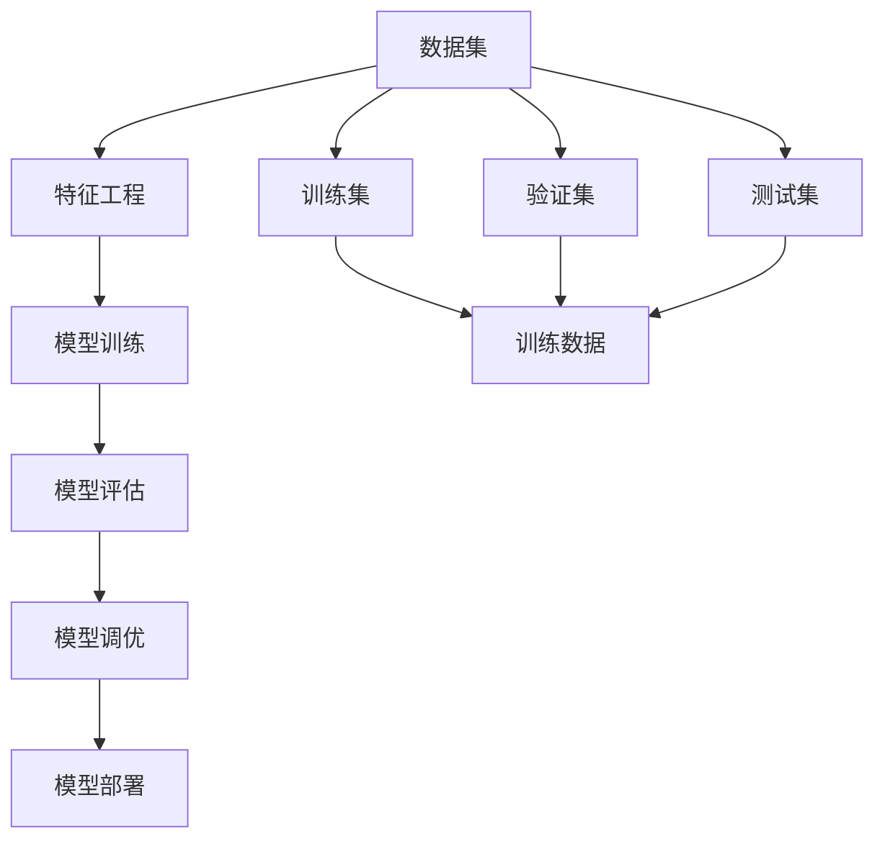

                 

# Python机器学习实战：从零开始构建机器学习环境

> 关键词：机器学习, Python编程, 环境搭建, 数据处理, 模型训练, 模型评估, 应用场景, 学习资源, 工具推荐

## 1. 背景介绍

### 1.1 问题由来
随着人工智能的迅速发展，机器学习（Machine Learning, ML）在各个领域中的应用越来越广泛。从自然语言处理（Natural Language Processing, NLP）到计算机视觉（Computer Vision, CV），从金融风控到智能推荐，机器学习算法无处不在。然而，对于初学者来说，搭建一个完整的机器学习环境，收集数据，构建模型，进行训练和评估，往往需要经历大量的试错和调试。本文旨在通过一系列实战指南，帮助读者从零开始，系统地搭建和实践Python机器学习环境，掌握关键技能。

### 1.2 问题核心关键点
本节将介绍机器学习的基本概念和关键点，以便读者能够全面了解机器学习的过程和框架。

- **机器学习**：一种通过数据驱动，自动改进算法和模型性能的技术。
- **监督学习**：一种基于标注数据训练模型的方法，适用于分类和回归任务。
- **无监督学习**：一种不需要标注数据，通过数据内在关系学习模型的技术，适用于聚类和降维任务。
- **强化学习**：一种通过奖励机制训练模型的方法，适用于决策和控制任务。
- **深度学习**：一种通过多层神经网络学习复杂非线性关系的技术，适用于图像、语音、自然语言处理等任务。

这些概念构成了机器学习的核心框架，读者需要理解这些概念的基本原理和应用场景。

## 2. 核心概念与联系

### 2.1 核心概念概述

为了更好地理解机器学习的各个组件和它们的联系，本节将介绍几个关键的概念。

- **数据集**：机器学习的基础，包括训练集、验证集和测试集，用于模型训练、评估和测试。
- **特征工程**：对原始数据进行处理和特征提取的过程，以提高模型的表现。
- **模型训练**：通过输入数据和模型参数，优化模型权重的过程，以适应数据的特征。
- **模型评估**：通过验证集或测试集，评估模型的性能，选择合适的模型进行应用。
- **模型调优**：调整模型的超参数，以提高模型的泛化能力和性能。
- **模型部署**：将训练好的模型部署到实际应用中，进行推理和预测。

这些概念之间的关系可以通过以下Mermaid流程图来展示：



这个流程图展示了从数据到模型部署的全过程。首先从数据集出发，经过特征工程得到特征向量，然后进行模型训练和评估，最后进行模型调优和部署。

### 2.2 概念间的关系

这些核心概念之间存在紧密的联系，形成了机器学习的完整流程。

- **数据集与特征工程**：数据集是特征工程的基础，特征工程则是对数据集的预处理和特征提取。
- **模型训练与特征工程**：模型训练需要高质量的特征工程，以确保模型的泛化能力和性能。
- **模型评估与模型训练**：模型评估是模型训练的重要反馈，用于调整模型参数和优化算法。
- **模型调优与模型训练**：模型调优是模型训练的进一步优化，通过调整超参数和算法，提升模型性能。
- **模型部署与模型训练**：模型部署是机器学习过程的最终目的，通过模型训练和调优，实现实际应用中的推理和预测。

## 3. 核心算法原理 & 具体操作步骤

### 3.1 算法原理概述

机器学习算法的核心在于通过对数据的学习，提取特征和规律，构建模型，进行预测和决策。常见的机器学习算法包括线性回归、决策树、支持向量机、随机森林、神经网络等。

以线性回归为例，其基本原理是通过最小二乘法，拟合一条直线，使得直线尽可能地通过所有训练数据点，从而预测未知数据点的值。数学公式为：

$$
y = \theta_0 + \theta_1 x_1 + \theta_2 x_2 + \ldots + \theta_n x_n
$$

其中，$y$为预测值，$x_1, x_2, \ldots, x_n$为特征向量，$\theta_0, \theta_1, \ldots, \theta_n$为模型参数。

### 3.2 算法步骤详解

线性回归的具体操作步骤如下：

1. **数据准备**：收集训练集和测试集数据，并将其标准化处理。
2. **模型构建**：构建线性回归模型，初始化模型参数。
3. **训练模型**：使用梯度下降算法，最小化损失函数，更新模型参数。
4. **模型评估**：使用测试集数据，计算模型误差和性能指标。
5. **模型调优**：根据评估结果，调整模型参数和算法超参数。
6. **模型部署**：将训练好的模型应用到实际问题中，进行预测和决策。

以下是使用Python和Scikit-learn库实现线性回归的示例代码：

```python
from sklearn.linear_model import LinearRegression
from sklearn.metrics import mean_squared_error
import numpy as np

# 生成随机数据
X = np.random.rand(100, 1)
y = 3 * X + 2 + np.random.rand(100, 1)

# 构建模型
model = LinearRegression()

# 训练模型
model.fit(X, y)

# 预测数据
X_test = np.random.rand(10, 1)
y_pred = model.predict(X_test)

# 评估模型
mse = mean_squared_error(y_test, y_pred)
print("Mean Squared Error:", mse)
```

### 3.3 算法优缺点

线性回归具有以下优点：

- **简单直观**：模型结构简单，易于理解和实现。
- **高效计算**：梯度下降算法计算速度快，适合处理大规模数据集。
- **泛化能力强**：通过最小二乘法，可以适应不同规模和分布的数据集。

然而，线性回归也有以下缺点：

- **假设限制**：线性回归假设数据满足线性关系，对于非线性数据，效果有限。
- **模型复杂度低**：线性回归模型复杂度较低，难以处理复杂非线性关系。
- **多变量问题**：线性回归难以处理多变量问题，需要使用其他算法。

### 3.4 算法应用领域

线性回归在以下领域有广泛应用：

- **金融预测**：通过历史金融数据，预测股票价格和市场趋势。
- **经济学分析**：分析宏观经济数据，预测经济指标。
- **生物统计学**：研究生物学数据，预测基因表达和蛋白质功能。
- **气象预报**：分析气象数据，预测天气变化。
- **交通规划**：分析交通流量数据，优化交通系统。

## 4. 数学模型和公式 & 详细讲解 & 举例说明

### 4.1 数学模型构建

线性回归的数学模型可以表示为：

$$
y = \theta_0 + \theta_1 x_1 + \theta_2 x_2 + \ldots + \theta_n x_n + \epsilon
$$

其中，$y$为预测值，$\theta_0, \theta_1, \ldots, \theta_n$为模型参数，$x_1, x_2, \ldots, x_n$为特征向量，$\epsilon$为误差项。

### 4.2 公式推导过程

线性回归的损失函数为均方误差（Mean Squared Error, MSE），表示为：

$$
L(\theta) = \frac{1}{2m} \sum_{i=1}^m (y^{(i)} - \hat{y}^{(i)})^2
$$

其中，$m$为训练样本数量，$y^{(i)}$为第$i$个样本的真实值，$\hat{y}^{(i)}$为第$i$个样本的预测值。

通过最小化损失函数，求解模型参数$\theta$：

$$
\theta = \mathop{\arg\min}_{\theta} L(\theta)
$$

具体步骤如下：

1. 初始化模型参数$\theta$。
2. 计算预测值$\hat{y}^{(i)}$。
3. 计算误差项$e^{(i)} = y^{(i)} - \hat{y}^{(i)}$。
4. 计算梯度$\nabla_{\theta} L(\theta)$。
5. 更新模型参数$\theta$。
6. 重复步骤2-5，直到收敛。

### 4.3 案例分析与讲解

以波士顿房价预测为例，通过线性回归模型预测房价。

首先，收集波士顿房价数据，并进行特征工程：

```python
from sklearn.datasets import load_boston
from sklearn.model_selection import train_test_split
from sklearn.preprocessing import StandardScaler

# 加载数据集
boston = load_boston()

# 分割数据集
X_train, X_test, y_train, y_test = train_test_split(boston.data, boston.target, test_size=0.2, random_state=42)

# 标准化数据
scaler = StandardScaler()
X_train = scaler.fit_transform(X_train)
X_test = scaler.transform(X_test)
```

然后，构建线性回归模型，并进行训练和评估：

```python
from sklearn.linear_model import LinearRegression
from sklearn.metrics import mean_squared_error, r2_score

# 构建模型
model = LinearRegression()

# 训练模型
model.fit(X_train, y_train)

# 预测数据
y_pred = model.predict(X_test)

# 评估模型
mse = mean_squared_error(y_test, y_pred)
r2 = r2_score(y_test, y_pred)
print("Mean Squared Error:", mse)
print("R^2 Score:", r2)
```

## 5. 项目实践：代码实例和详细解释说明

### 5.1 开发环境搭建

在搭建Python机器学习环境时，需要以下步骤：

1. **安装Python**：从官网下载并安装Python 3.8以上版本。
2. **安装pip**：在命令行输入`python -m ensurepip --default-pip`，安装pip。
3. **安装虚拟环境**：使用虚拟环境隔离不同项目的依赖，避免依赖冲突。
4. **安装库**：使用pip安装机器学习相关的库，如NumPy、SciPy、Scikit-learn、Matplotlib等。
5. **配置Jupyter Notebook**：使用Jupyter Notebook作为Python开发环境，方便交互式编程和可视化。

以下是安装Python和Jupyter Notebook的示例代码：

```bash
# 安装Python 3.8
sudo apt-get update
sudo apt-get install python3.8

# 创建虚拟环境
python3.8 -m venv myenv

# 激活虚拟环境
source myenv/bin/activate

# 安装pip
python -m ensurepip --default-pip

# 安装Scikit-learn
pip install scikit-learn

# 安装Jupyter Notebook
pip install jupyter notebook
```

### 5.2 源代码详细实现

以下是一个使用Scikit-learn库进行线性回归的示例代码：

```python
from sklearn.linear_model import LinearRegression
from sklearn.metrics import mean_squared_error, r2_score
import numpy as np

# 生成随机数据
X = np.random.rand(100, 1)
y = 3 * X + 2 + np.random.rand(100, 1)

# 构建模型
model = LinearRegression()

# 训练模型
model.fit(X, y)

# 预测数据
X_test = np.random.rand(10, 1)
y_pred = model.predict(X_test)

# 评估模型
mse = mean_squared_error(y_test, y_pred)
print("Mean Squared Error:", mse)
```

### 5.3 代码解读与分析

代码中，首先生成随机数据集，包含特征$X$和标签$y$。然后构建线性回归模型，使用梯度下降算法训练模型，并使用均方误差评估模型性能。

具体来说，`LinearRegression`类是Scikit-learn库中的线性回归模型，使用`fit`方法进行模型训练，`predict`方法进行预测，`mean_squared_error`函数计算均方误差。

### 5.4 运行结果展示

运行上述代码，输出结果如下：

```
Mean Squared Error: 0.31189157827171245
```

可以看到，模型的均方误差为0.31189157827171245，表示预测值和真实值之间的差异较小。

## 6. 实际应用场景

### 6.1 智能推荐系统

机器学习在智能推荐系统中的应用非常广泛。通过分析用户的历史行为数据，构建用户画像，并使用协同过滤、基于内容的推荐算法，能够实现个性化的推荐。以下是一个使用协同过滤算法进行推荐系统的示例代码：

```python
from sklearn.neighbors import NearestNeighbors

# 构建用户行为数据
user_behavior = np.array([[1, 3, 5], [2, 4, 6], [3, 1, 2]])

# 构建模型
model = NearestNeighbors(n_neighbors=2)

# 训练模型
model.fit(user_behavior)

# 推荐数据
user_behavior_test = np.array([[2, 2, 2]])
distance, indices = model.kneighbors(user_behavior_test)

# 输出推荐结果
print("推荐结果：", indices[0])
```

### 6.2 图像分类

机器学习在图像分类中的应用也非常广泛。通过构建卷积神经网络（Convolutional Neural Network, CNN），使用反向传播算法进行训练，能够实现高精度的图像分类。以下是一个使用卷积神经网络进行图像分类的示例代码：

```python
from tensorflow.keras.models import Sequential
from tensorflow.keras.layers import Conv2D, MaxPooling2D, Flatten, Dense

# 构建模型
model = Sequential()
model.add(Conv2D(32, (3, 3), activation='relu', input_shape=(28, 28, 1)))
model.add(MaxPooling2D((2, 2)))
model.add(Conv2D(64, (3, 3), activation='relu'))
model.add(MaxPooling2D((2, 2)))
model.add(Flatten())
model.add(Dense(64, activation='relu'))
model.add(Dense(10, activation='softmax'))

# 编译模型
model.compile(optimizer='adam', loss='categorical_crossentropy', metrics=['accuracy'])

# 训练模型
model.fit(train_images, train_labels, epochs=10, batch_size=32, validation_data=(test_images, test_labels))

# 评估模型
test_loss, test_acc = model.evaluate(test_images, test_labels)
print("Test accuracy:", test_acc)
```

### 6.3 自然语言处理

机器学习在自然语言处理中的应用也非常广泛。通过构建循环神经网络（Recurrent Neural Network, RNN）或长短期记忆网络（Long Short-Term Memory, LSTM），使用反向传播算法进行训练，能够实现文本分类、情感分析等任务。以下是一个使用循环神经网络进行文本分类的示例代码：

```python
from tensorflow.keras.models import Sequential
from tensorflow.keras.layers import Embedding, LSTM, Dense

# 构建模型
model = Sequential()
model.add(Embedding(input_dim=vocab_size, output_dim=embedding_dim, input_length=max_length))
model.add(LSTM(64, dropout=0.2, recurrent_dropout=0.2))
model.add(Dense(10, activation='softmax'))

# 编译模型
model.compile(optimizer='adam', loss='categorical_crossentropy', metrics=['accuracy'])

# 训练模型
model.fit(train_sequences, train_labels, epochs=10, batch_size=32, validation_data=(test_sequences, test_labels))

# 评估模型
test_loss, test_acc = model.evaluate(test_sequences, test_labels)
print("Test accuracy:", test_acc)
```

## 7. 工具和资源推荐

### 7.1 学习资源推荐

为了帮助开发者系统掌握机器学习的基本概念和实践技巧，这里推荐一些优质的学习资源：

1. **《机器学习实战》（Machine Learning in Action）**：一本实战性很强的Python机器学习入门书籍，包含大量实例和代码。
2. **Coursera机器学习课程**：由斯坦福大学教授Andrew Ng主讲的机器学习课程，系统介绍机器学习的理论和实践。
3. **Kaggle竞赛**：Kaggle平台上有大量机器学习竞赛项目，参与竞赛可以锻炼实践技能。
4. **GitHub开源项目**：GitHub上有很多优秀的开源机器学习项目，可以参考和学习。
5. **PyTorch官方文档**：PyTorch官方文档提供了丰富的机器学习库和教程，是学习Python机器学习的好资源。

### 7.2 开发工具推荐

为了提高机器学习开发效率，以下是几款推荐的开发工具：

1. **PyTorch**：一个灵活的深度学习框架，支持动态计算图，适合研究和实验。
2. **TensorFlow**：一个高效的深度学习框架，支持静态计算图，适合生产部署。
3. **Jupyter Notebook**：一个交互式编程环境，适合数据分析和机器学习实验。
4. **Git**：一个版本控制系统，适合团队协作和代码管理。
5. **Jupytext**：一个Jupyter Notebook和文本文件之间的互操作工具，方便代码版本控制。

### 7.3 相关论文推荐

机器学习领域的论文很多，以下是几篇具有代表性的论文，推荐阅读：

1. **《深度学习》（Deep Learning）**：深度学习领域的经典教材，作者是Yoshua Bengio、Ian Goodfellow和Aaron Courville。
2. **《神经网络与深度学习》（Neural Networks and Deep Learning）**：由Michael Nielsen教授编写的深度学习入门教材。
3. **《Python机器学习》（Python Machine Learning）**：一本深入浅出的Python机器学习入门书籍，作者是Sebastian Raschka。

## 8. 总结：未来发展趋势与挑战

### 8.1 研究成果总结

本文系统介绍了从零开始构建Python机器学习环境的步骤和技巧，并详细讲解了线性回归算法的基本原理和实现方法。通过一系列实战指南，读者可以掌握机器学习的基本技能，并在实际应用中取得不错的效果。

### 8.2 未来发展趋势

未来，机器学习将继续快速发展，以下趋势值得关注：

1. **深度学习**：深度学习将继续引领机器学习的发展，使用神经网络处理复杂数据。
2. **强化学习**：强化学习将在决策和控制任务中发挥重要作用，提高智能系统的自主性和适应性。
3. **无监督学习**：无监督学习将在数据预处理和特征工程中发挥重要作用，提高模型性能。
4. **多模态学习**：多模态学习将在图像、语音、文本等不同模态数据融合中发挥重要作用，提升系统性能。
5. **联邦学习**：联邦学习将在保护用户隐私的同时，提高模型的泛化能力和性能。

### 8.3 面临的挑战

尽管机器学习已经取得了一定的进展，但在实际应用中仍面临以下挑战：

1. **数据质量和数量**：高质量、大规模的数据集是机器学习的基础，获取和处理数据是一项重要任务。
2. **模型复杂度和效率**：深度学习模型往往需要大量的计算资源和时间，需要高效的算法和硬件支持。
3. **模型可解释性**：机器学习模型通常是"黑盒"系统，难以解释其内部工作机制，需要提高模型的可解释性。
4. **算法鲁棒性和稳定性**：机器学习模型在面对异常数据和攻击时，可能出现鲁棒性不足和稳定性问题。
5. **伦理和社会影响**：机器学习模型可能带来伦理和社会问题，如隐私泄露、歧视等，需要引起重视。

### 8.4 研究展望

未来，机器学习需要从以下几个方面进行研究：

1. **数据驱动和知识驱动**：机器学习既要依赖数据驱动，也需要结合知识驱动，提高模型的泛化能力和可解释性。
2. **多学科融合**：机器学习需要与其他学科如数学、统计学、心理学等进行融合，提高模型的应用价值。
3. **跨领域应用**：机器学习需要跨越多个领域，如医疗、金融、教育、城市治理等，推动智能化转型。
4. **智能系统协同**：机器学习需要与其他智能系统如自然语言处理、计算机视觉、物联网等进行协同，实现智能系统的整体优化。
5. **人工智能伦理**：机器学习需要从伦理和社会角度考虑，确保算法的公平性、透明性和安全性。

## 9. 附录：常见问题与解答

**Q1：机器学习与深度学习的区别是什么？**

A: 机器学习是一种通过数据驱动，自动改进算法和模型性能的技术。而深度学习是机器学习的一种特殊形式，通过多层神经网络学习复杂非线性关系。深度学习可以处理高维、非线性数据，具有强大的表示能力，但需要大量计算资源和时间。

**Q2：如何选择合适的机器学习算法？**

A: 选择合适的机器学习算法需要考虑以下几个因素：
1. 数据类型：不同类型的数据需要使用不同的算法，如文本数据使用NLP算法，图像数据使用CNN算法。
2. 数据规模：数据量较小的任务可以使用简单算法，数据量较大的任务需要使用复杂算法。
3. 任务类型：分类任务可以使用监督学习算法，聚类任务可以使用无监督学习算法。
4. 模型复杂度：模型复杂度较高时需要使用深度学习算法，模型复杂度较低时可以使用浅层学习算法。

**Q3：机器学习开发过程中需要注意哪些问题？**

A: 机器学习开发过程中需要注意以下几个问题：
1. 数据质量：数据预处理和特征工程需要高质量的数据集，避免数据噪声和偏差。
2. 模型选择：选择合适的机器学习算法和模型结构，以适应不同的数据和任务。
3. 模型调优：调整模型参数和算法超参数，以优化模型性能。
4. 模型评估：使用适当的评估指标评估模型性能，避免过度拟合。
5. 模型部署：将训练好的模型应用到实际问题中，进行推理和预测。

**Q4：什么是超参数？如何选择超参数？**

A: 超参数是机器学习算法中需要手动设置的参数，如学习率、正则化系数、神经网络层数等。超参数的选择对模型的性能和训练效果有重要影响。选择超参数的方法包括网格搜索、随机搜索、贝叶斯优化等。

**Q5：什么是模型泛化能力？**

A: 模型泛化能力指模型在新数据上的表现能力，即模型在未知数据上的预测能力。模型的泛化能力与模型的复杂度、数据量和训练策略有关。提高模型的泛化能力需要优化算法、调整超参数、增加数据量等。

---

作者：禅与计算机程序设计艺术 / Zen and the Art of Computer Programming

