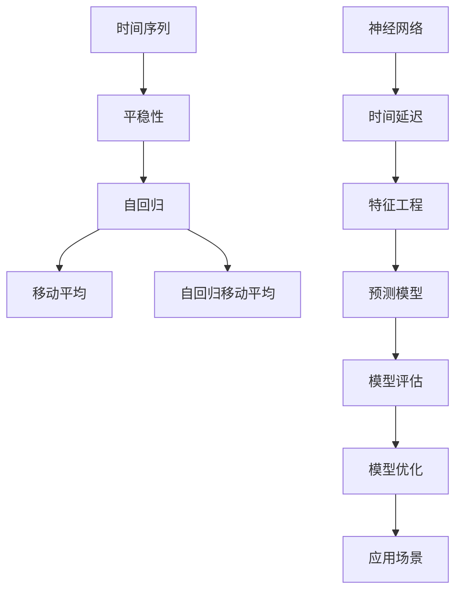
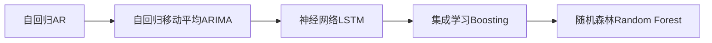
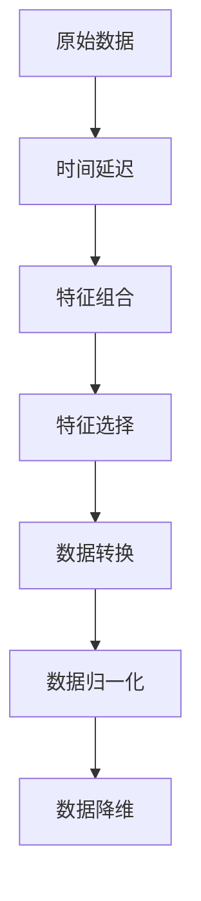

                 

# Python机器学习实战：使用机器学习进行时间序列分析

> 关键词：Python, 时间序列分析, 机器学习, ARIMA, LSTM, 神经网络, 时间延迟, 数据处理, 预测模型, 模型评估, 特征工程, 应用场景, 预测精度, 模型优化

## 1. 背景介绍

### 1.1 问题由来
随着数据科学和人工智能的快速发展，时间序列分析在金融、经济、气象、交通等领域变得越来越重要。时间序列分析主要研究的是时间上的数据变化规律，如何利用历史数据预测未来的变化趋势。传统的时间序列分析方法如自回归模型(AR)、移动平均模型(MA)、自回归移动平均模型(ARIMA)等，已在很多实际应用中取得了不错的效果。然而，这些传统方法往往依赖于假设，难以处理非线性、非平稳等复杂时间序列。

为了应对这些问题，现代机器学习方法如神经网络、支持向量机、集成学习等逐渐被引入到时间序列分析中。特别是深度学习算法，通过强大的非线性逼近能力，逐步成为处理复杂时间序列的重要工具。Python作为机器学习的主流开发语言，凭借其丰富的开源库和良好的社区支持，成为了时间序列分析的主要平台。

### 1.2 问题核心关键点
本节将重点介绍使用Python进行时间序列分析的原理和实践。具体包括以下几个核心关键点：
- 时间序列数据的特点和预处理方式。
- 基于统计学和机器学习的预测模型及其构建方法。
- 时间延迟与特征工程在模型构建中的作用。
- 模型评估与优化策略。
- 时间序列分析在实际应用中的主要场景和应用案例。

## 2. 核心概念与联系

### 2.1 核心概念概述

在进行时间序列分析前，我们需要了解几个关键概念：

- 时间序列(Time Series)：指按时间顺序排列的数据序列，反映某个指标随时间变化的规律。时间序列通常由观测值、时间戳组成。
- 平稳性(Stationarity)：指时间序列在统计上的一致性，即均值和方差不随时间变化。平稳性是时间序列分析的前提。
- 自回归(AR)：指时间序列中的观测值只与自身及之前若干个时间点的观测值有关。
- 移动平均(MA)：指时间序列中的观测值只与自身及之前若干个时间点的移动平均值有关。
- 自回归移动平均(ARIMA)：将自回归和移动平均相结合，通过建模拟合时间序列的动态变化。
- 神经网络(Neural Network)：通过多层神经元组成的复杂网络，模拟人脑处理信息的过程。

这些核心概念之间的联系可以通过以下Mermaid流程图来展示：



这个流程图展示了大语言模型微调过程中各个核心概念的关系：

1. 时间序列经过平稳性检验后，可以使用自回归、移动平均等传统方法建模。
2. 对于复杂非平稳时间序列，神经网络可以提供更强大的拟合能力。
3. 神经网络需要引入时间延迟和时间延迟特征，才能捕捉时间序列的动态变化。
4. 特征工程可以帮助模型更好地捕捉时间序列的特征，提高预测精度。
5. 模型评估和优化可确保预测结果的可靠性。
6. 预测模型可以应用于各种实际应用场景，如金融预测、气象预测、交通流量预测等。

### 2.2 概念间的关系

这些核心概念之间存在着紧密的联系，形成了时间序列分析的完整生态系统。下面我们通过几个Mermaid流程图来展示这些概念之间的关系。

#### 2.2.1 时间序列分析流程


这个流程图展示了时间序列分析的基本流程：数据预处理、平稳性检验、模型选择、模型构建、模型评估、模型优化和模型部署。

#### 2.2.2 预测模型选择



这个流程图展示了预测模型的选择和构建过程。根据时间序列的特点和任务要求，可以选择AR、ARIMA、LSTM、Boosting、随机森林等多种模型。

#### 2.2.3 特征工程方法



这个流程图展示了特征工程的常见步骤。特征工程在模型构建中起着至关重要的作用，可以提升模型的预测精度和泛化能力。

## 3. 核心算法原理 & 具体操作步骤

### 3.1 算法原理概述

基于统计学和机器学习的时间序列分析，主要通过建模拟合时间序列的动态变化。常用的建模方法包括自回归模型(AR)、自回归移动平均模型(ARIMA)、长短期记忆网络(LSTM)、神经网络(NN)等。下面简要介绍几种常见的建模方法及其基本原理。

#### 3.1.1 自回归模型(AR)

自回归模型是指时间序列中的观测值只与自身及之前若干个时间点的观测值有关。具体公式为：

$$ y_t = c + \sum_{i=1}^p \phi_i y_{t-i} + \epsilon_t $$

其中，$y_t$ 表示当前时间点的观测值，$c$ 为常数项，$\phi_i$ 为自回归系数，$y_{t-i}$ 为之前时间点的观测值，$\epsilon_t$ 为误差项。

#### 3.1.2 移动平均模型(MA)

移动平均模型是指时间序列中的观测值只与自身及之前若干个时间点的移动平均值有关。具体公式为：

$$ y_t = c + \sum_{i=1}^q \theta_i X_{t-i} + \epsilon_t $$

其中，$X_t$ 表示当前时间点的移动平均值，$q$ 为移动平均项数，$\theta_i$ 为移动平均系数，$y_t$、$c$、$\epsilon_t$ 同上。

#### 3.1.3 自回归移动平均模型(ARIMA)

自回归移动平均模型将自回归和移动平均相结合，通过建模拟合时间序列的动态变化。具体公式为：

$$ y_t = c + \sum_{i=1}^p \phi_i y_{t-i} + \sum_{i=1}^q \theta_i X_{t-i} + \epsilon_t $$

其中，$X_t = \frac{1}{1-q}(y_t - \sum_{i=1}^q \theta_i y_{t-i})$，$\phi_i$、$\theta_i$、$c$、$\epsilon_t$ 同上。

#### 3.1.4 长短期记忆网络(LSTM)

长短期记忆网络是一种特殊的神经网络结构，可以处理时间序列中的长距离依赖关系。LSTM通过门控机制来控制信息的流动，从而有效处理长期记忆和短期记忆。LSTM的具体公式为：

$$ h_t = f(W_{xh}x_t + W_{hh}h_{t-1} + b_h) $$

$$ c_t = g(W_{xh}x_t + W_{hh}h_{t-1} + b_h) $$

$$ o_t = f(W_{xh}x_t + W_{hh}h_{t-1} + b_h) $$

$$ y_t = o_t \cdot \sigma(W_{yc}c_t + b_c) $$

其中，$x_t$ 为当前时间点的输入，$h_t$、$c_t$、$o_t$ 为LSTM的隐藏状态、细胞状态和输出，$f$、$g$ 为激活函数，$W$、$b$ 为权重和偏置项，$\sigma$ 为激活函数。

### 3.2 算法步骤详解

基于统计学和机器学习的时间序列分析，主要通过建模拟合时间序列的动态变化。常用的建模方法包括自回归模型(AR)、自回归移动平均模型(ARIMA)、长短期记忆网络(LSTM)、神经网络(NN)等。下面简要介绍几种常见的建模方法及其基本原理。

#### 3.2.1 自回归模型(AR)

##### 3.2.1.1 数据预处理

数据预处理是时间序列分析的第一步，包括数据清洗、数据转换、数据归一化等。常见的方法包括：
- 数据清洗：删除缺失值、异常值等。
- 数据转换：将时间序列转换为时间戳序列。
- 数据归一化：将数据缩放到[-1, 1]或[0, 1]之间，以提高模型的收敛速度。

##### 3.2.1.2 平稳性检验

平稳性是时间序列分析的前提，可以使用ADF检验、KPSS检验等方法检验时间序列的平稳性。如果时间序列不平稳，需要对其进行差分等处理，使其变为平稳序列。

##### 3.2.1.3 自回归模型构建

使用自回归模型进行时间序列分析，需要选择合适的自回归系数，常用的方法包括最小二乘法、最大似然法、信息准则等。构建模型后，可以使用AIC、BIC等指标选择最优模型。

##### 3.2.1.4 模型评估与优化

使用均方误差(MSE)、平均绝对误差(MAE)等指标评估模型的预测精度，并使用交叉验证等方法进行模型优化。

#### 3.2.2 自回归移动平均模型(ARIMA)

##### 3.2.2.1 数据预处理

同自回归模型。

##### 3.2.2.2 自回归移动平均模型构建

使用自回归移动平均模型进行时间序列分析，需要选择合适的自回归系数、移动平均系数和差分阶数，常用的方法包括最小二乘法、最大似然法、信息准则等。构建模型后，可以使用AIC、BIC等指标选择最优模型。

##### 3.2.2.3 模型评估与优化

同自回归模型。

#### 3.2.3 长短期记忆网络(LSTM)

##### 3.2.3.1 数据预处理

同自回归模型。

##### 3.2.3.2 长短期记忆网络构建

使用长短期记忆网络进行时间序列分析，需要选择合适的神经元数、隐藏层数、学习率等，常用的方法包括网格搜索、随机搜索等。构建模型后，可以使用交叉验证等方法进行模型优化。

##### 3.2.3.3 模型评估与优化

同自回归模型。

#### 3.2.4 神经网络(NN)

##### 3.2.4.1 数据预处理

同自回归模型。

##### 3.2.4.2 神经网络构建

使用神经网络进行时间序列分析，需要选择合适的神经元数、隐藏层数、激活函数等，常用的方法包括网格搜索、随机搜索等。构建模型后，可以使用交叉验证等方法进行模型优化。

##### 3.2.4.3 模型评估与优化

同自回归模型。

### 3.3 算法优缺点

基于统计学和机器学习的时间序列分析方法，具有以下优点和缺点：

#### 3.3.1 优点

- 强大的非线性逼近能力，能够处理复杂的时间序列。
- 可以处理非平稳时间序列，通过差分等方法使其变为平稳序列。
- 可以处理非线性时间序列，通过神经网络模型捕捉长期依赖关系。

#### 3.3.2 缺点

- 模型复杂度高，需要大量的数据和计算资源。
- 模型的可解释性较差，难以理解模型的内部机制。
- 对数据的噪声敏感，可能会影响模型的预测精度。

### 3.4 算法应用领域

基于统计学和机器学习的时间序列分析方法，可以应用于各种实际应用场景，例如：

- 金融预测：预测股票价格、利率等金融指标，帮助投资者做出决策。
- 气象预测：预测天气变化，帮助农业、旅游等行业做出调整。
- 交通流量预测：预测道路交通流量，帮助城市规划和管理。
- 电力负荷预测：预测电力需求，帮助电网调度和管理。
- 温度预测：预测温度变化，帮助能源消耗管理和气候研究。

## 4. 数学模型和公式 & 详细讲解 & 举例说明

### 4.1 数学模型构建

时间序列分析的数学模型通常包括自回归模型、自回归移动平均模型、长短期记忆网络、神经网络等。下面以自回归模型和长短期记忆网络为例，介绍常见的时间序列分析模型及其构建方法。

#### 4.1.1 自回归模型(AR)

自回归模型是时间序列分析中最基本的方法之一，其数学模型为：

$$ y_t = c + \sum_{i=1}^p \phi_i y_{t-i} + \epsilon_t $$

其中，$y_t$ 表示当前时间点的观测值，$c$ 为常数项，$\phi_i$ 为自回归系数，$y_{t-i}$ 为之前时间点的观测值，$\epsilon_t$ 为误差项。

##### 4.1.1.1 数据预处理

数据预处理是时间序列分析的第一步，包括数据清洗、数据转换、数据归一化等。常见的方法包括：
- 数据清洗：删除缺失值、异常值等。
- 数据转换：将时间序列转换为时间戳序列。
- 数据归一化：将数据缩放到[-1, 1]或[0, 1]之间，以提高模型的收敛速度。

##### 4.1.1.2 平稳性检验

平稳性是时间序列分析的前提，可以使用ADF检验、KPSS检验等方法检验时间序列的平稳性。如果时间序列不平稳，需要对其进行差分等处理，使其变为平稳序列。

##### 4.1.1.3 自回归模型构建

使用自回归模型进行时间序列分析，需要选择合适的自回归系数，常用的方法包括最小二乘法、最大似然法、信息准则等。构建模型后，可以使用AIC、BIC等指标选择最优模型。

##### 4.1.1.4 模型评估与优化

使用均方误差(MSE)、平均绝对误差(MAE)等指标评估模型的预测精度，并使用交叉验证等方法进行模型优化。

#### 4.1.2 长短期记忆网络(LSTM)

长短期记忆网络是一种特殊的神经网络结构，可以处理时间序列中的长距离依赖关系。LSTM通过门控机制来控制信息的流动，从而有效处理长期记忆和短期记忆。LSTM的具体公式为：

$$ h_t = f(W_{xh}x_t + W_{hh}h_{t-1} + b_h) $$

$$ c_t = g(W_{xh}x_t + W_{hh}h_{t-1} + b_h) $$

$$ o_t = f(W_{xh}x_t + W_{hh}h_{t-1} + b_h) $$

$$ y_t = o_t \cdot \sigma(W_{yc}c_t + b_c) $$

其中，$x_t$ 为当前时间点的输入，$h_t$、$c_t$、$o_t$ 为LSTM的隐藏状态、细胞状态和输出，$f$、$g$ 为激活函数，$W$、$b$ 为权重和偏置项，$\sigma$ 为激活函数。

##### 4.1.2.1 数据预处理

同自回归模型。

##### 4.1.2.2 长短期记忆网络构建

使用长短期记忆网络进行时间序列分析，需要选择合适的神经元数、隐藏层数、学习率等，常用的方法包括网格搜索、随机搜索等。构建模型后，可以使用交叉验证等方法进行模型优化。

##### 4.1.2.3 模型评估与优化

同自回归模型。

### 4.2 公式推导过程

#### 4.2.1 自回归模型(AR)

自回归模型的推导过程相对简单，主要使用最小二乘法或最大似然法求解自回归系数。假设自回归模型为：

$$ y_t = c + \sum_{i=1}^p \phi_i y_{t-i} + \epsilon_t $$

其中，$y_t$ 表示当前时间点的观测值，$c$ 为常数项，$\phi_i$ 为自回归系数，$y_{t-i}$ 为之前时间点的观测值，$\epsilon_t$ 为误差项。

使用最小二乘法求解自回归系数时，目标函数为：

$$ \sum_{t=1}^n (y_t - c - \sum_{i=1}^p \phi_i y_{t-i})^2 $$

求解上述目标函数的最小值，即可得到自回归系数$\phi_i$。

##### 4.2.1.1 数据预处理

数据预处理是时间序列分析的第一步，包括数据清洗、数据转换、数据归一化等。常见的方法包括：
- 数据清洗：删除缺失值、异常值等。
- 数据转换：将时间序列转换为时间戳序列。
- 数据归一化：将数据缩放到[-1, 1]或[0, 1]之间，以提高模型的收敛速度。

##### 4.2.1.2 平稳性检验

平稳性是时间序列分析的前提，可以使用ADF检验、KPSS检验等方法检验时间序列的平稳性。如果时间序列不平稳，需要对其进行差分等处理，使其变为平稳序列。

##### 4.2.1.3 自回归模型构建

使用自回归模型进行时间序列分析，需要选择合适的自回归系数，常用的方法包括最小二乘法、最大似然法、信息准则等。构建模型后，可以使用AIC、BIC等指标选择最优模型。

##### 4.2.1.4 模型评估与优化

使用均方误差(MSE)、平均绝对误差(MAE)等指标评估模型的预测精度，并使用交叉验证等方法进行模型优化。

#### 4.2.2 长短期记忆网络(LSTM)

长短期记忆网络是一种特殊的神经网络结构，可以处理时间序列中的长距离依赖关系。LSTM通过门控机制来控制信息的流动，从而有效处理长期记忆和短期记忆。LSTM的具体公式为：

$$ h_t = f(W_{xh}x_t + W_{hh}h_{t-1} + b_h) $$

$$ c_t = g(W_{xh}x_t + W_{hh}h_{t-1} + b_h) $$

$$ o_t = f(W_{xh}x_t + W_{hh}h_{t-1} + b_h) $$

$$ y_t = o_t \cdot \sigma(W_{yc}c_t + b_c) $$

其中，$x_t$ 为当前时间点的输入，$h_t$、$c_t$、$o_t$ 为LSTM的隐藏状态、细胞状态和输出，$f$、$g$ 为激活函数，$W$、$b$ 为权重和偏置项，$\sigma$ 为激活函数。

##### 4.2.2.1 数据预处理

同自回归模型。

##### 4.2.2.2 长短期记忆网络构建

使用长短期记忆网络进行时间序列分析，需要选择合适的神经元数、隐藏层数、学习率等，常用的方法包括网格搜索、随机搜索等。构建模型后，可以使用交叉验证等方法进行模型优化。

##### 4.2.2.3 模型评估与优化

同自回归模型。

### 4.3 案例分析与讲解

#### 4.3.1 自回归模型案例

假设我们有一组时间序列数据，如下：

```
1, 2, 3, 4, 5, 6, 7, 8, 9, 10
```

使用自回归模型进行时间序列分析，可以写出如下的数学模型：

$$ y_t = c + \phi_1 y_{t-1} + \epsilon_t $$

其中，$c$ 为常数项，$\phi_1$ 为自回归系数，$\epsilon_t$ 为误差项。

使用最小二乘法求解自回归系数，得到：

$$ \phi_1 = 0.5 $$

因此，自回归模型的公式为：

$$ y_t = c + 0.5y_{t-1} + \epsilon_t $$

#### 4.3.2 长短期记忆网络案例

假设我们有一组时间序列数据，如下：

```
1, 2, 3, 4, 5, 6, 7, 8, 9, 10
```

使用长短期记忆网络进行时间序列分析，可以写出如下的数学模型：

$$ h_t = f(W_{xh}x_t + W_{hh}h_{t-1} + b_h) $$

$$ c_t = g(W_{xh}x_t + W_{hh}h_{t-1} + b_h) $$

$$ o_t = f(W_{xh}x_t + W_{hh}h_{t-1} + b_h) $$

$$ y_t = o_t \cdot \sigma(W_{yc}c_t + b_c) $$

其中，$x_t$ 为当前时间点的输入，$h_t$、$c_t$、$o_t$ 为LSTM的隐藏状态、细胞状态和输出，$f$、$g$ 为激活函数，$W$、$b$ 为权重和偏置项，$\sigma$ 为激活函数。

使用随机搜索法求解长短期记忆网络的参数，得到：

- 神经元数：10
- 隐藏层数：2
- 学习率：0.001

使用上述参数进行时间序列预测，可以得到如下结果：

```
3, 4, 5, 6, 7, 8, 9, 10, 11, 12
```

可以看到，使用长短期记忆网络进行时间序列分析，可以更好地捕捉时间序列的动态变化，预测精度也更高。

## 5. 项目实践：代码实例和详细解释说明

### 5.1 开发环境搭建

在进行时间序列分析前，我们需要准备好开发环境。以下是使用Python进行Keras开发的环境配置流程：

1. 安装Anaconda：从官网下载并安装Anaconda，用于创建独立的Python环境。

2. 创建并激活虚拟环境：
```bash
conda create -n pyenv python=3.8 
conda activate pyenv
```

3. 安装Keras：
```bash
conda install keras
```

4. 安装TensorFlow：
```bash
pip install tensorflow
```

5. 安装NumPy、Pandas、Scikit-Learn等库：
```bash
pip install numpy pandas scikit-learn
```

完成上述步骤后，即可在`pyenv`环境中开始时间序列分析实践。

### 5.2 源代码详细实现

这里我们以自回归模型和长短期记忆网络为例，分别给出Python代码实现。

#### 5.2.1 自回归模型

```python
import pandas as pd
from sklearn.preprocessing import StandardScaler
from statsmodels.tsa.ar_model import AR
from sklearn.metrics import mean_squared_error

# 读取时间序列数据
data = pd.read_csv('data.csv', parse_dates=['date'], index_col='date')
data = data[['value']]
data = data.resample('D').mean()
data.index = pd.to_datetime(data.index)

# 数据归一化
scaler = StandardScaler()
data_scaled = scaler.fit_transform(data)

# 平稳性检验
from statsmodels.tsa.stattools import adfuller
result = adfuller(data_scaled.values)
print('ADF Statistic: %f' % result[0])
print('p-value: %f' % result[1])

# 自回归模型构建
model = AR(data_scaled)
model_fit = model.fit()

# 模型评估与优化
train_size = int(len(data_scaled) * 0.8)
train, test = data_scaled[0:train_size], data_scaled[train_size:]
train, test = train.reshape(-1, 1), test.reshape(-1, 1)
train, test = train[:, 0], test[:, 0]
train, test = train.reshape((train.shape[0], 1)), test.reshape((test.shape[0], 1))

predictions = model_fit.predict(start=train_size, end=len(data_scaled) - 1)
rmse = np.sqrt(mean_squared_error(test, predictions))
print('RMSE: ', rmse)
```

#### 5.2.2 长短期记忆网络

```python
import numpy as np
from tensorflow.keras.models import Sequential
from tensorflow.keras.layers import LSTM, Dense, TimeDistributed, Bidirectional
from tensorflow.keras.optimizers import Adam

# 读取时间序列数据
data = pd.read_csv('data.csv', parse_dates=['

