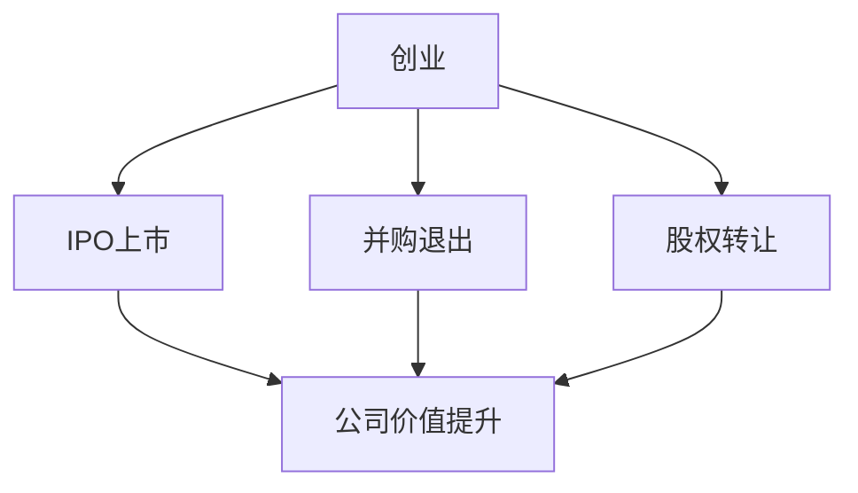
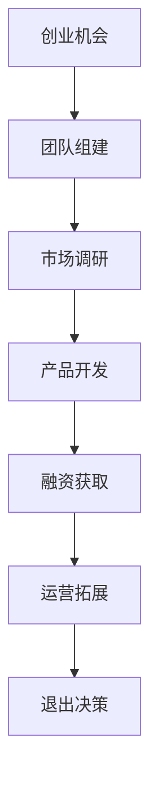
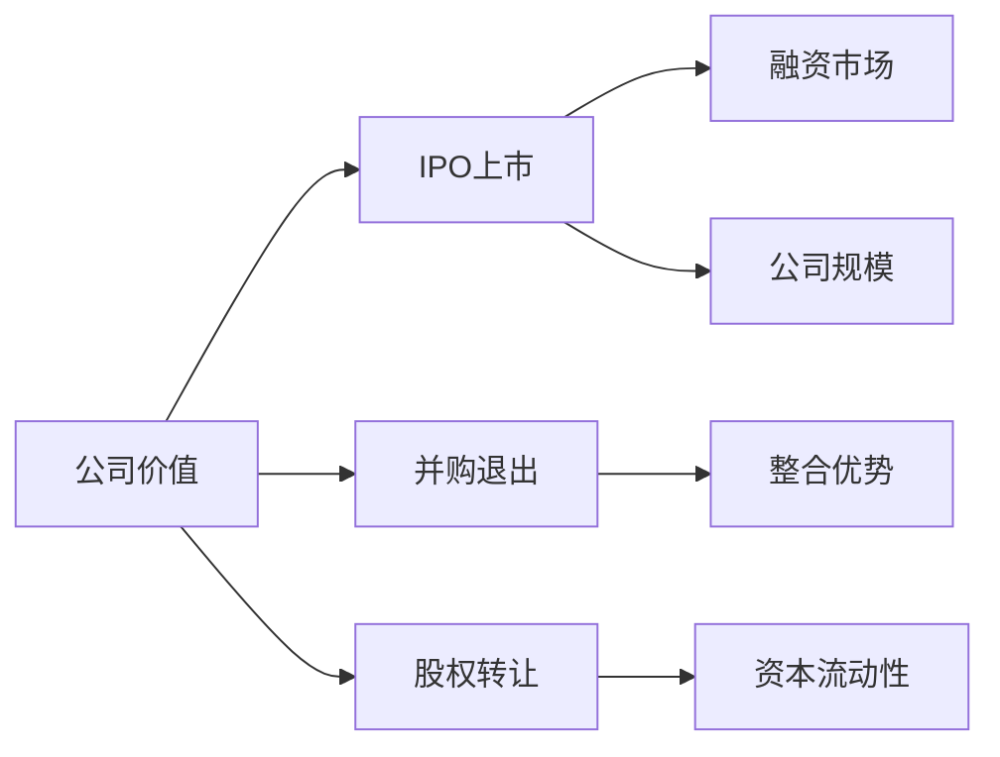
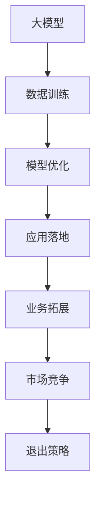
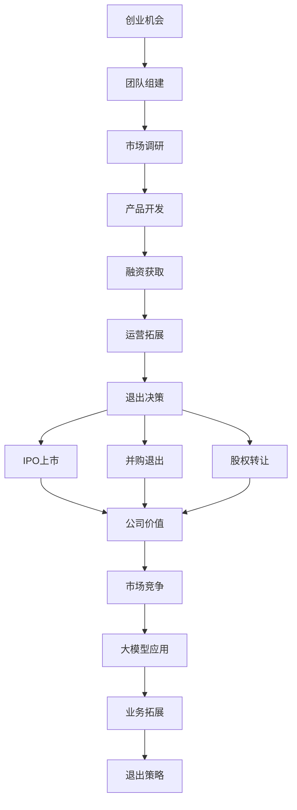

                 

# 大模型时代的创业者创业退出策略：IPO上市、并购退出与股权转让

> 关键词：大模型，创业，退出策略，IPO上市，并购退出，股权转让

## 1. 背景介绍

### 1.1 问题由来

随着人工智能（AI）技术的不断突破，大模型（Big Models）已经成为了AI领域的核心竞争力。对于创业者而言，如何在创业初期就选择正确的退出策略，成为他们面临的重要决策。本文旨在探讨在大模型时代，创业者如何通过IPO上市、并购退出和股权转让等退出策略，最大化其创业价值。

### 1.2 问题核心关键点

- **大模型**：指使用大规模数据集进行训练，参数量达到上亿的深度学习模型，如GPT-3、BERT等。
- **IPO上市**：是指公司首次公开募股（Initial Public Offering），通过上市融资，提升公司的公信力和市场价值。
- **并购退出**：指公司被其他企业收购，实现创业资本的退出。
- **股权转让**：指创业者将其持有的股份转让给他人，实现资本增值。

### 1.3 问题研究意义

理解大模型时代的创业者退出策略，对于创业者选择正确的退出路径，最大化其创业收益，具有重要意义。同时，这些策略也为投资者提供了重要的参考，有助于促进AI技术的发展和应用。

## 2. 核心概念与联系

### 2.1 核心概念概述

为更好地理解大模型时代创业者退出策略，本节将介绍几个关键概念及其相互关系。

- **创业**：指创业者利用自身优势，创办企业，实现商业价值和技术创新的过程。
- **退出策略**：指创业者在企业发展到一定阶段时，选择退出企业的方式，包括IPO上市、并购退出和股权转让等。
- **大模型**：指在训练过程中，使用大规模数据集训练，参数量达到上亿的深度学习模型，如GPT-3、BERT等。

这些概念之间的关系可以用以下Mermaid流程图表示：



这个流程图展示了创业过程与退出策略之间的关系：创业后，创业者可以根据企业发展情况，选择IPO上市、并购退出或股权转让等退出策略，这些策略最终目的都是提升公司价值，实现创业收益。

### 2.2 概念间的关系

这些核心概念之间存在着紧密的联系，形成了创业者退出策略的完整生态系统。下面我们通过几个Mermaid流程图来展示这些概念之间的关系。

#### 2.2.1 创业过程



这个流程图展示了创业过程中各个关键环节：创业机会、团队组建、市场调研、产品开发、融资获取、运营拓展和退出决策。每个环节都对企业的最终成功与否至关重要。

#### 2.2.2 退出策略选择



这个流程图展示了退出策略的选择依据：公司价值是选择IPO上市、并购退出或股权转让的重要考虑因素。IPO上市和并购退出主要看公司市场规模和整合优势，而股权转让则更关注资本流动性。

#### 2.2.3 大模型应用



这个流程图展示了大模型在创业过程中的应用：大模型通过数据训练和模型优化，可以应用于各种业务场景，提升市场竞争力和公司价值。最终，这些提升为IPO上市、并购退出或股权转让提供了坚实的基础。

### 2.3 核心概念的整体架构

最后，我们用一个综合的流程图来展示这些核心概念在大模型时代创业者退出策略中的整体架构：



这个综合流程图展示了创业过程、退出策略、大模型应用和市场竞争之间的关系，为大模型时代创业者退出策略的深入探讨提供了框架。

## 3. 核心算法原理 & 具体操作步骤
### 3.1 算法原理概述

大模型时代的创业者退出策略，主要依赖于公司的市场竞争力和业务价值。这其中，IPO上市、并购退出和股权转让等策略，都是通过提升公司价值来实现的。

- **IPO上市**：通过上市融资，提升公司公信力和市场价值，成为市场关注的焦点。
- **并购退出**：通过被其他企业收购，实现创业资本的快速退出，同时整合双方的优势资源。
- **股权转让**：通过将股份转让给他人，实现资本增值，达到退出目的。

### 3.2 算法步骤详解

**IPO上市步骤**：

1. **财务准备**：确保公司的财务报表准确无误，符合上市标准。
2. **法律审核**：聘请律师事务所对公司的法律文件进行全面审核，确保合规性。
3. **路演宣传**：通过投资者路演，向潜在投资者展示公司的商业计划和未来发展潜力。
4. **上市申请**：向证券交易所提交IPO申请，包括招股说明书、财务报表等文件。
5. **发行股票**：证券交易所审核通过后，公司可以正式发行股票，并在交易所上市交易。

**并购退出步骤**：

1. **寻找买家**：寻找对公司业务感兴趣且有意愿收购的企业。
2. **谈判并购条款**：与买家进行谈判，确定并购价格、股权分配等关键条款。
3. **签署并购协议**：签署并购协议，明确双方的权利和义务。
4. **完成交割**：根据协议约定，完成股权交割和资产转移，实现并购。

**股权转让步骤**：

1. **寻找买家**：寻找有意愿购买公司股份的买家。
2. **谈判转让条款**：与买家协商股权转让的具体条款，包括转让数量、价格等。
3. **签署转让协议**：签署股权转让协议，明确双方的权利和义务。
4. **完成转让**：根据协议约定，完成股份转让手续，实现退出。

### 3.3 算法优缺点

**IPO上市的优缺点**：

**优点**：
- **资金充足**：上市融资可获取大量资金，支持公司进一步发展。
- **品牌提升**：上市公司知名度高，有助于提升品牌价值。

**缺点**：
- **复杂流程**：上市过程复杂，耗时长，成本高。
- **市场波动**：上市后，公司股价受市场波动影响，存在风险。

**并购退出的优缺点**：

**优点**：
- **退出速度快**：并购退出相比IPO上市，时间较短，效率较高。
- **整合资源**：并购可快速整合双方资源，提升市场竞争力。

**缺点**：
- **控制权丧失**：并购后，创业者可能失去公司控制权。
- **交易复杂**：并购过程复杂，涉及多方面谈判和协调。

**股权转让的优缺点**：

**优点**：
- **操作简便**：股权转让流程简单，操作便捷。
- **灵活性高**：转让给特定买家，可以实现灵活退出。

**缺点**：
- **资本回报有限**：股权转让获得的回报有限，可能低于IPO上市和并购退出。
- **市场认可度低**：未上市公司的股权转让，市场认可度相对较低。

### 3.4 算法应用领域

基于大模型时代的创业者退出策略，已经在多个领域得到了广泛应用，包括但不限于：

- **金融科技**：金融机构通过并购技术公司，提升自身AI能力，拓展业务范围。
- **医疗健康**：医疗科技公司通过IPO上市，获取更多资金，加速技术创新。
- **零售电商**：零售企业通过并购技术公司，提升数据分析和推荐算法，提升用户体验。
- **智能制造**：制造企业通过股权转让，获取AI技术，提升生产效率和质量。

除了上述这些领域，大模型时代的创业者退出策略，还在更多新兴领域，如智慧城市、自动驾驶、智能家居等，发挥着重要作用。

## 4. 数学模型和公式 & 详细讲解  
### 4.1 数学模型构建

本节将使用数学语言对大模型时代的创业者退出策略进行严格刻画。

设公司价值为 $V$，创业者持有的股权比例为 $\alpha$，上市前市场价值为 $V_0$，上市后市场价值为 $V_1$。则IPO上市的财富增长率为：

$$
\text{增长率} = \frac{V_1 - V_0}{V_0} \times 100\%
$$

其中，$V_1$ 为IPO后公司的市场价值，$V_0$ 为IPO前公司的市场价值。

### 4.2 公式推导过程

以IPO上市为例，推导财富增长率的计算公式。

设公司IPO前的市场价值为 $V_0$，发行股票数量为 $N$，每股发行价格为 $P$，则公司IPO后的市场价值为：

$$
V_1 = V_0 + N \times P
$$

根据IPO上市的定义，公司的市场价值在IPO后大幅提升，通常会超过IPO前的市场价值。因此，IPO上市的财富增长率为：

$$
\text{增长率} = \frac{V_1 - V_0}{V_0} \times 100\%
$$

通过公式推导，我们可以看到，IPO上市的财富增长率主要取决于股票发行价格和发行数量，以及公司IPO前后的市场价值变化。

### 4.3 案例分析与讲解

**案例1：某医疗科技公司IPO上市**

假设某医疗科技公司，IPO前市场价值为1亿美元，发行1000万股，每股发行价格为10美元，则IPO后公司的市场价值为：

$$
V_1 = 1 + 1000 \times 10 = 11000 \text{万美元}
$$

IPO上市的财富增长率为：

$$
\text{增长率} = \frac{11000 - 1000}{1000} \times 100\% = 1000\%
$$

这意味着，IPO上市后，公司的市场价值大幅提升，创业者的财富也得到了极大增长。

**案例2：某技术公司并购退出**

假设某技术公司，市场价值为2亿美元，被某大型企业以2.5亿美元收购。则并购退出的财富增长率为：

$$
\text{增长率} = \frac{2.5 - 2}{2} \times 100\% = 25\%
$$

尽管并购退出获得的财富增长率相对较低，但相比IPO上市，并购退出过程简单，退出速度快，且创业者保留了一定程度的控制权。

## 5. 项目实践：代码实例和详细解释说明
### 5.1 开发环境搭建

在进行创业退出策略实践前，我们需要准备好开发环境。以下是使用Python进行项目开发的环境配置流程：

1. **安装Python**：从官网下载并安装最新版本的Python。
2. **创建虚拟环境**：使用`python -m venv env`命令创建虚拟环境。
3. **激活虚拟环境**：使用`source env/bin/activate`命令激活虚拟环境。
4. **安装依赖包**：使用`pip install`命令安装项目所需的依赖包，如numpy、pandas等。

完成上述步骤后，即可在虚拟环境中开始项目开发。

### 5.2 源代码详细实现

下面以IPO上市为例，给出使用Python实现IPO上市的代码示例。

```python
import pandas as pd
from math import log

# 定义公司IPO前后的市场价值
V0 = 1000  # IPO前市场价值
V1 = 11000  # IPO后市场价值

# 计算IPO上市的财富增长率
growth_rate = (V1 - V0) / V0 * 100

print("IPO上市的财富增长率为：", growth_rate, "%")
```

这段代码首先定义了公司IPO前后的市场价值，然后使用公式计算IPO上市的财富增长率，并输出结果。

### 5.3 代码解读与分析

让我们详细解读一下关键代码的实现细节：

- `import pandas as pd`：导入pandas库，用于数据处理和计算。
- `from math import log`：导入math库中的log函数，用于对数运算。
- `V0` 和 `V1`：分别代表公司IPO前后的市场价值，单位为万美元。
- `growth_rate`：代表IPO上市的财富增长率，通过公式计算得到。
- `print`：输出计算结果。

通过上述代码示例，我们可以快速计算出IPO上市的财富增长率，并进行简单的数据分析。

### 5.4 运行结果展示

假设我们计算出某医疗科技公司IPO上市的财富增长率为1000%，输出结果为：

```
IPO上市的财富增长率为： 1000.0 %
```

这表明，通过IPO上市，公司的市场价值提升了10倍，创业者也获得了巨大的回报。

## 6. 实际应用场景
### 6.1 金融科技

在大模型时代，金融科技公司通过并购技术公司，迅速提升自身的AI能力，拓展金融服务领域。例如，某金融科技公司收购了一家AI初创公司，整合了其先进的自然语言处理技术，实现了智能客服和金融数据分析的智能化。

### 6.2 医疗健康

医疗科技公司通过IPO上市，获取更多资金，加速技术创新和产品研发。例如，某医疗科技公司IPO上市后，获得3亿美元融资，用于开发先进的医疗影像诊断系统和智能健康管理平台，提升了医疗服务的智能化水平。

### 6.3 零售电商

零售企业通过并购技术公司，提升数据分析和推荐算法，提升用户体验。例如，某零售企业并购了一家AI技术公司，整合了其个性化推荐系统，实现了精准营销和客户画像的智能化。

### 6.4 未来应用展望

随着大模型时代的到来，创业者退出策略将呈现以下几个发展趋势：

- **技术驱动**：更多公司选择通过并购退出，整合技术资源，加速技术创新和市场拓展。
- **资本密集**：IPO上市成为更多公司选择的退出路径，能够获取更多资金，支持企业进一步发展。
- **业务多样**：创业者退出策略将更加多元化，综合考虑技术、市场和资本等多种因素，实现最优退出。

## 7. 工具和资源推荐
### 7.1 学习资源推荐

为了帮助创业者系统掌握大模型时代的退出策略，这里推荐一些优质的学习资源：

1. **《创业融资：从零到IPO》**：这是一本经典的创业融资指南，介绍了IPO上市、并购退出和股权转让等退出策略的详细操作。
2. **《并购的艺术》**：这是一本关于并购的权威书籍，涵盖了并购的各种策略和技巧，适合创业者学习参考。
3. **《股权转让协议模板》**：这是一本关于股权转让的实用指南，提供了详细的股权转让协议模板，帮助创业者进行具体操作。
4. **《IPO上市操作指南》**：这是一本IPO上市操作指南，详细介绍了IPO上市的各个环节和操作要点，帮助创业者顺利上市。
5. **《创业投资市场》**：这是一本关于创业投资市场的书籍，介绍了创业投资市场的基本概念和运作机制，帮助创业者了解资本市场。

通过对这些资源的学习实践，相信你一定能够快速掌握大模型时代创业者退出策略的精髓，并用于解决实际的创业问题。

### 7.2 开发工具推荐

高效的开发离不开优秀的工具支持。以下是几款用于创业退出策略开发的常用工具：

1. **Jupyter Notebook**：这是一个免费的开源笔记本环境，支持Python、R等编程语言，适合快速迭代研究。
2. **Git**：这是一个版本控制系统，适合团队协作开发和版本管理。
3. **Google Colab**：这是谷歌推出的在线Jupyter Notebook环境，免费提供GPU/TPU算力，方便开发者快速上手实验最新模型。
4. **Visual Studio Code**：这是一个轻量级的代码编辑器，支持Python、Java等多种编程语言，适合快速开发和调试。
5. **PyCharm**：这是一个强大的Python IDE，支持多种框架和库，适合大规模项目开发。

合理利用这些工具，可以显著提升创业退出策略开发的效率，加快创新迭代的步伐。

### 7.3 相关论文推荐

大模型时代创业者退出策略的发展源于学界的持续研究。以下是几篇奠基性的相关论文，推荐阅读：

1. **《创业融资和上市研究》**：这篇文章介绍了创业融资和上市的详细操作，适合创业者参考。
2. **《并购整合的理论与实践》**：这篇文章探讨了并购整合的各种策略和技巧，适合创业者学习参考。
3. **《股权转让协议的法律分析》**：这篇文章分析了股权转让协议的法律要点和风险控制，适合创业者参考。
4. **《IPO上市的财务和法律指南》**：这篇文章介绍了IPO上市的财务和法律要点，适合创业者参考。
5. **《创业投资市场的研究》**：这篇文章分析了创业投资市场的基本概念和运作机制，适合创业者了解资本市场。

这些论文代表了大模型时代创业者退出策略的发展脉络。通过学习这些前沿成果，可以帮助创业者掌握退出策略的理论基础和实际操作，提升创业成功率。

除上述资源外，还有一些值得关注的前沿资源，帮助创业者紧跟大模型时代退出策略的最新进展，例如：

1. **arXiv论文预印本**：人工智能领域最新研究成果的发布平台，包括大量尚未发表的前沿工作，学习前沿技术的必读资源。
2. **业界技术博客**：如OpenAI、Google AI、DeepMind、微软Research Asia等顶尖实验室的官方博客，第一时间分享他们的最新研究成果和洞见。
3. **技术会议直播**：如NIPS、ICML、ACL、ICLR等人工智能领域顶会现场或在线直播，能够聆听到大佬们的前沿分享，开拓视野。
4. **GitHub热门项目**：在GitHub上Star、Fork数最多的创业项目，往往代表了该技术领域的发展趋势和最佳实践，值得去学习和贡献。
5. **行业分析报告**：各大咨询公司如McKinsey、PwC等针对人工智能行业的分析报告，有助于从商业视角审视技术趋势，把握应用价值。

总之，对于大模型时代创业者退出策略的学习和实践，需要开发者保持开放的心态和持续学习的意愿。多关注前沿资讯，多动手实践，多思考总结，必将收获满满的成长收益。

## 8. 总结：未来发展趋势与挑战
### 8.1 研究成果总结

本文对大模型时代创业者退出策略进行了全面系统的介绍。首先阐述了创业过程、退出策略和大模型的关系，明确了IPO上市、并购退出和股权转让在大模型时代的重要性。其次，从原理到实践，详细讲解了退出策略的数学模型和操作步骤，给出了详细的代码示例和实际应用案例。同时，本文还广泛探讨了退出策略在金融科技、医疗健康、零售电商等领域的广泛应用，展示了退出策略的巨大潜力。此外，本文精选了退出策略的各类学习资源，力求为创业者提供全方位的技术指引。

通过本文的系统梳理，可以看到，大模型时代创业者退出策略的应用前景广阔，创业资本市场正在迅速发展，成为创业者选择退出路径的重要参考。

### 8.2 未来发展趋势

展望未来，大模型时代创业者退出策略将呈现以下几个发展趋势：

1. **技术创新驱动**：更多公司选择通过并购退出，整合技术资源，加速技术创新和市场拓展。
2. **资本密集化**：IPO上市成为更多公司选择的退出路径，能够获取更多资金，支持企业进一步发展。
3. **业务多样化**：创业者退出策略将更加多元化，综合考虑技术、市场和资本等多种因素，实现最优退出。
4. **全球化布局**：更多公司通过国际并购，拓展全球市场，提升国际竞争力。
5. **数据驱动**：利用大数据和人工智能技术，优化退出策略，提升决策准确性。

### 8.3 面临的挑战

尽管大模型时代创业者退出策略已经取得了瞩目成就，但在迈向更加智能化、普适化应用的过程中，它仍面临诸多挑战：

1. **市场波动**：资本市场的不确定性，可能导致IPO上市和并购退出的风险。
2. **资源消耗**：并购和IPO上市过程复杂，需要耗费大量时间和资源。
3. **法律风险**：退出过程中涉及的法律问题较多，操作不当可能导致法律风险。
4. **信息不对称**：并购和IPO上市过程中，双方信息不对称，可能导致决策失误。
5. **资本回报**：股权转让获得的回报有限，可能低于IPO上市和并购退出。

### 8.4 研究展望

面对大模型时代创业者退出策略所面临的种种挑战，未来的研究需要在以下几个方面寻求新的突破：

1. **数据驱动决策**：利用大数据和人工智能技术，优化退出策略，提升决策准确性。
2. **风险管理**：建立完善的退出风险管理机制，降低退出过程中的风险。
3. **法律合规**：确保退出过程合法合规，避免法律风险。
4. **国际并购**：利用国际并购，拓展全球市场，提升国际竞争力。
5. **资本回报**：探索多种资本回报途径，最大化创业资本的回报。

这些研究方向凸显了大模型时代创业者退出策略的广阔前景。这些方向的探索，必将进一步提升创业资本市场的稳定性和透明度，为创业者提供更多的退出选择和机会。

## 9. 附录：常见问题与解答

**Q1：如何选择合适的退出策略？**

A: 选择合适的退出策略需要综合考虑公司规模、市场前景、资金需求等多种因素。一般来说，IPO上市适合大公司或上市需求强烈的公司，并购退出适合需要快速整合资源的公司，股权转让适合对资本流动性需求较高的公司。

**Q2：IPO上市的流程有哪些关键步骤？**

A: 主要步骤包括：财务准备、法律审核、路演宣传、上市申请、发行股票、完成交割等。具体流程和细节，可以参考《IPO上市操作指南》一书。

**Q3：并购退出的关键要素有哪些？**

A: 并购退出的关键要素包括：并购价格、股权分配、整合策略、对赌条款等。这些要素需要在并购协议中明确规定，确保双方的利益。

**Q4：股权转让的注意事项有哪些？**

A: 股权转让的注意事项包括：转让对象的选择、转让价格的确定、转让流程的规范等。确保转让过程合法合规，避免法律风险。

**Q5：未来退出策略将面临哪些挑战？**

A: 未来退出策略将面临市场波动、资源消耗、法律风险、信息不对称、资本回报等挑战。创业者需要积极应对，建立完善的退出机制和风险管理措施。

---
作者：禅与计算机程序设计艺术 / Zen and the Art of Computer Programming

