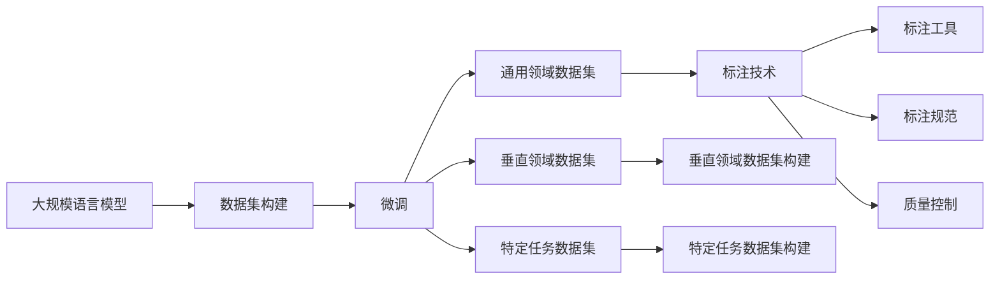
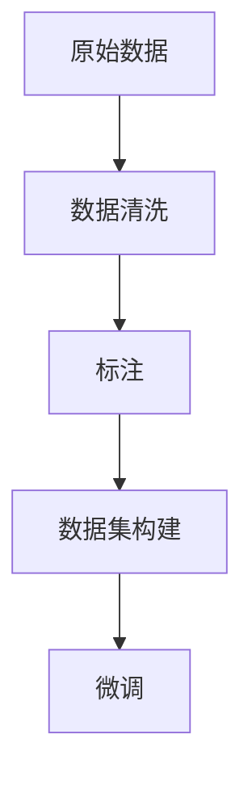
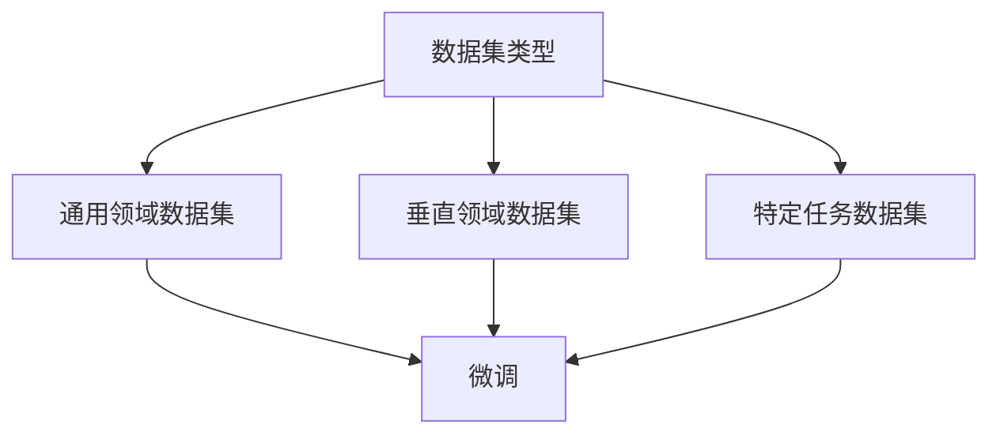
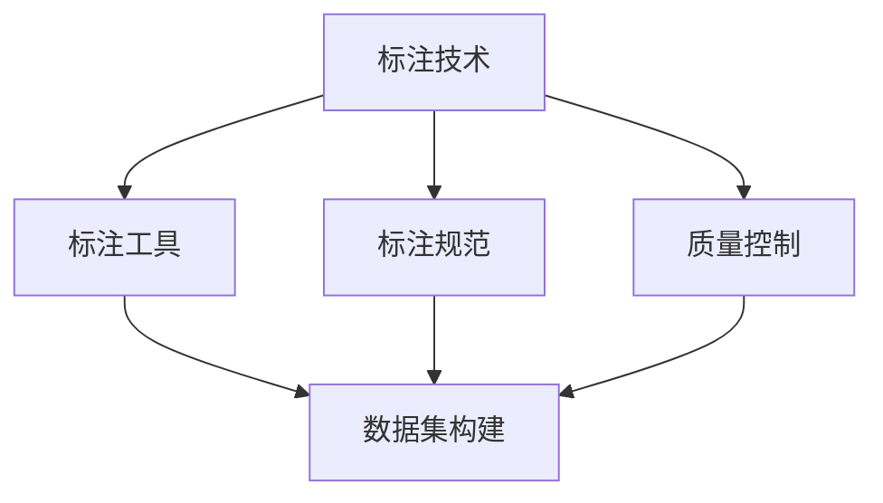
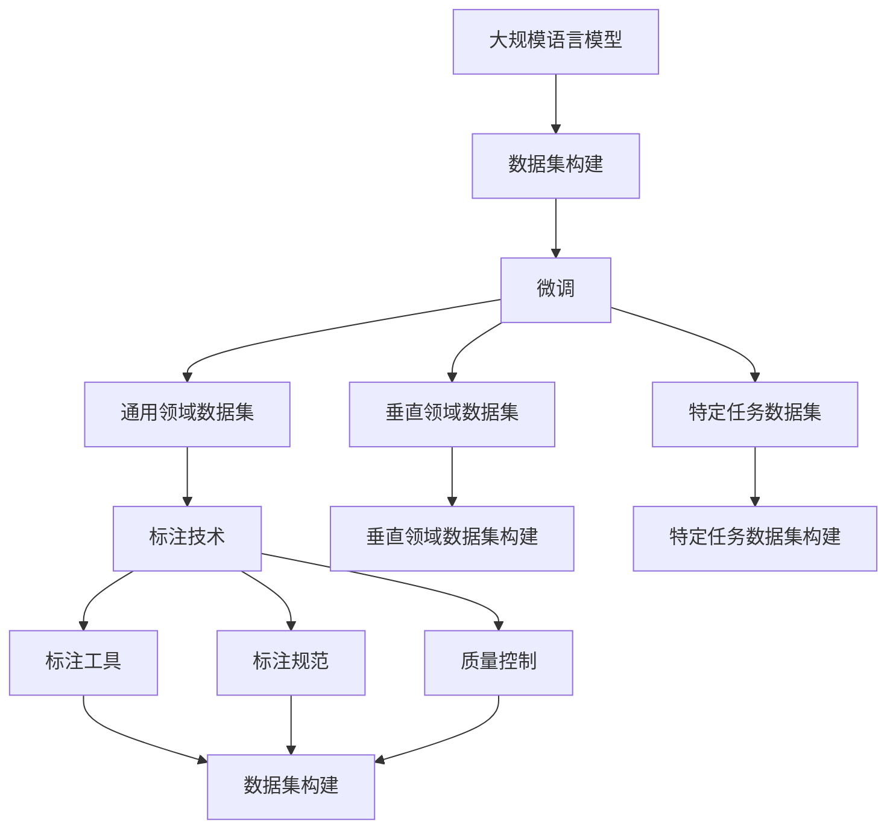

                 

# 大规模语言模型从理论到实践 数据来源

> 关键词：大规模语言模型,理论到实践,数据来源,数据集构建,深度学习,自然语言处理(NLP)

## 1. 背景介绍

### 1.1 问题由来
在近年来，随着深度学习技术的飞速发展，大规模语言模型（Large Language Models, LLMs）在自然语言处理（NLP）领域取得了突破性进展。这些模型通过在大规模无标签文本数据上进行预训练，学习到了丰富的语言知识和常识。预训练后的大模型如GPT、BERT等，在各种NLP任务上表现优异，但实际应用中需要根据具体任务进行调整，这就是微调（Fine-tuning）。

微调涉及将预训练模型应用于特定任务，通过少量有标签数据调整模型参数，使其在特定任务上表现更佳。为了保证微调的精度和效果，选择合适的数据集至关重要。本文将系统介绍大规模语言模型从理论到实践中的数据来源，包括数据集的构建和应用，以帮助开发者更好地利用大模型进行微调。

### 1.2 问题核心关键点
数据来源是微调成功的关键因素之一。理想的数据集应具备以下特点：
1. 与任务相关的标注数据：提供足够的样本，以便模型在特定任务上学习。
2. 高质量和多样性：数据标注应准确，数据应涵盖多种语境和场景。
3. 规模适中：既要足够大以涵盖不同情况，也要避免过拟合。
4. 可获取性：数据集应易于获取，以便进行微调实验。

本文将详细介绍如何构建和选择适合微调的数据集，以及这些数据集在实际应用中的表现和优化方法。

### 1.3 问题研究意义
构建高质量的数据集对于大规模语言模型微调至关重要。高质量的数据集能显著提升模型性能，减少过拟合风险，帮助模型更好地适应实际应用场景。因此，数据来源是模型微调研究的重要组成部分，有助于推动NLP技术的实际应用和产业化进程。

## 2. 核心概念与联系

### 2.1 核心概念概述

为了更好地理解大规模语言模型从理论到实践中的数据来源，我们需要理解几个关键概念：

- 大规模语言模型（LLMs）：以自回归（如GPT）或自编码（如BERT）模型为代表，通过在大规模无标签文本语料上进行预训练，学习通用语言表示的模型。
- 数据集构建：指从原始数据中提取、清洗和标注数据，构建可用于微调的数据集的过程。
- 微调（Fine-tuning）：在预训练模型的基础上，使用下游任务的少量标注数据，通过有监督学习优化模型在特定任务上的性能。
- 数据集类型：包括通用领域数据集、垂直领域数据集、特定任务数据集等。
- 标注技术：涉及数据标注工具、标注规范和质量控制等。
- 数据集分割：将数据集划分为训练集、验证集和测试集，以便评估模型性能和优化模型参数。

这些概念之间的关系通过以下Mermaid流程图展示：



这个流程图展示了大规模语言模型从预训练到微调的数据集构建过程，以及数据集的类型和标注技术。

### 2.2 概念间的关系

这些核心概念之间的关系紧密，形成了从预训练到微调的完整生态系统。以下是几个关键的关系图：

#### 2.2.1 数据集构建与微调的关系



这个图展示了数据集构建的基本流程：从原始数据到数据清洗、标注，最终构建出可用于微调的数据集。

#### 2.2.2 数据集类型与微调的关系



这个图展示了数据集类型与微调的关系：通用领域数据集适用于广泛任务，垂直领域数据集和特定任务数据集则更针对特定领域或任务。

#### 2.2.3 标注技术与数据集的关系



这个图展示了标注技术与数据集构建的关系：标注技术包括标注工具、标注规范和质量控制，直接影响数据集的质量和适用性。

### 2.3 核心概念的整体架构

最后，我们用一个综合的流程图来展示这些核心概念在大规模语言模型微调过程中的整体架构：



这个综合流程图展示了从预训练到微调的数据集构建过程，以及数据集的类型和标注技术。

## 3. 核心算法原理 & 具体操作步骤
### 3.1 算法原理概述

大规模语言模型从理论到实践中的数据来源，涉及预训练和微调两个主要阶段。预训练阶段，模型在大规模无标签文本数据上学习通用语言知识，而微调阶段则通过下游任务的标注数据调整模型参数，以适应特定任务。

预训练和微调的核心算法原理可概括为：

1. **预训练算法**：在无标签数据上，通过自监督任务（如掩码语言模型、下一句子预测等）训练模型。

2. **微调算法**：在有标签数据上，通过监督学习任务调整模型参数，使模型在特定任务上表现更佳。

微调的基本流程如下：

1. **数据集准备**：收集并准备适合特定任务的数据集。
2. **模型加载**：加载预训练模型。
3. **数据预处理**：对数据进行标准化和格式转换。
4. **模型微调**：在有标签数据上微调模型参数。
5. **评估与优化**：在验证集和测试集上评估模型性能，并进行参数优化。

### 3.2 算法步骤详解

下面是具体的操作流程：

**Step 1: 准备数据集**
- 收集数据集，并确保数据质量。
- 对数据进行清洗和预处理，如去除噪声、标准化格式等。
- 将数据集分割为训练集、验证集和测试集。

**Step 2: 加载预训练模型**
- 选择适合的预训练模型，如BERT、GPT等。
- 加载预训练模型的权重。

**Step 3: 数据预处理**
- 将数据集转换为模型所需的格式。
- 对文本数据进行分词、编码等处理。
- 对标注数据进行标准化处理。

**Step 4: 微调模型**
- 将数据集输入模型，计算损失函数。
- 反向传播计算梯度，更新模型参数。
- 循环训练，直到达到预设的迭代次数或损失函数收敛。

**Step 5: 评估与优化**
- 在验证集上评估模型性能。
- 根据验证集表现调整学习率和训练参数。
- 在测试集上最终评估模型性能。

### 3.3 算法优缺点

**优点**：
- 数据集构建简单高效，可重复使用。
- 微调过程快速，适用于各种NLP任务。
- 模型效果好，适用于多领域应用。

**缺点**：
- 数据集构建成本高，需要大量人力物力。
- 数据标注质量直接影响微调效果。
- 模型易过拟合，需要定期更新数据集。

### 3.4 算法应用领域

大规模语言模型微调在多个领域有广泛应用，包括：

- 自然语言理解：如命名实体识别、情感分析、问答系统等。
- 自然语言生成：如文本生成、对话生成、摘要生成等。
- 机器翻译：将源语言文本翻译成目标语言。
- 文本分类：如新闻分类、产品评论分类等。
- 信息检索：如检索系统、问答系统等。
- 语音识别与生成：如语音到文本转换、文本到语音合成等。

## 4. 数学模型和公式 & 详细讲解  
### 4.1 数学模型构建

在微调过程中，构建数学模型是关键步骤。我们以二分类任务为例，展示模型的构建过程。

设预训练模型为 $M_{\theta}$，其中 $\theta$ 为预训练参数。微调任务的数据集为 $D=\{(x_i,y_i)\}_{i=1}^N$，其中 $x_i$ 为输入，$y_i$ 为标签。

定义模型 $M_{\theta}$ 在输入 $x_i$ 上的输出为 $\hat{y}_i=M_{\theta}(x_i)$，则二分类任务下的交叉熵损失函数为：

$$
\ell(M_{\theta}(x_i),y_i) = -[y_i\log \hat{y}_i + (1-y_i)\log (1-\hat{y}_i)]
$$

在微调过程中，目标是最小化损失函数：

$$
\mathcal{L}(\theta) = \frac{1}{N}\sum_{i=1}^N \ell(M_{\theta}(x_i),y_i)
$$

模型更新公式为：

$$
\theta \leftarrow \theta - \eta \nabla_{\theta}\mathcal{L}(\theta)
$$

其中 $\eta$ 为学习率。

### 4.2 公式推导过程

以二分类任务为例，推导微调模型的损失函数和梯度更新公式。

设模型输出为 $\hat{y}_i=M_{\theta}(x_i)$，则交叉熵损失函数为：

$$
\ell(M_{\theta}(x_i),y_i) = -[y_i\log \hat{y}_i + (1-y_i)\log (1-\hat{y}_i)]
$$

代入样本平均损失函数：

$$
\mathcal{L}(\theta) = -\frac{1}{N}\sum_{i=1}^N [y_i\log M_{\theta}(x_i)+(1-y_i)\log(1-M_{\theta}(x_i))]
$$

计算梯度：

$$
\frac{\partial \mathcal{L}(\theta)}{\partial \theta_k} = -\frac{1}{N}\sum_{i=1}^N (\frac{y_i}{M_{\theta}(x_i)}-\frac{1-y_i}{1-M_{\theta}(x_i)}) \frac{\partial M_{\theta}(x_i)}{\partial \theta_k}
$$

其中 $\frac{\partial M_{\theta}(x_i)}{\partial \theta_k}$ 为模型的参数梯度。

### 4.3 案例分析与讲解

以情感分析任务为例，展示如何使用微调模型处理情感数据。

**Step 1: 数据集准备**
- 收集情感数据集，如IMDB电影评论数据集。
- 将数据集分割为训练集、验证集和测试集。

**Step 2: 加载预训练模型**
- 选择BERT作为预训练模型，加载其预训练权重。

**Step 3: 数据预处理**
- 对评论进行分词、去停用词、标准化等处理。
- 将处理后的文本转换为模型所需的格式。

**Step 4: 微调模型**
- 将训练集输入模型，计算损失函数。
- 反向传播计算梯度，更新模型参数。
- 循环训练，直到损失函数收敛。

**Step 5: 评估与优化**
- 在验证集上评估模型性能。
- 根据验证集表现调整学习率和训练参数。
- 在测试集上最终评估模型性能。

## 5. 项目实践：代码实例和详细解释说明
### 5.1 开发环境搭建

在进行微调实践前，我们需要准备好开发环境。以下是使用Python进行PyTorch开发的环境配置流程：

1. 安装Anaconda：从官网下载并安装Anaconda，用于创建独立的Python环境。

2. 创建并激活虚拟环境：
```bash
conda create -n pytorch-env python=3.8 
conda activate pytorch-env
```

3. 安装PyTorch：根据CUDA版本，从官网获取对应的安装命令。例如：
```bash
conda install pytorch torchvision torchaudio cudatoolkit=11.1 -c pytorch -c conda-forge
```

4. 安装Transformers库：
```bash
pip install transformers
```

5. 安装各类工具包：
```bash
pip install numpy pandas scikit-learn matplotlib tqdm jupyter notebook ipython
```

完成上述步骤后，即可在`pytorch-env`环境中开始微调实践。

### 5.2 源代码详细实现

下面是使用PyTorch和Transformers库进行情感分析任务微调的代码实现。

```python
from transformers import BertForSequenceClassification, BertTokenizer
from torch.utils.data import Dataset, DataLoader
import torch
from sklearn.model_selection import train_test_split

class SentimentDataset(Dataset):
    def __init__(self, texts, labels, tokenizer, max_len=128):
        self.texts = texts
        self.labels = labels
        self.tokenizer = tokenizer
        self.max_len = max_len
        
    def __len__(self):
        return len(self.texts)
    
    def __getitem__(self, item):
        text = self.texts[item]
        label = self.labels[item]
        
        encoding = self.tokenizer(text, return_tensors='pt', max_length=self.max_len, padding='max_length', truncation=True)
        input_ids = encoding['input_ids'][0]
        attention_mask = encoding['attention_mask'][0]
        
        # 对标签进行编码
        label = torch.tensor(label, dtype=torch.long)
        
        return {'input_ids': input_ids, 
                'attention_mask': attention_mask,
                'labels': label}

# 加载情感数据集
from datasets import load_dataset
dataset = load_dataset('imdb_reviews', 'full')
train_texts, train_labels = dataset['train'].column('text'), dataset['train'].column('label')
test_texts, test_labels = dataset['test'].column('text'), dataset['test'].column('label')

# 构建数据集
tokenizer = BertTokenizer.from_pretrained('bert-base-uncased')
train_dataset = SentimentDataset(train_texts, train_labels, tokenizer)
test_dataset = SentimentDataset(test_texts, test_labels, tokenizer)

# 划分数据集
train_texts, val_texts, train_labels, val_labels = train_test_split(train_texts, train_labels, test_size=0.1, random_state=42)
train_dataset = SentimentDataset(train_texts, train_labels, tokenizer)
val_dataset = SentimentDataset(val_texts, val_labels, tokenizer)

# 加载模型和优化器
from transformers import AdamW
model = BertForSequenceClassification.from_pretrained('bert-base-uncased', num_labels=2)
optimizer = AdamW(model.parameters(), lr=2e-5)

# 训练模型
device = torch.device('cuda') if torch.cuda.is_available() else torch.device('cpu')
model.to(device)
for epoch in range(3):
    model.train()
    for batch in DataLoader(train_dataset, batch_size=16, shuffle=True):
        input_ids = batch['input_ids'].to(device)
        attention_mask = batch['attention_mask'].to(device)
        labels = batch['labels'].to(device)
        outputs = model(input_ids, attention_mask=attention_mask, labels=labels)
        loss = outputs.loss
        loss.backward()
        optimizer.step()

    # 评估模型
    model.eval()
    with torch.no_grad():
        predictions, labels = [], []
        for batch in DataLoader(val_dataset, batch_size=16):
            input_ids = batch['input_ids'].to(device)
            attention_mask = batch['attention_mask'].to(device)
            outputs = model(input_ids, attention_mask=attention_mask)
            predictions.append(outputs.logits.argmax(dim=1).tolist())
            labels.append(batch['labels'].tolist())
        
        accuracy = (predictions == labels).mean().item()
        print(f"Epoch {epoch+1}, validation accuracy: {accuracy:.3f}")

print("Test results:")
with torch.no_grad():
    predictions, labels = [], []
    for batch in DataLoader(test_dataset, batch_size=16):
        input_ids = batch['input_ids'].to(device)
        attention_mask = batch['attention_mask'].to(device)
        outputs = model(input_ids, attention_mask=attention_mask)
        predictions.append(outputs.logits.argmax(dim=1).tolist())
        labels.append(batch['labels'].tolist())
    
    accuracy = (predictions == labels).mean().item()
    print(f"Test accuracy: {accuracy:.3f}")
```

### 5.3 代码解读与分析

**SentimentDataset类**：
- `__init__`方法：初始化文本、标签、分词器等关键组件。
- `__len__`方法：返回数据集的样本数量。
- `__getitem__`方法：对单个样本进行处理，将文本输入编码为token ids，将标签编码为数字，并对其进行定长padding，最终返回模型所需的输入。

**数据集划分**：
- 使用`train_test_split`方法将训练集和验证集进行划分，确保数据集的多样性和稳定性。

**模型训练**：
- 定义模型和优化器。
- 将数据集加载到GPU/TPU上，进行迭代训练。
- 在每个epoch结束时，在验证集上评估模型性能。

**评估与测试**：
- 在测试集上最终评估模型性能。
- 使用准确率作为评估指标。

可以看到，使用PyTorch和Transformers库，情感分析任务的微调实现相当简洁高效。开发者可以将更多精力放在数据处理、模型改进等高层逻辑上，而不必过多关注底层的实现细节。

## 6. 实际应用场景
### 6.1 智能客服系统

基于大语言模型微调的对话技术，可以广泛应用于智能客服系统的构建。传统客服往往需要配备大量人力，高峰期响应缓慢，且一致性和专业性难以保证。而使用微调后的对话模型，可以7x24小时不间断服务，快速响应客户咨询，用自然流畅的语言解答各类常见问题。

在技术实现上，可以收集企业内部的历史客服对话记录，将问题和最佳答复构建成监督数据，在此基础上对预训练对话模型进行微调。微调后的对话模型能够自动理解用户意图，匹配最合适的答案模板进行回复。对于客户提出的新问题，还可以接入检索系统实时搜索相关内容，动态组织生成回答。如此构建的智能客服系统，能大幅提升客户咨询体验和问题解决效率。

### 6.2 金融舆情监测

金融机构需要实时监测市场舆论动向，以便及时应对负面信息传播，规避金融风险。传统的人工监测方式成本高、效率低，难以应对网络时代海量信息爆发的挑战。基于大语言模型微调的文本分类和情感分析技术，为金融舆情监测提供了新的解决方案。

具体而言，可以收集金融领域相关的新闻、报道、评论等文本数据，并对其进行主题标注和情感标注。在此基础上对预训练语言模型进行微调，使其能够自动判断文本属于何种主题，情感倾向是正面、中性还是负面。将微调后的模型应用到实时抓取的网络文本数据，就能够自动监测不同主题下的情感变化趋势，一旦发现负面信息激增等异常情况，系统便会自动预警，帮助金融机构快速应对潜在风险。

### 6.3 个性化推荐系统

当前的推荐系统往往只依赖用户的历史行为数据进行物品推荐，无法深入理解用户的真实兴趣偏好。基于大语言模型微调技术，个性化推荐系统可以更好地挖掘用户行为背后的语义信息，从而提供更精准、多样的推荐内容。

在实践中，可以收集用户浏览、点击、评论、分享等行为数据，提取和用户交互的物品标题、描述、标签等文本内容。将文本内容作为模型输入，用户的后续行为（如是否点击、购买等）作为监督信号，在此基础上微调预训练语言模型。微调后的模型能够从文本内容中准确把握用户的兴趣点。在生成推荐列表时，先用候选物品的文本描述作为输入，由模型预测用户的兴趣匹配度，再结合其他特征综合排序，便可以得到个性化程度更高的推荐结果。

### 6.4 未来应用展望

随着大语言模型微调技术的发展，基于微调范式将在更多领域得到应用，为传统行业带来变革性影响。

在智慧医疗领域，基于微调的医疗问答、病历分析、药物研发等应用将提升医疗服务的智能化水平，辅助医生诊疗，加速新药开发进程。

在智能教育领域，微调技术可应用于作业批改、学情分析、知识推荐等方面，因材施教，促进教育公平，提高教学质量。

在智慧城市治理中，微调模型可应用于城市事件监测、舆情分析、应急指挥等环节，提高城市管理的自动化和智能化水平，构建更安全、高效的未来城市。

此外，在企业生产、社会治理、文娱传媒等众多领域，基于大模型微调的人工智能应用也将不断涌现，为经济社会发展注入新的动力。相信随着技术的日益成熟，微调方法将成为人工智能落地应用的重要范式，推动人工智能技术向更广阔的领域加速渗透。

## 7. 工具和资源推荐
### 7.1 学习资源推荐

为了帮助开发者系统掌握大规模语言模型微调的理论基础和实践技巧，这里推荐一些优质的学习资源：

1. 《Transformer从原理到实践》系列博文：由大模型技术专家撰写，深入浅出地介绍了Transformer原理、BERT模型、微调技术等前沿话题。

2. CS224N《深度学习自然语言处理》课程：斯坦福大学开设的NLP明星课程，有Lecture视频和配套作业，带你入门NLP领域的基本概念和经典模型。

3. 《Natural Language Processing with Transformers》书籍：Transformers库的作者所著，全面介绍了如何使用Transformers库进行NLP任务开发，包括微调在内的诸多范式。

4. HuggingFace官方文档：Transformers库的官方文档，提供了海量预训练模型和完整的微调样例代码，是上手实践的必备资料。

5. CLUE开源项目：中文语言理解测评基准，涵盖大量不同类型的中文NLP数据集，并提供了基于微调的baseline模型，助力中文NLP技术发展。

通过对这些资源的学习实践，相信你一定能够快速掌握大规模语言模型微调的精髓，并用于解决实际的NLP问题。
###  7.2 开发工具推荐

高效的开发离不开优秀的工具支持。以下是几款用于大规模语言模型微调开发的常用工具：

1. PyTorch：基于Python的开源深度学习框架，灵活动态的计算图，适合快速迭代研究。大部分预训练语言模型都有PyTorch版本的实现。

2. TensorFlow：由Google主导开发的开源深度学习框架，生产部署方便，适合大规模工程应用。同样有丰富的预训练语言模型资源。

3. Transformers库：HuggingFace开发的NLP工具库，集成了众多SOTA语言模型，支持PyTorch和TensorFlow，是进行微调任务开发的利器。

4. Weights & Biases：模型训练的实验跟踪工具，可以记录和可视化模型训练过程中的各项指标，方便对比和调优。与主流深度学习框架无缝集成。

5. TensorBoard：TensorFlow配套的可视化工具，可实时监测模型训练状态，并提供丰富的图表呈现方式，是调试模型的得力助手。

6. Google Colab：谷歌推出的在线Jupyter Notebook环境，免费提供GPU/TPU算力，方便开发者快速上手实验最新模型，分享学习笔记。

合理利用这些工具，可以显著提升大规模语言模型微调任务的开发效率，加快创新迭代的步伐。

### 7.3 相关论文推荐

大语言模型和微调技术的发展源于学界的持续研究。以下是几篇奠基性的相关论文，推荐阅读：

1. Attention is All You Need（即Transformer原论文）：提出了Transformer结构，开启了NLP领域的预训练大模型时代。

2. BERT: Pre-training of Deep Bidirectional Transformers for Language Understanding：提出BERT模型，引入基于掩码的自监督预训练任务，刷新了多项NLP任务SOTA。

3. Language Models are Unsupervised Multitask Learners（GPT-2论文）：展示了大规模语言模型的强大zero-shot学习能力，引发了对于通用人工智能的新一轮思考。

4. Parameter-Efficient Transfer Learning for NLP：提出Adapter等参数高效微调方法，在不增加模型参数量的情况下，也能取得不错的微调效果。

5. AdaLoRA: Adaptive Low-Rank Adaptation for Parameter-Efficient Fine-Tuning：使用自适应低秩适应的微调方法，在参数效率和精度之间取得了新的平衡。

这些论文代表了大语言模型微调技术的发展脉络。通过学习这些前沿成果，可以帮助研究者把握学科前进方向，激发更多的创新

