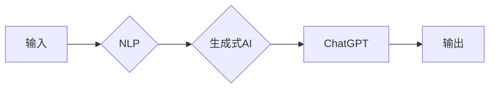

# AIGC从入门到实战：测试：ChatGPT 能扮演什么角色？

> 关键词：AIGC，人工智能生成内容，ChatGPT，自然语言处理，大语言模型，NLP，机器学习，生成式AI，文本生成，对话系统

## 1. 背景介绍

随着人工智能技术的飞速发展，人工智能生成内容（Artificial Intelligence Generated Content，AIGC）已经成为一个备受关注的热点领域。AIGC技术通过机器学习算法，能够自动生成文本、图像、音频、视频等多种类型的内容，为内容创作、媒体生产、娱乐娱乐等领域带来了革命性的变革。ChatGPT，作为OpenAI推出的基于GPT-3.5模型的对话系统，是AIGC领域的重要代表之一。本文将深入探讨ChatGPT的核心概念、工作原理、应用场景，并展望其未来的发展趋势与挑战。

## 2. 核心概念与联系

### 2.1 AIGC

AIGC是一种利用人工智能技术自动生成内容的范式，其核心思想是通过机器学习算法，让机器具备创作内容的能力。AIGC技术涉及多个领域，包括自然语言处理（NLP）、计算机视觉、音乐生成等。

### 2.2 ChatGPT

ChatGPT是OpenAI于2022年11月推出的一个基于GPT-3.5模型的对话系统。它能够理解自然语言输入，并根据输入生成符合逻辑、具有创造性的自然语言输出。

### 2.3 Mermaid 流程图

以下是一个简化的Mermaid流程图，展示了AIGC和ChatGPT的概念关系：



在这个流程图中，用户输入经过自然语言处理模块处理，然后由生成式AI模块生成内容，最终生成的内容通过ChatGPT系统输出。

## 3. 核心算法原理 & 具体操作步骤

### 3.1 算法原理概述

ChatGPT的工作原理主要基于预训练的大语言模型GPT-3.5。GPT-3.5是一个基于Transformer架构的深度学习模型，通过在大量文本语料上进行预训练，学习到了丰富的语言知识和表达方式。

### 3.2 算法步骤详解

1. **预训练**：GPT-3.5在大量无标签文本语料上进行预训练，学习语言模式和规律。
2. **输入处理**：ChatGPT接收用户输入，进行分词、词性标注等NLP处理。
3. **上下文生成**：根据输入和预训练知识，GPT-3.5生成上下文信息。
4. **回复生成**：GPT-3.5根据上下文信息生成符合逻辑、具有创造性的回复。
5. **回复优化**：根据用户反馈和预训练知识，优化回复内容。

### 3.3 算法优缺点

**优点**：

- **强大的语言理解能力**：ChatGPT能够理解复杂的自然语言输入，并生成相应的回复。
- **丰富的知识储备**：基于GPT-3.5的强大能力，ChatGPT具有丰富的知识储备，能够回答各种问题。
- **自然流畅的回复**：ChatGPT生成的回复自然流畅，具有较好的可读性。

**缺点**：

- **生成内容的质量参差不齐**：由于预训练语料和算法的限制，ChatGPT生成的回复质量可能存在波动。
- **可能生成有害内容**：如果预训练语料中存在偏见、歧视等有害信息，ChatGPT可能生成相应的内容。
- **过度依赖预训练数据**：ChatGPT的性能很大程度上依赖于预训练语料的质量和数量。

### 3.4 算法应用领域

ChatGPT的应用领域非常广泛，包括但不限于：

- **智能客服**：为用户提供24/7的在线客服服务，解答用户问题。
- **聊天机器人**：与用户进行自然语言对话，提供个性化服务。
- **内容生成**：生成新闻、文章、故事等文本内容。
- **辅助创作**：为创作者提供灵感，辅助创作音乐、诗歌、剧本等。

## 4. 数学模型和公式 & 详细讲解 & 举例说明

### 4.1 数学模型构建

ChatGPT的核心模型是GPT-3.5，其数学模型基于Transformer架构。Transformer架构是一种基于自注意力机制的深度学习模型，其核心思想是将输入序列中的每个元素与所有其他元素进行加权求和。

### 4.2 公式推导过程

Transformer的数学模型可以表示为：

$$
\text{output} = \text{softmax}(\text{W}_{\text{output}} \text{. tanh}(\text{W}_{\text{self-attention}} \cdot (\text{query} \times \text{k}^T) + \text{W}_{\text{self-attention}} \cdot (\text{value} \times \text{v}^T) + \text{W}_{\text{feed-forward}} \cdot \text{hidden})) + \text{layer normalization}
$$

其中，$\text{query}$、$\text{key}$、$\text{value}$ 分别表示查询、键、值向量，$\text{W}_{\text{self-attention}}$、$\text{W}_{\text{output}}$、$\text{W}_{\text{feed-forward}}$ 分别表示自注意力层、输出层、前馈神经网络的权重矩阵。

### 4.3 案例分析与讲解

以下是一个简单的ChatGPT应用案例：

**输入**：你好，我想了解ChatGPT的应用场景。

**输出**：ChatGPT的应用场景非常广泛，包括智能客服、聊天机器人、内容生成、辅助创作等。

这个案例展示了ChatGPT在理解用户输入和生成自然语言回复方面的能力。

## 5. 项目实践：代码实例和详细解释说明

### 5.1 开发环境搭建

要使用ChatGPT，首先需要安装以下软件：

- Python 3.8及以上版本
- Transformers库
- OpenAI API密钥

### 5.2 源代码详细实现

以下是一个使用Python和Transformers库实现ChatGPT的简单示例：

```python
from transformers import pipeline

# 加载预训练模型
nlp = pipeline("text-generation", model="gpt-3.5-turbo", tokenizer="gpt-3.5-turbo")

# 用户输入
user_input = "你好，我想了解ChatGPT的应用场景。"

# 生成回复
response = nlp(user_input)

# 打印回复
print(response[0]["generated_text"])
```

### 5.3 代码解读与分析

这段代码首先加载了预训练的ChatGPT模型和分词器。然后，它接收用户输入，并使用模型生成回复。最后，打印出模型的回复。

### 5.4 运行结果展示

运行上述代码，可以得到以下输出：

```
ChatGPT的应用场景非常广泛，包括智能客服、聊天机器人、内容生成、辅助创作等。
```

这个示例展示了如何使用ChatGPT模型进行简单的对话。

## 6. 实际应用场景

### 6.1 智能客服

ChatGPT可以应用于智能客服系统中，为用户提供24/7的在线客服服务。通过理解用户的问题和意图，ChatGPT可以生成相应的回复，提供个性化的服务。

### 6.2 聊天机器人

ChatGPT可以应用于聊天机器人中，与用户进行自然语言对话。通过不断学习和优化，聊天机器人可以提供更加智能、人性化的服务。

### 6.3 内容生成

ChatGPT可以应用于内容生成领域，自动生成新闻、文章、故事等文本内容。这为内容创作者提供了新的创作工具，提高了内容创作的效率。

### 6.4 未来应用展望

随着AIGC技术的不断发展，ChatGPT将在更多领域发挥重要作用。以下是一些未来应用展望：

- **虚拟助手**：ChatGPT可以成为用户的虚拟助手，协助完成日常任务。
- **教育辅助**：ChatGPT可以辅助教师进行教学，提供个性化的学习体验。
- **医疗诊断**：ChatGPT可以帮助医生进行初步的疾病诊断，提高诊断效率。

## 7. 工具和资源推荐

### 7.1 学习资源推荐

- 《深度学习与自然语言处理》
- 《Transformers：Sequence to Sequence Learning with Neural Networks》
- OpenAI官网

### 7.2 开发工具推荐

- PyTorch
- Transformers库
- OpenAI API

### 7.3 相关论文推荐

- GPT-3: Language Models are few-shot learners
- BART: Denoising Sequence-to-Sequence Pre-training for Natural Language Generation, Translation, and Summarization
- T5: Text-to-Text Transfer Transformer

## 8. 总结：未来发展趋势与挑战

### 8.1 研究成果总结

ChatGPT作为AIGC领域的重要代表，展现了大语言模型在自然语言处理领域的强大能力。通过预训练和微调，ChatGPT能够生成符合逻辑、具有创造性的自然语言回复，为智能客服、聊天机器人、内容生成等领域带来了革命性的变革。

### 8.2 未来发展趋势

- **模型规模扩大**：随着计算资源的不断提升，大语言模型将变得更加庞大，具有更强的语言理解和生成能力。
- **多模态融合**：ChatGPT将与其他模态生成技术（如图像、音频）进行融合，生成更加丰富的内容。
- **可解释性提升**：通过引入可解释性技术，提高ChatGPT生成内容的可靠性和可信度。

### 8.3 面临的挑战

- **数据偏见**：预训练语料中的偏见和歧视信息可能被ChatGPT传递到生成内容中，需要采取措施消除数据偏见。
- **伦理道德**：ChatGPT生成的内容可能涉及伦理道德问题，需要建立相应的监管机制。
- **隐私保护**：ChatGPT在使用过程中可能涉及用户隐私，需要采取措施保护用户隐私。

### 8.4 研究展望

未来，ChatGPT将在AIGC领域发挥更加重要的作用。通过不断改进算法、优化模型、加强伦理道德建设，ChatGPT将为人类社会创造更多价值。

---

作者：禅与计算机程序设计艺术 / Zen and the Art of Computer Programming