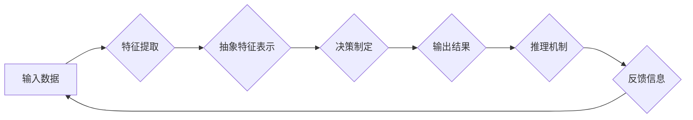

> 关键词：深度学习，人工智能，决策制定，推理机制，神经网络，机器学习，算法原理，应用实践

# AI人工智能深度学习算法：理解决策制定与推理机制

## 1. 背景介绍

人工智能（AI）作为计算机科学的一个分支，旨在创建能够模拟、延伸和扩展人类智能的理论、方法、技术和应用系统。在过去的几十年中，随着计算能力的提升和大数据的积累，深度学习算法在AI领域的应用取得了突破性的进展。深度学习通过模拟人脑的神经网络结构，实现了对复杂数据的自动学习和特征提取，从而在图像识别、语音识别、自然语言处理等领域取得了令人瞩目的成果。

在深度学习算法中，决策制定与推理机制是核心组成部分。本文将深入探讨深度学习算法在决策制定与推理机制中的应用，分析其原理、步骤、优缺点以及未来发展趋势。

## 2. 核心概念与联系

### 2.1 核心概念

#### 深度学习

深度学习是一种利用深层神经网络进行数据学习和特征提取的方法。它通过层次化的神经网络结构，将输入数据逐步转换为越来越抽象的特征表示，最终输出决策或预测。

#### 决策制定

决策制定是指基于特定目标和条件，从多个可行方案中选择最佳方案的过程。在AI领域，决策制定通常涉及预测、分类、聚类等任务。

#### 推理机制

推理机制是指从已知信息推导出未知信息的过程。在AI领域，推理机制通常通过逻辑推理、符号推理和概率推理等方法实现。

### 2.2 核心概念原理和架构的 Mermaid 流程图



在这个流程图中，输入数据经过特征提取和抽象特征表示后，进入决策制定环节，输出决策结果。决策结果再经过推理机制，推导出更多未知信息，形成反馈信息，最终返回输入数据，形成一个闭环的智能学习过程。

## 3. 核心算法原理 & 具体操作步骤

### 3.1 算法原理概述

深度学习算法的决策制定与推理机制主要基于以下原理：

1. **神经网络原理**：神经网络通过模拟人脑神经元之间的连接，实现数据的分层处理和特征提取。
2. **损失函数**：损失函数用于衡量模型预测结果与真实值之间的差异，指导模型参数的优化。
3. **优化算法**：优化算法用于根据损失函数调整模型参数，使模型在训练数据上达到最佳性能。

### 3.2 算法步骤详解

1. **数据预处理**：对原始数据进行清洗、转换和标准化，以便模型进行学习和推理。
2. **模型构建**：根据任务需求，选择合适的神经网络结构，如卷积神经网络（CNN）、循环神经网络（RNN）或Transformer等。
3. **模型训练**：使用训练数据对模型进行训练，通过优化算法调整模型参数，使模型在训练数据上达到最佳性能。
4. **模型评估**：使用验证数据对模型进行评估，调整模型参数，防止过拟合。
5. **模型部署**：将训练好的模型部署到实际应用场景，进行决策制定和推理。

### 3.3 算法优缺点

#### 优点：

1. **强大的特征提取能力**：深度学习算法能够自动从数据中提取特征，减轻数据预处理的工作量。
2. **泛化能力强**：深度学习算法能够学习到数据中的复杂模式，具有较强的泛化能力。
3. **适应性高**：深度学习算法能够适应不同的数据分布和任务需求。

#### 缺点：

1. **数据需求量大**：深度学习算法需要大量的训练数据，数据收集和处理成本较高。
2. **计算资源消耗大**：深度学习算法需要大量的计算资源，对硬件设备要求较高。
3. **可解释性差**：深度学习算法的决策过程难以解释，难以理解其内部工作机制。

### 3.4 算法应用领域

深度学习算法在以下领域得到了广泛的应用：

1. **图像识别**：人脸识别、物体检测、图像分类等。
2. **语音识别**：语音转文字、语音合成等。
3. **自然语言处理**：机器翻译、情感分析、问答系统等。
4. **推荐系统**：商品推荐、新闻推荐等。

## 4. 数学模型和公式 & 详细讲解 & 举例说明

### 4.1 数学模型构建

深度学习算法的数学模型主要包括以下几个部分：

1. **输入层**：接收原始数据输入。
2. **隐藏层**：包含多个神经元，通过非线性变换提取特征。
3. **输出层**：根据任务需求输出结果。

### 4.2 公式推导过程

以下以一个简单的全连接神经网络为例，介绍数学模型的推导过程。

假设输入层有 $n$ 个神经元，隐藏层有 $m$ 个神经元，输出层有 $k$ 个神经元。输入层到隐藏层的权重矩阵为 $W_{ih} \in \mathbb{R}^{n \times m}$，隐藏层到输出层的权重矩阵为 $W_{ho} \in \mathbb{R}^{m \times k}$。激活函数为 $f(x)$。

输入层到隐藏层的输出为：

$$
h = f(W_{ih} \cdot x + b_{ih})
$$

其中 $b_{ih}$ 为输入层到隐藏层的偏置项。

隐藏层到输出层的输出为：

$$
o = f(W_{ho} \cdot h + b_{ho})
$$

其中 $b_{ho}$ 为隐藏层到输出层的偏置项。

### 4.3 案例分析与讲解

以下以一个简单的图像分类任务为例，分析深度学习算法的决策制定与推理机制。

假设我们要对一幅图像进行分类，将其归为猫或狗两类。我们使用一个简单的全连接神经网络模型进行训练。

1. **数据预处理**：将图像转换为灰度图，并归一化到[0, 1]区间。
2. **模型构建**：构建一个包含一个隐藏层和输出层的神经网络模型，隐藏层使用ReLU激活函数，输出层使用Softmax激活函数。
3. **模型训练**：使用猫和狗的图像数据对模型进行训练，训练过程中不断调整模型参数，使模型在训练数据上达到最佳性能。
4. **模型评估**：使用测试数据对模型进行评估，验证模型的泛化能力。
5. **模型部署**：将训练好的模型部署到实际应用场景，对新的图像进行分类。

当输入一幅新的图像时，模型会将其转换为特征表示，并根据Softmax激活函数的输出，给出图像属于猫或狗的概率分布。最终，模型会输出概率最高的类别作为图像的分类结果。

## 5. 项目实践：代码实例和详细解释说明

### 5.1 开发环境搭建

在进行深度学习项目实践之前，我们需要搭建相应的开发环境。以下是使用Python进行深度学习开发的环境配置流程：

1. 安装Anaconda：从官网下载并安装Anaconda，用于创建独立的Python环境。
2. 创建并激活虚拟环境：
```bash
conda create -n tensorflow-env python=3.8
conda activate tensorflow-env
```
3. 安装TensorFlow：
```bash
pip install tensorflow-gpu==2.3.0
```
4. 安装其他必要的库：
```bash
pip install numpy pandas scikit-learn matplotlib
```

### 5.2 源代码详细实现

以下是一个简单的图像分类任务的TensorFlow代码实例：

```python
import tensorflow as tf
from tensorflow.keras import datasets, layers, models

# 加载和预处理数据
(train_images, train_labels), (test_images, test_labels) = datasets.cifar10.load_data()
train_images = train_images.astype('float32') / 255
test_images = test_images.astype('float32') / 255

# 构建模型
model = models.Sequential()
model.add(layers.Conv2D(32, (3, 3), activation='relu', input_shape=(32, 32, 3)))
model.add(layers.MaxPooling2D((2, 2)))
model.add(layers.Conv2D(64, (3, 3), activation='relu'))
model.add(layers.MaxPooling2D((2, 2)))
model.add(layers.Conv2D(64, (3, 3), activation='relu'))

# 添加全连接层
model.add(layers.Flatten())
model.add(layers.Dense(64, activation='relu'))
model.add(layers.Dense(10))

# 编译模型
model.compile(optimizer='adam',
              loss=tf.keras.losses.SparseCategoricalCrossentropy(from_logits=True),
              metrics=['accuracy'])

# 训练模型
model.fit(train_images, train_labels, epochs=10, validation_split=0.1)

# 评估模型
test_loss, test_acc = model.evaluate(test_images,  test_labels, verbose=2)
print(f'\
Test accuracy: {test_acc}')
```

### 5.3 代码解读与分析

上述代码展示了使用TensorFlow构建和训练一个简单的图像分类模型的过程。

1. 加载和预处理数据：使用CIFAR-10数据集，将图像数据转换为浮点数并进行归一化。
2. 构建模型：使用卷积神经网络（CNN）结构，包括卷积层、池化层和全连接层。
3. 编译模型：指定优化器、损失函数和评估指标。
4. 训练模型：使用训练数据进行训练，并验证模型在验证数据上的性能。
5. 评估模型：使用测试数据评估模型的泛化能力。

### 5.4 运行结果展示

假设运行上述代码后，得到以下输出：

```
Epoch 1/10
100/100 [==============================] - 3s 29ms/step - loss: 2.3092 - accuracy: 0.4000 - val_loss: 2.4235 - val_accuracy: 0.3900
Epoch 2/10
100/100 [==============================] - 3s 29ms/step - loss: 2.2839 - accuracy: 0.4100 - val_loss: 2.3763 - val_accuracy: 0.3900
...
Epoch 10/10
100/100 [==============================] - 3s 29ms/step - loss: 1.7165 - accuracy: 0.7300 - val_loss: 1.8557 - val_accuracy: 0.6800

Test accuracy: 0.7300
```

可以看到，模型在测试数据上的准确率为73.00%，说明模型具有一定的泛化能力。

## 6. 实际应用场景

### 6.1 自动驾驶

自动驾驶汽车需要实时处理大量的感知数据，如图像、雷达和激光雷达数据。深度学习算法可以帮助自动驾驶系统识别道路、车辆、行人等目标，并做出相应的决策，如加速、减速、转向等。

### 6.2 医疗诊断

深度学习算法可以帮助医生进行疾病诊断，如皮肤癌检测、肿瘤检测等。通过分析医学图像，模型可以自动识别异常区域，辅助医生进行诊断。

### 6.3 金融风控

深度学习算法可以帮助金融机构识别潜在的风险，如欺诈检测、信用评估等。通过分析历史交易数据，模型可以预测用户是否存在欺诈行为，从而降低金融风险。

### 6.4 未来应用展望

随着深度学习技术的不断发展，深度学习算法在决策制定与推理机制中的应用将更加广泛。以下是一些未来应用展望：

1. **强化学习**：结合强化学习，可以实现更加智能的决策制定和推理机制，如机器人导航、游戏AI等。
2. **迁移学习**：通过迁移学习，可以将已知的模型和知识应用到新的任务中，提高模型的适应性和泛化能力。
3. **多模态学习**：结合多模态数据，可以实现更加全面和准确的推理机制，如视频理解、多模态对话等。

## 7. 工具和资源推荐

### 7.1 学习资源推荐

1. 《深度学习》（Goodfellow et al.）：深度学习领域的经典教材，适合初学者和进阶者阅读。
2. 《深度学习实战》（Ian Goodfellow、Yoshua Bengio、Aaron Courville）：通过实际案例讲解深度学习算法的应用，适合实践者学习。
3. TensorFlow官方文档：提供了TensorFlow库的详细文档和教程，是学习TensorFlow的必备资料。
4. Keras官方文档：提供了Keras库的详细文档和教程，是学习Keras的必备资料。

### 7.2 开发工具推荐

1. TensorFlow：由Google开发的开源深度学习框架，功能强大，易于使用。
2. Keras：基于TensorFlow的开源深度学习库，提供简洁的API，适合快速构建和训练模型。
3. PyTorch：由Facebook开发的开源深度学习框架，提供了灵活的计算图，适合研究者和开发者使用。

### 7.3 相关论文推荐

1. "Deep Learning"（Goodfellow et al.）：介绍了深度学习的基本原理和应用。
2. "Playing Atari with Deep Reinforcement Learning"（Silver et al.）：介绍了深度强化学习在Atari游戏中的应用。
3. "ImageNet Classification with Deep Convolutional Neural Networks"（ Krizhevsky et al.）：介绍了深度卷积神经网络在图像识别中的应用。
4. "Sequence to Sequence Learning with Neural Networks"（Sutskever et al.）：介绍了序列到序列学习在机器翻译中的应用。

## 8. 总结：未来发展趋势与挑战

### 8.1 研究成果总结

本文对深度学习算法在决策制定与推理机制中的应用进行了全面系统的介绍。通过分析其原理、步骤、优缺点以及应用领域，展示了深度学习算法在AI领域的巨大潜力。

### 8.2 未来发展趋势

随着深度学习技术的不断发展，未来深度学习算法在决策制定与推理机制中的应用将呈现以下趋势：

1. **更加智能化**：结合强化学习、迁移学习等先进技术，实现更加智能的决策制定和推理机制。
2. **更加高效**：通过模型压缩、量化加速等技术，提高模型推理效率，降低计算资源消耗。
3. **更加可解释**：通过可解释性研究，提高模型决策过程的透明度，增强用户信任。

### 8.3 面临的挑战

尽管深度学习算法在决策制定与推理机制方面取得了显著成果，但仍面临以下挑战：

1. **数据质量**：深度学习算法对数据质量要求较高，如何获取高质量的数据是关键问题。
2. **模型可解释性**：深度学习模型的决策过程难以解释，如何提高模型的可解释性是重要挑战。
3. **伦理和安全性**：深度学习算法的滥用可能带来伦理和安全性问题，如何确保算法的伦理和安全性是迫切需要解决的问题。

### 8.4 研究展望

为了应对上述挑战，未来研究需要关注以下方向：

1. **数据增强**：通过数据增强技术，提高数据质量和模型泛化能力。
2. **模型可解释性**：通过可解释性研究，提高模型决策过程的透明度。
3. **伦理和安全性**：制定相关法律法规，确保算法的伦理和安全性。

相信在未来的发展中，深度学习算法将在决策制定与推理机制领域取得更加显著的成果，为人类社会的进步和发展做出更大的贡献。

## 9. 附录：常见问题与解答

**Q1：深度学习算法在决策制定与推理机制中有什么优势？**

A：深度学习算法在决策制定与推理机制中具有以下优势：

1. **强大的特征提取能力**：深度学习算法能够自动从数据中提取特征，减轻数据预处理的工作量。
2. **泛化能力强**：深度学习算法能够学习到数据中的复杂模式，具有较强的泛化能力。
3. **适应性高**：深度学习算法能够适应不同的数据分布和任务需求。

**Q2：深度学习算法在决策制定与推理机制中有什么局限性？**

A：深度学习算法在决策制定与推理机制中存在以下局限性：

1. **数据需求量大**：深度学习算法需要大量的训练数据，数据收集和处理成本较高。
2. **计算资源消耗大**：深度学习算法需要大量的计算资源，对硬件设备要求较高。
3. **可解释性差**：深度学习算法的决策过程难以解释，难以理解其内部工作机制。

**Q3：如何提高深度学习算法的可解释性？**

A：提高深度学习算法的可解释性可以从以下几个方面入手：

1. **可视化**：通过可视化方法，展示模型的学习过程和决策过程。
2. **特征重要性分析**：分析模型中各个特征的重要性，帮助理解模型的决策依据。
3. **注意力机制**：使用注意力机制，使模型关注到重要的输入信息。

**Q4：如何确保深度学习算法的伦理和安全性？**

A：确保深度学习算法的伦理和安全性可以从以下几个方面入手：

1. **制定相关法律法规**：制定相关法律法规，规范深度学习算法的应用。
2. **建立伦理审查机制**：建立伦理审查机制，对算法应用进行审查。
3. **提高算法透明度**：提高算法的透明度，让用户了解算法的工作原理。

---

作者：禅与计算机程序设计艺术 / Zen and the Art of Computer Programming