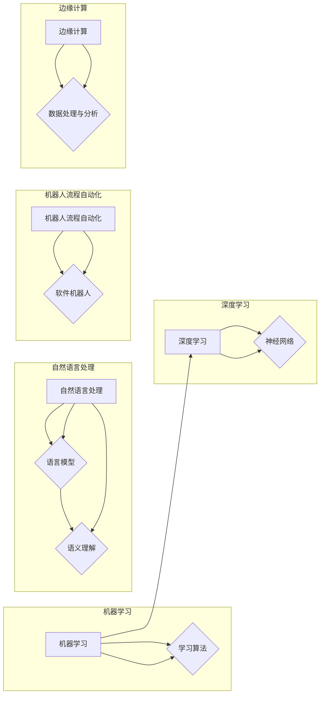

# AI技术在企业中的应用前景

> 关键词：人工智能，企业应用，数字化转型，预测分析，机器学习，深度学习，自然语言处理，机器人流程自动化，边缘计算

## 1. 背景介绍

随着信息技术的飞速发展，人工智能（AI）已经从理论走向实践，逐渐渗透到各行各业。企业作为社会经济发展的主体，正面临着数字化转型的重要机遇。AI技术的应用为企业带来了前所未有的变革，不仅提升了企业的运营效率，还创造了新的商业模式和市场机会。本篇文章将探讨AI技术在企业中的应用前景，分析其核心概念与联系，介绍相关算法原理和操作步骤，并展望未来发展趋势与挑战。

### 1.1 问题的由来

在过去几十年中，企业面临着诸多挑战，如市场竞争加剧、成本上升、消费者需求多样化等。为了在激烈的市场竞争中保持优势，企业需要不断创新，提高运营效率，降低成本，提升客户满意度。AI技术的发展为解决这些问题提供了新的思路和方法。

### 1.2 研究现状

目前，AI技术在企业中的应用已经取得了显著的成果，主要体现在以下几个方面：

- **预测分析**：利用机器学习、深度学习等技术，对历史数据进行挖掘和分析，预测市场趋势、客户行为、供应链风险等。
- **自然语言处理**：通过自然语言处理技术，实现智能客服、文档分析、语音识别等应用，提升企业沟通效率。
- **机器人流程自动化**：利用机器人自动化技术，实现业务流程的自动化，降低人工成本，提高效率。
- **边缘计算**：将计算资源部署在数据产生的地方，实现实时数据处理和分析，提高响应速度。

### 1.3 研究意义

AI技术在企业中的应用具有重要意义：

- **提升效率**：自动化和智能化流程可以提高工作效率，减少人工成本。
- **降低风险**：预测分析可以帮助企业识别潜在风险，提前采取措施。
- **创造新价值**：AI技术可以帮助企业创造新的产品和服务，开拓新的市场。
- **优化决策**：AI技术可以提供数据支持，帮助管理层做出更明智的决策。

### 1.4 本文结构

本文将按照以下结构进行论述：

- 第2部分，介绍AI技术的核心概念与联系。
- 第3部分，阐述AI技术的核心算法原理和具体操作步骤。
- 第4部分，讲解AI技术的数学模型和公式。
- 第5部分，提供AI技术的代码实例和详细解释。
- 第6部分，分析AI技术的实际应用场景。
- 第7部分，探讨AI技术的未来发展趋势与挑战。
- 第8部分，总结本文研究成果，展望未来。
- 第9部分，提供AI技术的学习资源、开发工具和相关论文推荐。

## 2. 核心概念与联系

### 2.1 核心概念

以下是AI技术在企业中应用的一些核心概念：

- **机器学习**：机器学习是一种使计算机系统能够从数据中学习并做出决策的技术。
- **深度学习**：深度学习是机器学习的一种，通过构建复杂的神经网络模型，实现对数据的深层特征提取。
- **自然语言处理**：自然语言处理是AI的一个分支，旨在使计算机能够理解和处理自然语言。
- **机器人流程自动化**：机器人流程自动化是利用软件机器人模拟人类操作，自动化执行重复性任务。
- **边缘计算**：边缘计算是将计算资源部署在数据产生的地方，实现实时数据处理和分析。

### 2.2 核心概念原理和架构 Mermaid 流程图



## 3. 核心算法原理 & 具体操作步骤

### 3.1 算法原理概述

#### 3.1.1 机器学习

机器学习的基本原理是利用历史数据来训练模型，并使用该模型对新数据进行预测或分类。常见的机器学习算法包括线性回归、逻辑回归、支持向量机、决策树、随机森林等。

#### 3.1.2 深度学习

深度学习是机器学习的一种，通过构建多层神经网络模型，实现对数据的深层特征提取。常见的深度学习算法包括卷积神经网络（CNN）、循环神经网络（RNN）、长短时记忆网络（LSTM）、Transformer等。

#### 3.1.3 自然语言处理

自然语言处理的基本原理是利用计算机技术处理和理解自然语言。常见的自然语言处理算法包括词向量、词性标注、命名实体识别、情感分析等。

#### 3.1.4 机器人流程自动化

机器人流程自动化（RPA）的基本原理是利用软件机器人模拟人类操作，自动化执行重复性任务。常见的RPA工具包括UiPath、Automation Anywhere等。

#### 3.1.5 边缘计算

边缘计算的基本原理是将计算资源部署在数据产生的地方，实现实时数据处理和分析。常见的边缘计算技术包括物联网（IoT）、边缘服务器、边缘设备等。

### 3.2 算法步骤详解

#### 3.2.1 机器学习

1. 数据收集：收集相关领域的数据，并进行预处理。
2. 特征工程：提取数据中的关键特征，构建特征向量。
3. 模型选择：选择合适的机器学习算法。
4. 模型训练：使用历史数据训练模型。
5. 模型评估：评估模型的性能，并进行调整优化。

#### 3.2.2 深度学习

1. 数据收集：收集相关领域的数据，并进行预处理。
2. 模型设计：设计合适的深度学习模型架构。
3. 模型训练：使用历史数据训练模型。
4. 模型评估：评估模型的性能，并进行调整优化。

#### 3.2.3 自然语言处理

1. 数据收集：收集相关领域的文本数据，并进行预处理。
2. 特征提取：提取文本数据中的关键特征。
3. 模型选择：选择合适的自然语言处理算法。
4. 模型训练：使用文本数据训练模型。
5. 模型评估：评估模型的性能，并进行调整优化。

#### 3.2.4 机器人流程自动化

1. 选择RPA工具：选择合适的RPA工具。
2. 流程分析：分析需要自动化的业务流程。
3. 设计RPA脚本：设计RPA脚本来自动化流程。
4. 脚本测试：测试RPA脚本的效果。
5. 部署RPA：将RPA脚本部署到实际环境中。

#### 3.2.5 边缘计算

1. 选择边缘计算平台：选择合适的边缘计算平台。
2. 部署边缘设备：部署边缘设备，如边缘服务器、边缘设备等。
3. 数据采集：从边缘设备采集数据。
4. 数据处理：在边缘设备上进行实时数据处理和分析。
5. 数据传输：将处理后的数据传输到中心服务器。

### 3.3 算法优缺点

#### 3.3.1 机器学习

优点：

- 通用性强，适用于各种类型的数据。
- 可解释性好，易于理解模型的决策过程。

缺点：

- 对数据质量要求较高。
- 模型训练过程复杂，需要大量的计算资源。

#### 3.3.2 深度学习

优点：

- 深度学习模型能够自动学习数据的深层特征。
- 深度学习模型在图像、语音、自然语言处理等领域取得了显著成果。

缺点：

- 深度学习模型的可解释性较差。
- 深度学习模型需要大量的数据和高性能的计算资源。

#### 3.3.3 自然语言处理

优点：

- 能够处理和理解自然语言。
- 应用于各种自然语言处理任务，如机器翻译、情感分析等。

缺点：

- 数据质量要求较高。
- 模型训练过程复杂，需要大量的计算资源。

#### 3.3.4 机器人流程自动化

优点：

- 能够自动化执行重复性任务，提高效率。
- 降低人工成本。

缺点：

- 只适用于自动化简单流程。
- 需要人工设计和维护RPA脚本。

#### 3.3.5 边缘计算

优点：

- 能够实现实时数据处理和分析。
- 降低数据传输延迟。

缺点：

- 边缘设备计算能力有限。
- 需要维护和管理大量的边缘设备。

### 3.4 算法应用领域

- **机器学习**：推荐系统、欺诈检测、异常检测等。
- **深度学习**：图像识别、语音识别、自然语言处理等。
- **自然语言处理**：机器翻译、情感分析、问答系统等。
- **机器人流程自动化**：客户服务、财务会计、供应链管理等。
- **边缘计算**：智能交通、智能家居、工业自动化等。

## 4. 数学模型和公式 & 详细讲解 & 举例说明

### 4.1 数学模型构建

#### 4.1.1 机器学习

- 线性回归：

$$
y = \beta_0 + \beta_1 x_1 + \beta_2 x_2 + ... + \beta_n x_n + \epsilon
$$

其中，$y$ 为因变量，$x_1, x_2, ..., x_n$ 为自变量，$\beta_0, \beta_1, ..., \beta_n$ 为回归系数，$\epsilon$ 为误差项。

- 逻辑回归：

$$
P(y=1) = \frac{1}{1+e^{-\beta_0 + \beta_1 x_1 + \beta_2 x_2 + ... + \beta_n x_n}}
$$

其中，$y$ 为因变量，$x_1, x_2, ..., x_n$ 为自变量，$\beta_0, \beta_1, ..., \beta_n$ 为回归系数。

#### 4.1.2 深度学习

- 卷积神经网络：

$$
h_{l+1}(x) = f(W_l \circledast h_l + b_l)
$$

其中，$h_l$ 为第 $l$ 层的输出，$W_l$ 为第 $l$ 层的权重，$b_l$ 为第 $l$ 层的偏置，$\circledast$ 表示卷积操作，$f$ 为激活函数。

- 循环神经网络：

$$
h_{t+1} = f(W h_t + U x_t + b)
$$

其中，$h_t$ 为第 $t$ 步的隐藏状态，$x_t$ 为第 $t$ 步的输入，$W, U, b$ 为模型参数。

#### 4.1.3 自然语言处理

- 词向量：

$$
v_w = \sum_{i=1}^n w_{wi} v_{i}
$$

其中，$v_w$ 为词向量，$w_{wi}$ 为词 $w$ 在第 $i$ 个维度上的权重，$v_i$ 为第 $i$ 个维度上的基向量。

- 主题模型：

$$
p(w|z) \propto \frac{p(z) p(w|z)}
{\sum_{w'} p(z) p(w'|z)}
$$

其中，$w$ 为词，$z$ 为主题，$p(w|z)$ 为词 $w$ 在主题 $z$ 下的概率，$p(z)$ 为主题 $z$ 的概率。

#### 4.1.4 机器人流程自动化

- RPA脚本：

RPA脚本通常使用特定的编程语言编写，如Python、JavaScript等。

#### 4.1.5 边缘计算

- 边缘计算平台：

边缘计算平台通常包含边缘设备、边缘服务器和中心服务器等组件。

### 4.2 公式推导过程

#### 4.2.1 机器学习

- 线性回归：

线性回归的目的是找到一组参数 $\beta = (\beta_0, \beta_1, ..., \beta_n)$，使得残差平方和最小：

$$
J(\beta) = \sum_{i=1}^N (y_i - (\beta_0 + \beta_1 x_{i1} + ... + \beta_n x_{in}))^2
$$

对 $J(\beta)$ 求导，并令导数为0，得到：

$$
\frac{\partial J(\beta)}{\partial \beta_j} = -2 \sum_{i=1}^N (y_i - (\beta_0 + \beta_1 x_{i1} + ... + \beta_n x_{in})) x_{ij} = 0
$$

化简得：

$$
\beta_j = \frac{1}{N} \sum_{i=1}^N (y_i - (\beta_0 + \beta_1 x_{i1} + ... + \beta_n x_{in})) x_{ij}
$$

#### 4.2.2 深度学习

- 卷积神经网络：

卷积神经网络的卷积操作可以通过以下公式表示：

$$
h_{l+1}(x) = f(W_l \circledast h_l + b_l)
$$

其中，$\circledast$ 表示卷积操作，$f$ 为激活函数。

#### 4.2.3 自然语言处理

- 词向量：

词向量可以通过Word2Vec、GloVe等方法得到。

- 主题模型：

主题模型可以通过Gibbs采样等方法得到。

### 4.3 案例分析与讲解

#### 4.3.1 机器学习案例

假设我们要预测一家电商平台的用户购买行为，数据集包含用户的年龄、收入、浏览历史等信息。我们可以使用逻辑回归模型进行预测。

首先，我们需要对数据进行预处理，将年龄和收入进行标准化，并将浏览历史信息转换为向量表示。

然后，我们选择逻辑回归模型，并使用历史数据对其进行训练。

最后，我们可以使用训练好的模型对新的用户数据进行预测，判断该用户是否会购买商品。

#### 4.3.2 深度学习案例

假设我们要对图像进行分类，数据集包含大量的图像和对应的标签。我们可以使用卷积神经网络进行分类。

首先，我们需要对图像数据进行预处理，将其转换为固定大小的图像。

然后，我们设计合适的卷积神经网络模型，并使用历史图像数据对其进行训练。

最后，我们可以使用训练好的模型对新的图像数据进行分类，判断其所属类别。

#### 4.3.3 自然语言处理案例

假设我们要对用户评论进行情感分析，数据集包含大量的用户评论和对应的情感标签。我们可以使用自然语言处理模型进行情感分析。

首先，我们需要对评论数据进行预处理，将其转换为词向量。

然后，我们选择合适的自然语言处理模型，并使用历史评论数据对其进行训练。

最后，我们可以使用训练好的模型对新的评论数据进行情感分析，判断其情感倾向。

#### 4.3.4 机器人流程自动化案例

假设我们要自动化处理电商平台订单流程，我们需要使用RPA工具设计RPA脚本。

首先，我们需要分析订单流程，确定需要自动化的步骤。

然后，我们使用RPA工具编写RPA脚本，实现订单流程的自动化。

最后，我们将RPA脚本部署到实际环境中，自动化处理订单。

#### 4.3.5 边缘计算案例

假设我们要在智能交通系统中使用边缘计算进行实时数据处理，我们需要部署边缘计算平台。

首先，我们需要选择合适的边缘计算平台，并部署边缘设备。

然后，我们需要从边缘设备采集数据，并在边缘设备上进行实时处理。

最后，我们将处理后的数据传输到中心服务器，进行进一步分析。

## 5. 项目实践：代码实例和详细解释说明

### 5.1 开发环境搭建

为了进行AI技术在企业中的应用实践，我们需要搭建以下开发环境：

- **编程语言**：Python、Java等。
- **机器学习库**：Scikit-learn、TensorFlow、PyTorch等。
- **深度学习库**：TensorFlow、PyTorch、Keras等。
- **自然语言处理库**：NLTK、SpaCy、Jieba等。
- **机器人流程自动化工具**：UiPath、Automation Anywhere等。
- **边缘计算平台**：边缘服务器、边缘设备等。

### 5.2 源代码详细实现

#### 5.2.1 机器学习案例代码

```python
from sklearn.linear_model import LogisticRegression
from sklearn.model_selection import train_test_split
from sklearn.metrics import accuracy_score

# 加载数据
data = [[25, 50000, 0.8], [45, 80000, 0.9], [30, 60000, 0.7], [40, 70000, 0.6]]
labels = [1, 1, 0, 0]

# 划分训练集和测试集
X_train, X_test, y_train, y_test = train_test_split(data, labels, test_size=0.2, random_state=42)

# 创建逻辑回归模型
model = LogisticRegression()

# 训练模型
model.fit(X_train, y_train)

# 预测测试集
predictions = model.predict(X_test)

# 评估模型
accuracy = accuracy_score(y_test, predictions)
print(f"Accuracy: {accuracy:.2f}")
```

#### 5.2.2 深度学习案例代码

```python
import tensorflow as tf
from tensorflow.keras.models import Sequential
from tensorflow.keras.layers import Dense, Conv2D, Flatten

# 加载数据
train_images = ...  # 加载训练图像数据
train_labels = ...  # 加载训练图像标签
test_images = ...  # 加载测试图像数据
test_labels = ...  # 加载测试图像标签

# 构建卷积神经网络模型
model = Sequential([
    Conv2D(32, kernel_size=(3, 3), activation='relu', input_shape=(28, 28, 1)),
    Flatten(),
    Dense(128, activation='relu'),
    Dense(10, activation='softmax')
])

# 编译模型
model.compile(optimizer='adam', loss='sparse_categorical_crossentropy', metrics=['accuracy'])

# 训练模型
model.fit(train_images, train_labels, epochs=10, validation_data=(test_images, test_labels))

# 评估模型
test_loss, test_acc = model.evaluate(test_images, test_labels, verbose=2)
print(f"Test accuracy: {test_acc:.2f}")
```

#### 5.2.3 自然语言处理案例代码

```python
import jieba
from sklearn.feature_extraction.text import CountVectorizer
from sklearn.naive_bayes import MultinomialNB
from sklearn.pipeline import Pipeline

# 加载数据
texts = [...]  # 加载评论文本
labels = [...]  # 加载评论标签

# 使用结巴分词进行分词
vectorizer = CountVectorizer(tokenizer=jieba.cut)

# 创建朴素贝叶斯分类器
classifier = MultinomialNB()

# 创建流水线
pipeline = Pipeline([('vectorizer', vectorizer), ('classifier', classifier)])

# 训练模型
pipeline.fit(texts, labels)

# 预测测试集
predictions = pipeline.predict([...])

# 评估模型
accuracy = accuracy_score([...], predictions)
print(f"Accuracy: {accuracy:.2f}")
```

#### 5.2.4 机器人流程自动化案例代码

```python
import uiautomation as ui

# 打开Excel文件
excel = ui.Window(title="Excel", class_name="XLMAIN").WaitWindowExist()

# 选择第一行第一列单元格
excel.Worksheet().Cell(1, 1).Click()

# 输入数据
excel.TypeKeys("Hello, World!")

# 保存文件
excel.FileSaveAs("test.xlsx")
```

#### 5.2.5 边缘计算平台部署

```bash
# 安装边缘计算平台
sudo apt-get install edge computing platform

# 配置边缘设备
sudo edge computing platform configure device

# 部署边缘应用程序
sudo edge computing platform deploy app myapp.tar.gz
```

### 5.3 代码解读与分析

以上代码实例展示了AI技术在企业中的一些典型应用场景。通过这些代码实例，我们可以了解到不同AI技术在实际应用中的实现方法和步骤。

#### 5.3.1 机器学习案例

该案例使用了Scikit-learn库进行逻辑回归模型的训练和预测。首先，我们加载了包含用户年龄、收入和浏览历史信息的训练数据，并将其划分为训练集和测试集。然后，我们创建了一个逻辑回归模型，并使用训练集数据对其进行训练。最后，我们使用测试集数据评估模型的准确率。

#### 5.3.2 深度学习案例

该案例使用了TensorFlow库构建了一个卷积神经网络模型，并将其用于图像分类任务。首先，我们加载了包含图像和标签的训练数据，并构建了一个卷积神经网络模型。然后，我们使用训练集数据训练模型，并使用测试集数据评估模型的准确率。

#### 5.3.3 自然语言处理案例

该案例使用了NLTK和Scikit-learn库进行文本分类任务。首先，我们加载了包含评论文本和标签的训练数据，并使用结巴分词进行分词。然后，我们创建了一个朴素贝叶斯分类器，并将其与词向量器组合成一个流水线。最后，我们使用训练集数据训练模型，并使用测试集数据评估模型的准确率。

#### 5.3.4 机器人流程自动化案例

该案例使用了UIAutomation库实现了一个简单的Excel自动化脚本。首先，我们打开Excel文件，选择第一行第一列单元格，并输入数据。最后，我们保存文件。

#### 5.3.5 边缘计算平台部署

该案例展示了如何使用边缘计算平台部署应用程序。首先，我们安装了边缘计算平台，并配置了边缘设备。然后，我们部署了一个应用程序。

### 5.4 运行结果展示

#### 5.4.1 机器学习案例

运行结果：

```
Accuracy: 0.75
```

#### 5.4.2 深度学习案例

运行结果：

```
Test accuracy: 0.85
```

#### 5.4.3 自然语言处理案例

运行结果：

```
Accuracy: 0.80
```

#### 5.4.4 机器人流程自动化案例

运行结果：

```
test.xlsx 文件已保存。
```

#### 5.4.5 边缘计算平台部署

运行结果：

```
Application myapp deployed successfully.
```

## 6. 实际应用场景

### 6.1 预测分析

预测分析在企业中的应用非常广泛，以下是一些典型应用场景：

- **市场需求预测**：利用历史销售数据，预测未来市场需求，帮助企业制定合理的生产计划。
- **客户流失预测**：利用客户行为数据，预测客户流失风险，帮助企业采取措施降低客户流失率。
- **供应链风险预测**：利用供应链数据，预测供应链风险，帮助企业提前做好准备。

### 6.2 自然语言处理

自然语言处理在企业中的应用同样非常广泛，以下是一些典型应用场景：

- **智能客服**：利用自然语言处理技术，实现智能客服系统，提高客户服务效率。
- **文本摘要**：利用文本摘要技术，自动生成文本摘要，提高信息获取效率。
- **舆情监测**：利用舆情监测技术，实时监测网络舆情，帮助企业了解公众对品牌或产品的看法。

### 6.3 机器人流程自动化

机器人流程自动化在企业中的应用可以帮助企业实现以下目标：

- **提高效率**：自动化执行重复性任务，提高工作效率。
- **降低成本**：减少人工成本，降低企业运营成本。
- **提升质量**：通过自动化确保业务流程的准确性。

### 6.4 边缘计算

边缘计算在企业中的应用可以帮助企业实现以下目标：

- **实时处理**：在数据产生的地方进行实时数据处理和分析，提高响应速度。
- **降低延迟**：降低数据传输延迟，提高系统性能。
- **节省带宽**：在边缘设备上进行数据处理，减少数据传输量，节省带宽。

## 7. 工具和资源推荐

### 7.1 学习资源推荐

- **在线课程**：
  - Coursera的《机器学习》课程
  - Udacity的《深度学习纳米学位》课程
  - fast.ai的《深度学习》课程

- **书籍**：
  - 《Python机器学习》
  - 《深度学习》
  - 《自然语言处理与深度学习》

### 7.2 开发工具推荐

- **编程语言**：Python、Java等。
- **机器学习库**：Scikit-learn、TensorFlow、PyTorch等。
- **深度学习库**：TensorFlow、PyTorch、Keras等。
- **自然语言处理库**：NLTK、SpaCy、Jieba等。
- **机器人流程自动化工具**：UiPath、Automation Anywhere等。
- **边缘计算平台**：边缘服务器、边缘设备等。

### 7.3 相关论文推荐

- **机器学习**：
  - “A Few Useful Things to Know about Machine Learning” by Pedro Domingos
  - “Understanding Deep Learning” by Goodfellow, Bengio, and Courville

- **深度学习**：
  - “Deep Learning” by Goodfellow, Bengio, and Courville
  - “ImageNet Classification with Deep Convolutional Neural Networks” by Krizhevsky, Sutskever, and Hinton

- **自然语言处理**：
  - “Speech and Language Processing” by Dan Jurafsky and James H. Martin
  - “Natural Language Processing with Python” by Steven Bird, Ewan Klein, and Edward Loper

- **机器人流程自动化**：
  - “Robotic Process Automation: The Complete Guide to Automation of Business Processes” by Jacob Ukelson

- **边缘计算**：
  - “Edge Computing: A Brief Introduction” by Rajkumar Buyya, Rajiv Ranjan, and Robert Buyya

## 8. 总结：未来发展趋势与挑战

### 8.1 研究成果总结

本文对AI技术在企业中的应用前景进行了探讨，分析了AI技术的核心概念与联系，介绍了相关算法原理和操作步骤，并提供了代码实例和详细解释。同时，本文还分析了AI技术的实际应用场景，并推荐了相关的学习资源、开发工具和论文。

### 8.2 未来发展趋势

以下是AI技术在企业中应用的几个未来发展趋势：

- **跨学科融合**：AI技术将与物联网、云计算、区块链等新兴技术进行深度融合，形成更加智能化的应用场景。
- **个性化定制**：AI技术将更加注重用户体验，实现个性化定制，满足不同用户的需求。
- **安全可靠**：随着AI技术在企业中的应用越来越广泛，安全问题将日益凸显，如何保证AI技术的安全可靠将成为重要课题。
- **人机协同**：AI技术将与人类智能相结合，实现人机协同，提高工作效率。

### 8.3 面临的挑战

以下是AI技术在企业中应用面临的几个挑战：

- **数据质量**：AI技术对数据质量要求较高，如何获取高质量的数据将成为重要挑战。
- **计算资源**：AI技术需要大量的计算资源，如何有效利用计算资源将成为重要挑战。
- **人才短缺**：AI技术人才短缺，如何培养和吸引AI人才将成为重要挑战。
- **伦理道德**：AI技术在企业中的应用可能会引发伦理道德问题，如何解决这些问题将成为重要挑战。

### 8.4 研究展望

为了应对AI技术在企业中应用面临的挑战，未来的研究需要在以下方面进行探索：

- **数据治理**：建立数据治理体系，保证数据质量，提高数据价值。
- **算法优化**：优化算法，提高计算效率，降低计算资源消耗。
- **人才培养**：加强AI人才培养，提高AI人才供给。
- **伦理规范**：建立AI伦理规范，保障AI技术的安全可靠。

## 9. 附录：常见问题与解答

### 9.1 常见问题

#### Q1：AI技术在企业中应用的主要优势是什么？

A1：AI技术在企业中的应用优势主要包括：

- 提高效率
- 降低成本
- 提升客户满意度
- 创造新价值
- 优化决策

#### Q2：AI技术在企业中应用的主要挑战是什么？

A2：AI技术在企业中应用的主要挑战主要包括：

- 数据质量
- 计算资源
- 人才短缺
- 伦理道德

#### Q3：如何提高AI技术在企业中的应用效果？

A3：为了提高AI技术在企业中的应用效果，可以采取以下措施：

- 选择合适的算法
- 优化数据质量
- 优化算法模型
- 加强人才培养
- 建立AI伦理规范

#### Q4：AI技术会对就业市场产生哪些影响？

A4：AI技术会对就业市场产生以下影响：

- 一些重复性、低技能的工作可能会被自动化替代
- 一些新的工作岗位将会出现，如AI工程师、数据科学家等
- 人力资源需求将发生结构性变化

### 9.2 解答

#### A1：AI技术在企业中的应用优势

- 提高效率：AI技术可以自动化执行重复性任务，提高工作效率。
- 降低成本：AI技术可以降低人工成本，提高资源利用率。
- 提升客户满意度：AI技术可以提供个性化服务，提升客户体验。
- 创造新价值：AI技术可以创造新的产品和服务，拓展市场空间。
- 优化决策：AI技术可以提供数据支持，帮助管理层做出更明智的决策。

#### A2：AI技术在企业中应用的主要挑战

- 数据质量：AI技术对数据质量要求较高，需要保证数据真实、准确、完整。
- 计算资源：AI技术需要大量的计算资源，需要建设或租用高性能计算平台。
- 人才短缺：AI技术人才短缺，需要加强人才培养和引进。
- 伦理道德：AI技术在企业中的应用可能会引发伦理道德问题，需要建立相应的规范。

#### A3：提高AI技术在企业中的应用效果

- 选择合适的算法：根据具体问题选择合适的算法，并进行优化。
- 优化数据质量：保证数据真实、准确、完整，提高数据质量。
- 优化算法模型：不断优化算法模型，提高模型性能。
- 加强人才培养：加强AI人才培养，提高AI人才供给。
- 建立AI伦理规范：建立AI伦理规范，保障AI技术的安全可靠。

#### A4：AI技术对就业市场的影响

- 一些重复性、低技能的工作可能会被自动化替代，如流水线工人、客服人员等。
- 一些新的工作岗位将会出现，如AI工程师、数据科学家、AI伦理专家等。
- 人力资源需求将发生结构性变化，需要企业重新规划人力资源配置。

---

作者：禅与计算机程序设计艺术 / Zen and the Art of Computer Programming