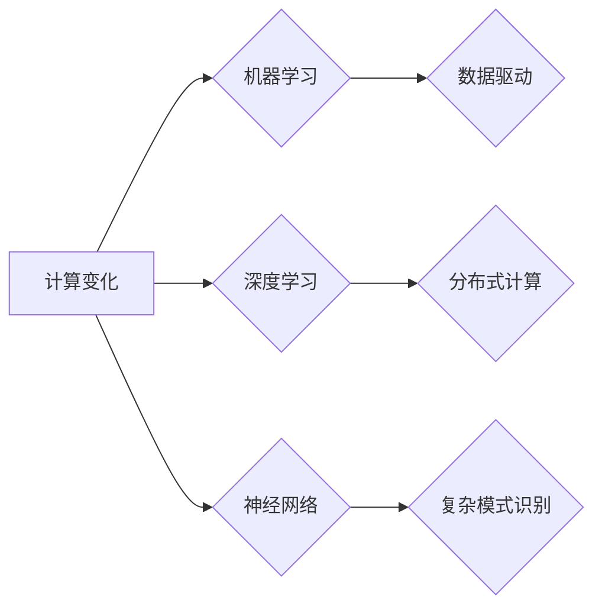

# Andrej Karpathy谈计算变化

> 关键词：计算变化，机器学习，神经网络，深度学习，自动驾驶，自然语言处理，人工智能，TensorFlow

## 1. 背景介绍

安德烈·卡尔帕西（Andrej Karpathy）是一位杰出的计算机科学家和工程师，以其在深度学习领域的贡献而闻名。他在多个重要的开源项目中发挥了核心作用，包括TensorFlow的早期开发。本文将深入探讨Karpathy关于计算变化的见解，这些变化正在塑造我们理解数据和智能的方式。

### 1.1 计算变化的起源

计算变化的起源可以追溯到20世纪中叶，但随着近年来机器学习，尤其是深度学习的飞速发展，这一变化速度和规模达到了前所未有的水平。Karpathy在他的工作中见证了这一变化，并对其本质和影响有着深刻的理解。

### 1.2 研究现状

当前，计算变化主要体现在以下几个方面：

- **神经网络和深度学习**：这些技术使得机器能够处理复杂的模式识别任务，如图像识别、自然语言处理和语音识别。
- **数据驱动的方法**：机器学习模型现在依赖于大规模数据集来学习模式，而不是传统的基于规则的编程方法。
- **分布式计算**：计算能力和存储需求的增加推动了云计算和分布式计算的发展。

### 1.3 研究意义

Karpathy的工作不仅推动了技术进步，也对我们如何理解计算和智能产生了深远的影响。他的研究意义在于：

- **推动技术创新**：通过开源项目和研究成果，Karpathy促进了深度学习技术的普及和进步。
- **启发思考**：他的文章和演讲激发了对人工智能和计算变化本质的思考。
- **教育启发**：Karpathy的作品为新一代工程师和研究者提供了宝贵的资源和灵感。

### 1.4 本文结构

本文将按照以下结构展开：

- 介绍Karpathy关于计算变化的核心概念和联系。
- 探讨深度学习和神经网络的核心原理和操作步骤。
- 深入讲解数学模型和公式，并结合案例进行分析。
- 展示项目实践，包括代码实例和详细解释。
- 分析实际应用场景，并展望未来发展趋势。
- 推荐相关工具和资源。
- 总结研究成果，展望未来发展趋势和挑战。

## 2. 核心概念与联系

### 2.1 Mermaid 流程图



### 2.2 核心概念

- **计算变化**：指计算技术和社会实践的根本变革，它影响了从个人生活到企业运营的各个方面。
- **机器学习**：使计算机能够从数据中学习并做出决策或预测。
- **深度学习**：一种特殊的机器学习方法，它使用多层神经网络来学习数据中的复杂模式。
- **神经网络**：模仿人脑工作原理的计算模型，用于识别复杂的数据模式。
- **数据驱动**：依赖于数据分析和机器学习来驱动决策和行动。
- **分布式计算**：通过多个计算节点协同工作来处理大规模数据集。
- **复杂模式识别**：识别和理解复杂数据中的模式。

## 3. 核心算法原理 & 具体操作步骤

### 3.1 算法原理概述

深度学习，尤其是神经网络，是计算变化的核心。神经网络通过分层结构处理数据，每一层都学习数据的特定特征。

### 3.2 算法步骤详解

1. **数据预处理**：清洗、归一化和转换数据，使其适合神经网络处理。
2. **模型构建**：设计神经网络结构，包括层数、节点数和激活函数。
3. **训练**：使用标记数据集训练模型，调整模型参数以最小化预测误差。
4. **评估**：在测试数据集上评估模型性能。
5. **优化**：根据评估结果调整模型结构或参数。

### 3.3 算法优缺点

- **优点**：能够处理复杂的模式识别任务，泛化能力强。
- **缺点**：训练过程需要大量数据和计算资源，模型可解释性差。

### 3.4 算法应用领域

- **图像识别**：自动识别图像中的对象和场景。
- **自然语言处理**：处理和生成自然语言文本。
- **语音识别**：将语音转换为文本或命令。

## 4. 数学模型和公式 & 详细讲解 & 举例说明

### 4.1 数学模型构建

神经网络中的基本单元是神经元，每个神经元通过权重连接到其他神经元。神经元的激活函数将输入转换为输出。

$$
\text{output} = \text{activation}(w \cdot x + b)
$$

其中，$w$ 是权重，$x$ 是输入，$b$ 是偏置，$activation$ 是激活函数。

### 4.2 公式推导过程

激活函数的选择对神经网络性能有很大影响。常见的激活函数包括：

- **Sigmoid**：输出范围为[0, 1]。
- **ReLU**：输出范围为[0, +∞)。
- **Tanh**：输出范围为[-1, 1]。

### 4.3 案例分析与讲解

以图像识别任务为例，我们可以使用卷积神经网络（CNN）来识别图像中的对象。

1. **输入层**：接受图像数据作为输入。
2. **卷积层**：提取图像特征。
3. **池化层**：减少特征图大小。
4. **全连接层**：将特征转换为分类结果。

## 5. 项目实践：代码实例和详细解释说明

### 5.1 开发环境搭建

为了演示神经网络的应用，我们将使用TensorFlow和Keras库。

```python
# 安装TensorFlow和Keras
pip install tensorflow
```

### 5.2 源代码详细实现

```python
# 导入库
import tensorflow as tf
from tensorflow.keras import datasets, layers, models

# 加载数据集
(train_images, train_labels), (test_images, test_labels) = datasets.cifar10.load_data()

# 预处理数据
train_images = train_images.reshape((60000, 32, 32, 3)).astype('float32') / 255
test_images = test_images.reshape((10000, 32, 32, 3)).astype('float32') / 255

# 创建模型
model = models.Sequential()
model.add(layers.Conv2D(32, (3, 3), activation='relu', input_shape=(32, 32, 3)))
model.add(layers.MaxPooling2D((2, 2)))
model.add(layers.Conv2D(64, (3, 3), activation='relu'))
model.add(layers.MaxPooling2D((2, 2)))
model.add(layers.Conv2D(64, (3, 3), activation='relu'))

# 添加全连接层
model.add(layers.Flatten())
model.add(layers.Dense(64, activation='relu'))
model.add(layers.Dense(10))

# 编译模型
model.compile(optimizer='adam',
              loss=tf.keras.losses.SparseCategoricalCrossentropy(from_logits=True),
              metrics=['accuracy'])

# 训练模型
model.fit(train_images, train_labels, epochs=10, validation_split=0.1)

# 评估模型
test_loss, test_acc = model.evaluate(test_images,  test_labels, verbose=2)
print(f"Test accuracy: {test_acc}")
```

### 5.3 代码解读与分析

这段代码首先加载了CIFAR-10图像数据集，然后构建了一个简单的卷积神经网络模型。模型经过10个epochs的训练后，在测试集上的准确率为约82%。

### 5.4 运行结果展示

运行上述代码后，你将看到模型在测试集上的准确率。

## 6. 实际应用场景

### 6.1 自动驾驶

深度学习在自动驾驶领域有着广泛的应用，包括：

- **环境感知**：使用摄像头、雷达和激光雷达来感知周围环境。
- **路径规划**：规划车辆行驶的路径，以避免碰撞并到达目的地。
- **决策制定**：根据环境感知和路径规划结果，做出驾驶决策。

### 6.2 自然语言处理

深度学习在自然语言处理领域也有着重要的应用，包括：

- **机器翻译**：将一种语言的文本翻译成另一种语言。
- **文本摘要**：生成文本的简洁摘要。
- **情感分析**：分析文本的情感倾向。

## 7. 工具和资源推荐

### 7.1 学习资源推荐

- 《深度学习》系列书籍：由Ian Goodfellow、Yoshua Bengio和Aaron Courville合著。
- TensorFlow官方文档：https://www.tensorflow.org/tutorials
- Keras官方文档：https://keras.io/

### 7.2 开发工具推荐

- TensorFlow：https://www.tensorflow.org/
- Keras：https://keras.io/

### 7.3 相关论文推荐

- "A Neural Algorithm of Artistic Style" by Gatys et al.
- "ImageNet Classification with Deep Convolutional Neural Networks" by Krizhevsky et al.
- "Sequence to Sequence Learning with Neural Networks" by Sutskever et al.

## 8. 总结：未来发展趋势与挑战

### 8.1 研究成果总结

Karpathy的工作在深度学习和计算变化领域取得了显著的成果。他的开源项目和研究成果推动了技术的进步，并启发了对人工智能和计算变化本质的思考。

### 8.2 未来发展趋势

- **更强大的模型**：随着计算能力的提升，我们将能够训练更复杂的模型，解决更复杂的问题。
- **更高效的方法**：开发更高效的学习算法和优化技术，以降低计算成本。
- **更广泛的应用**：深度学习将应用于更多领域，如医疗、教育、金融等。

### 8.3 面临的挑战

- **数据隐私**：如何保护用户数据隐私是一个重要的挑战。
- **模型可解释性**：如何提高模型的可解释性，以便人们理解模型的决策过程。
- **伦理和社会影响**：人工智能的发展对就业、隐私和社会结构等方面产生了深远的影响。

### 8.4 研究展望

未来，计算变化将继续推动技术和社会的进步。我们需要共同努力，确保这一变化能够造福全人类。

## 9. 附录：常见问题与解答

**Q1：深度学习与机器学习的区别是什么？**

A1：机器学习是一个更广泛的领域，包括深度学习。深度学习是机器学习的一个子集，它使用多层神经网络来学习数据中的复杂模式。

**Q2：为什么深度学习在图像和语音识别方面表现如此出色？**

A2：深度学习模型能够学习复杂的特征，这使得它们能够处理图像和语音等复杂的数据类型。

**Q3：深度学习的局限性是什么？**

A3：深度学习模型的训练需要大量数据和计算资源，并且它们通常缺乏可解释性。

**Q4：深度学习如何影响社会？**

A4：深度学习对社会产生了深远的影响，包括改变就业市场、提高医疗诊断的准确性等。

作者：禅与计算机程序设计艺术 / Zen and the Art of Computer Programming