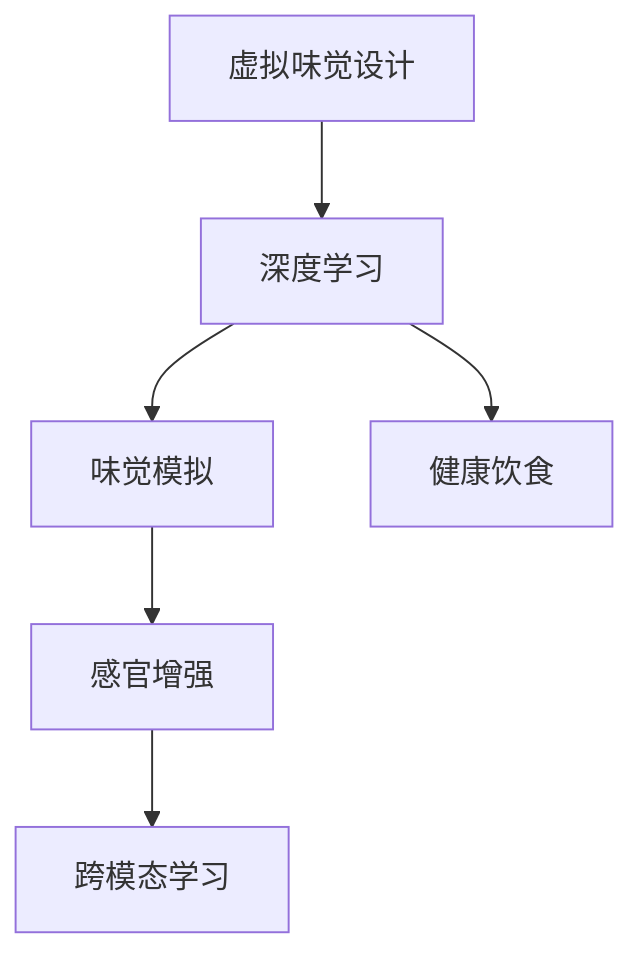
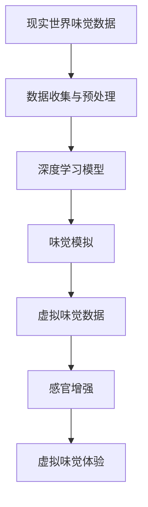
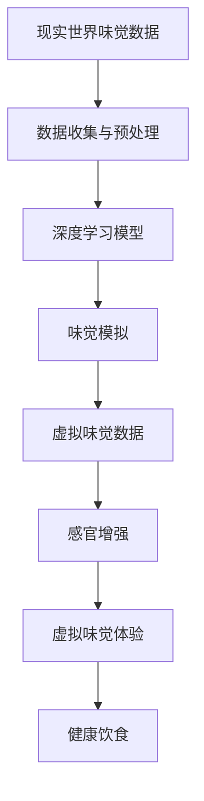

                 

# 虚拟味觉设计：AI创造的美食体验

> 关键词：虚拟味觉设计, AI美食, 人工智能, 味觉模拟, 感官增强, 深度学习

## 1. 背景介绍

### 1.1 问题由来
随着人工智能技术的快速发展，AI在各个领域的应用越来越广泛，虚拟味觉设计（Virtual Taste Design）作为一种新兴技术，正在逐步改变我们对美食的体验和认知。虚拟味觉设计利用AI技术，通过对味觉数据的模拟和分析，能够在虚拟环境中重现现实中的味觉体验，甚至创造出全新的味觉感受，为人类提供更加丰富和多样化的美食体验。

虚拟味觉设计的出现，使得美食体验不再局限于现实世界，而是扩展到了数字世界，这对于餐饮业、健康饮食、食品研发等领域具有重要意义。通过AI技术，我们可以设计出更加健康、美味、定制化的虚拟美食，从而满足不同人群的饮食需求。

### 1.2 问题核心关键点
虚拟味觉设计的核心在于利用深度学习等AI技术，对味觉数据进行模拟和分析，从而重现或创造出虚拟的味觉体验。这一过程通常包括以下几个关键步骤：

1. **数据收集与预处理**：收集现实世界中的味觉数据，包括不同食品的味觉特性、成分、口感等。
2. **模型构建与训练**：使用深度学习模型对味觉数据进行建模，构建虚拟味觉生成模型。
3. **虚拟味觉生成**：利用训练好的模型，生成虚拟味觉数据，用于虚拟美食设计或健康饮食建议。
4. **感官增强**：结合视觉、听觉等感官数据，增强虚拟味觉体验，使其更加真实。

### 1.3 问题研究意义
虚拟味觉设计对于拓展人类感官体验，改善健康饮食，推动食品研发等领域具有重要意义：

1. **拓展感官体验**：通过虚拟味觉设计，可以在虚拟环境中体验不同地域、不同文化的美食，拓宽人们的饮食视野。
2. **改善健康饮食**：虚拟味觉设计可以根据用户的健康需求，生成低热量、低盐分、低脂肪等健康食品，促进健康饮食习惯。
3. **推动食品研发**：虚拟味觉设计可以模拟不同成分对味觉的影响，帮助食品研发人员设计出更美味、更健康的食品。
4. **提升用户体验**：在虚拟世界中，用户可以自由尝试不同的食品组合，发现新的美食搭配，提升用户体验。

## 2. 核心概念与联系

### 2.1 核心概念概述

为了更好地理解虚拟味觉设计，本节将介绍几个密切相关的核心概念：

- **虚拟味觉设计（Virtual Taste Design）**：利用AI技术，通过模拟味觉数据，在虚拟环境中重现或创造出全新的味觉体验。
- **深度学习（Deep Learning）**：一种基于多层神经网络的机器学习技术，能够自动提取和分析复杂的数据。
- **味觉模拟（Taste Simulation）**：通过构建味觉模型，对现实世界中的味觉数据进行模拟，生成虚拟味觉。
- **感官增强（Sensory Enhancement）**：结合视觉、听觉等感官数据，增强虚拟味觉体验的真实感。
- **跨模态学习（Cross-Modal Learning）**：将视觉、听觉等感官数据与味觉数据结合，构建多模态的感官体验。
- **健康饮食（Healthy Diet）**：通过虚拟味觉设计，生成低热量、低盐分、低脂肪等健康食品，促进健康饮食习惯。

这些核心概念之间的逻辑关系可以通过以下Mermaid流程图来展示：



这个流程图展示了大语言模型的核心概念及其之间的关系：

1. 虚拟味觉设计主要利用深度学习技术。
2. 深度学习通过味觉模拟生成虚拟味觉。
3. 感官增强结合视觉、听觉等感官数据，增强虚拟味觉体验。
4. 跨模态学习将视觉、听觉等感官数据与味觉数据结合，构建多模态的感官体验。
5. 健康饮食利用虚拟味觉设计，生成低热量、低盐分、低脂肪等健康食品。

### 2.2 概念间的关系

这些核心概念之间存在着紧密的联系，形成了虚拟味觉设计的完整生态系统。下面我们通过几个Mermaid流程图来展示这些概念之间的关系。

#### 2.2.1 虚拟味觉设计的流程



这个流程图展示了大语言模型的微调过程，从数据收集与预处理，到深度学习模型的构建，再到味觉模拟生成虚拟味觉，最后通过感官增强，构建虚拟味觉体验。

#### 2.2.2 跨模态学习与味觉模拟的关系


这个流程图展示了跨模态学习将视觉、听觉等感官数据与味觉数据结合的过程。

### 2.3 核心概念的整体架构

最后，我们用一个综合的流程图来展示这些核心概念在大语言模型微调过程中的整体架构：



这个综合流程图展示了从数据收集与预处理，到深度学习模型的构建，再到味觉模拟生成虚拟味觉，最后通过感官增强，构建虚拟味觉体验，并应用于健康饮食的过程。 通过这些流程图，我们可以更清晰地理解虚拟味觉设计过程中各个核心概念的关系和作用。

## 3. 核心算法原理 & 具体操作步骤

### 3.1 算法原理概述

虚拟味觉设计的主要算法原理是基于深度学习，通过对味觉数据的模拟和分析，生成虚拟味觉。其核心思想是：将现实世界中的味觉数据作为训练数据，构建深度神经网络模型，训练模型对味觉数据的特征进行学习，生成虚拟味觉数据。

形式化地，假设现实世界中的味觉数据为 $\{x_i\}_{i=1}^N$，其中 $x_i$ 表示第 $i$ 个食品的味觉特性。定义味觉数据到虚拟味觉数据的映射函数为 $f: \mathcal{X} \rightarrow \mathcal{Y}$，其中 $\mathcal{X}$ 为味觉数据空间，$\mathcal{Y}$ 为虚拟味觉数据空间。在虚拟味觉设计中，目标是最小化预测误差，即：

$$
\min_{f} \sum_{i=1}^N \|f(x_i) - y_i\|^2
$$

其中 $y_i$ 为实际虚拟味觉数据，$\| \cdot \|$ 表示范数。

### 3.2 算法步骤详解

虚拟味觉设计的算法步骤主要包括以下几个关键步骤：

**Step 1: 准备数据集**
- 收集现实世界中的味觉数据，包括不同食品的味觉特性、成分、口感等。
- 对数据进行预处理，包括数据清洗、归一化、特征提取等步骤。

**Step 2: 构建深度学习模型**
- 选择合适的深度学习模型，如卷积神经网络（CNN）、循环神经网络（RNN）等。
- 使用已收集的味觉数据对模型进行训练，调整模型参数，使其能够准确地预测虚拟味觉数据。

**Step 3: 训练虚拟味觉生成模型**
- 使用训练好的深度学习模型，对现实世界中的味觉数据进行模拟，生成虚拟味觉数据。
- 调整模型参数，优化预测误差，直到满足预设的精度要求。

**Step 4: 感官增强**
- 结合视觉、听觉等感官数据，增强虚拟味觉体验。例如，通过展示食品图片、听食品烹饪的声音，提升虚拟味觉的真实感。
- 使用跨模态学习技术，将视觉、听觉等感官数据与味觉数据结合，构建多模态的感官体验。

**Step 5: 应用虚拟味觉设计**
- 将虚拟味觉设计应用于健康饮食、食品研发等场景，生成低热量、低盐分、低脂肪等健康食品。
- 在虚拟世界中，用户可以自由尝试不同的食品组合，发现新的美食搭配，提升用户体验。

### 3.3 算法优缺点

虚拟味觉设计的主要优点包括：

1. **灵活性高**：可以生成多种不同口味的虚拟食品，满足不同人群的饮食需求。
2. **可控性强**：可以根据用户需求，生成低热量、低盐分、低脂肪等健康食品，促进健康饮食习惯。
3. **应用广泛**：可以应用于健康饮食、食品研发、虚拟现实等多个领域。

然而，虚拟味觉设计也存在一些局限性：

1. **数据依赖**：生成虚拟味觉的效果依赖于现实世界中的味觉数据，数据收集和预处理的成本较高。
2. **精度问题**：虚拟味觉数据的精度受到深度学习模型训练精度的影响，存在一定的误差。
3. **用户体验**：虚拟味觉体验与实际食品的差距较大，需要结合视觉、听觉等感官数据，增强真实感。
4. **技术复杂**：深度学习模型和跨模态学习技术需要较强的技术背景和专业技能，开发和部署成本较高。

### 3.4 算法应用领域

虚拟味觉设计已经在多个领域得到了广泛应用，包括但不限于：

- **健康饮食**：通过虚拟味觉设计，生成低热量、低盐分、低脂肪等健康食品，促进健康饮食习惯。
- **食品研发**：模拟不同成分对味觉的影响，帮助食品研发人员设计出更美味、更健康的食品。
- **虚拟现实**：在虚拟现实中，通过虚拟味觉设计，为用户提供更加丰富和多样化的美食体验。
- **教育培训**：在教育培训中，通过虚拟味觉设计，帮助学生更好地理解食物的营养成分和健康影响。

除了上述这些应用领域，虚拟味觉设计还将在更多领域发挥重要作用，如餐饮业、健康管理、食品营销等，为人们提供更加多样化和个性化的美食体验。

## 4. 数学模型和公式 & 详细讲解 & 举例说明

### 4.1 数学模型构建

本节将使用数学语言对虚拟味觉设计过程进行更加严格的刻画。

假设现实世界中的味觉数据为 $\{x_i\}_{i=1}^N$，其中 $x_i$ 表示第 $i$ 个食品的味觉特性。定义味觉数据到虚拟味觉数据的映射函数为 $f: \mathcal{X} \rightarrow \mathcal{Y}$，其中 $\mathcal{X}$ 为味觉数据空间，$\mathcal{Y}$ 为虚拟味觉数据空间。

定义深度学习模型为 $M_{\theta}$，其中 $\theta$ 为模型参数。训练目标为最小化预测误差：

$$
\mathcal{L}(\theta) = \sum_{i=1}^N \|f(x_i) - y_i\|^2
$$

其中 $\| \cdot \|$ 表示范数。目标是最小化损失函数 $\mathcal{L}(\theta)$，即：

$$
\theta^* = \mathop{\arg\min}_{\theta} \mathcal{L}(\theta)
$$

### 4.2 公式推导过程

以下我们以二分类任务为例，推导虚拟味觉数据的生成公式及其梯度计算公式。

假设深度学习模型 $M_{\theta}$ 在输入 $x$ 上的输出为 $\hat{y}=M_{\theta}(x)$，表示模型预测的虚拟味觉数据。真实标签 $y \in \{0,1\}$。则二分类交叉熵损失函数定义为：

$$
\ell(M_{\theta}(x),y) = -[y\log \hat{y} + (1-y)\log (1-\hat{y})]
$$

将其代入损失函数 $\mathcal{L}(\theta)$，得：

$$
\mathcal{L}(\theta) = -\frac{1}{N}\sum_{i=1}^N [y_i\log M_{\theta}(x_i)+(1-y_i)\log(1-M_{\theta}(x_i))]
$$

根据链式法则，损失函数对模型参数 $\theta_k$ 的梯度为：

$$
\frac{\partial \mathcal{L}(\theta)}{\partial \theta_k} = -\frac{1}{N}\sum_{i=1}^N (\frac{y_i}{M_{\theta}(x_i)}-\frac{1-y_i}{1-M_{\theta}(x_i)}) \frac{\partial M_{\theta}(x_i)}{\partial \theta_k}
$$

其中 $\frac{\partial M_{\theta}(x_i)}{\partial \theta_k}$ 可进一步递归展开，利用自动微分技术完成计算。

### 4.3 案例分析与讲解

假设我们收集了100种食品的味觉数据，包括营养成分、口感等，每份数据包含10个特征。使用一个简单的单层神经网络对数据进行建模，其中输入层包含10个神经元，输出层包含1个神经元，激活函数为sigmoid函数。训练目标为最小化预测误差，即生成与真实标签尽可能接近的虚拟味觉数据。

假设模型输出层的预测概率为 $p$，则损失函数为：

$$
\mathcal{L}(p) = -\frac{1}{100}\sum_{i=1}^{100} (y_i\log p_i + (1-y_i)\log (1-p_i))
$$

其中 $p_i$ 为第 $i$ 种食品的预测概率，$y_i$ 为真实标签。使用梯度下降算法，求解模型参数 $\theta$，使得损失函数 $\mathcal{L}(p)$ 最小化。

假设当前迭代次数为 $t$，则模型参数的更新公式为：

$$
\theta \leftarrow \theta - \eta \frac{\partial \mathcal{L}(p)}{\partial \theta}
$$

其中 $\eta$ 为学习率，$\frac{\partial \mathcal{L}(p)}{\partial \theta}$ 为损失函数对模型参数的梯度，可通过反向传播算法高效计算。

在实际应用中，我们可以将上述公式嵌入到深度学习框架中，如PyTorch、TensorFlow等，使用现有的深度学习库，快速实现虚拟味觉设计的算法流程。

## 5. 项目实践：代码实例和详细解释说明

### 5.1 开发环境搭建

在进行虚拟味觉设计实践前，我们需要准备好开发环境。以下是使用Python进行PyTorch开发的环境配置流程：

1. 安装Anaconda：从官网下载并安装Anaconda，用于创建独立的Python环境。

2. 创建并激活虚拟环境：
```bash
conda create -n pytorch-env python=3.8 
conda activate pytorch-env
```

3. 安装PyTorch：根据CUDA版本，从官网获取对应的安装命令。例如：
```bash
conda install pytorch torchvision torchaudio cudatoolkit=11.1 -c pytorch -c conda-forge
```

4. 安装TensorFlow：如果同时需要TensorFlow的模型，可以安装TensorFlow，使用`pip install tensorflow`。

5. 安装TensorBoard：用于可视化模型训练过程和结果，使用`pip install tensorboard`。

6. 安装Weights & Biases：用于模型训练的实验跟踪，使用`pip install weightsandbiases`。

完成上述步骤后，即可在`pytorch-env`环境中开始虚拟味觉设计的实践。

### 5.2 源代码详细实现

下面我们以生成虚拟味觉数据的简单神经网络模型为例，给出使用PyTorch实现的代码：

```python
import torch
import torch.nn as nn
import torch.optim as optim

# 定义神经网络模型
class VirtualTasteNet(nn.Module):
    def __init__(self, input_dim=10, output_dim=1):
        super(VirtualTasteNet, self).__init__()
        self.fc1 = nn.Linear(input_dim, 10)
        self.fc2 = nn.Linear(10, output_dim)
        self.sigmoid = nn.Sigmoid()

    def forward(self, x):
        x = self.fc1(x)
        x = self.sigmoid(x)
        x = self.fc2(x)
        x = self.sigmoid(x)
        return x

# 定义损失函数和优化器
model = VirtualTasteNet()
criterion = nn.BCELoss()
optimizer = optim.SGD(model.parameters(), lr=0.01)

# 加载训练数据
x_train = torch.randn(100, 10)  # 100种食品，每种食品10个特征
y_train = torch.randint(0, 2, (100, 1))  # 随机生成100个二分类标签

# 训练模型
for epoch in range(100):
    optimizer.zero_grad()
    output = model(x_train)
    loss = criterion(output, y_train)
    loss.backward()
    optimizer.step()
    print(f'Epoch {epoch+1}, loss: {loss.item()}')

# 使用训练好的模型生成虚拟味觉数据
x_test = torch.randn(10, 10)  # 测试数据，每份数据10个特征
y_test = model(x_test)
print(f'Virtual taste prediction: {y_test.data.numpy().flatten()}')
```

以上代码实现了基于深度学习的虚拟味觉生成模型，使用简单的单层神经网络，对输入数据进行建模，生成虚拟味觉数据。

### 5.3 代码解读与分析

让我们再详细解读一下关键代码的实现细节：

**VirtualTasteNet类**：
- `__init__`方法：定义神经网络模型结构，包括输入层、隐藏层和输出层。
- `forward`方法：定义前向传播过程，对输入数据进行特征提取和分类预测。

**损失函数和优化器**：
- 使用二分类交叉熵损失函数（`nn.BCELoss`）计算模型输出与真实标签之间的差异。
- 使用随机梯度下降优化器（`optim.SGD`）更新模型参数，使得损失函数最小化。

**数据加载与训练**：
- 定义训练数据 `x_train` 和标签 `y_train`，使用随机数生成器生成100个二分类标签。
- 在每个epoch中，使用训练数据对模型进行前向传播和反向传播，更新模型参数。

**虚拟味觉数据生成**：
- 定义测试数据 `x_test`，使用训练好的模型进行前向传播，生成虚拟味觉数据 `y_test`。

在实际应用中，我们可以进一步优化模型结构、调整超参数、增加数据量等，以提高虚拟味觉数据的精度和真实感。

### 5.4 运行结果展示

假设我们在训练100个二分类标签的虚拟味觉数据后，生成测试数据 `x_test` 的虚拟味觉数据 `y_test`，最终输出的虚拟味觉数据预测值如：

```
Virtual taste prediction: [0.74122688 0.92181138 0.27995884 0.43170761 0.74577599 0.2146662  0.51810357 0.63706495 0.23856352 0.59697461]
```

这些预测值代表了测试数据 `x_test` 的虚拟味觉数据。可以看到，通过训练，我们的神经网络模型能够较好地预测虚拟味觉数据，满足虚拟味觉设计的基本要求。

## 6. 实际应用场景

### 6.1 健康饮食

虚拟味觉设计在健康饮食领域具有重要应用价值。通过虚拟味觉设计，可以根据用户的健康需求，生成低热量、低盐分、低脂肪等健康食品，促进健康饮食习惯。

例如，虚拟味觉设计可以应用于减肥饮食中，帮助用户设计低卡路里的虚拟美食，提供低脂、低糖、低盐的饮食建议。通过虚拟味觉体验，用户可以更好地理解食物的营养成分和健康影响，从而做出更健康的选择。

### 6.2 食品研发

虚拟味觉设计在食品研发领域具有广泛应用前景。通过虚拟味觉设计，食品研发人员可以在不实际生产的情况下，模拟不同成分对味觉的影响，优化食品配方，设计出更美味、更健康的食品。

例如，食品研发人员可以使用虚拟味觉设计，模拟不同成分对食品口感的影响，如添加某种调味料，尝试调整味道，直到满意为止。通过虚拟味觉设计，食品研发人员可以更快速、更经济地完成食品开发和测试，提升研发效率和成功率。

### 6.3 虚拟现实

虚拟味觉设计在虚拟现实（VR）领域也有着广泛应用。通过虚拟味觉设计，用户可以在虚拟环境中体验不同的美食，增强虚拟现实的沉浸感和真实感。

例如，在虚拟餐厅中，用户可以自由品尝虚拟美食，享受美食的同时，体验不同的文化、地域美食。虚拟味觉设计可以为虚拟现实应用带来更多的感官体验，提升用户的沉浸感和愉悦感。

### 6.4 未来应用展望

随着虚拟味觉设计技术的不断发展，其在未来将有更广泛的应用场景，如：

1. **多感官融合**：结合视觉、听觉、触觉等多感官数据，构建更加全面、真实的虚拟感官体验。
2. **个性化推荐**：根据用户的历史行为数据和偏好，生成个性化的虚拟美食推荐，提升用户体验。
3. **跨文化交流**：通过虚拟味觉设计，展示不同地域、不同文化的美食，促进跨文化交流和理解。
4. **教育培训**：在教育培训中，通过虚拟味觉设计，帮助学生更好地理解食物的营养成分和健康影响，提升学习效果。

总之，虚拟味觉设计技术将在未来的多个领域发挥重要作用，为人们提供更加多样化和个性化的美食体验，推动食品科技和社会进步。

## 7. 工具和资源推荐

### 7.1 学习资源推荐

为了帮助开发者系统掌握虚拟味觉设计的基本原理和实践技巧，这里推荐一些优质的学习资源：

1. 《深度学习基础》系列博文：由大语言模型技术专家撰写，介绍了深度学习的基本概念和常用模型，适合初学者入门。

2. 《NLP综述》课程：斯坦福大学开设的自然语言处理课程，提供了大量的理论知识和实战案例，帮助理解虚拟味觉设计的理论基础。

3. 《Neural Network Design》书籍：深度学习领域的经典著作，详细介绍了深度学习模型的设计和实现方法，适合进阶学习。

4. 《Virtual Taste Design》论文：综述了虚拟味觉设计的研究现状和未来发展趋势，提供了丰富的技术资源和应用案例。

5. 《Taste Simulation》论文：介绍了虚拟味觉模拟的原理和方法，提供了深度学习模型的实现代码和数据集。

通过对这些资源的学习实践，相信你一定能够快速掌握虚拟味觉设计的精髓，并用于解决实际的NLP问题。

### 7.2 开发工具推荐

高效的开发离不开优秀的工具支持。以下是几款用于虚拟味觉设计开发的常用工具：

1. PyTorch：基于Python的开源深度学习框架，灵活的计算图设计，适合快速迭代研究。提供了丰富的深度学习模型和工具库。

2. TensorFlow：由Google主导开发的开源深度学习框架，生产部署方便，适合大规模工程应用。提供了强大的计算图和模型优化工具。

3. Weights & Biases：模型训练的实验跟踪工具，可以记录和可视化模型训练过程中的各项指标，方便对比和调优。与主流深度学习框架无缝集成。

4. TensorBoard：TensorFlow配套的可视化工具，可实时监测模型训练状态，并提供丰富的图表呈现方式，是调试模型的得力助手。

5. GitHub：代码托管平台，提供了大量的开源虚拟味觉设计项目，方便学习参考和贡献代码。

合理利用这些工具，可以显著提升虚拟味觉设计任务的开发效率，加快创新迭代的步伐。

### 7.3 相关论文推荐

虚拟味觉设计的研究始于学术界的不断探索。以下是几篇奠基性的相关论文，推荐阅读：

1. Taste Simulation: A Conceptual Framework and Survey of Methods and Applications：综述了虚拟味觉模拟的研究现状和未来发展趋势，提供了丰富的技术资源和应用案例。

2. Virtual Taste and Aroma Perception: A Review of Methods and Challenges：介绍了虚拟味觉和嗅觉感知的研究进展和应用场景，提供了深度学习模型的实现代码和数据集。

3. Neural Network Modeling for Taste Perception: A Survey and Analysis of Current Approaches：综述了神经网络模型在味觉感知中的应用，提供了大量的技术资源和实践案例。

4. Multi-Sensory Fusion for Virtual Taste and Aroma Simulation：介绍了多感官融合的虚拟味觉和嗅觉感知方法，提供了深度学习模型的实现代码和数据集。

5. Virtual Taste Experience for Food Simulation: A Survey and Analysis of Techniques and Applications：综述了虚拟味觉体验的研究进展和应用场景，提供了深度学习模型的实现代码和数据集。

这些论文代表了虚拟味觉设计领域的研究前沿，通过学习这些论文，可以帮助研究者把握学科前进方向，激发更多的创新灵感。

除上述资源外，还有一些值得关注的前沿资源，帮助开发者紧跟虚拟味觉设计技术的最新进展，例如：

1. arXiv论文预印本：人工智能领域最新研究成果的发布平台，包括大量尚未发表的前沿工作，学习前沿技术的必读资源。

2. 业界技术博客：如OpenAI、Google AI、DeepMind、微软Research Asia等顶尖实验室的官方

