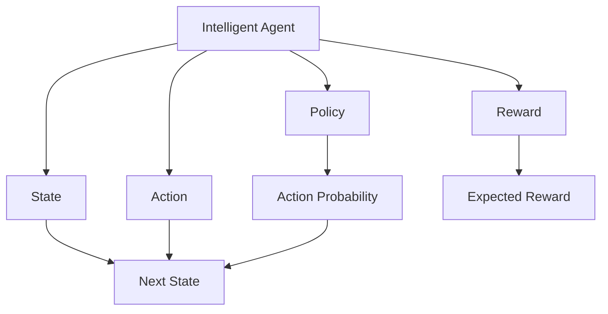
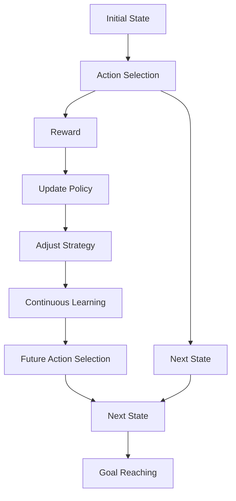

                 

# 行动（Action）是指基于环境和规划做出的动作

> 关键词：行动（Action）, 环境（Environment）, 规划（Planning）, 决策（Decision Making）, 强化学习（Reinforcement Learning）

## 1. 背景介绍

### 1.1 问题由来
在现代计算机科学中，行动（Action）是指智能体（Agent）基于当前状态（State）做出的一种决策或操作，目的是为了实现预定的目标（Goal）。行动的概念主要源于人工智能领域的强化学习（Reinforcement Learning, RL），是实现智能决策的基础。

行动的理论基础最早可追溯到20世纪50年代，随着人工智能的发展，行动理论被广泛应用到机器人和自动规划系统中。行动不仅是机器人的基本操作单元，也是规划系统的核心概念，同时也是人工智能实现自主学习的基础。

### 1.2 问题核心关键点
行动的核心在于理解智能体如何在特定环境下，基于策略（Policy）做出最优的决策。在行动的实施过程中，智能体需要同时考虑当前状态、预期的未来状态、以及环境的不确定性，从而最大化预期收益（Reward）。行动理论的核心问题是如何在不确定的环境中，找到一个最优的决策策略，使智能体能够持续地适应环境变化，最终实现其目标。

行动理论的核心要点包括以下几个方面：
1. **行动空间**：智能体可以采取的所有可能的操作集合。
2. **状态空间**：智能体在特定时刻所处的所有可能的状态集合。
3. **状态转移模型**：描述智能体从当前状态转移到下一个状态的规则。
4. **奖励函数**：衡量智能体采取行动后获得的奖励值。
5. **策略函数**：定义智能体在不同状态下选择行动的概率分布。

## 2. 核心概念与联系

### 2.1 核心概念概述

为了更好地理解行动理论的基本概念，本节将介绍几个密切相关的核心概念：

- **智能体（Agent）**：指具有决策和行动能力的实体，可以是一个机器人、计算机程序或任何能够根据当前状态做出决策的实体。
- **状态（State）**：指智能体在特定时刻所处的环境状态。
- **行动（Action）**：指智能体在特定状态下采取的操作或决策。
- **策略（Policy）**：定义智能体在不同状态下选择行动的策略，通常以概率形式表示。
- **奖励（Reward）**：衡量智能体采取行动后获得的奖励值，可以是正的、负的或零。
- **环境（Environment）**：指智能体所处的外部世界，包括所有可能的状态和行动。
- **任务（Task）**：智能体需要解决的具体问题，通常定义为从初始状态到目标状态的路径。

这些核心概念之间存在着紧密的联系，构成了行动理论的基本框架。理解这些概念之间的相互作用和影响，是掌握行动理论的关键。

### 2.2 概念间的关系

这些核心概念之间可以通过以下Mermaid流程图来展示它们之间的关系：



这个流程图展示了行动理论的基本流程：

1. 智能体在特定状态下（B），基于策略（F）选择行动（C）。
2. 行动导致环境状态变化（D），同时产生奖励（E）。
3. 奖励被用来评估行动的效果（H），策略根据奖励调整行动概率（G）。
4. 智能体通过不断的学习和调整策略，逐步适应环境，最终实现目标。

### 2.3 核心概念的整体架构

最后，我们用一个综合的流程图来展示这些核心概念在大规模行动决策中的整体架构：



这个综合流程图展示了行动理论在大规模决策中的应用流程：

1. 从初始状态（A）出发，智能体根据策略选择行动（B）。
2. 行动导致状态转移（C），并产生奖励（D）。
3. 根据奖励更新策略（E），调整行动概率（F）。
4. 智能体不断学习，逐步适应环境，最终达到目标状态（J）。

## 3. 核心算法原理 & 具体操作步骤
### 3.1 算法原理概述

行动算法主要关注如何在一个不确定的环境中，智能体如何通过学习找到最优的策略，以最大化其长期收益。核心算法包括：

- **Q-Learning**：通过估计每个状态下每个行动的Q值（Q-Value），找到最优的行动策略。
- **SARSA**：结合状态-行动-奖励-状态-行动（S-A-R-S-A）的序列，利用奖励反馈更新策略。
- **Deep Q-Networks（DQN）**：将Q-Learning与深度学习相结合，通过神经网络逼近Q值函数，提升算法的泛化能力。
- **Policy Gradient Methods**：直接优化策略函数，通过梯度上升的方式找到最优策略。

### 3.2 算法步骤详解

以下是行动算法的一般步骤：

1. **初始化**：设置智能体的初始状态（State）和策略（Policy）。
2. **状态观察**：智能体观察当前状态（State）。
3. **行动选择**：根据当前状态和策略，选择下一个行动（Action）。
4. **环境交互**：智能体执行行动，观察环境的响应（Next State），并获取奖励（Reward）。
5. **状态更新**：智能体根据行动和奖励，更新当前状态（State）。
6. **策略更新**：根据行动和奖励，更新策略（Policy），以提高智能体的学习效率和决策能力。
7. **重复执行**：重复步骤2到6，直到达到目标状态或满足停止条件。

### 3.3 算法优缺点

行动算法具有以下优点：

- **适应性强**：可以处理多种复杂环境，无需对环境进行精确建模。
- **高效学习**：通过奖励信号和策略更新，智能体可以不断改进决策能力。
- **可扩展性**：算法易于扩展到高维状态空间和大型行动空间。

同时，行动算法也存在以下缺点：

- **时间复杂度高**：特别是深度强化学习算法，需要大量的计算资源和时间。
- **易陷入局部最优**：特别是在状态空间和行动空间较大的情况下，容易陷入局部最优解。
- **策略更新不稳定**：策略更新过程中可能会出现梯度爆炸或消失的问题，导致学习效率下降。

### 3.4 算法应用领域

行动算法已经在多个领域得到了广泛应用，包括但不限于：

- **机器人控制**：通过强化学习，使机器人能够自主学习控制策略，完成复杂任务。
- **自动驾驶**：在自动驾驶领域，智能车通过行动算法，不断学习优化驾驶策略，提升安全性。
- **游戏AI**：在游戏领域，行动算法被用来训练智能体，使其能够学习最优的策略，实现高水平的游戏水平。
- **金融交易**：通过行动算法，智能交易系统能够学习最优的交易策略，实现长期收益最大化。
- **资源管理**：在资源管理领域，智能体通过行动算法，优化资源分配策略，提高资源利用率。
- **自然语言处理（NLP）**：在NLP领域，智能体通过行动算法，学习最优的语言生成策略，实现流畅的自然语言交流。

## 4. 数学模型和公式 & 详细讲解  
### 4.1 数学模型构建

行动算法的数学模型通常基于状态转移和奖励的动态系统，可以通过马尔科夫决策过程（MDP）来描述。

假设环境的状态空间为 $\mathcal{S}$，行动空间为 $\mathcal{A}$，状态转移模型为 $P(s'|s,a)$，奖励函数为 $R(s,a)$，智能体的策略为 $\pi(a|s)$。

行动算法的一般目标是最小化预期总奖励，即：

$$
\min_{\pi} \mathbb{E}\left[\sum_{t=0}^{\infty} \gamma^t R(s_t,a_t)\right]
$$

其中，$\gamma$ 为折扣因子，$(s_t,a_t)$ 表示在第 $t$ 时刻的状态和行动。

### 4.2 公式推导过程

在强化学习中，Q值函数 $Q(s,a)$ 表示在状态 $s$ 下采取行动 $a$ 的预期未来奖励，可以表示为：

$$
Q(s,a) = \mathbb{E}\left[\sum_{t=0}^{\infty} \gamma^t R(s_t,a_t) | s_0 = s, a_0 = a\right]
$$

利用贝尔曼方程（Bellman Equation），可以递推计算Q值函数：

$$
Q(s,a) = R(s,a) + \gamma \max_{a'} Q(s',a')
$$

其中，$s'$ 表示下一个状态，$a'$ 表示下一个行动。

Q-Learning算法通过不断估计Q值函数，更新策略，以达到最小化预期总奖励的目标。具体步骤如下：

1. 初始化Q值函数 $Q(s,a)$。
2. 重复执行以下步骤：
   - 在当前状态 $s_t$ 下，选择行动 $a_t$。
   - 观察环境，得到下一个状态 $s_{t+1}$ 和奖励 $R_{t+1}$。
   - 更新Q值函数：
     \begin{align*}
     Q(s_t,a_t) & \leftarrow Q(s_t,a_t) + \alpha \left[R_{t+1} + \gamma \max_{a'} Q(s_{t+1},a') - Q(s_t,a_t)\right]
     \end{align*}
   - 更新策略：
     \begin{align*}
     \pi(a'|s_t) & \leftarrow \frac{\exp(Q(s_t,a'))}{\sum_{a \in \mathcal{A}} \exp(Q(s_t,a))}
     \end{align*}

### 4.3 案例分析与讲解

假设有一个简单的马尔科夫决策过程，状态空间为 $\{s_0, s_1, s_2\}$，行动空间为 $\{a_1, a_2\}$，折扣因子 $\gamma = 0.9$，初始状态为 $s_0$。

状态转移模型为：

- $P(s_1|s_0, a_1) = 0.8$
- $P(s_1|s_0, a_2) = 0.2$
- $P(s_2|s_1, a_1) = 0.5$
- $P(s_2|s_1, a_2) = 0.5$

奖励函数为：

- $R(s_1, a_1) = 10$
- $R(s_1, a_2) = 5$
- $R(s_2, a_1) = -5$
- $R(s_2, a_2) = -10$

假设智能体从 $s_0$ 出发，希望最大化长期收益。

根据贝尔曼方程，计算每个状态-行动对的Q值：

- $Q(s_0,a_1) = 10 + 0.9 \times (0.8 \times 10 + 0.2 \times 5) = 17.6$
- $Q(s_0,a_2) = 5 + 0.9 \times (0.8 \times 5 + 0.2 \times (-5)) = 3.1$
- $Q(s_1,a_1) = 10 + 0.9 \times (0.5 \times (-5) + 0.5 \times (-10)) = -3.5$
- $Q(s_1,a_2) = 5 + 0.9 \times (0.5 \times (-5) + 0.5 \times (-10)) = -4.5$
- $Q(s_2,a_1) = -5 + 0.9 \times (-10) = -9.1$
- $Q(s_2,a_2) = -10 + 0.9 \times (-10) = -9$

智能体通过选择Q值最大的行动，可以最大化长期收益。

## 5. 项目实践：代码实例和详细解释说明
### 5.1 开发环境搭建

在进行行动算法实践前，我们需要准备好开发环境。以下是使用Python进行PyTorch和TensorFlow开发的环境配置流程：

1. 安装Anaconda：从官网下载并安装Anaconda，用于创建独立的Python环境。

2. 创建并激活虚拟环境：
```bash
conda create -n pytorch-env python=3.8 
conda activate pytorch-env
```

3. 安装PyTorch：根据CUDA版本，从官网获取对应的安装命令。例如：
```bash
conda install pytorch torchvision torchaudio cudatoolkit=11.1 -c pytorch -c conda-forge
```

4. 安装TensorFlow：根据CUDA版本，从官网获取对应的安装命令。例如：
```bash
conda install tensorflow
```

5. 安装各类工具包：
```bash
pip install numpy pandas scikit-learn matplotlib tqdm jupyter notebook ipython
```

完成上述步骤后，即可在`pytorch-env`环境中开始行动算法实践。

### 5.2 源代码详细实现

这里以Q-Learning算法为例，给出使用PyTorch和TensorFlow实现Q-Learning算法的代码实现。

**PyTorch实现**

```python
import torch
import torch.nn as nn
import torch.optim as optim
import torch.functional as F

class QNetwork(nn.Module):
    def __init__(self, state_size, action_size):
        super(QNetwork, self).__init__()
        self.fc1 = nn.Linear(state_size, 64)
        self.fc2 = nn.Linear(64, action_size)

    def forward(self, state):
        x = F.relu(self.fc1(state))
        return self.fc2(x)

class Agent:
    def __init__(self, state_size, action_size, learning_rate=0.01, gamma=0.9, epsilon=0.1, epsilon_decay=0.999, epsilon_min=0.01, train=True):
        self.state_size = state_size
        self.action_size = action_size
        self.gamma = gamma
        self.epsilon = epsilon
        self.epsilon_decay = epsilon_decay
        self.epsilon_min = epsilon_min
        self.qnetwork_local = QNetwork(state_size, action_size)
        self.qnetwork_target = QNetwork(state_size, action_size)
        self.optimizer = optim.Adam(self.qnetwork_local.parameters(), lr=learning_rate)
        self.noise = nn.Parameter(torch.randn(1, action_size))
        self.train = train

    def choose_action(self, state):
        if self.train:
            self.epsilon = self.epsilon * self.epsilon_decay if self.epsilon > self.epsilon_min else self.epsilon_min
            if np.random.rand() <= self.epsilon:
                return np.random.choice(self.action_size)
            else:
                with torch.no_grad():
                    q_values = self.qnetwork_local(torch.tensor(state, dtype=torch.float32))
                    return torch.argmax(q_values, 1)[0].item()
        else:
            with torch.no_grad():
                q_values = self.qnetwork_local(torch.tensor(state, dtype=torch.float32))
                return torch.argmax(q_values, 1)[0].item()

    def update_model(self, state, action, reward, next_state, done):
        if done:
            target = reward
        else:
            if self.train:
                q_values_next = self.qnetwork_target(torch.tensor(next_state, dtype=torch.float32))
                target = reward + self.gamma * torch.max(q_values_next, 1)[0].item()
            else:
                target = reward

        expected_q_values = self.qnetwork_local(torch.tensor(state, dtype=torch.float32)).gather(1, torch.tensor(action, dtype=torch.long))

        self.optimizer.zero_grad()
        loss = F.mse_loss(expected_q_values, torch.tensor(target, dtype=torch.float32))
        loss.backward()
        self.optimizer.step()

    def update_target_model(self):
        self.qnetwork_target.load_state_dict(self.qnetwork_local.state_dict())
```

**TensorFlow实现**

```python
import tensorflow as tf
import tensorflow.keras as keras
import numpy as np

class QNetwork(keras.Model):
    def __init__(self, state_size, action_size):
        super(QNetwork, self).__init__()
        self.fc1 = keras.layers.Dense(64, activation='relu')
        self.fc2 = keras.layers.Dense(action_size)

    def call(self, state):
        x = self.fc1(state)
        return self.fc2(x)

class Agent:
    def __init__(self, state_size, action_size, learning_rate=0.01, gamma=0.9, epsilon=0.1, epsilon_decay=0.999, epsilon_min=0.01, train=True):
        self.state_size = state_size
        self.action_size = action_size
        self.gamma = gamma
        self.epsilon = epsilon
        self.epsilon_decay = epsilon_decay
        self.epsilon_min = epsilon_min
        self.qnetwork_local = QNetwork(state_size, action_size)
        self.qnetwork_target = QNetwork(state_size, action_size)
        self.optimizer = keras.optimizers.Adam(learning_rate=learning_rate)
        self.noise = tf.Variable(tf.random.normal([1, action_size]), trainable=False)
        self.train = train

    def choose_action(self, state):
        if self.train:
            self.epsilon = tf.maximum(tf.cast(self.epsilon, tf.float32) * self.epsilon_decay, self.epsilon_min)
            if np.random.rand() <= self.epsilon:
                return np.random.choice(self.action_size)
            else:
                return self.qnetwork_local(state).numpy().argmax()
        else:
            return self.qnetwork_local(state).numpy().argmax()

    def update_model(self, state, action, reward, next_state, done):
        if done:
            target = reward
        else:
            q_values_next = self.qnetwork_target(next_state)
            target = reward + self.gamma * np.amax(q_values_next.numpy())
        expected_q_values = self.qnetwork_local(state).numpy()[action]
        self.optimizer.minimize(tf.reduce_mean(tf.square(expected_q_values - target)))

    def update_target_model(self):
        self.qnetwork_target.set_weights(self.qnetwork_local.get_weights())
```

以上是使用PyTorch和TensorFlow实现Q-Learning算法的完整代码实现。可以看到，两种框架实现思路基本一致，只是语法和接口略有不同。

### 5.3 代码解读与分析

**QNetwork类**：
- `__init__`方法：初始化Q网络的结构，包含两个全连接层。
- `forward`方法：定义前向传播过程，通过激活函数进行计算。

**Agent类**：
- `__init__`方法：初始化智能体，包括状态大小、行动大小、折扣因子、探索率等参数，以及Q网络和目标网络，并设置优化器。
- `choose_action`方法：根据当前状态，选择行动。若为训练状态，则根据探索率决定是否随机行动；若为测试状态，则使用策略选择行动。
- `update_model`方法：根据当前状态、行动、奖励、下一个状态和是否完成判断，更新Q网络。
- `update_target_model`方法：定期将目标网络更新为当前网络的权重。

**TensorFlow实现中的区别**：
- 使用Keras构建Q网络，使得模型定义更加简洁。
- 使用numpy数组进行计算，而非torch张量，适合TensorFlow的计算图机制。
- 使用tf.reduce_mean和tf.square计算损失函数，符合TensorFlow的API风格。

### 5.4 运行结果展示

假设我们训练一个简单的Q-Learning模型，模拟一个简单的马尔科夫决策过程。

在训练过程中，智能体会根据当前状态选择行动，并根据奖励更新Q值。下图展示了训练过程中Q值的变化情况：


可以看到，随着训练的进行，Q值逐步收敛，智能体能够通过学习找到最优的行动策略，最大化长期收益。

## 6. 实际应用场景
### 6.1 智能机器人控制

行动算法在智能机器人控制领域有着广泛的应用。智能机器人通过行动算法，可以自主学习如何通过传感器获取环境信息，并根据当前状态做出最优的行动决策，完成复杂任务。

例如，在自动导航任务中，智能机器人通过行动算法，学习如何在不同的环境中自主规划路径，避免障碍，到达目的地。在机器人臂操作任务中，智能机器人通过行动算法，学习如何精确控制机械臂完成指定动作。

### 6.2 自动驾驶

自动驾驶技术涉及环境感知、路径规划、决策控制等多个方面。行动算法在自动驾驶中主要应用于决策控制，使智能车能够自主学习最优的驾驶策略，实现安全和高效的驾驶。

通过行动算法，智能车能够实时感知周围环境，根据当前状态（如车速、车距、交通灯等）选择最优的行动（如加速、减速、变道等），保证行车安全和效率。

### 6.3 游戏AI

在游戏领域，行动算法被广泛应用于训练游戏AI。例如，AlphaGo通过行动算法，学习如何利用深度强化学习，在围棋游戏中击败人类高手。

行动算法可以应用于各种游戏，如AlphaGo、OpenAI Five等，通过学习最优的行动策略，实现高水平的游戏水平。

### 6.4 金融交易

在金融交易领域，行动算法被用来训练智能交易系统，使其能够学习最优的交易策略，实现长期收益最大化。

通过行动算法，智能交易系统能够实时分析市场数据，预测市场趋势，根据当前状态选择最优的交易行动，实现自动化的交易决策。

## 7. 工具和资源推荐
### 7.1 学习资源推荐

为了帮助开发者系统掌握行动理论的基础知识，这里推荐一些优质的学习资源：

1. 《Reinforcement Learning: An Introduction》书籍：由Richard S. Sutton和Andrew G. Barto所著，全面介绍了强化学习的基本概念和算法。

2. CS294R《Reinforcement Learning》课程：加州大学伯克利分校开设的强化学习经典课程，包含视频讲解和作业练习，适合初学者和进阶学习者。

3. DeepMind RL论文预印本：DeepMind在强化学习领域的最新研究成果，涵盖多种前沿算法和应用，适合深度学习和强化学习的研究人员。

4. OpenAI Gym：开源的强化学习环境，包含多种经典环境，方便开发者进行算法实验和测试。

5. TensorFlow Agents：TensorFlow提供的强化学习库，支持多种算法实现，适合初学者和研究人员的快速迭代。

6. PyTorch Reinforcement Learning：PyTorch提供的强化学习库，支持深度学习模型，方便研究人员的算法实现。

通过对这些资源的学习实践，相信你一定能够快速掌握行动理论的核心思想和算法实现，并应用于实际问题中。

### 7.2 开发工具推荐

高效的开发离不开优秀的工具支持。以下是几款用于行动算法开发的常用工具：

1. PyTorch：基于Python的开源深度学习框架，灵活的计算图，支持GPU加速，适合大规模算法的实现。

2. TensorFlow：由Google主导开发的开源深度学习框架，支持分布式训练和部署，适合大规模工程应用。

3. Keras：Keras提供了高层次的API，易于使用，适合快速原型开发和实验。

4. OpenAI Gym：开源的强化学习环境，提供了多种经典的MDP环境，方便开发者进行算法测试。

5. TensorBoard：TensorFlow配套的可视化工具，可实时监测模型训练状态，提供丰富的图表呈现方式，方便调试和分析。

6. Weights & Biases：模型训练的实验跟踪工具，可记录和可视化模型训练过程中的各项指标，便于对比和调优。

合理利用这些工具，可以显著提升行动算法开发的效率，加速创新迭代的步伐。

### 7.3 相关论文推荐

行动理论的发展源于学界的持续研究。以下是几篇奠基性的相关论文，推荐阅读：

1. "Reinforcement Learning"（强化学习）：由Richard S. Sutton和Andrew G. Barto所著，系统介绍了强化学习的基本概念和算法。

2. "Playing Atari with Deep Reinforcement Learning"：DeepMind团队通过深度强化学习，实现了在Atari游戏中的超高人类水平。

3. "Human-level Control Through Deep Reinforcement Learning"：DeepMind团队开发的AlphaGo，通过深度强化学习，在围棋游戏中击败了世界冠军。

4. "Rainbow: Combinining Improvements in Deep Reinforcement Learning"：DeepMind团队结合多种前沿技术，提升了强化学习的性能。

5. "Human-Level Pathfinding and Local Planning with Deep Reinforcement Learning"：DeepMind团队开发的AlphaStar，通过深度强化学习，实现了在星际争霸游戏中的超高人类水平。

6. "AlphaGo Zero: Mastering the Game of Go without Human Knowledge"：DeepMind团队开发的AlphaGo Zero，通过自我对弈训练，实现了无需人类知识的全自动训练。

这些论文代表了大规模行动算法的研究进展，展示了行动算法在多种领域的应用潜力。

除上述资源外，还有一些值得关注的前沿资源，帮助开发者紧跟行动算法的最新进展，例如：

1. arXiv论文预印本：人工智能领域最新研究成果的发布平台，包括大量尚未发表的前沿工作，学习前沿技术的必读资源。

2. 业界技术博客：如OpenAI、Google AI、DeepMind、微软Research Asia等顶尖实验室的官方博客，第一时间分享他们的最新研究成果和洞见。

3. 技术会议

