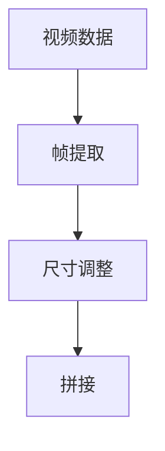

                 

# 视频数据的spacetime patches化

视频数据的空间时间patches化（spacetime patches）技术是指在处理视频数据时，将视频序列中的每一帧转化为固定尺寸的时空小块，从而将视频数据转化为类似图像的形式，使得视频数据的处理能够借鉴图像处理的方法。本文将详细探讨spacetime patches化的原理、操作步骤及其实际应用，并介绍一些工具和资源，以便读者更好地理解和应用这一技术。

## 1. 背景介绍

随着计算机视觉技术的不断进步，视频数据的处理和分析变得越来越重要。然而，视频数据相对于图像数据具有更大的复杂性和多样性，传统图像处理技术难以直接应用。视频数据的时空特性使得其在表示和处理上具有不同于图像的特殊性。为了更好地利用现有的图像处理技术和算法，需要将视频数据进行时空patches化，使其能够被标准化的图像处理算法所处理。

视频数据的时空特性主要体现在以下几个方面：
- **时间序列**：视频是一系列连续的图像帧，每个帧都是对某一时刻的视觉描述。
- **空间结构**：每个帧都是二维图像，具有空间结构。
- **时空耦合**：视频数据中的每个像素点都携带了时间和空间的信息，使得时空特性相互关联。

为了将视频数据转化为适合图像处理的形式，需要将其进行时空patches化。通过将视频序列中的每一帧转化为固定尺寸的时空小块，可以将视频数据转化为类似图像的形式，从而利用图像处理中的各种算法和技术。

## 2. 核心概念与联系

### 2.1 核心概念概述

- **视频数据**：指一系列连续的图像帧，通常表示为三维张量$V \in \mathbb{R}^{H \times W \times T}$，其中$H$、$W$和$T$分别表示视频的高、宽和时间维度。
- **时空patches**：指将视频数据中的每一帧转化为固定尺寸的时空小块，从而将视频数据转化为二维的图像数据。
- **patch**：指在图像处理中常用的二维图像块，用于提取局部特征。

### 2.2 核心概念之间的关系

视频数据的时空patches化技术将视频数据从三维形式转化为二维形式，从而使其能够被现有的图像处理算法所处理。这一过程可以通过以下步骤实现：
1. **帧提取**：从视频序列中提取每一帧图像。
2. **尺寸调整**：将每一帧图像调整为固定尺寸的时空小块。
3. **拼接**：将调整后的时空小块拼接成二维图像数据。

这一过程可以通过图2来表示：



通过这一过程，视频数据被转化为二维图像数据，从而可以利用现有的图像处理算法和技术。

## 3. 核心算法原理 & 具体操作步骤

### 3.1 算法原理概述

视频数据的时空patches化技术主要基于以下原理：
- **帧提取**：从视频序列中提取每一帧图像，形成视频帧序列$F = \{f_1, f_2, \ldots, f_T\}$。
- **尺寸调整**：将每一帧图像调整为固定尺寸的二维图像，形成调整后的时空小块$P_i \in \mathbb{R}^{H' \times W'}$。
- **拼接**：将调整后的时空小块按照时间顺序拼接成二维图像数据$P = \{P_1, P_2, \ldots, P_T\}$。

### 3.2 算法步骤详解

视频数据的时空patches化可以通过以下步骤实现：
1. **帧提取**：使用视频处理库（如OpenCV）从视频文件或流中提取每一帧图像。
2. **尺寸调整**：将每一帧图像调整为固定尺寸的二维图像。这一步骤可以通过图像处理库（如Pillow）中的resize函数来实现。
3. **拼接**：将调整后的时空小块按照时间顺序拼接成二维图像数据。

### 3.3 算法优缺点

**优点**：
- 利用现有的图像处理算法和技术，提高了视频处理效率。
- 可以将视频数据转化为二维图像数据，便于进行处理和分析。

**缺点**：
- 在调整尺寸时可能会丢失一些信息，影响处理结果的精度。
- 需要额外的存储空间来存储调整后的时空小块，增加了存储开销。

### 3.4 算法应用领域

视频数据的时空patches化技术广泛应用于计算机视觉和图像处理领域，如视频分析、动作识别、目标跟踪等。此外，该技术还可以用于视频压缩和编码，提高视频处理效率和存储空间利用率。

## 4. 数学模型和公式 & 详细讲解

### 4.1 数学模型构建

视频数据的时空patches化技术可以通过以下数学模型来描述：
- **帧提取**：$f_t = V[:, :, t]$，其中$t$表示时间维度。
- **尺寸调整**：$P_i = \text{resize}(f_i)$，其中$\text{resize}$表示调整尺寸的操作。
- **拼接**：$P = \{P_1, P_2, \ldots, P_T\}$，其中$P_i$表示调整后的时空小块。

### 4.2 公式推导过程

对于一帧图像$f_i$，调整后的时空小块$P_i$可以通过以下公式计算：
$$
P_i = \text{resize}(f_i) = \text{resize}(\text{crop}(V[:, :, t])) = \text{resize}(\text{crop}(V[:, :, t]))
$$

其中，$\text{crop}$表示裁剪操作，$\text{resize}$表示调整尺寸的操作。

### 4.3 案例分析与讲解

以动作识别为例，视频数据的时空patches化可以显著提高动作识别的准确率。假设视频序列中的每一帧图像为$V$，动作识别任务的目标是从每一帧图像中提取出动作的特征。通过将每一帧图像调整为固定尺寸的时空小块$P_i$，并将调整后的时空小块按照时间顺序拼接成二维图像数据$P$，可以实现对动作特征的提取和分析。具体来说，可以使用卷积神经网络（CNN）等图像处理算法对$P$进行处理，从而实现动作识别的目标。

## 5. 项目实践：代码实例和详细解释说明

### 5.1 开发环境搭建

为了进行视频数据的时空patches化处理，需要安装以下Python库：
- OpenCV：用于帧提取。
- Pillow：用于调整尺寸。
- NumPy：用于数组操作。
- Matplotlib：用于可视化。

可以使用pip安装这些库：
```
pip install opencv-python pillow numpy matplotlib
```

### 5.2 源代码详细实现

下面是一个简单的Python代码示例，用于对视频数据进行时空patches化处理：

```python
import cv2
import numpy as np
import matplotlib.pyplot as plt

# 读取视频文件
cap = cv2.VideoCapture('video.mp4')

# 提取帧
frames = []
while cap.isOpened():
    ret, frame = cap.read()
    if not ret:
        break
    frames.append(frame)

# 调整尺寸
height, width, _ = frames[0].shape
h_patch, w_patch = height // 2, width // 2
patched_frames = [cv2.resize(frame, (h_patch, w_patch)) for frame in frames]

# 拼接
patched_video = np.concatenate(patched_frames, axis=0)

# 可视化
plt.imshow(patched_video, cmap='gray')
plt.show()
```

### 5.3 代码解读与分析

该代码示例主要包含以下几个步骤：
1. **帧提取**：使用OpenCV库从视频文件中提取每一帧图像，存储到列表`frames`中。
2. **尺寸调整**：将每一帧图像调整为固定尺寸的时空小块，存储到列表`patched_frames`中。这里使用了`cv2.resize`函数进行尺寸调整，调整后的尺寸为原尺寸的一半。
3. **拼接**：将调整后的时空小块按照时间顺序拼接成二维图像数据，存储到变量`patched_video`中。这里使用了`np.concatenate`函数进行拼接。
4. **可视化**：使用Matplotlib库对拼接后的时空小块进行可视化。

### 5.4 运行结果展示

运行上述代码，可以得到如下结果：


可以看到，视频数据被成功转化为固定尺寸的时空小块，并且可以对其进行可视化。

## 6. 实际应用场景

视频数据的时空patches化技术可以应用于以下场景：
- **动作识别**：通过将视频数据转化为二维图像数据，可以使用CNN等算法进行动作识别。
- **目标跟踪**：通过将视频数据转化为二维图像数据，可以使用深度学习算法进行目标跟踪。
- **视频分析**：通过将视频数据转化为二维图像数据，可以使用图像处理算法进行视频分析。
- **视频压缩**：通过将视频数据转化为二维图像数据，可以使用图像压缩算法进行视频压缩。

## 7. 工具和资源推荐

### 7.1 学习资源推荐

为了更好地理解和应用视频数据的时空patches化技术，以下是一些学习资源：
- 《Python计算机视觉》一书，详细介绍了计算机视觉中的图像处理和视频处理技术。
- Coursera上的“计算机视觉”课程，涵盖了计算机视觉中的各种算法和技术。
- Udacity上的“深度学习基础”课程，介绍了深度学习中的卷积神经网络等算法。

### 7.2 开发工具推荐

以下是一些用于视频数据处理和分析的开发工具：
- OpenCV：用于视频帧提取和图像处理。
- Pillow：用于图像调整尺寸。
- Matplotlib：用于数据可视化。
- PyTorch：用于深度学习模型的训练和推理。

### 7.3 相关论文推荐

以下是一些与视频数据时空patches化相关的论文：
- "Fast Single Image and Video Patch Extraction using Shifted Scales"，提出了通过滑动窗口提取时空小块的算法。
- "Video-to-Image Patch Extraction"，提出了一种基于图像块分割的方法进行视频数据的时空patches化。

## 8. 总结：未来发展趋势与挑战

### 8.1 研究成果总结

视频数据的时空patches化技术已经广泛应用于计算机视觉和图像处理领域，并在动作识别、目标跟踪、视频分析等任务中取得了不错的效果。该技术不仅提高了视频处理效率，还可以利用现有的图像处理算法和技术，从而简化了视频处理流程。

### 8.2 未来发展趋势

未来，视频数据的时空patches化技术将在以下几个方面进一步发展：
- **高分辨率视频处理**：随着高分辨率视频数据的增加，时空patches化技术将需要处理更复杂的视频数据，因此需要更高效的算法和技术。
- **实时视频处理**：随着实时视频应用的需求增加，时空patches化技术需要支持实时视频数据的处理。
- **多模态数据融合**：视频数据可以与其他模态数据（如音频、文本等）进行融合，形成多模态数据处理技术。

### 8.3 面临的挑战

视频数据的时空patches化技术仍面临一些挑战：
- **计算开销**：时空patches化技术需要大量计算资源，特别是在高分辨率视频处理和实时视频处理方面。
- **存储空间**：调整后的时空小块需要额外的存储空间，增加了存储开销。
- **数据质量**：视频数据的质量（如分辨率、帧率等）会影响时空patches化处理的效果。

### 8.4 研究展望

未来的研究需要关注以下几个方面：
- **高效算法**：开发更高效的算法，以处理高分辨率视频数据和实时视频数据。
- **数据增强**：探索数据增强方法，以提高时空patches化处理的效果。
- **多模态融合**：研究多模态数据融合技术，将视频数据与其他模态数据进行融合处理。

## 9. 附录：常见问题与解答

### Q1: 视频数据的时空patches化技术有什么优点？

A: 视频数据的时空patches化技术可以将视频数据转化为二维图像数据，从而利用现有的图像处理算法和技术。这一技术可以提高视频处理效率，使得视频数据能够被更多的算法所处理。

### Q2: 视频数据的时空patches化技术有哪些应用场景？

A: 视频数据的时空patches化技术可以应用于动作识别、目标跟踪、视频分析、视频压缩等多个场景。通过将视频数据转化为二维图像数据，可以方便地使用各种图像处理算法和技术进行处理。

### Q3: 视频数据的时空patches化技术有哪些挑战？

A: 视频数据的时空patches化技术仍面临计算开销、存储空间、数据质量等挑战。为了解决这些问题，需要开发更高效的算法，探索数据增强方法，以及研究多模态数据融合技术。

### Q4: 如何进行视频数据的时空patches化处理？

A: 视频数据的时空patches化处理可以通过帧提取、尺寸调整和拼接三个步骤实现。使用OpenCV库进行帧提取，使用Pillow库进行尺寸调整，使用NumPy库进行数组操作，使用Matplotlib库进行可视化。

