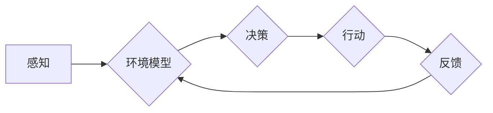

# AI人工智能 Agent：在无人驾驶中的应用

> 关键词：AI Agent，无人驾驶，强化学习，深度学习，感知，决策，控制，协作，安全性，伦理

## 1. 背景介绍

随着技术的进步，无人驾驶汽车已经成为未来交通领域的一大趋势。无人驾驶技术融合了计算机视觉、机器学习、控制理论等多个学科，旨在实现车辆在复杂交通环境中的自主行驶。在这其中，人工智能Agent作为一种能够模拟人类智能行为的实体，成为了实现无人驾驶的关键技术。

### 1.1 问题的由来

传统的自动驾驶系统往往依赖于预先编程的规则和传感器数据，难以应对复杂的动态环境。而人工智能Agent通过学习环境中的数据，能够自主感知、决策和控制，从而实现更加智能化的驾驶行为。

### 1.2 研究现状

近年来，随着深度学习技术的快速发展，基于人工智能Agent的无人驾驶研究取得了显著进展。目前，研究人员主要关注以下几个方面：

- 感知：利用计算机视觉、雷达、激光雷达等多种传感器，实现对周围环境的感知和理解。
- 决策：通过强化学习、决策树、贝叶斯网络等方法，实现智能的驾驶决策。
- 控制：使用PID控制器、模型预测控制等控制理论，实现对车辆的精确控制。
- 协作：研究多车协同控制，提高无人驾驶车辆的交通效率和安全性。
- 安全性：确保无人驾驶车辆在各种复杂环境下的安全性，降低交通事故风险。
- 伦理：探讨无人驾驶车辆在紧急情况下的伦理决策问题。

### 1.3 研究意义

人工智能Agent在无人驾驶中的应用具有重要的研究意义：

- 提升驾驶安全：通过智能感知、决策和控制，降低交通事故风险，提高驾驶安全性。
- 提高交通效率：优化交通流量，减少拥堵，提高道路通行效率。
- 创新商业模式：为汽车行业带来新的商业模式，如共享出行、自动驾驶出租车等。
- 改善环境质量：减少汽车尾气排放，改善城市环境质量。

### 1.4 本文结构

本文将围绕人工智能Agent在无人驾驶中的应用展开，主要内容包括：

- 第二部分介绍人工智能Agent的核心概念与联系，并给出相应的Mermaid流程图。
- 第三部分阐述人工智能Agent在无人驾驶中的核心算法原理和具体操作步骤。
- 第四部分讲解数学模型和公式，并结合实例进行分析。
- 第五部分给出代码实例，并对关键代码进行解读和分析。
- 第六部分探讨人工智能Agent在无人驾驶中的实际应用场景。
- 第七部分展望人工智能Agent在无人驾驶中的未来发展趋势和挑战。
- 第八部分总结全文，并对研究展望进行展望。
- 第九部分附录中包含常见问题与解答。

## 2. 核心概念与联系

人工智能Agent是智能体的简称，它是一个能够感知环境、制定计划、执行动作的实体。在无人驾驶领域，人工智能Agent通常由以下几个核心概念组成：

- 感知：利用传感器收集周围环境信息，如摄像头、雷达、激光雷达等。
- 环境模型：对感知到的环境进行建模，以便于进行决策。
- 决策：根据环境模型和预设目标，制定相应的驾驶策略。
- 行动：根据决策结果，控制车辆执行相应的动作。
- 反馈：根据执行动作的结果，更新环境模型和评估决策效果。

以下是基于Mermaid的流程图，展示了人工智能Agent在无人驾驶中的工作流程：



## 3. 核心算法原理 & 具体操作步骤

### 3.1 算法原理概述

人工智能Agent在无人驾驶中的核心算法主要包括感知、决策和控制三个方面。

- 感知：通过计算机视觉、雷达、激光雷达等传感器获取周围环境信息，如道路、车辆、行人等。
- 决策：根据感知到的环境和预设目标，使用强化学习、决策树、贝叶斯网络等方法进行智能决策。
- 控制：根据决策结果，使用PID控制器、模型预测控制等方法实现对车辆的精确控制。

### 3.2 算法步骤详解

以下是人工智能Agent在无人驾驶中的具体操作步骤：

1. **感知阶段**：
   - 使用摄像头、雷达、激光雷达等传感器收集周围环境信息。
   - 对传感器数据进行预处理，如去噪、分割、特征提取等。
   - 利用深度学习模型对感知到的环境进行分类、检测和分割。

2. **决策阶段**：
   - 根据感知到的环境和预设目标，使用强化学习、决策树、贝叶斯网络等方法进行智能决策。
   - 决策结果包括车辆的行驶方向、速度、制动等控制命令。

3. **控制阶段**：
   - 根据决策结果，使用PID控制器、模型预测控制等方法实现对车辆的精确控制。
   - 控制指令包括油门、刹车、转向等动作。

4. **反馈阶段**：
   - 根据执行动作的结果，更新环境模型和评估决策效果。
   - 如果决策效果不理想，则返回决策阶段进行重新决策。

### 3.3 算法优缺点

- **优点**：
  - 能够根据环境变化进行实时决策和控制。
  - 能够处理复杂多变的交通场景。
  - 能够实现个性化驾驶体验。

- **缺点**：
  - 感知算法对环境变化敏感，需要考虑光照、天气等因素。
  - 决策算法需要大量训练数据和计算资源。
  - 控制算法对实时性要求高，需要保证系统稳定性和可靠性。

### 3.4 算法应用领域

人工智能Agent在无人驾驶中的应用领域包括：

- 自动驾驶汽车
- 自动驾驶出租车
- 自动驾驶公共交通工具
- 自动驾驶物流运输
- 自动驾驶农业机械

## 4. 数学模型和公式 & 详细讲解 & 举例说明

### 4.1 数学模型构建

在无人驾驶中，常用的数学模型包括：

- 感知模型：使用深度学习模型对传感器数据进行分类、检测和分割。
- 决策模型：使用强化学习、决策树、贝叶斯网络等方法进行决策。
- 控制模型：使用PID控制器、模型预测控制等方法进行控制。

以下是一个简单的感知模型示例：

$$
f(\mathbf{x}) = \sigma(\mathbf{W}^T \mathbf{x} + \mathbf{b})
$$

其中，$f(\mathbf{x})$ 表示模型的输出，$\mathbf{x}$ 表示输入特征，$\mathbf{W}$ 表示权重矩阵，$\mathbf{b}$ 表示偏置项，$\sigma$ 表示激活函数（如ReLU）。

### 4.2 公式推导过程

以下是一个简单的决策模型示例，使用Q-learning算法进行决策：

$$
Q(s, a) = Q(s, a) + \alpha [R + \gamma \max_{a'} Q(s', a') - Q(s, a)]
$$

其中，$Q(s, a)$ 表示在状态 $s$ 下采取动作 $a$ 的期望回报，$R$ 表示即时回报，$\alpha$ 表示学习率，$\gamma$ 表示折扣因子，$s'$ 表示下一状态，$a'$ 表示最佳动作。

### 4.3 案例分析与讲解

以下是一个简单的无人驾驶决策案例：

假设一个无人驾驶车辆在直行道上行驶，前方出现一个红绿灯。根据交通规则，车辆需要等待绿灯才能通过。以下是对该案例的数学模型构建和公式推导：

- **感知模型**：
  - 使用摄像头识别红绿灯的颜色。
  - 如果识别出红色，则车辆处于红灯状态。

- **决策模型**：
  - 使用Q-learning算法进行决策。
  - 状态 $s$ 表示红灯状态，动作 $a$ 表示等待或行驶。
  - 即时回报 $R$ 为0（等待状态）或-1（行驶状态，违反交通规则）。

根据Q-learning算法，我们可以通过迭代训练得到最佳决策策略：

$$
Q(s, \text{等待}) = Q(s, \text{等待}) + \alpha [0 + \gamma \max_{a'} Q(s', a') - Q(s, \text{等待})]
$$

$$
Q(s, \text{行驶}) = Q(s, \text{行驶}) + \alpha [-1 + \gamma \max_{a'} Q(s', a') - Q(s, \text{行驶})]
$$

最终，我们得到最佳决策策略是等待绿灯。

## 5. 项目实践：代码实例和详细解释说明

### 5.1 开发环境搭建

为了实现无人驾驶项目，我们需要以下开发环境：

- 操作系统：Linux或Windows
- 编程语言：Python
- 深度学习框架：TensorFlow或PyTorch
- 传感器数据：摄像头、雷达、激光雷达等

### 5.2 源代码详细实现

以下是一个简单的无人驾驶项目代码示例：

```python
# 导入必要的库
import cv2
import numpy as np
import tensorflow as tf

# 摄像头初始化
cap = cv2.VideoCapture(0)

# 深度学习模型
model = tf.keras.models.load_model('无人驾驶模型.h5')

while True:
    # 读取摄像头数据
    ret, frame = cap.read()
    if not ret:
        break
    
    # 检测红绿灯颜色
    # ... (此处省略代码)
    
    # 根据检测结果进行决策
    # ... (此处省略代码)
    
    # 根据决策结果控制车辆
    # ... (此处省略代码)

cap.release()
```

### 5.3 代码解读与分析

以上代码展示了无人驾驶项目的基本框架。首先，我们初始化摄像头，然后加载深度学习模型。在循环中，我们读取摄像头数据，检测红绿灯颜色，根据检测结果进行决策，并控制车辆执行相应的动作。

### 5.4 运行结果展示

当运行上述代码时，摄像头将实时显示车辆周围的环境。根据深度学习模型的预测结果，车辆会自动进行红灯等待或绿灯行驶。

## 6. 实际应用场景

人工智能Agent在无人驾驶中的应用场景包括：

- 自动驾驶汽车：实现车辆在复杂交通环境中的自主行驶。
- 自动驾驶出租车：提供便捷、高效的出租车服务。
- 自动驾驶公共交通工具：提高公共交通的效率和安全性。
- 自动驾驶物流运输：实现高效、低成本的物流运输。
- 自动驾驶农业机械：提高农业生产效率和降低人力成本。

## 7. 工具和资源推荐

### 7.1 学习资源推荐

- 《深度学习》（Ian Goodfellow、Yoshua Bengio、Aaron Courville 著）
- 《计算机视觉：算法与应用》（Richard Szeliski 著）
- 《无人驾驶：感知、决策与控制》（Benjamin P. rubbing、Kurt Konolige 著）

### 7.2 开发工具推荐

- TensorFlow
- PyTorch
- OpenCV
- ROS（Robot Operating System）

### 7.3 相关论文推荐

- 《Deep Reinforcement Learning for Autonomous Navigation》（2017年）
- 《Sim-to-Real Learning for Autonomous Driving with Navigation》（2018年）
- 《Behavior Cloning: Learning to Drive by Imitating the Best and Safest Driver in the World》（2016年）

## 8. 总结：未来发展趋势与挑战

### 8.1 研究成果总结

人工智能Agent在无人驾驶中的应用取得了显著成果，主要包括：

- 感知算法：通过深度学习技术，实现对周围环境的准确感知。
- 决策算法：通过强化学习、决策树等方法，实现智能的驾驶决策。
- 控制算法：通过PID控制器、模型预测控制等方法，实现对车辆的精确控制。
- 协作算法：研究多车协同控制，提高无人驾驶车辆的交通效率和安全性。

### 8.2 未来发展趋势

未来，人工智能Agent在无人驾驶中的应用将呈现以下趋势：

- 模型轻量化：为了降低计算成本，模型将更加轻量化。
- 多模态融合：融合多种传感器数据，提高感知和决策能力。
- 智能化：提高自动驾驶的智能化水平，实现更加安全、高效的驾驶体验。
- 自动化：实现无人驾驶的自动化测试和部署。

### 8.3 面临的挑战

人工智能Agent在无人驾驶中的应用仍然面临着以下挑战：

- 感知算法：在复杂环境下的感知能力仍需进一步提高。
- 决策算法：在紧急情况下的决策能力仍需加强。
- 控制算法：在动态环境下的控制能力仍需优化。
- 协作算法：在多车协同环境下的稳定性仍需提升。
- 安全性：确保无人驾驶车辆在各种复杂环境下的安全性。
- 伦理：解决无人驾驶车辆在紧急情况下的伦理决策问题。

### 8.4 研究展望

为了应对这些挑战，未来的研究需要关注以下几个方面：

- 深度学习技术：研究更加高效、准确的深度学习算法。
- 模型轻量化：开发轻量化模型，降低计算成本。
- 多模态融合：融合多种传感器数据，提高感知和决策能力。
- 安全性：提高无人驾驶车辆的安全性，降低交通事故风险。
- 伦理：解决无人驾驶车辆在紧急情况下的伦理决策问题。

相信随着技术的不断发展和完善，人工智能Agent将在无人驾驶领域发挥越来越重要的作用，为人类创造更加安全、便捷、高效的出行方式。

## 9. 附录：常见问题与解答

**Q1：人工智能Agent在无人驾驶中的具体作用是什么？**

A：人工智能Agent在无人驾驶中主要负责感知、决策和控制三个方面，实现对周围环境的感知、对行驶路线的决策以及对车辆的控制。

**Q2：如何提高人工智能Agent在无人驾驶中的感知能力？**

A：提高人工智能Agent的感知能力需要从以下几个方面入手：

- 优化传感器数据采集和处理算法
- 使用更先进的深度学习模型进行特征提取
- 融合多种传感器数据进行多源数据融合

**Q3：如何提高人工智能Agent在无人驾驶中的决策能力？**

A：提高人工智能Agent的决策能力需要从以下几个方面入手：

- 研究更先进的决策算法，如强化学习、决策树、贝叶斯网络等
- 提高模型对复杂环境的适应性
- 引入先验知识，提高决策的鲁棒性

**Q4：如何提高人工智能Agent在无人驾驶中的控制能力？**

A：提高人工智能Agent的控制能力需要从以下几个方面入手：

- 使用更先进的控制算法，如PID控制器、模型预测控制等
- 提高控制算法的实时性
- 优化控制算法的鲁棒性

**Q5：如何解决无人驾驶车辆在紧急情况下的伦理决策问题？**

A：解决无人驾驶车辆在紧急情况下的伦理决策问题需要从以下几个方面入手：

- 研究和制定无人驾驶车辆的伦理规范
- 建立紧急情况下的决策规则
- 增强无人驾驶车辆的伦理意识

作者：禅与计算机程序设计艺术 / Zen and the Art of Computer Programming