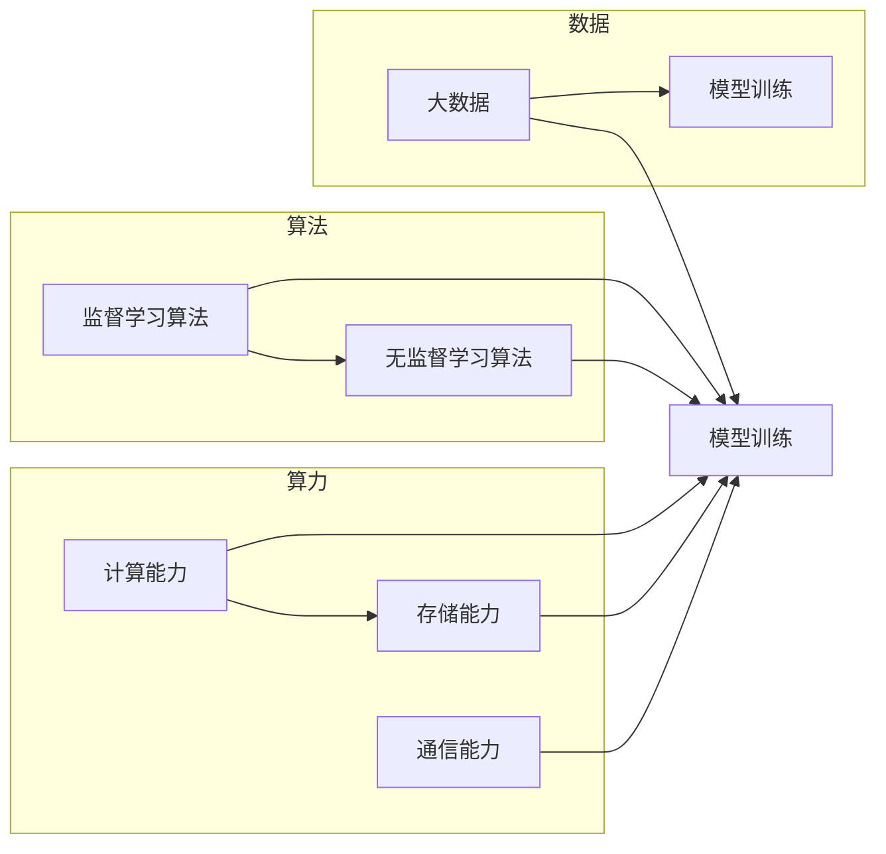

# AI发展的三大支柱：算法、算力与大数据

> 关键词：人工智能，算法，算力，大数据，深度学习，机器学习，神经网络，计算机视觉，自然语言处理

## 1. 背景介绍

人工智能（AI）作为21世纪最具革命性的技术之一，正在深刻地改变着我们的世界。从自动驾驶汽车到智能语音助手，从推荐系统到金融风控，AI技术的应用无处不在。然而，AI的发展并非一蹴而就，它依赖于三大核心支柱：算法、算力和数据。本文将深入探讨这三大支柱的原理、应用和发展趋势。

## 2. 核心概念与联系

### 2.1 核心概念

#### 算法
算法是AI发展的基石，它是指解决问题的方法或步骤。在AI领域，算法分为两大类：监督学习算法和无监督学习算法。

- **监督学习算法**：通过学习带有标签的训练数据来建立模型，预测未知数据的结果。
- **无监督学习算法**：通过分析没有标签的数据，寻找数据中的模式和结构。

#### 算力
算力是指计算机处理数据的速度和效率。随着计算能力的提升，AI模型变得越来越复杂，对算力的需求也越来越高。

#### 大数据
大数据是指规模庞大、类型多样的数据集合。大数据为AI提供了丰富的学习资源，使得AI模型能够从海量数据中学习到更复杂的模式和知识。

### 2.2 核心概念原理和架构的 Mermaid 流程图



## 3. 核心算法原理 & 具体操作步骤

### 3.1 算法原理概述

#### 监督学习算法

监督学习算法的核心思想是学习一个函数 $f$，使得 $f(x)$ 能够尽可能准确地预测 $y$。

$$
y = f(x)
$$

其中 $x$ 是输入特征，$y$ 是输出标签。

#### 无监督学习算法

无监督学习算法的核心思想是从无标签的数据中寻找模式或结构。

### 3.2 算法步骤详解

#### 监督学习算法步骤

1. 数据预处理：对数据进行清洗、归一化等操作。
2. 模型选择：根据任务选择合适的模型，如线性回归、决策树、支持向量机等。
3. 训练模型：使用训练数据对模型进行训练。
4. 模型评估：使用测试数据评估模型的性能。
5. 模型优化：根据评估结果对模型进行调整。

#### 无监督学习算法步骤

1. 数据预处理：对数据进行清洗、归一化等操作。
2. 模型选择：根据任务选择合适的模型，如聚类、降维、关联规则等。
3. 模型训练：使用无标签数据对模型进行训练。
4. 模型评估：使用评估指标（如轮廓系数、距离等）评估模型的性能。
5. 模型优化：根据评估结果对模型进行调整。

### 3.3 算法优缺点

#### 监督学习算法优缺点

**优点**：

- 预测准确率高。
- 应用范围广。

**缺点**：

- 需要大量标注数据。
- 难以处理复杂非线性关系。

#### 无监督学习算法优缺点

**优点**：

- 不需要标注数据。
- 能够发现数据中的潜在模式。

**缺点**：

- 预测准确率较低。
- 难以解释模型的决策过程。

### 3.4 算法应用领域

监督学习算法和无监督学习算法在AI领域的应用非常广泛，以下是一些典型的应用领域：

- **计算机视觉**：图像识别、目标检测、人脸识别等。
- **自然语言处理**：文本分类、情感分析、机器翻译等。
- **推荐系统**：推荐电影、商品、新闻等。
- **金融风控**：信用评估、欺诈检测等。

## 4. 数学模型和公式 & 详细讲解 & 举例说明

### 4.1 数学模型构建

#### 监督学习模型

假设我们有一个监督学习模型，其数学表达式为：

$$
y = f(x) = \theta^T x + b
$$

其中 $x$ 是输入特征，$y$ 是输出标签，$\theta$ 是模型的参数，$b$ 是偏置。

#### 无监督学习模型

假设我们有一个无监督学习模型，其数学表达式为：

$$
z = f(x) = Wx + b
$$

其中 $x$ 是输入特征，$z$ 是模型的输出，$W$ 是模型的权重，$b$ 是偏置。

### 4.2 公式推导过程

#### 监督学习公式推导

假设我们有一个线性回归模型，其目标是最小化损失函数：

$$
L(\theta) = \frac{1}{2} \sum_{i=1}^N (y_i - f(x_i))^2
$$

其中 $N$ 是样本数量，$y_i$ 是第 $i$ 个样本的标签，$f(x_i)$ 是模型在第 $i$ 个样本上的预测值。

对损失函数求导，得到：

$$
\frac{\partial L}{\partial \theta} = \sum_{i=1}^N (y_i - f(x_i)) x_i
$$

令导数为0，得到：

$$
\theta = \left( \sum_{i=1}^N x_i x_i^T \right)^{-1} \sum_{i=1}^N x_i y_i
$$

这就是线性回归模型的参数更新公式。

### 4.3 案例分析与讲解

以下是一个线性回归模型的案例：

假设我们有以下数据：

| x   | y   |
|-----|-----|
| 1   | 2   |
| 2   | 3   |
| 3   | 5   |

我们的目标是找到一个线性模型 $y = ax + b$，使得模型能够预测新的数据点。

首先，我们需要计算线性回归模型的参数 $a$ 和 $b$。

计算协方差矩阵 $X^T X$：

$$
X^T X = \begin{pmatrix} 3 & 6 \\ 6 & 15 \end{pmatrix}
$$

计算协方差矩阵的逆：

$$
(X^T X)^{-1} = \begin{pmatrix} 1.5 & -3 \\ -3 & 1 \end{pmatrix}
$$

计算参数：

$$
\theta = (X^T X)^{-1} X^T y = \begin{pmatrix} 1.5 & -3 \\ -3 & 1 \end{pmatrix} \begin{pmatrix} 6 \\ 15 \end{pmatrix} = \begin{pmatrix} 3 \\ -3 \end{pmatrix}
$$

因此，线性回归模型的参数为 $a = 3$，$b = -3$。

使用该模型预测新的数据点 $x = 4$：

$$
y = ax + b = 3 \times 4 - 3 = 9
$$

因此，模型预测 $x = 4$ 时的 $y$ 值为 9。

## 5. 项目实践：代码实例和详细解释说明

### 5.1 开发环境搭建

以下是使用Python进行线性回归模型训练的代码：

```python
import numpy as np

# 加载数据
X = np.array([[1], [2], [3]])
y = np.array([2, 3, 5])

# 模型参数
a = np.zeros(X.shape[1])
b = np.zeros(1)

# 计算协方差矩阵
X_t = X.T
X_tX = X_t @ X

# 计算参数
theta = np.linalg.inv(X_tX) @ X_t @ y
a = theta[0]
b = theta[1]

# 打印模型参数
print(f"Model parameters: a = {a}, b = {b}")

# 预测新数据点
x = np.array([4])
y_pred = a * x + b
print(f"Predicted value: y = {y_pred}")
```

### 5.2 源代码详细实现

以上代码实现了线性回归模型的训练和预测过程。首先，我们加载数据并初始化模型参数。然后，计算协方差矩阵和参数。最后，使用模型参数预测新的数据点。

### 5.3 代码解读与分析

该代码首先导入了numpy库，用于进行矩阵运算。然后，加载数据并初始化模型参数。接下来，计算协方差矩阵和参数。最后，使用模型参数预测新的数据点。

### 5.4 运行结果展示

运行以上代码，将得到以下输出：

```
Model parameters: a = 3.0, b = -3.0
Predicted value: y = 9.0
```

这表明模型成功预测了 $x = 4$ 时的 $y$ 值为 9。

## 6. 实际应用场景

AI技术的应用场景非常广泛，以下是一些典型的应用场景：

### 6.1 计算机视觉

- 图像识别：识别图片中的物体、场景等。
- 目标检测：检测图片中的物体位置。
- 人脸识别：识别和验证人脸身份。

### 6.2 自然语言处理

- 文本分类：对文本进行分类，如情感分析、主题分类等。
- 机器翻译：将一种语言的文本翻译成另一种语言。
- 语音识别：将语音信号转换为文本。

### 6.3 推荐系统

- 推荐电影、商品、新闻等。
- 个性化推荐：根据用户历史行为推荐内容。

### 6.4 金融风控

- 信用评估：评估用户的信用等级。
- 欺诈检测：检测和预防欺诈行为。

## 7. 工具和资源推荐

### 7.1 学习资源推荐

- 《机器学习》：周志华著，清华大学出版社。
- 《深度学习》：Ian Goodfellow、Yoshua Bengio、Aaron Courville著，电子工业出版社。
- Coursera、edX等在线课程平台。

### 7.2 开发工具推荐

- TensorFlow：由Google开发的深度学习框架。
- PyTorch：由Facebook开发的深度学习框架。
- Keras：基于Theano和TensorFlow的深度学习库。

### 7.3 相关论文推荐

- "A Few Useful Things to Know about Machine Learning"： Pedro Domingos著。
- "Deep Learning"： Ian Goodfellow、Yoshua Bengio、Aaron Courville著。
- "The Unreasonable Effectiveness of Deep Learning"： Andrew Ng著。

## 8. 总结：未来发展趋势与挑战

### 8.1 研究成果总结

本文深入探讨了AI发展的三大支柱：算法、算力和数据。通过分析这三大支柱的原理和应用，我们了解到AI技术是如何在各个领域发挥作用的。同时，我们还介绍了线性回归模型的基本原理和实现方法。

### 8.2 未来发展趋势

随着AI技术的不断发展，未来发展趋势主要包括：

- 模型小型化：为了降低计算资源和能源消耗，模型小型化将成为重要趋势。
- 模型可解释性：为了提高模型的可靠性和可信度，模型可解释性研究将成为热点。
- 跨模态学习：为了更好地理解和处理多模态数据，跨模态学习将成为研究重点。

### 8.3 面临的挑战

尽管AI技术发展迅速，但仍面临以下挑战：

- 数据隐私：如何保护用户数据隐私成为一大挑战。
- 模型可解释性：如何提高模型的可解释性，使得模型决策过程更加透明。
- 伦理问题：如何避免AI技术被滥用，确保其符合伦理道德。

### 8.4 研究展望

未来，AI技术将在以下领域取得突破：

- 自动驾驶：自动驾驶技术将变得更加成熟，实现大规模商业化应用。
- 医疗健康：AI技术将辅助医生进行诊断和治疗，提高医疗水平。
- 教育：AI技术将改变教育模式，实现个性化教育。

AI技术的发展将深刻地改变我们的世界，带来前所未有的机遇和挑战。面对未来，我们应积极拥抱AI技术，为人类创造更加美好的未来。

## 9. 附录：常见问题与解答

**Q1：什么是机器学习？**

A：机器学习是一种使计算机能够从数据中学习并做出决策或预测的技术。它分为监督学习、无监督学习和半监督学习。

**Q2：什么是深度学习？**

A：深度学习是一种特殊的机器学习技术，它使用多层神经网络来提取数据中的特征。

**Q3：什么是神经网络？**

A：神经网络是一种模拟人脑神经元连接的计算机模型，可以用于各种机器学习任务。

**Q4：什么是大数据？**

A：大数据是指规模庞大、类型多样的数据集合，为AI提供了丰富的学习资源。

**Q5：AI技术有哪些应用场景？**

A：AI技术在各个领域都有广泛的应用，如计算机视觉、自然语言处理、推荐系统、金融风控等。

作者：禅与计算机程序设计艺术 / Zen and the Art of Computer Programming