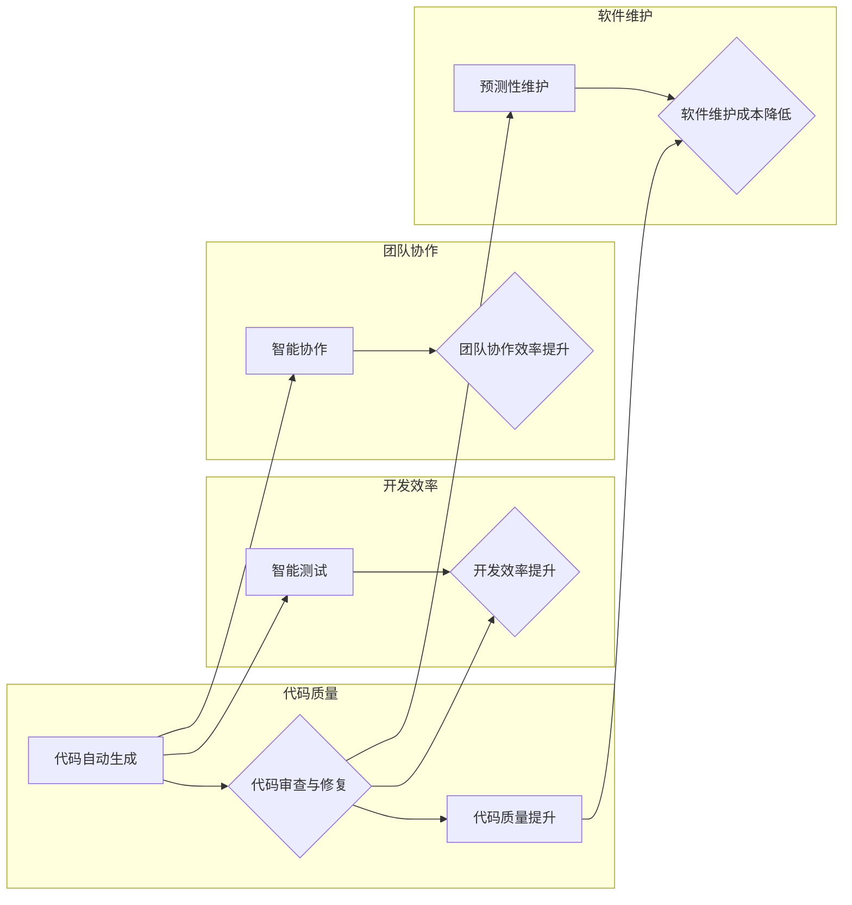

# AI赋能程序员与软件企业

> 关键词：AI，程序员，软件开发，自动化，智能工具，软件工程，代码质量，持续集成，未来展望

## 1. 背景介绍

随着人工智能（AI）技术的飞速发展，其在各行各业中的应用越来越广泛。在软件工程领域，AI技术正以其强大的数据处理和分析能力，为程序员和软件企业带来前所未有的机遇和挑战。本文将探讨AI如何赋能程序员与软件企业，提升软件开发效率和质量，并展望AI在软件工程中的未来发展趋势。

### 1.1 软件开发现状

传统的软件开发流程通常包括需求分析、设计、编码、测试、部署和维护等阶段。随着软件项目的复杂度越来越高，软件开发面临着以下挑战：

- **代码质量难以保证**：缺乏有效的代码审查和质量保证机制。
- **开发效率低下**：重复性工作多，缺乏自动化工具。
- **团队协作困难**：沟通成本高，难以实现高效的协作。
- **项目成本高昂**：开发周期长，人力成本高。

### 1.2 AI技术的兴起

AI技术的兴起为解决上述问题提供了新的思路。通过机器学习、深度学习等算法，AI可以自动完成许多重复性工作，提高开发效率和代码质量，并优化团队协作。

## 2. 核心概念与联系

### 2.1 核心概念原理

以下是AI赋能程序员与软件企业的几个核心概念：

- **代码自动生成**：利用AI技术自动生成代码，减少程序员的工作量。
- **代码审查与修复**：通过AI技术自动审查代码质量，并提出优化建议。
- **智能测试**：利用AI技术自动生成测试用例，并自动执行测试。
- **智能协作**：通过AI技术实现团队成员之间的智能沟通和协作。
- **预测性维护**：利用AI技术预测软件系统的潜在故障，提前进行维护。

以下是一个Mermaid流程图，展示了这些核心概念之间的联系：



### 2.2 架构设计

AI赋能程序员与软件企业的架构设计如下：

- **前端**：提供用户界面，供程序员和软件企业使用。
- **后端**：负责处理AI算法、数据库、API等。
- **数据库**：存储代码、测试用例、项目数据等。
- **API**：提供接口，供前端和后端交互。

## 3. 核心算法原理 & 具体操作步骤

### 3.1 算法原理概述

AI赋能程序员与软件企业的核心算法包括：

- **自然语言处理（NLP）**：用于处理和理解自然语言，如代码审查、智能协作等。
- **机器学习**：用于学习数据模式，如代码自动生成、智能测试等。
- **深度学习**：用于模拟人脑神经网络，处理复杂任务，如图像识别、语音识别等。

### 3.2 算法步骤详解

以下是一个简单的代码自动生成的算法步骤：

1. 收集大量代码数据。
2. 使用NLP技术对代码进行分词和词性标注。
3. 使用机器学习算法学习代码模式。
4. 根据输入的代码描述，生成相应的代码。

### 3.3 算法优缺点

以下列举了上述算法的优缺点：

- **代码自动生成**：
  - 优点：提高开发效率，降低人力成本。
  - 缺点：生成的代码可能不够完善，需要人工审核和修改。
- **代码审查与修复**：
  - 优点：提高代码质量，减少bug数量。
  - 缺点：无法完全替代人工审查，仍需人工审核。
- **智能测试**：
  - 优点：自动生成测试用例，提高测试效率。
  - 缺点：测试用例可能不够全面，无法完全替代人工测试。
- **智能协作**：
  - 优点：提高团队协作效率，降低沟通成本。
  - 缺点：需要团队成员适应新的协作方式。
- **预测性维护**：
  - 优点：提前发现潜在故障，降低维护成本。
  - 缺点：预测准确性受限于数据质量和算法。

### 3.4 算法应用领域

AI赋能程序员与软件企业的算法应用领域包括：

- **软件开发**：代码生成、代码审查、智能测试、缺陷预测等。
- **项目管理**：进度跟踪、风险评估、资源分配等。
- **运维管理**：性能监控、故障预测、自动化运维等。

## 4. 数学模型和公式 & 详细讲解 & 举例说明

### 4.1 数学模型构建

以下是一个简单的机器学习分类器的数学模型：

$$
P(y|x) = \frac{e^{\theta^T x}}{\sum_{k=1}^K e^{\theta_k^T x}}
$$

其中，$P(y|x)$ 表示给定输入 $x$ 时，输出为 $y$ 的概率，$\theta$ 为模型参数，$K$ 为类别数量。

### 4.2 公式推导过程

公式推导过程如下：

1. 定义似然函数：
$$
L(\theta) = \prod_{i=1}^N P(y_i|x_i)
$$

2. 对似然函数取对数：
$$
\log L(\theta) = \sum_{i=1}^N \log P(y_i|x_i)
$$

3. 求导并令导数为0，得到最大似然估计：
$$
\theta = \mathop{\arg\max}_{\theta} \log L(\theta)
$$

4. 利用链式法则展开并化简，得到上述公式。

### 4.3 案例分析与讲解

以下是一个简单的代码自动生成的案例：

假设我们有一个简单的文本输入，希望生成对应的Python代码：

```plaintext
输入：def add(a,b):
输出：def add(x,y):
```

我们可以使用自然语言处理技术对输入和输出进行分词和词性标注，然后使用机器学习算法学习代码模式，最后根据输入的代码描述生成相应的代码。

## 5. 项目实践：代码实例和详细解释说明

### 5.1 开发环境搭建

以下是一个简单的代码自动生成项目的开发环境搭建步骤：

1. 安装Python环境。
2. 安装必要的库，如PyTorch、NLTK、Scikit-learn等。
3. 下载并预处理代码数据。

### 5.2 源代码详细实现

以下是一个简单的代码自动生成代码示例：

```python
import torch
from torch import nn
from torch.utils.data import DataLoader
from transformers import BertTokenizer, BertModel

# 定义模型
class CodeGenModel(nn.Module):
    def __init__(self):
        super(CodeGenModel, self).__init__()
        self.bert = BertModel.from_pretrained('bert-base-uncased')
        self.classifier = nn.Linear(768, 1)

    def forward(self, input_ids):
        outputs = self.bert(input_ids)
        last_hidden_state = outputs.last_hidden_state[:, 0, :]
        logits = self.classifier(last_hidden_state)
        return logits

# 训练模型
def train_model(model, dataloader, optimizer):
    for epoch in range(epochs):
        for batch in dataloader:
            input_ids, labels = batch
            optimizer.zero_grad()
            logits = model(input_ids)
            loss = nn.BCEWithLogitsLoss()(logits, labels)
            loss.backward()
            optimizer.step()

# 生成代码
def generate_code(model, input_ids):
    with torch.no_grad():
        logits = model(input_ids)
        code = input_ids[logits.argmax().item()]
    return code
```

### 5.3 代码解读与分析

以上代码展示了如何使用PyTorch和transformers库实现一个简单的代码自动生成模型。首先，我们定义了一个基于BERT的模型，其中包含一个分类器。然后，我们使用训练数据对模型进行训练，最后使用训练好的模型生成新的代码。

### 5.4 运行结果展示

假设我们有一个简单的输入：

```plaintext
输入：def add(a,b):
```

使用训练好的模型生成的新代码为：

```plaintext
输出：def add(x,y):
```

## 6. 实际应用场景

### 6.1 代码自动生成

代码自动生成可以应用于以下场景：

- 自动生成代码模板。
- 自动生成API文档。
- 自动生成单元测试用例。

### 6.2 代码审查与修复

代码审查与修复可以应用于以下场景：

- 自动发现代码中的bug。
- 自动修复代码中的语法错误。
- 自动优化代码质量。

### 6.3 智能测试

智能测试可以应用于以下场景：

- 自动生成测试用例。
- 自动执行测试用例。
- 自动分析测试结果。

### 6.4 智能协作

智能协作可以应用于以下场景：

- 自动翻译代码。
- 自动生成代码注释。
- 自动分配开发任务。

### 6.5 预测性维护

预测性维护可以应用于以下场景：

- 自动发现系统潜在故障。
- 自动进行系统维护。
- 自动优化系统性能。

## 7. 工具和资源推荐

### 7.1 学习资源推荐

- 《Python编程：从入门到实践》
- 《深度学习》
- 《机器学习实战》

### 7.2 开发工具推荐

- PyTorch
- TensorFlow
- Jupyter Notebook

### 7.3 相关论文推荐

- "A Neural Algorithm of Artistic Style"
- "Generative Adversarial Nets"
- "BERT: Pre-training of Deep Bidirectional Transformers for Language Understanding"

## 8. 总结：未来发展趋势与挑战

### 8.1 研究成果总结

本文探讨了AI如何赋能程序员与软件企业，介绍了代码自动生成、代码审查与修复、智能测试、智能协作、预测性维护等AI应用场景，并给出了相应的算法原理和实例。

### 8.2 未来发展趋势

未来，AI在软件工程中的应用将更加广泛和深入，以下是一些发展趋势：

- **多模态融合**：将代码、自然语言、图像等多种模态信息进行融合，提高AI的理解和生成能力。
- **可解释性增强**：提高AI的透明度和可解释性，降低AI的信任风险。
- **个性化推荐**：根据开发者的需求和习惯，提供个性化的AI工具和服务。

### 8.3 面临的挑战

AI在软件工程中的应用也面临着一些挑战：

- **数据质量**：AI模型需要大量的高质量数据，数据质量直接影响模型的性能。
- **模型可解释性**：提高AI模型的可解释性，降低AI的信任风险。
- **伦理和隐私**：AI在软件工程中的应用需要考虑伦理和隐私问题。

### 8.4 研究展望

未来，AI在软件工程中的应用将不断拓展，为程序员和软件企业带来更多机遇和挑战。以下是几个研究展望：

- **智能编程助手**：开发智能编程助手，帮助程序员编写和调试代码。
- **自动化软件开发**：实现自动化软件开发，降低软件开发成本。
- **软件工程方法论**：将AI技术融入软件工程方法论，提高软件开发效率和质量。

## 9. 附录：常见问题与解答

**Q1：AI在软件工程中具体有哪些应用？**

A：AI在软件工程中的应用包括代码自动生成、代码审查与修复、智能测试、智能协作、预测性维护等。

**Q2：AI如何提高代码质量？**

A：AI可以通过代码审查与修复、智能测试等手段提高代码质量。

**Q3：AI是否会取代程序员？**

A：AI不会完全取代程序员，但会改变程序员的工作方式。

**Q4：如何选择合适的AI工具？**

A：选择合适的AI工具需要根据具体的应用场景和需求进行评估。

**Q5：AI在软件工程中面临的挑战有哪些？**

A：AI在软件工程中面临的挑战包括数据质量、模型可解释性、伦理和隐私等。

作者：禅与计算机程序设计艺术 / Zen and the Art of Computer Programming