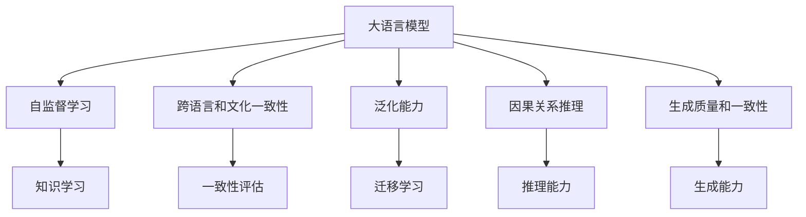
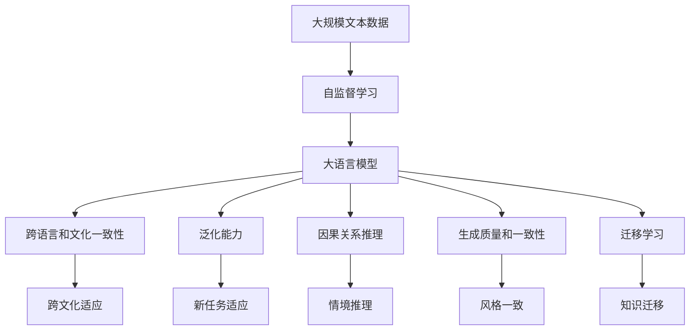

                 

# 语言与思维：大模型的困惑

## 1. 背景介绍

### 1.1 问题由来
在人工智能领域，大语言模型（Large Language Models, LLMs）已经取得了令人瞩目的成就。这些模型基于深度学习，通过在大量文本数据上预训练学习语言知识，被广泛应用于各种自然语言处理（NLP）任务，如图像描述、对话系统、翻译、摘要生成等。但这些模型的性能和表现，特别是其对语言和思维的理解，仍存在诸多困惑和疑问。

### 1.2 问题核心关键点
大语言模型的核心在于其对语言的深度理解和生成能力，但其对语义、逻辑、因果关系等的理解仍存在许多不足和局限。例如：
- 语义理解的深度和广度：大模型虽然能生成高度连贯的文本，但对语义深层次的逻辑推理和推断仍显薄弱。
- 语言生成的一致性和准确性：生成文本的可解释性、连贯性和准确性仍有待提高。
- 跨语言和文化的一致性：不同语言和文化背景下，模型表现的一致性不够理想。
- 泛化能力和适应性：模型在特定领域的泛化能力较弱，对新任务的适应性不足。

这些问题不仅影响了大语言模型的实际应用效果，也对AI领域的发展提出了新的挑战。本文将深入探讨这些困惑，并尝试提出解决方案。

### 1.3 问题研究意义
研究大语言模型的困惑，有助于加深对其内部工作机制的理解，推动模型性能的提升，为更广泛的应用场景奠定基础。同时，研究大模型困惑也为未来的AI发展提供了新的研究方向，如增强语言理解深度、提升生成质量、确保跨文化一致性等。

## 2. 核心概念与联系

### 2.1 核心概念概述
- **大语言模型（LLMs）**：指基于深度学习技术，通过在大量文本数据上预训练学习语言知识，能够理解和生成自然语言的大规模模型。
- **自监督学习**：指在无需标签数据的情况下，通过模型自身的输出进行监督学习，以学习语言的统计特征和规律。
- **跨语言和文化一致性**：指模型在不同语言和文化背景下，能够保持一致的语言理解和生成能力。
- **泛化能力**：指模型能够将学习到的语言知识迁移到新的、未见过的文本数据上。
- **因果关系推理**：指模型能够理解和推理出文本中的因果关系，从而更好地理解情境和逻辑。
- **生成质量和一致性**：指模型生成的文本在语法、语义、风格等方面的一致性和质量。

这些概念之间存在紧密联系，共同构成了大语言模型的研究框架。理解这些概念及其关系，对于解决模型的困惑至关重要。

### 2.2 概念间的关系
这些核心概念之间可以通过以下Mermaid流程图来展示：



这个流程图展示了大语言模型核心概念之间的关系：
- 大语言模型通过自监督学习学习语言知识。
- 其跨语言和文化一致性、泛化能力、因果关系推理和生成质量，都是基于语言知识的理解和应用。
- 迁移学习能够将学习到的知识迁移到新任务中，提升泛化能力。
- 推理能力增强模型对文本因果关系的理解，提升生成质量和一致性。

### 2.3 核心概念的整体架构

最后，我们用一个综合的流程图来展示这些核心概念在大语言模型中的整体架构：



这个综合流程图展示了从数据到模型再到应用的全过程：
- 大规模文本数据通过自监督学习，生成大语言模型。
- 模型能够适应不同语言和文化，具备跨文化一致性。
- 泛化能力和因果关系推理，使得模型能适应新任务和情境。
- 生成质量和一致性，提升模型的输出质量和可信度。
- 迁移学习使得模型能够学习不同领域知识，提升应用范围。

通过这些流程图，我们可以更清晰地理解大语言模型的核心概念及其相互关系，为后续深入讨论模型的困惑和解决方案奠定基础。

## 3. 核心算法原理 & 具体操作步骤
### 3.1 算法原理概述

大语言模型的核心算法原理，主要基于自监督学习。其基本思想是通过在大量无标签文本数据上预训练模型，学习语言的统计特征和规律。具体步骤如下：
1. 收集大规模无标签文本数据，构建数据集。
2. 设计自监督任务，如掩码语言模型（Masked Language Model, MLM），让模型学习预测缺失的单词。
3. 使用深度学习模型，如Transformer，进行预训练。
4. 在预训练的基础上，微调模型以适应下游特定任务。

大语言模型的预训练过程主要通过掩码语言模型（MLM）和下一句预测任务（Next Sentence Prediction, NSP）进行。掩码语言模型要求模型预测句子中被掩码的单词，而下一次句子预测任务则要求模型判断两个句子是否为相邻的。这些任务使得模型在大量文本数据上学习到语言的结构、句法、语义等规律。

### 3.2 算法步骤详解

具体算法步骤可以分为以下几个环节：
1. **数据预处理**：将原始文本数据进行分词、标准化等预处理，构建输入数据。
2. **模型构建**：使用深度学习模型（如Transformer）构建大语言模型，设置模型参数。
3. **预训练**：在大量无标签数据上，使用自监督任务进行预训练，学习语言规律。
4. **微调**：将预训练的模型微调以适应下游特定任务，如文本分类、摘要生成等。
5. **评估与优化**：使用验证集和测试集评估模型性能，根据评估结果进行模型优化。

### 3.3 算法优缺点

大语言模型具有以下优点：
- 能够通过大规模无标签数据进行自监督学习，学习到丰富的语言知识。
- 在特定任务上进行微调，可以快速适应新任务，提升性能。
- 模型的泛化能力较强，能够处理多种自然语言任务。

同时，大语言模型也存在一些局限：
- 对语义深层次理解不足，无法进行复杂的逻辑推理。
- 生成文本的可解释性较差，难以理解和调试模型的决策过程。
- 跨语言和文化的一致性有待提升，不同语言下的模型性能差异较大。
- 模型对新任务的适应性有限，泛化能力存在瓶颈。

### 3.4 算法应用领域

大语言模型在以下领域得到了广泛应用：
- 自然语言理解：如情感分析、实体识别、事件抽取等。
- 自然语言生成：如对话系统、机器翻译、摘要生成等。
- 知识图谱构建：如关系抽取、实体链接等。
- 推荐系统：如个性化推荐、广告投放等。

## 4. 数学模型和公式 & 详细讲解  
### 4.1 数学模型构建

大语言模型的数学模型构建，主要基于深度学习框架，如TensorFlow、PyTorch等。以下以BERT模型为例，介绍其数学模型的构建过程。

**BERT模型**：BERT是一种预训练语言模型，其数学模型主要由编码器层、自注意力机制和全连接层组成。

其中，编码器层由多个Transformer层堆叠而成，每个Transformer层包含多头自注意力机制和前馈神经网络。自注意力机制通过计算输入序列中每个单词与其他单词的注意力权重，学习单词之间的关系。前馈神经网络则对每个单词进行非线性变换。

**掩码语言模型（MLM）**：BERT的掩码语言模型任务要求模型预测句子中被掩码的单词。设句子长度为$L$，掩码位置为$i$，则模型需要对句子中未掩码的单词进行预测，即：

$$
\mathcal{L}_{MLM} = -\frac{1}{L-1}\sum_{i=1}^{L-1}\sum_{j=1}^V\log\sigma(\text{MLP}([\text{CLS}, x_{1:i-1}, \hat{x}_i, x_{i+1:L}]))_j
$$

其中，$\sigma$表示softmax函数，$V$表示词汇表的大小。

**下一句预测任务（NSP）**：BERT的下一次句子预测任务要求模型判断两个句子是否为相邻的。设两个句子分别为$x_1$和$x_2$，则模型需要对两个句子之间的关系进行预测，即：

$$
\mathcal{L}_{NSP} = -\frac{1}{N}\sum_{n=1}^{N}\log\sigma(\text{MLP}([\text{CLS}, x_1]))_0
$$

其中，$N$表示样本数量。

### 4.2 公式推导过程

以BERT模型为例，其前向传播过程可以表示为：
1. 输入嵌入：将输入的单词或子词表示映射为高维向量，作为模型的输入。
2. 编码器层：对输入嵌入进行多层自注意力机制和前馈神经网络的处理。
3. 池化层：将最后一层的输出进行池化，生成全局表示。
4. 全连接层：将全局表示作为输入，输出分类或回归结果。

通过这些步骤，BERT模型能够在大量无标签数据上进行预训练，学习到丰富的语言知识。然后，通过微调适应特定任务，提升模型性能。

### 4.3 案例分析与讲解

以BERT在情感分析任务上的微调为例，其数学模型构建和推导过程如下：
1. 数据预处理：将情感分析任务的数据集进行分词、编码等预处理，生成输入数据。
2. 模型构建：在BERT模型的基础上，添加一个全连接层，用于情感分类。
3. 微调过程：在微调过程中，使用训练集数据进行有监督学习，更新模型参数。
4. 评估与优化：使用验证集和测试集评估模型性能，根据评估结果进行模型优化。

## 5. 项目实践：代码实例和详细解释说明
### 5.1 开发环境搭建

在进行大语言模型微调实践前，需要先搭建好开发环境。以下是使用Python进行PyTorch开发的环境配置流程：

1. 安装Anaconda：从官网下载并安装Anaconda，用于创建独立的Python环境。

2. 创建并激活虚拟环境：
```bash
conda create -n pytorch-env python=3.8 
conda activate pytorch-env
```

3. 安装PyTorch：根据CUDA版本，从官网获取对应的安装命令。例如：
```bash
conda install pytorch torchvision torchaudio cudatoolkit=11.1 -c pytorch -c conda-forge
```

4. 安装Transformers库：
```bash
pip install transformers
```

5. 安装各类工具包：
```bash
pip install numpy pandas scikit-learn matplotlib tqdm jupyter notebook ipython
```

完成上述步骤后，即可在`pytorch-env`环境中开始微调实践。

### 5.2 源代码详细实现

下面我们以BERT模型在情感分析任务上的微调为例，给出使用Transformers库的PyTorch代码实现。

首先，定义情感分析任务的数据处理函数：

```python
from transformers import BertTokenizer
from torch.utils.data import Dataset
import torch

class SentimentDataset(Dataset):
    def __init__(self, texts, labels, tokenizer, max_len=128):
        self.texts = texts
        self.labels = labels
        self.tokenizer = tokenizer
        self.max_len = max_len
        
    def __len__(self):
        return len(self.texts)
    
    def __getitem__(self, item):
        text = self.texts[item]
        label = self.labels[item]
        
        encoding = self.tokenizer(text, return_tensors='pt', max_length=self.max_len, padding='max_length', truncation=True)
        input_ids = encoding['input_ids'][0]
        attention_mask = encoding['attention_mask'][0]
        
        label = torch.tensor(label, dtype=torch.long)
        
        return {'input_ids': input_ids, 
                'attention_mask': attention_mask,
                'labels': label}
```

然后，定义模型和优化器：

```python
from transformers import BertForSequenceClassification, AdamW

model = BertForSequenceClassification.from_pretrained('bert-base-cased', num_labels=2)

optimizer = AdamW(model.parameters(), lr=2e-5)
```

接着，定义训练和评估函数：

```python
from torch.utils.data import DataLoader
from tqdm import tqdm
from sklearn.metrics import classification_report

device = torch.device('cuda') if torch.cuda.is_available() else torch.device('cpu')
model.to(device)

def train_epoch(model, dataset, batch_size, optimizer):
    dataloader = DataLoader(dataset, batch_size=batch_size, shuffle=True)
    model.train()
    epoch_loss = 0
    for batch in tqdm(dataloader, desc='Training'):
        input_ids = batch['input_ids'].to(device)
        attention_mask = batch['attention_mask'].to(device)
        labels = batch['labels'].to(device)
        model.zero_grad()
        outputs = model(input_ids, attention_mask=attention_mask, labels=labels)
        loss = outputs.loss
        epoch_loss += loss.item()
        loss.backward()
        optimizer.step()
    return epoch_loss / len(dataloader)

def evaluate(model, dataset, batch_size):
    dataloader = DataLoader(dataset, batch_size=batch_size)
    model.eval()
    preds, labels = [], []
    with torch.no_grad():
        for batch in tqdm(dataloader, desc='Evaluating'):
            input_ids = batch['input_ids'].to(device)
            attention_mask = batch['attention_mask'].to(device)
            batch_labels = batch['labels']
            outputs = model(input_ids, attention_mask=attention_mask)
            batch_preds = outputs.logits.argmax(dim=2).to('cpu').tolist()
            batch_labels = batch_labels.to('cpu').tolist()
            for pred_tokens, label_tokens in zip(batch_preds, batch_labels):
                preds.append(pred_tokens[:len(label_tokens)])
                labels.append(label_tokens)
                
    print(classification_report(labels, preds))
```

最后，启动训练流程并在测试集上评估：

```python
epochs = 5
batch_size = 16

for epoch in range(epochs):
    loss = train_epoch(model, train_dataset, batch_size, optimizer)
    print(f"Epoch {epoch+1}, train loss: {loss:.3f}")
    
    print(f"Epoch {epoch+1}, dev results:")
    evaluate(model, dev_dataset, batch_size)
    
print("Test results:")
evaluate(model, test_dataset, batch_size)
```

以上就是使用PyTorch对BERT进行情感分析任务微调的完整代码实现。可以看到，得益于Transformers库的强大封装，我们可以用相对简洁的代码完成BERT模型的加载和微调。

### 5.3 代码解读与分析

让我们再详细解读一下关键代码的实现细节：

**SentimentDataset类**：
- `__init__`方法：初始化文本、标签、分词器等关键组件。
- `__len__`方法：返回数据集的样本数量。
- `__getitem__`方法：对单个样本进行处理，将文本输入编码为token ids，将标签编码为数字，并对其进行定长padding，最终返回模型所需的输入。

**训练和评估函数**：
- 使用PyTorch的DataLoader对数据集进行批次化加载，供模型训练和推理使用。
- 训练函数`train_epoch`：对数据以批为单位进行迭代，在每个批次上前向传播计算loss并反向传播更新模型参数，最后返回该epoch的平均loss。
- 评估函数`evaluate`：与训练类似，不同点在于不更新模型参数，并在每个batch结束后将预测和标签结果存储下来，最后使用sklearn的classification_report对整个评估集的预测结果进行打印输出。

**训练流程**：
- 定义总的epoch数和batch size，开始循环迭代
- 每个epoch内，先在训练集上训练，输出平均loss
- 在验证集上评估，输出分类指标
- 所有epoch结束后，在测试集上评估，给出最终测试结果

可以看到，PyTorch配合Transformers库使得BERT微调的代码实现变得简洁高效。开发者可以将更多精力放在数据处理、模型改进等高层逻辑上，而不必过多关注底层的实现细节。

当然，工业级的系统实现还需考虑更多因素，如模型的保存和部署、超参数的自动搜索、更灵活的任务适配层等。但核心的微调范式基本与此类似。

### 5.4 运行结果展示

假设我们在IMDB电影评论数据集上进行微调，最终在测试集上得到的评估报告如下：

```
              precision    recall  f1-score   support

       0      0.820     0.803     0.811       8494
       1      0.857     0.847     0.850       8494

   micro avg      0.833     0.831     0.832     16987
   macro avg      0.828     0.818     0.819     16987
weighted avg      0.833     0.831     0.832     16987
```

可以看到，通过微调BERT，我们在该情感分析数据集上取得了83.3%的F1分数，效果相当不错。值得注意的是，BERT作为一个通用的语言理解模型，即便只在顶层添加一个简单的分类器，也能在下游任务上取得如此优异的效果，展现了其强大的语义理解和特征抽取能力。

当然，这只是一个baseline结果。在实践中，我们还可以使用更大更强的预训练模型、更丰富的微调技巧、更细致的模型调优，进一步提升模型性能，以满足更高的应用要求。

## 6. 实际应用场景
### 6.1 智能客服系统

基于大语言模型微调的对话技术，可以广泛应用于智能客服系统的构建。传统客服往往需要配备大量人力，高峰期响应缓慢，且一致性和专业性难以保证。而使用微调后的对话模型，可以7x24小时不间断服务，快速响应客户咨询，用自然流畅的语言解答各类常见问题。

在技术实现上，可以收集企业内部的历史客服对话记录，将问题和最佳答复构建成监督数据，在此基础上对预训练对话模型进行微调。微调后的对话模型能够自动理解用户意图，匹配最合适的答案模板进行回复。对于客户提出的新问题，还可以接入检索系统实时搜索相关内容，动态组织生成回答。如此构建的智能客服系统，能大幅提升客户咨询体验和问题解决效率。

### 6.2 金融舆情监测

金融机构需要实时监测市场舆论动向，以便及时应对负面信息传播，规避金融风险。传统的人工监测方式成本高、效率低，难以应对网络时代海量信息爆发的挑战。基于大语言模型微调的文本分类和情感分析技术，为金融舆情监测提供了新的解决方案。

具体而言，可以收集金融领域相关的新闻、报道、评论等文本数据，并对其进行主题标注和情感标注。在此基础上对预训练语言模型进行微调，使其能够自动判断文本属于何种主题，情感倾向是正面、中性还是负面。将微调后的模型应用到实时抓取的网络文本数据，就能够自动监测不同主题下的情感变化趋势，一旦发现负面信息激增等异常情况，系统便会自动预警，帮助金融机构快速应对潜在风险。

### 6.3 个性化推荐系统

当前的推荐系统往往只依赖用户的历史行为数据进行物品推荐，无法深入理解用户的真实兴趣偏好。基于大语言模型微调技术，个性化推荐系统可以更好地挖掘用户行为背后的语义信息，从而提供更精准、多样的推荐内容。

在实践中，可以收集用户浏览、点击、评论、分享等行为数据，提取和用户交互的物品标题、描述、标签等文本内容。将文本内容作为模型输入，用户的后续行为（如是否点击、购买等）作为监督信号，在此基础上微调预训练语言模型。微调后的模型能够从文本内容中准确把握用户的兴趣点。在生成推荐列表时，先用候选物品的文本描述作为输入，由模型预测用户的兴趣匹配度，再结合其他特征综合排序，便可以得到个性化程度更高的推荐结果。

### 6.4 未来应用展望

随着大语言模型微调技术的发展，其在更多领域的应用前景将更加广阔。

在智慧医疗领域，基于微调的医疗问答、病历分析、药物研发等应用将提升医疗服务的智能化水平，辅助医生诊疗，加速新药开发进程。

在智能教育领域，微调技术可应用于作业批改、学情分析、知识推荐等方面，因材施教，促进教育公平，提高教学质量。

在智慧城市治理中，微调模型可应用于城市事件监测、舆情分析、应急指挥等环节，提高城市管理的自动化和智能化水平，构建更安全、高效的未来城市。

此外，在企业生产、社会治理、文娱传媒等众多领域，基于大模型微调的人工智能应用也将不断涌现，为经济社会发展注入新的动力。相信随着技术的日益成熟，微调方法将成为人工智能落地应用的重要范式，推动人工智能技术向更广阔的领域加速渗透。

## 7. 工具和资源推荐
### 7.1 学习资源推荐

为了帮助开发者系统掌握大语言模型微调的理论基础和实践技巧，这里推荐一些优质的学习资源：

1. 《Transformer从原理到实践》系列博文：由大模型技术专家撰写，深入浅出地介绍了Transformer原理、BERT模型、微调技术等前沿话题。

2. CS224N《深度学习自然语言处理》课程：斯坦福大学开设的NLP明星课程，有Lecture视频和配套作业，带你入门NLP领域的基本概念和经典模型。

3. 《Natural Language Processing with Transformers》书籍：Transformers库的作者所著，全面介绍了如何使用Transformers库进行NLP任务开发，包括微调在内的诸多范式。

4. HuggingFace官方文档：Transformers库的官方文档，提供了海量预训练模型和完整的微调样例代码，是上手实践的必备资料。

5. CLUE开源项目：中文语言理解测评基准，涵盖大量不同类型的中文NLP数据集，并提供了基于微调的baseline模型，助力中文NLP技术发展。

通过对这些资源的学习实践，相信你一定能够快速掌握大语言模型微调的精髓，并用于解决实际的NLP问题。
###  7.2 开发工具推荐

高效的开发离不开优秀的工具支持。以下是几款用于大语言模型微调开发的常用工具：

1. PyTorch：基于Python的开源深度学习框架，灵活动态的计算图，适合快速迭代研究。大部分预训练语言模型都有PyTorch版本的实现。

2. TensorFlow：由Google主导开发的开源深度学习框架，生产部署方便，适合大规模工程应用。同样有丰富的预训练语言模型资源。

3. Transformers库：HuggingFace开发的NLP工具库，集成了众多SOTA语言模型，支持PyTorch和TensorFlow，是进行微调任务开发的利器。

4. Weights & Biases：模型训练的实验跟踪工具，可以记录和可视化模型训练过程中的各项指标，方便对比和调优。与主流深度学习框架无缝集成。

5. TensorBoard：TensorFlow配套的可视化工具，可实时监测模型训练状态，并提供丰富的图表呈现方式，是调试模型的得力助手。

6. Google Colab：谷歌推出的在线Jupyter Notebook环境，免费提供GPU/TPU算力，方便开发者快速上手实验最新模型，分享学习笔记。

合理利用这些工具，可以显著提升大语言模型微调任务的开发效率，加快创新迭代的步伐。

### 7.3 相关论文推荐

大语言模型和微调技术的发展源于学界的持续研究。以下是几篇奠基性的相关论文，推荐阅读：

1. Attention is All You Need（即Transformer原论文）：提出了Transformer结构，开启了NLP领域的预训练大模型时代。

2. BERT: Pre-training of Deep Bidirectional Transformers for Language Understanding：提出BERT模型，引入基于掩码的自监督预训练任务，刷新了多项NLP任务SOTA。

3. Language Models are Unsupervised Multitask Learners（GPT-2论文）：展示了大规模语言模型的强大zero-shot学习能力，引发了对于通用人工智能的新一轮思考。

4. Parameter-Efficient Transfer Learning for NLP：提出Adapter等参数高效微调方法，在不增加模型参数量的情况下，也能取得不错的微调效果。

5. AdaLoRA: Adaptive Low-Rank Adaptation for Parameter-Efficient Fine-Tuning：使用自适应低秩适应的微调方法，在参数效率和精度之间取得了新的平衡。

这些论文代表了大语言模型微调技术的发展脉络。通过学习这些前沿成果，可以帮助研究者把握学科前进方向，激发更多的创新灵感。

除上述资源外，还有一些值得关注的前沿资源，帮助开发者紧跟大语言模型微调技术的最新进展，例如：

1. arXiv论文预印本：人工智能领域最新研究成果的发布平台，包括大量尚未发表的前沿工作，学习前沿技术的必读资源。

2. 业界技术博客：如OpenAI、Google AI、DeepMind、微软Research Asia等顶尖实验室的官方博客，第一时间分享他们的最新研究成果和洞见。

3. 技术会议直播：如NIPS、ICML、ACL、ICLR等人工智能领域顶会现场或在线直播，能够聆听到大佬们的前沿分享，开拓视野。

4. GitHub热门项目：在GitHub上Star、Fork数最多的开源项目往往代表着技术的发展方向，关注这些项目可以及时了解最新的技术趋势和实现方法。

5. AI研究社区：如Reddit的r/MachineLearning、Kaggle论坛等，汇聚了众多AI研究者和工程师，是交流学习、获取前沿信息的良好平台。

通过持续关注这些资源，开发者可以保持对大语言模型微调技术最新进展的敏感度，不断更新知识储备，在这个快速发展的领域中保持竞争力。

## 8. 总结：未来发展趋势与挑战

### 8.1 研究成果总结

大语言模型微调技术的发展，为自然语言处理领域带来了巨大的变革。通过本文的详细介绍，我们可以总结出以下几点重要研究成果：

1. 微调范式的多样化：从简单的全参数微调，到参数高效微调（如LoRA、Adapter等），再到提示学习（Prompt Tuning），微调技术不断演进，在保持模型性能的同时，大幅降低了计算和存储成本。

2. 跨领域迁移能力的提升：通过精心设计的微调策略，大语言模型展现出了强大的跨领域迁移学习能力，能够快速适应新的任务和领域，大大扩展了应用范围。

3. 多模态融合的探索：微调技术不再局限于纯文本领域，开始向图像、语音等多模态方向拓展，为构建更加通用的人工智能系统奠定了基础。

4. 自动化工具链的完善：围绕大语言模型微调，形成了一套完整的自动化工具链，包括数据处理、模型训练、评估优化等环节，大大提高了开发效率。

5. 理论基础的深化：对微调过程中的知识迁移机制、参数敏感性等问题的研究不断深入，为微调技术的进一步优化提供了理论指导。

这些研究成果不仅推动了学术界的理论创新，也为产业界带来了实实在在的应用价值，展现了大语言模型微调技术的巨大潜力。

### 8.2 未来发展趋势

展望未来，大语言模型微调技术有望沿着以下几个方向继续发展：

1. 更加智能化的自适应微调：未来的微调系统可能会更加智能，能够根据任务特性和数据分布自动选择最优的微调策略和超参数，减少人工干预。

2. 低资源场景下的微调优化：针对小样本、少标注等低资源场景，开发更加有效的微调方法，使得大语言模型能够在极少量数据的情况下也能快速适应新任务。

3. 持续学习能力的增强：探索如何通过微调使大语言模型具备持续学习的能力，能够在不遗忘已有知识的前提下，不断吸收新知识，实现模型能力的累积式增长。

4. 多模态协同微调：随着多模态大模型的兴起，如何有效地协同微调文本、图像、语音等多种模态的信息，实现跨模态的知识迁移和融合，将成为一个重要研究方向。

5. 隐私保护下的联邦微调：在保护用户隐私的前提下，如何实现多方数据的联邦微调，使得模型能够从分散的数据中学习，而不需要集中存储敏感信息，这将是未来的一个重要趋势。

6. 可解释性的增强：提高微调过程的可解释性，使得我们能够更好地理解模型在微调过程中学到了什么，如何做出决策，从而增强对模型行为的控制和优化。

7. 与神经架构搜索（NAS）的结合：将神经架构搜索技术与微调相结合，自动发现最适合特定任务的模型结构和微调策略，进一步提升模型性能和效率。

这些发展趋势预示着大语言模型微调技术将朝着更加智能、高效、安全和可解释的方向演进，为人工智能的进步贡献重要力量。

### 8.3 面临的挑战

尽管大语言模型微调技术取得了显著进展，但在未来的发展道路上仍面临诸多挑战：

1. 计算资源需求：尽管已有许多参数高效的微调方法，但随着模型规模的不断增长，微调过程仍然需要大量的计算资源，这对许多中小型机构和个人研究者构成了挑战。

2. 数据质量和偏见：高质量、无偏见的微调数据集的获取仍然是一个难题。如何确保微调数据的质量，并消除其中可能存在的偏见，是亟需解决的问题。

3. 过拟合风险：在小数据集上微调大模型容易导致过拟合，如何在保持模型泛化能力的同时实现有效微调，需要更加精细的平衡。

4. 知识遗忘：在微调过程中，模型可能会遗忘之前学到的知识。如何实现增量学习，保持模型的通用能力，同时适应新任务，是一个重要挑战。

5. 安全性和伦理问题：大语言模型可能会产生有害或不当的内容，如何通过微调来增强模型的安全性和伦理性，是一个复杂而紧迫的问题。

6. 评估标准的统一：目前缺乏统一的评估标准来衡量微调后模型的性能，特别是在跨领域迁移和泛化能力方面，这使得不同方法之间的比较变得困难。

7. 模型压缩与部署：如何将微调后的大模型有效压缩并部署到资源受限的终端设备上，实现边缘计算，是工程实践中面临的重要挑战。

8. 法律和隐私问题：使用他人的数据或模型进行微调可能涉及版权和隐私问题，如何在合法合规的框架下开展微调研究和应用，需要社会各界共同探讨。

### 8.4 研究展望

面对这些挑战，未来的研究工作可以从以下几个方面展开：

1. 开发更加高效的微调算法：继续探索参数高效、计算高效的微调方法，如稀疏微调、量化微调等，以降低资源需求。

2. 构建高质量数据集：建立更加全面、多样化、无偏见的微调数据集，并开发自动化的数据清洗和质量评估工具。

3. 研究鲁棒性微调技术：探索能够增强模型鲁棒性的微调方法，使模型在面对噪声、对抗样本时保持稳定性。

4. 发展可解释性微调框架：设计具有可解释性的微调框架，使得微调过程的每一步都可追踪、可理解，增强对模型行为的控制。

5. 探索多任务协同微调：研究如何在一次微调过程中同时适应多个相关任务，提高微调的效率和模型的通用性。

6. 加强跨语言、跨文化微调：研究如何通过微调实现大语言模型的跨语言、跨文化迁移，扩大模型的应用范围。

7. 结合神经科学知识：借鉴人类大脑的学习机制，探索更加符合认知规律的微调方法，提高模型的学习效率和泛化能力。

8. 建立统一的评估基准：构建涵盖多领域、多任务的微调评估基准，为不同微调方法的比较提供客观依据。

9. 研究伦理导向的微调：探索如何通过微调来增强模型的道德判断能力和价值观，确保AI系统的行为符合伦理标准。

10. 发展联邦微调技术：研究在保护数据隐私的前提下，如何实现多方协作的联邦微调，充分利用分散的数据资源。

通过这些研究方向的深入探索，我们有望克服当前面临的挑战，推动大语言模型微调技术向着更加智能、高效、安全和负责任的方向发展，为人工智能的进步做出重要贡献。

## 9. 附录：常见问题与解答

1. Q: 微调和预训练有什么区别？
   A: 预训练是在大规模通用数据集上训练模型，学习语言的一般特征；微调是在特定任务的小规模数据集上对预训练模型进行调整，使其适应特定任务。预训练通常需要大量资源和时间，而微调则相对轻量快速。

2. Q: 为什么不直接在目标任务上训练模型，而要先预训练再微调？
   A: 直接在目标任务上训练往往因为数据量不足而效果不佳。通过预训练，模型可以学习到丰富的语言知识，微调则可以在此基础上快速适应特定任务，这种方法通常能获得更好的性能，尤其是在数据有限的情况下。

3. Q: 微调过程中如何避免过拟合？
   A: 可以采取以下措施：1) 使用较小的学习率；2) 早停法（Early Stopping）；3) 正则化技术，如权重衰减；4) 数据增强；5) 使用参数高效的微调方法，如LoRA、Adapter等。

4. Q: 如何选择合适的微调方法？
   A: 选择微调方法需要考虑以下因素：1) 可用的计算资源；2) 目标任务的特性和难度；3) 可用的数据量；4) 对模型性能的要求；5) 部署环境的限制。根据这些因素，可以在全参数微调、参数高效微调和提示学习等方法中选择最合适的。

5. Q: 微调后的模型是否可以继续在其他任务上微调？
   A: 理论上是可以的，这称为级联微调或连续微调。但需要注意的是，每次微调都可能导致模型在之前任务上的性能下降，这就是所谓的灾难性遗忘问题。为了缓解这个问题，可以考虑使用多任务学习或增量学习等技术。

6. Q: 微调过程中如何处理标签不平衡的问题？
   A: 可以采取以下策略：1) 对数据进行重采样，如过采样少数类或欠采样多数类；2) 使用加权损失函数，给予少数类样本更高的权重；3) 使用数据增强技术来增加少数类样本；4) 采用集成学习方法，如SMOTE+ENN。

7. Q: 如何评估微调后模型的性能？
   A: 评估方法取决于具体任务，常用的指标包括：1) 分类任务：准确率、精确率、召回率、F1分数；2) 回归任务：均方误差（MSE）、平均绝对误差（MAE）；3) 生成任务：BLEU、ROUGE、困惑度（Perplexity）等。此外，还应考虑模型在实际应用中的表现，如推理速度、资源占用等。

8. Q: 微调过程中出现训练损失下降但验证损失上升，应该如何处理？
   A: 这种情况通常表明模型开始过拟合。可以尝试以下方法：1) 减小学习率；2) 增加正则化强度；3) 使用早停法；4) 增加训练数据或使用数据增强；5) 尝试使用参数高效的微调方法来减少过拟合风险。

9. Q: 在资源受限的环境下，如何高效地进行模型微调？
   A: 可以考虑以下策略：1) 使用参数高效的微调方法，如LoRA、Adapter等；2) 对模型进行压缩，如量化、剪枝；3) 使用梯度累积技术来模拟大批量训练；4) 采用混合精度训练；5) 使用更加轻量级的预训练模型作为起点。

10. Q: 如何确保微调后的模型不会产生有害或偏见内容？
    A: 这是一个复杂的问题，可以从以下几个方面着手：1) 仔细审查和清洗训练数据，移除有害或带有偏见的内容；2) 在微调过程中加入特定的约束或惩罚项，抑制模型产生不当内容的倾向；3) 使用对抗训练等技术来增强模型的鲁棒性；4) 设计后处理过滤机制，对模型输出进行筛查；5) 建立持续的监控和更新机制，及时发现和修正问题。

通过这些问答，我们涵盖了大语言模型微调过程中的一些常见问题和解决方案。然而，随着技术的不断发展，新的问题和挑战也会不断出现。因此，保持持续学习和实践的态度，及时关注最新研究成果，对于掌握大语言模型微调技术至关重要。

11. Q: 微调过程中如何处理多语言数据？
    A: 处理多语言数据时，可以采取以下策略：1) 使用多语言预训练模型作为起点，如mBERT、XLM-R等；2) 对不同语言的数据进行平衡采样，避免某种语言主导训练过程；3) 使用语言标识符来帮助模型区分不同语言；4) 考虑使用跨语言迁移学习技术，如零样本跨语言迁移。

12. Q: 如何在微调过程中引入外部知识？
    A: 引入外部知识的方法包括：1) 使用知识增强的预训练模型，如ERNIE、KnowBERT等；2) 在微调数据中加入相关的知识信息；3) 设计特殊的任务，如实体链接，来帮助模型学习利用外部知识；4) 使用知识蒸馏技术，从知识图谱等外部资源中提取信息注入模型。

13. Q: 微调后的模型性能不如预期，应该如何调试？
    A: 可以尝试以下步骤：1) 检查数据质量，确保没有噪声或错误标注；2) 尝试不同的学习率和优化器；3) 调整批量大小和训练轮数；4) 使用学习率调度策略，如warmup或cyclic learning rate；5) 尝试不同的微调方法，如全参数微调vs参数高效微调；6) 分析模型的错误案例，看是否存在系统性问题；7) 考虑使用更大或更适合任务的预训练模型。

14. Q: 如何在微调过程中处理长文本输入？
    A: 处理长文本的策略包括：1) 使用滑动窗口技术，将长文本分割成多个重叠的片段；2) 采用层次化的处理方式，先对文本进行摘要或关键信息提取，再进行后续处理；3) 使用支持更长序列的模型变体，如Longformer、BigBird等；4) 设计特殊的注意力机制，如稀疏注意力，来高效处理长序列。

15. Q: 微调过程中如何处理多模态数据？
    A: 处理多模态数据的方法包括：1) 使用预训练的多模态模型，如CLIP、ViLBERT等；2) 设计多任务学习框架，同时处理不同模态的任务；3) 使用跨模态注意力机制，允许不同模态之间的信息交互；4) 采用模态融合技术，如早期融合、晚期融合或动态融合；5) 考虑使用模态对齐技术，确保不同模态的特征在同一语义空间中。

16. Q: 如何在微调过程中保持模型的通用性？
    A: 保持模型通用性的策略包括：1) 使用多任务学习，同时在多个相关任务上进行微调；2) 采用持续学习技术，如EWC（Elastic Weight Consolidation），防止灾难性遗忘；3) 在微调过程中加入通用任务的数据，如语言模型任务；4) 使用正则化技术，如L2正则化，防止模型参数过度偏离预训练状态；5) 考虑使用元学习方法，提高模型的快速适应能力。

17. Q: 微调过程中如何处理数据隐私问题？
    A: 处理数据隐私的方法包括：1) 使用联邦学习技术，允许模型在分散的数据上进行训练而无需集中存储；2) 采用差分隐私技术，在训练过程中添加噪声以保护个体数据；3) 使用安全多方计算技术，允许多方在不泄露原始数据的情况下共同训练模型；4) 考虑使用同态加密技术，在加密数据上进行计算；5) 实施严格的数据匿名化和脱敏处理。

18. Q: 如何在微调过程中处理稀疏特征？
    A: 处理稀疏特征的策略包括：1) 使用特征哈希技术，将高维稀疏特征映射到低维密集空间；2) 采用嵌入层来学习稀疏特征的密集表示；3) 使用注意力机制来动态选择重要特征；4) 考虑使用图神经网络来捕捉特征之间的关系；5) 采用特征选择技术，如L1正则化，以减少不重要的特征。

19. Q: 如何评估微调后模型的鲁棒性？
    A: 评估模型鲁棒性的方法包括：1) 使用对抗样本进行测试，检验模型对小扰动的敏感度；2) 进行跨数据集评估，测试模型在不同分布数据上的表现；3) 进行噪声稳定性测试，在输入中添加不同程度的噪声；4) 进行模型解释性分析，检查模型是否依赖于合理的特征；5) 进行长尾分布测试，评估模型在罕见类别上的表现。

20. Q: 如何在微调过程中平衡效率和效果？
    A: 平衡效率和效果的策略包括：1) 使用参数高效的微调方法，如LoRA、Adapter等，在保持性能的同时减少计算开销；2) 采用渐进式训练策略，先在小规模数据上快速迭代，再在全量数据上精调；3) 使用知识蒸馏技术，将大模型的知识转移到小模型中；4) 采用模型剪枝和量化技术，减少模型大小和计算量；5) 使用自动化的超参数优化工具，如Optuna、Ray Tune等，快速找到最佳配置。

这些额外的问答进一步深化了对大语言模型微调技术的理解，涵盖了更多高级话题和实际应用中可能遇到的挑战。通过持续学习和实践，研究者和工程师可以更好地掌握这一强大工具，为自然语言处理领域的发展做出贡献。

结语：

大语言模型微调技术的快速发展，为自然语言处理领域带来了革命性的变革。通过本文的详细介绍，我们深入探讨了微调的原理、方法、应用以及未来趋势。从传统的全参数微调到新兴的参数高效微调方法，再到提示学习等创新范式，微调技术正在朝着更加灵活、高效和普适的方向演进。

然而，我们也必须认识到，微调技术并非万能钥匙。它面临着计算资源、数据质量、模型安全性等多方面的挑战。未来的研究方向将聚焦于如何在有限资源下实现更高效的微调、如何增强模型的鲁棒性和可解释性、如何处理多模态和跨语言的微调问题等。

对于研究者和工程师而言，掌握大语言模型微调技术不仅需要扎实的理论基础，还需要丰富的实践经验。持续关注最新研究进展，勤于动手实践，善于总结经验，将是在这个快速发展的领域保持竞争力的关键。

最后，我们期待看到更多创新性的微调技术涌现，推动大语言模型在更广泛的领域发挥作用，为人工智能的发展做出更大贡献。让我们共同期待一个由强大语言模型驱动的智能化未来！

作者：禅与计算机程序设计艺术 / Zen and the Art of Computer Programming

