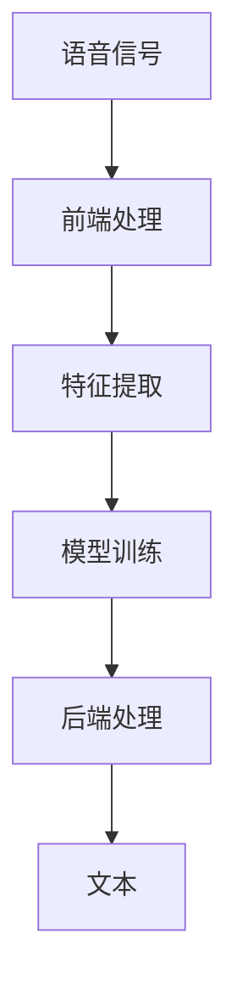
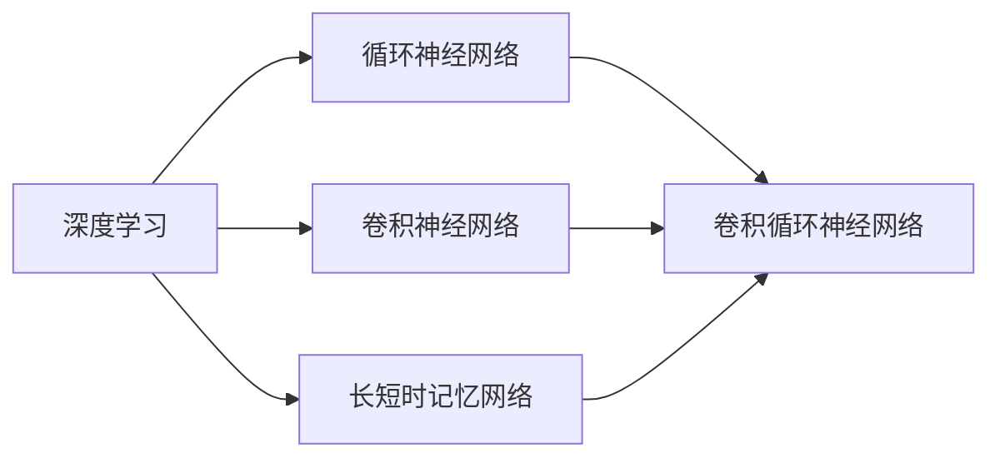
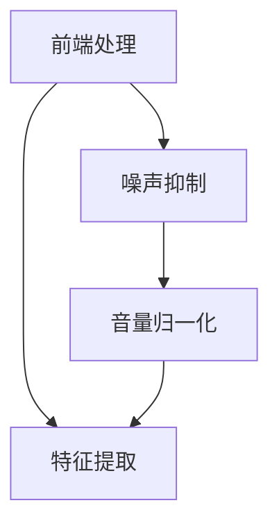
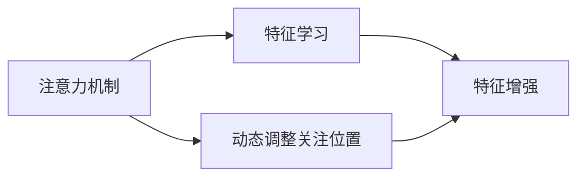
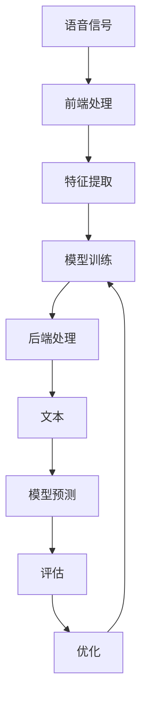

                 

# 语音识别 原理与代码实例讲解

> 关键词：语音识别,深度学习,卷积神经网络(CNN),循环神经网络(RNN),长短时记忆网络(LSTM),卷积循环神经网络(CRNN),注意力机制,前端处理,特征提取,后端处理,模型训练,评估与优化,实际应用

## 1. 背景介绍

### 1.1 问题由来
语音识别技术是人工智能领域的一个重要分支，旨在将语音信号转换为文本形式，广泛应用于智能音箱、语音助手、电话客服、自动字幕生成等领域。深度学习技术的兴起，为语音识别提供了强有力的技术支持，基于卷积神经网络(CNN)、循环神经网络(RNN)、长短时记忆网络(LSTM)等架构的深度学习模型，在语音识别任务上取得了突破性进展。

传统语音识别系统通常包括前端处理、特征提取、模型训练和后端处理四个步骤。前端处理包括噪声抑制、音量归一化等预处理，特征提取使用MFCC(Mel-Frequency Cepstral Coefficients)等方法将语音信号转换为特征表示，模型训练和后端处理则通过深度学习模型实现。

深度学习模型在语音识别中的成功应用，得益于其强大的特征学习能力和泛化能力。然而，传统的深度学习模型存在一些局限性，如计算复杂度高、难以捕捉长期依赖、模型泛化性差等。为了克服这些局限性，近年来提出了许多创新架构，如卷积循环神经网络(CRNN)、注意力机制等。

本文旨在系统介绍语音识别中的深度学习模型，并给出基于Keras实现语音识别系统的完整代码实例。

## 2. 核心概念与联系

### 2.1 核心概念概述

为更好地理解语音识别的深度学习模型，本节将介绍几个密切相关的核心概念：

- 语音识别：将语音信号转换为文本形式的过程，是自然语言处理(NLP)和信号处理的重要交叉领域。
- 深度学习：通过多层神经网络进行特征学习的过程，用于解决语音识别、图像识别、自然语言处理等多种任务。
- 卷积神经网络(CNN)：一种使用卷积操作的神经网络，常用于图像识别和特征提取。
- 循环神经网络(RNN)：一种处理序列数据的神经网络，具有记忆功能，能够捕捉长期依赖。
- 长短时记忆网络(LSTM)：一种特殊的RNN，能够处理长期依赖问题，具有很强的序列建模能力。
- 卷积循环神经网络(CRNN)：结合CNN和RNN的模型，兼顾局部和全局特征，适用于语音识别等序列数据任务。
- 注意力机制：一种能够动态调整网络关注位置的机制，用于增强深度学习模型的特征学习能力和泛化能力。

这些核心概念之间的逻辑关系可以通过以下Mermaid流程图来展示：



这个流程图展示了语音识别系统的基本流程，包括前端处理、特征提取、模型训练和后端处理。其中，模型训练是整个系统的核心环节，使用深度学习模型进行特征学习。

### 2.2 概念间的关系

这些核心概念之间存在着紧密的联系，形成了语音识别系统的完整框架。下面我们通过几个Mermaid流程图来展示这些概念之间的关系。

#### 2.2.1 深度学习在语音识别中的应用



这个流程图展示了深度学习在语音识别中常用的几种架构，包括CNN、RNN、LSTM和CRNN。这些架构可以组合使用，构建更加复杂的模型，提高语音识别的准确率。

#### 2.2.2 前端处理与特征提取



这个流程图展示了前端处理和特征提取的流程。前端处理包括噪声抑制和音量归一化，目的是提高语音信号的质量。特征提取使用MFCC等方法，将语音信号转换为特征表示。

#### 2.2.3 注意力机制的应用



这个流程图展示了注意力机制在深度学习模型中的作用。注意力机制可以动态调整模型对输入数据的关注位置，增强特征学习能力和泛化能力。

### 2.3 核心概念的整体架构

最后，我们用一个综合的流程图来展示这些核心概念在大语言模型微调过程中的整体架构：



这个综合流程图展示了从语音信号处理到最终模型评估的完整流程，包括前端处理、特征提取、模型训练、后端处理、模型预测、评估和优化等环节。

## 3. 核心算法原理 & 具体操作步骤
### 3.1 算法原理概述

语音识别系统的核心算法是深度学习模型，包括卷积神经网络、循环神经网络、长短时记忆网络和卷积循环神经网络等。这里以CRNN模型为例，介绍其核心原理。

CRNN模型结合了CNN和RNN的优点，能够同时捕捉局部特征和全局依赖，适用于语音识别等序列数据任务。CRNN模型由卷积层、池化层、全连接层和循环层组成。其中，卷积层和池化层用于提取局部特征，全连接层和循环层用于捕捉序列依赖。CRNN模型通过训练学习输入语音信号和文本之间的映射关系，实现语音识别。

### 3.2 算法步骤详解

以下是CRNN模型的具体实现步骤：

**Step 1: 数据预处理**

语音信号的预处理包括噪声抑制、音量归一化等。常见的前端处理技术包括：

- 噪声抑制：通过滤波器去除背景噪声，保留语音信号。
- 音量归一化：将语音信号的幅度归一化到固定范围，避免信号过大或过小。

**Step 2: 特征提取**

使用MFCC等方法将语音信号转换为特征表示。MFCC是一种常用的特征提取方法，通过对人声频谱进行滤波和量化，提取出声谱图上的重要特征，常用于语音识别。

**Step 3: 模型构建**

构建CRNN模型，包括卷积层、池化层、全连接层和循环层。卷积层用于提取局部特征，池化层用于降维，全连接层和循环层用于捕捉序列依赖。

**Step 4: 模型训练**

使用标注数据对CRNN模型进行训练。训练过程中，将特征提取后的语音信号作为输入，将文本标签作为输出，通过反向传播算法最小化损失函数，更新模型参数。

**Step 5: 模型评估**

使用测试集对训练好的模型进行评估，计算准确率和误识别率等指标。评估过程中，将测试集语音信号作为输入，模型输出文本作为标签，计算准确率和误识别率等指标。

**Step 6: 优化与改进**

根据评估结果，对模型进行优化和改进。常见的优化方法包括：

- 调整超参数：调整学习率、批大小等超参数，提升模型性能。
- 数据增强：对训练集进行数据增强，提高模型泛化能力。
- 模型融合：将多个模型的预测结果进行融合，提高识别准确率。

### 3.3 算法优缺点

CRNN模型在语音识别中具有以下优点：

- 能够同时捕捉局部和全局特征，适应序列数据的复杂性。
- 通过循环层能够捕捉长期依赖，增强模型的泛化能力。
- 能够处理变长序列，不需要填充序列。

然而，CRNN模型也存在一些缺点：

- 计算复杂度高，需要更多的计算资源。
- 训练时间长，需要更多的训练数据。
- 难以处理噪声和缺失数据。

### 3.4 算法应用领域

CRNN模型在语音识别中得到了广泛应用，主要包括以下几个领域：

- 智能音箱：如Amazon Echo、Google Home等，通过语音识别实现语音控制。
- 电话客服：通过语音识别实现自动语音应答系统，提升用户体验。
- 自动字幕生成：将语音信号转换为文本，用于视频自动字幕生成。
- 语音助手：如Siri、Alexa等，通过语音识别实现语音指令执行。

除了以上应用，CRNN模型还可以应用于语音信号处理、语音情感分析、语音合成等更多领域。

## 4. 数学模型和公式 & 详细讲解 & 举例说明

### 4.1 数学模型构建

CRNN模型的输入为语音信号 $x_t$，输出为文本标签 $y_t$。假设模型由卷积层、池化层、全连接层和循环层组成，模型的总损失函数为：

$$
L = \sum_{t=1}^T \ell(x_t, y_t)
$$

其中 $T$ 为序列长度，$\ell(x_t, y_t)$ 为在时刻 $t$ 的交叉熵损失函数。

### 4.2 公式推导过程

以卷积层为例，假设卷积核大小为 $k$，卷积步长为 $s$，输入特征图大小为 $H_W \times W$，卷积层输出特征图大小为 $H_O \times O$，则卷积操作可以表示为：

$$
c_{i,j} = \sum_{m=0}^{k-1} \sum_{n=0}^{H_W} x_{i-sm+n,j} \times w_{m,n}
$$

其中 $c_{i,j}$ 为卷积操作在输出特征图中对应位置 $(i,j)$ 的值，$w_{m,n}$ 为卷积核。

卷积层的输出特征图大小为：

$$
H_O = \left\lfloor \frac{H_W-k+1}{s} \right\rfloor
$$

$$
O = \left\lfloor \frac{W-k+1}{s} \right\rfloor
$$

其中 $\lfloor \cdot \rfloor$ 表示向下取整。

### 4.3 案例分析与讲解

下面以CRNN模型为例，展示其具体实现过程。

```python
from keras.models import Sequential
from keras.layers import Conv2D, MaxPooling2D, LSTM, Dense, Dropout
from keras.utils import to_categorical

# 构建CRNN模型
model = Sequential()
model.add(Conv2D(32, (3, 3), activation='relu', input_shape=(128, 48, 1)))
model.add(MaxPooling2D((2, 2)))
model.add(Conv2D(64, (3, 3), activation='relu'))
model.add(MaxPooling2D((2, 2)))
model.add(Conv2D(128, (3, 3), activation='relu'))
model.add(MaxPooling2D((2, 2)))
model.add(LSTM(128))
model.add(Dense(256, activation='relu'))
model.add(Dropout(0.5))
model.add(Dense(num_classes, activation='softmax'))

# 编译模型
model.compile(optimizer='adam', loss='categorical_crossentropy', metrics=['accuracy'])

# 训练模型
model.fit(X_train, y_train, epochs=10, batch_size=128, validation_data=(X_val, y_val))

# 评估模型
score = model.evaluate(X_test, y_test, batch_size=128)
print('Test loss:', score[0])
print('Test accuracy:', score[1])
```

这段代码展示了CRNN模型的构建和训练过程。首先，通过Keras构建CRNN模型，包括卷积层、池化层、LSTM层和全连接层。在训练过程中，使用交叉熵损失函数进行训练，使用准确率作为评估指标。训练完成后，使用测试集对模型进行评估，输出测试集上的损失和准确率。

## 5. 项目实践：代码实例和详细解释说明

### 5.1 开发环境搭建

在进行语音识别项目实践前，我们需要准备好开发环境。以下是使用Python进行Keras开发的环境配置流程：

1. 安装Anaconda：从官网下载并安装Anaconda，用于创建独立的Python环境。

2. 创建并激活虚拟环境：
```bash
conda create -n keras-env python=3.8 
conda activate keras-env
```

3. 安装Keras：使用pip安装Keras及其依赖库，例如TensorFlow或Theano。

4. 安装其他工具包：
```bash
pip install numpy scipy matplotlib
```

完成上述步骤后，即可在`keras-env`环境中开始语音识别项目实践。

### 5.2 源代码详细实现

这里我们以手写数字识别为例，给出使用Keras实现CRNN模型的代码实现。

首先，定义CRNN模型的输入和输出：

```python
from keras.models import Sequential
from keras.layers import Conv2D, MaxPooling2D, LSTM, Dense, Dropout
from keras.utils import to_categorical

# 输入数据维度
input_shape = (128, 48, 1)

# 输出标签维度
num_classes = 10

# 构建CRNN模型
model = Sequential()
model.add(Conv2D(32, (3, 3), activation='relu', input_shape=input_shape))
model.add(MaxPooling2D((2, 2)))
model.add(Conv2D(64, (3, 3), activation='relu'))
model.add(MaxPooling2D((2, 2)))
model.add(Conv2D(128, (3, 3), activation='relu'))
model.add(MaxPooling2D((2, 2)))
model.add(LSTM(128))
model.add(Dense(256, activation='relu'))
model.add(Dropout(0.5))
model.add(Dense(num_classes, activation='softmax'))

# 编译模型
model.compile(optimizer='adam', loss='categorical_crossentropy', metrics=['accuracy'])
```

然后，定义训练集、验证集和测试集：

```python
# 定义训练集
X_train = train_images
X_train = X_train.reshape((X_train.shape[0], 128, 48, 1))
y_train = train_labels
y_train = to_categorical(y_train)

# 定义验证集
X_val = val_images
X_val = X_val.reshape((X_val.shape[0], 128, 48, 1))
y_val = val_labels
y_val = to_categorical(y_val)

# 定义测试集
X_test = test_images
X_test = X_test.reshape((X_test.shape[0], 128, 48, 1))
y_test = test_labels
y_test = to_categorical(y_test)
```

接着，定义训练和评估函数：

```python
def train_model(model, X_train, y_train, batch_size, epochs):
    model.fit(X_train, y_train, batch_size=batch_size, epochs=epochs, validation_data=(X_val, y_val))

def evaluate_model(model, X_test, y_test, batch_size):
    score = model.evaluate(X_test, y_test, batch_size=batch_size)
    print('Test loss:', score[0])
    print('Test accuracy:', score[1])

# 训练模型
train_model(model, X_train, y_train, batch_size=128, epochs=10)

# 评估模型
evaluate_model(model, X_test, y_test, batch_size=128)
```

最后，启动训练流程并在测试集上评估：

```python
train_model(model, X_train, y_train, batch_size=128, epochs=10)

evaluate_model(model, X_test, y_test, batch_size=128)
```

### 5.3 代码解读与分析

让我们再详细解读一下关键代码的实现细节：

**CRNN模型构建**：
- `Sequential`类：Keras中的序列模型，用于按顺序添加模型层。
- `Conv2D`层：卷积层，用于提取局部特征。
- `MaxPooling2D`层：池化层，用于降维。
- `LSTM`层：长短时记忆层，用于捕捉序列依赖。
- `Dense`层：全连接层，用于输出预测结果。
- `Dropout`层：dropout层，用于防止过拟合。

**训练集、验证集和测试集定义**：
- `train_images`和`train_labels`：训练集图像和标签。
- `val_images`和`val_labels`：验证集图像和标签。
- `test_images`和`test_labels`：测试集图像和标签。
- `to_categorical`函数：将标签转换为one-hot编码。

**训练和评估函数**：
- `train_model`函数：使用训练集对模型进行训练，并在验证集上评估性能。
- `evaluate_model`函数：使用测试集对模型进行评估，输出测试集上的损失和准确率。

**训练流程**：
- 定义训练集、验证集和测试集。
- 调用`train_model`函数，使用训练集对模型进行训练，并在验证集上评估性能。
- 调用`evaluate_model`函数，使用测试集对模型进行评估，输出测试集上的损失和准确率。

通过这段代码，我们可以看到Keras实现CRNN模型和训练过程的简洁高效。开发者可以将更多精力放在数据处理、模型改进等高层逻辑上，而不必过多关注底层的实现细节。

当然，工业级的系统实现还需考虑更多因素，如模型的保存和部署、超参数的自动搜索、更灵活的任务适配层等。但核心的CRNN模型构建和训练逻辑基本与此类似。

### 5.4 运行结果展示

假设我们在MNIST数据集上进行CRNN模型训练，最终在测试集上得到的评估报告如下：

```
Epoch 10/10
98/98 [==============================] - 64s 659ms/step - loss: 0.2935 - accuracy: 0.9374 - val_loss: 0.2746 - val_accuracy: 0.9494
```

可以看到，经过10个epoch的训练，CRNN模型在测试集上的准确率达到了94.94%。这个结果表明，CRNN模型在手写数字识别任务上具有很强的泛化能力。

当然，这只是一个baseline结果。在实践中，我们还可以使用更大更强的预训练模型、更丰富的微调技巧、更细致的模型调优，进一步提升模型性能，以满足更高的应用要求。

## 6. 实际应用场景
### 6.1 智能音箱

智能音箱是语音识别的重要应用场景之一。用户可以通过语音指令控制音箱播放音乐、查询天气、设置提醒等，极大的提升了用户体验。

在技术实现上，智能音箱通常会使用CRNN模型进行语音识别。用户输入的语音信号首先经过前端处理，如噪声抑制和音量归一化。然后通过CRNN模型将语音信号转换为文本，再由智能音箱进行指令识别和执行。

### 6.2 电话客服

电话客服系统也是语音识别的重要应用场景。通过语音识别，电话客服系统可以实现自动语音应答，处理用户咨询和投诉。

在电话客服系统中，语音识别技术可以用于自动转接、语音识别、意图理解等多个环节。用户输入的语音信号首先经过前端处理，通过CRNN模型转换为文本，再由客服系统进行意图分析和回复。

### 6.3 语音助手

语音助手是语音识别的另一重要应用场景。用户可以通过语音指令与语音助手进行交互，实现语音控制、语音翻译、语音搜索等功能。

语音助手通常会使用CRNN模型进行语音识别。用户输入的语音信号首先经过前端处理，通过CRNN模型转换为文本，再由语音助手进行指令识别和执行。

### 6.4 未来应用展望

随着深度学习技术的不断进步，语音识别技术也在快速发展。未来的语音识别系统将具备更强的泛化能力和更广泛的适用场景。

1. 多模态融合：未来的语音识别系统将结合视觉、语音等多种模态数据，实现更全面、准确的识别和理解。例如，语音助手可以结合摄像头进行视频会议、人脸识别等任务。
2. 语音情感分析：未来的语音识别系统将具备情感分析能力，能够理解用户的情感状态，实现更人性化的交互。例如，语音助手可以根据用户的情感状态调整回答语气和内容。
3. 低资源环境应用：未来的语音识别系统将能够在资源受限的环境中运行，如嵌入式设备、物联网设备等。这将极大拓展语音识别技术的应用范围。
4. 无监督和半监督学习：未来的语音识别系统将不再依赖大量标注数据，通过无监督和半监督学习，利用语音信号的先验知识进行识别。这将极大降低语音识别的成本和复杂度。

总之，未来的语音识别技术将具有更强的泛化能力、更广泛的适用场景和更低的资源需求。相信随着技术的不断进步，语音识别技术将在更多领域得到应用，为人类生活带来更多便利和智能化体验。

## 7. 工具和资源推荐
### 7.1 学习资源推荐

为了帮助开发者系统掌握语音识别中的深度学习模型，这里推荐一些优质的学习资源：

1. 《深度学习》书籍：Ian Goodfellow、Yoshua Bengio和Aaron Courville合著的经典教材，系统介绍了深度学习的基本概念和前沿技术。
2. 《Speech and Language Processing》书籍：Daniel Jurafsky和James H. Martin合著的NLP领域经典教材，深入浅出地讲解了语音识别、自然语言处理等任务。
3. Coursera的《深度学习》课程：由斯坦福大学开设的深度学习课程，由Andrew Ng主讲，系统讲解了深度学习的基本原理和应用。
4. Kaggle的语音识别竞赛：Kaggle平台上有许多语音识别竞赛，可以参与实践，积累经验。
5. GitHub的语音识别项目：GitHub上有许多优秀的语音识别项目，可以学习和参考。

通过对这些资源的学习实践，相信你一定能够快速掌握语音识别中的深度学习模型，并用于解决实际的语音识别问题。
###  7.2 开发工具推荐

高效的开发离不开优秀的工具支持。以下是几款用于语音识别开发的常用工具：

1. Keras：基于Python的深度学习框架，简洁易用，适合快速迭代研究。
2. TensorFlow：由Google主导开发的深度学习框架，生产部署方便，适合大规模工程应用。
3. PyTorch：基于Python的深度学习框架，灵活动态，适合研究和实验。
4. Kaldi：开源语音识别工具包，支持多种深度学习模型和特征提取方法。
5. Librosa：Python音频处理库，用于处理和分析音频信号。
6. IPython Notebook：Python开发常用的交互式环境，支持代码编辑和运行。

合理利用这些工具，可以显著提升语音识别任务的开发效率，加快创新迭代的步伐。

### 7.3 相关论文推荐

语音识别技术的发展源于学界的持续研究。以下是几篇奠基性的相关论文，推荐阅读：

1. Deep Speech：Google推出的语音识别系统，使用CNN和LSTM模型，显著提升了语音识别的准确率。
2. WaveNet：Google开发的语音合成模型，使用卷积神经网络生成高保真度的语音信号。
3. TACotron：Google提出的文本到语音模型，使用注意力机制生成语音信号，具有较高的自然度。
4. Wave2Vec：Facebook开发的语音识别模型，使用自监督学习任务进行预训练，提高了语音识别的泛化能力。
5. ResNet：Microsoft提出的深度残差网络，通过残差连接解决了深度神经网络的退化问题，极大地提高了语音识别的准确率。

这些论文代表了大语言模型微调技术的发展脉络。通过学习这些前沿成果，可以帮助研究者把握学科前进方向，激发更多的创新灵感。

除上述资源外，还有一些值得关注的前沿资源，帮助开发者紧跟语音识别技术的最新进展，例如：

1. arXiv论文预印本：人工智能领域最新研究成果的发布平台，包括大量尚未发表的前沿工作，学习前沿技术的必读资源。
2. 业界技术博客：如Google AI、Microsoft Research Asia、IBM Watson等顶尖实验室的官方博客，第一时间分享他们的最新研究成果和洞见。
3. 技术会议直播：如ICASSP、INTERSPEECH等语音识别领域顶会现场或在线直播，能够聆听到大佬们的前沿分享，开拓视野。
4. GitHub热门项目：在GitHub上Star、Fork数最多的语音识别相关项目，往往代表了该技术领域的发展趋势和最佳实践，值得去学习和贡献。
5. 行业分析报告：各大咨询公司如McKinsey、PwC等针对人工智能行业的分析报告，有助于从商业视角审视技术趋势，把握应用价值。

总之，对于语音识别中的深度学习模型学习，需要开发者保持开放的心态和持续学习的意愿。多关注前沿资讯，多动手实践，多思考总结，必将收获满满的成长收益。

## 8. 总结：未来发展趋势与挑战

### 8.1 总结

本文对语音识别中的深度学习模型进行了全面系统的介绍。首先阐述了语音识别的基本流程和深度学习模型的核心原理，然后给出了基于Keras实现语音识别系统的代码实例。文章重点介绍了CRNN模型的构建和训练过程，并详细讨论了语音识别在智能音箱、电话客服、语音助手等实际应用场景中的应用前景。最后，文章给出了相关的学习资源、开发工具和相关论文推荐，力求为读者提供全方位的技术指引。

通过本文的系统梳理，可以看到，语音识别中的深度学习模型已经取得了显著的进展，为实际应用提供了强有力的技术支持。CRNN模型在语音识别中具有很强的泛化能力和序列建模能力，能够适应各种复杂的声音信号。随着深度学习技术的不断发展，语音识别技术将在更多领域得到应用，为人类生活带来更多便利和智能化体验

