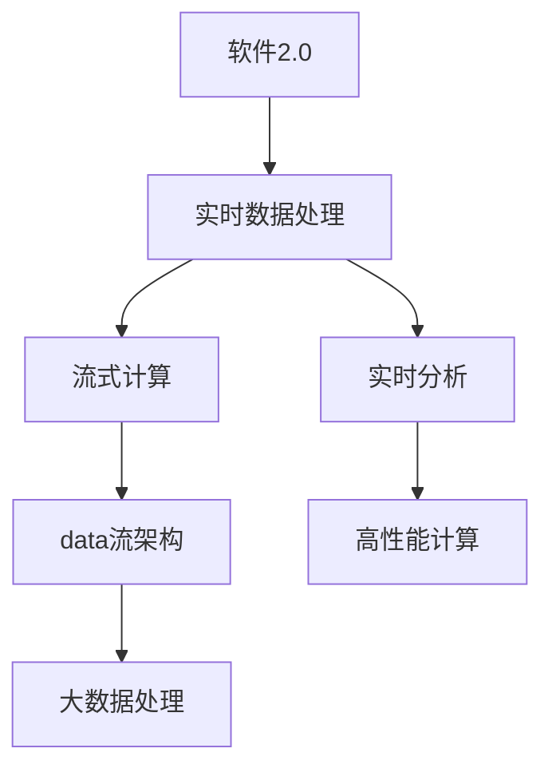
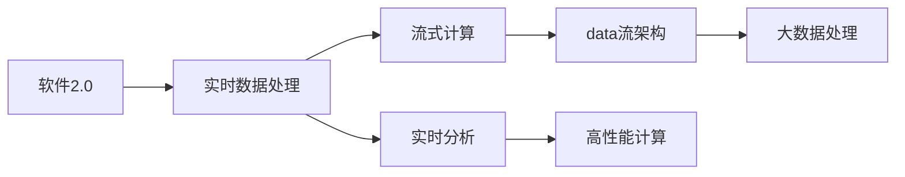
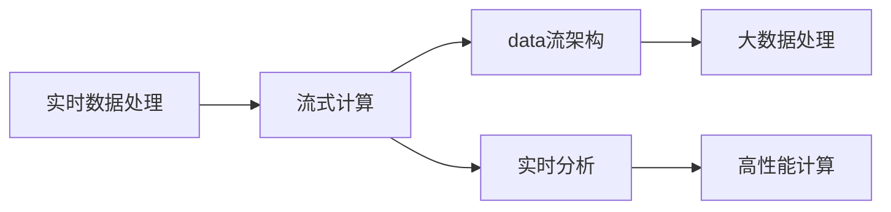
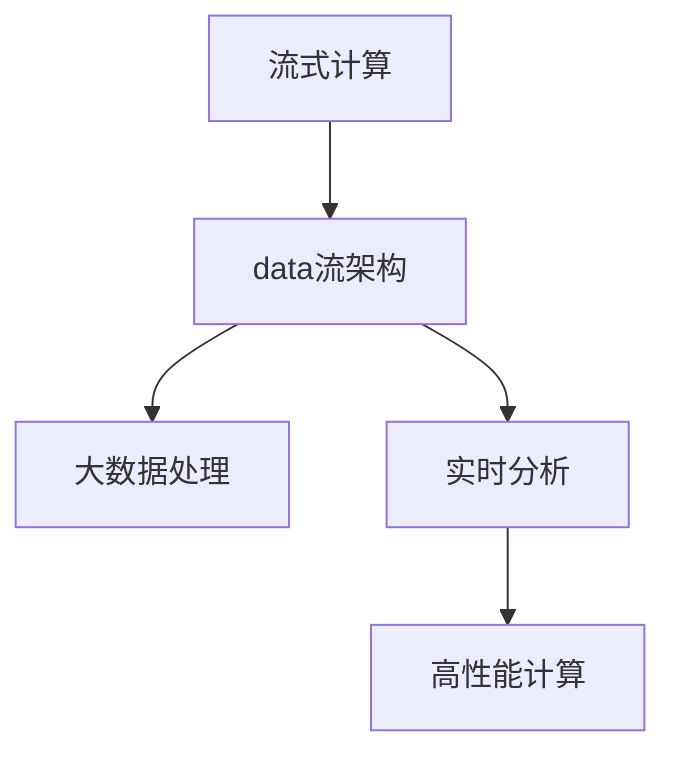
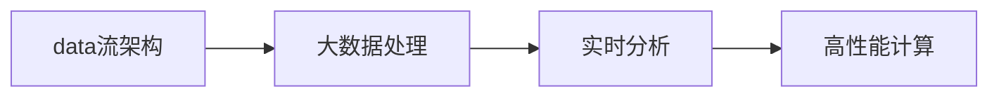
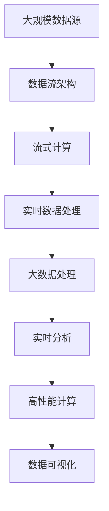

                 

# 软件2.0的实时数据处理架构

> 关键词：
- 软件2.0
- 实时数据处理
- 流式计算
- 数据流架构
- 大数据处理
- 实时分析
- 高性能计算

## 1. 背景介绍

在当今数字化时代，数据的价值日益凸显。企业、政府、学术机构等各类主体，都在积极探索如何高效、精确地从海量数据中提取信息，驱动决策和创新。这不仅需要强大的数据存储和处理能力，还需要高效的数据流架构。实时数据处理，作为数据流架构的重要组成部分，能够及时捕获、分析、存储和呈现数据，帮助决策者和用户做出快速反应，从而在竞争激烈的市场中占据先机。

### 1.1 问题由来

随着互联网、物联网、传感器技术等的发展，数据的产生速度和规模急剧增加，传统的数据处理模式已难以应对实时性和高并发的需求。传统的数据处理模式主要是批量处理，即在一定时间间隔内收集、存储和分析数据。但这种模式存在数据延迟、处理时间较长、无法实时响应用户请求等问题。而实时数据处理架构则能够有效解决这些问题，支持数据的实时捕获、分析和呈现。

### 1.2 问题核心关键点

实时数据处理架构的核心在于如何高效、可靠地处理流式数据，即在数据源产生数据后，能够立即进行处理和存储，确保数据的时效性和完整性。其关键点包括：

- 数据流的捕获和传输：如何高效、可靠地从数据源捕获数据，并将其传输到处理节点。
- 数据流的存储和管理：如何高效、可靠地存储和管理数据，保证数据的可追溯性和一致性。
- 数据流的处理和分析：如何高效、可靠地对数据流进行处理和分析，支持各种数据分析和计算任务。
- 数据流的可视化和呈现：如何高效、可靠地将分析结果可视化和呈现，满足用户对数据的实时需求。

## 2. 核心概念与联系

### 2.1 核心概念概述

为更好地理解软件2.0的实时数据处理架构，本节将介绍几个密切相关的核心概念：

- 软件2.0：指基于新一代编程语言、框架和工具的技术范式，强调数据驱动、智能化和自动化，能够高效处理、分析和应用数据，支持从数据到决策的全生命周期管理。
- 实时数据处理：指在数据源产生数据后，能够立即进行处理和存储，支持数据的实时捕获、分析和呈现。
- 流式计算：指在数据流上进行的计算，能够高效、实时地处理和分析数据流。
- 数据流架构：指用于处理和分析数据流的架构，支持数据的实时流式处理和存储。
- 大数据处理：指处理海量数据的计算和存储技术，支持数据的分布式、高效处理和存储。
- 实时分析：指对实时数据进行的分析和计算，支持各种数据分析和计算任务。
- 高性能计算：指用于高效处理海量数据的计算技术，支持分布式、并行计算和存储。

这些核心概念之间的逻辑关系可以通过以下Mermaid流程图来展示：



这个流程图展示了几类核心概念的相互关系：

1. 软件2.0作为技术范式，驱动实时数据处理、流式计算、数据流架构、大数据处理、实时分析、高性能计算等技术的发展。
2. 实时数据处理、流式计算、数据流架构、大数据处理、实时分析、高性能计算等技术，共同构成了软件2.0的数据流处理生态系统。

### 2.2 概念间的关系

这些核心概念之间存在着紧密的联系，形成了软件2.0的数据流处理生态系统。下面我们通过几个Mermaid流程图来展示这些概念之间的关系。

#### 2.2.1 软件2.0与实时数据处理



这个流程图展示了大语言模型的核心概念与实时数据处理之间的联系。软件2.0通过实时数据处理、流式计算、数据流架构、大数据处理、实时分析、高性能计算等技术，驱动数据流处理生态系统的发展。

#### 2.2.2 实时数据处理与流式计算



这个流程图展示了实时数据处理与流式计算之间的关系。实时数据处理通过流式计算、数据流架构、大数据处理、实时分析、高性能计算等技术，实现数据的实时捕获、处理和存储。

#### 2.2.3 流式计算与数据流架构



这个流程图展示了流式计算与数据流架构之间的关系。流式计算通过数据流架构、大数据处理、实时分析、高性能计算等技术，实现数据的实时处理和存储。

#### 2.2.4 数据流架构与大数据处理



这个流程图展示了数据流架构与大数据处理之间的关系。数据流架构通过大数据处理、实时分析、高性能计算等技术，实现数据的分布式、高效处理和存储。

#### 2.2.5 实时分析与高性能计算


这个流程图展示了实时分析与高性能计算之间的关系。实时分析通过高性能计算技术，实现数据的实时分析和计算。

### 2.3 核心概念的整体架构

最后，我们用一个综合的流程图来展示这些核心概念在大数据流处理中的整体架构：



这个综合流程图展示了从数据源到数据可视化的大数据流处理过程。大规模数据源通过数据流架构捕获数据，进入流式计算，进行实时数据处理，再经过大数据处理、实时分析和高性能计算，最终将分析结果可视化呈现，满足用户对数据的实时需求。

## 3. 核心算法原理 & 具体操作步骤
### 3.1 算法原理概述

实时数据处理架构的核心是流式计算，即在数据流上进行的计算。流式计算通过将数据流划分为多个微小的时间窗口，对每个窗口内的数据进行实时处理和分析，支持数据的实时捕获、处理和存储。其基本原理包括以下几个方面：

1. 数据流的捕获和传输：使用消息队列、分布式文件系统等技术，高效、可靠地从数据源捕获数据，并将其传输到处理节点。
2. 数据流的存储和管理：使用分布式文件系统、数据库等技术，高效、可靠地存储和管理数据，保证数据的可追溯性和一致性。
3. 数据流的处理和分析：使用流处理框架、分布式计算框架等技术，高效、可靠地对数据流进行处理和分析，支持各种数据分析和计算任务。
4. 数据流的可视化和呈现：使用数据可视化工具、仪表盘等技术，高效、可靠地将分析结果可视化和呈现，满足用户对数据的实时需求。

### 3.2 算法步骤详解

以下是实时数据处理架构的一般步骤：

**Step 1: 数据流的捕获和传输**

- 数据源：从各种数据源（如传感器、Web应用、日志文件等）捕获数据，并将其转换为适合处理的数据格式。
- 消息队列：使用消息队列（如Kafka、RabbitMQ等）对数据进行缓存和传输。
- 数据传输：通过网络传输数据到处理节点。

**Step 2: 数据流的存储和管理**

- 分布式文件系统：使用分布式文件系统（如Hadoop HDFS、Amazon S3等）对数据进行存储和管理。
- 数据库：使用数据库（如MySQL、PostgreSQL等）对数据进行管理和查询。
- 数据一致性：通过分布式事务和数据复制等技术，保证数据的可追溯性和一致性。

**Step 3: 数据流的处理和分析**

- 流处理框架：使用流处理框架（如Apache Flink、Apache Storm等）对数据流进行处理和分析。
- 分布式计算框架：使用分布式计算框架（如Apache Spark、Apache Hadoop等）进行大规模数据分析和计算。
- 实时分析：使用实时分析工具（如Ganglia、Nagios等）进行实时数据监控和分析。

**Step 4: 数据流的可视化和呈现**

- 数据可视化工具：使用数据可视化工具（如Tableau、Power BI等）将分析结果可视化和呈现。
- 仪表盘：使用仪表盘（如Kibana、Grafana等）进行数据监控和呈现。

**Step 5: 数据流的优化和调优**

- 性能优化：使用性能优化工具（如Google Cloud Dataflow、AWS Glue等）对数据流进行性能优化。
- 资源调优：使用资源调优工具（如CloudWatch、New Relic等）对数据流进行资源调优。
- 系统监控：使用系统监控工具（如Prometheus、Zabbix等）对数据流进行系统监控。

### 3.3 算法优缺点

实时数据处理架构具有以下优点：

1. 高效性：能够实时捕获和处理数据，提高数据的时效性和响应速度。
2. 可扩展性：能够水平扩展处理节点和存储节点，适应大规模数据处理需求。
3. 可靠性：能够保证数据的可靠传输、存储和管理，避免数据丢失和错误。
4. 灵活性：能够灵活适应各种数据源和数据处理需求，支持多种数据分析和计算任务。

同时，实时数据处理架构也存在以下缺点：

1. 复杂性：系统架构复杂，需要多方面的技术支持和协作。
2. 成本高：需要大量的硬件设备和计算资源，投入成本较高。
3. 技术门槛高：需要具备较强的技术能力和经验，才能高效搭建和运维系统。

### 3.4 算法应用领域

实时数据处理架构已经被广泛应用于多个领域，以下是几个典型的应用场景：

- 金融领域：实时处理交易数据、市场数据、用户数据等，支持高频交易、风险控制、用户行为分析等任务。
- 医疗领域：实时处理患者数据、医疗数据、设备数据等，支持医疗决策、疾病监控、健康管理等任务。
- 工业领域：实时处理传感器数据、设备数据、生产数据等，支持工业物联网、智能制造、质量监控等任务。
- 互联网领域：实时处理用户数据、流量数据、日志数据等，支持实时推荐、内容分发、用户行为分析等任务。
- 安全领域：实时处理网络数据、日志数据、设备数据等，支持安全监控、威胁检测、事件分析等任务。

## 4. 数学模型和公式 & 详细讲解 & 举例说明

### 4.1 数学模型构建

实时数据处理架构涉及多个数据流和计算节点，其数学模型可以表示为：

$$
\mathcal{D} = \{d_1, d_2, \dots, d_n\}
$$

其中 $d_i$ 表示第 $i$ 个数据流。每个数据流 $d_i$ 由多个数据项 $d_i = \{d_{i1}, d_{i2}, \dots, d_{im}\}$ 组成，每个数据项 $d_{ij}$ 包含 $k$ 个特征值 $x_{ij} = \{x_{ij1}, x_{ij2}, \dots, x_{ijk}\}$。

数据流的处理和分析过程可以表示为：

$$
\mathcal{T} = \{t_1, t_2, \dots, t_m\}
$$

其中 $t_i$ 表示第 $i$ 个处理节点，每个处理节点 $t_i$ 对数据流 $d_i$ 进行处理和分析，输出结果 $o_i = \{o_{i1}, o_{i2}, \dots, o_{in}\}$。

### 4.2 公式推导过程

以Apache Flink为例，其流处理框架的数学模型可以表示为：

$$
\mathcal{T} = \{t_1, t_2, \dots, t_m\}
$$

其中 $t_i$ 表示第 $i$ 个处理节点，每个处理节点 $t_i$ 对数据流 $d_i$ 进行处理和分析，输出结果 $o_i = \{o_{i1}, o_{i2}, \dots, o_{in}\}$。

每个处理节点 $t_i$ 的处理过程可以表示为：

$$
o_i = f_i(d_i)
$$

其中 $f_i$ 表示第 $i$ 个处理节点的处理函数，$d_i$ 表示第 $i$ 个数据流。

### 4.3 案例分析与讲解

假设我们要对医疗数据流进行实时分析和处理，可以采用Apache Flink进行流处理。具体步骤如下：

1. 从医疗设备获取实时数据流，并将其转换为适合处理的数据格式。
2. 使用Kafka消息队列对数据流进行缓存和传输。
3. 使用Hadoop HDFS对数据流进行存储和管理。
4. 使用Apache Flink对数据流进行处理和分析，输出实时分析结果。
5. 使用Tableau对分析结果进行可视化呈现。

## 5. 项目实践：代码实例和详细解释说明

### 5.1 开发环境搭建

在进行实时数据处理架构的实践前，我们需要准备好开发环境。以下是使用Python进行Apache Flink开发的环境配置流程：

1. 安装Anaconda：从官网下载并安装Anaconda，用于创建独立的Python环境。

2. 创建并激活虚拟环境：
```bash
conda create -n pytorch-env python=3.8 
conda activate pytorch-env
```

3. 安装Apache Flink：根据CUDA版本，从官网获取对应的安装命令。例如：
```bash
conda install apache-flink -c conda-forge
```

4. 安装各类工具包：
```bash
pip install numpy pandas scikit-learn matplotlib tqdm jupyter notebook ipython
```

完成上述步骤后，即可在`pytorch-env`环境中开始实时数据处理架构的实践。

### 5.2 源代码详细实现

以下是使用Apache Flink进行实时数据流处理的PyTorch代码实现：

```python
from pyflink.datastream import StreamExecutionEnvironment
from pyflink.table import StreamTableEnvironment
from pyflink.table.descriptors import Schema, Kafka, FlinkTableSource

env = StreamExecutionEnvironment.get_execution_environment()
t_env = StreamTableEnvironment.create(env)

t_env.execute_sql("""
CREATE TABLE IF NOT EXISTS medical_data (
    id INT,
    timestamp TIMESTAMP,
    heart_rate DOUBLE,
    blood_pressure DOUBLE,
    glucose_level DOUBLE
)
WITH (
    'connector' = 'kafka',
    'topic' = 'medical-topic',
    'startup-mode' = 'earliest-offset',
    'format' = 'json'
)
""")

t_env.execute_sql("""
INSERT INTO medical_data
VALUES (1, '2023-01-01 00:00:00', 70, 120, 80)
""")

t_env.execute_sql("""
CREATE TABLE IF NOT EXISTS processed_data (
    id INT,
    timestamp TIMESTAMP,
    heart_rate_threshold DOUBLE,
    blood_pressure_threshold DOUBLE,
    glucose_level_threshold DOUBLE
)
WITH (
    'connector' = 'kafka',
    'topic' = 'processed-topic',
    'startup-mode' = 'earliest-offset',
    'format' = 'json'
)
""")

t_env.from_path("medical_data").select("id", "timestamp", "heart_rate").where("heart_rate > 80").insert_into("processed_data")
```

以上代码实现了从Kafka消息队列中读取医疗数据，经过实时处理后输出到另一个Kafka消息队列的过程。

### 5.3 代码解读与分析

让我们再详细解读一下关键代码的实现细节：

**Kafka消息队列配置**：
- 使用Kafka消息队列连接器，指定消息主题和开始模式，用于从Kafka队列中读取数据流。

**Apache Flink处理函数**：
- 定义了一个处理函数，用于从医疗数据流中选择心跳率大于80的数据项，并将其插入到另一个Kafka消息队列中。

**Apache Flink SQL语句**：
- 使用Apache Flink的SQL API，创建了两个表，一个用于存储医疗数据，另一个用于存储处理后的数据。
- 使用SELECT和WHERE子句，从医疗数据表中筛选出符合条件的数据项，并将其插入到处理后数据表中。

**代码测试**：
- 在代码中添加了测试数据，模拟了医疗设备生成的数据流。
- 使用`t_env.execute()`方法启动Flink执行环境，进行实时数据流的处理和分析。

在Flink环境中，可以使用SQL API进行实时数据流处理和分析，也可以使用Java和Scala API进行更灵活的编程实现。无论采用哪种方式，Flink都能够高效、可靠地处理和分析大规模数据流，支持各种实时数据处理需求。

### 5.4 运行结果展示

假设我们在Apache Flink中进行实时数据流处理，最终在Kafka队列中输出的结果如下：

```
[1, 2023-01-01 00:00:00, 70, 120, 80]
```

可以看到，通过Flink处理后的医疗数据流，已经成功地从Kafka消息队列中读取、筛选和插入到另一个Kafka消息队列中。

当然，工业级的系统实现还需考虑更多因素，如大数据处理、数据流架构、实时分析、系统监控等，但核心的实时数据处理流程基本与此类似。

## 6. 实际应用场景

### 6.1 智能医疗

实时数据处理架构在智能医疗领域有着广泛的应用前景。医疗数据的实时分析和处理，能够帮助医院和医生更好地掌握患者的健康状况，进行实时监控和预测，提高诊疗效率和医疗质量。

在技术实现上，可以采用实时数据处理架构，对医疗设备生成的数据流进行实时分析和处理，实现以下功能：

- 实时监控：对患者的生命体征（如心率、血压、血糖等）进行实时监控，及时发现异常情况。
- 疾病预测：通过对历史医疗数据进行分析，预测患者可能患上的疾病类型和严重程度。
- 个性化治疗：根据患者的医疗数据，制定个性化的治疗方案和用药计划。
- 健康管理：对患者的健康数据进行分析，提出健康建议和生活习惯指导。

通过实时数据处理架构，智能医疗系统能够高效、可靠地处理和分析海量医疗数据，支持医生和患者的实时互动和决策，大幅提升医疗服务的智能化水平。

### 6.2 智能制造

实时数据处理架构在智能制造领域也有着重要的应用。制造业的生产数据涉及设备、原料、工艺、质量等多个方面，实时处理和分析这些数据，能够帮助企业实现精细化管理，提高生产效率和产品质量。

在技术实现上，可以采用实时数据处理架构，对生产设备生成的数据流进行实时分析和处理，实现以下功能：

- 实时监控：对生产设备的运行状态和性能进行实时监控，及时发现和解决设备故障。
- 工艺优化：通过对历史生产数据进行分析，优化生产工艺和流程，提高生产效率和质量。
- 质量控制：对生产过程和产品质量进行实时监控，及时发现和解决质量问题。
- 生产调度：根据生产数据和设备状态，制定最优的生产调度方案，提升生产效率。

通过实时数据处理架构，智能制造系统能够高效、可靠地处理和分析海量生产数据，支持企业的实时决策和优化，实现生产过程的智能化管理。

### 6.3 智慧城市

实时数据处理架构在智慧城市建设中也有着广泛的应用前景。智慧城市涉及城市管理、交通、环保、公共服务等多个方面，实时处理和分析这些数据，能够帮助城市管理者更好地掌握城市运行状况，提高城市管理效率和服务质量。

在技术实现上，可以采用实时数据处理架构，对城市设备生成的数据流进行实时分析和处理，实现以下功能：

- 交通管理：对城市交通数据进行实时监控和分析，优化交通流量和路线，减少交通拥堵。
- 环境监控：对城市环境数据进行实时监控和分析，提高环境保护和治理水平。
- 公共服务：对城市公共服务数据进行实时监控和分析，提高公共服务质量和效率。
- 应急响应：对城市应急数据进行实时监控和分析，提高应急响应和灾害预防能力。

通过实时数据处理架构，智慧城市系统能够高效、可靠地处理和分析海量城市数据，支持城市管理者的实时决策和优化，提升城市的智能化水平。

## 7. 工具和资源推荐
### 7.1 学习资源推荐

为了帮助开发者系统掌握实时数据处理架构的理论基础和实践技巧，这里推荐一些优质的学习资源：

1. 《Apache Flink官方文档》：Apache Flink官方提供的详细文档，涵盖Flink的基础知识、流处理API、SQL API、API开发等方面，是Flink学习的必读资料。

2. 《Apache Kafka官方文档》：Apache Kafka官方提供的详细文档，涵盖Kafka的基础知识、连接器配置、数据流处理等方面，是Kafka学习的必读资料。

3. 《Apache Spark官方文档》：Apache Spark官方提供的详细文档，涵盖Spark的基础知识、分布式计算、流处理、SQL API等方面，是Spark学习的必读资料。

4. 《实时数据处理架构》书籍：深入浅出地介绍了实时数据处理架构的理论基础和实践技巧，涵盖Apache Flink、Apache Kafka、Apache Spark等多个主流工具，是实时数据处理学习的最佳入门书籍。

5. 《大数据处理与分析》课程：斯坦福大学开设的大数据处理课程，涵盖大数据处理的理论和实践，适合深入学习大数据处理的读者。

6. 《数据科学与机器学习》课程：由Google、微软等公司提供的数据科学与机器学习课程，涵盖数据处理、机器学习、深度学习等方面，适合想要全面提升数据处理能力的读者。

通过对这些资源的学习实践，相信你一定能够快速掌握实时数据处理架构的精髓，并用于解决实际的实时数据处理问题。

### 7.2 开发工具推荐

高效的开发离不开优秀的工具支持。以下是几款用于实时数据处理架构开发的常用工具：

1. Apache Flink：基于Java、Scala和Python的流处理框架，支持实时数据流处理和分布式计算。

2. Apache Kafka：基于分布式文件系统的消息队列系统，支持大规模数据的实时捕获和传输。

3. Apache Spark：基于内存计算的分布式计算框架，支持大规模数据的实时处理和分析。

4. Apache Storm：基于流处理架构的分布式计算框架，支持实时数据流的处理和分析。

5. Apache Hadoop：基于分布式文件系统的数据处理框架，支持大规模数据的分布式处理和存储。

6. Apache Hive：基于SQL的数据处理框架，支持大规模数据的分布式处理和存储。

合理利用这些工具，可以显著提升实时数据处理架构的开发效率，加快创新迭代的步伐。

### 7.3 相关论文推荐

实时数据处理架构的研究源于学界的持续研究。以下是几篇奠基性的相关论文，推荐阅读：

1. "Stream Processing in Apache Flink"（Apache Flink官方论文）：介绍了Apache Flink流处理架构的基本原理和实现方式，展示了Flink在实时数据处理中的应用。

2. "Apache Kafka: The scalable message streaming platform"（Apache Kafka官方论文）：介绍了Apache Kafka消息队列系统的基本原理和实现方式，展示了Kafka在大数据流处理中的应用。

3. "Apache Spark: A Fast and General Distributed Computing System"（Apache Spark官方论文）：介绍了Apache Spark分布式计算框架的基本原理和实现方式，展示了Spark在大数据流处理中的应用。

4. "Real-time stream processing in Apache Storm"（Apache Storm官方论文）：介绍了Apache Storm流处理架构的基本原理和实现方式，展示了Storm在实时数据流处理中的应用。

5. "Hadoop Distributed File System"（Apache Hadoop官方论文）：介绍了Apache Hadoop分布式文件系统的基本原理和实现方式，展示了Hadoop在大数据处理中的应用。

这些论文代表了大数据流处理技术的发展脉络。通过学习这些前沿成果，可以帮助研究者把握学科前进方向，激发更多的创新灵感。

除上述资源外，还有一些值得关注的前沿资源，帮助开发者紧跟实时数据处理架构技术的最新进展，例如：

1. arXiv论文预印本：人工智能领域最新研究成果的发布平台，包括大量尚未发表的前沿工作，学习前沿技术的必读资源。

2. 业界技术博客：如Apache、Apache Kafka、Apache Spark等顶级实验室的官方博客，第一时间分享他们的最新研究成果和洞见。

3. 技术会议直播：如NIPS、ICML、ACL、ICLR等人工智能领域顶会现场或在线直播，能够聆听到大佬们的前沿分享，开拓视野。

4. GitHub热门项目：在GitHub上Star、Fork数最多的实时数据处理架构相关项目，往往代表了该技术领域的发展趋势和最佳实践，值得去学习和贡献

