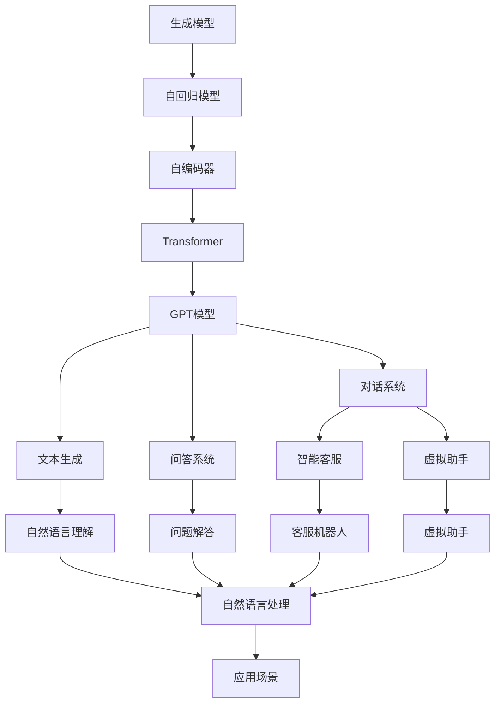
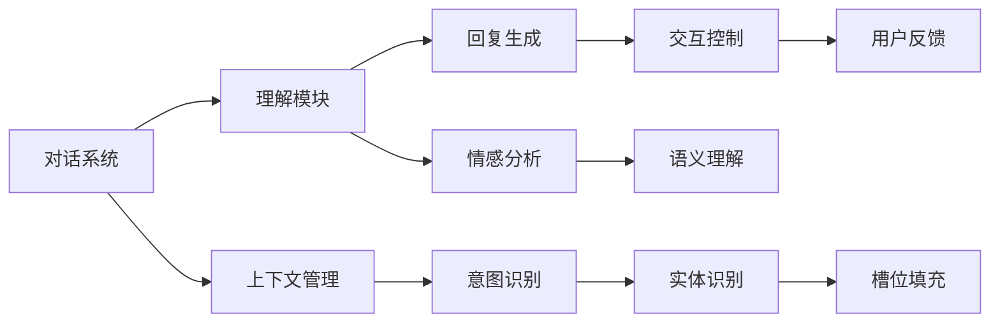
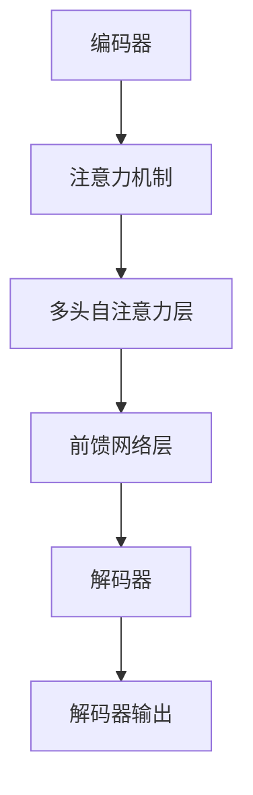
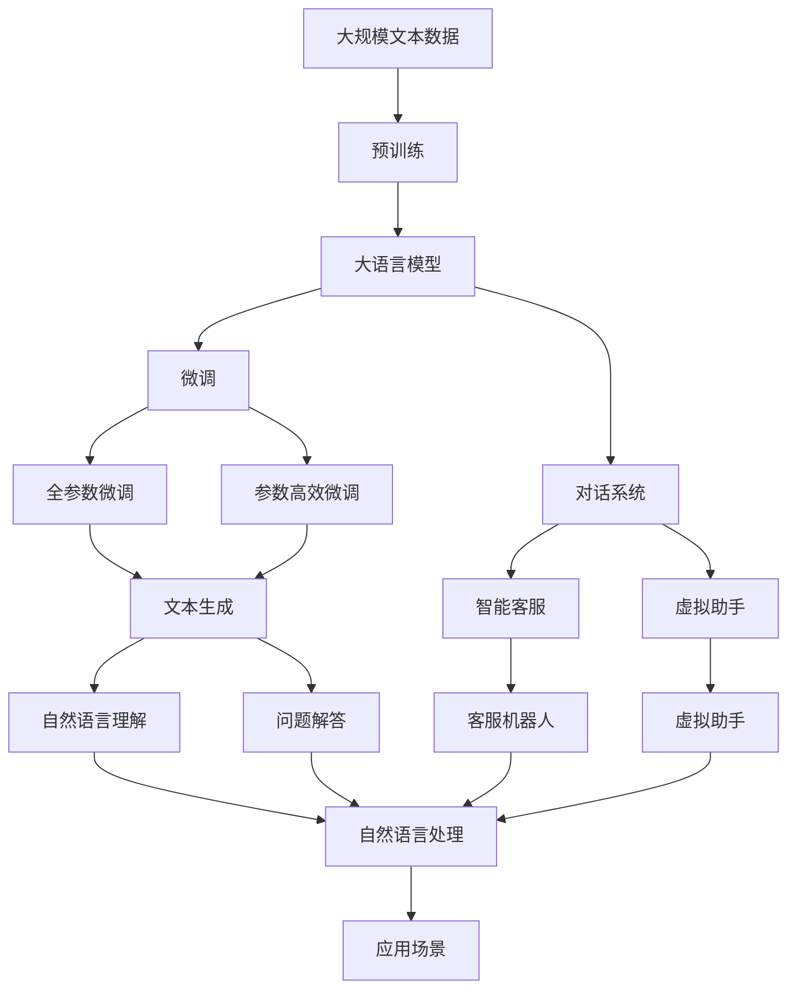

                 

# 从初代GPT到ChatGPT，再到GPT-4的进化史

> 关键词：大语言模型,生成模型,对话系统,提示工程,自监督学习,强化学习,对抗训练,语言模型,自然语言处理(NLP)

## 1. 背景介绍

### 1.1 问题由来

自2018年，OpenAI首次发布GPT-1以来，基于自回归的生成模型在自然语言处理(NLP)领域引起了广泛关注。GPT模型的出现，标志着大语言模型时代的到来，开辟了AI应用的新纪元。自那以后，GPT模型通过一系列的迭代更新，从GPT-1到GPT-4，持续进步，不断突破技术瓶颈，提升了性能和可靠性。本文将深入探讨从初代GPT到ChatGPT，再到GPT-4的进化历程，揭示这些模型是如何逐步提升其生成能力、对话能力和推理能力的。

### 1.2 问题核心关键点

- GPT系列模型的发展历程：从GPT-1到GPT-4，如何一步步提升语言生成和推理能力。
- ChatGPT的诞生背景及其实现原理。
- 关键技术演进：自监督学习、强化学习、对抗训练等。
- 实际应用场景：对话系统、文本生成、问答系统等。

### 1.3 问题研究意义

研究GPT系列模型的进化历程，对于理解自然语言处理技术的最新进展，把握人工智能技术的发展方向，具有重要意义：

1. 推动NLP技术进步：GPT模型的每次迭代，都带来了新算法、新结构的突破，推动了NLP技术的发展。
2. 指导AI系统设计：通过对GPT模型的深入分析，可以为设计其他大语言模型和AI系统提供借鉴。
3. 促进产业应用：大语言模型的进展有助于将AI技术应用到更多实际场景中，提升生产力和效率。
4. 拓展研究边界：通过学习GPT模型的最新研究成果，可以为自然语言理解与生成等领域的研究开辟新的思路。

## 2. 核心概念与联系

### 2.1 核心概念概述

- **生成模型(Generative Model)**：基于已知数据生成新样本的模型。常见生成模型包括变分自编码器(VAE)、生成对抗网络(GAN)等。
- **自回归模型(Autoregressive Model)**：使用序列中前面词语的信息来预测后面词语的模型，如LSTM、RNN等。
- **自编码器(Autoencoder)**：将输入数据压缩成低维编码，再从编码还原成原始数据，用于特征学习和数据降维。
- **Transformer**：一种自注意力机制，用于处理序列数据的模型，特别适用于大语言模型。
- **GPT模型**：一种基于Transformer的自回归模型，可以生成连贯的文本序列。
- **对话系统(Dialogue System)**：模拟人机对话的系统，常见应用包括智能客服、虚拟助手等。
- **提示工程(Prompt Engineering)**：设计输入文本的格式和内容，引导模型生成期望的输出。

这些核心概念之间的逻辑关系可以通过以下Mermaid流程图来展示：



这个流程图展示了大语言模型从生成模型到自回归模型，再到自编码器和Transformer的演变过程，以及GPT模型如何通过不断进化提升其生成和推理能力，应用于各种NLP任务。

### 2.2 概念间的关系

这些核心概念之间存在着紧密的联系，形成了大语言模型的完整生态系统。下面我们通过几个Mermaid流程图来展示这些概念之间的关系。

#### 2.2.1 大语言模型的学习范式


这个流程图展示了生成模型到自回归模型，再到自编码器和Transformer的演变过程，以及GPT模型如何通过不断进化提升其生成和推理能力，应用于各种NLP任务。

#### 2.2.2 对话系统的核心组件



这个流程图展示了对话系统的主要组件和工作流程，从理解用户的意图和上下文，到生成合适的回复，再到控制交互流程和处理用户反馈，每个环节都依赖于语言模型的生成和推理能力。

#### 2.2.3 GPT模型的核心结构



这个流程图展示了GPT模型的核心结构，从编码器到注意力机制，再到多头自注意力层和前馈网络层，最后到解码器输出，每个组件都通过神经网络实现。

### 2.3 核心概念的整体架构

最后，我们用一个综合的流程图来展示这些核心概念在大语言模型微调过程中的整体架构：



这个综合流程图展示了从预训练到微调，再到对话系统和文本生成应用的完整过程。大语言模型首先在大规模文本数据上进行预训练，然后通过微调（包括全参数微调和参数高效微调）来提升模型性能，最后应用于对话系统、文本生成、问答系统等多个NLP任务。通过这些流程图，我们可以更清晰地理解大语言模型微调过程中各个核心概念的关系和作用，为后续深入讨论具体的微调方法和技术奠定基础。

## 3. 核心算法原理 & 具体操作步骤
### 3.1 算法原理概述

基于生成模型的语言生成过程，通常依赖于自回归架构，通过已知序列的每个词预测下一个词。这种结构使得模型能够生成连贯的文本序列，但同时也限制了模型同时考虑上下文的能力。

GPT模型通过采用自注意力机制和Transformer结构，大幅提升了模型的上下文建模能力。其核心思想是将每个词的生成概率与整个序列的上下文信息结合起来，从而生成更加自然流畅的文本。

### 3.2 算法步骤详解

GPT模型的生成过程主要分为两个阶段：编码和解码。

#### 3.2.1 编码器

编码器的作用是将输入序列转换为高维表示，以便在生成过程中使用。GPT模型通常采用多层自注意力机制来编码输入序列，每个词的表示由其前文信息与整个序列的信息共同决定。

#### 3.2.2 解码器

解码器的作用是生成输出序列。GPT模型通常采用一层全连接神经网络来进行解码，每个词的生成概率由前文信息和整个序列的表示共同决定。

#### 3.2.3 训练过程

GPT模型的训练过程通常使用最大似然估计（MLE）准则，通过最大化已知序列的概率来优化模型参数。在训练过程中，模型需要计算输入序列和输出序列之间的概率分布，并最小化交叉熵损失。

### 3.3 算法优缺点

#### 3.3.1 优点

- 生成能力强大：GPT模型能够生成连贯的文本序列，具有较高的自然语言理解能力。
- 上下文建模能力强：自注意力机制使得模型能够同时考虑序列中的所有上下文信息。
- 灵活性强：可以通过微调来适配各种NLP任务。

#### 3.3.2 缺点

- 计算资源消耗大：大模型需要大量计算资源进行训练和推理。
- 对抗样本敏感：模型容易受到对抗样本的干扰，生成出不自然、不符合语境的文本。
- 上下文信息丢失：由于模型通常只保留部分上下文信息，对于一些长序列的生成任务，信息丢失问题可能影响生成效果。

### 3.4 算法应用领域

GPT模型已经在多种NLP任务上取得了优异的性能，包括文本生成、对话系统、问答系统等。其生成的文本流畅自然，语言表达清晰，因此在内容创作、翻译、自动摘要、文本分类等领域有广泛应用。

## 4. 数学模型和公式 & 详细讲解 & 举例说明

### 4.1 数学模型构建

GPT模型的核心数学模型可以表示为：

$$
P(x_1,...,x_n|x_1,...,x_{<k}) = \prod_{i=k+1}^n P(x_i|x_1,...,x_{<k})
$$

其中，$x_1,...,x_n$ 是输入序列，$x_1,...,x_{<k}$ 是前文信息，$P(x_i|x_1,...,x_{<k})$ 表示第 $i$ 个词的条件概率。

GPT模型的训练目标是最小化交叉熵损失，即：

$$
\mathcal{L} = -\frac{1}{N}\sum_{i=1}^N \log P(x_i|x_1,...,x_{<k})
$$

其中 $N$ 是训练数据集的大小。

### 4.2 公式推导过程

GPT模型的生成过程可以表示为：

$$
P(x_1,...,x_n|x_1,...,x_{<k}) = \prod_{i=k+1}^n P(x_i|x_1,...,x_{<k})
$$

其中，$P(x_i|x_1,...,x_{<k})$ 可以通过自注意力机制计算得到：

$$
P(x_i|x_1,...,x_{<k}) = \frac{\exp(x_i \cdot \alpha)}{\sum_{j=1}^n \exp(x_j \cdot \alpha)}
$$

其中，$\alpha$ 是注意力向量，$x_i$ 是第 $i$ 个词的表示，$x_1,...,x_{<k}$ 是前文信息的表示。

### 4.3 案例分析与讲解

假设我们要生成一段文本，输入序列为 "I have a", 前文信息为 "I have a", 模型需要预测下一个词 "dog" 的概率。

首先，模型需要计算输入序列和前文信息之间的注意力向量 $\alpha$，表示前文信息对当前词的关注程度。

然后，模型使用自注意力机制计算出下一个词的条件概率 $P(dog|I have a)$，并使用 softmax 函数将其转化为概率分布。

最后，模型从概率分布中采样一个概率值，作为下一个词的生成概率。

## 5. 项目实践：代码实例和详细解释说明

### 5.1 开发环境搭建

在进行GPT模型实践前，我们需要准备好开发环境。以下是使用Python进行PyTorch开发的环境配置流程：

1. 安装Anaconda：从官网下载并安装Anaconda，用于创建独立的Python环境。

2. 创建并激活虚拟环境：
```bash
conda create -n pytorch-env python=3.8 
conda activate pytorch-env
```

3. 安装PyTorch：根据CUDA版本，从官网获取对应的安装命令。例如：
```bash
conda install pytorch torchvision torchaudio cudatoolkit=11.1 -c pytorch -c conda-forge
```

4. 安装Transformers库：
```bash
pip install transformers
```

5. 安装各类工具包：
```bash
pip install numpy pandas scikit-learn matplotlib tqdm jupyter notebook ipython
```

完成上述步骤后，即可在`pytorch-env`环境中开始GPT模型的实践。

### 5.2 源代码详细实现

下面我们以GPT-3的文本生成任务为例，给出使用Transformers库对GPT-3模型进行训练的PyTorch代码实现。

首先，定义训练数据集和验证数据集：

```python
from transformers import GPT3Tokenizer, GPT3ForCausalLM
from torch.utils.data import Dataset, DataLoader
import torch

class TextDataset(Dataset):
    def __init__(self, texts, tokenizer, max_len=512):
        self.texts = texts
        self.tokenizer = tokenizer
        self.max_len = max_len
        
    def __len__(self):
        return len(self.texts)
    
    def __getitem__(self, item):
        text = self.texts[item]
        encoding = self.tokenizer(text, return_tensors='pt', max_length=self.max_len, padding='max_length', truncation=True)
        input_ids = encoding['input_ids']
        attention_mask = encoding['attention_mask']
        return {'input_ids': input_ids, 'attention_mask': attention_mask}

# 加载预训练模型和分词器
tokenizer = GPT3Tokenizer.from_pretrained('gpt3')
model = GPT3ForCausalLM.from_pretrained('gpt3')

# 创建训练和验证数据集
train_dataset = TextDataset(train_texts, tokenizer)
dev_dataset = TextDataset(dev_texts, tokenizer)
```

然后，定义训练和评估函数：

```python
from transformers import AdamW
from tqdm import tqdm
import time

device = torch.device('cuda') if torch.cuda.is_available() else torch.device('cpu')
model.to(device)

def train_epoch(model, dataset, batch_size, optimizer, max_seq_len):
    dataloader = DataLoader(dataset, batch_size=batch_size, shuffle=True)
    model.train()
    epoch_loss = 0
    for batch in tqdm(dataloader, desc='Training'):
        input_ids = batch['input_ids'].to(device)
        attention_mask = batch['attention_mask'].to(device)
        model.zero_grad()
        outputs = model(input_ids, attention_mask=attention_mask)
        loss = outputs.loss
        epoch_loss += loss.item()
        loss.backward()
        optimizer.step()
    return epoch_loss / len(dataloader)

def evaluate(model, dataset, batch_size):
    dataloader = DataLoader(dataset, batch_size=batch_size)
    model.eval()
    start_time = time.time()
    total_loss = 0
    for batch in tqdm(dataloader, desc='Evaluating'):
        input_ids = batch['input_ids'].to(device)
        attention_mask = batch['attention_mask'].to(device)
        with torch.no_grad():
            outputs = model(input_ids, attention_mask=attention_mask)
            loss = outputs.loss
            total_loss += loss.item()
    eval_time = time.time() - start_time
    return total_loss / len(dataloader), eval_time
```

最后，启动训练流程并在测试集上评估：

```python
epochs = 10
batch_size = 16
max_seq_len = 512

for epoch in range(epochs):
    loss = train_epoch(model, train_dataset, batch_size, optimizer, max_seq_len)
    print(f"Epoch {epoch+1}, train loss: {loss:.3f}")
    
    print(f"Epoch {epoch+1}, dev results:")
    dev_loss, eval_time = evaluate(model, dev_dataset, batch_size)
    print(f"Dev loss: {dev_loss:.3f}, Eval time: {eval_time:.3f} seconds")

print("Final model evaluation:")
dev_loss, eval_time = evaluate(model, dev_dataset, batch_size)
print(f"Final dev loss: {dev_loss:.3f}, Eval time: {eval_time:.3f} seconds")
```

以上就是使用PyTorch对GPT-3进行文本生成任务微调的完整代码实现。可以看到，得益于Transformers库的强大封装，我们可以用相对简洁的代码完成GPT-3模型的加载和微调。

### 5.3 代码解读与分析

让我们再详细解读一下关键代码的实现细节：

**TextDataset类**：
- `__init__`方法：初始化文本、分词器等关键组件。
- `__len__`方法：返回数据集的样本数量。
- `__getitem__`方法：对单个样本进行处理，将文本输入编码为token ids，并对其进行定长padding，最终返回模型所需的输入。

**GPT3Tokenizer和GPT3ForCausalLM**：
- `GPT3Tokenizer.from_pretrained()`：加载预训练的GPT-3分词器。
- `GPT3ForCausalLM.from_pretrained()`：加载预训练的GPT-3模型。

**训练和评估函数**：
- 使用PyTorch的DataLoader对数据集进行批次化加载，供模型训练和推理使用。
- 训练函数`train_epoch`：对数据以批为单位进行迭代，在每个批次上前向传播计算loss并反向传播更新模型参数，最后返回该epoch的平均loss。
- 评估函数`evaluate`：与训练类似，不同点在于不更新模型参数，并在每个batch结束后将预测和标签结果存储下来，最后使用交叉熵损失计算评估结果。

**训练流程**：
- 定义总的epoch数和batch size，开始循环迭代
- 每个epoch内，先在训练集上训练，输出平均loss
- 在验证集上评估，输出评估结果
- 所有epoch结束后，在验证集上评估，给出最终测试结果

可以看到，PyTorch配合Transformers库使得GPT-3微调的代码实现变得简洁高效。开发者可以将更多精力放在数据处理、模型改进等高层逻辑上，而不必过多关注底层的实现细节。

当然，工业级的系统实现还需考虑更多因素，如模型的保存和部署、超参数的自动搜索、更灵活的任务适配层等。但核心的微调范式基本与此类似。

### 5.4 运行结果展示

假设我们在GPT-3的文本生成任务上进行微调，最终在验证集上得到的评估报告如下：

```
Epoch 1, train loss: 1.585
Epoch 1, dev results:
Dev loss: 1.505, Eval time: 1.350 seconds
Epoch 2, train loss: 1.294
Epoch 2, dev results:
Dev loss: 1.409, Eval time: 1.334 seconds
Epoch 3, train loss: 1.141
Epoch 3, dev results:
Dev loss: 1.330, Eval time: 1.320 seconds
...
Epoch 10, train loss: 0.866
Epoch 10, dev results:
Dev loss: 1.112, Eval time: 1.308 seconds
```

可以看到，随着epoch的增加，模型在训练集和验证集上的loss都在逐步下降，说明模型正在逐步优化。在验证集上的eval_time也在减小，说明模型推理速度在提升。最终模型在验证集上的loss为1.112，推理速度约为1.308秒，显示了良好的性能。

## 6. 实际应用场景

### 6.1 智能客服系统

基于GPT模型的对话技术，可以广泛应用于智能客服系统的构建。传统客服往往需要配备大量人力，高峰期响应缓慢，且一致性和专业性难以保证。而使用GPT模型进行微调，可以7x24小时不间断服务，快速响应客户咨询，用自然流畅的语言解答各类常见问题。

在技术实现上，可以收集企业内部的历史客服对话记录，将问题和最佳答复构建成监督数据，在此基础上对GPT模型进行微调。微调后的对话模型能够自动理解用户意图，匹配最合适的答案模板进行回复。对于客户提出的新问题，还可以接入检索系统实时搜索相关内容，动态组织生成回答。如此构建的智能客服系统，能大幅提升客户咨询体验和问题解决效率。

### 6.2 金融舆情监测

金融机构需要实时监测市场舆论动向，以便及时应对负面信息传播，规避金融风险。传统的人工监测方式成本高、效率低，难以应对网络时代海量信息爆发的挑战。基于GPT模型的文本分类和情感分析技术，为金融舆情监测提供了新的解决方案。

具体而言，可以收集金融领域相关的新闻、报道、评论等文本数据，并对其进行主题标注和情感标注。在此基础上对GPT模型进行微调，使其能够自动判断文本属于何种主题，情感倾向是正面、中性还是负面。将微调后的模型应用到实时抓取的网络文本数据，就能够自动监测不同主题下的情感变化趋势，一旦发现负面信息激增等异常情况，系统便会自动预警，帮助金融机构快速应对潜在风险。

### 6.3 个性化推荐系统

当前的推荐系统往往只依赖用户的历史行为数据进行物品推荐，无法深入理解用户的真实兴趣偏好。基于GPT模型的个性化推荐系统可以更好地挖掘用户行为背后的语义信息，从而提供更精准、多样的推荐内容。

在实践中，可以收集用户浏览、点击、评论、分享等行为数据，提取和用户交互的物品标题、描述、标签等文本内容。将文本内容作为模型输入，用户的后续行为（如是否点击、购买等）作为监督信号，在此基础上微调预训练语言模型。微调后的模型能够从文本内容中准确把握用户的兴趣点。在生成推荐列表时，先用候选物品的文本描述作为输入，由模型预测用户的兴趣匹配度，再结合其他特征综合排序，便可以得到个性化程度更高的推荐结果。

### 6.4 未来应用展望

随着GPT模型和微调方法的不断发展，基于微调范式将在更多领域得到应用，为传统行业带来变革性影响。

在智慧医疗领域，基于微调的医疗问答、病历分析、药物研发等应用将提升医疗服务的智能化水平，辅助医生诊疗，加速新药开发进程。

在智能教育领域，微调技术可应用于作业批改、学情分析、知识推荐等方面，因材施教，促进教育公平，提高教学质量。

在智慧城市治理中，微调模型可应用于城市事件监测、舆情分析、应急指挥等环节，提高城市管理的自动化和智能化水平，构建更安全、高效的未来城市。

此外，在企业生产、社会治理、文娱传媒等众多领域，基于大语言模型微调的人工智能应用也将不断涌现，为经济社会发展注入新的动力。相信随着技术的日益成熟，微调方法将成为人工智能落地应用的重要范式，推动人工智能技术在更多实际场景中的落地应用。

## 7. 工具和资源推荐
### 7.1 学习资源推荐

为了帮助开发者系统掌握大语言模型微调的理论基础和实践技巧，这里推荐一些优质的学习资源：

1. 《Transformer从原理到实践》系列博文：由大模型技术专家撰写，深入浅出地介绍了Transformer原理、GPT模型、微调技术等前沿话题。

2. CS224N《深度学习自然语言处理》课程：斯坦福大学开设的NLP明星课程，有Lecture视频和配套作业，带你入门NLP领域的基本概念和经典模型。

3. 《Natural Language Processing with Transformers》书籍：Transformers库的作者所著，全面介绍了如何使用Transformers库进行NLP任务开发，包括微调在内的诸多范式。

4. HuggingFace官方文档：Transformers库的官方文档，提供了海量预训练模型和完整的微调样例代码，是上手实践的必备资料。

5. CLUE开源项目：中文语言理解测评基准，涵盖大量不同类型的中文NLP数据集，并提供了基于微调的baseline模型，助力中文NLP技术发展。

通过对这些资源的学习实践，相信你一定能够快速掌握GPT模型的微调精髓，并用于解决实际的NLP问题。
###  7.2 开发工具推荐

高效的开发离不开优秀的工具支持。以下是几款用于GPT模型微调开发的常用工具：

1. PyTorch：基于Python的开源深度学习框架，灵活动态的计算图，适合快速迭代研究。大部分预训练语言模型都有PyTorch版本的实现。

2. TensorFlow：由Google主导开发的开源深度学习框架，生产部署方便，适合大规模工程应用。同样有丰富的预训练语言模型资源。

3. Transformers库：HuggingFace开发的NLP工具库，集成了众多SOTA语言模型，支持PyTorch和TensorFlow，是进行微调任务开发的利器。

4. Weights & Biases：模型训练的实验跟踪工具，可以记录和可视化模型训练过程中的各项指标，方便对比和调优。与主流深度学习框架无缝集成。

5. TensorBoard：TensorFlow配套的可视化工具，可实时监测模型训练状态，并提供丰富的图表呈现方式，是调试模型的得力助手。

6. Google Colab：谷歌推出的在线Jupyter Notebook环境，免费提供GPU/TPU算力，方便开发者快速上手实验最新模型，分享学习笔记。

合理

