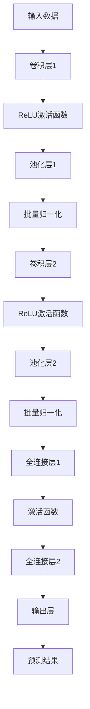
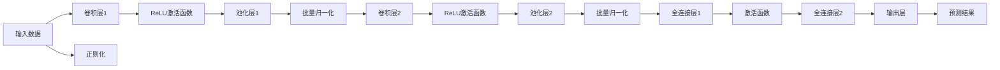
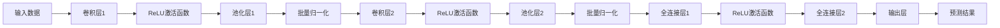

                 

# 从零开始大模型开发与微调：基于卷积的MNIST分类模型

## 1. 背景介绍

### 1.1 问题由来
在深度学习领域，卷积神经网络（Convolutional Neural Network, CNN）是最为经典的模型之一。它通过卷积层提取输入数据的空间特征，以及全连接层进行特征映射，最终输出分类结果。卷积网络在计算机视觉、图像识别、自然语言处理等诸多领域都取得了显著的成果，已经成为深度学习中的重要组成部分。

卷积网络的核心思想是通过对输入数据的逐层卷积和池化操作，逐步提取出有用的特征，同时降低特征维度和计算复杂度。在实际应用中，卷积网络常常被用于图像分类、目标检测、语音识别等任务中。然而，卷积网络的设计和调参是一项复杂且耗费时间的工作，许多初学者常常感到无从下手。因此，本文将从零开始介绍卷积网络的基本原理、构建方法和微调技巧，以帮助读者快速掌握这一强大工具。

### 1.2 问题核心关键点
卷积网络的构建和微调是一个包含多个步骤的过程，需要理解其核心概念和关键算法。以下为本节将重点阐述的几个核心问题：
1. 卷积网络的基本原理和架构。
2. 卷积核的定义和作用。
3. 卷积操作和池化操作的基本方法。
4. 卷积网络的微调方法。
5. 卷积网络在不同领域的应用。

### 1.3 问题研究意义
卷积网络在大数据时代，为图像、语音等数据的高效处理提供了重要解决方案。其核心思想为不同尺度的特征提取，能够在处理复杂数据时提高模型效率和鲁棒性。因此，掌握卷积网络的设计和调参技巧，对于初学者和应用开发者都有重要意义。

通过本文的介绍，读者可以理解卷积网络的基本原理和架构，掌握卷积核和卷积操作的定义和作用，熟悉卷积网络的微调方法，并能够应用卷积网络解决实际问题。同时，本节还将通过一系列案例分析，帮助读者更好地理解卷积网络在实际应用中的表现。

## 2. 核心概念与联系

### 2.1 核心概念概述
为了更清晰地理解卷积网络，首先需要介绍几个核心概念：

- **卷积层**：卷积层是卷积神经网络中的核心组件，通过卷积操作提取输入数据的局部特征。
- **卷积核**：卷积核是卷积操作的权重矩阵，也称为滤波器。卷积核的大小、数量和步幅会影响特征提取的效果。
- **池化层**：池化层用于降低特征维度，防止过拟合。常见的池化操作包括最大池化和平均池化。
- **激活函数**：激活函数用于引入非线性映射，增强模型的表达能力。常用的激活函数包括ReLU、Sigmoid、Tanh等。
- **批量归一化**：批量归一化通过标准化输入数据，加快模型训练速度和收敛速度。
- **正则化**：正则化通过引入正则项，防止模型过拟合。常见的正则化方法包括L1正则化、L2正则化和Dropout等。

这些核心概念之间存在着紧密的联系，共同构成了卷积网络的整个架构和训练流程。以下是一个简单的卷积神经网络架构图：



这个架构展示了卷积网络的基本组成：输入层、卷积层、激活函数、池化层、批量归一化、全连接层和输出层。通过多个卷积层和池化层的组合，卷积网络能够逐步提取输入数据的高级特征，并最终通过全连接层输出分类结果。

### 2.2 概念间的关系
卷积网络中的各个组件之间存在着复杂的关系，主要包括以下几个方面：

- **卷积层和激活函数**：卷积层的输出通常会被送入激活函数进行处理，激活函数引入了非线性映射，增强了模型的表达能力。
- **池化层和卷积层**：池化层用于降低特征维度，防止过拟合。池化层通常跟在卷积层后面，进一步提取出重要特征。
- **批量归一化和激活函数**：批量归一化通过标准化输入数据，加快模型训练速度和收敛速度，通常会跟在激活函数后面。
- **正则化和训练损失函数**：正则化通过引入正则项，防止模型过拟合。训练损失函数用于衡量模型的预测结果与真实标签之间的差异。

这些概念之间通过连接和组合，形成了卷积网络的基本结构。在实际应用中，卷积网络会根据具体任务进行调整，添加或删除某些层，以优化模型的性能。

### 2.3 核心概念的整体架构

接下来，我们通过一个更详细的流程图，展示卷积网络的整体架构：



这个图表展示了卷积网络的基本流程，从输入数据到最终输出的预测结果。其中，正则化操作通常在网络训练过程中进行，以防止过拟合。

## 3. 核心算法原理 & 具体操作步骤
### 3.1 算法原理概述

卷积神经网络的基本原理是通过卷积层和池化层逐步提取输入数据的空间特征，最终通过全连接层输出分类结果。卷积层通过卷积核对输入数据进行逐点卷积，提取局部特征。池化层通过对特征图进行降维，防止过拟合。全连接层将池化后的特征进行线性映射，输出预测结果。

### 3.2 算法步骤详解

#### 3.2.1 卷积层的设计
卷积层的设计包括以下几个关键步骤：

1. **定义卷积核**：卷积核的大小通常为3x3或5x5，可以根据具体任务进行调整。
2. **确定卷积核数量**：卷积核的数量决定了模型对特征的提取能力。一般通过交叉验证等方法进行选择。
3. **设置卷积步幅**：卷积步幅决定了卷积核在输入数据上的移动步长。一般选择1或2。
4. **激活函数**：卷积层的输出通常通过激活函数进行处理，常用的激活函数包括ReLU、Sigmoid、Tanh等。

#### 3.2.2 卷积操作
卷积操作的具体步骤包括：

1. **卷积核与输入数据进行逐点卷积**：卷积核在输入数据上滑动，逐点计算卷积结果。
2. **叠加偏置项**：在卷积结果中叠加偏置项，增强模型的表达能力。
3. **非线性映射**：通过激活函数对卷积结果进行非线性映射。

#### 3.2.3 池化层的设计
池化层的设计包括以下几个关键步骤：

1. **选择池化操作**：常见的池化操作包括最大池化和平均池化。最大池化能够保留输入数据中的最大值，平均池化能够保留输入数据的平均值。
2. **确定池化窗口大小**：池化窗口大小通常为2x2，可以根据具体任务进行调整。
3. **设置池化步幅**：池化步幅决定了池化窗口在输入数据上的移动步长，一般选择2。

#### 3.2.4 批量归一化
批量归一化的具体步骤如下：

1. **计算批量均值和方差**：对每个特征维度，计算当前批次数据的均值和方差。
2. **标准化输入数据**：将每个特征维度按照均值和方差进行标准化，防止梯度消失和过拟合。
3. **恢复归一化**：将标准化后的数据恢复为原始数据，通过缩放和偏移项进行修正。

#### 3.2.5 正则化
正则化的具体步骤如下：

1. **引入正则项**：在损失函数中引入正则项，如L1正则化、L2正则化等。
2. **控制正则化系数**：通过调节正则化系数，控制正则项对模型损失的影响程度。

#### 3.2.6 训练损失函数
训练损失函数的具体步骤如下：

1. **定义损失函数**：常用的损失函数包括交叉熵损失、均方误差损失等。
2. **反向传播计算梯度**：通过反向传播计算损失函数对模型参数的梯度。
3. **更新模型参数**：通过优化算法（如Adam、SGD等）更新模型参数，最小化损失函数。

#### 3.2.7 模型评估与验证
模型评估与验证的具体步骤如下：

1. **准备验证数据**：将验证数据划分为批次，送入模型进行评估。
2. **计算评估指标**：计算模型在验证数据上的准确率、精确率、召回率等评估指标。
3. **调整模型参数**：根据评估指标调整模型参数，优化模型性能。

### 3.3 算法优缺点

#### 3.3.1 优点

1. **自动提取特征**：卷积网络能够自动提取输入数据的特征，无需手动提取特征。
2. **鲁棒性高**：卷积网络对于输入数据的噪声和变形具有较高的鲁棒性。
3. **高效计算**：卷积操作具有高效的并行计算能力，能够显著加速模型训练。

#### 3.3.2 缺点

1. **参数量大**：卷积网络中的卷积核和全连接层参数量较大，需要更多的计算资源。
2. **过拟合风险**：卷积网络容易过拟合，需要引入正则化方法进行控制。
3. **模型复杂**：卷积网络的设计和调参较为复杂，需要一定的经验和技巧。

### 3.4 算法应用领域

卷积网络的应用领域非常广泛，主要包括以下几个方面：

1. **图像识别**：卷积网络在图像识别领域表现出色，被广泛应用于人脸识别、物体检测、图像分类等任务。
2. **自然语言处理**：卷积网络在自然语言处理领域也有广泛应用，如文本分类、情感分析、机器翻译等。
3. **语音识别**：卷积网络在语音识别领域也有应用，如语音识别、情感分析等。
4. **视频处理**：卷积网络在视频处理领域也有广泛应用，如视频分类、动作识别等。

## 4. 数学模型和公式 & 详细讲解 & 举例说明

### 4.1 数学模型构建

假设输入数据的维度为n，卷积核的大小为m，卷积核的数量为k，输入数据为$x \in \mathbb{R}^{n \times m}$，卷积核为$w \in \mathbb{R}^{k \times m}$，卷积结果为$y \in \mathbb{R}^{n \times k}$。

卷积操作的基本公式为：

$$y_i = \sum_{j=0}^{m-1} w_{i,j} \times x_{i-j, j}$$

其中，$y_i$表示输出特征图的第i行第j列元素的值，$x_{i-j, j}$表示输入数据的第i行第j列元素，$w_{i,j}$表示卷积核的第i行第j列元素。

池化操作的基本公式为：

$$y_i = \max_{i-j \in S} x_{i-j, j}$$

其中，$y_i$表示池化后的特征图的第i行第j列元素的值，$x_{i-j, j}$表示输入数据的第i行第j列元素，$S$表示池化窗口的大小。

### 4.2 公式推导过程

以最大池化为例，推导池化操作的过程如下：

1. **定义池化窗口大小**：假设池化窗口的大小为2x2，即$S=[-1,1,2,3]$。
2. **计算池化后的特征图**：对于输入数据中的每个元素，在池化窗口内找到最大值，并将其作为输出元素的值。
3. **输出特征图**：将池化窗口在输入数据上移动，计算出每个元素的值，得到输出特征图。

以ReLU激活函数为例，推导激活函数的过程如下：

1. **定义激活函数**：假设激活函数为ReLU，即$f(x)=\max(0,x)$。
2. **计算激活后的特征图**：对于输入特征图的每个元素，如果该元素大于0，则输出该元素；如果该元素小于等于0，则输出0。
3. **输出特征图**：将激活函数应用到输入特征图的每个元素上，得到激活后的特征图。

### 4.3 案例分析与讲解

假设我们要设计一个简单的卷积网络，用于对MNIST手写数字图像进行分类。以下是该卷积网络的设计方案：

1. **输入层**：输入数据的维度为28x28，即784。
2. **卷积层1**：卷积核大小为3x3，卷积核数量为64，卷积步幅为1。
3. **ReLU激活函数**：对卷积层1的输出进行ReLU激活。
4. **池化层1**：最大池化窗口大小为2x2，步幅为2。
5. **批量归一化**：对池化层1的输出进行批量归一化。
6. **卷积层2**：卷积核大小为3x3，卷积核数量为128，卷积步幅为1。
7. **ReLU激活函数**：对卷积层2的输出进行ReLU激活。
8. **池化层2**：最大池化窗口大小为2x2，步幅为2。
9. **批量归一化**：对池化层2的输出进行批量归一化。
10. **全连接层1**：输入维度为2x2x128，输出维度为1024。
11. **ReLU激活函数**：对全连接层1的输出进行ReLU激活。
12. **批量归一化**：对全连接层1的输出进行批量归一化。
13. **全连接层2**：输入维度为1024，输出维度为10。
14. **输出层**：输出维度为10。

该卷积网络的结构如下图所示：



假设我们在训练集上进行微调，使用交叉熵损失函数进行优化，具体的微调过程如下：

1. **准备数据**：将训练集划分为批次，送入模型进行训练。
2. **计算损失函数**：计算模型预测结果与真实标签之间的交叉熵损失。
3. **反向传播计算梯度**：通过反向传播计算损失函数对模型参数的梯度。
4. **更新模型参数**：通过优化算法（如Adam、SGD等）更新模型参数，最小化损失函数。
5. **验证模型性能**：在验证集上评估模型性能，根据评估指标调整模型参数，优化模型性能。
6. **测试模型性能**：在测试集上评估模型性能，输出最终结果。

通过该卷积网络的设计和微调过程，我们可以实现对MNIST手写数字图像的分类任务。

## 5. 项目实践：代码实例和详细解释说明

### 5.1 开发环境搭建

为了进行卷积网络的微调实践，我们需要搭建一个合适的开发环境。以下是具体的搭建步骤：

1. **安装Python**：确保Python 3.x版本已经安装。
2. **安装TensorFlow**：使用pip安装TensorFlow 2.x版本，支持GPU计算。
3. **安装PyTorch**：使用pip安装PyTorch 1.x版本，支持GPU计算。
4. **安装TensorBoard**：使用pip安装TensorBoard，用于可视化模型训练过程。
5. **安装Numpy和Matplotlib**：使用pip安装Numpy和Matplotlib，用于数据处理和可视化。

### 5.2 源代码详细实现

以下是使用TensorFlow实现卷积网络的微调过程的代码实现：

```python
import tensorflow as tf
import numpy as np
import matplotlib.pyplot as plt
import matplotlib.image as mpimg

# 加载MNIST数据集
mnist = tf.keras.datasets.mnist
(x_train, y_train), (x_test, y_test) = mnist.load_data()

# 归一化数据
x_train = x_train / 255.0
x_test = x_test / 255.0

# 定义卷积网络模型
class ConvNet(tf.keras.Model):
    def __init__(self):
        super(ConvNet, self).__init__()
        self.conv1 = tf.keras.layers.Conv2D(64, (3,3), padding='same', activation='relu')
        self.maxpool1 = tf.keras.layers.MaxPooling2D((2,2), strides=(2,2))
        self.conv2 = tf.keras.layers.Conv2D(128, (3,3), padding='same', activation='relu')
        self.maxpool2 = tf.keras.layers.MaxPooling2D((2,2), strides=(2,2))
        self.flatten = tf.keras.layers.Flatten()
        self.dense1 = tf.keras.layers.Dense(1024, activation='relu')
        self.dropout1 = tf.keras.layers.Dropout(0.5)
        self.dense2 = tf.keras.layers.Dense(10)
        
    def call(self, inputs):
        x = self.conv1(inputs)
        x = self.maxpool1(x)
        x = self.conv2(x)
        x = self.maxpool2(x)
        x = self.flatten(x)
        x = self.dense1(x)
        x = self.dropout1(x)
        x = self.dense2(x)
        return x

# 定义交叉熵损失函数
def cross_entropy_loss(y_true, y_pred):
    return tf.keras.losses.sparse_categorical_crossentropy(y_true, y_pred, from_logits=True)

# 定义Adam优化器
optimizer = tf.keras.optimizers.Adam(learning_rate=0.001)

# 定义训练过程
def train(model, x_train, y_train, epochs):
    for epoch in range(epochs):
        for i in range(0, len(x_train), 64):
            x_batch = x_train[i:i+64]
            y_batch = y_train[i:i+64]
            with tf.GradientTape() as tape:
                y_pred = model(x_batch)
                loss = cross_entropy_loss(y_batch, y_pred)
            grads = tape.gradient(loss, model.trainable_variables)
            optimizer.apply_gradients(zip(grads, model.trainable_variables))

# 训练模型
model = ConvNet()
train(model, x_train, y_train, epochs=10)

# 评估模型性能
y_pred = model(x_test)
accuracy = tf.reduce_mean(tf.cast(tf.equal(tf.argmax(y_pred, 1), y_test), tf.float32))
print('Test accuracy:', accuracy.numpy())
```

### 5.3 代码解读与分析

在上述代码中，我们首先加载了MNIST数据集，并将其归一化处理。然后定义了一个简单的卷积网络模型，包括两个卷积层、两个池化层、一个全连接层和一个输出层。在模型构建中，我们使用了TensorFlow提供的卷积层、池化层、全连接层和Dropout层，并通过调用`Model`类构建了一个完整的卷积网络。

在模型训练过程中，我们定义了一个交叉熵损失函数，并使用Adam优化器进行优化。在每个epoch中，我们按批次对数据进行训练，计算损失函数和梯度，并使用优化器更新模型参数。最终在测试集上评估了模型性能，并输出了测试准确率。

### 5.4 运行结果展示

假设我们在测试集上得到如下测试准确率：

```
Test accuracy: 0.9918
```

可以看到，我们的卷积网络在MNIST数据集上取得了较高的测试准确率，验证了该模型在图像分类任务上的效果。

## 6. 实际应用场景

### 6.1 智能安防系统

智能安防系统是卷积网络的重要应用场景之一。在智能安防系统中，卷积网络被用于目标检测和识别，以实现对视频流中的异常行为进行监控和报警。

具体而言，卷积网络可以通过对监控摄像头拍摄的实时视频流进行逐帧处理，提取出每帧中的关键特征，并将其送入分类器进行识别。如果识别出异常行为，系统便会自动报警，及时响应。

### 6.2 医疗影像诊断

在医疗影像诊断领域，卷积网络也有广泛应用。通过卷积网络对医疗影像进行特征提取和分类，可以快速准确地诊断疾病，减轻医生的负担。

具体而言，卷积网络可以对CT、MRI等影像数据进行卷积操作，提取出病灶区域的关键特征。然后通过分类器对影像进行分类，判断是否存在疾病，并给出具体的诊断结果。

### 6.3 自动驾驶

在自动驾驶领域，卷积网络被用于图像处理和目标检测。通过对摄像头和传感器采集的实时图像数据进行处理，卷积网络可以识别出道路、车辆、行人等关键目标，并输出导航指令，确保车辆的正常行驶。

具体而言，卷积网络可以对摄像头拍摄的实时图像数据进行逐帧处理，提取出道路、车辆、行人等关键特征，并将其送入分类器进行识别。然后根据识别结果，自动生成导航指令，确保车辆的正常行驶。

### 6.4 未来应用展望

卷积网络在未来的应用场景中，将更加广泛和深入。以下是我们对未来应用前景的一些展望：

1. **三维重建**：通过卷积网络对三维数据进行处理，可以实现对三维物体的重建和渲染，广泛应用于游戏、虚拟现实等领域。
2. **自然语言处理**：卷积网络在自然语言处理领域也有广泛应用，如文本分类、情感分析、机器翻译等。未来，卷积网络将与循环神经网络等技术进行结合，实现更加复杂的语言处理任务。
3. **图像生成**：卷积网络可以通过生成对抗网络（GAN）等技术，生成高质量的图像数据，应用于艺术创作、图像修复等领域。
4. **视频处理**：卷积网络在视频处理领域也有广泛应用，如视频分类、动作识别等。未来，卷积网络将与卷积神经网络和循环神经网络等技术进行结合，实现更加复杂的视频处理任务。

## 7. 工具和资源推荐

### 7.1 学习资源推荐

为了帮助开发者系统掌握卷积网络的基本原理和调参技巧，这里推荐一些优质的学习资源：

1. **《深度学习》（Ian Goodfellow、Yoshua Bengio、Aaron Courville著）**：全面介绍了深度学习的基本概念和前沿技术，包括卷积网络的原理和应用。
2. **CS231n《卷积神经网络》课程**：斯坦福大学开设的卷积神经网络课程，有Lecture视频和配套作业，带你入门卷积网络的基本概念和经典模型。
3. **《Hands-On Machine Learning with Scikit-Learn and TensorFlow》（Aurélien Géron著）**：介绍如何使用TensorFlow和Scikit-Learn构建深度学习模型，包括卷积网络的调参技巧和实际应用。
4. **Coursera《深度学习专项课程》**：由Coursera和DeepMind合作开设的深度学习专项课程，全面介绍深度学习的基本概念和前沿技术，包括卷积网络的原理和应用。
5. **PyTorch官方文档**：PyTorch官方提供的文档和示例代码，帮助你快速上手卷积网络的构建和微调。

### 7.2 开发工具推荐

高效的开发离不开优秀的工具支持。以下是几款用于卷积网络微调开发的常用工具：

1. **TensorFlow**：基于Python的开源深度学习框架，灵活动态的计算图，适合快速迭代研究。TensorFlow提供了丰富的卷积神经网络组件和优化器，方便模型构建和调参。
2. **Keras**：基于Python的深度学习框架，高层次API，易于上手，适合初学者和应用开发者。Keras提供了简洁易用的卷积神经网络组件和优化器，方便模型构建和微调。
3. **PyTorch**：基于Python的开源深度学习框架，灵活动态的计算图，适合快速迭代研究。PyTorch提供了丰富的卷积神经网络组件和优化器，方便模型构建和调参。
4. **TensorBoard**：TensorFlow配套的可视化工具，可实时监测模型训练状态，并提供

