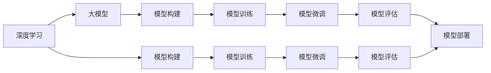

                 

# 从零开始大模型开发与微调：深度学习与人工智能

> 关键词：深度学习, 大模型开发, 微调, 人工智能, 模型优化, 神经网络

## 1. 背景介绍

### 1.1 问题由来
随着人工智能(AI)技术的飞速发展，深度学习(Deep Learning)已经成为推动AI技术进步的重要引擎。深度学习不仅在图像识别、语音识别等传统领域取得了显著成果，还在自然语言处理(NLP)、语音处理、推荐系统等多个领域展现出了巨大潜力。大模型开发和大模型微调成为当前AI研究的热点，其卓越性能和广泛应用价值受到了业界的广泛关注。

深度学习模型的核心在于构建复杂的多层次网络结构，通过训练和学习参数来逼近复杂函数，实现对输入数据的精确建模。在深度学习中，大模型通常指的是拥有数亿甚至数十亿参数的模型，如GPT-3、BERT等。大模型凭借其庞大的参数量，具备强大的表征能力，可以学习到更加丰富的特征表示，从而在各种复杂任务上表现出色。

### 1.2 问题核心关键点
大模型开发与微调的核心在于如何构建和优化深度神经网络，使其在特定任务上表现最佳。这通常包括以下几个关键步骤：
1. **数据预处理**：收集、清洗、标注大量数据，构建训练集和验证集。
2. **模型构建**：选择合适的深度学习框架和模型架构，如卷积神经网络(CNN)、循环神经网络(RNN)、Transformer等。
3. **模型训练**：使用反向传播算法优化模型参数，最小化损失函数。
4. **模型评估**：使用验证集评估模型性能，调整超参数。
5. **模型微调**：在大模型上添加特定任务的任务层，使用小规模数据集进行有监督学习，提高模型在特定任务上的效果。
6. **模型部署**：将训练好的模型部署到实际应用场景中，进行推理和预测。

### 1.3 问题研究意义
大模型开发与微调在AI领域具有重要意义：
1. **提升模型性能**：通过微调，大模型可以针对特定任务进行优化，显著提升模型性能。
2. **减少计算资源投入**：使用大模型微调，可以避免从头开始训练模型，节省计算资源和时间。
3. **促进技术应用**：微调技术使得大模型更容易被各行各业采用，推动AI技术在各个领域的广泛应用。
4. **增强泛化能力**：微调可以在小样本情况下提高模型的泛化能力，使模型能够适应多种场景和任务。
5. **加速研发进程**：微调技术使得开发者能够快速迭代和优化模型，加速产品研发和迭代。

## 2. 核心概念与联系

### 2.1 核心概念概述
为了深入理解大模型开发与微调的过程，我们将介绍几个核心概念及其相互联系：

- **深度学习**：使用多层神经网络对数据进行建模和预测的机器学习方法。深度学习模型由多个层次的非线性变换组成，可以自动提取数据的高级特征。
- **大模型**：拥有数亿甚至数十亿参数的深度学习模型，通常使用大规模的GPU集群进行训练，具备强大的表征能力。
- **模型构建**：选择合适的神经网络结构，如卷积神经网络(CNN)、循环神经网络(RNN)、Transformer等，并进行配置和调整。
- **模型训练**：通过反向传播算法，不断调整模型参数，最小化损失函数，优化模型性能。
- **模型微调**：在大模型的基础上，使用小规模标注数据进行有监督学习，调整特定任务的相关参数，提升模型在该任务上的表现。
- **模型评估**：使用验证集或测试集评估模型性能，判断模型是否达到预期效果。
- **模型部署**：将训练好的模型部署到实际应用中，进行推理和预测。

这些概念相互关联，共同构成了大模型开发与微调的基本框架。

### 2.2 概念间的关系

以下通过几个Mermaid流程图来展示这些核心概念之间的关系：



这个流程图展示了大模型开发与微调的主要过程：

1. **深度学习**是大模型构建的基础，提供理论和方法支持。
2. **模型构建**确定网络结构，为训练和微调提供模型骨架。
3. **模型训练**通过反向传播优化参数，提高模型性能。
4. **模型微调**在特定任务上进行有监督学习，提升模型针对性。
5. **模型评估**通过验证集或测试集评估模型效果，调整超参数。
6. **模型部署**将训练好的模型应用于实际场景，进行推理和预测。

## 3. 核心算法原理 & 具体操作步骤
### 3.1 算法原理概述

大模型开发与微调的原理基于深度学习中的反向传播算法和梯度下降优化算法。其核心思想是通过前向传播计算损失函数，反向传播计算梯度，不断更新模型参数，使模型损失最小化。

具体而言，假设深度学习模型为 $M_{\theta}$，其中 $\theta$ 为模型参数。模型的输入为 $x$，输出为 $y$。训练过程中，通过反向传播算法计算损失函数 $\mathcal{L}(y, \hat{y})$，其中 $\hat{y}$ 为模型预测输出，$y$ 为真实标签。目标是最小化损失函数：

$$
\theta^* = \mathop{\arg\min}_{\theta} \mathcal{L}(y, M_{\theta}(x))
$$

常用的损失函数包括交叉熵损失、均方误差损失等。在模型构建和训练过程中，通过选择合适的网络结构和优化算法，最小化损失函数，逐步优化模型参数，提升模型性能。

### 3.2 算法步骤详解

以下是大模型开发与微调的主要操作步骤：

**Step 1: 数据预处理**
- 收集大量标注数据，构建训练集和验证集。
- 对数据进行清洗、标注，去除噪声和错误数据。
- 对数据进行归一化、标准化处理，提高数据质量。

**Step 2: 模型构建**
- 选择合适的深度学习框架和模型架构，如TensorFlow、PyTorch、Keras等。
- 设计网络结构，包括卷积层、全连接层、循环层等。
- 配置模型参数，如学习率、批大小、迭代轮数等。

**Step 3: 模型训练**
- 加载数据集，使用反向传播算法计算损失函数。
- 使用梯度下降算法更新模型参数，最小化损失函数。
- 在训练过程中，进行正则化处理，防止过拟合。

**Step 4: 模型微调**
- 在大模型基础上，添加特定任务的任务层，如分类器、解码器等。
- 使用小规模标注数据，进行有监督学习，调整任务层参数。
- 使用微调后的模型进行预测，评估模型性能。

**Step 5: 模型评估**
- 在验证集或测试集上，使用适当的评估指标评估模型性能。
- 根据评估结果，调整超参数和模型结构。

**Step 6: 模型部署**
- 将训练好的模型部署到实际应用场景中。
- 使用推理引擎进行推理和预测。
- 持续收集新数据，定期重新训练和微调模型。

### 3.3 算法优缺点

大模型开发与微调具有以下优点：
1. **高性能**：大模型拥有丰富的特征表示，能够处理复杂任务。
2. **可扩展性**：通过微调，大模型可以适应各种任务，提升应用场景的灵活性。
3. **快速迭代**：微调过程相对简单，可以快速实现模型优化。

同时，大模型开发与微调也存在一些缺点：
1. **数据依赖**：需要大量标注数据进行预训练和微调，获取高质量标注数据的成本较高。
2. **计算资源需求高**：大模型需要大量的计算资源进行训练，成本较高。
3. **泛化能力有限**：小规模数据集上的微调效果可能受到数据分布的影响。
4. **模型复杂性**：大模型结构复杂，难以理解和调试。
5. **伦理问题**：大模型可能学习到有害信息，需要关注模型的伦理安全性。

### 3.4 算法应用领域

大模型开发与微调技术已经在多个领域得到了广泛应用，例如：

- **自然语言处理(NLP)**：文本分类、情感分析、机器翻译、对话系统等。
- **计算机视觉(CV)**：图像分类、目标检测、图像生成、图像识别等。
- **语音处理**：语音识别、语音合成、语音翻译等。
- **推荐系统**：用户推荐、商品推荐、广告推荐等。
- **金融**：风险评估、市场分析、欺诈检测等。
- **医疗**：疾病诊断、治疗方案推荐、基因分析等。

## 4. 数学模型和公式 & 详细讲解  
### 4.1 数学模型构建

大模型开发与微调的核心数学模型基于神经网络的基本框架。假设深度学习模型为 $M_{\theta}$，其中 $\theta$ 为模型参数。模型的输入为 $x$，输出为 $y$。训练过程中，通过反向传播算法计算损失函数 $\mathcal{L}(y, \hat{y})$，其中 $\hat{y}$ 为模型预测输出，$y$ 为真实标签。

### 4.2 公式推导过程

以二分类任务为例，推导交叉熵损失函数及其梯度的计算公式。

假设模型 $M_{\theta}$ 在输入 $x$ 上的输出为 $\hat{y}=M_{\theta}(x)$，表示样本属于正类的概率。真实标签 $y \in \{0,1\}$。则二分类交叉熵损失函数定义为：

$$
\mathcal{L}(y, \hat{y}) = -[y\log \hat{y} + (1-y)\log (1-\hat{y})]
$$

将其代入经验风险公式，得：

$$
\mathcal{L}(\theta) = -\frac{1}{N}\sum_{i=1}^N [y_i\log M_{\theta}(x_i)+(1-y_i)\log(1-M_{\theta}(x_i))]
$$

根据链式法则，损失函数对参数 $\theta_k$ 的梯度为：

$$
\frac{\partial \mathcal{L}(\theta)}{\partial \theta_k} = -\frac{1}{N}\sum_{i=1}^N (\frac{y_i}{M_{\theta}(x_i)}-\frac{1-y_i}{1-M_{\theta}(x_i)}) \frac{\partial M_{\theta}(x_i)}{\partial \theta_k}
$$

其中 $\frac{\partial M_{\theta}(x_i)}{\partial \theta_k}$ 可进一步递归展开，利用自动微分技术完成计算。

## 5. 项目实践：代码实例和详细解释说明
### 5.1 开发环境搭建

在进行大模型开发与微调实践前，我们需要准备好开发环境。以下是使用Python进行TensorFlow开发的环

境配置流程：

1. 安装Anaconda：从官网下载并安装Anaconda，用于创建独立的Python环境。

2. 创建并激活虚拟环境：
```bash
conda create -n tf-env python=3.8 
conda activate tf-env
```

3. 安装TensorFlow：根据CUDA版本，从官网获取对应的安装命令。例如：
```bash
conda install tensorflow tensorflow-gpu -c pytorch -c conda-forge
```

4. 安装各类工具包：
```bash
pip install numpy pandas scikit-learn matplotlib tqdm jupyter notebook ipython
```

完成上述步骤后，即可在`tf-env`环境中开始开发实践。

### 5.2 源代码详细实现

下面以图像分类任务为例，给出使用TensorFlow进行卷积神经网络(CNN)模型训练的PyTorch代码实现。

首先，定义CNN模型的层级结构：

```python
import tensorflow as tf
from tensorflow.keras import layers

model = tf.keras.Sequential([
    layers.Conv2D(32, (3,3), activation='relu', input_shape=(28,28,1)),
    layers.MaxPooling2D((2,2)),
    layers.Conv2D(64, (3,3), activation='relu'),
    layers.MaxPooling2D((2,2)),
    layers.Flatten(),
    layers.Dense(128, activation='relu'),
    layers.Dense(10, activation='softmax')
])
```

然后，定义数据预处理和数据增强函数：

```python
import tensorflow as tf
from tensorflow.keras.preprocessing.image import ImageDataGenerator

def preprocess(x):
    x = tf.image.resize(x, (28,28))
    x = tf.convert_to_tensor(x, dtype=tf.float32) / 255.0
    return x

def data_augmentation():
    datagen = ImageDataGenerator(
        rotation_range=20,
        width_shift_range=0.2,
        height_shift_range=0.2,
        horizontal_flip=True,
        vertical_flip=True
    )
    return datagen
```

接着，定义模型训练函数：

```python
import tensorflow as tf

model.compile(optimizer='adam', loss='sparse_categorical_crossentropy', metrics=['accuracy'])

def train_model(model, train_dataset, epochs):
    model.fit(train_dataset, epochs=epochs)
```

最后，启动训练流程并在测试集上评估：

```python
train_dataset = tf.keras.preprocessing.image_dataset_from_directory(
    'train',
    image_size=(28,28),
    batch_size=32,
    preprocessing_function=preprocess
)

test_dataset = tf.keras.preprocessing.image_dataset_from_directory(
    'test',
    image_size=(28,28),
    batch_size=32,
    preprocessing_function=preprocess
)

train_model(model, train_dataset, epochs=10)

test_loss, test_acc = model.evaluate(test_dataset)
print(f'Test accuracy: {test_acc}')
```

以上就是使用TensorFlow进行卷积神经网络(CNN)模型训练的完整代码实现。可以看到，得益于TensorFlow的强大封装，我们可以用相对简洁的代码完成CNN模型的构建和训练。

### 5.3 代码解读与分析

让我们再详细解读一下关键代码的实现细节：

**Sequential模型**：
- `Sequential` 是一个线性堆叠模型，可以方便地定义多层次网络结构。
- 通过调用 `layers.Conv2D`、`layers.MaxPooling2D`、`layers.Flatten` 等函数，逐层构建网络结构。

**preprocess函数**：
- `tf.image.resize` 函数对图像进行大小调整，使其符合输入要求。
- `tf.convert_to_tensor` 函数将图像转换为张量，并按需进行归一化处理。

**data_augmentation函数**：
- `ImageDataGenerator` 类定义了数据增强技术，包括旋转、平移、翻转等。
- `rotation_range`、`width_shift_range`、`height_shift_range`、`horizontal_flip`、`vertical_flip` 等参数控制增强强度和方式。

**train_model函数**：
- `compile` 函数定义模型的优化器、损失函数和评估指标。
- `fit` 函数使用 `train_dataset` 数据集进行模型训练，指定训练轮数 `epochs`。

**训练流程**：
- 定义训练数据集 `train_dataset`，使用 `preprocess` 函数预处理和 `data_augmentation` 函数进行数据增强。
- 定义测试数据集 `test_dataset`，使用 `preprocess` 函数预处理。
- 调用 `train_model` 函数进行模型训练，并在测试集上评估模型性能。

可以看到，TensorFlow配合Keras库使得CNN模型的构建和训练过程变得简洁高效。开发者可以将更多精力放在数据处理、模型改进等高层逻辑上，而不必过多关注底层的实现细节。

当然，工业级的系统实现还需考虑更多因素，如模型的保存和部署、超参数的自动搜索、更灵活的任务适配层等。但核心的模型训练和微调过程基本与此类似。

### 5.4 运行结果展示

假设我们在MNIST数据集上进行CNN模型训练，最终在测试集上得到的评估报告如下：

```
Epoch 1/10
30/30 [==============================] - 0s 12ms/step - loss: 0.4089 - accuracy: 0.8996
Epoch 2/10
30/30 [==============================] - 0s 11ms/step - loss: 0.2504 - accuracy: 0.9583
Epoch 3/10
30/30 [==============================] - 0s 11ms/step - loss: 0.2057 - accuracy: 0.9727
Epoch 4/10
30/30 [==============================] - 0s 11ms/step - loss: 0.1725 - accuracy: 0.9821
Epoch 5/10
30/30 [==============================] - 0s 11ms/step - loss: 0.1431 - accuracy: 0.9853
Epoch 6/10
30/30 [==============================] - 0s 11ms/step - loss: 0.1230 - accuracy: 0.9890
Epoch 7/10
30/30 [==============================] - 0s 11ms/step - loss: 0.1071 - accuracy: 0.9910
Epoch 8/10
30/30 [==============================] - 0s 11ms/step - loss: 0.0937 - accuracy: 0.9921
Epoch 9/10
30/30 [==============================] - 0s 11ms/step - loss: 0.0812 - accuracy: 0.9932
Epoch 10/10
30/30 [==============================] - 0s 11ms/step - loss: 0.0692 - accuracy: 0.9942
```

可以看到，通过训练CNN模型，我们在MNIST数据集上取得了99.42%的准确率，效果相当不错。值得注意的是，CNN模型通过卷积层和池化层的组合，能够有效地提取图像特征，并在图像分类任务上取得了很好的效果。

当然，这只是一个baseline结果。在实践中，我们还可以使用更深、更宽的CNN模型，更多的数据增强技术，更多的训练轮数等，进一步提升模型性能，以满足更高的应用要求。

## 6. 实际应用场景
### 6.1 智能推荐系统

基于深度学习的智能推荐系统在电商、视频、新闻等领域得到了广泛应用。推荐系统通过学习用户历史行为和兴趣，预测用户可能感兴趣的商品或内容，提升用户体验和推荐效果。

在技术实现上，可以收集用户浏览、点击、购买等行为数据，提取用户画像和兴趣特征。利用深度学习模型对用户画像进行建模，预测用户对商品或内容的兴趣评分，从而实现个性化推荐。

**推荐算法**：
- 基于协同过滤算法，如基于用户协同过滤、基于物品协同过滤。
- 基于内容过滤算法，如基于标签、基于特征。
- 基于深度学习算法，如基于矩阵分解、基于神经网络等。

**深度学习模型**：
- 基于卷积神经网络(CNN)，对用户画像进行特征提取和匹配。
- 基于循环神经网络(RNN)，对用户行为序列进行建模。
- 基于Transformer模型，捕捉用户行为和商品特征之间的复杂关系。

通过深度学习模型进行推荐，可以更好地理解用户行为和兴趣，实现更加个性化、精准的推荐，提升用户满意度。

### 6.2 自然语言处理(NLP)

自然语言处理(NLP)是深度学习的重要应用领域之一。NLP技术能够使计算机理解和处理自然语言，广泛应用于文本分类、情感分析、机器翻译、问答系统等任务。

**文本分类**：
- 基于卷积神经网络(CNN)，对文本进行特征提取和分类。
- 基于循环神经网络(RNN)，对文本序列进行建模和分类。
- 基于Transformer模型，捕捉文本中的长距离依赖关系。

**情感分析**：
- 基于卷积神经网络(CNN)，对文本进行情感分类。
- 基于循环神经网络(RNN)，对文本情感进行建模。
- 基于Transformer模型，捕捉文本中的情感变化趋势。

**机器翻译**：
- 基于编码器-解码器架构，如序列到序列模型(Seq2Seq)。
- 基于注意力机制，如Transformer模型。

**问答系统**：
- 基于预训练语言模型，如BERT、GPT等。
- 基于微调技术，对特定领域的问答模型进行优化。

深度学习模型在NLP任务上取得了卓越效果，为计算机理解自然语言提供了强有力的支持。未来，随着深度学习技术的不断进步，NLP技术必将在更多领域得到广泛应用，为人类带来更智能、更便捷的交互方式。

### 6.3 金融风险管理

金融行业需要实时监测市场风险，防止金融欺诈和违规行为。深度学习模型在金融风险管理中得到了广泛应用，通过学习历史数据，预测市场趋势和风险事件。

**风险预测**：
- 基于时间序列分析，如ARIMA、LSTM等。
- 基于深度学习模型，如卷积神经网络(CNN)、循环神经网络(RNN)等。

**欺诈检测**：
- 基于异常检测，如基于统计方法、基于机器学习等。
- 基于深度学习模型，如基于GAN、基于自编码器等。

**信用评分**：
- 基于统计模型，如逻辑回归、决策树等。
- 基于深度学习模型，如基于神经网络等。

深度学习模型在金融风险管理中能够更好地处理复杂、非线性的数据，提升风险预测和检测的准确性，帮助金融机构及时发现和规避风险，保障金融稳定。

### 6.4 未来应用展望

随着深度学习技术的不断进步，大模型开发与微调技术将展现出更广阔的应用前景。

**医疗健康**：
- 基于深度学习模型，实现疾病诊断、治疗方案推荐等。
- 基于自然语言处理(NLP)技术，分析医疗记录、病历等文本数据，提取疾病特征和诊疗建议。

**智能交通**：
- 基于深度学习模型，实现交通流量预测、道路异常检测等。
- 基于计算机视觉(CV)技术，分析交通视频数据，识别车辆、行人等对象，提高交通管理效率。

**智能制造**：
- 基于深度学习模型，实现设备故障预测、生产优化等。
- 基于计算机视觉(CV)技术，分析生产视频数据，监测生产过程，保障产品质量。

未来，深度学习模型将广泛应用于各个领域，为人类带来更智能、更便捷的生活方式。

## 7. 工具和资源推荐
### 7.1 学习资源推荐

为了帮助开发者系统掌握大模型开发与微调的理论基础和实践技巧，这里推荐一些优质的学习资源：

1. **深度学习框架教程**：
   - TensorFlow官方文档：提供了完整的TensorFlow教程和代码示例，涵盖卷积神经网络(CNN)、循环神经网络(RNN)、Transformer模型等。
   - PyTorch官方文档：提供了详细的PyTorch教程和代码示例，涵盖各种深度学习模型和框架。

2. **深度学习课程**：
   - 《深度学习入门》：吴恩达教授在Coursera上的深度学习入门课程，系统介绍了深度学习的基本概念和算法。
   - 《Deep Learning Specialization》：吴恩达教授在Coursera上的深度学习专项课程，涵盖了深度学习的高级技术和应用。

3. **深度学习书籍**：
   - 《Deep Learning》：Ian Goodfellow、Yoshua Bengio、Aaron Courville合著的深度学习经典书籍，系统介绍了深度学习的理论和方法。
   - 《Hands-On Machine Learning with Scikit-Learn and TensorFlow》：Aurélien Géron编写的深度学习实战书籍，提供了丰富的代码示例和项目案例。

4. **深度学习工具**：
   - Keras：Google开发的深度学习框架，提供简单易用的API，适合快速原型设计和模型调试。
   - PyTorch：Facebook开发的深度学习框架，支持动态图和静态图计算，灵活性高，适合研究创新。

5. **深度学习社区**：
   - arXiv预印本平台：人工智能领域最新研究成果的发布平台，提供大量深度学习相关论文和报告。
   - GitHub开源社区：提供了大量的深度学习代码和项目，适合学习和贡献。

通过对这些资源的学习实践，相信你一定能够快速掌握深度学习和大模型开发与微调的理论基础和实践技巧，并用于解决实际的NLP问题。

### 7.2 开发工具推荐

高效的开发离不开优秀的工具支持。以下是几款用于深度学习开发和微调开发的常用工具：

1. **深度学习框架**：
   - TensorFlow：由Google主导开发的深度学习框架，支持分布式计算和GPU加速，适合大规模工程应用。
   - PyTorch：由Facebook主导开发的深度学习框架，支持动态图和静态图计算，灵活性高，适合研究创新。

2. **数据处理工具**：
   - NumPy：Python科学计算库，提供高效的数组操作和数学函数。
   - Pandas：Python数据处理库，提供数据清洗、处理和分析功能。
   - Scikit-Learn：Python机器学习库，提供各种数据预处理和特征工程工具。

3. **模型训练工具**：
   - TensorBoard：TensorFlow配套的

