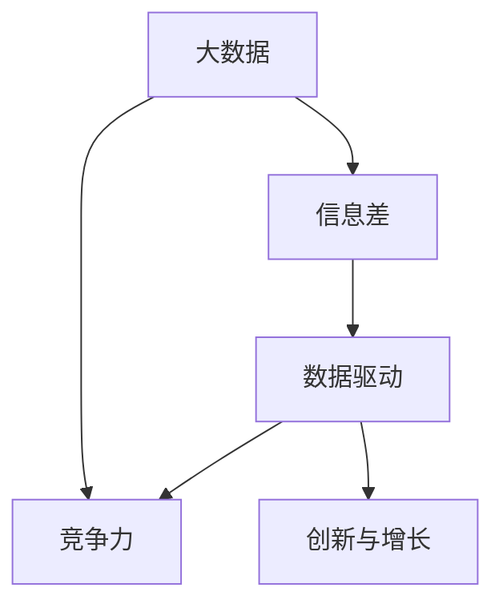

                 

# 信息差的竞争力之源：大数据驱动的创新与增长

> 关键词：大数据,信息差,竞争力,数据驱动,创新与增长

## 1. 背景介绍

在现代商业竞争中，信息差成为了竞争力的重要源泉。掌握更多的信息，意味着可以获得更多的市场机会和资源优势。特别是在互联网时代，信息获取和处理的速度变得尤为关键。数据驱动的大数据分析技术，成为信息差竞争力的重要工具。本文章将探讨大数据驱动的创新与增长，解析如何利用大数据技术获取和利用信息差，从而提升企业的竞争力。

## 2. 核心概念与联系

### 2.1 核心概念概述

1. **大数据(Big Data)**：指数量巨大、来源多样、种类繁多、速度极快的数据集合。大数据技术通过数据处理和分析，揭示数据背后的规律和洞察，帮助企业做出更科学的决策。

2. **信息差(Information Gap)**：指在信息获取和处理过程中，不同参与者之间存在的信息不对称。信息差的产生和利用，影响企业的决策质量和市场竞争力。

3. **竞争力(Competitiveness)**：企业通过有效的信息获取和利用，获得在市场竞争中的优势地位。信息驱动的决策、产品创新、市场策略等，都可以增强企业的竞争力。

4. **数据驱动(Data-Driven)**：指企业在决策和运营中，以数据为基础，利用数据分析和模型预测，进行科学决策和创新优化。数据驱动已经成为现代企业提升竞争力的重要方式。

5. **创新与增长(Innovation and Growth)**：企业在数据驱动的基础上，通过创新技术、产品和业务模式，实现业务的增长和发展。创新与增长是数据驱动的最终目标。

### 2.2 概念间的关系

大数据、信息差、竞争力、数据驱动和创新与增长之间的联系可以通过以下Mermaid流程图来展示：



该流程图展示了这些核心概念之间的联系：

1. 大数据是信息差产生的基础，通过分析大数据，企业可以发现市场机会和潜在风险。
2. 信息差是企业竞争力的关键，通过利用信息差，企业可以在市场中占据有利位置。
3. 数据驱动是竞争力提升的手段，通过科学的数据分析，企业可以做出更明智的决策。
4. 创新与增长是数据驱动的最终目标，企业通过数据驱动不断创新，实现业务的增长。

## 3. 核心算法原理 & 具体操作步骤
### 3.1 算法原理概述

大数据驱动的创新与增长，主要依赖于数据的收集、存储、处理和分析。其核心思想是通过对大数据的分析，揭示数据中的模式和趋势，从而指导企业决策和创新。具体来说，主要涉及以下几个步骤：

1. **数据收集**：通过各种数据源收集大量数据，包括客户行为数据、市场交易数据、社交媒体数据等。
2. **数据存储**：将收集到的数据存储在高效的数据仓库中，方便后续的数据处理和分析。
3. **数据处理**：对数据进行清洗、转换和整合，去除噪声和冗余，生成适合分析的数据集。
4. **数据分析**：利用统计学、机器学习等技术，对数据进行分析和建模，发现数据中的规律和趋势。
5. **决策优化**：根据分析结果，调整企业战略、产品设计和市场策略，实现优化决策。
6. **创新与增长**：基于数据驱动的决策，开发新产品、开拓新市场，实现业务的增长。

### 3.2 算法步骤详解

以下将详细介绍大数据驱动创新与增长的具体步骤：

**Step 1: 数据收集**
- 选择合适的数据源，如企业内部的CRM系统、社交媒体平台、电商平台等，收集相关数据。
- 设计合理的数据收集策略，确保数据的全面性和准确性。
- 利用爬虫、API等技术手段，自动化地从不同平台抓取数据。

**Step 2: 数据存储**
- 选择合适的数据存储方案，如Hadoop、NoSQL数据库等，将收集到的数据存储在高效、可扩展的数据仓库中。
- 设计合理的数据模型，确保数据的结构化和规范化，便于后续的数据处理和分析。
- 利用数据湖技术，统一管理企业内外部的数据资源，实现数据的集中存储和高效访问。

**Step 3: 数据处理**
- 对原始数据进行清洗和预处理，去除噪声和缺失值，生成适合分析的数据集。
- 利用数据转换技术，将数据转换为分析所需的格式，如数据规范化、特征提取等。
- 利用数据整合技术，将来自不同来源的数据进行合并和关联，生成完整的数据视图。

**Step 4: 数据分析**
- 选择合适的分析工具和方法，如Python、R、SQL、Hive等，对数据进行统计分析和建模。
- 利用机器学习技术，构建预测模型和推荐系统，揭示数据中的规律和趋势。
- 利用数据可视化工具，将分析结果以图表形式呈现，帮助企业直观理解数据。

**Step 5: 决策优化**
- 根据数据分析结果，调整企业的业务策略、产品设计和市场策略，实现优化决策。
- 利用A/B测试等方法，评估决策效果，优化决策模型。
- 定期回顾和更新数据驱动的决策，确保其适应市场变化。

**Step 6: 创新与增长**
- 根据数据驱动的决策，开发新产品、开拓新市场，实现业务的增长。
- 利用数据驱动的产品设计，提升产品和服务的质量，满足客户需求。
- 利用数据驱动的市场策略，提高市场响应速度，增强竞争优势。

### 3.3 算法优缺点

大数据驱动的创新与增长方法具有以下优点：
1. 数据驱动决策：通过科学的数据分析，企业可以做出更明智的决策，减少决策的盲目性和风险。
2. 提升创新能力：数据驱动的方法有助于发现市场机会和趋势，促进企业创新和业务发展。
3. 提高效率：大数据技术可以自动化地处理和分析大量数据，提高企业的运营效率。
4. 增强竞争力：通过数据驱动的决策和创新，企业可以在市场中占据有利位置，提升竞争力。

同时，该方法也存在以下缺点：
1. 数据质量和隐私问题：数据的准确性和隐私性是数据驱动方法的基础，数据质量差和隐私泄露会影响分析结果。
2. 技术复杂度：大数据技术和分析方法需要高水平的技术和人才支持，技术复杂度较高。
3. 数据集成难度：企业内部和外部的数据集成难度较大，需要综合考虑数据格式、标准和接口等因素。
4. 数据驱动的局限性：数据驱动的方法只能基于已知数据进行预测，无法覆盖所有未知情况和突发事件。

尽管存在这些局限性，但总体而言，大数据驱动的创新与增长方法在提升企业竞争力方面具有显著优势。企业应充分利用大数据技术和分析方法，实现业务创新和增长。

### 3.4 算法应用领域

大数据驱动的创新与增长方法，已经在各个行业得到了广泛应用，例如：

1. **零售行业**：通过分析消费者购买行为和市场趋势，实现精准营销和库存管理，提升客户满意度和运营效率。
2. **金融行业**：利用金融大数据分析市场变化和风险，优化投资决策和风险管理，提升资产配置和收益水平。
3. **医疗行业**：通过分析患者数据和医疗记录，发现疾病规律和诊疗模式，优化诊疗方案和提升医疗服务质量。
4. **制造行业**：利用物联网和大数据技术，实时监测设备运行状态和生产过程，实现智能化生产和质量控制。
5. **物流行业**：通过分析货物运输数据和物流路径，优化物流规划和运输调度，提高运输效率和降低成本。

## 4. 数学模型和公式 & 详细讲解  
### 4.1 数学模型构建

大数据驱动的创新与增长方法涉及多个数学模型和计算公式。以下将介绍几个关键模型的构建方法：

**回归分析模型**
- 假设自变量 $x$ 与因变量 $y$ 存在线性关系，回归分析模型为：
  $$
  y = \beta_0 + \beta_1 x_1 + \beta_2 x_2 + ... + \beta_n x_n + \epsilon
  $$
  其中 $\beta_i$ 为回归系数，$\epsilon$ 为误差项。

**预测模型**
- 假设已知训练集数据 $(x_i, y_i)$，构建预测模型 $y = f(x)$，其中 $f$ 为预测函数。
- 利用训练集数据，通过最小化损失函数 $L(y, \hat{y})$，求解最优参数 $\theta$。
- 常见的损失函数包括均方误差损失 $L = \frac{1}{N}\sum_{i=1}^N (y_i - \hat{y}_i)^2$。

**推荐系统**
- 假设用户 $u$ 对物品 $i$ 的评分 $r_{ui} = \theta_u^\top \phi_i + b$，其中 $\theta_u$ 为用户向量，$\phi_i$ 为物品向量，$b$ 为截距项。
- 利用协同过滤或矩阵分解等方法，求解用户和物品的向量表示。
- 通过预测评分 $r_{ui}$，推荐用户可能感兴趣的物品。

### 4.2 公式推导过程

以下将对回归分析模型和预测模型的公式推导过程进行详细讲解：

**回归分析模型推导**
- 假设自变量 $x = [x_1, x_2, ..., x_n]^\top$，因变量 $y$，回归模型为 $y = \beta_0 + \beta_1 x_1 + \beta_2 x_2 + ... + \beta_n x_n + \epsilon$。
- 最小化损失函数 $L = \frac{1}{N}\sum_{i=1}^N (y_i - \hat{y}_i)^2$，其中 $\hat{y}_i = \beta_0 + \beta_1 x_{i1} + \beta_2 x_{i2} + ... + \beta_n x_{in}$。
- 对 $\beta_0, \beta_1, ..., \beta_n$ 求偏导，得：
  $$
  \begin{cases}
  \frac{\partial L}{\partial \beta_0} = -2\frac{1}{N}\sum_{i=1}^N (y_i - \hat{y}_i) = 0 \\
  \frac{\partial L}{\partial \beta_j} = -2\frac{1}{N}\sum_{i=1}^N (y_i - \hat{y}_i)x_{ij} = 0 \\
  \end{cases}
  $$
- 解上述方程组，得回归系数 $\beta = [\beta_0, \beta_1, ..., \beta_n]^\top$。

**预测模型推导**
- 假设已知训练集数据 $(x_i, y_i)$，预测模型为 $y = f(x)$，其中 $f$ 为预测函数。
- 最小化损失函数 $L = \frac{1}{N}\sum_{i=1}^N (y_i - \hat{y}_i)^2$，其中 $\hat{y}_i = f(x_i)$。
- 对 $f(x)$ 求偏导，得：
  $$
  \frac{\partial L}{\partial f(x_i)} = -2\frac{1}{N}\sum_{i=1}^N (y_i - \hat{y}_i) = 0
  $$
- 解上述方程，得最优预测函数 $f(x) = \hat{y}$。

## 5. 项目实践：代码实例和详细解释说明
### 5.1 开发环境搭建

在开始大数据驱动的创新与增长实践之前，首先需要准备好开发环境。以下是使用Python进行数据分析和机器学习实践的环境配置流程：

1. 安装Anaconda：从官网下载并安装Anaconda，用于创建独立的Python环境。
2. 创建并激活虚拟环境：
```bash
conda create -n pydata-env python=3.8 
conda activate pydata-env
```
3. 安装必要的Python包：
```bash
conda install pandas numpy matplotlib scikit-learn seaborn statsmodels
```

完成上述步骤后，即可在`pydata-env`环境中开始数据分析和机器学习的实践。

### 5.2 源代码详细实现

以下以回归分析和预测模型为例，给出使用Python和Scikit-learn库进行数据分析和机器学习的代码实现。

首先，准备数据集：

```python
import pandas as pd
from sklearn.model_selection import train_test_split

# 加载数据集
data = pd.read_csv('data.csv')
# 划分训练集和测试集
train_data, test_data = train_test_split(data, test_size=0.2, random_state=42)
```

然后，定义模型和训练过程：

```python
from sklearn.linear_model import LinearRegression
from sklearn.metrics import mean_squared_error

# 定义模型
model = LinearRegression()

# 训练模型
model.fit(train_data[['x1', 'x2', 'x3']], train_data['y'])
```

接着，进行模型评估：

```python
# 预测测试集
test_predictions = model.predict(test_data[['x1', 'x2', 'x3']])

# 计算评估指标
mse = mean_squared_error(test_data['y'], test_predictions)
print(f'Mean Squared Error: {mse}')
```

最后，运行代码并输出结果：

```bash
conda activate pydata-env
python main.py
```

以上就是一个简单的回归分析和预测模型代码实例。通过该示例，可以直观地理解大数据驱动的创新与增长方法的具体实现。

### 5.3 代码解读与分析

下面我们对关键代码的实现细节进行解读：

**数据加载和处理**
- `pandas` 库用于读取和处理数据，方便数据的导入和预处理。
- `train_test_split` 方法用于将数据集划分为训练集和测试集，确保数据集的随机性和独立性。

**模型定义和训练**
- `LinearRegression` 类用于定义线性回归模型。
- `fit` 方法用于训练模型，根据训练集数据计算回归系数。

**模型评估**
- 使用测试集数据进行模型预测。
- `mean_squared_error` 函数用于计算均方误差，评估模型预测的准确性。

**运行结果展示**
- 输出均方误差，直观反映模型的预测误差。

## 6. 实际应用场景
### 6.1 零售行业

在大数据驱动的创新与增长方法中，零售行业是一个典型的应用场景。通过分析消费者购买行为和市场趋势，企业可以实现精准营销和库存管理，提升客户满意度和运营效率。

具体应用步骤如下：

1. **数据收集**：收集消费者购买数据、浏览数据、评价数据等，涵盖购买时间、地点、产品类别、价格等信息。
2. **数据存储和处理**：将数据存储在高效的数据仓库中，利用数据清洗和预处理技术，去除噪声和缺失值。
3. **数据分析**：利用回归分析、时间序列分析等方法，分析消费者行为和市场趋势，揭示购买规律和销售趋势。
4. **决策优化**：根据分析结果，优化库存管理、制定促销策略、提升客户体验。
5. **创新与增长**：基于数据驱动的决策，开发个性化推荐系统，拓展新市场和产品线，实现业务的增长。

### 6.2 金融行业

在金融行业，大数据驱动的创新与增长方法同样具有重要应用。通过分析市场数据、交易数据和客户数据，企业可以实现投资决策优化和风险管理。

具体应用步骤如下：

1. **数据收集**：收集市场行情数据、交易数据、客户资产数据、信用数据等，涵盖股票、债券、外汇等多种金融产品。
2. **数据存储和处理**：将数据存储在高效的数据仓库中，利用数据清洗和预处理技术，去除噪声和缺失值。
3. **数据分析**：利用回归分析、机器学习等方法，分析市场趋势和交易模式，揭示风险点和投资机会。
4. **决策优化**：根据分析结果，调整投资组合、优化资产配置、加强风险管理。
5. **创新与增长**：基于数据驱动的决策，开发智能投顾系统，提升客户满意度和投资回报率，实现业务的增长。

### 6.3 医疗行业

在医疗行业，大数据驱动的创新与增长方法可以用于疾病预测、诊疗优化和健康管理等方面。通过分析患者数据和医疗记录，企业可以提升医疗服务质量和效率。

具体应用步骤如下：

1. **数据收集**：收集患者病历数据、检验数据、药品数据等，涵盖患者的病史、症状、检查结果等信息。
2. **数据存储和处理**：将数据存储在高效的数据仓库中，利用数据清洗和预处理技术，去除噪声和缺失值。
3. **数据分析**：利用回归分析、聚类分析等方法，分析疾病规律和诊疗模式，揭示病种分布和疾病趋势。
4. **决策优化**：根据分析结果，优化诊疗方案、制定预防措施、提升健康管理。
5. **创新与增长**：基于数据驱动的决策，开发智能诊断系统，提供个性化诊疗建议，实现业务的增长。

## 7. 工具和资源推荐
### 7.1 学习资源推荐

为了帮助开发者系统掌握大数据驱动的创新与增长方法，这里推荐一些优质的学习资源：

1. **《Python数据科学手册》**：由Python数据科学社区推荐，全面介绍Python数据科学库和工具的使用，适合初学者入门。
2. **《机器学习实战》**：通过实战项目和代码实例，深入浅出地讲解机器学习算法的实现，适合实战型学习者。
3. **Kaggle**：提供丰富的数据集和竞赛平台，通过参与竞赛和项目实战，提升数据驱动的决策和创新能力。
4. **Coursera**：提供大数据和机器学习领域的在线课程，涵盖大数据技术、数据分析、机器学习等内容。
5. **Google Colab**：提供免费的GPU/TPU算力，方便开发者快速上手实验最新模型，分享学习笔记。

通过这些资源的学习实践，相信你一定能够掌握大数据驱动的创新与增长方法的精髓，并用于解决实际的业务问题。

### 7.2 开发工具推荐

高效的开发离不开优秀的工具支持。以下是几款用于大数据驱动的创新与增长开发的常用工具：

1. **Python**：简单易学、功能强大，是数据科学和机器学习领域的主流编程语言。
2. **Pandas**：提供数据处理和分析的强大工具，支持数据清洗、预处理和探索性分析。
3. **NumPy**：提供高效的数值计算和科学计算库，支持矩阵运算、线性代数和统计分析。
4. **Scikit-learn**：提供机器学习算法的实现，支持回归分析、分类、聚类等多种机器学习任务。
5. **TensorFlow**：提供深度学习框架，支持神经网络的构建、训练和推理。

合理利用这些工具，可以显著提升大数据驱动的创新与增长的开发效率，加快创新迭代的步伐。

### 7.3 相关论文推荐

大数据驱动的创新与增长方法的研究源于学界的持续探索。以下是几篇奠基性的相关论文，推荐阅读：

1. **《大数据时代：大数据与企业决策》**：介绍大数据在企业决策中的应用，揭示大数据对决策的影响和优化效果。
2. **《大数据与机器学习：数据驱动的创新实践》**：通过多个实际案例，展示大数据和机器学习如何推动企业创新和增长。
3. **《机器学习在金融领域的应用》**：探讨机器学习在金融领域的应用，提升金融决策的准确性和效率。
4. **《大数据与医疗保健：提高诊疗质量和效率》**：介绍大数据在医疗保健中的应用，提升医疗服务的质量和效率。
5. **《大数据驱动的零售创新：智能推荐与库存管理》**：通过多个实际案例，展示大数据如何驱动零售行业的创新和增长。

这些论文代表了大数据驱动的创新与增长技术的发展脉络。通过学习这些前沿成果，可以帮助研究者把握学科前进方向，激发更多的创新灵感。

除上述资源外，还有一些值得关注的前沿资源，帮助开发者紧跟大数据驱动的创新与增长技术的最新进展，例如：

1. **arXiv论文预印本**：人工智能领域最新研究成果的发布平台，包括大量尚未发表的前沿工作，学习前沿技术的必读资源。
2. **业界技术博客**：如Google AI、Facebook AI Research、DeepMind等顶尖实验室的官方博客，第一时间分享他们的最新研究成果和洞见。
3. **技术会议直播**：如KDD、ICML、SIGKDD等人工智能领域顶会现场或在线直播，能够聆听到大佬们的前沿分享，开拓视野。
4. **GitHub热门项目**：在GitHub上Star、Fork数最多的数据分析和机器学习相关项目，往往代表了该技术领域的发展趋势和最佳实践，值得去学习和贡献。
5. **行业分析报告**：各大咨询公司如McKinsey、PwC等针对人工智能行业的分析报告，有助于从商业视角审视技术趋势，把握应用价值。

总之，对于大数据驱动的创新与增长技术的学习和实践，需要开发者保持开放的心态和持续学习的意愿。多关注前沿资讯，多动手实践，多思考总结，必将收获满满的成长收益。

## 8. 总结：未来发展趋势与挑战
### 8.1 总结

本文对大数据驱动的创新与增长方法进行了全面系统的介绍。首先阐述了大数据驱动的创新与增长方法的研究背景和意义，明确了数据驱动创新与增长的重要性。其次，从原理到实践，详细讲解了大数据驱动创新与增长的数学模型和关键步骤，给出了具体的应用实例。同时，本文还广泛探讨了大数据驱动创新与增长方法在零售、金融、医疗等行业的具体应用，展示了其广阔的前景。最后，本文精选了相关学习资源，力求为读者提供全方位的技术指引。

通过本文的系统梳理，可以看到，大数据驱动的创新与增长方法正在成为企业决策和创新优化的重要手段。大数据技术通过揭示数据中的模式和趋势，帮助企业做出更明智的决策，实现业务的增长和发展。未来，伴随大数据技术和算力的不断提升，大数据驱动的创新与增长方法将更加普及，并不断拓展应用场景，助力企业迈向更加智能化和数字化的未来。

### 8.2 未来发展趋势

展望未来，大数据驱动的创新与增长方法将呈现以下几个发展趋势：

1. **数据融合和协同分析**：数据融合技术将进一步发展，企业可以实现跨部门、跨领域的协同分析，挖掘更多业务价值。
2. **实时数据分析和预测**：实时数据分析和预测技术将变得更加成熟，企业可以实时获取市场动态和客户行为，快速做出响应。
3. **自动化和智能化**：自动化和智能化的数据分析工具将不断涌现，降低数据处理的技术门槛，提升企业的决策效率。
4. **数据隐私和安全**：数据隐私和安全问题将受到更多关注，数据驱动的创新与增长方法需要考虑数据隐私和安全保护。
5. **多模态数据融合**：多模态数据的融合技术将进一步发展，企业可以同时利用文本、图像、视频等多种数据，提升数据分析的深度和广度。

### 8.3 面临的挑战

尽管大数据驱动的创新与增长方法已经取得了显著成就，但在实现其广泛应用的过程中，仍面临以下挑战：

1. **数据质量问题**：数据的质量直接影响分析结果的准确性，数据清洗和预处理的技术瓶颈仍需进一步突破。
2. **数据隐私和安全**：企业需要平衡数据使用的便利性和隐私保护的需求，确保数据使用的合法性和安全性。
3. **数据存储和处理**：大数据的存储和处理需要高效的存储方案和处理技术，以应对数据量的急剧增长。
4. **数据驱动的决策风险**：数据驱动的决策存在模型过拟合和误差累积的风险，企业需要建立科学的决策机制和风险控制机制。
5. **数据驱动的创新成本**：数据驱动的创新需要大量的数据和计算资源，对于中小企业和传统行业而言，成本较高。

### 8.4 未来突破

面对大数据驱动的创新与增长方法面临的挑战，未来的研究需要在以下几个方面寻求新的突破：

1. **数据质量和隐私保护**：通过数据清洗和预处理技术，提升数据质量；利用差分隐私等技术，保护数据隐私。
2. **实时数据处理**：发展实时数据分析和处理技术，提升数据驱动的决策速度和响应速度。
3. **多模态数据融合**：研发多模态数据融合技术，提升数据驱动分析的深度和广度。
4. **决策风险管理**：建立科学的决策机制和风险控制机制，降低数据驱动的决策风险。
5. **普适化应用**：研究如何降低大数据驱动的创新成本，使其适用于更多中小企业和传统行业。

这些研究方向的探索，必将引领大数据驱动的创新与增长技术迈向更高的台阶，为企业的决策和创新提供更有力的支持。

## 9. 附录：常见问题与解答

**Q1：如何选择合适的数据源？**

A: 选择数据源时，需要考虑数据的质量、完整性、时效性和可用性。企业内部系统如CRM、ERP等往往包含大量业务数据，适合进行初步分析。外部数据源如社交媒体、电商平台等，可以补充企业内部数据的不足。综合利用内外部的数据源，可以更全面地了解市场和客户需求。

**Q2：如何处理数据清洗和预处理？**

A: 数据清洗和预处理是大数据分析的基础，以下是一些常用的方法：
1. 去除噪声和缺失值，利用数据插补、删除或替换等方法。
2. 数据规范化，将不同格式的数据转换为统一的格式，便于后续分析。
3. 特征提取，通过特征选择和工程，提取有用的特征，提升分析效果。

**Q3：如何选择适合的数据分析模型？**

A: 选择数据分析模型时，需要考虑数据类型、分析目的

