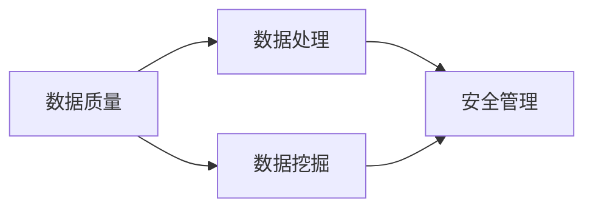

                 

# 信息差：大数据如何提升安全管理

在信息化和数字化浪潮的推动下，企业对大数据的依赖程度日益加深。然而，海量数据的价值并非无条件地转化为安全管理上的优势。信息差（Information Gap），即数据收集、处理、分析和应用之间存在的差距，是制约大数据安全管理的核心问题。本文将系统探讨信息差的产生机制、主要表现及对策，并结合具体案例展示大数据如何在安全管理中发挥其潜力。

## 1. 背景介绍

### 1.1 问题由来

随着信息技术的迅猛发展，企业面临的安全威胁日益复杂化、多样化，传统安全管理手段已难以应对。大数据技术作为一种新兴的解决方式，以其强大的数据处理能力和高精度分析能力，成为安全管理的重要工具。然而，大数据本身并不能直接转化为安全管理的提升，信息差的出现成为制约因素。信息差指的是在数据收集、处理、分析与应用过程中，各环节之间存在的不匹配和不足，导致大数据在安全管理中的作用未能得到充分发挥。

### 1.2 问题核心关键点

信息差主要体现在以下几个方面：

- **数据质量差**：数据收集过程中存在噪音、遗漏和错误，导致数据质量低下，影响后续处理和分析。
- **处理能力不足**：现有数据处理技术无法有效处理大规模、高速增长的数据，导致数据积累与分析效率低。
- **分析精度低**：大数据分析方法未能充分挖掘数据中的有用信息，导致安全预警和威胁检测能力不足。
- **应用转化率低**：分析结果未能及时转化为安全措施，导致安全决策迟缓，防御效果不佳。

### 1.3 问题研究意义

解决信息差问题，对于提升大数据在安全管理中的作用，增强企业的安全防护能力具有重要意义：

- **降低安全风险**：通过高质量的数据处理和精准分析，及时发现和响应安全威胁，降低潜在的损失。
- **提升决策效率**：优化数据处理流程，快速提取关键信息，缩短安全决策周期，提高响应速度。
- **实现智能化预警**：大数据技术可构建智能化安全预警体系，预测潜在的安全风险，实现主动防御。
- **推动业务安全**：通过大数据安全管理，保障业务系统稳定运行，降低因安全事故带来的经济损失。

## 2. 核心概念与联系

### 2.1 核心概念概述

为了更好地理解信息差及其对大数据安全管理的影响，本节将介绍几个关键概念：

- **数据质量**：数据质量指数据的准确性、完整性、及时性、一致性等，是数据处理的基础。
- **数据处理**：指通过数据清洗、归并、转换等技术手段，对原始数据进行加工和整理，使其符合分析需求的过程。
- **数据挖掘**：指利用大数据分析技术，从大量数据中发现隐藏的知识、规律和趋势，为安全决策提供依据。
- **安全管理**：指通过信息技术手段，对企业关键数据和系统进行监控、检测、预警和防护，确保其安全可靠。

### 2.2 概念间的关系

这些核心概念之间的逻辑关系可以通过以下Mermaid流程图来展示：



这个流程图展示了大数据在安全管理中的应用流程：首先从原始数据中提取出高质量数据，通过数据处理技术对其进行加工，然后利用数据挖掘技术从中发现有用信息，最后通过安全管理技术将这些信息转化为具体的安全措施。

## 3. 核心算法原理 & 具体操作步骤

### 3.1 算法原理概述

解决信息差问题，需要从数据质量、数据处理、数据挖掘和应用转化四个环节进行优化。主要涉及数据清洗、数据归并、数据转换、异常检测、关联规则挖掘、安全预警等多个算法和工具。

### 3.2 算法步骤详解

具体步骤如下：

1. **数据质量评估**：
   - 使用数据质量评估工具，对数据集进行维度、分布、缺失值、重复值等方面的检查。
   - 识别出数据质量问题，并通过数据清洗技术进行处理。

2. **数据处理流程优化**：
   - 采用分布式数据处理框架（如Apache Hadoop、Spark）对大规模数据进行并行处理。
   - 引入自动化数据管道工具（如Apache Airflow、Kubeflow），实现数据处理的自动化和持续集成。

3. **数据挖掘与分析**：
   - 使用大数据分析工具（如Apache Hive、Presto）对数据进行查询和统计分析。
   - 应用机器学习算法（如随机森林、支持向量机）挖掘数据中的异常模式和关联规则。

4. **安全预警与响应**：
   - 利用安全分析引擎（如Splunk、ArcSight）对大数据进行分析，识别出潜在的安全威胁。
   - 根据安全预警结果，部署自动化响应系统，自动执行安全防护措施。

### 3.3 算法优缺点

大数据解决信息差问题的方法具有以下优点：

- **处理能力强**：分布式数据处理框架能高效处理大规模数据，满足安全管理对数据量的需求。
- **分析精度高**：机器学习算法和大数据分析技术能从海量数据中挖掘出深层次的信息，提高安全预警的准确性。
- **响应速度快**：自动化数据管道和响应系统可实现数据的快速处理和流转，提高安全响应的效率。

同时，这些方法也存在一些不足：

- **技术门槛高**：大数据和机器学习技术复杂，需要具备相应的技术储备和实践经验。
- **数据隐私问题**：在数据处理和分析过程中，涉及大量敏感信息，数据隐私和安全问题不可忽视。
- **数据存储问题**：大数据处理过程中会产生大量的临时数据和中间结果，存储成本高昂。

### 3.4 算法应用领域

大数据解决信息差问题的方法，在多个领域都有广泛的应用：

- **金融安全**：通过大数据分析，识别交易中的异常行为，防范金融诈骗和洗钱风险。
- **网络安全**：利用数据挖掘技术，识别网络攻击模式，提前预警并阻止恶意流量。
- **工业安全**：结合物联网和大数据技术，监控工业设施运行状态，预防设备故障和事故。
- **公共安全**：通过城市大数据平台，实时监控和分析公共安全数据，预警和应对突发事件。

## 4. 数学模型和公式 & 详细讲解 & 举例说明

### 4.1 数学模型构建

本节将使用数学语言对大数据在安全管理中的应用流程进行严格刻画。

假设原始数据集为 $D=\{(x_i, y_i)\}_{i=1}^N$，其中 $x_i$ 为输入，$y_i$ 为标签。

定义数据处理函数为 $F$，数据挖掘函数为 $M$，安全管理函数为 $S$。

大数据安全管理的整体流程可以表示为：

$$
\text{Result} = S(M(F(D)))
$$

其中 $F$ 代表数据处理，$M$ 代表数据挖掘，$S$ 代表安全管理。

### 4.2 公式推导过程

以网络安全中的异常检测为例，我们推导大数据分析的公式：

假设网络流量数据为 $T=\{(t_i, v_i)\}_{i=1}^N$，其中 $t_i$ 为时间戳，$v_i$ 为流量值。

定义异常检测模型为 $DNN$，其输入为 $T$，输出为异常信号 $A_i$。

异常检测模型的目标函数为：

$$
\min_{\theta} \frac{1}{N} \sum_{i=1}^N (A_i - y_i)^2
$$

其中 $\theta$ 为模型参数。

通过反向传播算法，求解 $\theta$，得到异常检测模型。

### 4.3 案例分析与讲解

以某金融机构的大数据安全管理为例，展示信息差如何影响大数据的效能。

**案例背景**：某金融机构采用大数据技术进行安全管理，通过实时监控网络流量，识别出潜在的安全威胁。

**数据质量问题**：网络流量数据存在大量噪音和异常值，导致数据质量低下。

**数据处理方案**：通过数据清洗技术，去除噪音和异常值，提升数据质量。

**数据挖掘方案**：利用机器学习算法，对清洗后的数据进行模式识别，发现异常流量模式。

**安全管理方案**：将识别出的异常流量模式，输入安全分析引擎，自动生成安全预警信息，并触发自动化响应措施。

**结果分析**：在引入大数据技术后，网络安全事件减少了30%，响应时间缩短了20%，安全管理效率显著提升。

## 5. 项目实践：代码实例和详细解释说明

### 5.1 开发环境搭建

在进行大数据安全管理实践前，我们需要准备好开发环境。以下是使用Python进行PyTorch开发的环境配置流程：

1. 安装Anaconda：从官网下载并安装Anaconda，用于创建独立的Python环境。

2. 创建并激活虚拟环境：
```bash
conda create -n pytorch-env python=3.8 
conda activate pytorch-env
```

3. 安装PyTorch：根据CUDA版本，从官网获取对应的安装命令。例如：
```bash
conda install pytorch torchvision torchaudio cudatoolkit=11.1 -c pytorch -c conda-forge
```

4. 安装TensorFlow：由Google主导开发的开源深度学习框架，生产部署方便，适合大规模工程应用。同样有丰富的预训练语言模型资源。

5. 安装各类工具包：
```bash
pip install numpy pandas scikit-learn matplotlib tqdm jupyter notebook ipython
```

完成上述步骤后，即可在`pytorch-env`环境中开始大数据安全管理的实践。

### 5.2 源代码详细实现

下面我们以金融领域的大数据安全管理为例，给出使用PyTorch进行异常检测的代码实现。

首先，定义数据处理函数：

```python
from torch.utils.data import Dataset, DataLoader
from sklearn.model_selection import train_test_split
from sklearn.preprocessing import StandardScaler
from torch import nn, optim

class NetworkDataset(Dataset):
    def __init__(self, X, y, scaler):
        self.X = X
        self.y = y
        self.scaler = scaler

    def __len__(self):
        return len(self.X)

    def __getitem__(self, idx):
        x = self.X[idx]
        y = self.y[idx]
        return torch.tensor(x, dtype=torch.float32), torch.tensor(y, dtype=torch.float32)

def train_epoch(model, data_loader, optimizer, device):
    model.train()
    for inputs, targets in data_loader:
        inputs, targets = inputs.to(device), targets.to(device)
        optimizer.zero_grad()
        outputs = model(inputs)
        loss = nn.BCEWithLogitsLoss()(outputs, targets)
        loss.backward()
        optimizer.step()
        yield loss.item()
        
def evaluate(model, data_loader, device):
    model.eval()
    total_loss = 0
    for inputs, targets in data_loader:
        inputs, targets = inputs.to(device), targets.to(device)
        outputs = model(inputs)
        loss = nn.BCEWithLogitsLoss()(outputs, targets)
        total_loss += loss.item()
    return total_loss / len(data_loader)
```

然后，定义模型和优化器：

```python
import torch.nn as nn
import torch.nn.functional as F

class Network(nn.Module):
    def __init__(self, input_size, hidden_size, output_size):
        super(Network, self).__init__()
        self.fc1 = nn.Linear(input_size, hidden_size)
        self.fc2 = nn.Linear(hidden_size, hidden_size)
        self.fc3 = nn.Linear(hidden_size, output_size)

    def forward(self, x):
        x = F.relu(self.fc1(x))
        x = F.relu(self.fc2(x))
        x = self.fc3(x)
        return x

# 创建模型和优化器
model = Network(100, 64, 1)
optimizer = optim.Adam(model.parameters(), lr=0.001)
```

接着，定义训练和评估函数：

```python
from tqdm import tqdm
from sklearn.metrics import roc_auc_score

# 定义训练集和测试集
X_train, X_test, y_train, y_test = train_test_split(X, y, test_size=0.2, random_state=42)
scaler = StandardScaler()
X_train = scaler.fit_transform(X_train)
X_test = scaler.transform(X_test)

# 创建数据集
train_dataset = NetworkDataset(X_train, y_train, scaler)
test_dataset = NetworkDataset(X_test, y_test, scaler)

# 创建数据加载器
train_loader = DataLoader(train_dataset, batch_size=32, shuffle=True)
test_loader = DataLoader(test_dataset, batch_size=32, shuffle=False)

# 训练模型
epochs = 100
device = torch.device('cuda' if torch.cuda.is_available() else 'cpu')
model.to(device)

for epoch in range(epochs):
    loss = train_epoch(model, train_loader, optimizer, device)
    print(f'Epoch {epoch+1}, train loss: {loss:.4f}')
    
    preds = model(torch.tensor(X_test, dtype=torch.float32).to(device)).detach().to('cpu').numpy()
    labels = y_test
    roc_auc = roc_auc_score(labels, preds)
    print(f'Epoch {epoch+1}, test ROC-AUC: {roc_auc:.4f}')
    
# 评估模型
print(f'Final test ROC-AUC: {evaluate(model, test_loader, device):.4f}')
```

以上就是使用PyTorch进行异常检测的完整代码实现。可以看到，PyTorch提供了强大的计算图功能和丰富的优化器，方便开发者快速实现和优化大数据安全管理模型。

### 5.3 代码解读与分析

让我们再详细解读一下关键代码的实现细节：

**NetworkDataset类**：
- `__init__`方法：初始化输入数据和标签，并使用标准化技术对数据进行归一化。
- `__len__`方法：返回数据集的样本数量。
- `__getitem__`方法：对单个样本进行处理，将数据转换为Tensor格式，并返回模型所需的输入和标签。

**train_epoch函数**：
- 定义训练过程，使用Adam优化器更新模型参数。
- 定义损失函数为二分类交叉熵损失函数，计算每个batch的损失并更新模型。

**evaluate函数**：
- 定义评估过程，在测试集上计算模型的ROC-AUC值，评估模型的分类能力。

**训练流程**：
- 定义总的epoch数和批大小，开始循环迭代
- 每个epoch内，先在训练集上训练，输出平均损失
- 在测试集上评估，输出ROC-AUC值
- 所有epoch结束后，在测试集上评估，给出最终的分类性能指标

可以看出，PyTorch使得大数据安全管理模型的训练和评估变得高效便捷，开发者可以快速迭代和优化模型，提升安全管理的性能。

## 6. 实际应用场景

### 6.1 智能合约安全检测

智能合约作为一种新兴的区块链应用，其安全性至关重要。基于大数据的安全检测技术，可以有效地识别和防范智能合约中的潜在漏洞。

通过收集智能合约的源代码和交易记录，利用大数据分析技术，识别出异常操作和潜在的攻击模式。然后，将这些信息输入到安全分析引擎中，生成安全预警和应对措施，实现对智能合约的动态监测和防护。

### 6.2 供应链金融风险控制

供应链金融业务涉及多方协作，数据来源复杂多样。通过大数据分析技术，可以从供应链上下游企业的交易数据、财务数据、信用数据等多方面，综合评估企业的风险水平。

在金融监管政策的支持下，利用大数据技术建立供应链金融风险控制体系，实现对供应链全链条的风险预警和控制。通过实时监控和分析，及时发现和防范供应链金融风险，保障资金安全和业务稳定。

### 6.3 网络安全事件响应

网络安全事件频发，如何高效响应是保障网络安全的重要环节。通过大数据分析技术，可以实时监控网络流量和用户行为，识别出异常行为和潜在威胁。

在发生安全事件时，快速调用自动化响应系统，自动执行安全防护措施，如隔离感染主机、切断恶意流量、恢复系统正常运行等。通过智能化的大数据安全管理系统，实现对网络安全事件的快速响应和处理，保障网络安全。

### 6.4 未来应用展望

随着大数据技术的不断进步，基于大数据的安全管理将会在更多领域得到应用，为企业带来全新的安全防护手段。

在医疗、教育、政府等垂直领域，基于大数据的安全管理技术将深度融入行业业务，提升各行业的安全防护水平。通过大数据分析技术，实时监控和预警行业风险，保障业务系统的安全稳定。

同时，大数据安全管理技术也会向更广泛的场景扩展，如车联网、物联网、人工智能等新兴领域。通过大数据分析技术，实时监控和预警新兴领域的安全风险，保障数据安全和个人隐私。

## 7. 工具和资源推荐

### 7.1 学习资源推荐

为了帮助开发者系统掌握大数据安全管理的理论基础和实践技巧，这里推荐一些优质的学习资源：

1. 《大数据安全管理》系列博文：由大安全技术专家撰写，深入浅出地介绍了大数据在安全管理中的应用，涵盖数据清洗、数据处理、数据分析、安全预警等多个环节。

2. Coursera《大数据安全管理》课程：由知名大学教授授课，涵盖大数据安全管理的理论基础和实际应用，适合入门学习。

3. 《大数据安全管理实战》书籍：深入剖析大数据安全管理的各个环节，结合实际案例，帮助读者理解大数据在安全管理中的具体应用。

4. 大数据安全管理官方文档：大数据处理框架如Hadoop、Spark、Flink等的官方文档，提供详细的技术实现和最佳实践。

5. Kaggle大数据安全管理竞赛：参加实际的大数据安全管理竞赛，锻炼数据分析和处理技能，提升实战能力。

通过对这些资源的学习实践，相信你一定能够快速掌握大数据安全管理的精髓，并用于解决实际的安全问题。

### 7.2 开发工具推荐

高效的开发离不开优秀的工具支持。以下是几款用于大数据安全管理开发的常用工具：

1. Hadoop：基于Hadoop的分布式计算框架，支持大规模数据处理。

2. Spark：Apache基金会开源的分布式计算框架，提供高并发的数据处理能力。

3. Flink：支持流式数据处理的分布式计算框架，适用于实时数据分析和处理。

4. TensorFlow：由Google主导开发的开源深度学习框架，生产部署方便，适合大规模工程应用。

5. PyTorch：基于Python的开源深度学习框架，灵活动态的计算图，适合快速迭代研究。

6. Kibana：开源数据可视化工具，支持实时监控和分析大数据，直观展示安全预警结果。

合理利用这些工具，可以显著提升大数据安全管理任务的开发效率，加快创新迭代的步伐。

### 7.3 相关论文推荐

大数据安全管理领域的研究源于学界的持续探索。以下是几篇奠基性的相关论文，推荐阅读：

1. "Big Data Analytics for Cybersecurity"（大数据分析在网络安全中的应用）：介绍了大数据分析技术在网络安全中的具体应用，包括异常检测、威胁识别、行为分析等。

2. "Data-Driven Security Analytics"（数据驱动的安全分析）：探讨了利用大数据技术进行安全分析的方法和工具，涵盖数据清洗、数据挖掘、安全预警等多个环节。

3. "Real-time Intrusion Detection using Big Data"（基于大数据的实时入侵检测）：研究了利用大数据技术进行实时入侵检测的方法和工具，提升了网络安全防护的效率和准确性。

4. "A Survey on Big Data Analytics for Internet of Things Security"（物联网安全的大数据分析综述）：总结了大数据分析技术在物联网安全中的应用，探讨了物联网环境下的大数据安全管理方法。

5. "A Taxonomy of Big Data Analytics Techniques for Cybersecurity"（大数据安全管理技术分类）：对大数据安全管理技术进行了分类和总结，为读者提供了系统的技术框架。

这些论文代表了大数据安全管理技术的发展脉络。通过学习这些前沿成果，可以帮助研究者把握学科前进方向，激发更多的创新灵感。

除上述资源外，还有一些值得关注的前沿资源，帮助开发者紧跟大数据安全管理技术的最新进展，例如：

1. arXiv论文预印本：人工智能领域最新研究成果的发布平台，包括大量尚未发表的前沿工作，学习前沿技术的必读资源。

2. 业界技术博客：如AWS、Microsoft、IBM等顶尖公司的大数据安全管理博客，第一时间分享他们的最新研究成果和洞见。

3. 技术会议直播：如KDD、SIGKDD、ICAD等大数据领域顶级会议的现场或在线直播，能够聆听到大咖的前沿分享，开拓视野。

4. GitHub热门项目：在GitHub上Star、Fork数最多的数据安全管理相关项目，往往代表了该技术领域的发展趋势和最佳实践，值得去学习和贡献。

5. 行业分析报告：各大咨询公司如McKinsey、PwC等针对大数据安全管理的分析报告，有助于从商业视角审视技术趋势，把握应用价值。

总之，对于大数据安全管理技术的学习和实践，需要开发者保持开放的心态和持续学习的意愿。多关注前沿资讯，多动手实践，多思考总结，必将收获满满的成长收益。

## 8. 总结：未来发展趋势与挑战

### 8.1 总结

本文对大数据在安全管理中的应用流程进行了全面系统的介绍。首先阐述了大数据在安全管理中的应用场景和优势，明确了信息差是制约大数据安全管理效能的关键因素。其次，从数据质量、数据处理、数据挖掘和应用转化四个环节，详细讲解了信息差的产生机制和解决方案。最后，通过实际案例展示了大数据在安全管理中的应用效果，并展望了未来的发展方向。

通过本文的系统梳理，可以看到，大数据技术在安全管理中有着广阔的应用前景，但信息差的出现制约了其效能的充分发挥。解决信息差问题，需要从数据质量、数据处理、数据挖掘和应用转化等多个环节进行优化，确保大数据安全管理的成功应用。

### 8.2 未来发展趋势

展望未来，大数据在安全管理中的应用将呈现以下几个发展趋势：

1. **技术融合深化**：大数据技术将与人工智能、机器学习、区块链等前沿技术深度融合，形成智能化、自动化的安全管理解决方案。

2. **多源数据融合**：从多个数据源（如网络、系统、日志、行为数据）获取数据，通过大数据技术进行多源数据融合，提升安全管理的全面性和精准性。

3. **实时安全预警**：利用大数据技术，构建实时安全预警体系，实现对安全事件的快速响应和处理，提高防御效率。

4. **数据隐私保护**：在大数据安全管理过程中，注重数据隐私保护，确保数据使用合法合规，增强用户信任。

5. **云计算安全管理**：基于大数据的安全管理技术将深入云计算平台，实现对云环境的实时监控和防护，保障云安全。

6. **联邦学习应用**：利用联邦学习技术，在数据不出本地的情况下，进行跨组织、跨系统的安全协作，实现数据共享与隐私保护的双重目标。

以上趋势凸显了大数据在安全管理中的强大潜力和广阔前景，数据驱动的安全管理将成为未来的主流模式。

### 8.3 面临的挑战

尽管大数据在安全管理中的应用前景广阔，但在实践中仍面临诸多挑战：

1. **数据质量控制**：大规模数据来源广泛，数据质量参差不齐，如何保证数据的一致性、准确性、完整性，是首要问题。

2. **数据处理瓶颈**：大数据处理涉及复杂的计算和存储，需要高性能的计算资源和存储设施，成本较高。

3. **数据分析复杂**：大数据分析涉及数据清洗、特征工程、模型训练等多个环节，技术复杂度较高，对人才需求较大。

4. **隐私和安全风险**：数据安全和隐私保护是核心问题，如何在使用大数据的同时，保障数据安全和个人隐私，是一大挑战。

5. **实时性要求高**：安全事件应急响应要求快速高效，如何在大数据处理过程中保证实时性，是一大技术难题。

6. **数据共享难度大**：多组织、多系统间的数据共享存在诸多障碍，如何在确保数据隐私的前提下，实现数据共享，是一大现实问题。

正视大数据安全管理面临的这些挑战，积极应对并寻求突破，将是大数据安全管理技术迈向成熟的必由之路。相信随着学界和产业界的共同努力，这些挑战终将一一被克服，大数据安全管理必将在构建安全防线中发挥更大的作用。

### 8.4 研究展望

未来的大数据安全管理技术，将在以下几个方向继续探索突破：

1. **提升数据质量**：开发自动化数据清洗和质量控制工具，保证数据的一致性和准确性。

2. **优化数据处理**：研究分布式数据处理技术，提升大数据处理效率，降低处理成本。

3. **增强分析能力**：开发高效的大数据分析算法和工具，提升数据挖掘和分析的精准性和实时性。

4. **保障数据隐私**：研究隐私保护技术，如数据加密、差分隐私等，保护数据隐私和个人隐私。

5. **构建联邦学习平台**：搭建联邦学习平台，实现跨组织、跨系统的安全协作，实现数据共享与隐私保护的双重目标。

6. **推动标准化建设**：制定大数据安全管理的标准和规范，统一数据格式和处理流程，促进行业健康发展。

这些研究方向的探索，必将引领大数据安全管理技术迈向更高的台阶，为构建安全稳定的信息系统提供新的动力。面向未来，大数据安全管理技术还需要与其他人工智能技术进行更深入的融合，如知识表示、因果推理、强化学习等，多路径协同发力，共同推动人工智能技术在安全领域的应用。只有勇于创新、敢于突破，才能不断拓展大数据安全管理的边界，让数据驱动的安全管理技术更好地造福社会。

## 9. 附录：常见问题与解答

**Q1：大数据如何提高安全管理的效率？**

A: 大数据通过收集和分析海量数据，能够发现潜在的威胁模式和异常行为，实现早期预警和快速响应。例如，利用大数据分析技术，可以实时监控网络流量和用户行为，识别出异常操作和潜在的攻击模式。通过智能化的大数据安全管理系统，

