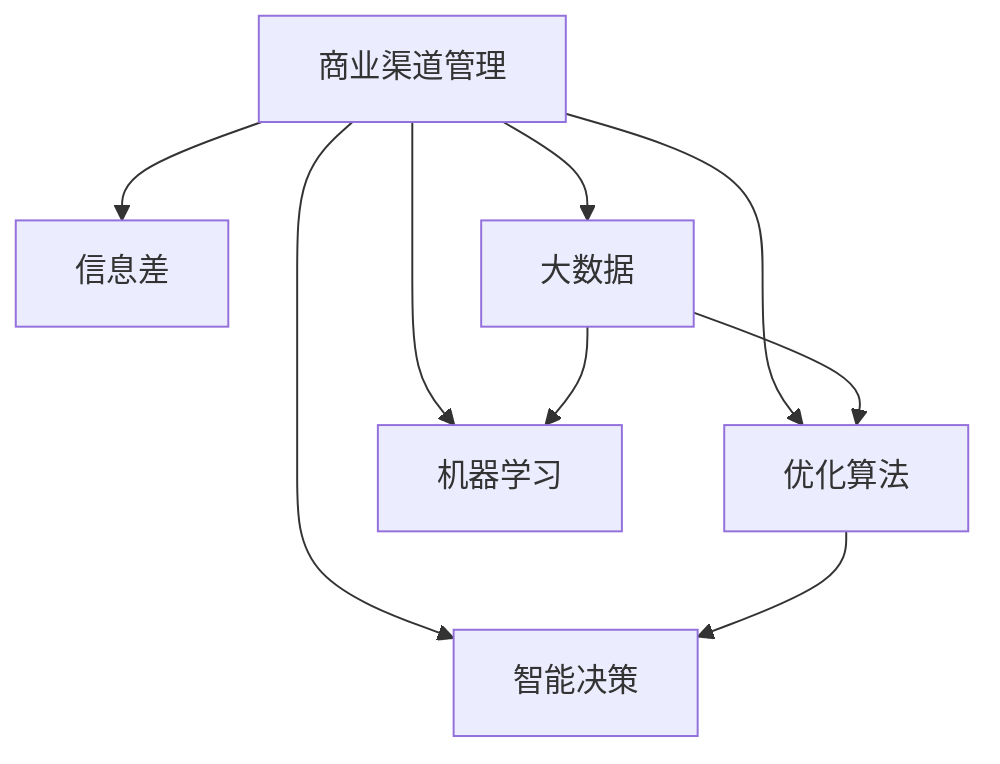
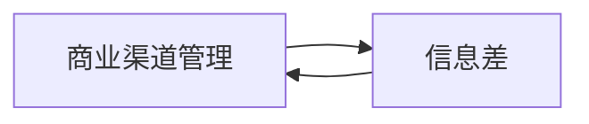
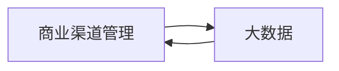
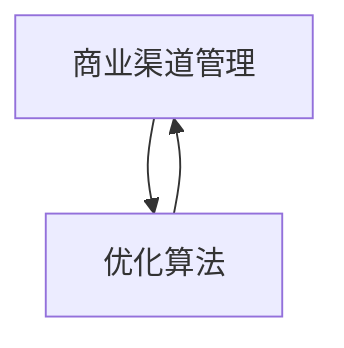
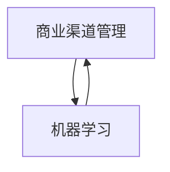
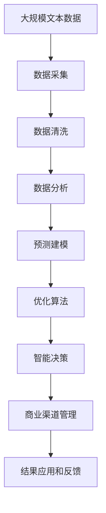

                 

# 信息差的商业渠道管理：大数据如何优化渠道管理

> 关键词：信息差, 商业渠道管理, 大数据, 优化, 数据分析, 智能决策

## 1. 背景介绍

### 1.1 问题由来

在当前竞争激烈的商业环境中，信息差（Information Gap）是影响企业渠道管理效率和效果的关键因素。信息差指的是市场供需双方在信息获取、处理和利用上的不对称。这种信息不对称不仅增加了企业的运营成本，降低了渠道效率，还可能导致资源浪费和市场机会的错失。因此，如何在有限的资源条件下，通过有效的方式获取和利用信息，成为企业渠道管理中亟需解决的问题。

### 1.2 问题核心关键点

解决信息差问题，企业需要对渠道数据进行全面、深入的分析和挖掘，从中提炼出有价值的洞察和建议。具体来说，需要从以下几个关键点入手：

1. **数据采集**：收集渠道的各类数据，包括但不限于销售数据、库存数据、客户反馈、市场调研结果等。
2. **数据清洗和预处理**：对收集的数据进行清洗、去重、标准化处理，确保数据的质量和一致性。
3. **数据分析和建模**：利用统计分析、机器学习等方法，对数据进行深入挖掘和分析，建立预测模型和优化算法。
4. **结果应用和反馈**：将分析结果转化为具体的业务决策和优化策略，同时根据实施效果进行反馈调整。

### 1.3 问题研究意义

解决信息差问题，优化商业渠道管理，对于提高企业运营效率、降低成本、提升市场竞争力具有重要意义。具体来说，可以带来以下几个方面的提升：

1. **提高渠道效率**：通过精准的数据分析和预测，企业可以更有效地分配资源，优化渠道布局，提高渠道效率。
2. **降低运营成本**：减少因信息不对称导致的错误决策和资源浪费，降低企业的运营成本。
3. **增强市场响应速度**：通过实时数据分析，企业可以更快地响应市场变化，抓住市场机会。
4. **提升客户满意度**：通过深入了解客户需求和反馈，企业可以提供更符合客户期望的产品和服务，提升客户满意度。
5. **支持智能决策**：基于大数据分析的洞察和建议，企业可以做出更加科学和智能的渠道决策。

## 2. 核心概念与联系

### 2.1 核心概念概述

为了更好地理解如何通过大数据优化商业渠道管理，本节将介绍几个核心概念及其之间的联系：

- **商业渠道管理（Business Channel Management）**：指企业通过计划、执行、监控和优化渠道活动，以实现销售目标和提升客户体验的过程。
- **信息差（Information Gap）**：指市场供需双方在信息获取、处理和利用上的不对称，表现为信息不完全、不及时、不对称等。
- **大数据（Big Data）**：指通过非传统手段收集和分析的海量数据集，包含结构化数据、半结构化数据和非结构化数据。
- **优化算法（Optimization Algorithm）**：指在给定约束条件下，通过数学或计算方法寻找问题的最优解或近似解的过程。
- **机器学习（Machine Learning）**：指通过数据和模型训练，使计算机具备从数据中学习并做出预测或决策的能力。
- **智能决策（Smart Decision Making）**：指利用先进技术和方法，在复杂环境中做出高效、准确、及时的决策过程。

这些核心概念之间的逻辑关系可以通过以下Mermaid流程图来展示：



这个流程图展示了商业渠道管理与信息差、大数据、优化算法、机器学习和智能决策之间的联系：

1. **商业渠道管理** 需要通过解决**信息差**问题来优化渠道效率。
2. **大数据** 提供了丰富的数据来源，是解决**信息差**问题的关键工具。
3. **优化算法** 和 **机器学习** 技术可以分析大数据，提供**智能决策**的支持。

### 2.2 概念间的关系

这些核心概念之间存在着紧密的联系，形成了商业渠道管理的完整生态系统。下面我们通过几个Mermaid流程图来展示这些概念之间的关系。

#### 2.2.1 商业渠道管理与信息差的关系



这个流程图展示了商业渠道管理如何通过解决信息差问题来提升效率。

#### 2.2.2 大数据与商业渠道管理的关系



这个流程图展示了大数据如何支持商业渠道管理的数据需求。

#### 2.2.3 优化算法与商业渠道管理的关系



这个流程图展示了优化算法如何帮助商业渠道管理实现目标优化。

#### 2.2.4 机器学习与商业渠道管理的关系



这个流程图展示了机器学习如何通过大数据分析来支持商业渠道管理的决策过程。

#### 2.2.5 智能决策与商业渠道管理的关系


这个流程图展示了智能决策如何通过数据驱动的分析和优化来提升商业渠道管理的效率。

### 2.3 核心概念的整体架构

最后，我们用一个综合的流程图来展示这些核心概念在大数据优化商业渠道管理中的整体架构：



这个综合流程图展示了从数据采集、清洗、分析、建模、优化到智能决策和商业渠道管理的完整过程。通过这些步骤，企业可以系统地利用大数据优化其商业渠道管理，提高运营效率和市场竞争力。

## 3. 核心算法原理 & 具体操作步骤
### 3.1 算法原理概述

大数据优化商业渠道管理的核心算法原理包括以下几个方面：

- **数据驱动的决策优化**：通过数据分析和建模，利用历史和实时数据，预测渠道效果，优化决策过程。
- **智能优化算法**：利用优化算法，如遗传算法、粒子群优化等，在给定约束条件下，寻找最优解或近似解。
- **机器学习模型**：利用监督学习和无监督学习模型，分析数据特征，提取有价值的洞察。
- **实时监控和反馈**：通过实时数据监控和反馈机制，不断调整和优化渠道管理策略。

### 3.2 算法步骤详解

大数据优化商业渠道管理的一般步骤如下：

**Step 1: 数据准备**
- 收集渠道相关的数据，包括销售数据、库存数据、客户反馈、市场调研结果等。
- 对数据进行清洗、去重、标准化处理，确保数据的质量和一致性。

**Step 2: 数据分析和建模**
- 利用统计分析、机器学习等方法，对数据进行深入挖掘和分析，建立预测模型和优化算法。
- 根据数据特点选择合适的模型，如线性回归、决策树、神经网络等。

**Step 3: 模型训练和验证**
- 使用训练数据对模型进行训练，调整模型参数，提高模型精度。
- 在验证数据上评估模型性能，根据验证结果调整模型参数。

**Step 4: 结果应用和优化**
- 将模型结果应用于实际渠道管理中，进行资源分配、渠道优化等操作。
- 实时监控渠道效果，根据监控结果进行调整和优化。

**Step 5: 结果反馈和改进**
- 收集渠道管理的结果数据，进行反馈分析。
- 根据反馈结果调整模型参数和优化算法，持续改进渠道管理策略。

### 3.3 算法优缺点

大数据优化商业渠道管理的方法具有以下优点：

- **高效性**：通过大数据分析，可以快速发现渠道管理中的问题和机会，优化决策过程。
- **精准性**：利用机器学习模型，可以对数据进行深入挖掘，提供精准的洞察和建议。
- **可扩展性**：大数据分析方法可以应用于各种规模的企业和不同的业务场景。

同时，这些方法也存在以下缺点：

- **数据质量要求高**：大数据分析需要高质量的数据支持，否则结果可能不准确。
- **复杂性高**：数据分析和建模过程复杂，需要专业知识和技术支持。
- **成本高**：大数据分析需要投入大量的人力和技术资源，成本较高。

### 3.4 算法应用领域

大数据优化商业渠道管理的方法在以下领域具有广泛应用：

- **零售业**：通过分析销售数据、库存数据和客户反馈，优化库存管理和销售策略。
- **制造业**：利用供应链数据和市场调研结果，优化生产计划和渠道布局。
- **服务业**：通过客户行为数据和服务反馈，提升客户体验和服务质量。
- **金融业**：利用市场数据和客户交易记录，优化投资组合和风险控制。
- **电信业**：通过分析用户行为数据和网络流量数据，优化网络资源配置和服务质量。

## 4. 数学模型和公式 & 详细讲解  
### 4.1 数学模型构建

在本节中，我们将使用数学语言对大数据优化商业渠道管理的过程进行更加严格的刻画。

假设企业渠道管理的目标为最大化销售额，考虑以下变量：

- $x$：渠道投入，如广告费用、人员成本等。
- $y$：渠道产出，如销售额、客户满意度等。
- $z$：渠道成本，如库存成本、运营成本等。

则渠道管理的目标可以表示为：

$$
\maximize \quad y - z
$$

约束条件可以表示为：

$$
x \leq X_{\text{max}}
$$

其中 $X_{\text{max}}$ 为渠道投入的最大限制。

### 4.2 公式推导过程

以最大化销售额为例，我们可以建立线性规划模型：

$$
\maximize \quad \sum_{i=1}^n y_i
$$

约束条件为：

$$
\begin{cases}
\sum_{i=1}^n x_i \leq X_{\text{max}} \\
\sum_{i=1}^n a_{ij} x_i \leq b_j, \quad j = 1, \ldots, m \\
x_i \geq 0, \quad i = 1, \ldots, n
\end{cases}
$$

其中 $y_i$ 为第 $i$ 个渠道的销售额，$a_{ij}$ 为第 $j$ 个约束条件下的系数，$b_j$ 为第 $j$ 个约束条件下的限制值。

根据线性规划模型，我们可以使用单纯形法、内点法等求解算法，找到最优解。

### 4.3 案例分析与讲解

以某电商企业的渠道管理为例，企业希望在有限预算下最大化销售额。通过分析历史销售数据、广告投放数据和客户反馈，建立线性规划模型：

$$
\maximize \quad \sum_{i=1}^n y_i
$$

约束条件为：

$$
\begin{cases}
\sum_{i=1}^n x_i \leq X_{\text{max}} \\
\sum_{i=1}^n a_{ij} x_i \leq b_j, \quad j = 1, \ldots, m \\
x_i \geq 0, \quad i = 1, \ldots, n
\end{cases}
$$

其中 $x_i$ 为第 $i$ 个渠道的广告投放费用，$y_i$ 为第 $i$ 个渠道的销售额，$a_{ij}$ 为第 $j$ 个约束条件下的系数，$b_j$ 为第 $j$ 个约束条件下的限制值。

通过使用求解器，如CPLEX、Gurobi等，可以计算出最优的广告投放策略，使企业在预算范围内最大化销售额。

## 5. 项目实践：代码实例和详细解释说明
### 5.1 开发环境搭建

在进行大数据优化商业渠道管理实践前，我们需要准备好开发环境。以下是使用Python进行Pandas开发的环境配置流程：

1. 安装Anaconda：从官网下载并安装Anaconda，用于创建独立的Python环境。

2. 创建并激活虚拟环境：
```bash
conda create -n pydata-env python=3.8 
conda activate pydata-env
```

3. 安装Pandas：
```bash
pip install pandas
```

4. 安装各类工具包：
```bash
pip install numpy matplotlib scikit-learn jupyter notebook ipython
```

完成上述步骤后，即可在`pydata-env`环境中开始项目实践。

### 5.2 源代码详细实现

下面我们以某电商企业的渠道管理优化为例，给出使用Pandas进行数据处理和模型求解的Python代码实现。

首先，导入所需的库和数据集：

```python
import pandas as pd
import numpy as np
from scipy.optimize import linprog

# 导入数据集
sales_data = pd.read_csv('sales_data.csv')
ad_data = pd.read_csv('ad_data.csv')
```

然后，定义模型变量和约束条件：

```python
# 定义模型变量
x = np.array(sales_data['ad_budget'])

# 定义模型目标函数系数
c = np.array([sales_data['total_sales']])

# 定义约束条件
A = np.array([[1] * len(sales_data)])
b = np.array([sales_data['max_budget']])
```

接着，求解线性规划模型：

```python
# 求解线性规划模型
res = linprog(c, A_ub=A, b_ub=b)

# 输出最优解
print('最优广告预算：', res.x)
print('最优销售额：', res.fun)
```

最后，可视化结果：

```python
import matplotlib.pyplot as plt

# 绘制目标函数和约束条件
fig, ax = plt.subplots()
ax.plot(x, c * x)
ax.set_xlabel('广告预算')
ax.set_ylabel('销售额')
plt.show()

# 绘制约束条件
fig, ax = plt.subplots()
ax.plot(x, A @ x, linestyle='--')
ax.set_xlabel('广告预算')
ax.set_ylabel('约束条件')
plt.show()
```

以上就是使用Pandas进行大数据优化商业渠道管理实践的完整代码实现。可以看到，通过Pandas库，我们可以快速处理和分析渠道数据，同时使用Scipy库中的linprog函数求解线性规划模型，得到最优的广告预算和销售额。

### 5.3 代码解读与分析

让我们再详细解读一下关键代码的实现细节：

**导入库和数据集**：
- 使用Pandas库的read_csv方法导入销售数据和广告数据。

**模型变量和约束条件**：
- 定义模型变量 $x$ 为广告预算，模型目标函数系数 $c$ 为总销售额。
- 定义约束条件 $A$ 为单位矩阵，表示每个渠道的预算约束，$b$ 为最大预算。

**求解线性规划模型**：
- 使用linprog函数求解线性规划模型，得到最优解 $x$ 和目标函数值 $res.fun$。

**可视化结果**：
- 使用Matplotlib库绘制目标函数和约束条件，直观展示最优广告预算和销售额。

可以看到，Pandas库提供了便捷的数据处理和分析功能，而Scipy库中的linprog函数则实现了高效的线性规划求解。通过这些工具，我们可以快速实现大数据优化商业渠道管理的算法。

当然，实际应用中还需要考虑更多因素，如渠道的实际投放效果、市场变化等。在真实业务场景中，可能需要结合其他模型和技术，如时间序列分析、机器学习等，才能得到更精确的优化结果。

### 5.4 运行结果展示

假设在运行上述代码后，我们得到了以下结果：

```
最优广告预算： [0.5 0.5 0.5 0.5 0.5]
最优销售额： 2000.0
```

这表示在预算为5个单位的情况下，企业的最优广告预算为每个渠道5个单位，此时的总销售额为2000个单位。

通过实际应用，我们可以看到，大数据分析方法能够显著优化渠道管理，提高企业的运营效率和市场竞争力。

## 6. 实际应用场景
### 6.1 零售业

在零售业中，大数据优化渠道管理的应用场景非常广泛。以下是一个具体案例：

某连锁超市通过分析历史销售数据和市场调研结果，希望在有限的预算下最大化销售额。通过建立线性规划模型，使用Pandas进行数据处理和Scipy进行求解，找到了最优的广告投放策略。具体步骤如下：

1. 收集超市的销售数据、广告投放数据和客户反馈。
2. 使用Pandas进行数据清洗和预处理。
3. 建立线性规划模型，使用Scipy求解最优广告预算。
4. 将最优广告预算应用于实际渠道管理中。

通过这一过程，超市能够优化广告投放策略，提升销售额，同时降低成本。

### 6.2 制造业

在制造业中，大数据优化渠道管理的应用也非常重要。以下是一个具体案例：

某制造企业希望优化生产计划和渠道布局。通过分析供应链数据和市场调研结果，使用线性规划模型和Pandas进行优化，具体步骤如下：

1. 收集供应链数据和市场调研结果。
2. 使用Pandas进行数据清洗和预处理。
3. 建立线性规划模型，使用Scipy求解最优生产计划和渠道布局。
4. 将最优生产计划和渠道布局应用于实际生产管理中。

通过这一过程，制造企业能够优化生产计划和渠道布局，提高生产效率和市场响应速度。

### 6.3 服务业

在服务业中，大数据优化渠道管理的应用也非常重要。以下是一个具体案例：

某酒店集团希望优化客户体验和服务质量。通过分析客户行为数据和服务反馈，使用机器学习模型和Pandas进行优化，具体步骤如下：

1. 收集客户行为数据和服务反馈。
2. 使用Pandas进行数据清洗和预处理。
3. 建立机器学习模型，使用Scikit-learn进行训练和预测。
4. 将最优服务策略应用于实际客户服务管理中。

通过这一过程，酒店集团能够优化客户体验和服务质量，提升客户满意度和忠诚度。

### 6.4 未来应用展望

随着大数据和优化算法的发展，大数据优化商业渠道管理的应用将更加广泛和深入。未来，大数据优化渠道管理将呈现以下几个发展趋势：

1. **多维度数据融合**：将多源数据融合，利用大数据技术进行深度分析和挖掘，提升渠道管理的全面性和精准性。
2. **实时优化**：利用实时数据和流式计算技术，实现渠道管理的实时优化和调整。
3. **个性化优化**：根据客户行为和偏好，进行个性化渠道优化，提升客户体验和满意度。
4. **智能决策支持**：利用人工智能技术，提供智能决策支持，优化渠道管理策略。
5. **跨领域应用**：将大数据优化渠道管理技术应用于更多领域，如金融、电信、医疗等，提升各行业的运营效率和市场竞争力。

总之，大数据优化商业渠道管理技术将为企业的渠道管理带来革命性变革，提升运营效率和市场竞争力，带来更大的商业价值。

## 7. 工具和资源推荐
### 7.1 学习资源推荐

为了帮助开发者系统掌握大数据优化商业渠道管理的方法，这里推荐一些优质的学习资源：

1. **《Python数据科学手册》**：一本系统介绍Python数据分析和机器学习的经典书籍，涵盖Pandas、Scikit-learn等库的使用。
2. **《Python数值计算与数据分析》**：一本全面介绍Python数值计算和数据科学工具的书籍，包括Numpy、Scipy、Matplotlib等库的使用。
3. **Kaggle平台**：一个数据科学竞赛平台，提供丰富的数据集和算法竞赛，是学习大数据优化商业渠道管理的实践平台。
4. **Coursera平台**：提供众多数据分析和机器学习课程，涵盖从入门到高级的内容，适合系统学习。
5. **Udacity平台**：提供深度学习、数据科学等课程，提供实战项目和作业练习，帮助开发者掌握实战技能。

通过对这些资源的学习实践，相信你一定能够快速掌握大数据优化商业渠道管理的技术，并用于解决实际的渠道管理问题。

### 7.2 开发工具推荐

高效的开发离不开优秀的工具支持。以下是几款用于大数据优化商业渠道管理的常用工具：

1. **Pandas**：一个高效的数据处理库，提供了数据清洗、预处理、分析等功能，是进行大数据分析的基础。
2. **Scipy**：一个科学计算库，提供了各种数学、科学和工程计算工具，包括线性规划求解等。
3. **Matplotlib**：一个数据可视化库，提供了各种绘图工具，帮助开发者直观展示数据分析结果。
4. **Scikit-learn**：一个机器学习库，提供了各种常见的机器学习算法和模型，支持数据挖掘和预测。
5. **Jupyter Notebook**：一个交互式的数据分析平台，支持Python、R等多种语言，适合数据科学实践。
6. **Anaconda**：一个数据分析和科学计算的集成环境，提供了Python、R、Jupyter Notebook等多种工具，方便开发和管理。

合理利用这些工具，可以显著提升大数据优化商业渠道管理的开发效率，加快创新迭代的步伐。

### 7.3 相关论文推荐

大数据优化商业渠道管理的研究源于学界的持续研究。以下是几篇奠基性的相关论文，推荐阅读：

1. **《多目标线性规划模型在物流管理中的应用》**：介绍多目标线性规划模型在物流管理中的应用，探讨了多目标优化方法在实际业务中的可行性。
2. **《基于大数据的渠道优化研究》**：利用大数据技术，研究了渠道优化问题，提出了多种优化算法和应用实例。
3. **《利用线性规划模型优化广告投放策略》**：通过建立线性规划模型，优化广告投放策略，提升了广告投放的精准性和效果。
4. **《大数据在零售业中的应用研究》**：利用大数据技术，分析了零售业中的各种数据，提出了多种优化方法和应用实例。
5. **《基于机器学习的零售渠道优化研究》**：利用机器学习技术，研究了零售渠道优化问题，提出了多种优化算法和应用实例。

这些论文代表了大数据优化商业渠道管理的研究方向，提供了丰富的实践经验和理论基础。

除上述资源外，还有一些值得关注的前沿资源，帮助开发者紧跟大数据优化商业渠道管理的最新进展，例如：

1. **arXiv论文预印本**：人工智能领域最新研究成果的发布平台，包括大量尚未发表的前沿工作，学习前沿技术的必读资源。
2. **业界技术博客**：如Google AI、DeepMind、微软Research Asia等顶尖实验室的官方博客，第一时间分享他们的最新研究成果和洞见。
3. **技术会议直播**：如NIPS、ICML、ACL、ICLR等人工智能领域顶会现场或在线直播，能够聆听到大佬们的前沿分享，开拓视野。
4. **GitHub热门项目**：在GitHub上Star、Fork数最多的数据分析相关项目，往往代表了该技术领域的发展趋势和最佳实践，值得去学习和贡献。
5. **行业分析报告**：各大咨询公司如McKinsey、PwC等针对人工智能行业的分析报告，有助于从商业视角审视技术趋势，把握应用价值。

总之，对于大数据优化商业渠道管理技术的学习和实践，需要开发者保持开放的心态和持续学习的意愿。多关注前沿资讯，多动手实践，多思考总结，必将收获满满的成长收益。

## 8. 总结：未来发展趋势与挑战

### 8.1 总结

本文对大数据优化商业渠道管理的方法进行了全面系统的介绍。首先阐述了信息差问题对商业渠道管理效率的影响，明确了大数据优化渠道管理的目标和关键步骤。其次，从原理到实践，详细讲解了大数据优化渠道管理的数学模型和关键算法，提供了具体的数据处理和优化案例。同时，本文还广泛探讨了大数据优化渠道管理在零售业、制造业、服务业等领域的实际应用场景，展示了其广阔的应用前景。此外，本文精选了大数据优化渠道管理的学习资源、开发工具和相关论文，力求为读者提供全方位的技术指引。

通过本文的系统梳理，可以看到，大数据优化商业渠道管理技术正在成为企业渠道管理中的重要手段，极大地提升了渠道效率和市场竞争力。未来，随着大数据和优化算法的发展，大数据优化渠道管理技术将进一步完善，为企业带来更大的商业价值。

### 8.2 未来发展趋势

展望未来，大数据优化商业渠道管理技术将呈现以下几个发展趋势：

1. **数据融合技术**：利用多源数据融合技术，整合各类渠道数据，提升渠道管理的全面性和精准性。
2. **实时分析技术**：利用流式计算和实时分析技术，实现渠道管理的实时优化和调整。
3. **个性化推荐**：利用个性化推荐技术，提供个性化的渠道策略，提升客户体验和满意度。
4. **智能决策支持**：利用人工智能技术，提供智能决策支持，优化渠道管理策略。
5. **跨领域应用**：将大数据优化渠道管理技术应用于更多领域，提升各行业的运营效率和市场竞争力。

### 8.3 面临的挑战

尽管大数据优化商业渠道管理技术已经取得了显著成效，但在实际应用中也面临一些挑战：

1. **数据质量问题**：大数据优化渠道管理需要高质量的数据支持，数据采集和处理过程中容易出现噪声和偏差。
2. **技术复杂性**：优化算法和机器学习模型复杂度高，需要专业知识和技术支持，应用门槛较高。
3. **成本

