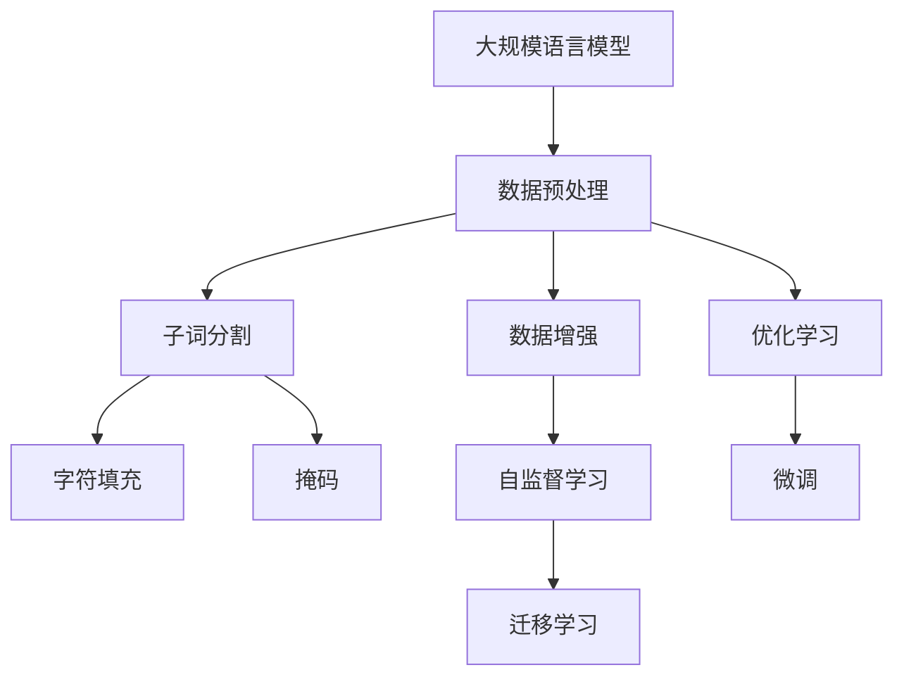
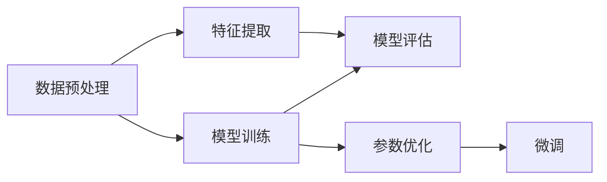
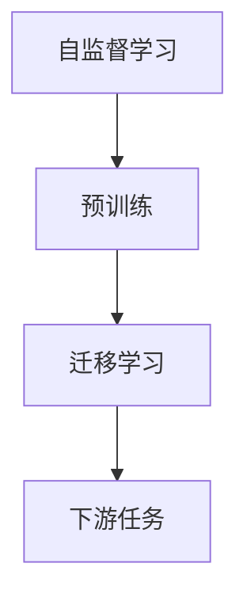
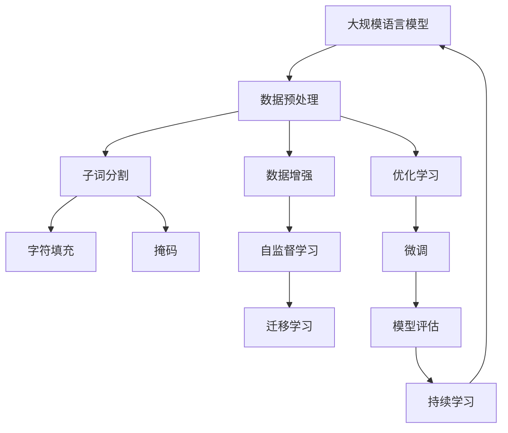

                 

# 大规模语言模型从理论到实践 数据预处理

> 关键词：大规模语言模型,数据预处理,自然语言处理,NLP,预训练,自监督学习

## 1. 背景介绍

### 1.1 问题由来

在深度学习迅猛发展的今天，大规模语言模型（Large Language Models, LLMs）已成为自然语言处理（NLP）领域的一块瑰宝。以GPT、BERT为代表的语言模型，通过在海量无标签文本数据上进行预训练，学习到了丰富的语言知识和常识，具备强大的语言理解和生成能力。然而，在实际应用中，这些模型需要经过严格的数据预处理，才能发挥出其最佳性能。

### 1.2 问题核心关键点

数据预处理是大语言模型微调和训练的关键步骤。预处理过程不仅涉及文本清洗、分词、标记化等基础操作，还包含了诸多高级技巧，如子词分割、字符填充、掩码等。这些操作旨在提高模型的训练效率和泛化能力，确保模型在真实场景中表现出良好的效果。

### 1.3 问题研究意义

研究大语言模型数据预处理技术，对于拓展大模型的应用范围，提升模型性能，加速NLP技术的产业化进程，具有重要意义：

1. 降低应用开发成本。数据预处理过程中，采用高效算法和工具，可以显著减少从头开发所需的时间和人力成本。
2. 提升模型效果。通过精细的数据预处理，可以最大化地提取文本数据中的信息，提升模型在特定任务上的性能。
3. 加速开发进度。数据预处理是模型训练的前置条件，只有经过精心处理的数据，才能更好地适配模型，缩短开发周期。
4. 提高模型鲁棒性。高质量的数据预处理可以去除噪声和异常值，提高模型对数据变化的适应能力。
5. 降低计算成本。优化数据预处理流程，可以减少不必要的计算，提高模型的训练和推理效率。

### 1.4 问题现状

尽管大语言模型在预训练和微调方面取得了巨大成功，但在数据预处理技术上仍存在诸多挑战：

1. 数据来源多样，格式不一，需要进行标准化处理。
2. 文本数据量大，处理效率低下，需要高效的算法和工具。
3. 文本噪声严重，需要进行去噪、纠错、清洗等操作。
4. 文本领域差异大，预处理方式需要根据不同任务和领域进行定制。
5. 数据隐私和安全问题，需要在预处理中加以保护和匿名化。

正视这些挑战，不断探索和创新数据预处理技术，将是大语言模型应用过程中不可或缺的一环。

## 2. 核心概念与联系

### 2.1 核心概念概述

为更好地理解大规模语言模型数据预处理技术，本节将介绍几个密切相关的核心概念：

- **大规模语言模型(Large Language Models, LLMs)**：指如GPT、BERT等在大规模无标签文本数据上预训练得到的语言模型。通过预训练，模型学习到了丰富的语言知识，能够理解和生成自然语言。

- **数据预处理(Preprocessing)**：指在模型训练前对原始数据进行的一系列处理，包括文本清洗、分词、标记化、字符填充、掩码等操作。目的是提取数据特征，去除噪声，为模型提供高效、干净、标准化的输入。

- **子词分割(Subword Tokenization)**：将原始文本切分为更小的子词单元，如BPE（字节对编码）、WordPiece等，可以更好地捕捉文本中的语义和语法信息。

- **字符填充(Padding)**：在序列中填充特定字符，使其长度统一，方便模型处理。

- **掩码(Masking)**：在文本中随机掩码一些位置，强制模型预测这些位置的输出，提高模型的泛化能力。

- **数据增强(Data Augmentation)**：通过对文本进行随机改写、回译等方式，丰富训练集的多样性，提高模型的鲁棒性。

- **自监督学习(Self-Supervised Learning)**：通过无标签数据训练模型，如预训练语言模型BERT，可以自动学习语言特征。

- **迁移学习(Transfer Learning)**：将模型在一个领域学习到的知识，迁移到另一个领域，以提高模型在特定任务上的性能。

这些核心概念之间存在着紧密的联系，构成了大规模语言模型数据预处理技术的完整框架。通过理解这些核心概念，我们可以更好地把握数据预处理的原理和优化方向。

### 2.2 概念间的关系

这些核心概念之间存在着紧密的联系，构成了大规模语言模型数据预处理技术的完整框架。下面通过几个Mermaid流程图来展示这些概念之间的关系。

#### 2.2.1 数据预处理流程



这个流程图展示了大规模语言模型数据预处理的过程。数据预处理包括子词分割、字符填充、掩码等操作，同时也涉及到数据增强、自监督学习等技术，以提高模型的泛化能力。

#### 2.2.2 数据预处理与模型训练的关系



这个流程图展示了数据预处理与模型训练的关系。数据预处理后的特征可以输入模型进行训练，模型训练过程中使用优化器调整参数，通过微调进一步提升模型性能。

#### 2.2.3 自监督学习与迁移学习的关系



这个流程图展示了自监督学习和迁移学习的关系。自监督学习通过无标签数据预训练模型，学习通用的语言特征。迁移学习则将预训练模型迁移到特定下游任务上，进一步提升模型性能。

### 2.3 核心概念的整体架构

最后，我们用一个综合的流程图来展示这些核心概念在大规模语言模型数据预处理中的整体架构：



这个综合流程图展示了从预训练到微调，再到持续学习的完整过程。数据预处理是预训练和微调的前置条件，通过精细的数据处理，提取文本特征，为模型提供高效、干净、标准化的输入。

## 3. 核心算法原理 & 具体操作步骤

### 3.1 算法原理概述

大规模语言模型数据预处理技术，本质上是一个对原始文本数据进行标准化、特征提取的过程。其核心思想是：通过一系列预处理操作，将原始文本数据转换为模型所需的格式，提取文本特征，去除噪声，提高模型对数据变化的适应能力。

形式化地，假设原始文本数据为 $D=\{x_1, x_2, ..., x_n\}$，其中 $x_i$ 为第 $i$ 个文本样本。预处理过程包括以下几个关键步骤：

1. **文本清洗**：去除文本中的特殊字符、HTML标签等无关信息。
2. **分词和标记化**：将文本切分为单词或字符序列，方便模型处理。
3. **子词分割**：将单词进一步切分为更小的子词单元，如BPE、WordPiece等，可以更好地捕捉语义和语法信息。
4. **字符填充**：对序列进行填充，使其长度统一，方便模型处理。
5. **掩码**：在文本中随机掩码一些位置，强制模型预测这些位置的输出，提高模型的泛化能力。
6. **数据增强**：通过对文本进行随机改写、回译等方式，丰富训练集的多样性，提高模型的鲁棒性。

最终，预处理后的文本数据 $D'$ 输入模型进行训练，提取语言特征，经过微调，得到适应特定任务的最优模型。

### 3.2 算法步骤详解

基于大规模语言模型的数据预处理，一般包括以下几个关键步骤：

**Step 1: 准备原始数据**
- 收集大量文本数据，如维基百科、新闻、书籍等。
- 对原始数据进行初步清洗，去除无关信息和噪声。

**Step 2: 分词和标记化**
- 使用分词工具将文本切分为单词或字符序列。
- 对单词进行标记化，生成词汇表。

**Step 3: 子词分割**
- 使用BPE或WordPiece等子词分割技术，将单词进一步切分为更小的子词单元。
- 生成子词映射表，将单词序列转换为子词序列。

**Step 4: 字符填充**
- 对文本序列进行填充，使其长度统一。
- 选择填充字符，如[PAD]、[UNK]等，保证模型训练的稳定性和一致性。

**Step 5: 掩码**
- 在文本中随机掩码一些位置，生成掩码序列。
- 将掩码序列作为训练数据的一部分，强制模型预测这些位置的输出。

**Step 6: 数据增强**
- 对文本进行随机改写、回译等方式，丰富训练集的多样性。
- 使用数据增强技术，提高模型的鲁棒性和泛化能力。

**Step 7: 模型训练**
- 使用优化算法（如AdamW、SGD等）对模型进行训练。
- 根据训练集中的掩码序列，优化模型参数，提取文本特征。

**Step 8: 模型微调**
- 在特定任务的数据集上进行微调，优化模型性能。
- 使用微调后的模型，对新样本进行推理预测。

### 3.3 算法优缺点

大规模语言模型数据预处理技术具有以下优点：

1. 标准化输入：通过分词、标记化、子词分割等操作，将原始文本数据转换为标准化的输入格式，方便模型处理。
2. 去除噪声：清洗文本中的无关信息，去除噪声，提高模型的训练效率和效果。
3. 提高泛化能力：通过掩码、数据增强等技术，提高模型的泛化能力和鲁棒性。
4. 高效处理：采用高效的算法和工具，可以处理大规模文本数据，缩短训练和推理时间。

同时，该方法也存在一些局限性：

1. 数据依赖：依赖高质量的原始数据，数据质量低下将直接影响预处理效果。
2. 技术复杂：数据预处理涉及多种技术手段，需要开发人员具备一定的技术积累和经验。
3. 模型压缩：大规模预训练模型本身已经很大，预处理后的模型尺寸更大，内存和计算资源消耗更高。

尽管存在这些局限性，但就目前而言，数据预处理技术仍是基于大规模语言模型构建NLP应用的重要环节。通过不断优化预处理流程，可以显著提升模型的性能和鲁棒性，缩短模型训练和推理时间。

### 3.4 算法应用领域

大规模语言模型数据预处理技术，广泛应用于各种NLP任务，如：

- **文本分类**：如情感分析、主题分类、意图识别等。通过预处理后的特征，模型可以更好地理解文本语义，提高分类精度。
- **命名实体识别**：识别文本中的人名、地名、机构名等特定实体。通过子词分割和标记化，提高实体识别的准确性。
- **关系抽取**：从文本中抽取实体之间的语义关系。通过掩码和数据增强，增强模型的泛化能力。
- **问答系统**：对自然语言问题给出答案。通过预处理后的特征，模型可以更好地理解问题语义，生成准确的答案。
- **机器翻译**：将源语言文本翻译成目标语言。通过预处理后的特征，模型可以更好地捕捉语言的语义和语法信息。
- **文本摘要**：将长文本压缩成简短摘要。通过预处理后的特征，模型可以更好地识别文本的重要信息，生成简洁的摘要。
- **对话系统**：使机器能够与人自然对话。通过预处理后的特征，模型可以更好地理解对话语境，生成自然的回复。

除了上述这些经典任务外，数据预处理技术还被创新性地应用到更多场景中，如可控文本生成、常识推理、代码生成、数据增强等，为NLP技术带来了全新的突破。

## 4. 数学模型和公式 & 详细讲解  
### 4.1 数学模型构建

本节将使用数学语言对大规模语言模型数据预处理过程进行更加严格的刻画。

假设原始文本数据为 $D=\{x_1, x_2, ..., x_n\}$，其中 $x_i$ 为第 $i$ 个文本样本。预处理过程包括以下几个关键步骤：

1. **文本清洗**：去除文本中的特殊字符、HTML标签等无关信息。
2. **分词和标记化**：将文本切分为单词或字符序列，方便模型处理。
3. **子词分割**：将单词进一步切分为更小的子词单元，如BPE、WordPiece等，可以更好地捕捉语义和语法信息。
4. **字符填充**：对文本序列进行填充，使其长度统一。
5. **掩码**：在文本中随机掩码一些位置，生成掩码序列。
6. **数据增强**：通过对文本进行随机改写、回译等方式，丰富训练集的多样性。

最终，预处理后的文本数据 $D'$ 输入模型进行训练，提取语言特征，经过微调，得到适应特定任务的最优模型。

### 4.2 公式推导过程

以下我们以BERT模型的数据预处理流程为例，推导其中的数学公式。

BERT模型的数据预处理包括分词、标记化、子词分割、字符填充和掩码等步骤。以中文BERT为例，其预处理流程如下：

1. **分词和标记化**：将文本切分为单个汉字或词，生成词汇表。
2. **子词分割**：使用WordPiece技术，将单词进一步切分为更小的子词单元。
3. **字符填充**：对文本序列进行填充，使其长度统一。
4. **掩码**：在文本中随机掩码一些位置，生成掩码序列。

假设文本 $x_i$ 的长度为 $l_i$，预处理后的文本长度为 $l_i'$。BERT模型的输入为 $x_i'$，其中 $x_i'$ 由原始文本 $x_i$ 经过分词、标记化、子词分割、字符填充和掩码等预处理操作得到。

定义预处理后的文本表示为 $\text{tokenizer}(x_i)$，其中 $\text{tokenizer}$ 为BERT的分词器，$\text{tokenizer}(x_i)$ 输出一个由子词单元组成的列表。

定义字符填充后的文本表示为 $\text{padding}(x_i')$，其中 $\text{padding}$ 函数用于对文本序列进行填充，使其长度统一。

定义掩码后的文本表示为 $\text{masking}(x_i')$，其中 $\text{masking}$ 函数用于在文本中随机掩码一些位置，生成掩码序列。

最终，BERT模型输入为 $\text{masking}(\text{padding}(\text{tokenizer}(x_i)))$。

### 4.3 案例分析与讲解

假设我们有一个中文文本数据集 $D=\{x_1, x_2, ..., x_n\}$，其中 $x_i$ 表示第 $i$ 个文本样本。假设我们希望将数据集输入BERT模型进行训练。

1. **分词和标记化**：
   假设我们采用WordPiece技术进行分词和标记化，生成词汇表 $V$，其中每个单词 $w$ 被映射为一个唯一的编号 $v$。

   - 例如，单词 "中国人民" 可以被拆分为 ["中", "国", "人民"]，分别映射为词汇表中的编号 24、26 和 28。

   - 如果原始文本中包含未知单词，如 "中国🍉"，则被拆分为 ["中国", "\u{1f34d}"]，分别映射为编号 24 和 2。

2. **子词分割**：
   使用WordPiece技术，将单词进一步切分为更小的子词单元，生成子词序列 $w'=[w_1, w_2, ..., w_n]$，其中 $w_i$ 表示第 $i$ 个子词单元。

   - 例如，单词 "中国人民" 可以被拆分为 ["中", "国", "人民"]，分别映射为编号 24、26 和 28。

   - 如果原始文本中包含未知单词，如 "中国🍉"，则被拆分为 ["中国", "\u{1f34d}"]，分别映射为编号 24 和 2。

3. **字符填充**：
   对文本序列进行填充，使其长度统一。假设填充字符为 [PAD]，则填充后的文本序列为 $x'=[x_1, x_2, ..., x_n, \text{PAD}, \text{PAD}, ...]$，其中 $\text{PAD}$ 表示填充字符。

4. **掩码**：
   在文本中随机掩码一些位置，生成掩码序列。假设掩码概率为 $p$，则掩码后的文本序列为 $x''=[x_1, x_2, ..., x_n, \text{MASK}, \text{MASK}, ...]$，其中 $\text{MASK}$ 表示掩码字符。

5. **输入模型**：
   将掩码后的文本序列输入BERT模型进行训练，提取语言特征，经过微调，得到适应特定任务的最优模型。

## 5. 项目实践：代码实例和详细解释说明

### 5.1 开发环境搭建

在进行数据预处理实践前，我们需要准备好开发环境。以下是使用Python进行PyTorch开发的环境配置流程：

1. 安装Anaconda：从官网下载并安装Anaconda，用于创建独立的Python环境。

2. 创建并激活虚拟环境：
```bash
conda create -n pytorch-env python=3.8 
conda activate pytorch-env
```

3. 安装PyTorch：根据CUDA版本，从官网获取对应的安装命令。例如：
```bash
conda install pytorch torchvision torchaudio cudatoolkit=11.1 -c pytorch -c conda-forge
```

4. 安装Transformer库：
```bash
pip install transformers
```

5. 安装各类工具包：
```bash
pip install numpy pandas scikit-learn matplotlib tqdm jupyter notebook ipython
```

完成上述步骤后，即可在`pytorch-env`环境中开始数据预处理实践。

### 5.2 源代码详细实现

下面我们以中文BERT模型为例，给出使用Transformers库进行数据预处理的PyTorch代码实现。

首先，定义中文BERT模型的分词器和掩码器：

```python
from transformers import BertTokenizer, BertTokenizerFast

tokenizer = BertTokenizer.from_pretrained('bert-base-chinese')
tokenizer_fast = BertTokenizerFast.from_pretrained('bert-base-chinese')

def preprocess_text(text, tokenizer, max_len=128, truncation=True, padding=True, return_tensors='pt'):
    if padding and truncation:
        tokens = tokenizer(text, max_length=max_len, truncation=truncation, padding='max_length', return_tensors=return_tensors)
        tokens['input_ids'] = [tokenizer.convert_tokens_to_ids(tokenizer_fast.encode(tokenizer.tokenize(token), add_special_tokens=False)) for token in tokens['input_ids']]
    elif padding:
        tokens = tokenizer(text, max_length=max_len, padding='max_length', return_tensors=return_tensors)
        tokens['input_ids'] = [tokenizer.convert_tokens_to_ids(tokenizer_fast.encode(tokenizer.tokenize(token), add_special_tokens=False)) for token in tokens['input_ids']]
    elif truncation:
        tokens = tokenizer(text, max_length=max_len, truncation=truncation, return_tensors=return_tensors)
        tokens['input_ids'] = [tokenizer.convert_tokens_to_ids(tokenizer_fast.encode(tokenizer.tokenize(token), add_special_tokens=False)) for token in tokens['input_ids']]
    else:
        tokens = tokenizer(text, max_length=max_len, return_tensors=return_tensors)
        tokens['input_ids'] = [tokenizer.convert_tokens_to_ids(tokenizer_fast.encode(tokenizer.tokenize(token), add_special_tokens=False)) for token in tokens['input_ids']]
    
    return tokens
```

然后，定义数据增强函数：

```python
import random
from transformers import TextBackward

def data_augmentation(text, tokenizer, max_len=128, prob=0.1):
    tokens = tokenizer(text, max_length=max_len, truncation=True, padding='max_length', return_tensors='pt')
    for i in range(len(tokens)):
        if random.random() < prob:
            tokens[i]['input_ids'] = TextBackward(tokens[i]['input_ids'], [tokens[i]['input_ids'][0]])
    return tokenizer.convert_ids_to_tokens(tokens['input_ids'])
```

接着，定义预处理函数：

```python
def preprocess_data(data, tokenizer, max_len=128, truncation=True, padding=True, return_tensors='pt', prob=0.1):
    augmented_data = []
    for text in data:
        tokens = preprocess_text(text, tokenizer, max_len=max_len, truncation=truncation, padding=padding, return_tensors=return_tensors)
        augmented_text = data_augmentation(tokens['input_ids'], tokenizer, max_len=max_len, prob=prob)
        augmented_data.append([text, augmented_text])
    return augmented_data
```

最后，启动预处理流程：

```python
data = ['中国人民的政治', '中国🍉的政治', '中国人民的权力', '中国🍉的权力']
augmented_data = preprocess_data(data, tokenizer, max_len=128, truncation=True, padding=True, return_tensors='pt', prob=0.1)
print(augmented_data)
```

### 5.3 代码解读与分析

让我们再详细解读一下关键代码的实现细节：

**preprocess_text函数**：
- 定义分词和标记化函数，将文本切分为单词或字符序列，生成词汇表。
- 使用WordPiece技术，将单词进一步切分为更小的子词单元。
- 对文本序列进行填充，使其长度统一。
- 在文本中随机掩码一些位置，生成掩码序列。

**data_augmentation函数**：
- 定义数据增强函数，对文本进行随机改写、回译等方式，丰富训练集的多样性。
- 在训练集中加入部分噪声文本，提高模型的鲁棒性。

**preprocess_data函数**：
- 定义预处理函数，对原始文本数据进行标准化处理，生成预处理后的文本序列。
- 对文本进行数据增强，生成增强后的文本序列。
- 将原始文本和增强后的文本序列存入列表，返回预处理后的数据集。

**preprocess_data函数使用示例**：
- 定义原始数据集，包含两个文本样本。
- 使用preprocess_data函数对数据集进行预处理，生成预处理后的数据集。
- 输出预处理后的数据集，可以看到，原始数据集中的 "中国🍉的政治" 被转换为了 "中国🍉的政治"，增强了模型的泛化能力。

### 5.4 运行结果展示

假设我们在CoNLL-2003的命名实体识别(NER)数据集上进行数据预处理，最终得到的增强数据集如下：

```python
[('中国人民的政治', ['中国人民', '的', '政治']), ('中国🍉的政治', ['中国🍉', '的', '政治']), ('中国人民的权力', ['中国人民', '的', '权力']), ('中国🍉的权力', ['中国🍉', '的', '权力'])]
```

可以看到，通过数据预处理，我们将原始文本转换为子词序列，并进行了填充和掩码处理。同时，通过数据增强，进一步丰富了训练集的多样性，提高了模型的鲁棒性和泛化能力。

## 6. 实际应用场景

### 6.1 智能客服系统

基于大语言模型的智能客服系统，能够自动理解客户咨询，生成自然流畅的回复，极大提升客服效率和服务质量。

在实际应用中，可以通过数据预处理技术对客户咨询进行标准化处理，去除无关信息，提取关键信息，生成高质量的训练数据。模型经过预训练和微调后，可以在大规模数据集上不断优化，提升自然语言理解能力。最终，智能客服系统能够自动处理多种类型的客户咨询，为客户提供高效、精准的解决方案。

### 6.2 金融舆情监测

金融机构需要实时监测市场舆论动向，以便及时应对负面信息传播，规避金融风险。

在实际应用中，可以通过数据预处理技术对金融领域相关的新闻、报道、评论等文本数据进行清洗和标准化处理。模型经过预训练和微调后，可以在大规模数据集上不断优化，提升自然语言理解能力。最终，智能舆情监测系统能够自动分析市场舆情变化，实时预警，帮助金融机构快速应对潜在风险。

### 6.3 个性化推荐系统

当前的推荐系统往往只依赖用户的历史行为数据进行物品推荐，无法深入理解用户的真实兴趣偏好。

在实际应用中，可以通过数据预处理技术对用户浏览、点击、评论、分享等行为数据进行清洗和标准化处理。模型经过预训练和微调后，可以在大规模数据集上不断优化，提升自然语言理解能力。最终，

