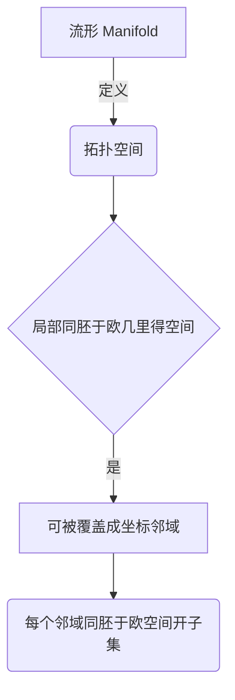
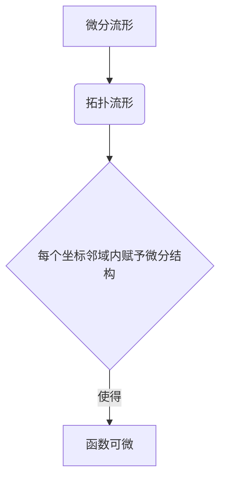
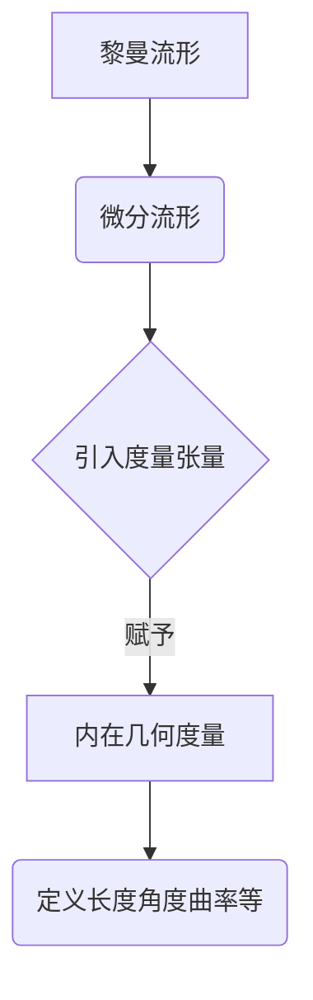
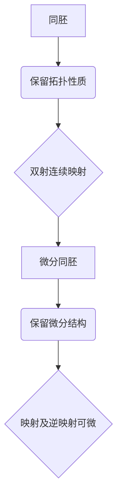
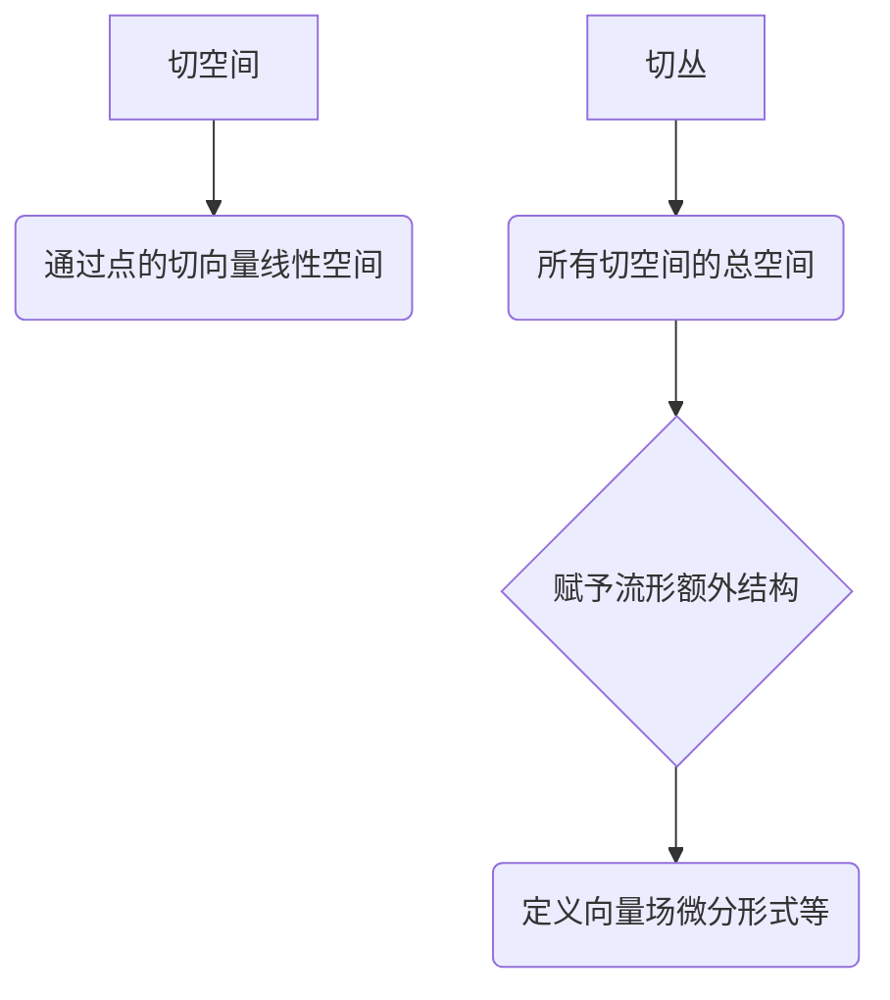
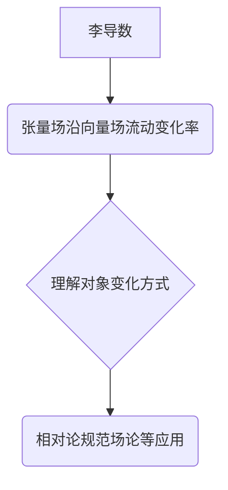
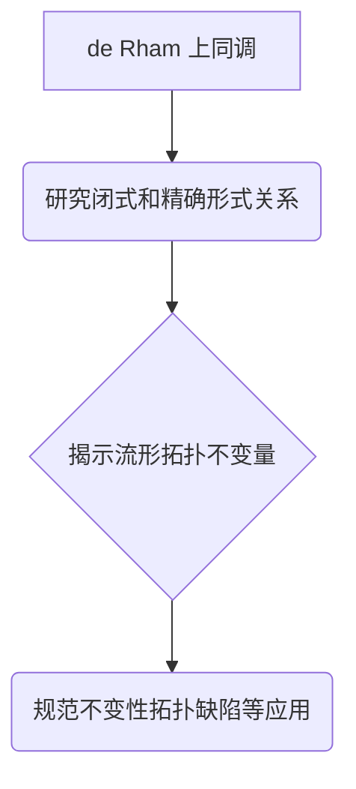

# 流形拓扑学理论与概念的实质：物理背景的流形

## 1. 背景介绍

### 1.1 问题的由来

在现代物理学中,尤其是相对论和量子论的发展过程中,流形(manifold)这一概念扮演着至关重要的角色。传统的欧几里德空间几何已经无法满足描述时空本质的需求,因此,物理学家们不得不借助更加抽象和一般化的数学工具——流形,来刻画时空的本质特征。

流形不仅为相对论奠定了坚实的数学基础,同时也为量子场论、弦论等前沿理论提供了必要的数学描述。可以说,流形拓扑学的发展与现代物理学的进步息息相关,二者相互促进、相辅相成。

### 1.2 研究现状

目前,流形在物理学中的应用已经相当广泛和深入。从狭义相对论中描述时空连续性,到广义相对论中描述时空曲率,再到量子场论中的规范场理论和弦论中的额外维度,无不与流形概念紧密相连。

然而,尽管流形在物理学中的应用已经取得了巨大的成就,但对于流形本身的数学结构和拓扑性质的深入理解仍然是一个巨大的挑战。许多著名的数学家和物理学家都在努力探索流形的本质,试图揭示它与物理世界之间的内在联系。

### 1.3 研究意义

深入理解流形拓扑学对于物理学的发展至关重要,有以下几个主要意义:

1. **奠定坚实的数学基础**: 流形为相对论、量子场论等现代物理理论提供了坚实的数学基础,使这些理论能够在严格的数学框架内得到精确的表述和发展。

2. **揭示时空本质**: 通过研究流形的拓扑性质,我们可以更好地理解时空的本质特征,如连续性、曲率等,从而深化对宇宙结构的认识。

3. **解决理论难题**: 一些长期困扰物理学的难题,如量子引力问题、奇点问题等,可能需要借助流形拓扑学的新视角和新方法来寻求突破。

4. **促进跨学科交流**: 流形拓扑学的研究需要数学家和物理学家的紧密合作,这将促进不同学科之间的交流与融合,产生新的研究思路和方法。

### 1.4 本文结构

本文将从流形拓扑学的角度出发,深入探讨它在物理学中的应用和意义。文章主要包括以下几个部分:

1. 核心概念与联系
2. 核心算法原理与具体操作步骤
3. 数学模型和公式详细讲解与案例分析
4. 项目实践:代码实例和详细解释说明
5. 实际应用场景
6. 工具和资源推荐
7. 总结:未来发展趋势与挑战
8. 附录:常见问题与解答

## 2. 核心概念与联系

在深入探讨流形拓扑学在物理学中的应用之前,我们需要先了解一些核心概念及它们之间的联系。

### 2.1 流形(Manifold)

流形是现代几何学和拓扑学中的一个基本概念。从直观上来说,流形是一种在局部看起来像欧几里得空间,但在全局上可能是曲折的空间。

更精确地说,一个流形是一个拓扑空间,它在每一点都有着与欧几里得空间相同的局部结构。换句话说,流形是一个可以被覆盖成若干坐标邻域的拓扑空间,每个坐标邻域都同homeomorphic于欧几里得空间的一个开子集。

流形的概念允许我们去研究那些在局部上看起来平坦,但在全局上可能是曲折的几何对象。这种思想在相对论中扮演着关键角色,因为相对论描述的时空就是一个四维流形。

### 2.2 微分流形(Differentiable Manifold)

微分流形是在流形的基础上引入了微分结构的概念。一个微分流形不仅是一个拓扑流形,而且在每个坐标邻域内还赋予了一个微分结构,使得在这个邻域内的函数都是可微的。

微分流形的概念对于研究物理定律至关重要,因为大多数物理定律都是用微分方程来描述的。相对论中的时空就是一个四维的微分流形,而量子场论中的规范场也是定义在某个微分流形上的。

### 2.3 黎曼流形(Riemannian Manifold)

黎曼流形是在微分流形的基础上,进一步引入了度量张量(metric tensor)的概念。度量张量赋予了流形一种内在的几何度量,使得我们可以在流形上定义长度、角度、曲率等几何概念。

广义相对论中的时空就是一个四维的黎曼流形,其度量张量由物质分布决定。这种观点打破了牛顿时代的绝对时空观,时空的几何性质不再是先验给定的,而是由物质的存在所决定的。

### 2.4 拓扑与微分同胚(Homeomorphism & Diffeomorphism)

在研究流形时,同胚(homeomorphism)和微分同胚(diffeomorphism)是两个重要的等价关系。

- 同胚: 如果两个流形之间存在一个双射且连续的映射,那么这两个流形被称为同胚的。同胚保留了流形的拓扑性质,但不一定保留了微分结构。

- 微分同胚: 如果两个微分流形之间存在一个双射、连续、并且映射及其逆映射都是可微的,那么这两个微分流形被称为微分同胚的。微分同胚不仅保留了拓扑性质,还保留了微分结构。

在物理学中,我们通常关注微分同胚,因为物理定律需要保持微分结构的不变性。例如,相对论中的时空变换就是一个微分同胚映射。

通过上述核心概念及它们之间的联系,我们可以看到流形拓扑学为物理学提供了坚实的数学基础,使得物理定律能够在一个严格的数学框架内得到精确的表述和发展。

## 3. 核心算法原理与具体操作步骤

在流形拓扑学中,有一些核心算法和原理对于理解和操作流形至关重要。本节将介绍其中的几个关键算法,并详细解释它们的原理和具体操作步骤。

### 3.1 算法原理概述

#### 3.1.1 切空间和切丛(Tangent Space and Tangent Bundle)

切空间是定义在流形上的一个重要概念,它描述了流形在某一点的局部线性近似。具体来说,切空间是所有通过该点的切向量(tangent vector)组成的线性空间。

切丛则是将每一点的切空间"捆绑"在一起形成的总空间。切丛为流形赋予了一种额外的结构,使得我们可以在流形上定义向量场、微分形式等重要概念。

#### 3.1.2 李导数(Lie Derivative)

李导数是流形上的一种特殊微分算子,它描述了一个张量场沿着一个向量场的流动时的变化率。李导数不仅在理解流形上的对象的变化方式时起着关键作用,而且在相对论、规范场论等物理理论中也扮演着重要角色。

#### 3.1.3 de Rham 上同调(de Rham Cohomology)

de Rham 上同调是一种描述流形拓扑性质的强有力工具。它研究流形上的闭式和精确形式之间的关系,从而揭示了流形的一些深层次的拓扑不变量。

de Rham 上同调不仅在纯数学领域有着广泛的应用,在物理学中也扮演着重要角色。例如,它与规范场论中的规范不变性密切相关,也是研究拓扑缺陷和谷粒子等现象的关键工具。

### 3.2 算法步骤详解

接下来,我们将详细解释上述三个核心算法的具体操作步骤。

#### 3.2.1 切空间和切丛的构造

1) 给定一个 n 维流形 M。
2) 在流形上任意取一点 p。
3) 在点 p 的某个邻域内,取一个坐标系 (x^1, x^2, ..., x^n)。
4) 定义 n 个基本导数算子:

   $$\frac{\partial}{\partial x^i} = \frac{\partial}{\partial x^i}\bigg|_p$$

5) 这 n 个基本导数算子在点 p 处生成了一个 n 维线性空间,即切空间 T_p(M)。
6) 切丛 T(M) 由所有点的切空间构成:

   $$T(M) = \bigsqcup_{p \in M} T_p(M)$$

通过上述步骤,我们就构造出了流形的切空间和切丛。切空间为我们研究流形上的微分运算奠定了基础,而切丛则赋予了流形一种额外的"线性化"结构。

#### 3.2.2 计算李导数

1) 给定一个流形 M 上的张量场 T 和向量场 X。
2) 取流形上任意一点 p,并在其邻域内引入坐标系 (x^1, x^2, ..., x^n)。
3) 沿着向量场 X 作流线积分,得到一个一参数变换群 \phi_t:

   $$\frac{d\phi_t(p)}{dt} = X(\phi_t(p))$$

4) 定义 T 在点 p 处沿 X 方向的李导数为:

   $$\mathcal{L}_X T(p) = \left.\frac{d}{dt}\right|_{t=0} (\phi_t^*T)(p)$$

   其中 \phi_t^* 表示张量场 T bajo 变换 \phi_t 的拉回。

5) 利用坐标基张量的性质,可以显式计算出 T 的各个分量的李导数表达式。

通过以上步骤,我们就可以计算出任意张量场沿给定向量场的李导数。李导数不仅描述了张量场的无穷小变化,而且与许多物理定律密切相关,如相对论中的并举不变性、规范场论中的规范变换等。

#### 3.2.3 计算 de Rham 上同调

1) 给定一个流形 M。
2) 在 M 上定义 k-形式的外微分算子 d:

   $$d:\Omega^k(M) \rightarrow \Omega^{k+1}(M)$$

   对于任意 k-形式 \omega,有 d^2\omega = 0。

3) 称 d\omega = 0