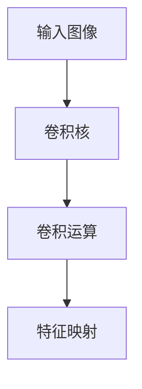
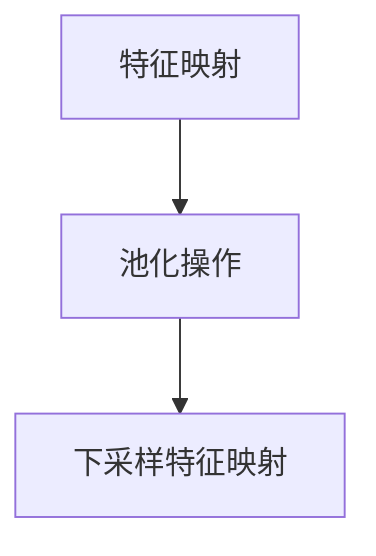
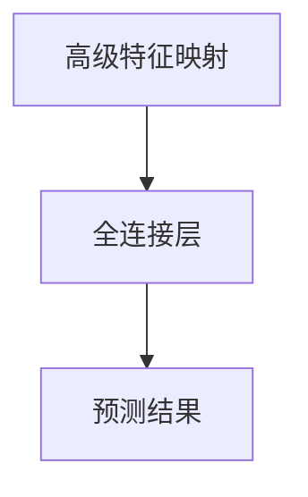
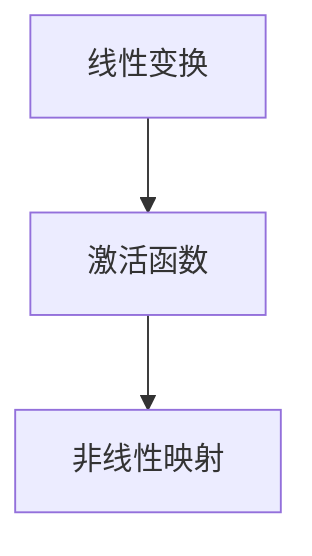
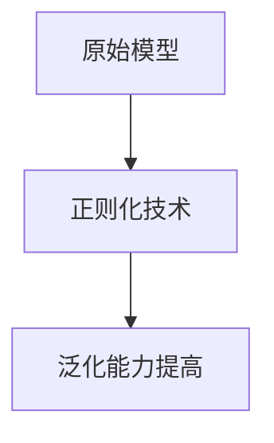
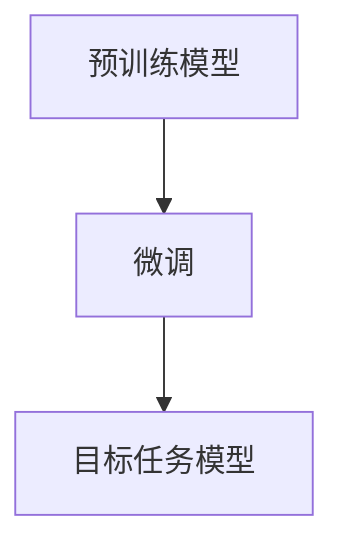
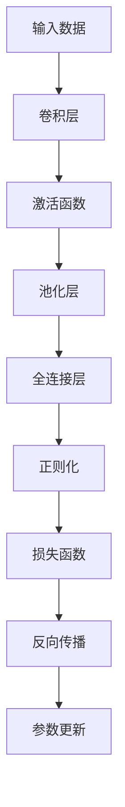

# 从零开始大模型开发与微调：卷积神经网络的原理

## 1. 背景介绍

### 1.1 问题的由来

在深度学习领域中,卷积神经网络(Convolutional Neural Networks, CNN)已经成为解决计算机视觉任务的主流方法。从图像分类、目标检测到语义分割,CNN在各种视觉任务中都展现出了卓越的性能。然而,训练一个高性能的CNN模型需要大量的计算资源和海量的标注数据,这对于普通开发者来说是一个巨大的挑战。

### 1.2 研究现状

近年来,随着大型预训练模型(如BERT、GPT等)在自然语言处理领域取得了巨大成功,这种"预训练+微调"的范式也逐渐被引入到计算机视觉领域。一些研究工作表明,利用大型预训练模型作为初始化权重,然后在目标任务上进行微调,可以显著提高模型的性能,同时降低了对大量标注数据的需求。

### 1.3 研究意义

本文旨在探索如何从零开始开发和微调大型CNN模型,以解决实际的计算机视觉任务。我们将深入剖析CNN的原理和架构,并详细介绍如何利用预训练模型和微调技术来提高模型的性能。通过实践案例,我们将展示如何在实际项目中应用这些技术,并分享一些实用的技巧和经验。

### 1.4 本文结构

本文将分为以下几个部分:

1. 背景介绍
2. 核心概念与联系
3. 核心算法原理与具体操作步骤
4. 数学模型和公式详细讲解与举例说明
5. 项目实践:代码实例和详细解释说明
6. 实际应用场景
7. 工具和资源推荐
8. 总结:未来发展趋势与挑战
9. 附录:常见问题与解答

## 2. 核心概念与联系

在深入探讨CNN的原理之前,我们先来了解一些核心概念和它们之间的联系。

### 2.1 卷积运算

卷积运算是CNN的核心操作,它通过在输入数据(如图像)上滑动一个小窗口(卷积核),并对窗口内的值进行加权求和,从而提取局部特征。卷积运算可以有效地捕捉图像的空间和结构信息,是CNN能够在计算机视觉任务中取得优异表现的关键所在。

### 2.2 池化层

池化层通常紧随卷积层,其作用是对卷积层的输出进行下采样,减小特征图的空间维度。这不仅可以减少计算量和内存占用,还能提高模型对平移、缩放等变换的鲁棒性。常见的池化操作包括最大池化(Max Pooling)和平均池化(Average Pooling)。

### 2.3 全连接层

在CNN的最后几层通常是全连接层,它将前面卷积层和池化层提取的高级特征进行整合,并输出最终的预测结果。全连接层的每个神经元与前一层的所有神经元相连,因此具有很强的特征表达能力。

### 2.4 激活函数

激活函数引入了非线性,使得神经网络能够拟合更加复杂的函数。常见的激活函数包括ReLU(整流线性单元)、Sigmoid和Tanh等。合理选择激活函数对于模型的性能和收敛速度有着重要影响。

### 2.5 正则化技术

为了防止过拟合和提高模型的泛化能力,CNN通常会采用一些正则化技术,如L1/L2正则化、Dropout和BatchNormalization等。这些技术可以帮助模型捕捉更加鲁棒的特征,提高其在新数据上的表现。

### 2.6 预训练与微调

预训练是指在大规模数据集上训练一个通用的模型,而微调则是在目标任务上对预训练模型进行进一步训练,使其适应特定的任务。这种"预训练+微调"的范式可以显著提高模型的性能,同时降低对大量标注数据的需求。

## 3. 核心算法原理与具体操作步骤

### 3.1 算法原理概述

CNN的核心算法原理可以概括为以下几个步骤:

1. **卷积操作**: 通过在输入数据(如图像)上滑动卷积核,提取局部特征。
2. **激活函数**: 引入非线性,使得网络能够拟合更加复杂的函数。
3. **池化操作**: 对卷积层的输出进行下采样,减小特征图的空间维度,提高模型的鲁棒性。
4. **全连接层**: 将前面层提取的高级特征进行整合,并输出最终的预测结果。
5. **正则化技术**: 采用L1/L2正则化、Dropout、BatchNormalization等技术,防止过拟合,提高模型的泛化能力。
6. **损失函数**: 根据预测结果和真实标签计算损失,作为优化目标。
7. **反向传播**: 通过反向传播算法,计算各层参数的梯度,并使用优化算法(如SGD、Adam等)更新参数。

### 3.2 算法步骤详解

接下来,我们将详细介绍CNN算法的具体操作步骤。

#### 3.2.1 卷积操作

卷积操作是CNN的核心操作,它通过在输入数据(如图像)上滑动一个小窗口(卷积核),并对窗口内的值进行加权求和,从而提取局部特征。具体步骤如下:

1. 初始化卷积核权重。
2. 在输入数据上滑动卷积核,对每个位置进行加权求和操作。
3. 将求和结果存储在输出特征映射中的对应位置。
4. 重复步骤2和3,直到遍历完整个输入数据。

卷积操作可以用数学公式表示为:

$$
y_{ij} = \sum_{m}\sum_{n}x_{m+i,n+j}w_{mn} + b
$$

其中,$x$是输入数据,$w$是卷积核权重,$b$是偏置项,$y$是输出特征映射。

通过卷积操作,CNN可以有效地捕捉输入数据的空间和结构信息,这是CNN在计算机视觉任务中取得优异表现的关键所在。

#### 3.2.2 激活函数

激活函数引入了非线性,使得神经网络能够拟合更加复杂的函数。常见的激活函数包括ReLU(整流线性单元)、Sigmoid和Tanh等。

ReLU函数的数学表达式为:

$$
f(x) = \max(0, x)
$$

ReLU函数具有计算简单、收敛快等优点,是CNN中最常用的激活函数。

#### 3.2.3 池化操作

池化层通常紧随卷积层,其作用是对卷积层的输出进行下采样,减小特征图的空间维度。这不仅可以减少计算量和内存占用,还能提高模型对平移、缩放等变换的鲁棒性。

最大池化(Max Pooling)是最常见的池化操作,它的工作原理是在输入特征映射上滑动一个小窗口,并选取窗口内的最大值作为输出。具体步骤如下:

1. 在输入特征映射上滑动一个小窗口。
2. 在每个窗口内选取最大值。
3. 将最大值存储在输出特征映射的对应位置。
4. 重复步骤1到3,直到遍历完整个输入特征映射。

最大池化操作可以用数学公式表示为:

$$
y_{ij} = \max_{(m,n) \in R_{ij}}x_{mn}
$$

其中,$x$是输入特征映射,$y$是输出特征映射,$R_{ij}$表示输出特征映射中$(i,j)$位置对应的池化窗口区域。

#### 3.2.4 全连接层

在CNN的最后几层通常是全连接层,它将前面卷积层和池化层提取的高级特征进行整合,并输出最终的预测结果。全连接层的每个神经元与前一层的所有神经元相连,因此具有很强的特征表达能力。

全连接层的计算过程可以表示为:

$$
y = f(Wx + b)
$$

其中,$x$是输入特征向量,$W$是权重矩阵,$b$是偏置向量,$f$是激活函数,$y$是输出向量。

#### 3.2.5 正则化技术

为了防止过拟合和提高模型的泛化能力,CNN通常会采用一些正则化技术,如L1/L2正则化、Dropout和BatchNormalization等。

**L1/L2正则化**是在损失函数中加入权重的L1或L2范数,从而约束权重的大小,防止过拟合。

**Dropout**是一种常用的正则化技术,它在训练时随机将一部分神经元的输出设置为0,从而减少神经元之间的相关性,提高模型的泛化能力。

**BatchNormalization**是一种批归一化技术,它通过对每一层的输入进行归一化处理,使得数据分布更加稳定,从而加快收敛速度,提高模型的性能。

#### 3.2.6 损失函数和反向传播

在CNN的训练过程中,我们需要定义一个损失函数,用于衡量模型预测结果与真实标签之间的差异。常见的损失函数包括交叉熵损失(Cross Entropy Loss)、均方误差损失(Mean Squared Error Loss)等。

通过反向传播算法,我们可以计算各层参数的梯度,并使用优化算法(如SGD、Adam等)更新参数,从而最小化损失函数。

反向传播算法的核心思想是利用链式法则计算每个参数对损失函数的梯度,然后沿着梯度的反方向更新参数。具体步骤如下:

1. 前向传播,计算模型的输出。
2. 计算损失函数。
3. 反向传播,计算每个参数对损失函数的梯度。
4. 使用优化算法更新参数。
5. 重复步骤1到4,直到模型收敛或达到最大迭代次数。

### 3.3 算法优缺点

CNN算法具有以下优点:

- 能够有效捕捉输入数据的空间和结构信息,在计算机视觉任务中表现出色。
- 通过权重共享和局部连接,大大减少了模型的参数量,降低了计算复杂度。
- 具有一定的平移不变性和尺度不变性,提高了模型的鲁棒性。
- 可以通过预训练和微调技术,显著提高模型的性能,降低对大量标注数据的需求。

CNN算法的缺点包括:

- 对于序列数据(如自然语言处理任务)不太适用,需要进行特殊的处理。
- 训练过程计算量较大,需要强大的硬件支持。
- 对于一些复杂的任务,单一的CNN模型可能无法取得理想的性能,需要与其他模型(如RNN、Transformer等)结合使用。

### 3.4 算法应用领域

CNN算法广泛应用于计算机视觉领域,包括但不限于以下任务:

- 图像分类
- 目标检测
- 语义分割
- 实例分割
- 图像生成
- 视频分析
- 医学图像分析
- 自动驾驶
- 机器人视觉等

除了计算机视觉领域,CNN算法也逐渐被应