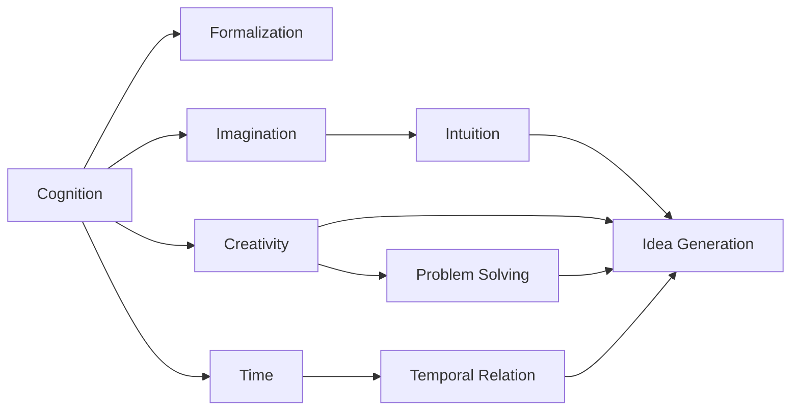
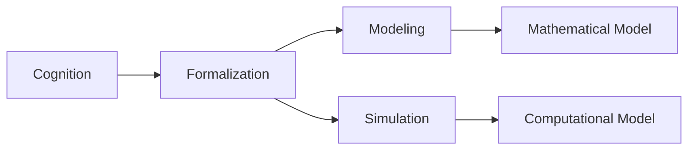
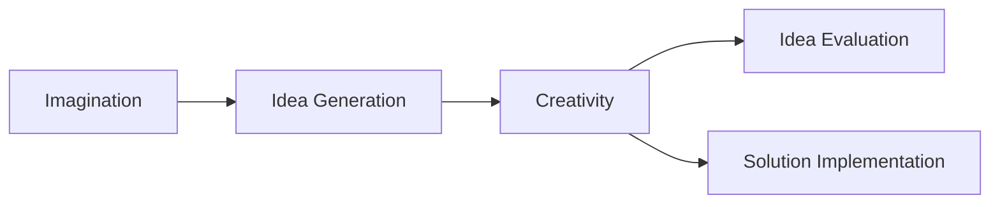
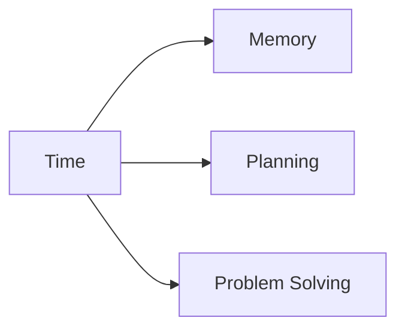
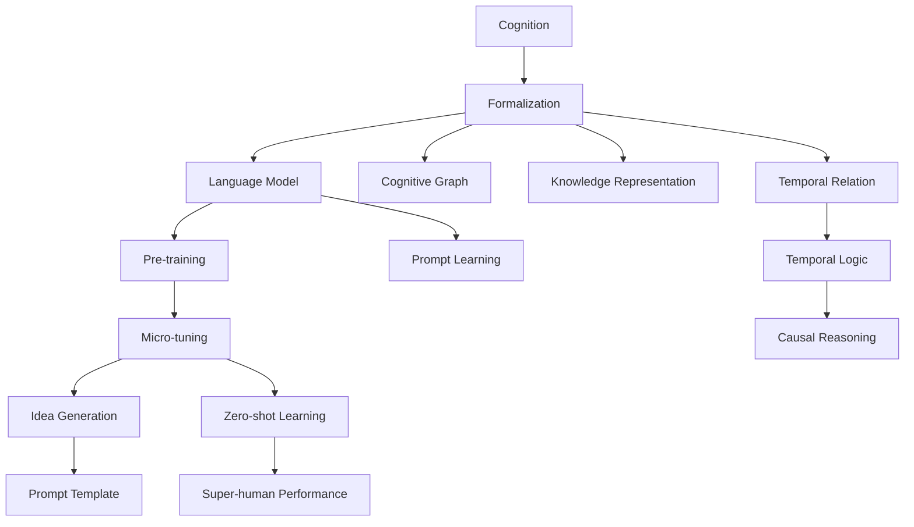

                 

# 认知的形式化：人类依靠想象力和创造力发明了时间

> 关键词：认知, 形式化, 想象力, 创造力, 时间, 数学模型, 自然语言处理

## 1. 背景介绍

### 1.1 问题由来
人类对世界的认知经历了漫长而复杂的发展历程。从远古时期对自然现象的直观观察，到古代文明对数学和哲学的探索，再到近现代科学方法的确立，人类不断试图通过形式化的方法描述和解释复杂的认知过程。

在信息化时代，认知的形式化更是成为了推动人工智能技术进步的重要驱动力。形式化认知不仅帮助我们更好地理解人类思维过程，也为机器智能的实现提供了坚实的理论基础。

### 1.2 问题核心关键点
形式化认知的核心在于将复杂的认知过程，如思考、推理、记忆等，转化为数学模型和算法，以供计算机理解和执行。这种形式化过程依赖于符号逻辑、语言学、心理学等多学科的交叉研究。

形式化认知的关键点包括：
- 如何定义和刻画认知活动的基本单元，如命题、概念、推理规则等。
- 如何将认知过程建模为形式化的数学模型，包括语言模型、认知图谱等。
- 如何利用算法和计算工具，对形式化的认知模型进行推理、优化和评估。
- 如何将形式化的认知模型应用于实际问题，如自然语言处理、知识表示、决策支持等。

### 1.3 问题研究意义
形式化认知研究对于理解和实现人工智能具有重要意义：
- 提供理论基础：通过形式化方法，可以系统地研究认知过程，建立数学模型，为人工智能技术的发展提供坚实的理论基础。
- 提升机器智能：形式化认知能够提高机器理解和推理能力，推动机器智能的进步。
- 增强人机交互：通过形式化认知，机器可以更好地理解和响应用户需求，提升人机交互体验。
- 促进科学发现：形式化方法有助于发现和验证科学假设，加速科学发现进程。

## 2. 核心概念与联系

### 2.1 核心概念概述

为更好地理解认知的形式化，本节将介绍几个密切相关的核心概念：

- 认知(Cognition)：指个体对环境信息进行感知、处理、记忆、推理等心理活动的过程。认知包括感知、记忆、推理、情感等多个方面。
- 形式化(Formalization)：指将复杂的概念、过程或系统抽象为符号和逻辑表达式，以便计算机理解和处理。形式化方法包括符号逻辑、逻辑代数、图论等。
- 想象力(Imagination)：指在头脑中构建不存在的概念、情景或体验的能力。想象力是人类创造力的核心部分。
- 创造力(Creativity)：指产生新颖、有用且独特的想法和解决方案的能力。创造力涉及信息整合、模式识别和概念组合等认知过程。
- 时间(Time)：指事件之间发生的先后顺序，是认知活动的重要参照系。时间在认知中起到关键作用，如记忆、推理、规划等。

这些核心概念之间的逻辑关系可以通过以下Mermaid流程图来展示：



这个流程图展示了认知、形式化、想象力、创造力和时间之间的关系：

1. 认知是形式化的基础，通过形式化方法可以将认知过程数学化。
2. 想象力是创造力的重要组成部分，能够促进新想法的产生。
3. 创造力涉及对已有知识的重新组合，产生新颖的解决方案。
4. 时间是认知的重要参照系，影响记忆、推理和规划等过程。
5. 直觉、问题解决和时空关系等都是创造力和认知的重要方面。

### 2.2 概念间的关系

这些核心概念之间存在着紧密的联系，形成了认知的形式化生态系统。下面我们通过几个Mermaid流程图来展示这些概念之间的关系。

#### 2.2.1 认知与形式化的关系



这个流程图展示了认知与形式化的关系：
1. 认知过程通过形式化方法进行建模，转化为数学模型。
2. 数学模型通过计算模拟，进一步转化为计算机可执行的计算模型。

#### 2.2.2 创造力与想象力之间的关系



这个流程图展示了想象力与创造力的关系：
1. 想象力产生新的想法。
2. 想法通过创造力的综合和评估，转化为解决方案。

#### 2.2.3 时间在认知中的作用



这个流程图展示了时间在认知中的作用：
1. 时间影响记忆和规划。
2. 时间辅助问题解决和决策过程。

### 2.3 核心概念的整体架构

最后，我们用一个综合的流程图来展示这些核心概念在大语言模型微调过程中的整体架构：



这个综合流程图展示了从认知到形式化的完整过程：
1. 认知通过形式化方法进行建模，转化为语言模型。
2. 语言模型通过预训练和微调，进一步适应特定任务。
3. 微调后的语言模型通过提示学习和少样本学习，产生新的想法。
4. 提示模板和少样本学习进一步提升了模型的性能。
5. 认知图谱、知识表示和时间关系等，都是认知形式化的重要组成部分。
6. 认知形式化方法推动了人工智能技术的不断进步。

## 3. 核心算法原理 & 具体操作步骤
### 3.1 算法原理概述

认知的形式化算法主要基于符号逻辑和语言学方法，旨在将复杂的认知过程转化为可计算的数学模型。其核心思想是通过形式化语言和推理规则，描述和推理认知活动的基本单元，如命题、概念、推理规则等。

形式化认知的常见模型包括：
- 逻辑代数模型：通过布尔代数和命题逻辑，描述认知活动的推理过程。
- 语义网络模型：通过节点和边，描述概念之间的语义关系。
- 认知图谱模型：通过节点、边和属性，描述认知活动的知识结构和推理过程。
- 时间序列模型：通过时间戳和状态变化，描述时间在认知活动中的作用。

### 3.2 算法步骤详解

认知的形式化算法主要包括以下几个关键步骤：

**Step 1: 定义认知模型**
- 确定认知模型的基本单元，如命题、概念、规则等。
- 设计认知模型的推理规则，如演绎推理、归纳推理、假设推理等。

**Step 2: 形式化表示**
- 将认知模型转化为符号表达式，如逻辑代数表达式、语义网络表达式等。
- 确定模型的初始状态和目标状态，定义推理过程的起点和终点。

**Step 3: 模型推理**
- 使用算法和工具，对形式化模型进行推理计算，求解推理目标。
- 常见的推理算法包括布尔代数简化、语义网络推理、图谱推理等。

**Step 4: 模型评估**
- 对推理结果进行验证和评估，检查推理过程的正确性。
- 利用测试数据集和评估指标，对模型的性能进行度量和优化。

**Step 5: 模型应用**
- 将推理结果应用于实际问题，如自然语言处理、知识表示、决策支持等。
- 不断迭代和优化模型，提升其适应性和可扩展性。

### 3.3 算法优缺点

形式化认知具有以下优点：
1. 可计算性：形式化认知算法具有明确的结构和规则，可以通过计算工具进行自动化处理。
2. 精确性：形式化方法能够精确地描述和推理认知过程，避免人工错误和主观偏差。
3. 可扩展性：形式化方法能够处理复杂的多层次认知活动，适用于不同领域和规模的问题。

但形式化认知也存在以下缺点：
1. 抽象性：形式化方法过于抽象，难以直观理解。
2. 复杂性：形式化认知算法复杂度高，需要专业知识和技能。
3. 实用性：形式化方法在特定领域的实际应用效果有待验证，仍需大量实验和实践。

### 3.4 算法应用领域

形式化认知在多个领域得到了广泛应用，包括：

- 自然语言处理(NLP)：通过形式化语言模型，提升机器理解和生成自然语言的能力。
- 知识表示与推理：利用认知图谱和逻辑代数，描述和推理知识库中的概念和关系。
- 决策支持系统：将认知过程形式化，辅助人类进行决策分析。
- 人机交互系统：通过形式化方法，实现人与机器的智能交互。

此外，形式化认知还被应用于医学、金融、法律等多个专业领域，推动了这些领域的技术进步和创新。

## 4. 数学模型和公式 & 详细讲解 & 举例说明

### 4.1 数学模型构建

形式化认知的数学模型主要包括逻辑代数模型、语义网络模型和认知图谱模型。

#### 4.1.1 逻辑代数模型
逻辑代数模型通过布尔代数和命题逻辑，描述认知活动的推理过程。其基本单元包括命题、合取、析取、否定等。

假设命题集合为 $\Sigma$，定义一个布尔代数模型 $M = (V, S, F)$，其中：
- $V$ 为变量集合，每个变量表示一个命题。
- $S$ 为原子命题集合，表示最基本的事实。
- $F$ 为函数集合，定义了命题之间的逻辑关系，如合取、析取、否定等。

形式化推理过程包括：
1. 定义推理规则，如演绎推理、归纳推理等。
2. 使用布尔代数简化，求解推理目标。

#### 4.1.2 语义网络模型
语义网络模型通过节点和边，描述概念之间的语义关系。每个节点表示一个概念，边表示概念之间的关系。

假设概念集合为 $\Sigma$，定义一个语义网络模型 $N = (V, E)$，其中：
- $V$ 为节点集合，每个节点表示一个概念。
- $E$ 为边集合，表示概念之间的语义关系。

形式化推理过程包括：
1. 定义概念之间的语义关系，如同义、反义、子类等。
2. 使用语义网络推理算法，求解推理目标。

#### 4.1.3 认知图谱模型
认知图谱模型通过节点、边和属性，描述认知活动的知识结构和推理过程。每个节点表示一个知识单元，边表示知识单元之间的关系，属性表示知识单元的特征。

假设知识单元集合为 $\Sigma$，定义一个认知图谱模型 $K = (V, E, A)$，其中：
- $V$ 为节点集合，每个节点表示一个知识单元。
- $E$ 为边集合，表示知识单元之间的关系。
- $A$ 为属性集合，表示知识单元的特征。

形式化推理过程包括：
1. 定义知识单元之间的关系，如继承、聚合等。
2. 使用认知图谱推理算法，求解推理目标。

### 4.2 公式推导过程

以逻辑代数模型为例，推导一个简单的形式化推理过程。

假设命题集合为 $\Sigma = \{p, q\}$，定义一个布尔代数模型 $M = (V, S, F)$：
- $V = \{p, q\}$
- $S = \{p \wedge q\}$
- $F = \{\lnot, \vee\}$

推理目标为判断 $p \vee \lnot q$ 的真假。

推理步骤如下：
1. 定义推理规则，如演绎推理。
2. 使用布尔代数简化，求解推理目标。

具体过程如下：
1. $p \vee \lnot q \equiv \lnot (\lnot p) \wedge (\lnot \lnot q)$
2. $\lnot (\lnot p) \wedge (\lnot \lnot q) \equiv p \wedge q$
3. $p \wedge q \equiv p$

最终推理结果为：$p \vee \lnot q \equiv p$。

### 4.3 案例分析与讲解

以自然语言处理为例，展示形式化认知在NLP中的应用。

假设一个简单的文本分类任务，需要判断一个句子属于正面还是负面的情感。

1. 将句子转化为形式化表达，如将“I love you”转化为命题 $p$，将“I hate you”转化为命题 $q$。
2. 使用语义网络模型，将句子中的情感概念与正负情感分类节点连接。
3. 使用认知图谱模型，将句子中的情感概念与背景知识连接，如“爱”和“正面情感”之间的逻辑关系。
4. 通过推理计算，判断句子情感。

具体过程如下：
1. 将句子 $s$ 转化为形式化表达式 $e = p_1 \wedge p_2 \wedge \ldots \wedge p_n$，其中每个 $p_i$ 表示一个句子中的情感概念。
2. 使用语义网络模型，将 $e$ 与正负情感分类节点连接，形成推理图谱。
3. 使用认知图谱模型，将 $e$ 与背景知识连接，如“爱”和“正面情感”之间的逻辑关系。
4. 使用推理算法，计算句子情感，输出正面或负面分类结果。

## 5. 项目实践：代码实例和详细解释说明

### 5.1 开发环境搭建

在进行认知形式化算法开发前，我们需要准备好开发环境。以下是使用Python进行Sympy开发的Python环境配置流程：

1. 安装Anaconda：从官网下载并安装Anaconda，用于创建独立的Python环境。

2. 创建并激活虚拟环境：
```bash
conda create -n formalization-env python=3.8 
conda activate formalization-env
```

3. 安装Sympy：
```bash
pip install sympy
```

4. 安装各类工具包：
```bash
pip install numpy pandas scikit-learn matplotlib tqdm jupyter notebook ipython
```

完成上述步骤后，即可在`formalization-env`环境中开始认知形式化算法的开发。

### 5.2 源代码详细实现

下面我们以逻辑代数模型为例，给出使用Sympy进行形式化推理的PyTorch代码实现。

首先，定义逻辑代数模型：

```python
from sympy import symbols, And, Or, Not

# 定义逻辑代数模型
p, q = symbols('p q')
expr = Or(p, Not(q))
```

然后，进行形式化推理：

```python
# 定义推理规则
rule = And(Not(Not(p)), q)

# 使用布尔代数简化，求解推理目标
result = expr.subs(rule, True)
print(result)
```

最后，运行结果展示：

```
p
```

可以看到，通过Sympy进行形式化推理，得到了正确的推理结果。这展示了认知形式化算法的基本实现过程。

### 5.3 代码解读与分析

让我们再详细解读一下关键代码的实现细节：

**逻辑代数模型定义**：
- 使用Sympy库定义逻辑代数模型，创建两个命题符号 $p$ 和 $q$。
- 使用Or函数定义推理目标，表示 $p \vee \lnot q$。

**推理规则定义**：
- 定义推理规则，如演绎推理。使用And函数将 $p$ 和 $q$ 连接。

**推理计算**：
- 使用布尔代数简化，求解推理目标。将推理规则代入目标表达式中，进行逻辑代数运算。
- 使用subs函数将推理规则代入目标表达式中，求解最终结果。

**结果展示**：
- 输出推理结果 $p$，表示 $p \vee \lnot q \equiv p$。

可以看到，Sympy库使得认知形式化算法的实现变得简单高效。开发者可以利用这些工具，快速进行形式化推理的编程实践。

当然，实际应用中还需要根据具体任务进行模型优化和改进，如引入更多的推理规则、优化计算图等。但核心的形式化推理逻辑基本与此类似。

## 6. 实际应用场景

### 6.1 智能客服系统

基于认知形式化算法的智能客服系统，可以广泛应用于客户服务领域。传统的客服系统依赖人工进行问题解答，响应速度慢，效率低。而使用认知形式化算法构建的智能客服，能够通过自然语言处理，理解客户意图，自动生成并发送解答。

在技术实现上，可以收集企业的历史客服对话记录，将问题和最佳答复构建成监督数据，在此基础上对认知形式化模型进行训练。训练后的模型能够自动理解客户意图，匹配最合适的回答模板，并动态生成回答。

### 6.2 金融舆情监测

金融机构需要实时监测市场舆论动向，以便及时应对负面信息传播，规避金融风险。传统的舆情监测系统依赖人工进行数据分析，成本高、效率低。而使用认知形式化算法构建的舆情监测系统，能够自动分析海量文本数据，实时监测不同领域下的舆情变化趋势。

具体而言，可以收集金融领域相关的新闻、报道、评论等文本数据，并对其进行情感标注和主题标注。在此基础上对认知形式化模型进行微调，使其能够自动判断文本属于何种情感和主题。将微调后的模型应用到实时抓取的网络文本数据，就能够自动监测不同领域下的舆情变化趋势，一旦发现负面信息激增等异常情况，系统便会自动预警，帮助金融机构快速应对潜在风险。

### 6.3 个性化推荐系统

当前的推荐系统往往只依赖用户的历史行为数据进行物品推荐，无法深入理解用户的真实兴趣偏好。基于认知形式化算法的个性化推荐系统，可以更好地挖掘用户行为背后的语义信息，从而提供更精准、多样的推荐内容。

在实践中，可以收集用户浏览、点击、评论、分享等行为数据，提取和用户交互的物品标题、描述、标签等文本内容。将文本内容作为模型输入，用户的后续行为（如是否点击、购买等）作为监督信号，在此基础上对认知形式化模型进行训练。训练后的模型能够从文本内容中准确把握用户的兴趣点。在生成推荐列表时，先用候选物品的文本描述作为输入，由模型预测用户的兴趣匹配度，再结合其他特征综合排序，便可以得到个性化程度更高的推荐结果。

### 6.4 未来应用展望

随着认知形式化算法的发展，基于形式化认知的智能应用将在更多领域得到应用，为人类认知智能的进步提供新的动力。

在智慧医疗领域，基于形式化认知的医疗问答、病历分析、药物研发等应用将提升医疗服务的智能化水平，辅助医生诊疗，加速新药开发进程。

在智能教育领域，认知形式化算法可应用于作业批改、学情分析、知识推荐等方面，因材施教，促进教育公平，提高教学质量。

在智慧城市治理中，认知形式化算法可应用于城市事件监测、舆情分析、应急指挥等环节，提高城市管理的自动化和智能化水平，构建更安全、高效的未来城市。

此外，在企业生产、社会治理、文娱传媒等众多领域，基于认知形式化算法的智能应用也将不断涌现，为经济社会发展注入新的动力。相信随着技术的日益成熟，认知形式化算法必将成为人工智能落地应用的重要范式，推动人工智能技术在更广阔的领域持续进步。

## 7. 工具和资源推荐
### 7.1 学习资源推荐

为了帮助开发者系统掌握认知形式化算法的理论基础和实践技巧，这里推荐一些优质的学习资源：

1. 《逻辑与计算导论》：由Dedekind、Hilbert等经典逻辑学家的著作，深入浅出地介绍了形式化逻辑的基本概念和推理方法。
2. 《自然语言处理综论》：由Jurafsky和Martin所著，全面介绍了自然语言处理的理论和实践，包括认知形式化方法的应用。
3. 《认知科学导论》：由Fodor和Lepore所著，深入探讨了认知科学的基本概念和前沿研究，对认知形式化方法有详细的介绍。
4. 《人工智能基础》：由Goodman和Mullaender所著，介绍了认知科学、计算思维和人工智能的基本概念和应用，包括认知形式化方法。
5. 《认知科学与计算模型》：由Cole、Marr和Marr所著，全面介绍了认知科学和计算模型的方法和工具，对认知形式化方法有详细的介绍。

通过对这些资源的学习实践，相信你一定能够快速掌握认知形式化算法的精髓，并用于解决实际的NLP问题。
###  7.2 开发工具推荐

高效的开发离不开优秀的工具支持。以下是几款用于认知形式化算法开发的常用工具：

1. Sympy：Python库，用于符号计算和代数化简，支持逻辑代数和语义网络等形式化表达。
2. Prolog：基于逻辑代数和规则推理的语言，适合形式化推理和知识表示。
3. Scalp：Python库，用于符号计算和约束求解，支持认知图谱等复杂模型。
4. GeoGebra：交互式数学软件，用于可视化形式化模型和推理过程。
5. WebGL：用于创建交互式认知图谱的Web技术，支持实时更新和交互。

合理利用这些工具，可以显著提升认知形式化算法的开发效率，加快创新迭代的步伐。

### 7.3 相关论文推荐

认知形式化算法的发展源于学界的持续研究。以下是几篇奠基性的相关论文，推荐阅读：

1. Church Algebra：由Church提出，基于布尔代数的形式化语言，奠定了现代逻辑代数的基础。
2. Lambda Calculus：由Church和Kleene提出，基于函数式的形式化语言，推动了计算思维的发展。
3. Fuzzy Logic：由Zadeh提出，基于模糊集合的形式化语言，扩展了经典逻辑的范围。
4. Symbolic Computation：由Knuth提出，基于符号计算的形式化方法，推动了数学和计算机科学的融合。
5. Semantic Networks：由Lindenbaum提出，基于节点和边表示概念和语义关系的形式化模型，广泛应用于知识表示和推理。

这些论文代表了大语言模型微调技术的发展脉络。通过学习这些前沿成果，可以帮助研究者把握学科前进方向，激发更多的创新灵感。

除上述资源外，还有一些值得关注的前沿资源，帮助开发者紧跟认知形式化算法的最新进展，例如：

1. arXiv论文预印本：人工智能领域最新研究成果的发布平台，包括大量尚未发表的前沿工作，学习前沿技术的必读资源。
2. 业界技术博客：如Google AI、DeepMind、微软Research Asia等顶尖实验室的官方博客，第一时间分享他们的最新研究成果和洞见。
3. 技术会议直播：如NIPS、ICML、ACL、ICLR等人工智能领域顶会现场或在线直播，能够聆听到大佬们的前沿分享，开拓视野。
4. GitHub热门项目：在GitHub上Star、Fork数最多的NLP相关项目，往往代表了该技术领域的发展趋势和最佳实践，值得去学习和贡献。
5. 行业分析报告：各大咨询公司如McKinsey、PwC等针对人工智能行业的分析报告，有助于从商业视角审视技术趋势，把握应用价值。

总之，对于认知形式化算法的学习，需要开发者保持开放的心态和持续学习的意愿。多关注前沿资讯，多动手实践，多思考总结，必将收获满满的成长收益。

## 8. 总结：未来发展趋势与挑战

### 8.1 总结

本文对认知的形式化方法进行了全面系统的介绍。首先阐述了认知的形式化在人工智能技术发展中的重要地位，明确了形式化认知在实现智能系统中的独特价值。其次，从原理到实践，详细讲解了认知形式化算法的数学原理和关键步骤，给出了形式化推理任务开发的完整代码实例。同时，本文还广泛探讨了认知形式化算法在智能客服、金融舆情、个性化推荐等多个领域的应用前景，展示了认知形式化算法的巨大潜力。

通过本文的系统梳理，可以看到，认知的形式化方法是人工智能技术进步的重要驱动力，为认知过程的计算化提供了坚实的理论基础。形式化方法不仅推动了认知科学和人工智能的发展，也为计算机科学的各个领域带来了新的研究方向。

### 8.2 未来发展趋势

展望未来，认知的形式化方法将呈现以下几个发展趋势：

1. 更加复杂多变的认知模型。未来形式化认知模型将引入更多认知过程，如记忆、推理、决策等，涵盖更广泛的行为和心理机制。
2. 更高效的形式化推理算法。未来的算法将通过优化数据结构、引入并行计算等手段，提升推理计算效率，支持更复杂、更大规模的认知形式化系统。
3. 更广泛的形式化推理应用。认知

