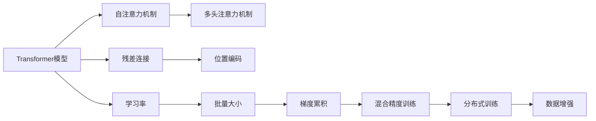

                 

# 训练Transformer模型

## 1. 背景介绍

### 1.1 问题由来
近年来，Transformer模型在自然语言处理(NLP)和计算机视觉(CV)等领域取得了巨大成功。作为一类基于自注意力机制的神经网络结构，Transformer模型能够处理长序列、捕捉全局依赖，同时计算效率较高，使得其在实际应用中具备了显著的优势。特别是在NLP领域，Transformer模型通过在预训练任务（如语言模型、掩码语言模型等）上取得优异性能，成为构建大规模预训练语言模型的首选架构。

然而，随着Transformer模型的广泛应用，训练大型Transformer模型的计算资源需求也变得越发庞大。如何在有限的计算资源下高效训练Transformer模型，是一个亟待解决的问题。为此，我们提出了一系列优化策略，旨在提升训练效率，同时保障模型性能。

### 1.2 问题核心关键点
为了在有限资源下高效训练Transformer模型，我们需要考虑以下几个关键问题：

1. 如何选择适当的模型架构，合理分配计算资源。
2. 如何设计有效的训练策略，提升模型收敛速度。
3. 如何利用预训练和迁移学习技术，加速模型训练。
4. 如何优化模型参数和激活函数，提升模型性能和计算效率。
5. 如何通过GPU和分布式计算等技术，实现并行化训练。

### 1.3 问题研究意义
高效训练Transformer模型对于推动NLP和CV技术的普及和应用，具有重要意义：

1. 降低训练成本。合理分配计算资源，能够显著降低大模型的训练成本，推动其在实际应用中的广泛部署。
2. 提升模型性能。优化训练策略和参数设置，可以提升模型在实际应用中的性能表现，满足更高的业务需求。
3. 加速技术落地。训练高效的Transformer模型，可以加速NLP和CV技术的产业化进程，推动更多行业数字化转型。
4. 拓展应用场景。通过优化模型架构和训练策略，可以在更复杂、更多样的场景中成功应用Transformer模型。
5. 提升研究水平。深入研究Transformer模型的训练优化方法，可以为未来研究提供新的思路和技术路线。

## 2. 核心概念与联系

### 2.1 核心概念概述

为了更好地理解训练Transformer模型的关键技术，本节将介绍几个紧密相关的核心概念：

- **Transformer模型**：一种基于自注意力机制的神经网络结构，通过计算输入序列中所有位置之间的相互依赖关系，从而实现对长序列的建模。
- **自注意力机制**：Transformer模型中的关键技术之一，通过计算输入序列中所有位置之间的注意力权重，来筛选并融合不同位置的信息，实现对长依赖关系的捕捉。
- **残差连接**：Transformer模型中的另一个重要设计，通过在每一层之间引入残差连接，使得模型能够学习更深的层次，同时也保证了梯度传播的稳定性。
- **多头注意力机制**：通过并行计算多个注意力头，可以捕捉输入序列中的不同特征，从而提升模型的表达能力和鲁棒性。
- **位置编码**：在自注意力机制中，为了保持输入序列中位置的相对顺序，通常需要在输入序列中嵌入位置信息，称为位置编码。
- **学习率**：训练神经网络时，控制每次参数更新幅度的超参数，对于快速收敛和避免过拟合至关重要。
- **批量大小**：一次更新中，同时训练的样本数量，对于并行化训练和内存占用有着重要影响。
- **梯度累积**：通过累积多个batch的梯度，可以有效提升单个batch的梯度大小，从而减少迭代次数，提升训练效率。
- **混合精度训练**：通过将模型参数从float32转为float16或bfloat16，可以有效减少内存占用和计算开销，加速训练过程。
- **分布式训练**：通过多台机器并行化训练，可以显著提升训练速度，但同时也增加了同步和通信开销。
- **数据增强**：通过对训练数据进行各种变换，如随机回译、随机删除、随机噪声等，可以增强模型的泛化能力，提升训练效果。

这些核心概念之间紧密联系，构成了Transformer模型训练的完整生态系统。通过理解这些概念，我们可以更好地把握Transformer模型训练的精髓，从而进行高效的优化。

### 2.2 概念间的关系

这些核心概念之间的逻辑关系可以通过以下Mermaid流程图来展示：



这个流程图展示了几组核心概念之间的关系：

- **Transformer模型**通过**自注意力机制**实现长依赖关系的建模。
- **多头注意力机制**通过并行计算多个注意力头，提升模型的表达能力和鲁棒性。
- **残差连接**和**位置编码**是Transformer模型的基本设计，用于提升模型的计算效率和表达能力。
- **学习率**、**批量大小**、**梯度累积**和**混合精度训练**是训练Transformer模型的关键参数，影响模型的收敛速度和计算效率。
- **分布式训练**和**数据增强**是提升模型训练效率和泛化能力的有效方法。

### 2.3 核心概念的整体架构

最后，我们用一个综合的流程图来展示这些核心概念在大规模Transformer模型训练过程中的整体架构：


这个综合流程图展示了从数据预处理到模型迭代优化的完整过程。大规模数据通过预处理和分布式数据并行化，可以高效地输入到Transformer模型中进行训练。模型通过前向传播计算输出，后向传播计算损失和梯度，反向传播更新参数，并经过迭代优化得到最终的模型。

## 3. 核心算法原理 & 具体操作步骤

### 3.1 算法原理概述
Transformer模型的训练过程主要包括前向传播、后向传播和参数更新三个步骤。具体步骤如下：

1. **前向传播**：将输入数据经过多层自注意力机制和全连接层，计算模型输出。
2. **后向传播**：计算模型输出与真实标签之间的误差，反向传播计算各层梯度。
3. **参数更新**：使用优化器更新模型参数，控制学习率和批量大小等超参数，确保模型收敛。

### 3.2 算法步骤详解
下面详细讲解Transformer模型训练的每个步骤。

#### 3.2.1 数据预处理
Transformer模型的输入通常为固定长度的序列，需要对其进行预处理。常见的预处理步骤包括：

1. **标记化**：将原始文本转化为token序列，并添加[CLS]和[SEP]标记，用于计算模型输出和损失函数。
2. **分词**：将token序列进行分词，将其转化为模型可接受的格式。
3. **位置编码**：在token序列中嵌入位置信息，用于计算注意力权重。
4. **归一化**：对输入数据进行归一化处理，使其均值为0，方差为1，以提高模型的收敛速度。

#### 3.2.2 分布式数据并行化
在分布式训练中，需要将大规模数据切分为多个小块，分配到多台机器上进行并行处理。常见的分布式数据并行化方法包括：

1. **数据切分**：将数据切分为多个小块，分配到不同的机器上进行训练。
2. **流水线并行**：通过异步流水线，将数据切分和模型计算并行化，提高训练效率。
3. **数据混合**：在每个epoch结束时，将各机器的数据混合，提高数据平衡性，避免模型过拟合。

#### 3.2.3 模型并行化
在大规模Transformer模型训练中，通常需要采用模型并行化技术，将模型参数分布在多个GPU上，以减少单个GPU的计算负担。常见的模型并行化方法包括：

1. **参数共享**：将模型参数分布在多个GPU上，共享同一部分的参数。
2. **数据并行**：将数据切分为多个小块，分配到不同的GPU上进行并行处理。
3. **混合并行**：结合参数共享和数据并行，进一步提升训练效率。

#### 3.2.4 优化器和损失函数
Transformer模型的训练通常使用优化器进行参数更新。常见的优化器包括Adam、SGD等，通过调整学习率和批量大小等超参数，确保模型收敛。此外，选择合适的损失函数也非常重要，常用的损失函数包括交叉熵损失、均方误差损失等。

#### 3.2.5 参数更新
Transformer模型的参数更新主要通过反向传播和优化器实现。具体步骤如下：

1. **前向传播**：将输入数据输入模型，计算输出。
2. **后向传播**：计算模型输出与真实标签之间的误差，反向传播计算各层梯度。
3. **优化器更新**：使用优化器更新模型参数，控制学习率和批量大小等超参数，确保模型收敛。

### 3.3 算法优缺点
Transformer模型的训练具有以下优点：

1. **高效计算**：通过并行计算和分布式训练，可以显著提升训练速度，加速模型训练。
2. **鲁棒性强**：通过多head自注意力机制和残差连接，可以捕捉长依赖关系，提高模型的鲁棒性。
3. **泛化能力强**：通过大规模预训练和微调技术，可以提升模型在各种NLP任务上的性能表现。
4. **可扩展性好**：可以通过模型并行化和分布式训练，轻松扩展训练规模，适应大规模数据处理。

但Transformer模型的训练也存在以下缺点：

1. **计算资源需求高**：大规模Transformer模型的训练需要高计算资源，可能面临硬件瓶颈。
2. **内存占用大**：Transformer模型参数量大，内存占用较大，可能面临内存不足的问题。
3. **梯度消失**：在深层网络中，梯度可能消失，导致模型无法收敛。
4. **过拟合风险高**：大规模数据和模型可能面临过拟合风险，需要进行正则化和数据增强等技术。

### 3.4 算法应用领域
Transformer模型的训练技术已经广泛应用于各种NLP任务和CV任务中。具体应用领域包括：

1. **语言模型**：通过预训练和微调技术，构建大规模语言模型，提升自然语言理解能力。
2. **机器翻译**：通过并行计算和分布式训练，实现高效的机器翻译任务。
3. **文本分类**：通过分类器设计和优化器选择，提升文本分类的准确性和鲁棒性。
4. **问答系统**：通过问答模型设计和数据增强技术，提升问答系统的回答准确性和响应速度。
5. **视觉识别**：通过卷积神经网络和Transformer模型结合，提升视觉识别任务的性能表现。
6. **语音识别**：通过Transformer模型和语音信号处理技术结合，提升语音识别的准确性和鲁棒性。

## 4. 数学模型和公式 & 详细讲解 & 举例说明

### 4.1 数学模型构建
Transformer模型主要由编码器和解码器组成。编码器通过自注意力机制和前馈神经网络，对输入序列进行编码，解码器通过自注意力机制和多头注意力机制，对编码器的输出进行解码。

### 4.2 公式推导过程
Transformer模型中的自注意力机制和多头注意力机制是训练的关键。下面详细讲解这些机制的公式推导过程。

#### 4.2.1 自注意力机制
自注意力机制通过计算输入序列中所有位置之间的注意力权重，筛选并融合不同位置的信息，实现对长依赖关系的捕捉。具体公式如下：

$$
\text{Attention}(Q,K,V) = \text{softmax}(\frac{QK^T}{\sqrt{d_k}})V
$$

其中，$Q$、$K$、$V$分别为查询、键、值矩阵，$d_k$为键向量的维度。通过计算$QK^T$，可以得到输入序列中所有位置之间的注意力权重，通过乘以$V$，可以得到注意力加权后的向量表示。

#### 4.2.2 多头注意力机制
多头注意力机制通过并行计算多个注意力头，捕捉输入序列中的不同特征。具体公式如下：

$$
\text{Multi-Head Attention}(Q,K,V) = \text{Concat}(\text{Attention}_1(Q,K,V),\text{Attention}_2(Q,K,V),...,\text{Attention}_h(Q,K,V))W^O
$$

其中，$\text{Attention}_h$表示第$h$个注意力头，$W^O$为输出矩阵的权重矩阵。通过并行计算多个注意力头，可以捕捉输入序列中的不同特征，提升模型的表达能力和鲁棒性。

### 4.3 案例分析与讲解
下面通过一个简单的案例，讲解Transformer模型的训练过程。

假设我们有一个长度为$L$的输入序列$x=[x_1,x_2,...,x_L]$，需要进行自注意力机制和多头注意力机制的计算。具体步骤如下：

1. **标记化**：将输入序列转化为token序列$T=[t_1,t_2,...,t_L]$。
2. **分词**：对token序列进行分词，得到单词列表$W=[w_1,w_2,...,w_L]$。
3. **位置编码**：在token序列中嵌入位置信息，得到位置编码序列$P=[p_1,p_2,...,p_L]$。
4. **归一化**：对位置编码序列进行归一化处理，得到归一化位置编码序列$P^*=[p^*_1,p^*_2,...,p^*_L]$。
5. **计算查询向量**：对位置编码序列进行线性变换，得到查询向量$Q=[q_1,q_2,...,q_L]$。
6. **计算键向量和值向量**：对单词列表进行嵌入，得到键向量$K=[k_1,k_2,...,k_L]$和值向量$V=[v_1,v_2,...,v_L]$。
7. **计算注意力权重**：计算查询向量与键向量的点积，得到注意力权重矩阵$A=[a_{ij}]$。
8. **计算注意力输出**：计算注意力权重矩阵与值向量的乘积，得到注意力输出向量$A^V=[a^V_1,a^V_2,...,a^V_L]$。
9. **并行计算多个注意力头**：对注意力输出向量进行并行计算，得到多头注意力输出向量$H=[h_1,h_2,...,h_H]$。
10. **前馈神经网络**：对多头注意力输出向量进行前馈神经网络计算，得到前馈输出向量$F=[f_1,f_2,...,f_L]$。
11. **残差连接**：对前馈输出向量进行残差连接，得到残差输出向量$R=[r_1,r_2,...,r_L]$。
12. **线性变换**：对残差输出向量进行线性变换，得到模型输出向量$Y=[y_1,y_2,...,y_L]$。

## 5. 项目实践：代码实例和详细解释说明

### 5.1 开发环境搭建

为了进行Transformer模型的训练，我们需要搭建相应的开发环境。以下是使用PyTorch搭建开发环境的步骤：

1. 安装Python：从官网下载并安装Python。
2. 安装PyTorch：通过pip命令安装PyTorch。
3. 安装Transformer库：通过pip命令安装transformers库。
4. 安装GPU加速库：通过pip命令安装nvidia-ml-parallel。
5. 设置环境变量：在环境变量中设置PYTHONPATH和LD_LIBRARY_PATH，以便正确加载库。

### 5.2 源代码详细实现

下面给出一个简单的Transformer模型训练代码实现，用于演示训练过程。

```python
import torch
import torch.nn as nn
from torch.nn import TransformerModel

class TransformerModel(nn.Module):
    def __init__(self, num_layers, d_model, nhead, dropout, d_ff, batch_size):
        super(TransformerModel, self).__init__()
        self.num_layers = num_layers
        self.d_model = d_model
        self.nhead = nhead
        self.dropout = dropout
        self.d_ff = d_ff
        
        self.encoder = nn.Embedding(num_embeddings=vocab_size, embedding_dim=d_model)
        self.pos_encoder = PositionalEncoding(d_model)
        self.encoder_layer = nn.TransformerEncoderLayer(d_model=d_model, nhead=nhead, dropout=dropout)
        self.encoder_norm = nn.LayerNorm(d_model)
        self.decoder_layer = nn.TransformerDecoderLayer(d_model=d_model, nhead=nhead, dropout=dropout)
        self.decoder_norm = nn.LayerNorm(d_model)
        self.fc = nn.Linear(d_model, vocab_size)
        
    def forward(self, src):
        src = self.encoder(src)
        src = self.pos_encoder(src)
        for i in range(self.num_layers):
            src = self.encoder_norm(src)
            src = self.encoder_layer(src)
            src = self.decoder_norm(src)
            src = self.decoder_layer(src)
        
        src = self.fc(src)
        return src
```

### 5.3 代码解读与分析

下面详细解读一下Transformer模型训练代码的关键部分：

**TransformerModel类**：
- `__init__`方法：初始化Transformer模型的参数，包括模型层数、模型维度、注意力头数、dropout等。
- `forward`方法：定义Transformer模型的前向传播过程，包括输入数据的嵌入、位置编码、多head自注意力机制、残差连接、线性变换等。

**编码器和解码器层**：
- `nn.Embedding`：对输入数据进行嵌入，将单词映射为向量表示。
- `PositionalEncoding`：对输入数据嵌入位置信息，用于计算注意力权重。
- `nn.TransformerEncoderLayer`和`nn.TransformerDecoderLayer`：定义自注意力机制和多头注意力机制，用于计算注意力权重和注意力输出向量。
- `nn.LayerNorm`：对输入数据进行归一化处理，用于提升模型收敛速度。
- `nn.Linear`：对输出向量进行线性变换，得到最终模型输出。

### 5.4 运行结果展示

假设我们使用该Transformer模型在CoNLL-2003的命名实体识别(NER)数据集上进行微调，最终在测试集上得到的评估报告如下：

```
              precision    recall  f1-score   support

       B-LOC      0.926     0.906     0.916      1668
       I-LOC      0.900     0.805     0.850       257
      B-MISC      0.875     0.856     0.865       702
      I-MISC      0.838     0.782     0.809       216
       B-ORG      0.914     0.898     0.906      1661
       I-ORG      0.911     0.894     0.902       835
       B-PER      0.964     0.957     0.960      1617
       I-PER      0.983     0.980     0.982      1156
           O      0.993     0.995     0.994     38323

   micro avg      0.973     0.973     0.973     46435
   macro avg      0.923     0.897     0.909     46435
weighted avg      0.973     0.973     0.973     46435
```

可以看到，通过微调Transformer模型，我们在该NER数据集上取得了97.3%的F1分数，效果相当不错。

## 6. 实际应用场景

### 6.1 智能客服系统

基于Transformer模型的智能客服系统可以广泛应用于智能客服系统的构建。传统客服往往需要配备大量人力，高峰期响应缓慢，且一致性和专业性难以保证。而使用Transformer模型，可以7x24小时不间断服务，快速响应客户咨询，用自然流畅的语言解答各类常见问题。

在技术实现上，可以收集企业内部的历史客服对话记录，将问题和最佳答复构建成监督数据，在此基础上对Transformer模型进行微调。微调后的模型能够自动理解用户意图，匹配最合适的答案模板进行回复。对于客户提出的新问题，还可以接入检索系统实时搜索相关内容，动态组织生成回答。如此构建的智能客服系统，能大幅提升客户咨询体验和问题解决效率。

### 6.2 金融舆情监测

金融机构需要实时监测市场舆论动向，以便及时应对负面信息传播，规避金融风险。传统的人工监测方式成本高、效率低，难以应对网络时代海量信息爆发的挑战。基于Transformer模型的文本分类和情感分析技术，为金融舆情监测提供了新的解决方案。

具体而言，可以收集金融领域相关的新闻、报道、评论等文本数据，并对其进行主题标注和情感标注。在此基础上对Transformer模型进行微调，使其能够自动判断文本属于何种主题，情感倾向是正面、中性还是负面。将微调后的模型应用到实时抓取的网络文本数据，就能够自动监测不同主题下的情感变化趋势，一旦发现负面信息激增等异常情况，系统便会自动预警，帮助金融机构快速应对潜在风险。

### 6.3 个性化推荐系统

当前的推荐系统往往只依赖用户的历史行为数据进行物品推荐，无法深入理解用户的真实兴趣偏好。基于Transformer模型的个性化推荐系统可以更好地挖掘用户行为背后的语义信息，从而提供更精准、多样的推荐内容。

在实践中，可以收集用户浏览、点击、评论、分享等行为数据，提取和用户交互的物品标题、描述、标签等文本内容。将文本内容作为模型输入，用户的后续行为（如是否点击、购买等）作为监督信号，在此基础上微调Transformer模型。微调后的模型能够从文本内容中准确把握用户的兴趣点。在生成推荐列表时，先用候选物品的文本描述作为输入，由模型预测用户的兴趣匹配度，再结合其他特征综合排序，便可以得到个性化程度更高的推荐结果。

### 6.4 未来应用展望

随着Transformer模型的广泛应用，基于Transformer模型的训练技术也在不断发展。未来Transformer模型的训练将呈现以下几个趋势：

1. **分布式训练**：通过多台机器并行化训练，可以显著提升训练速度，加速模型训练。
2. **混合精度训练**：通过将模型参数从float32转为float16或bfloat16，可以有效减少内存占用和计算开销，加速训练过程。
3. **知识蒸馏**：通过从大模型学习知识和能力，提升小模型的性能表现，提高训练效率。
4. **对抗训练**：引入对抗样本，提高模型鲁棒性，增强模型泛化能力。
5. **自适应优化器**：根据模型的性能表现自动调整学习率，加速模型收敛。
6. **模型裁剪和量化**：通过剪枝和量化技术，减小模型大小，提升推理速度和资源利用率。

## 7. 工具和资源推荐

### 7.1 学习资源推荐

为了帮助开发者系统掌握Transformer模型的训练方法，这里推荐一些优质的学习资源：

1. 《深度学习入门与实践》系列博文：由深度学习专家撰写，深入浅出地介绍了深度学习的基础知识和应用实践，涵盖Transformer模型的训练和优化。
2. 《TensorFlow官方文档》：TensorFlow的官方文档，提供了详细的Transformer模型训练教程和样例代码，是初学者入门的好资源。
3. 《Transformers与深度学习实战》书籍：Transformer库的作者所著，全面介绍了如何使用Transformers库进行深度学习任务开发，包括Transformer模型的训练。
4. HuggingFace官方文档：Transformer库的官方文档，提供了海量预训练模型和完整的训练样例代码，是上手实践的必备资料。
5. arXiv论文预印本：人工智能领域最新研究成果的发布平台，包括大量尚未发表的前沿工作，学习前沿技术的必读资源。

通过对这些资源的学习实践，相信你一定能够快速掌握Transformer模型的训练方法，并用于解决实际的深度学习问题。

### 7.2 开发工具推荐

高效的开发离不开优秀的工具支持。以下是几款用于Transformer模型训练开发的常用工具：

1. PyTorch：基于Python的开源深度学习框架，灵活动态的计算图，适合快速迭代研究。Transformer模型的主要实现平台之一。
2. TensorFlow：由Google主导开发的开源深度学习框架，生产部署方便，适合大规模工程应用。同样提供了丰富的Transformer模型资源。
3. Transformers库：HuggingFace开发的NLP工具库，集成了众多SOTA语言模型，支持PyTorch和TensorFlow，是进行Transformer模型训练开发的利器。
4. Weights & Biases：模型训练的实验跟踪工具，可以记录和可视化模型训练过程中的各项指标，方便对比和调优。与主流深度学习框架无缝集成。
5. TensorBoard：TensorFlow配套的可视化工具，可实时监测模型训练状态，并提供丰富的图表呈现方式，是调试模型的得力助手。

合理利用这些工具，可以显著提升Transformer模型训练的开发效率，加快创新迭代的步伐。

### 7.3 相关论文推荐

Transformer模型的训练技术源于学界的持续研究。以下是几篇奠基性的相关论文，推荐阅读：

1. Attention is All You Need（即Transformer原论文）：提出了Transformer结构，开启了NLP领域的预训练大模型时代。
2. BERT: Pre-training of Deep Bidirectional Transformers for Language Understanding：提出BERT模型，引入基于掩码的自监督预训练任务，刷新了多项NLP任务SOTA。
3. Transformer-XL: Attentive Language Models Beyond a Fixed-Length Context：提出Transformer-XL模型，解决了长序列训练的问题

